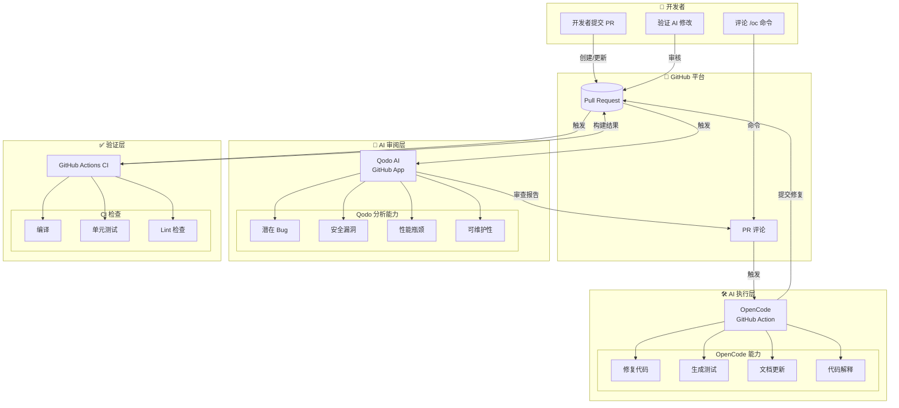
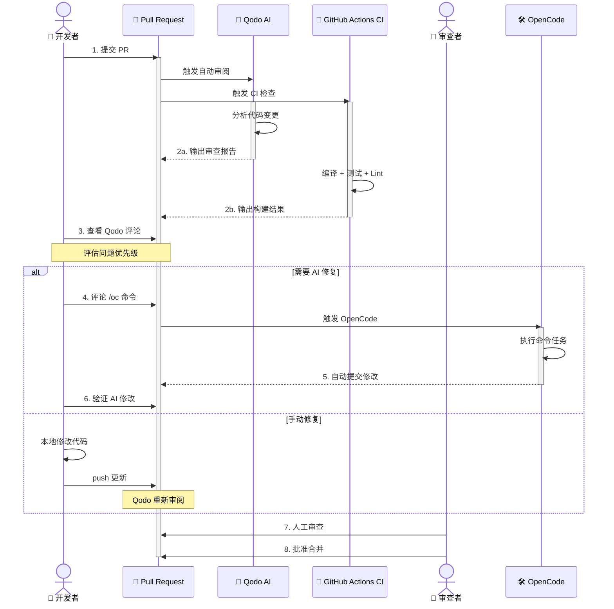

# AI PR Review 流程

> Qodo AI + OpenCode 组合工作流，实现高效、智能的自动化代码审查

## 概述

Aries AI 项目的 PR 审查流程采用**双层 AI 自动化架构**：第一层由 **Qodo AI** 在 PR 创建/更新时自动触发审阅，第二层由 **OpenCode** 通过评论命令按需执行代码修复和改进任务。两者协同工作，大幅提升代码审查效率和质量。

### 工具角色分工

| 工具 | 角色 | 触发方式 | 模型 |
|------|------|----------|------|
| **Qodo AI** | 自动审阅者 | PR 创建/更新时自动触发 | Qodo 内置模型 |
| **OpenCode** | 代码执行者 | 评论 `/oc` 命令触发 | 阿里编码计划 (Qwen3.5 Plus) |
| **GitHub Actions CI** | 构建验证 | PR 创建/更新时自动触发 | N/A（编译、单元测试、Lint） |

### 核心设计理念

AI PR Review 流程的设计遵循以下原则：

- **自动化优先**：PR 提交后即刻触发 AI 审查，无需人工干预即可获得初步反馈
- **人机协同**：Qodo 自动发现问题，开发者评估后通过 OpenCode 精准委托 AI 修复
- **权限控制**：OpenCode 仅对 Owner/Member/Collaborator 开放，防止未授权操作
- **职责分离**：审查（Qodo）与执行（OpenCode）分离，确保修改经过人工确认

---

## 架构

### 系统架构图



### 架构说明

1. **开发者层**：开发者提交 PR 后，系统自动启动审查流程。当 Qodo 发现问题时，开发者可通过评论 `/oc` 命令委托 OpenCode 修复。

2. **AI 审阅层（Qodo AI）**：作为 GitHub App 安装在仓库中，在 PR 创建或更新时自动分析代码变更，输出涵盖代码质量、安全性、性能和可维护性四个维度的审查报告。

3. **AI 执行层（OpenCode）**：通过 GitHub Actions 工作流实现，仅当授权用户评论包含 `/oc` 或 `/opencode` 命令时触发，利用阿里编码计划的 AI 模型执行具体的代码修改任务。

4. **验证层（GitHub Actions CI）**：并行运行编译、单元测试和 Lint 检查，作为代码质量的最后防线。

---

## 一、Qodo AI — 自动审阅

### 1.1 安装与配置

Qodo AI 已作为 GitHub App 安装在仓库中，无需额外配置即可自动工作。

> Source: [AI_PR_REVIEW.md](https://github.com/ZG0704666/Aries-AI/blob/main/docs/AI_PR_REVIEW.md#L40-L43)

### 1.2 触发时机

- **PR 创建时**：新 PR 提交后自动触发全面代码审查
- **PR 有新提交时**：后续每次 push 更新自动重新审查

> Source: [AI_PR_REVIEW.md](https://github.com/ZG0704666/Aries-AI/blob/main/docs/AI_PR_REVIEW.md#L44-L47)

### 1.3 审阅内容

Qodo AI 会自动分析并提供以下维度的审查：

| 维度 | 检测内容 | 优先级 |
|------|----------|--------|
| **代码质量** | 潜在 bug、代码异味、最佳实践违规 | 🔴 高 |
| **安全性** | 敏感信息泄露、安全漏洞 | 🔴 高 |
| **性能** | 性能瓶颈、资源浪费、优化建议 | 🟡 中 |
| **可维护性** | 代码结构、命名规范、注释完整性 | 🟢 低 |

> Source: [AI_PR_REVIEW.md](https://github.com/ZG0704666/Aries-AI/blob/main/docs/AI_PR_REVIEW.md#L49-L56)

### 1.4 查看审阅结果

有两种方式查看 Qodo 的审查结果：

1. **Conversation 标签**：在 PR 页面的 "Conversation" 标签页查看 Qodo 的总结性评论
2. **Files changed 标签**：在 "Files changed" 标签页查看具体代码行的行内评论

> Source: [AI_PR_REVIEW.md](https://github.com/ZG0704666/Aries-AI/blob/main/docs/AI_PR_REVIEW.md#L58-L62)

### 1.5 优先级处理策略

根据 Qodo 建议的优先级采取不同行动：

- 🔴 **高优先级（Bug、安全问题）**：必须修复后合并
- 🟡 **中优先级（性能、代码质量）**：建议修复
- 🟢 **低优先级（命名、风格）**：可选修复

> Source: [CONTRIBUTING.md](https://github.com/ZG0704666/Aries-AI/blob/main/CONTRIBUTING.md#L328-L335)

---

## 二、OpenCode — 按需执行

### 2.1 触发命令

在 PR 上评论以下命令可触发 OpenCode：

| 命令 | 说明 |
|------|------|
| `/oc` | 触发 OpenCode（短命令） |
| `/opencode` | 触发 OpenCode（完整命令） |

> Source: [AI_PR_REVIEW.md](https://github.com/ZG0704666/Aries-AI/blob/main/docs/AI_PR_REVIEW.md#L68-L75)

### 2.2 权限控制

以下角色的用户才能触发 OpenCode：

- 仓库 **Owner**
- 组织 **Member**
- 协作者 **Collaborator**

> Source: [AI_PR_REVIEW.md](https://github.com/ZG0704666/Aries-AI/blob/main/docs/AI_PR_REVIEW.md#L175-L182)

### 2.3 OpenCode 的权限范围

OpenCode 在执行任务时具有以下权限：

- 读取仓库代码
- 提交修改到 PR 分支
- 评论 PR/Issue

> Source: [AI_PR_REVIEW.md](https://github.com/ZG0704666/Aries-AI/blob/main/docs/AI_PR_REVIEW.md#L184-L189)

### 2.4 常用命令示例

#### 修复问题

```
/oc 修复 Qodo 指出的空指针问题
```

```
/oc 根据 Qodo 的建议优化这段代码的性能
```

#### 代码解释

```
/oc 解释一下这个 PR 的主要改动
```

```
/oc 这个函数是做什么的？有什么潜在问题？
```

#### 代码改进

```
/oc 为这个新增的类添加单元测试
```

```
/oc 重构这个方法，使其更易读
```

#### 文档更新

```
/oc 更新 README.md，添加新功能的说明
```

> Source: [AI_PR_REVIEW.md](https://github.com/ZG0704666/Aries-AI/blob/main/docs/AI_PR_REVIEW.md#L78-L113)

---

## 三、组合使用场景

### 场景 1：修复 Qodo 发现的问题

```
┌─ Qodo 评论 ─────────────────────────────────┐
│ ⚠️ 第 42 行：可能存在空指针异常               │
│ 建议：添加空值检查                            │
└──────────────────────────────────────────────┘

你的回复：
/oc 修复 Qodo 指出的第 42 行空指针问题
```

### 场景 2：批量处理多个问题

```
/oc 根据 Qodo 的审查意见，修复以下问题：
1. 第 15 行的命名不规范
2. 第 42 行缺少异常处理
3. 第 78 行的性能问题
```

### 场景 3：请求优化建议

```
/oc 分析 Qodo 提到的性能问题，给出具体的优化方案并实现
```

### 场景 4：代码审查辅助

```
/oc 检查这个 PR 是否有遗漏的边界情况处理
```

> Source: [AI_PR_REVIEW.md](https://github.com/ZG0704666/Aries-AI/blob/main/docs/AI_PR_REVIEW.md#L117-L150)

---

## 核心流程

### PR 审查完整序列图



### 流程速记

```
PR 提交 → Qodo 审阅 → CI 验证 → 评论 /oc → OpenCode 执行 → 验证修改 → 人工审查 → 合并
```

---

## 使用示例

### 基本用法：提交 PR 后的完整流程

```bash
# 1. 创建功能分支并开发
git checkout -b feature/tool-get-page-info-张三
# ... 编写代码 ...

# 2. 提交并推送
git add .
git commit -m "feat(tool): 新增get_page_info工具-张三"
git push origin feature/tool-get-page-info-张三

# 3. 创建 PR（在 GitHub 网页操作）
#    → Qodo AI 自动审阅（约 1-2 分钟）
#    → CI 自动编译和测试

# 4. 查看 Qodo 审阅结果
#    PR 页面 → Conversation 标签 → 查看 Qodo 评论

# 5. 针对问题通过 OpenCode 修复
#    在 PR 评论中输入：
#    /oc 修复 Qodo 指出的空指针问题
```

> Sources:
> - [GIT_WORKFLOW.md](https://github.com/ZG0704666/Aries-AI/blob/main/docs/GIT_WORKFLOW.md#L470-L493)
> - [AI_PR_REVIEW.md](https://github.com/ZG0704666/Aries-AI/blob/main/docs/AI_PR_REVIEW.md#L81-L83)

### 高级用法：批量委托修复

```bash
# 在 PR 评论中发送批量修复指令
/oc 根据 Qodo 的审查意见，修复以下问题：
1. 第 15 行的命名不符合 Kotlin 规范
2. 第 42 行缺少 try-catch 异常处理
3. 第 78 行的循环存在性能问题，建议使用序列操作
```

> Source: [AI_PR_REVIEW.md](https://github.com/ZG0704666/Aries-AI/blob/main/docs/AI_PR_REVIEW.md#L133-L138)

### 查看 CI/CD 检查结果

```bash
# 在 PR 页面上：
# 1. CI 状态：PR 页面 → "Checks" 标签 → 查看编译/测试/Lint 结果
# 2. Qodo 审阅：PR 页面 → "Conversation" 标签 → 查看 Qodo 评论
# 3. 构建产物：CI 成功后下载 Debug APK
```

> Source: [CONTRIBUTING.md](https://github.com/ZG0704666/Aries-AI/blob/main/CONTRIBUTING.md#L294-L298)

---

## 配置选项

### OpenCode 工作流配置

**文件**: `.github/workflows/opencode.yml`

| 配置项 | 类型 | 值 | 说明 |
|--------|------|-----|------|
| `on.issue_comment.types` | array | `[created]` | 监听 Issue/PR 评论创建事件 |
| `on.pull_request_review_comment.types` | array | `[created]` | 监听 PR 审阅评论创建事件 |
| `jobs.opencode.if` | expression | 复合条件 | 触发条件：命令匹配 + 权限验证 + PR 上下文 |
| `jobs.opencode.runs-on` | string | `ubuntu-latest` | 运行环境 |
| `permissions.contents` | string | `write` | 代码写入权限 |
| `permissions.pull-requests` | string | `write` | PR 操作权限 |
| `permissions.issues` | string | `write` | Issue 操作权限 |
| `permissions.id-token` | string | `write` | OIDC 令牌权限 |
| `steps[0].uses` | string | `actions/checkout@v4` | 检出仓库代码 |
| `steps[1].uses` | string | `anomalyco/opencode/github@latest` | 运行 OpenCode Action |
| `steps[1].with.model` | string | `alibaba-coding-plan/qwen3.5-plus` | 默认 AI 模型 |

> Source: [AI_PR_REVIEW.md](https://github.com/ZG0704666/Aries-AI/blob/main/docs/AI_PR_REVIEW.md#L196-L247)

### OpenCode 模型配置

**文件**: `.opencode/opencode.json`

| 配置项 | 类型 | 值 | 说明 |
|--------|------|-----|------|
| `provider` | object | `alibaba-coding-plan` | AI 提供商 |
| `provider.*.npm` | string | `@ai-sdk/openai-compatible` | SDK 包名 |
| `provider.*.options.baseURL` | string | `https://coding.dashscope.aliyuncs.com/v1` | API 端点 |
| `provider.*.options.apiKey` | string | `{env:ALIBABA_CODING_PLAN_API_KEY}` | API Key（从环境变量读取） |

> Source: [AI_PR_REVIEW.md](https://github.com/ZG0704666/Aries-AI/blob/main/docs/AI_PR_REVIEW.md#L249-L272)

### 可用模型

修改工作流中的 `model` 参数即可切换：

| 模型 ID | 说明 | 适用场景 |
|---------|------|----------|
| `qwen3.5-plus` | 通义千问 3.5 Plus | 通用编程任务（默认） |
| `glm-5` | 智谱 GLM-5 | 代码理解、生成 |
| `kimi-k2.5` | Moonshot Kimi | 长文本、多模态 |
| `MiniMax-M2.5` | MiniMax | 快速响应 |

> Source: [AI_PR_REVIEW.md](https://github.com/ZG0704666/Aries-AI/blob/main/docs/AI_PR_REVIEW.md#L277-L284)

### 触发条件详解

OpenCode 工作流的触发条件是一个复合逻辑表达式，包含三个层面的验证：

1. **命令格式验证**：评论内容必须包含 `/oc` 或 `/opencode`（作为空格前缀或行首）
2. **权限验证**：评论者必须是 `OWNER`、`MEMBER` 或 `COLLABORATOR`
3. **上下文验证**：对于 `issue_comment` 事件，确保关联的是一个 PR 而非独立 Issue

> Source: [AI_PR_REVIEW.md](https://github.com/ZG0704666/Aries-AI/blob/main/docs/AI_PR_REVIEW.md#L208-L225)

---

## API 参考

### 命令接口

#### `POST /repos/{owner}/{repo}/issues/{number}/comments`

通过 PR 评论触发 OpenCode 执行任务。

**请求体格式:**

```json
{
  "body": "/oc <任务描述>"
}
```

**参数说明:**

| 参数 | 类型 | 必需 | 说明 |
|------|------|------|------|
| `body` | string | 是 | 评论内容，必须以 `/oc` 或 `/opencode` 开头或包含 ` /oc` 或 ` /opencode` |

**有效命令示例:**

| 命令 | 分类 |
|------|------|
| `/oc 修复 [具体问题]` | 修复 |
| `/oc 解释 [文件/函数]` | 解释 |
| `/oc 为 [类/方法] 添加单元测试` | 测试 |
| `/oc 优化 [文件] 的性能` | 优化 |
| `/oc 更新 README，添加 [功能] 的说明` | 文档 |
| `/opencode 重构 [方法]` | 重构 |

**返回:** OpenCode 将自动在 PR 上评论执行结果，并将代码修改推送到 PR 分支。

**权限要求:**
- 评论者必须是仓库 Owner、Organization Member 或 Collaborator
- 必须在 PR 上下文中（对独立 Issue 评论不会触发）

**响应时间:** 通常在 30 秒到 2 分钟内完成执行。

> Source: [AI_PR_REVIEW.md](https://github.com/ZG0704666/Aries-AI/blob/main/docs/AI_PR_REVIEW.md#L326-L343)

---

## 故障排查

### OpenCode 没有响应

**可能原因：**
1. Secret（`ALIBABA_CODING_PLAN_API_KEY`）未配置或失效
2. 评论者没有权限（非 Owner/Member/Collaborator）
3. 命令格式不正确（缺少空格或斜杠）
4. 工作流正在运行中（同一 PR 的前一个 OpenCode 任务未完成）

**解决方法：**
1. 检查 GitHub 仓库的 Secrets 设置
2. 确认评论者为授权角色
3. 使用正确的命令格式：`/oc` 或 `/opencode`（注意空格）
4. 等待当前任务完成后再发送新命令

### Qodo 没有审阅

**可能原因：**
1. Qodo GitHub App 未正确安装或权限不足
2. PR 处于 draft（草稿）状态

**解决方法：**
1. 检查 GitHub App 安装状态和仓库权限
2. 将 PR 标记为 "Ready for review"

### API 错误

**可能原因：**
- 阿里编码计划 API Key 过期或额度用尽

**解决方法：**
1. 登录阿里云控制台检查 API Key 状态
2. 必要时在 GitHub Secrets 中更新 `ALIBABA_CODING_PLAN_API_KEY`

> Source: [AI_PR_REVIEW.md](https://github.com/ZG0704666/Aries-AI/blob/main/docs/AI_PR_REVIEW.md#L288-L321)

---

## 最佳实践

### ✅ 推荐做法

1. **先等待 Qodo 审阅**：PR 创建后等待 1-2 分钟让 Qodo 完成分析，再决定后续操作
2. **针对性使用 OpenCode**：根据 Qodo 的具体建议精准触发任务，而非泛泛的"修复所有问题"
3. **验证 AI 修改**：OpenCode 生成的代码也需要人工审核确认，不要盲目合并
4. **分段处理**：复杂任务拆分为多个小命令，每次只处理一个明确的问题

### ❌ 避免做法

1. **不要模糊命令**：
   - ❌ `/oc 修复所有问题`
   - ✅ `/oc 修复 ConversationTranscript.kt 第 15 行的命名问题`

2. **不要忽略 Qodo 警告**：特别是安全相关的高优先级问题

3. **不要在 main 分支直接使用**：OpenCode 只在 PR 分支上工作

4. **不要跳过 CI 验证**：即使 AI 修复了代码，仍需等待 CI 全绿再合并

> Source: [AI_PR_REVIEW.md](https://github.com/ZG0704666/Aries-AI/blob/main/docs/AI_PR_REVIEW.md#L154-L171)

---

## CI/CD 工作流总览

| 工作流 | 触发时机 | 检查内容 | 预期耗时 |
|--------|---------|---------|----------|
| **GitHub Actions CI** | PR 创建/更新 | 编译、单元测试、Lint | ~3-5 分钟 |
| **Qodo Merge** | PR 创建/更新 | 代码审阅、安全分析、性能建议 | ~1-2 分钟 |
| **Qodo Cover** | PR 创建 | 检测测试缺口、生成单元测试 | ~1-2 分钟 |
| **OpenCode** | 评论 `/oc` 命令 | 代码修复、测试生成、文档更新 | ~1-2 分钟 |

> Source: [CONTRIBUTING.md](https://github.com/ZG0704666/Aries-AI/blob/main/CONTRIBUTING.md#L286-L292)

---

## 相关链接

- [AI Automated PR Review Guide](./AI_PR_REVIEW.md) — 原始 AI PR 审阅指南
- [Git 工作流](./GIT_WORKFLOW.md) — 分支策略与 PR 流程
- [贡献者指南](../CONTRIBUTING.md) — 完整贡献流程
- [FAQ](./FAQ.md) — 常见问题解答

**源代码配置参考：**
- OpenCode 工作流配置：[AI_PR_REVIEW.md](https://github.com/ZG0704666/Aries-AI/blob/main/docs/AI_PR_REVIEW.md#L196-L247)
- OpenCode 模型配置：[AI_PR_REVIEW.md](https://github.com/ZG0704666/Aries-AI/blob/main/docs/AI_PR_REVIEW.md#L249-L272)
- CI/CD 流程说明：[CONTRIBUTING.md](https://github.com/ZG0704666/Aries-AI/blob/main/CONTRIBUTING.md#L282-L335)

---

**文档版本**：v1.0  
**最后更新**：2026-03-22  
**维护人**：ZG0704666