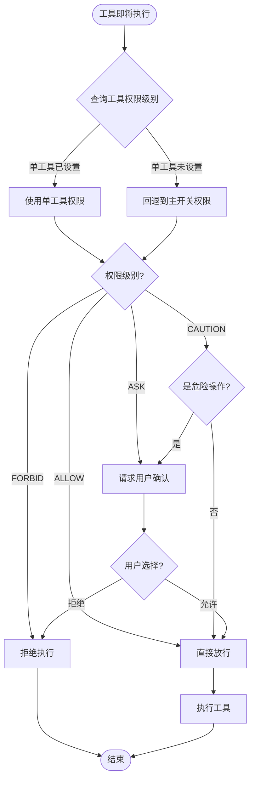

# 工具注册与权限管理

Aries AI 的工具注册与权限管理系统负责将所有 AI 可调用的操作（UI 交互、应用管理、文件系统、网络请求等）统一注册到工具处理器中，并通过四级权限模型对工具执行进行安全管控。

## 概述

在 Aries AI 自动化框架中，AI 模型通过调用"工具（Tool）"来与 Android 系统进行交互。工具注册与权限管理子系统解决了两个核心问题：

1. **工具注册**：将所有可用的原子操作（点击、滑动、截图、启动应用、文件读写、HTTP 请求等）以统一的方式注册到 `AIToolHandler` 中，供 AI 模型按名称查找和调用。
2. **权限管理**：在执行工具前，通过 `ToolPermissionSystem` 进行权限检查，防止危险操作在用户不知情的情况下被执行。支持全局主开关和单工具粒度的权限控制。

**设计意图**：将工具的"能力注册"和"安全管控"解耦。`ToolRegistration` 只负责声明哪些能力可用，`ToolPermissionSystem` 独立决定是否允许执行。这种分离使得新增工具时只需关注能力实现，无需修改权限逻辑。

## 架构

```mermaid
flowchart TD
    subgraph RegistrationLayer["注册层"]
        TR[ToolRegistration<br/>工具注册中心]
        NTE[NetworkToolExecutor<br/>网络工具执行器]
        FTE[FileToolExecutor<br/>文件工具执行器]
    end

    subgraph CoreLayer["核心层"]
        ATH[AIToolHandler<br/>工具处理器]
        TE[ToolExecutor<br/>执行器接口]
        APM[AppPackageManager<br/>包名管理器]
    end

    subgraph PermissionLayer["权限层"]
        TPS[ToolPermissionSystem<br/>工具权限系统]
        TPR[ToolPermissionsRepository<br/>权限持久化存储]
    end

    subgraph ModelLayer["数据模型层"]
        AIT[AITool<br/>工具定义]
        TRES[ToolResult<br/>执行结果]
        SRD[StringResultData]
        IRD[ImageResultData]
        UARD[UIActionResultData]
    end

    subgraph ExternalLayer["外部依赖"]
        AC[PhoneAgentAccessibilityService<br/>无障碍服务]
        DS[(DataStore<br/>持久化存储)]
    end

    TR -->|registerAllTools| ATH
    NTE -->|注册网络工具| ATH
    FTE -->|注册文件工具| ATH
    ATH -->|存储/调用| TE
    ATH -->|dangerCheck| TPS
    TPS -->|读写权限配置| TPR
    TPR --> DS
    APM -->|launch_app 包名解析| AC
    ATH -->|构建/传递| AIT
    TE -->|返回| TRES
    TRES --> SRD
    TRES --> IRD
    TRES --> UARD
```



### 架构说明

- **注册层**：`ToolRegistration` 是工具注册的入口，将 UI 工具、应用工具、系统工具直接注册到 `AIToolHandler`，同时委托 `registerNetworkTools` 和 `registerFileTools` 注册网络和文件工具。
- **核心层**：`AIToolHandler` 利用 `ConcurrentHashMap` 维护三个注册表——工具执行器、危险检查函数和操作描述生成器。`ToolExecutor` 是函数式接口，定义了统一的执行契约。
- **权限层**：`ToolPermissionSystem` 在工具执行前进行权限拦截，`ToolPermissionsRepository` 基于 Jetpack DataStore 持久化权限配置。
- **数据模型层**：`AITool` 描述工具名称和参数列表，`ToolResult` 通过密封类 `ToolResultData` 支持多种结果类型（字符串、图片、UI 操作等）。

## 工具注册流程

### 注册入口

所有工具的注册入口是 `ToolRegistration.registerAllTools()`，在 `AutomationViewModel.initializeToolSystem()` 中被调用：

```kotlin
private fun initializeToolSystem() {
    try {
        val toolHandler = AIToolHandler.getInstance(appContext)
        ToolRegistration.registerAllTools(toolHandler, appContext)
        appendLog("✅ 工具系统初始化完成")
    } catch (e: Exception) {
        Log.e("AutomationViewModel", "工具系统初始化失败: ${e.message}", e)
        appendLog("⚠️ 工具系统初始化失败: ${e.message}")
    }
}
```
> Source: [AutomationViewModel.kt](https://github.com/ZG0704666/Aries-AI/blob/main/app/src/main/java/com/ai/phoneagent/viewmodel/AutomationViewModel.kt#L645-L654)

### 注册分类

`registerAllTools` 按类别分步注册，涵盖五大工具类别：

```kotlin
fun registerAllTools(handler: AIToolHandler, context: Context) {
    registerUITools(handler, context)
    registerAppTools(handler, context)
    registerSystemTools(handler, context)
    registerNetworkTools(handler, context)
    registerFileTools(handler, context)
    // ... 统计日志 ...
}
```
> Source: [ToolRegistration.kt](https://github.com/ZG0704666/Aries-AI/blob/main/app/src/main/java/com/ai/phoneagent/core/tools/ToolRegistration.kt#L46-L65)

| 类别 | 工具名称 | 用途 |
|------|---------|------|
| **UI 工具** | `tap`, `swipe`, `screenshot`, `get_ui_tree`, `get_page_info`, `press_back`, `press_home`, `input_text`, `click_element`, `set_input_text`, `wait_for_element`, `press_key`, `get_current_app`, `scroll_to_element`, `find_elements` | 屏幕交互、UI 树获取、元素查找与操作 |
| **应用工具** | `launch_app`, `get_installed_apps`, `get_current_package` | 应用启动与管理 |
| **系统工具** | `wait`, `finish` | 流程控制（等待、结束任务） |
| **网络工具** | `http_get`, `http_post`, `download`, `ping`, `get_ip`, `dns_lookup` | HTTP 请求、文件下载、网络诊断 |
| **文件工具** | `read_file`, `write_file`, `delete`, `list_dir`, `create_dir`, `exists`, `copy`, `move`, `file_info`, `compress` | 文件系统读写与管理 |

### 工具注册 API

每个工具通过 `AIToolHandler.registerTool()` 注册，包含三个核心回调：

```kotlin
fun registerTool(
    name: String,
    dangerCheck: ((AITool) -> Boolean)? = null,
    descriptionGenerator: ((AITool) -> String)? = null,
    executor: ToolExecutor
)
```
> Source: [AIToolHandler.kt](https://github.com/ZG0704666/Aries-AI/blob/main/app/src/main/java/com/ai/phoneagent/core/tools/AIToolHandler.kt#L45-L50)

| 参数 | 类型 | 说明 |
|------|------|------|
| `name` | `String` | 工具的唯一名称，AI 模型通过此名称调用工具 |
| `dangerCheck` | `((AITool) -> Boolean)?` | 可选，判断当前工具调用是否为危险操作。返回 `true` 表示危险，会触发权限检查 |
| `descriptionGenerator` | `((AITool) -> String)?` | 可选，生成人类可读的操作描述，用于权限确认弹窗 |
| `executor` | `ToolExecutor` | 工具的实际执行逻辑，是一个 `suspend (AITool) -> ToolResult` 的函数式接口 |

**设计意图**：`dangerCheck` 和 `descriptionGenerator` 接受 `AITool` 参数（而非仅工具名），使得判断逻辑可以基于具体参数值做出决策。例如，`delete` 工具始终标记为危险操作（`{ true }`），而 `tap` 始终安全（`{ false }`）。

## 权限管理系统

### 四级权限模型

`ToolPermissionSystem` 定义了四级权限级别：

```kotlin
enum class PermissionLevel {
    ALLOW,      // 自动允许所有操作
    CAUTION,    // 危险操作需确认，普通操作自动允许
    ASK,        // 所有操作都需确认
    FORBID      // 禁止所有操作
}
```
> Source: [ToolPermissionSystem.kt](https://github.com/ZG0704666/Aries-AI/blob/main/app/src/main/java/com/ai/phoneagent/permissions/ToolPermissionSystem.kt#L41-L46)

| 级别 | 行为 | 适用场景 |
|------|------|---------|
| `ALLOW` | 所有工具自动放行，不弹出任何确认 | 完全信任的自动化环境 |
| `CAUTION`（默认） | 危险操作需确认，普通操作自动放行 | 日常使用，平衡安全与效率 |
| `ASK` | 所有工具执行前都需要用户确认 | 对安全性要求极高的场景 |
| `FORBID` | 所有工具执行被拒绝 | 临时禁用自动化能力 |

### 权限粒度

系统支持两层粒度的权限控制：

1. **全局主开关**（`master_switch`）：对所有工具生效的默认权限级别，默认值为 `CAUTION`。
2. **单工具权限**（`tool_<toolName>`）：可为每个工具单独设置权限级别，覆盖主开关。

单工具权限未设置时，自动回退到主开关：

```kotlin
fun getToolPermissionLevel(toolName: String): PermissionLevel {
    val value = toolPermissionsRepository.getToolPermissionBlocking(toolName)
    return if (value != null) {
        try { PermissionLevel.valueOf(value) }
        catch (e: Exception) { getMasterPermissionLevel() }
    } else {
        getMasterPermissionLevel()
    }
}
```
> Source: [ToolPermissionSystem.kt](https://github.com/ZG0704666/Aries-AI/blob/main/app/src/main/java/com/ai/phoneagent/permissions/ToolPermissionSystem.kt#L70-L81)

### 权限检查流程



核心检查逻辑实现：

```kotlin
suspend fun checkPermission(tool: AITool, onNeedConfirm: suspend (String) -> Boolean): Boolean {
    val toolLevel = getToolPermissionLevel(tool.name)

    if (toolLevel == PermissionLevel.FORBID) {
        Log.d(TAG, "Tool ${tool.name} is forbidden")
        return false
    }

    if (toolLevel == PermissionLevel.ALLOW) {
        Log.d(TAG, "Tool ${tool.name} is allowed")
        return true
    }

    if (toolLevel == PermissionLevel.CAUTION) {
        val isDangerous = toolHandler.isDangerousOperation(tool)
        if (!isDangerous) {
            Log.d(TAG, "Tool ${tool.name} is not dangerous, auto allow")
            return true
        }
    }

    // 需要用户确认
    val description = toolHandler.getOperationDescription(tool)
    Log.d(TAG, "Tool ${tool.name} needs confirmation: $description")
    return onNeedConfirm(description)
}
```
> Source: [ToolPermissionSystem.kt](https://github.com/ZG0704666/Aries-AI/blob/main/app/src/main/java/com/ai/phoneagent/permissions/ToolPermissionSystem.kt#L94-L122)

**设计意图**：`CAUTION` 模式下利用 `dangerCheck` 回调进行智能判断——只有确认为危险的操作才打断用户，普通操作自动放行。危险判定逻辑由工具注册时提供，与权限系统解耦。

### 危险操作判定

工具注册时通过 `dangerCheck` 参数声明危险判定逻辑。以下是不同工具的危险判定策略：

| 工具 | `dangerCheck` | 原因 |
|------|--------------|------|
| `tap`, `swipe`, `screenshot` 等 UI 工具 | `{ false }` | UI 操作在用户可见范围内，风险可控 |
| `launch_app` | `{ false }` | 启动应用本身不造成数据损失 |
| `read_file`, `write_file`, `copy` 等 | `{ false }` | 读写文件风险较低 |
| `delete` | `{ true }` | 删除操作不可逆，始终视为危险 |
| `move` | `{ true }` | 移动/重命名可能造成数据丢失 |

```kotlin
// 文件删除 — 始终标记为危险操作
handler.registerTool(
    name = "delete",
    dangerCheck = { true },
    descriptionGenerator = { tool ->
        val path = tool.parameters.find { it.name == "path" }?.value ?: ""
        "删除: $path"
    },
    executor = { tool -> FileToolExecutor.delete(tool) }
)
```
> Source: [FileToolExecutor.kt](https://github.com/ZG0704666/Aries-AI/blob/main/app/src/main/java/com/ai/phoneagent/core/tools/file/FileToolExecutor.kt#L411-L421)

## 权限持久化

`ToolPermissionsRepository` 使用 Jetpack DataStore 存储权限配置，数据文件名为 `tool_permissions`。

### 存储结构

| 键 | 类型 | 默认值 | 说明 |
|----|------|--------|------|
| `master_switch` | `String` | `"CAUTION"` | 全局主开关级别 |
| `tool_<toolName>` | `String` | `null`（回退到主开关） | 单个工具的权限级别 |

```kotlin
private object Keys {
    val masterSwitch = stringPreferencesKey("master_switch")

    fun toolKey(toolName: String) = stringPreferencesKey("tool_$toolName")
}
```
> Source: [ToolPermissionsRepository.kt](https://github.com/ZG0704666/Aries-AI/blob/main/app/src/main/java/com/ai/phoneagent/data/preferences/ToolPermissionsRepository.kt#L24-L28)

### API 参考

`ToolPermissionsRepository` 提供同步（Blocking）和异步（suspend/Flow）两套 API：

**全局主开关：**

| 方法 | 返回类型 | 说明 |
|------|---------|------|
| `getMasterSwitch()` | `suspend` → `String` | 异步获取主开关值 |
| `setMasterSwitch(value)` | `suspend` → `Unit` | 异步设置主开关值 |
| `getMasterSwitchBlocking()` | `String` | 同步获取（内部 `runBlocking`） |
| `setMasterSwitchBlocking(value)` | `Unit` | 同步设置 |
| `masterSwitchFlow` | `Flow<String>` | 响应式流，默认值 `"CAUTION"` |

**单工具权限：**

| 方法 | 返回类型 | 说明 |
|------|---------|------|
| `getToolPermission(toolName)` | `suspend` → `String?` | 异步获取单工具权限 |
| `setToolPermission(toolName, value)` | `suspend` → `Unit` | 异步设置单工具权限 |
| `removeToolPermission(toolName)` | `suspend` → `Unit` | 删除单工具权限（回退到主开关） |
| `getToolPermissionFlow(toolName)` | `Flow<String?>` | 响应式流 |
| Blocking 变体 | 同步版本 | 用于非协程上下文 |

### 依赖注入

`ToolPermissionsRepository` 通过 Koin DI 框架以单例模式注入：

```kotlin
single { ToolPermissionsRepository(androidContext()) }
```
> Source: [DataModule.kt](https://github.com/ZG0704666/Aries-AI/blob/main/app/src/main/java/com/ai/phoneagent/di/DataModule.kt#L56)

## 数据模型

### AITool — 工具定义

```kotlin
@Serializable
data class AITool(
    val name: String,
    val parameters: List<ToolParameter> = emptyList(),
)

@Serializable
data class ToolParameter(
    val name: String,
    val value: String,
)
```
> Source: [AITool.kt](https://github.com/ZG0704666/Aries-AI/blob/main/app/src/main/java/com/ai/phoneagent/data/model/AITool.kt#L6-L15)

**设计意图**：参数统一使用 `String` 类型的键值对，保持与 AI 模型输出的兼容性。各工具在执行时自行将字符串参数转换为所需类型（如 `toFloatOrNull()`）。

### ToolResult — 执行结果

```kotlin
@Serializable
data class ToolResult(
    val toolName: String,
    val success: Boolean,
    val result: ToolResultData? = null,
    val error: String = ""
)
```
> Source: [ToolResult.kt](https://github.com/ZG0704666/Aries-AI/blob/main/app/src/main/java/com/ai/phoneagent/data/model/ToolResult.kt#L13-L18)

结果数据使用密封类支持多种类型：

| 结果类型 | 用途 |
|---------|------|
| `StringResultData` | 通用字符串结果（文本、状态信息等） |
| `ImageResultData` | 截图结果（包含宽高和 Base64 数据） |
| `UIPageResultData` | 页面信息结果（包名、Activity、UI 元素列表） |
| `UIActionResultData` | UI 操作结果（操作类型、成功/失败、消息） |

### ToolExecutor — 执行器接口

```kotlin
fun interface ToolExecutor {
    suspend fun invoke(tool: AITool): ToolResult
}
```
> Source: [ToolExecutor.kt](https://github.com/ZG0704666/Aries-AI/blob/main/app/src/main/java/com/ai/phoneagent/core/tools/ToolExecutor.kt#L10-L17)

使用 Kotlin `fun interface`（SAM 接口），使得工具注册时可直接使用 lambda 表达式。

## 使用示例

### 注册一个自定义工具

```kotlin
// 注册一个打开系统设置的工具
handler.registerTool(
    name = "open_settings",
    dangerCheck = { false },  // 非危险操作
    descriptionGenerator = { "打开系统设置" },
    executor = { tool ->
        try {
            val intent = Intent(Settings.ACTION_SETTINGS)
            intent.addFlags(Intent.FLAG_ACTIVITY_NEW_TASK)
            context.startActivity(intent)
            ToolResult(
                toolName = tool.name,
                success = true,
                result = StringResultData("已打开系统设置")
            )
        } catch (e: Exception) {
            ToolResult(
                toolName = tool.name,
                success = false,
                error = "打开设置失败: ${e.message}"
            )
        }
    }
)
```

### 设置权限级别

```kotlin
val permissionSystem = ToolPermissionSystem.getInstance(context)

// 设置全局为 ALLOW（自动放行所有操作）
permissionSystem.setMasterPermissionLevel(PermissionLevel.ALLOW)

// 单独将 delete 工具设置为 ASK（每次删除都需要确认）
permissionSystem.setToolPermissionLevel("delete", PermissionLevel.ASK)

// 单独将 download 工具设置为 FORBID（禁止下载）
permissionSystem.setToolPermissionLevel("download", PermissionLevel.FORBID)
```

### 权限检查与执行

```kotlin
suspend fun executeWithPermission(tool: AITool): ToolResult {
    val permissionSystem = ToolPermissionSystem.getInstance(context)
    
    val allowed = permissionSystem.checkPermission(tool) { description ->
        // 弹窗询问用户，返回 true 表示用户同意
        showConfirmDialog("是否允许执行: $description")
    }
    
    if (!allowed) {
        return ToolResult(
            toolName = tool.name,
            success = false,
            error = "用户拒绝执行"
        )
    }
    
    return toolHandler.executeTool(tool)
}
```

## 工具分类统计

`ToolRegistration` 内置了按类别统计工具数量的功能：

```kotlin
private fun getToolCount(handler: AIToolHandler, category: String): Int {
    val tools = handler.getAllToolNames()
    return when (category.lowercase()) {
        "ui" -> tools.count { it in listOf(
            "tap", "swipe", "screenshot", "get_ui_tree", "get_page_info",
            "press_back", "press_home", "input_text", "click_element",
            "set_input_text", "wait_for_element", "press_key", "get_current_app",
            "scroll_to_element", "find_elements"
        )}
        "app" -> tools.count { it in listOf("launch_app", "get_installed_apps", "get_current_package") }
        "system" -> tools.count { it in listOf("wait", "finish") }
        "network" -> tools.count { it in listOf("http_get", "http_post", "download", "ping", "get_ip", "dns_lookup") }
        "file" -> tools.count { it in listOf("read_file", "write_file", "delete", "list_dir", "create_dir", "exists", "copy", "move", "file_info", "compress") }
        else -> 0
    }
}
```
> Source: [ToolRegistration.kt](https://github.com/ZG0704666/Aries-AI/blob/main/app/src/main/java/com/ai/phoneagent/core/tools/ToolRegistration.kt#L823-L847)

总计约 **36+ 个工具**，覆盖 UI 交互、应用管理、系统控制、网络通信和文件操作五大领域，外加 250+ 个应用的包名映射支持。

## 配置选项

| 选项 | 类型 | 默认值 | 说明 |
|------|------|--------|------|
| `master_switch` | `String` | `"CAUTION"` | 全局工具权限级别，可选值：`ALLOW`、`CAUTION`、`ASK`、`FORBID` |
| `tool_<toolName>` | `String` | `null` | 单个工具的权限级别，未设置时回退到 `master_switch` |

## API 参考

### `ToolPermissionSystem`

#### `getInstance(context: Context): ToolPermissionSystem`

获取 `ToolPermissionSystem` 的单例实例。线程安全（双重检查锁定 + `@Volatile`）。

#### `getMasterPermissionLevel(): PermissionLevel`

获取全局主开关的权限级别。默认返回 `CAUTION`。

#### `setMasterPermissionLevel(level: PermissionLevel)`

设置全局主开关的权限级别。

#### `getToolPermissionLevel(toolName: String): PermissionLevel`

获取指定工具的权限级别。如果该工具未设置单独权限，回退到全局主开关。

#### `setToolPermissionLevel(toolName: String, level: PermissionLevel)`

为指定工具设置权限级别。

#### `checkPermission(tool: AITool, onNeedConfirm: suspend (String) -> Boolean): Boolean`

检查工具是否有权限执行。

**参数:**
- `tool` (AITool): 待执行的工具及其参数
- `onNeedConfirm` (suspend (String) -> Boolean): 当需要用户确认时的回调，参数为操作描述，返回 `true` 表示用户同意

**返回:** `true` 允许执行，`false` 拒绝执行

### `AIToolHandler`

#### `getInstance(context: Context): AIToolHandler`

获取 `AIToolHandler` 的单例实例。

#### `registerTool(name, dangerCheck?, descriptionGenerator?, executor)`

注册一个工具到处理器中。详见上文"工具注册 API"章节。

#### `unregisterTool(toolName: String)`

注销一个工具，同时清除其危险检查和描述生成器。

#### `getAllToolNames(): List<String>`

获取所有已注册的工具名称列表（按字母排序）。

#### `isDangerousOperation(tool: AITool): Boolean`

检查指定工具调用是否为危险操作。未注册 `dangerCheck` 的工具默认返回 `false`。

#### `getOperationDescription(tool: AITool): String`

生成指定工具调用的操作描述。未注册 `descriptionGenerator` 的工具返回默认描述 `"执行 <toolName>"`。

#### `executeTool(tool: AITool): ToolResult`

执行指定工具。如果工具未注册，返回失败结果。内部捕获所有异常。

**抛出:** 不向外抛出异常，所有执行错误包装为 `ToolResult(success=false, error=...)`。

## 相关链接

- [工具注册中心源码](https://github.com/ZG0704666/Aries-AI/blob/main/app/src/main/java/com/ai/phoneagent/core/tools/ToolRegistration.kt)
- [工具权限系统源码](https://github.com/ZG0704666/Aries-AI/blob/main/app/src/main/java/com/ai/phoneagent/permissions/ToolPermissionSystem.kt)
- [权限持久化存储源码](https://github.com/ZG0704666/Aries-AI/blob/main/app/src/main/java/com/ai/phoneagent/data/preferences/ToolPermissionsRepository.kt)
- [工具处理器源码](https://github.com/ZG0704666/Aries-AI/blob/main/app/src/main/java/com/ai/phoneagent/core/tools/AIToolHandler.kt)
- [工具执行器接口](https://github.com/ZG0704666/Aries-AI/blob/main/app/src/main/java/com/ai/phoneagent/core/tools/ToolExecutor.kt)
- [数据模型定义](https://github.com/ZG0704666/Aries-AI/blob/main/app/src/main/java/com/ai/phoneagent/data/model/AITool.kt)
- [文件工具执行器](https://github.com/ZG0704666/Aries-AI/blob/main/app/src/main/java/com/ai/phoneagent/core/tools/file/FileToolExecutor.kt)
- [网络工具执行器](https://github.com/ZG0704666/Aries-AI/blob/main/app/src/main/java/com/ai/phoneagent/core/tools/network/NetworkToolExecutor.kt)
- [应用包名管理器](https://github.com/ZG0704666/Aries-AI/blob/main/app/src/main/java/com/ai/phoneagent/core/tools/AppPackageManager.kt)
- [DI 模块（DataModule）](https://github.com/ZG0704666/Aries-AI/blob/main/app/src/main/java/com/ai/phoneagent/di/DataModule.kt)
- [FAQ - 工具扩展指南](https://github.com/ZG0704666/Aries-AI/blob/main/docs/FAQ.md)
- [技术架构概览](https://github.com/ZG0704666/Aries-AI/blob/main/docs/TECHNICAL_OVERVIEW.md)
