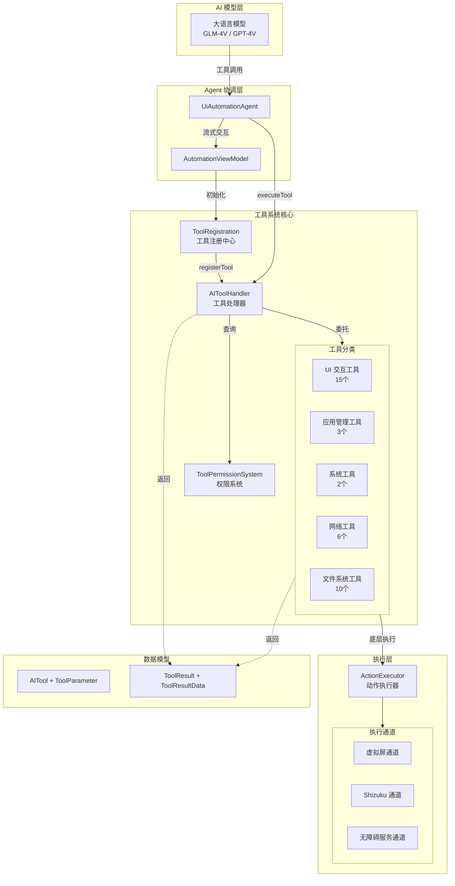
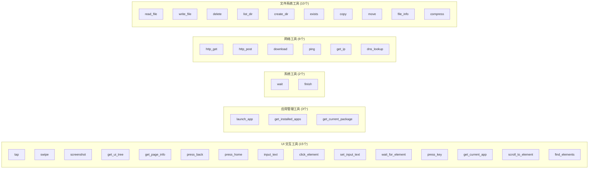
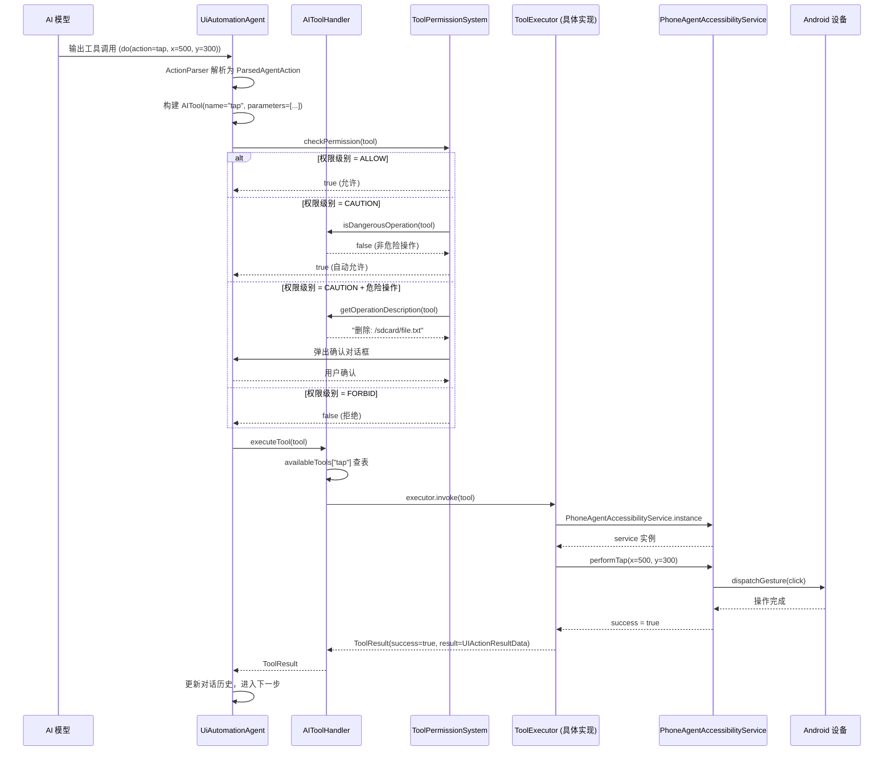
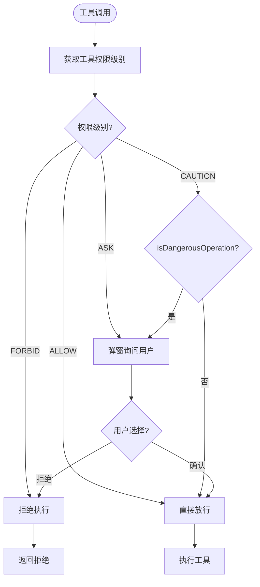
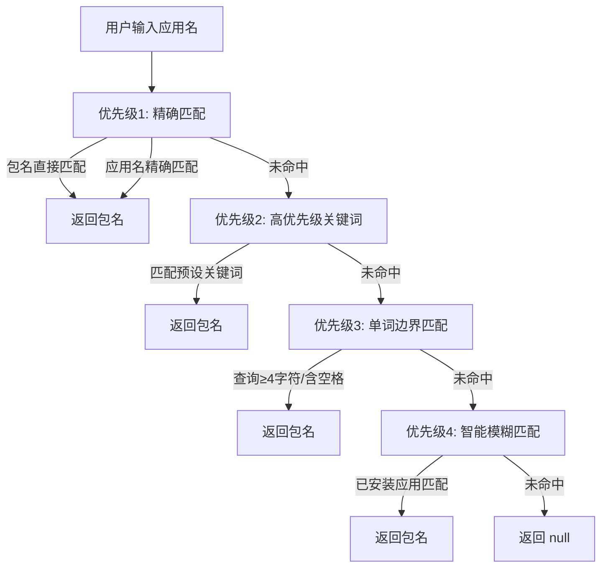
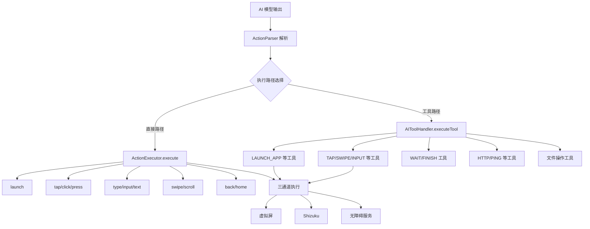

# 工具系统架构

Aries AI 工具系统（Tool System）是一个可扩展的 AI Agent 工具框架，为 AI 模型提供与 Android 设备交互的统一接口。系统采用分层架构设计，支持 UI 操作、应用管理、文件系统、网络通信等五大类共 30+ 个工具，并内置完善的权限管理和危险操作确认机制。

## 概述

工具系统是 Aries AI 自动化引擎的核心基础设施之一。它解决了 AI 模型与 Android 设备之间"理解→执行"的关键桥梁问题：

- **统一工具接口**：所有工具通过 `ToolExecutor` 函数式接口（SAM）实现，AI 模型只需通过 `AITool` 数据结构描述工具调用，无需关心底层实现
- **多通道执行**：工具执行背后涉及虚拟屏、Shizuku、无障碍服务三条执行通道的智能路由
- **声明式注册**：工具通过 `AIToolHandler.registerTool()` 集中注册，同时附带危险操作标记和操作描述生成器，支持运行时权限决策
- **安全防护**：内置 `ToolPermissionSystem` 提供四级权限控制（ALLOW/CAUTION/ASK/FORBID），敏感操作需用户确认

### 设计意图

工具系统被设计为一个**松耦合、高内聚**的模块。其核心设计意图包括：

1. **声明式 vs 命令式分离**：AI 模型只需声明"做什么"（AITool），由系统负责"怎么做"（ToolExecutor → ActionExecutor）
2. **双路径并存**：模型可直接调用 `AIToolHandler.executeTool()` 走工具系统，也可通过 `ActionExecutor.execute()` 走直接执行路径——两种路径最终汇聚到相同的底层执行通道
3. **渐进式权限**：危险操作（如文件删除、移动）在注册时即标记，运行时根据用户设置的权限级别自动放行、询问或拒绝

## 架构总览



> 架构说明：
> - **AI 模型层**：负责分析屏幕内容并生成工具调用指令
> - **Agent 协调层**：`UiAutomationAgent` 管理对话流程，`AutomationViewModel` 负责工具系统的生命周期初始化
> - **工具系统核心**：`ToolRegistration` 批量注册工具 → `AIToolHandler` 管理工具注册表和执行调度 → `ToolPermissionSystem` 进行权限检查
> - **执行层**：`ActionExecutor` 提供三条执行通道的智能路由，确保在任何环境下都能找到可用的交互方式

## 核心组件详解

### 1. 数据模型

工具系统的数据模型采用 Kotlin `@Serializable` 数据类，支持 JSON 序列化以便在 AI 模型与执行器之间传递。

#### AITool — 工具定义

```kotlin
@Serializable
data class AITool(
    val name: String,
    val parameters: List<ToolParameter> = emptyList(),
)

@Serializable
data class ToolParameter(
    val name: String,
    val value: String,
)
```

> Source: [AITool.kt](https://github.com/ZG0704666/Aries-AI/blob/main/app/src/main/java/com/ai/phoneagent/data/model/AITool.kt#L5-L15)

`AITool` 采用**命名参数列表**的简单设计。AI 模型以 `name` 指定工具名（如 `"tap"`、`"launch_app"`），以 `parameters` 传递键值对参数。这种设计让模型输出直接映射到工具调用，无需中间转换层。

#### ToolResult — 执行结果

```kotlin
@Serializable
data class ToolResult(
    val toolName: String,
    val success: Boolean,
    val result: ToolResultData? = null,
    val error: String = ""
)
```

> Source: [ToolResult.kt](https://github.com/ZG0704666/Aries-AI/blob/main/app/src/main/java/com/ai/phoneagent/data/model/ToolResult.kt#L12-L18)

结果数据使用**密封类（sealed class）** 层次结构，支持多种数据类型：

| 结果类型 | 用途 | 示例工具 |
|----------|------|----------|
| `StringResultData` | 文本/状态信息 | `get_page_info`, `wait`, `finish` |
| `ImageResultData` | 截图 Base64 数据 | `screenshot` |
| `UIPageResultData` | UI 页面结构化数据 | （预留） |
| `UIActionResultData` | UI 操作结果 | `tap`, `swipe`, `click_element` |

> Source: [ToolResult.kt](https://github.com/ZG0704666/Aries-AI/blob/main/app/src/main/java/com/ai/phoneagent/data/model/ToolResult.kt#L24-L77)

### 2. ToolExecutor — 工具执行器接口

```kotlin
fun interface ToolExecutor {
    suspend fun invoke(tool: AITool): ToolResult
}
```

> Source: [ToolExecutor.kt](https://github.com/ZG0704666/Aries-AI/blob/main/app/src/main/java/com/ai/phoneagent/core/tools/ToolExecutor.kt#L10-L16)

`ToolExecutor` 是 Kotlin **函数式接口（SAM）**，允许在工具注册时直接用 lambda 表达式定义执行逻辑。这是工具系统可扩展性的关键——任何新工具只需提供一个符合此签名的 lambda 即可集成。

### 3. AIToolHandler — 工具处理器（核心调度器）

`AIToolHandler` 是工具系统的**中央调度器**，采用双重检查锁定的单例模式管理全局唯一的工具注册表。

```kotlin
class AIToolHandler private constructor(private val context: Context) {
    companion object {
        @Volatile
        private var INSTANCE: AIToolHandler? = null

        fun getInstance(context: Context): AIToolHandler {
            return INSTANCE ?: synchronized(this) {
                INSTANCE ?: AIToolHandler(context.applicationContext).also { INSTANCE = it }
            }
        }
    }

    // 三张注册表
    private val availableTools = ConcurrentHashMap<String, ToolExecutor>()
    private val dangerousOperationsRegistry = ConcurrentHashMap<String, (AITool) -> Boolean>()
    private val operationDescriptionRegistry = ConcurrentHashMap<String, (AITool) -> String>()
}
```

> Source: [AIToolHandler.kt](https://github.com/ZG0704666/Aries-AI/blob/main/app/src/main/java/com/ai/phoneagent/core/tools/AIToolHandler.kt#L14-L36)

**三张注册表的设计意图**：

| 注册表 | 键 | 值 | 作用 |
|--------|-----|------|------|
| `availableTools` | 工具名称 | `ToolExecutor` | 执行工具的核心逻辑 |
| `dangerousOperationsRegistry` | 工具名称 | `(AITool) -> Boolean` | 判断当前调用是否为危险操作 |
| `operationDescriptionRegistry` | 工具名称 | `(AITool) -> String` | 生成人类可读的操作描述 |

**注册方法**接收三个参数：

```kotlin
fun registerTool(
    name: String,
    dangerCheck: ((AITool) -> Boolean)? = null,
    descriptionGenerator: ((AITool) -> String)? = null,
    executor: ToolExecutor
)
```

> Source: [AIToolHandler.kt](https://github.com/ZG0704666/Aries-AI/blob/main/app/src/main/java/com/ai/phoneagent/core/tools/AIToolHandler.kt#L45-L64)

工具执行时先查表再调用，内置完整的异常处理：

```kotlin
suspend fun executeTool(tool: AITool): ToolResult {
    val executor = availableTools[tool.name]
    if (executor == null) {
        return ToolResult(
            toolName = tool.name,
            success = false,
            result = StringResultData(""),
            error = "工具未找到: ${tool.name}"
        )
    }
    return try {
        executor.invoke(tool)
    } catch (e: Exception) {
        ToolResult(
            toolName = tool.name,
            success = false,
            result = StringResultData(""),
            error = "执行失败: ${e.message}"
        )
    }
}
```

> Source: [AIToolHandler.kt](https://github.com/ZG0704666/Aries-AI/blob/main/app/src/main/java/com/ai/phoneagent/core/tools/AIToolHandler.kt#L101-L125)

### 4. ToolRegistration — 工具注册中心

`ToolRegistration` 是工具系统的**入口点**，采用单例对象模式，在 `AutomationViewModel.initializeToolSystem()` 中调用 `registerAllTools()` 批量注册所有工具。

```kotlin
object ToolRegistration {
    fun registerAllTools(handler: AIToolHandler, context: Context) {
        registerUITools(handler, context)
        registerAppTools(handler, context)
        registerSystemTools(handler, context)
        registerNetworkTools(handler, context)
        registerFileTools(handler, context)
    }
}
```

> Source: [ToolRegistration.kt](https://github.com/ZG0704666/Aries-AI/blob/main/app/src/main/java/com/ai/phoneagent/core/tools/ToolRegistration.kt#L46-L58)

## 工具分类速览



### UI 交互工具（15 个）

UI 交互工具是工具系统中数量最多、复杂度最高的一类，直接驱动 Android 设备的触摸、输入和导航操作。

| 工具名 | 参数 | 说明 | Operit 对齐 |
|--------|------|------|-------------|
| `tap` | x, y | 点击指定坐标 | - |
| `swipe` | start_x, start_y, end_x, end_y, duration_ms | 滑动操作 | - |
| `screenshot` | - | 截取当前屏幕（返回 Base64） | - |
| `get_ui_tree` | format, detail, max_nodes | 获取 UI 层次结构 | - |
| `get_page_info` | format, detail | 获取页面信息（包名+Activity+UI树） | - |
| `press_back` | - | 按下返回键 | - |
| `press_home` | - | 按下 Home 键 | - |
| `input_text` | text | 对当前焦点输入文本 | - |
| `click_element` | resource_id, text, content_desc, class_name, index, bounds, x, y | 按选择器点击元素 | ✅ |
| `set_input_text` | text, resource_id, element_text, content_desc, class_name, index | 按选择器定位输入 | ✅ |
| `wait_for_element` | resource_id, text, content_desc, class_name, timeout_ms, poll_interval_ms | 等待元素出现 | ✅ |
| `press_key` | key_code | 发送按键事件 | ✅ |
| `get_current_app` | - | 获取当前应用信息 | ✅ |
| `scroll_to_element` | resource_id, text, content_desc, class_name, direction, max_scrolls, scroll_delay_ms | 滚动查找元素 | ✅ (优化新增) |
| `find_elements` | resource_id, text, content_desc, class_name, max_results | 查找匹配元素 | ✅ |

> Source: [ToolRegistration.kt](https://github.com/ZG0704666/Aries-AI/blob/main/app/src/main/java/com/ai/phoneagent/core/tools/ToolRegistration.kt#L70-L671)

### 应用管理工具（3 个）

| 工具名 | 参数 | 说明 |
|--------|------|------|
| `launch_app` | app_name, package_name | 启动应用（绕过模型直接启动） |
| `get_installed_apps` | max_apps | 获取已安装应用列表 |
| `get_current_package` | - | 获取当前应用包名 |

> Source: [ToolRegistration.kt](https://github.com/ZG0704666/Aries-AI/blob/main/app/src/main/java/com/ai/phoneagent/core/tools/ToolRegistration.kt#L676-L778)

### 系统工具（2 个）

| 工具名 | 参数 | 说明 |
|--------|------|------|
| `wait` | seconds | 等待指定秒数 |
| `finish` | message | 标记任务完成 |

> Source: [ToolRegistration.kt](https://github.com/ZG0704666/Aries-AI/blob/main/app/src/main/java/com/ai/phoneagent/core/tools/ToolRegistration.kt#L784-L817)

## 工具执行流程



> 流程说明：
> 1. AI 模型输出 `do(action=tap, x=500, y=300)` 格式的动作指令
> 2. `ActionParser` 解析为结构化动作，Agent 构建 `AITool` 对象
> 3. **权限检查**：`ToolPermissionSystem` 根据用户设置的主开关和工具级权限决定是否允许执行
> 4. **表查找**：`AIToolHandler` 从 `ConcurrentHashMap` 中查找对应的 `ToolExecutor`
> 5. **执行**：`ToolExecutor.invoke()` 通过 `PhoneAgentAccessibilityService` 将操作分发到 Android 设备
> 6. 结果以 `ToolResult` 形式返回，Agent 根据结果决定下一步动作

## 权限系统

`ToolPermissionSystem` 提供四级权限控制，所有权限状态持久化在 DataStore 中。

```kotlin
enum class PermissionLevel {
    ALLOW,      // 自动允许所有操作
    CAUTION,    // 危险操作需确认，普通操作自动允许（默认）
    ASK,        // 所有操作都需确认
    FORBID      // 禁止所有操作
}
```

> Source: [ToolPermissionSystem.kt](https://github.com/ZG0704666/Aries-AI/blob/main/app/src/main/java/com/ai/phoneagent/permissions/ToolPermissionSystem.kt#L41-L46)

**权限决策流程**：



> Source: [ToolPermissionSystem.kt](https://github.com/ZG0704666/Aries-AI/blob/main/app/src/main/java/com/ai/phoneagent/permissions/ToolPermissionSystem.kt#L94-L122)

**危险操作标记**在工具注册时指定。例如文件系统的 `delete` 和 `move` 工具：

```kotlin
// delete 工具 — 标记为危险操作
handler.registerTool(
    name = "delete",
    dangerCheck = { true },  // 危险操作
    descriptionGenerator = { tool ->
        val path = tool.parameters.find { it.name == "path" }?.value ?: ""
        "删除: $path"
    },
    executor = { tool -> FileToolExecutor.delete(tool) }
)
```

> Source: [FileToolExecutor.kt](https://github.com/ZG0704666/Aries-AI/blob/main/app/src/main/java/com/ai/phoneagent/core/tools/file/FileToolExecutor.kt#L410-L418)

权限数据通过 `ToolPermissionsRepository` 持久化到 Android DataStore：

```kotlin
class ToolPermissionsRepository(private val context: Context) {
    // 主开关 key: "master_switch" → 默认 "CAUTION"
    // 工具级 key:  "tool_$toolName"  → 动态
    suspend fun getMasterSwitch(): String
    suspend fun setMasterSwitch(value: String)
    suspend fun getToolPermission(toolName: String): String?
    suspend fun setToolPermission(toolName: String, value: String)
}
```

> Source: [ToolPermissionsRepository.kt](https://github.com/ZG0704666/Aries-AI/blob/main/app/src/main/java/com/ai/phoneagent/data/preferences/ToolPermissionsRepository.kt#L21-L66)

## 应用包名解析系统

`AppPackageManager` 是 `launch_app` 工具背后的核心服务，提供智能化的应用名到包名解析，支持 250+ 常用应用。

### 四级匹配优先级



> Source: [AppPackageManager.kt](https://github.com/ZG0704666/Aries-AI/blob/main/app/src/main/java/com/ai/phoneagent/core/tools/AppPackageManager.kt#L20-L268)

**设计意图**：四级优先级解决了中文应用名匹配的核心难题——"云"不应该同时匹配"阿里云盘"和"移动云"。高优先级关键词表（如银行类、视频类、云服务类）确保精确区分容易混淆的应用。

```kotlin
// 高优先级关键词映射示例
private val highPriorityKeywords = mapOf(
    // 云服务区分
    "移动云" to "com.chinamobile.cmcccloud",
    "阿里云盘" to "com.alicloud.infocloud",
    // 银行类区分
    "招商银行" to "cmb.pb",
    "工商银行" to "com.icbc",
    // 视频类区分
    "腾讯视频" to "com.tencent.qqlive",
    "爱奇艺视频" to "com.qiyi.video",
)
```

> Source: [AppPackageManager.kt](https://github.com/ZG0704666/Aries-AI/blob/main/app/src/main/java/com/ai/phoneagent/core/tools/AppPackageManager.kt#L31-L61)

扩展映射表 `ExtendedAppMapping` 提供 250+ 常用应用（社交通讯 35 个、购物支付 30 个、出行旅游 25 个等分类），与 `highPriorityKeywords` 共同构成应用识别体系。

> Source: [ExtendedAppMapping.kt](https://github.com/ZG0704666/Aries-AI/blob/main/app/src/main/java/com/ai/phoneagent/core/tools/extended/ExtendedAppMapping.kt#L24)

## 初始化流程

工具系统在 `AutomationViewModel.initializeToolSystem()` 中完成初始化：

```kotlin
private fun initializeToolSystem() {
    try {
        val toolHandler = AIToolHandler.getInstance(appContext)
        ToolRegistration.registerAllTools(toolHandler, appContext)
        appendLog("✅ 工具系统初始化完成")
    } catch (e: Exception) {
        Log.e("AutomationViewModel", "工具系统初始化失败: ${e.message}", e)
        appendLog("⚠️ 工具系统初始化失败: ${e.message}")
    }
}
```

> Source: [AutomationViewModel.kt](https://github.com/ZG0704666/Aries-AI/blob/main/app/src/main/java/com/ai/phoneagent/viewmodel/AutomationViewModel.kt#L645-L654)

初始化顺序：
1. `AIToolHandler.getInstance()` — 获取全局单例
2. `ToolRegistration.registerAllTools()` — 按类别批量注册（UI → App → System → Network → File）
3. 网络和文件工具在执行注册前先调用 `init(context)` 完成各自的初始化

## 网络工具（6 个）

网络工具基于 OkHttp 客户端实现，提供 HTTP 请求、下载和网络诊断能力。

```kotlin
object NetworkToolExecutor {
    private val client = OkHttpClient.Builder()
        .connectTimeout(30, TimeUnit.SECONDS)
        .readTimeout(30, TimeUnit.SECONDS)
        .writeTimeout(30, TimeUnit.SECONDS)
        .build()

    suspend fun httpGet(tool: AITool): ToolResult   // HTTP GET
    suspend fun httpPost(tool: AITool): ToolResult  // HTTP POST
    suspend fun download(tool: AITool): ToolResult  // 文件下载
    suspend fun ping(tool: AITool): ToolResult      // Ping 主机
    suspend fun getIP(tool: AITool): ToolResult     // 本机 IP
    suspend fun dnsLookup(tool: AITool): ToolResult // DNS 查询
}
```

> Source: [NetworkToolExecutor.kt](https://github.com/ZG0704666/Aries-AI/blob/main/app/src/main/java/com/ai/phoneagent/core/tools/network/NetworkToolExecutor.kt#L41-L284)

所有网络操作均在 `Dispatchers.IO` 上执行，支持自定义请求头（`http_get`）、自定义 Content-Type（`http_post`）、超时控制等参数。

## 文件系统工具（10 个）

文件系统工具提供完整的文件 CRUD、目录操作、元数据查看和 ZIP 压缩功能。

```kotlin
object FileToolExecutor {
    suspend fun readFile(tool: AITool): ToolResult    // 读取文件（含大文件截断）
    suspend fun writeFile(tool: AITool): ToolResult   // 写入/追加文件
    suspend fun delete(tool: AITool): ToolResult      // 删除文件/目录
    suspend fun listDir(tool: AITool): ToolResult     // 列出目录内容
    suspend fun createDir(tool: AITool): ToolResult   // 创建目录
    suspend fun exists(tool: AITool): ToolResult      // 检查存在性
    suspend fun copy(tool: AITool): ToolResult        // 复制文件
    suspend fun move(tool: AITool): ToolResult        // 移动/重命名
    suspend fun fileInfo(tool: AITool): ToolResult    // 文件详细信息
    suspend fun compress(tool: AITool): ToolResult    // ZIP 压缩
}
```

> Source: [FileToolExecutor.kt](https://github.com/ZG0704666/Aries-AI/blob/main/app/src/main/java/com/ai/phoneagent/core/tools/file/FileToolExecutor.kt#L38-L355)

其中 `delete` 和 `move` 工具标记为危险操作（`dangerCheck = { true }`），在 CAUTION 权限级别下会触发用户确认。

## 双路径执行架构

工具系统与 `ActionExecutor` 形成了 Aries AI 的**双路径执行架构**：



**两条路径的设计意图**：
- **工具路径**（`AIToolHandler`）：适合 AI 模型显式调用工具的场景，经过权限检查、描述生成等完整流程，可扩展性强
- **直接路径**（`ActionExecutor`）：适合 Agent 内部的动作执行，路径更短、延迟更低，直接路由到三层执行通道

两条路径最终汇聚到相同的底层执行通道（虚拟屏 → Shizuku → 无障碍服务），确保执行一致性。

## 配置选项

工具系统本身没有独立的配置文件，其行为由 `AgentConfiguration` 的相关参数控制：

| 参数 | 类型 | 默认值 | 说明 |
|------|------|--------|------|
| `sensitiveKeywords` | `List<String>` | 支付密码/银行卡/验证码等 | 敏感内容关键词，命中时跳过 UI 操作 |
| `dangerousOperationKeywords` | `List<String>` | 支付/密码/银行卡等 | 危险操作关键词，用于风险分级 |
| `maxSteps` | `Int` | 100 | 单次任务最大执行步数 |
| `stepDelayMs` | `Long` | 160 | 每步间基础延迟 |
| `appLaunchWaitTimeoutMs` | `Long` | 2200 | 应用启动等待超时 |

> Source: [AgentConfiguration.kt](https://github.com/ZG0704666/Aries-AI/blob/main/app/src/main/java/com/ai/phoneagent/core/config/AgentConfiguration.kt#L38-L357)

权限系统的配置存储在 `tool_permissions` DataStore 中：

| 键 | 类型 | 默认值 | 说明 |
|-----|------|--------|------|
| `master_switch` | `String` | `"CAUTION"` | 全局权限开关级别 |
| `tool_<toolName>` | `String` | 无（继承主开关） | 单个工具的权限覆盖 |

> Source: [ToolPermissionsRepository.kt](https://github.com/ZG0704666/Aries-AI/blob/main/app/src/main/java/com/ai/phoneagent/data/preferences/ToolPermissionsRepository.kt#L12-L25)

## API 参考

### `AIToolHandler.registerTool(name, dangerCheck, descriptionGenerator, executor)`

注册一个工具到系统。

**参数：**
- `name` (String)：工具唯一名称（如 `"tap"`、`"launch_app"`）
- `dangerCheck` ((AITool) -> Boolean)?：可选，危险操作判定函数，返回 `true` 表示当前调用属危险操作
- `descriptionGenerator` ((AITool) -> String)?：可选，操作描述生成函数，用于权限确认对话框
- `executor` (ToolExecutor)：工具执行器（SAM lambda），`suspend (AITool) -> ToolResult`

### `AIToolHandler.executeTool(tool: AITool): ToolResult`

执行指定工具。

**参数：**
- `tool` (AITool)：包含工具名和参数的工具定义

**返回：** `ToolResult`，包含 `success` 标志和 `result`/`error` 信息

**异常：** 内部捕获所有异常，不会向外抛出

### `AIToolHandler.isDangerousOperation(tool: AITool): Boolean`

检查工具调用是否为危险操作。

### `AIToolHandler.getOperationDescription(tool: AITool): String`

生成人类可读的操作描述文本。

### `ToolPermissionSystem.checkPermission(tool, onNeedConfirm): Boolean`

检查工具执行权限。

**参数：**
- `tool` (AITool)：待执行的工具
- `onNeedConfirm` (suspend (String) -> Boolean)：需要确认时的回调，传入操作描述，返回用户是否确认

**返回：** `Boolean` — `true` 允许执行，`false` 拒绝执行

### `AppPackageManager.resolvePackageName(query: String?): String?`

智能解析应用名到包名（四级优先级匹配）。

**参数：**
- `query` (String?)：应用名或包名

**返回：** 匹配到的包名，或 `null`

## 相关链接

### 核心源文件

- [AIToolHandler.kt](https://github.com/ZG0704666/Aries-AI/blob/main/app/src/main/java/com/ai/phoneagent/core/tools/AIToolHandler.kt) — 工具处理器（核心调度器）
- [ToolExecutor.kt](https://github.com/ZG0704666/Aries-AI/blob/main/app/src/main/java/com/ai/phoneagent/core/tools/ToolExecutor.kt) — 工具执行器接口
- [ToolRegistration.kt](https://github.com/ZG0704666/Aries-AI/blob/main/app/src/main/java/com/ai/phoneagent/core/tools/ToolRegistration.kt) — 工具注册中心（30+ 工具定义）
- [NetworkToolExecutor.kt](https://github.com/ZG0704666/Aries-AI/blob/main/app/src/main/java/com/ai/phoneagent/core/tools/network/NetworkToolExecutor.kt) — 网络工具执行器
- [FileToolExecutor.kt](https://github.com/ZG0704666/Aries-AI/blob/main/app/src/main/java/com/ai/phoneagent/core/tools/file/FileToolExecutor.kt) — 文件系统工具执行器
- [AppPackageManager.kt](https://github.com/ZG0704666/Aries-AI/blob/main/app/src/main/java/com/ai/phoneagent/core/tools/AppPackageManager.kt) — 应用包名管理器
- [ExtendedAppMapping.kt](https://github.com/ZG0704666/Aries-AI/blob/main/app/src/main/java/com/ai/phoneagent/core/tools/extended/ExtendedAppMapping.kt) — 扩展应用映射（250+ 应用）

### 数据模型

- [AITool.kt](https://github.com/ZG0704666/Aries-AI/blob/main/app/src/main/java/com/ai/phoneagent/data/model/AITool.kt) — 工具定义数据模型
- [ToolResult.kt](https://github.com/ZG0704666/Aries-AI/blob/main/app/src/main/java/com/ai/phoneagent/data/model/ToolResult.kt) — 工具结果数据模型

### 权限和配置

- [ToolPermissionSystem.kt](https://github.com/ZG0704666/Aries-AI/blob/main/app/src/main/java/com/ai/phoneagent/permissions/ToolPermissionSystem.kt) — 工具权限系统
- [ToolPermissionsRepository.kt](https://github.com/ZG0704666/Aries-AI/blob/main/app/src/main/java/com/ai/phoneagent/data/preferences/ToolPermissionsRepository.kt) — 权限持久化
- [AgentConfiguration.kt](https://github.com/ZG0704666/Aries-AI/blob/main/app/src/main/java/com/ai/phoneagent/core/config/AgentConfiguration.kt) — Agent 配置（含工具相关参数）

### 执行和集成

- [ActionExecutor.kt](https://github.com/ZG0704666/Aries-AI/blob/main/app/src/main/java/com/ai/phoneagent/core/executor/ActionExecutor.kt) — 动作执行器（三通道执行）
- [ActionParser.kt](https://github.com/ZG0704666/Aries-AI/blob/main/app/src/main/java/com/ai/phoneagent/core/parser/ActionParser.kt) — 动作解析器
- [AutomationViewModel.kt](https://github.com/ZG0704666/Aries-AI/blob/main/app/src/main/java/com/ai/phoneagent/viewmodel/AutomationViewModel.kt) — ViewModel（工具系统初始化入口）
- [UiAutomationAgent.kt](https://github.com/ZG0704666/Aries-AI/blob/main/app/src/main/java/com/ai/phoneagent/UiAutomationAgent.kt) — 主 Agent（工具系统消费者）
