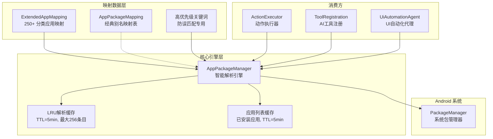
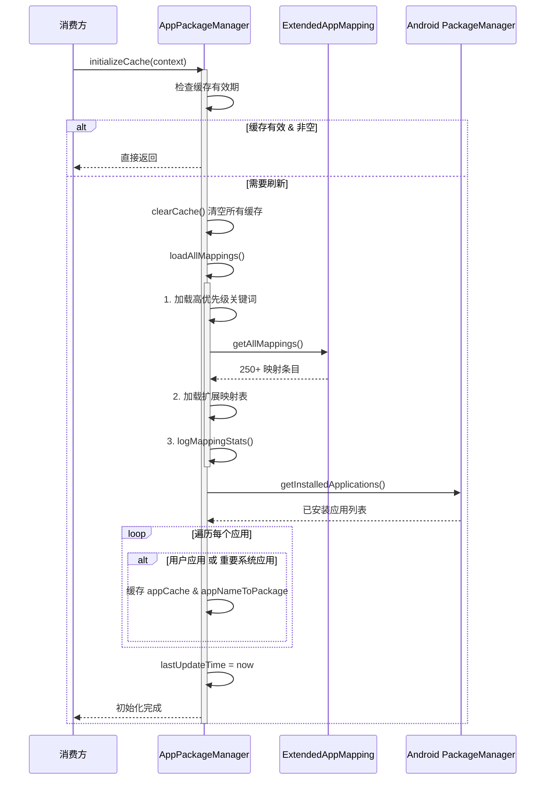
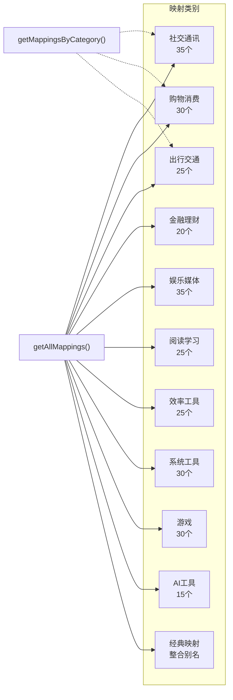
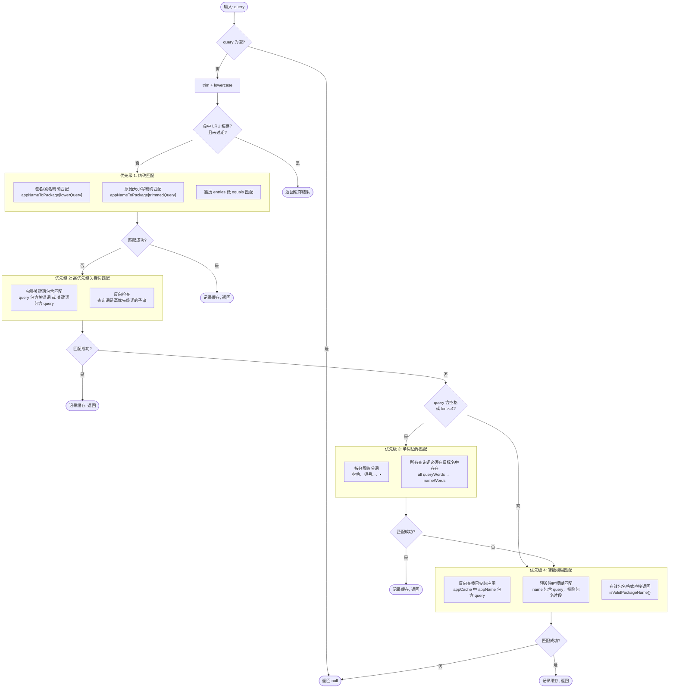
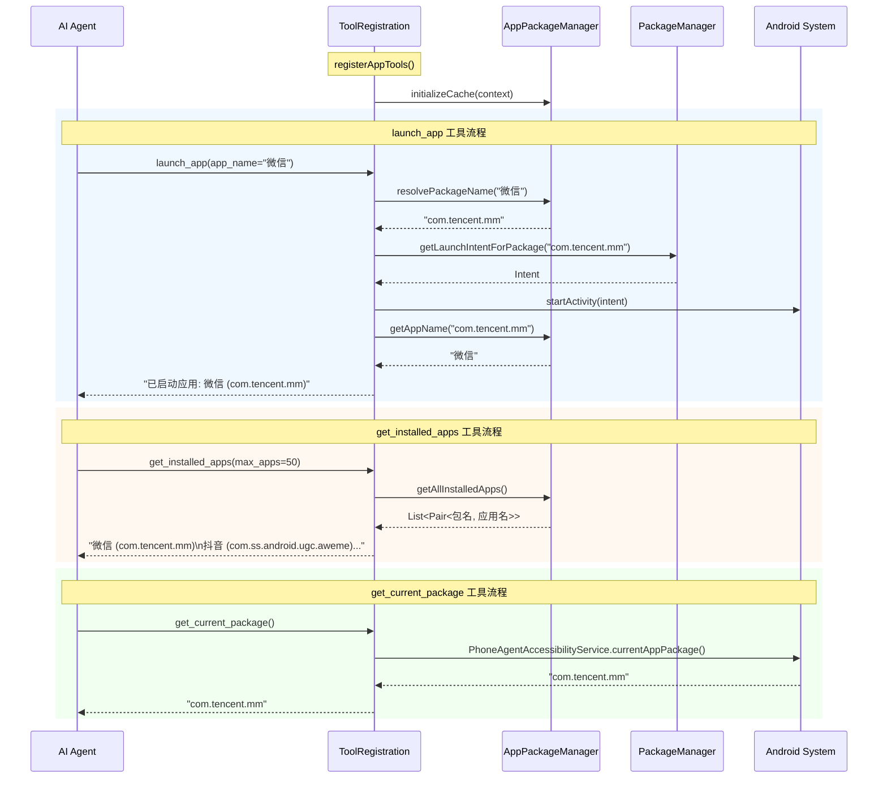

# 应用包名管理

Aries-AI 应用包名管理系统，负责将人类可读的应用名称（如"微信"、"抖音"）智能映射为 Android 包名（如 `com.tencent.mm`），支持多级匹配策略，涵盖 250+ 常用应用，是 AI Agent 自动化操作应用的核心基础设施。

## 概述

在 AI 驱动的手机自动化场景中，自然语言指令通常包含应用名称（如"打开微信给张三发消息"），而 Android 系统底层需要通过包名（Package Name）来启动和操作应用。**应用包名管理**模块解决了这一关键问题：将模糊、口语化的应用名称精准转换为系统可识别的包名。

### 核心价值

- **智能解析**：支持 4 级优先级匹配策略，从精确匹配到智能模糊匹配逐级降级
- **防误匹配**：通过高优先级关键词、单词边界匹配等机制，防止"云"错误匹配到"阿里云盘"和"移动云"
- **海量映射**：内置 250+ 常用应用的预设映射，覆盖社交通讯、购物消费、出行交通、金融理财、娱乐媒体等 11 个大类
- **性能优化**：内建 LRU 缓存（TTL 5 分钟，最大 256 条目）+ 5 分钟应用列表缓存，减少重复查询开销
- **多源集成**：整合系统已安装应用、预设映射表、高优先级关键词三层数据源

### 设计意图

模块采用**分层匹配 + 逐级降级**的设计模式。不是简单地做一次模糊搜索（那会导致大量误匹配），而是按照"精确 → 精确别名 → 高优先级关键词 → 单词边界 → 智能模糊"的顺序依次尝试。这保证了常见应用名称能快速精确命中，同时为生僻/口语化名称提供兜底能力。

## 架构



**架构说明：**

| 层级 | 组件 | 角色 |
|------|------|------|
| 映射数据层 | `ExtendedAppMapping`、`AppPackageMapping`、高优先级关键词 | 提供静态的应用名称→包名映射数据 |
| 核心引擎层 | `AppPackageManager` | 负责缓存管理、4 级优先级匹配策略、与 Android PackageManager 交互 |
| 消费方 | `ActionExecutor`、`ToolRegistration`、`UiAutomationAgent` | 在不同场景中调用核心引擎进行包名解析 |

## 核心组件

### AppPackageManager — 智能解析引擎

`AppPackageManager` 是整个系统的核心，以 Kotlin `object` 单例模式实现。它负责：

1. **应用列表缓存**：在初始化时扫描设备已安装应用，筛选出用户应用和重要系统应用
2. **多级解析策略**：按优先级依次尝试精确匹配、高优先级关键词匹配、单词边界匹配、智能模糊匹配
3. **LRU 缓存加速**：对解析结果进行基于 LinkedHashMap 的 LRU 缓存（5 分钟 TTL）

#### 初始化流程



> Source: [AppPackageManager.kt](https://github.com/ZG0704666/Aries-AI/blob/main/app/src/main/java/com/ai/phoneagent/core/tools/AppPackageManager.kt#L116-L153)

### AppPackageMapping — 经典别名匹配

`AppPackageMapping` 是一个基于纯文本匹配的轻量级映射表。它通过 `normalize()` 方法对输入进行标准化处理（去除空格、连字符、转小写），然后进行精确匹配。此外，它还提供了 `bestMatchInText()` 方法，能在任意文本中找到最早出现的、最长的匹配应用名。

> Source: [AppPackageMapping.kt](https://github.com/ZG0704666/Aries-AI/blob/main/app/src/main/java/com/ai/phoneagent/AppPackageMapping.kt)

### ExtendedAppMapping — 扩展映射表

`ExtendedAppMapping` 按类别组织了 250+ 个常用应用的包名映射，涵盖 11 个类别。每个类别都同时提供中文名和英文名的映射键。



> Source: [ExtendedAppMapping.kt](https://github.com/ZG0704666/Aries-AI/blob/main/app/src/main/java/com/ai/phoneagent/core/tools/extended/ExtendedAppMapping.kt)

## 核心流程

### 包名解析流程（4 级优先级匹配）

这是整个系统最核心的算法。当 AI Agent 需要进行"打开微信"这样的操作时，`resolvePackageName()` 方法会按以下优先级逐级尝试匹配：



> Source: [AppPackageManager.kt](https://github.com/ZG0704666/Aries-AI/blob/main/app/src/main/java/com/ai/phoneagent/core/tools/AppPackageManager.kt#L176-L268)

**关键设计决策**：

| 优先级 | 匹配方式 | 设计意图 |
|--------|---------|---------|
| 1 | 精确匹配 | 最可靠的匹配方式，O(1) 哈希查找，优先保证准确性 |
| 2 | 高优先级关键词 | 防止误匹配的关键机制。例如"移动云手机"必须匹配 `com.cmcc.pocophone` 而非 `com.alicloud.infocloud`，通过完整关键词匹配+反向子串检查实现 |
| 3 | 单词边界匹配 | 仅在 query 包含分隔符或长度 ≥4 时启用，避免"云"这类短词误匹配到所有云服务应用 |
| 4 | 智能模糊匹配 | 最后的兜底手段，包含 3 个子策略：已安装应用反向查找、预设映射模糊匹配、合法包名格式直接通过 |

### AI 工具注册与启动流程

在 `ToolRegistration` 中注册了三个与包名管理相关的 AI 工具：



> Sources:
> - [ToolRegistration.kt](https://github.com/ZG0704666/Aries-AI/blob/main/app/src/main/java/com/ai/phoneagent/core/tools/ToolRegistration.kt#L676-L779)
> - [AppPackageManager.kt](https://github.com/ZG0704666/Aries-AI/blob/main/app/src/main/java/com/ai/phoneagent/core/tools/AppPackageManager.kt)

## 使用示例

### 基本用法：解析应用名称

```kotlin
// 初始化缓存（通常在应用启动时调用一次）
AppPackageManager.initializeCache(context)

// 解析中文应用名
val wechatPkg = AppPackageManager.resolvePackageName("微信")
// 返回: "com.tencent.mm"

// 解析英文名（不区分大小写）
val tiktokPkg = AppPackageManager.resolvePackageName("tiktok")
// 返回: "com.zhiliaoapp.musically"

// 高优先级关键词防误匹配
val aliyunPkg = AppPackageManager.resolvePackageName("阿里云盘")
// 返回: "com.alicloud.infocloud"（不会误匹配为 "com.chinamobile.cmcccloud"）

// 获取应用显示名
val appName = AppPackageManager.getAppName("com.tencent.mm")
// 返回: "微信"（如果已安装）或 "com.tencent.mm"（回退）
```
> Source: [AppPackageManager.kt](https://github.com/ZG0704666/Aries-AI/blob/main/app/src/main/java/com/ai/phoneagent/core/tools/AppPackageManager.kt#L176-L268)

### 高级用法：动作执行中的包名解析

在 `ActionExecutor` 中，包名解析与系统查询集成，形成完整的启动流程：

```kotlin
// 初始化缓存
AppPackageManager.initializeCache(context)

// 智能解析
val smartResolved = AppPackageManager.resolvePackageName(t)

// 构建候选列表（优先级：智能解析 > 包名格式 > 辅助服务解析）
val candidates = buildList {
    if (smartResolved != null) {
        add(smartResolved)
    }
    if (t.contains('.') && t.count { it == '.' } >= 1) {
        add(t)  // 看起来像包名，直接使用
    }
    service?.let { AppPackageManager.resolvePackageByLabel(it, t) }?.let { add(it) }
}.distinct()

// 候选为空时，从已安装应用中模糊搜索
val finalCandidates = if (candidates.isEmpty()) {
    val allApps = AppPackageManager.getAllInstalledApps()
    allApps.filter { (_, appName) ->
        appName.contains(t, ignoreCase = true) ||
            t.contains(appName, ignoreCase = true) ||
            isWordBoundaryMatch(t, appName)
    }.map { it.first }.take(3)
} else {
    candidates
}
```
> Source: [ActionExecutor.kt](https://github.com/ZG0704666/Aries-AI/blob/main/app/src/main/java/com/ai/phoneagent/core/executor/ActionExecutor.kt#L255-L282)

### 获取应用列表

```kotlin
// 获取所有已安装应用
val allApps: List<Pair<String, String>> = AppPackageManager.getAllInstalledApps()
// 返回: [(com.tencent.mm, 微信), (com.ss.android.ugc.aweme, 抖音), ...]

// 获取映射统计信息
val stats: Map<String, Any> = AppPackageManager.getStats()
// 返回: {totalMappings=512, installedApps=85, highPriorityKeywords=24, extendedMappings=250}
```
> Source: [AppPackageManager.kt](https://github.com/ZG0704666/Aries-AI/blob/main/app/src/main/java/com/ai/phoneagent/core/tools/AppPackageManager.kt#L324-L350)

### 文本中匹配应用名

```kotlin
// 在自然语言文本中找到最佳应用匹配
val match = AppPackageMapping.bestMatchInText("帮我打开微信给张三发消息")
// match.appLabel = "微信"
// match.packageName = "com.tencent.mm"
// match.start = 4, match.end = 6

// 精确解析
val pkg = AppPackageMapping.resolve("抖音")
// 返回: "com.ss.android.ugc.aweme"
```
> Source: [AppPackageMapping.kt](https://github.com/ZG0704666/Aries-AI/blob/main/app/src/main/java/com/ai/phoneagent/AppPackageMapping.kt#L325-L352)

## 配置选项

### 缓存配置

| 选项 | 类型 | 默认值 | 说明 |
|------|------|--------|------|
| `CACHE_VALIDITY_MS` | Long | `300000` (5分钟) | 应用列表缓存有效期，超时后重新从 PackageManager 加载 |
| `RESOLVE_CACHE_TTL_MS` | Long | `300000` (5分钟) | 单次解析结果 LRU 缓存的 TTL |
| `RESOLVE_CACHE_MAX_ENTRIES` | Int | `256` | LRU 解析缓存的最大条目数，超出后淘汰最早条目 |

### 高优先级关键词

在代码中硬编码，用于防止相似应用名的误匹配：

```kotlin
private val highPriorityKeywords = mapOf(
    "移动云" to "com.chinamobile.cmcccloud",
    "移动云手机" to "com.cmcc.pocophone",
    "阿里云盘" to "com.alicloud.infocloud",
    "天翼云盘" to "com.ctc.wsyd",
    "百度网盘" to "com.baidu.netdisk",
    "腾讯微云" to "com.tencent.wecloud",
    "坚果云" to "com.jianguoyun",
    // 手机品牌区分
    "华为手机" to "com.huawei.system",
    "小米手机" to "com.xiaomi.misettings",
    // 银行区分
    "招商银行" to "cmb.pb",
    "工商银行" to "com.icbc",
    // ... 等 24 个关键词
)
```
> Source: [AppPackageManager.kt](https://github.com/ZG0704666/Aries-AI/blob/main/app/src/main/java/com/ai/phoneagent/core/tools/AppPackageManager.kt#L31-L61)

### 重要系统应用白名单

初始化缓存时，大部分系统应用被过滤，但以下重要系统应用会被保留：

```kotlin
private fun isImportantSystemApp(packageName: String): Boolean {
    val importantApps = setOf(
        "com.android.settings",      // 设置
        "com.android.chrome",        // Chrome
        "com.google.android.gms",    // Google服务
        "com.android.dialer",        // 拨号
        "com.android.phone",         // 电话
        "com.android.contacts",      // 联系人
        "com.android.messaging"      // 短信
    )
    return importantApps.contains(packageName)
}
```
> Source: [AppPackageManager.kt](https://github.com/ZG0704666/Aries-AI/blob/main/app/src/main/java/com/ai/phoneagent/core/tools/AppPackageManager.kt#L158-L169)

## API 参考

### AppPackageManager

#### `initializeCache(context: Context)`

初始化应用列表缓存。从 Android PackageManager 加载所有已安装用户应用和重要系统应用，同时加载预设映射表。

- **参数**: `context` (Context) — Android 上下文，用于获取 PackageManager
- **注意**: 缓存有效期为 5 分钟，重复调用在有效期内会直接返回

#### `resolvePackageName(query: String?): String?`

根据应用名或包名查询，智能解析为确定的包名。按 4 级优先级匹配策略执行。

- **参数**: `query` (String?) — 应用名（如"微信"、"WeChat"）或包名
- **返回**: 匹配到的包名字符串，未找到返回 `null`
- **缓存**: 结果会写入 LRU 缓存（TTL 5分钟）

#### `resolvePackageByLabel(service: PhoneAgentAccessibilityService, appName: String): String?`

根据应用标签解析包名，兼容旧 API。内部直接委托给 `resolvePackageName()`。

- **参数**: 
  - `service` (PhoneAgentAccessibilityService) — 无障碍服务实例（当前未使用，保留用于兼容）
  - `appName` (String) — 应用名
- **返回**: 包名或 `null`

#### `getAppName(packageName: String): String`

根据包名获取应用显示名。

- **参数**: `packageName` (String) — Android 包名
- **返回**: 应用显示名，如果在缓存中未找到则返回包名本身作为回退

#### `getAllInstalledApps(): List<Pair<String, String>>`

获取所有已缓存的已安装应用列表。

- **返回**: `List<Pair<包名, 应用名>>`

#### `clearCache()`

清除所有缓存数据（应用列表缓存、名称映射缓存、LRU 解析缓存），并将 `lastUpdateTime` 重置为 0。用于手动刷新。

#### `getStats(): Map<String, Any>`

获取映射统计信息，用于调试和监控。

- **返回**: 
  - `totalMappings` (Int) — 名称→包名的总映射条目数
  - `installedApps` (Int) — 已缓存的已安装应用数
  - `highPriorityKeywords` (Int) — 高优先级关键词数量
  - `extendedMappings` (Int) — ExtendedAppMapping 中的映射条目数

### AppPackageMapping

#### `resolve(appName: String): String?`

对应用名进行标准化后精确匹配。会去除空格和连字符后做小写匹配。

- **参数**: `appName` (String) — 应用名
- **返回**: 包名或 `null`

#### `bestMatchInText(text: String): Match?`

在文本中查找最佳匹配的应用名。选择最早出现且最长的匹配。

- **参数**: `text` (String) — 任意文本
- **返回**: `Match?` — 包含 `appLabel`、`packageName`、`start`、`end` 字段的匹配结果

### ExtendedAppMapping

#### `getAllMappings(): Map<String, String>`

获取所有类别的映射合并结果（11 个类别 × 平均 22+ 条目 ≈ 250+ 映射），键名自动转为小写。

- **返回**: `Map<String, String>` — 应用名→包名的映射

#### `getMappingsByCategory(category: String): Map<String, String>`

按类别获取映射。

- **参数**: `category` (String) — 类别标识，支持：
  - `"social"` / `"social_communication"` — 社交通讯
  - `"shopping"` — 购物消费
  - `"transportation"` / `"transport"` — 出行交通
  - `"finance"` / `"bank"` — 金融理财
  - `"entertainment"` / `"media"` — 娱乐媒体
  - `"reading"` / `"book"` — 阅读学习
  - `"productivity"` / `"work"` — 效率工具
  - `"system"` — 系统工具
  - `"game"` / `"games"` — 游戏
  - `"ai"` / `"ai_tools"` — AI 工具
  - `"classic"` / `"legacy"` — 经典映射
- **返回**: 对应类别的映射，未匹配返回空 Map

## 相关链接

- [AppPackageManager.kt — 智能解析引擎源码](https://github.com/ZG0704666/Aries-AI/blob/main/app/src/main/java/com/ai/phoneagent/core/tools/AppPackageManager.kt)
- [AppPackageMapping.kt — 经典别名映射源码](https://github.com/ZG0704666/Aries-AI/blob/main/app/src/main/java/com/ai/phoneagent/AppPackageMapping.kt)
- [ExtendedAppMapping.kt — 扩展映射表源码](https://github.com/ZG0704666/Aries-AI/blob/main/app/src/main/java/com/ai/phoneagent/core/tools/extended/ExtendedAppMapping.kt)
- [ActionExecutor.kt — 动作执行器（消费方）](https://github.com/ZG0704666/Aries-AI/blob/main/app/src/main/java/com/ai/phoneagent/core/executor/ActionExecutor.kt)
- [ToolRegistration.kt — AI 工具注册（消费方）](https://github.com/ZG0704666/Aries-AI/blob/main/app/src/main/java/com/ai/phoneagent/core/tools/ToolRegistration.kt)
- [UiAutomationAgent.kt — UI 自动化代理（消费方）](https://github.com/ZG0704666/Aries-AI/blob/main/app/src/main/java/com/ai/phoneagent/UiAutomationAgent.kt)
