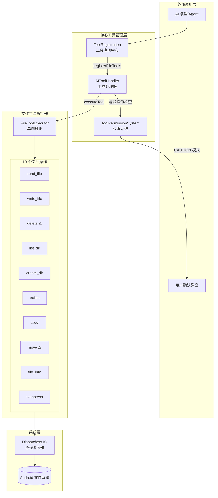
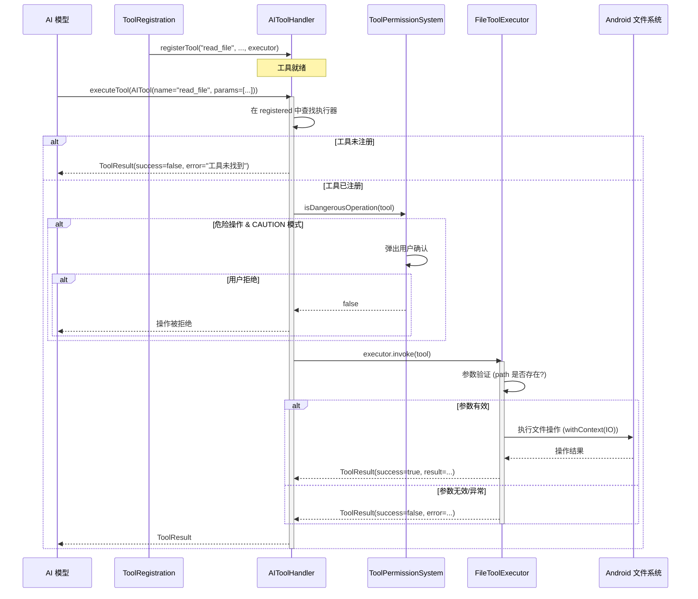
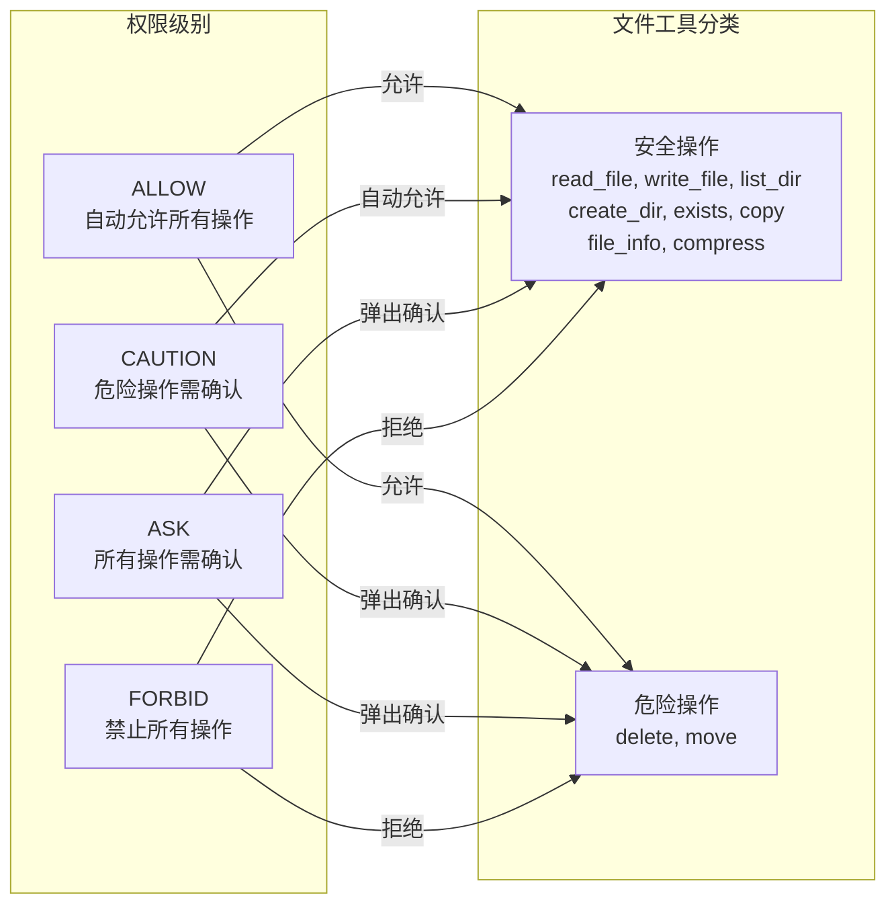

# 文件工具执行器

为 AI 代理提供文件系统操作能力，包括文件读写、目录管理、文件信息查询和压缩等功能。

## 概述

`FileToolExecutor` 是 Aries-AI 自动化框架中的核心工具模块之一，负责向 AI 模型暴露一组文件系统操作接口。它采用 Kotlin `object` 单例模式实现，所有文件 I/O 操作均在 `Dispatchers.IO` 协程调度器上异步执行，保证 UI 线程不被阻塞。

该模块的设计初衷是让 AI 代理能够像人类用户一样与设备的文件系统进行交互——读取配置文件、写入日志、创建目录结构、打包文件等。通过将文件操作封装为标准化工具接口（`ToolExecutor`），AI 模型可以以统一的方式调用这些能力，而无需关心底层实现细节。

文件工具执行器共注册了 **10 个工具**，按照安全等级分为普通操作和危险操作两类。危险操作（`delete`、`move`）需要通过 `ToolPermissionSystem` 的用户确认机制才能执行，以防止意外的数据丢失。

## 架构



**架构说明：**

- **ToolRegistration**：在应用启动时通过 `registerAllTools()` 调用 `registerFileTools()`，将 10 个文件工具批量注册到 `AIToolHandler` 中
- **AIToolHandler**：作为工具注册表和执行调度器，维护 `ConcurrentHashMap` 存储工具名→执行器的映射，负责查找、危险检查、描述生成和执行
- **ToolPermissionSystem**：基于四级权限模型（ALLOW/CAUTION/ASK/FORBID），对标记为危险操作的工具（`delete`、`move`）进行用户确认拦截
- **FileToolExecutor**：所有工具的实际执行逻辑集中在此单例对象中，通过 `Dispatchers.IO` 调度到后台线程执行文件 I/O

## 工具清单

`FileToolExecutor` 提供以下 10 个文件系统工具：

| 工具名称 | 功能 | 危险操作 | 核心参数 |
|----------|------|----------|----------|
| `read_file` | 读取文件内容 | 否 | `path`, `max_size` |
| `write_file` | 写入文件内容 | 否 | `path`, `content`, `append` |
| `delete` | 删除文件或目录 | ⚠️ 是 | `path` |
| `list_dir` | 列出目录内容 | 否 | `path` |
| `create_dir` | 创建目录 | 否 | `path` |
| `exists` | 判断文件/目录是否存在 | 否 | `path` |
| `copy` | 复制文件 | 否 | `source`, `destination` |
| `move` | 移动/重命名文件 | ⚠️ 是 | `source`, `destination` |
| `file_info` | 获取文件详细信息 | 否 | `path` |
| `compress` | 创建 ZIP 压缩包 | 否 | `source`, `destination` |

> 危险操作（⚠️）在 `ToolPermissionSystem` 处于 `CAUTION` 级别时，会触发用户确认弹窗。

## 设计意图

### 单例模式

`FileToolExecutor` 使用 Kotlin `object` 关键字声明，确保全局只有一个实例。这种设计选择基于以下考虑：

- 文件工具执行器本身是无状态的（仅持有 `applicationContext` 引用），无需多实例
- 避免了不必要的对象创建开销
- 简化了工具注册流程——所有工具的执行器 lambda 直接引用 `FileToolExecutor` 的方法

> Source: [FileToolExecutor.kt](https://github.com/ZG0704666/Aries-AI/blob/main/app/src/main/java/com/ai/phoneagent/core/tools/file/FileToolExecutor.kt#L38)

### 上下文初始化模式

```kotlin
private var applicationContext: Context? = null

fun init(context: Context) {
    applicationContext = context.applicationContext
}

private fun getContext(): Context {
    return applicationContext
        ?: throw IllegalStateException("FileToolExecutor 未初始化")
}
```

> Source: [FileToolExecutor.kt](https://github.com/ZG0704666/Aries-AI/blob/main/app/src/main/java/com/ai/phoneagent/core/tools/file/FileToolExecutor.kt#L41-L50)

该设计避免了在 `object` 中持有 Activity Context 导致的内存泄漏——始终保存 `applicationContext`。

### 协程异步执行

所有工具方法均为 `suspend` 函数，并在内部使用 `withContext(Dispatchers.IO)` 将文件 I/O 操作切换到 IO 线程池：

```kotlin
suspend fun readFile(tool: AITool): ToolResult = withContext(Dispatchers.IO) {
    // 文件读取操作...
}
```

> Source: [FileToolExecutor.kt](https://github.com/ZG0704666/Aries-AI/blob/main/app/src/main/java/com/ai/phoneagent/core/tools/file/FileToolExecutor.kt#L55-L80)

这种设计确保即使处理大文件或长时间 I/O 操作，也不会阻塞 Android 主线程。

### 统一结果模型

所有工具使用私有的 `success()` 和 `error()` 辅助函数构建一致的 `ToolResult`：

```kotlin
private fun success(toolName: String, message: String): ToolResult {
    return ToolResult(
        toolName = toolName,
        success = true,
        result = StringResultData(message),
        error = ""
    )
}

private fun error(toolName: String, error: String): ToolResult {
    return ToolResult(
        toolName = toolName,
        success = false,
        result = StringResultData(""),
        error = error
    )
}
```

> Source: [FileToolExecutor.kt](https://github.com/ZG0704666/Aries-AI/blob/main/app/src/main/java/com/ai/phoneagent/core/tools/file/FileToolExecutor.kt#L359-L375)

这种设计避免了重复的 `ToolResult` 构造代码，确保所有工具返回格式一致的结果，便于 AI 模型统一解析。

### 危险操作标记

在工具注册时，`delete` 和 `move` 被标记为危险操作：

```kotlin
// Delete
handler.registerTool(
    name = "delete",
    dangerCheck = { true }, // 危险操作
    ...
)

// Move
handler.registerTool(
    name = "move",
    dangerCheck = { true }, // 危险操作
    ...
)
```

> Source: [FileToolExecutor.kt](https://github.com/ZG0704666/Aries-AI/blob/main/app/src/main/java/com/ai/phoneagent/core/tools/file/FileToolExecutor.kt#L411-L421)

当 `ToolPermissionSystem` 处于 `CAUTION` 模式时，这些工具会触发用户确认，防止 AI 误操作删除或移动重要文件。

## 核心流程



**流程说明：**

1. **工具注册阶段**：`registerFileTools()` 在应用初始化时将所有 10 个文件工具注册到 `AIToolHandler`
2. **AI 调用阶段**：AI 模型构造 `AITool` 对象（包含工具名和参数列表），通过 `AIToolHandler.executeTool()` 执行
3. **权限检查阶段**：`ToolPermissionSystem` 检查是否为危险操作，必要时弹出用户确认弹窗
4. **执行阶段**：`FileToolExecutor` 验证参数后在 `Dispatchers.IO` 上执行实际文件操作
5. **结果返回**：统一格式的 `ToolResult` 返回给 AI 模型进行下一步决策

## 工具注册

`registerFileTools()` 函数负责将所有文件工具注册到 `AIToolHandler`：

```kotlin
fun registerFileTools(handler: AIToolHandler, context: Context) {
    FileToolExecutor.init(context)

    // Read File
    handler.registerTool(
        name = "read_file",
        dangerCheck = { false },
        descriptionGenerator = { tool ->
            val path = tool.parameters.find { it.name == "path" }?.value ?: ""
            "读取文件: $path"
        },
        executor = { tool ->
            FileToolExecutor.readFile(tool)
        }
    )
    // ... 其余 9 个工具的注册
}
```

> Source: [FileToolExecutor.kt](https://github.com/ZG0704666/Aries-AI/blob/main/app/src/main/java/com/ai/phoneagent/core/tools/file/FileToolExecutor.kt#L381-L514)

每个工具注册时提供三个关键函数：

- **`dangerCheck`**：判断是否为危险操作，用于权限系统拦截
- **`descriptionGenerator`**：生成人类可读的操作描述，用于用户确认弹窗
- **`executor`**：实际执行逻辑，遵循 `ToolExecutor` 函数式接口

该函数在 `ToolRegistration.registerAllTools()` 中被调用：

```kotlin
fun registerAllTools(handler: AIToolHandler, context: Context) {
    registerUITools(handler, context)
    registerAppTools(handler, context)
    registerSystemTools(handler, context)
    registerNetworkTools(handler, context)
    
    // 注册文件系统工具
    registerFileTools(handler, context)
}
```

> Source: [ToolRegistration.kt](https://github.com/ZG0704666/Aries-AI/blob/main/app/src/main/java/com/ai/phoneagent/core/tools/ToolRegistration.kt#L46-L56)

## API 参考

所有工具方法遵循相同的模式：接收 `AITool` 参数，返回 `ToolResult`。

### `readFile(tool: AITool): ToolResult`

读取文件内容。如果文件超过 `max_size`（默认 1MB），则只读取前 100 行。

**参数（通过 `tool.parameters` 传递）：**
- `path` (String, 必需)：文件路径
- `max_size` (Long, 可选)：最大读取字节数，默认 `1048576`（1MB）

**返回值：**
- 成功：`ToolResult(success=true, result=StringResultData(文件内容前200字符预览))`
- 失败：`ToolResult(success=false, error="文件不存在" / "路径是目录不是文件" / "读取失败: ...")`

> Source: [FileToolExecutor.kt](https://github.com/ZG0704666/Aries-AI/blob/main/app/src/main/java/com/ai/phoneagent/core/tools/file/FileToolExecutor.kt#L55-L80)

---

### `writeFile(tool: AITool): ToolResult`

写入内容到文件，支持追加模式，自动创建父目录。

**参数：**
- `path` (String, 必需)：目标文件路径
- `content` (String, 可选)：要写入的内容，默认 `""`
- `append` (Boolean, 可选)：是否追加模式，默认 `false`

**返回值：**
- 成功：`ToolResult(success=true, result=StringResultData("写入成功: <path> (<N> chars)"))`
- 失败：`ToolResult(success=false, error="写入失败: ...")`

> Source: [FileToolExecutor.kt](https://github.com/ZG0704666/Aries-AI/blob/main/app/src/main/java/com/ai/phoneagent/core/tools/file/FileToolExecutor.kt#L85-L108)

---

### `delete(tool: AITool): ToolResult` ⚠️ 危险操作

删除文件或递归删除目录。

**参数：**
- `path` (String, 必需)：要删除的文件或目录路径

**返回值：**
- 成功：`ToolResult(success=true, result=StringResultData("删除成功: <path>"))`
- 失败：`ToolResult(success=false, error="文件不存在" / "删除失败: ...")`

> Source: [FileToolExecutor.kt](https://github.com/ZG0704666/Aries-AI/blob/main/app/src/main/java/com/ai/phoneagent/core/tools/file/FileToolExecutor.kt#L113-L137)

---

### `listDir(tool: AITool): ToolResult`

列出目录内容，显示每个条目的类型（DIR/FILE）和文件大小。

**参数：**
- `path` (String, 必需)：目录路径

**返回值：**
- 成功：`ToolResult(success=true, result=StringResultData("目录内容 (<path>):\nDIR dir1\nFILE file1.txt (1024 bytes)\n..."))`
- 失败：`ToolResult(success=false, error="目录不存在" / "路径不是目录" / ...)`

> Source: [FileToolExecutor.kt](https://github.com/ZG0704666/Aries-AI/blob/main/app/src/main/java/com/ai/phoneagent/core/tools/file/FileToolExecutor.kt#L142-L172)

---

### `createDir(tool: AITool): ToolResult`

递归创建目录（等效于 `mkdir -p`）。目录已存在时视为成功。

**参数：**
- `path` (String, 必需)：要创建的目录路径

**返回值：**
- 成功：`ToolResult(success=true, result=StringResultData("创建目录成功: <path>" / "目录已存在: <path>"))`
- 失败：`ToolResult(success=false, error="创建目录失败: ...")`

> Source: [FileToolExecutor.kt](https://github.com/ZG0704666/Aries-AI/blob/main/app/src/main/java/com/ai/phoneagent/core/tools/file/FileToolExecutor.kt#L177-L197)

---

### `exists(tool: AITool): ToolResult`

判断文件或目录是否存在，并返回其类型。

**参数：**
- `path` (String, 必需)：要检查的路径

**返回值：**
- 成功：`ToolResult(success=true, result=StringResultData("<path> (文件|目录|不存在)"))`

> Source: [FileToolExecutor.kt](https://github.com/ZG0704666/Aries-AI/blob/main/app/src/main/java/com/ai/phoneagent/core/tools/file/FileToolExecutor.kt#L202-L219)

---

### `copy(tool: AITool): ToolResult`

复制文件到目标位置，自动创建目标父目录，覆盖已存在的目标文件。**不支持目录复制。**

**参数：**
- `source` (String, 必需)：源文件路径
- `destination` (String, 必需)：目标文件路径

**返回值：**
- 成功：`ToolResult(success=true, result=StringResultData("复制成功: <source> -> <dest>"))`
- 失败：`ToolResult(success=false, error="源文件不存在" / "不支持复制目录" / ...)`

> Source: [FileToolExecutor.kt](https://github.com/ZG0704666/Aries-AI/blob/main/app/src/main/java/com/ai/phoneagent/core/tools/file/FileToolExecutor.kt#L224-L250)

---

### `move(tool: AITool): ToolResult` ⚠️ 危险操作

移动或重命名文件。使用 Java `File.renameTo()`，在同一文件系统内为原子操作。

**参数：**
- `source` (String, 必需)：源文件路径
- `destination` (String, 必需)：目标路径

**返回值：**
- 成功：`ToolResult(success=true, result=StringResultData("移动成功: <source> -> <dest>"))`
- 失败：`ToolResult(success=false, error="源文件不存在" / "移动失败: ...")`

> Source: [FileToolExecutor.kt](https://github.com/ZG0704666/Aries-AI/blob/main/app/src/main/java/com/ai/phoneagent/core/tools/file/FileToolExecutor.kt#L255-L281)

---

### `fileInfo(tool: AITool): ToolResult`

获取文件的详细元数据信息。

**参数：**
- `path` (String, 必需)：文件路径

**返回值：**
包含以下字段的格式化字符串：
- 文件名、绝对路径、大小（bytes）
- 可读/可写/可执行权限
- 是目录/是文件标识
- 最后修改时间（`yyyy-MM-dd HH:mm:ss` 格式）

> Source: [FileToolExecutor.kt](https://github.com/ZG0704666/Aries-AI/blob/main/app/src/main/java/com/ai/phoneagent/core/tools/file/FileToolExecutor.kt#L286-L312)

---

### `compress(tool: AITool): ToolResult`

创建 ZIP 压缩文件。支持压缩单个文件或整个目录（递归遍历 `walkTopDown`）。

**参数：**
- `source` (String, 必需)：要压缩的源文件或目录路径
- `destination` (String, 必需)：输出 ZIP 文件路径

**返回值：**
- 成功：`ToolResult(success=true, result=StringResultData("压缩成功: <source> -> <dest>"))`
- 失败：`ToolResult(success=false, error="源文件不存在" / "压缩失败: ...")`

> Source: [FileToolExecutor.kt](https://github.com/ZG0704666/Aries-AI/blob/main/app/src/main/java/com/ai/phoneagent/core/tools/file/FileToolExecutor.kt#L317-L355)

## 权限模型

文件工具执行器遵循 `ToolPermissionSystem` 定义的四级权限模型：



**默认级别**：系统默认使用 `CAUTION` 模式。在此模式下，`delete` 和 `move` 操作会触发用户确认弹窗，弹窗中会显示由 `descriptionGenerator` 生成的操作描述（如"删除: /sdcard/Downloads/temp.txt"）。

## 相关链接

- [FileToolExecutor.kt — 完整源码](https://github.com/ZG0704666/Aries-AI/blob/main/app/src/main/java/com/ai/phoneagent/core/tools/file/FileToolExecutor.kt)
- [AIToolHandler.kt — 工具处理器](https://github.com/ZG0704666/Aries-AI/blob/main/app/src/main/java/com/ai/phoneagent/core/tools/AIToolHandler.kt)
- [ToolRegistration.kt — 工具注册中心](https://github.com/ZG0704666/Aries-AI/blob/main/app/src/main/java/com/ai/phoneagent/core/tools/ToolRegistration.kt)
- [ToolExecutor.kt — 工具执行器接口](https://github.com/ZG0704666/Aries-AI/blob/main/app/src/main/java/com/ai/phoneagent/core/tools/ToolExecutor.kt)
- [AITool.kt — 工具数据模型](https://github.com/ZG0704666/Aries-AI/blob/main/app/src/main/java/com/ai/phoneagent/data/model/AITool.kt)
- [ToolResult.kt — 工具结果模型](https://github.com/ZG0704666/Aries-AI/blob/main/app/src/main/java/com/ai/phoneagent/data/model/ToolResult.kt)
- [ToolPermissionSystem.kt — 工具权限系统](https://github.com/ZG0704666/Aries-AI/blob/main/app/src/main/java/com/ai/phoneagent/permissions/ToolPermissionSystem.kt)
- [NetworkToolExecutor.kt — 网络工具执行器（同类模块参考）](https://github.com/ZG0704666/Aries-AI/blob/main/app/src/main/java/com/ai/phoneagent/core/tools/network/NetworkToolExecutor.kt)
