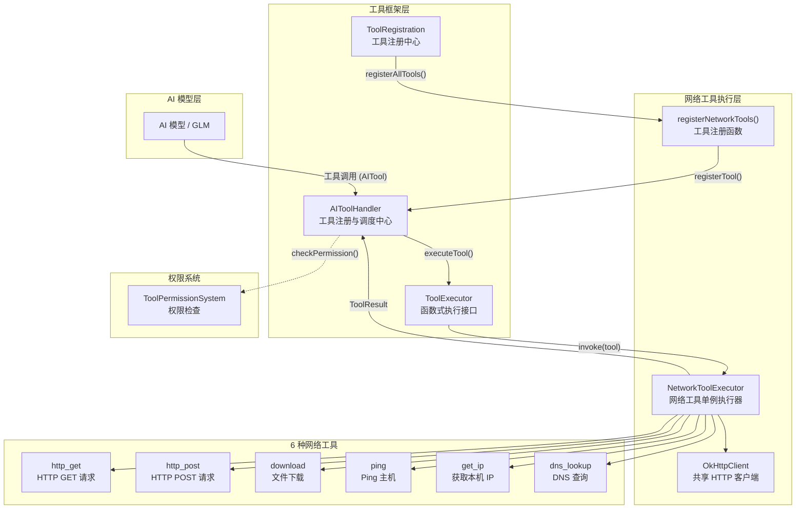
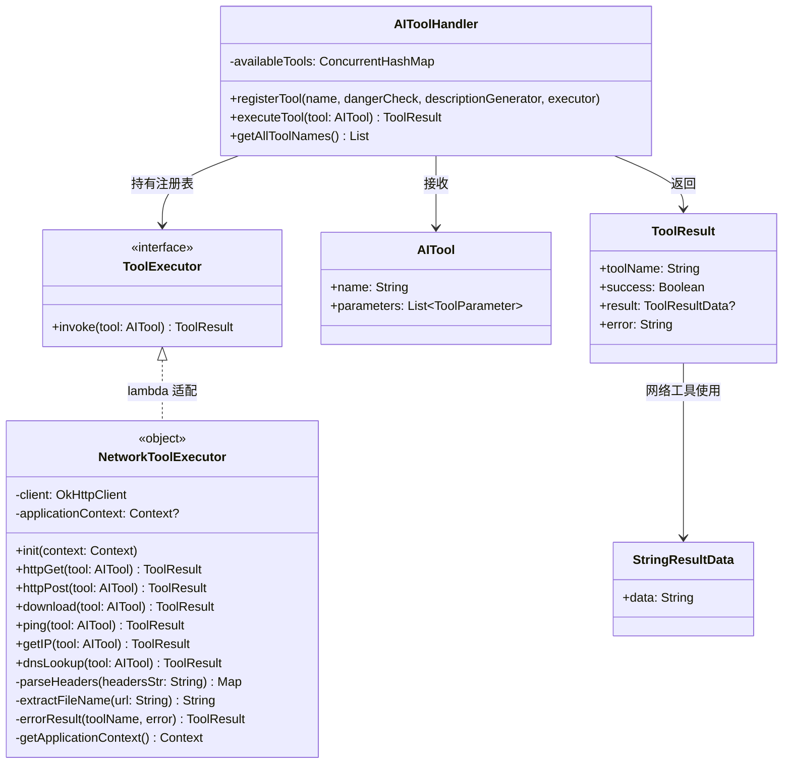
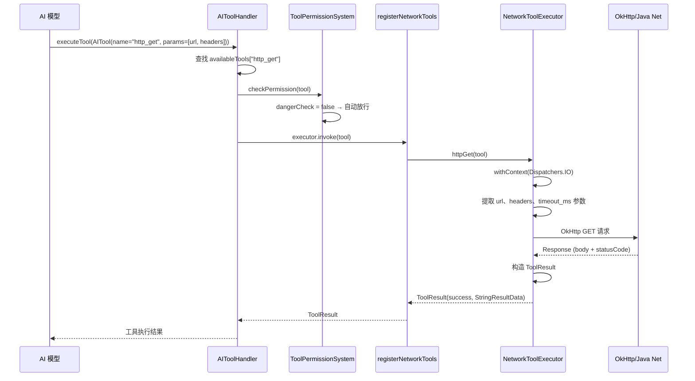

# 网络工具执行器

为 Aries AI 代理提供 HTTP 请求、文件下载、Ping、DNS 查询及本机 IP 获取等网络功能，使 AI 模型能够通过工具调用与网络进行交互。

## 概述

`NetworkToolExecutor` 是 Aries AI 框架中负责网络操作的核心执行器。它是一个 Kotlin 单例对象（`object`），封装了基于 OkHttp 的 HTTP 客户端和 Java 标准库的网络工具，为 AI 代理提供了 6 种网络工具能力。所有网络操作均在 `Dispatchers.IO` 上执行，确保不阻塞 Android 主线程。

**设计意图：** 在智能代理执行任务时，可能需要查询在线 API、下载资源文件、检测网络连通性或解析域名。`NetworkToolExecutor` 将这些常见网络操作统一封装为标准化的 `ToolExecutor` 接口，使得 AI 模型（如 GLM）可以通过流式工具调用（SSE tool-call stream）无缝发起网络请求。

### 核心特性

- **6 种网络工具**：HTTP GET/POST、文件下载、Ping 主机、获取本机 IP、DNS 查询
- **统一接口**：所有工具均实现 `ToolExecutor` 函数式接口（`suspend fun invoke(AITool): ToolResult`）
- **IO 线程调度**：所有网络操作通过 `withContext(Dispatchers.IO)` 在 IO 协程上下文中执行
- **共享 HTTP 客户端**：使用单例 `OkHttpClient` 实例，配置 30 秒连接/读写超时
- **参数化设计**：每个工具通过 `AITool.parameters` 接收参数，支持自定义请求头、超时、内容类型等
- **无危险标记**：所有网络工具 `dangerCheck` 均为 `{ false }`，被权限系统视为安全操作

## 架构



**架构说明：**

1. **AI 模型层**：AI 模型通过 SSE 流式协议发起工具调用，包含工具名称和参数列表
2. **工具框架层**：`AIToolHandler` 作为中央调度器管理工具注册表，`ToolRegistration` 在启动时调用 `registerNetworkTools()` 批量注册所有网络工具
3. **网络工具执行层**：`NetworkToolExecutor` 是实际执行网络操作的单例，持有共享的 `OkHttpClient` 实例
4. **权限系统**：`ToolPermissionSystem` 在工具执行前检查权限级别，网络工具因 `dangerCheck = { false }` 在 CAUTION 模式下自动放行

### 类关系图



## 工具清单与核心流程

### 注册的 6 种网络工具

| 工具名称 | 功能描述 | 关键参数 | 执行方法 |
|---------|---------|---------|---------|
| `http_get` | HTTP GET 请求 | `url`（必填）, `headers`, `timeout_ms` | `httpGet()` |
| `http_post` | HTTP POST 请求 | `url`（必填）, `body`, `content_type` | `httpPost()` |
| `download` | 下载文件到缓存目录 | `url`（必填）, `save_path` | `download()` |
| `ping` | Ping 主机检测可达性 | `host`（必填）, `count`, `timeout_ms` | `ping()` |
| `get_ip` | 获取本机 IPv4 地址 | 无 | `getIP()` |
| `dns_lookup` | DNS 域名解析 | `domain`（必填） | `dnsLookup()` |

### 工具执行流程



### 初始化流程

`NetworkToolExecutor` 采用延迟初始化策略。在 `registerNetworkTools()` 被调用时，首先通过 `init(context)` 保存 `ApplicationContext` 引用。后续的 `download` 操作需要使用 Context 来访问应用缓存目录。

```mermaid
flowchart TD
    Start([registerNetworkTools 调用]) --> Init[NetworkToolExecutor.init(context)]
    Init --> Save[保存 applicationContext 引用]
    Save --> Loop{遍历 6 种工具}
    Loop -->|每种工具| Reg[handler.registerTool(name, dangerCheck, descriptionGenerator, executor)]
    Reg -->|http_get| GET["executor → httpGet()"]
    Reg -->|http_post| POST["executor → httpPost()"]
    Reg -->|download| DL["executor → download()"]
    Reg -->|ping| PING["executor → ping()"]
    Reg -->|get_ip| IP["executor → getIP()"]
    Reg -->|dns_lookup| DNS["executor → dnsLookup()"]
    Loop --> Done[Log: "网络工具注册完成"]
    Done --> End([结束])
```

## 核心实现详解

### HTTP GET 请求

`httpGet` 方法通过 OkHttp 发送 GET 请求，支持自定义请求头和超时参数。响应体超过 200 字符会被截断展示，避免对 AI 模型产生过大的 token 消耗。

```kotlin
suspend fun httpGet(tool: AITool): ToolResult = withContext(Dispatchers.IO) {
    val url = tool.parameters.find { it.name == "url" }?.value
        ?: return@withContext errorResult(tool.name, "缺少 url 参数")

    val headersStr = tool.parameters.find { it.name == "headers" }?.value
    val timeout = tool.parameters.find { it.name == "timeout_ms" }?.value?.toLongOrNull() ?: 10000L

    try {
        val requestBuilder = Request.Builder()
            .url(url)
            .get()

        headersStr?.let { headers ->
            parseHeaders(headers).forEach { (key, value) ->
                requestBuilder.addHeader(key, value)
            }
        }

        val response = client.newCall(requestBuilder.build()).execute()
        val body = response.body?.string() ?: ""
        val statusCode = response.code

        val success = response.isSuccessful
        val resultMessage = if (success) {
            "HTTP GET 成功 (${statusCode}): ${body.take(200)}"
        } else {
            "HTTP GET 失败 (${statusCode}): $body"
        }

        ToolResult(
            toolName = tool.name,
            success = success,
            result = StringResultData(resultMessage),
            error = if (success) "" else "HTTP Error: $statusCode"
        )
    } catch (e: Exception) {
        errorResult(tool.name, "HTTP GET 失败: ${e.message}")
    }
}
```
> Source: [NetworkToolExecutor.kt](https://github.com/ZG0704666/Aries-AI/blob/main/app/src/main/java/com/ai/phoneagent/core/tools/network/NetworkToolExecutor.kt#L53-L93)

**设计要点：**
- 响应体使用 `.take(200)` 截断，避免大量文本消耗 AI 上下文窗口
- 自定义请求头通过 `parseHeaders()` 解析，支持 `key: value` 格式（每行一个头）

### HTTP POST 请求

`httpPost` 方法发送 POST 请求，默认 `Content-Type` 为 `application/json`。请求体通过 OkHttp 的 `toRequestBody` 构建。

```kotlin
suspend fun httpPost(tool: AITool): ToolResult = withContext(Dispatchers.IO) {
    val url = tool.parameters.find { it.name == "url" }?.value
        ?: return@withContext errorResult(tool.name, "缺少 url 参数")

    val body = tool.parameters.find { it.name == "body" }?.value ?: ""
    val contentType = tool.parameters.find { it.name == "content_type" }?.value ?: "application/json"

    try {
        val requestBody = body.toRequestBody(contentType.toMediaType())
        val request = Request.Builder()
            .url(url)
            .post(requestBody)
            .addHeader("Content-Type", contentType)
            .build()

        val response = client.newCall(request).execute()
        // ... 构造 ToolResult（与 GET 类似）
    } catch (e: Exception) {
        errorResult(tool.name, "HTTP POST 失败: ${e.message}")
    }
}
```
> Source: [NetworkToolExecutor.kt](https://github.com/ZG0704666/Aries-AI/blob/main/app/src/main/java/com/ai/phoneagent/core/tools/network/NetworkToolExecutor.kt#L98-L134)

### 文件下载

`download` 方法将远程文件下载到应用缓存目录，自动从 URL 提取文件名或使用自定义保存路径。

```kotlin
suspend fun download(tool: AITool): ToolResult = withContext(Dispatchers.IO) {
    val url = tool.parameters.find { it.name == "url" }?.value
        ?: return@withContext errorResult(tool.name, "缺少 url 参数")

    val savePath = tool.parameters.find { it.name == "save_path" }?.value

    try {
        val request = Request.Builder().url(url).get().build()
        val response = client.newCall(request).execute()

        if (!response.isSuccessful) {
            return@withContext errorResult(tool.name, "下载失败: ${response.code}")
        }

        val bytes = response.body?.bytes()
            ?: return@withContext errorResult(tool.name, "下载失败: 空响应")

        val fileName = if (savePath.isNullOrBlank()) {
            extractFileName(url)
        } else {
            savePath
        }

        val context = getApplicationContext()
        val file = java.io.File(context.cacheDir, fileName)
        file.writeBytes(bytes)
        // ... 返回结果
    }
}
```
> Source: [NetworkToolExecutor.kt](https://github.com/ZG0704666/Aries-AI/blob/main/app/src/main/java/com/ai/phoneagent/core/tools/network/NetworkToolExecutor.kt#L139-L187)

**安全设计：** 文件保存在应用私有缓存目录（`context.cacheDir`），无需存储权限，也避免了访问外部存储的安全问题。

### Ping 与 DNS 查询

Ping 通过 Java 标准库的 `InetAddress.isReachable()` 检测主机可达性。DNS 查询通过 `InetAddress.getAllByName()` 解析域名的所有 IP 地址。

```kotlin
// Ping 主机
suspend fun ping(tool: AITool): ToolResult = withContext(Dispatchers.IO) {
    val host = tool.parameters.find { it.name == "host" }?.value
        ?: return@withContext errorResult(tool.name, "缺少 host 参数")
    val timeout = tool.parameters.find { it.name == "timeout_ms" }?.value?.toIntOrNull() ?: 5000

    val reachable = InetAddress.getByName(host).isReachable(timeout)
    // ... 构造结果
}

// DNS 查询
suspend fun dnsLookup(tool: AITool): ToolResult = withContext(Dispatchers.IO) {
    val domain = tool.parameters.find { it.name == "domain" }?.value
        ?: return@withContext errorResult(tool.name, "缺少 domain 参数")

    val addresses = InetAddress.getAllByName(domain)
    val ips = addresses.map { it.hostAddress }.filterNotNull().joinToString(", ")
    // ... 构造结果
}
```
> Source: [NetworkToolExecutor.kt](https://github.com/ZG0704666/Aries-AI/blob/main/app/src/main/java/com/ai/phoneagent/core/tools/network/NetworkToolExecutor.kt#L192-L284)

### 获取本机 IP

`getIP` 方法遍历所有网络接口，返回第一个非回环且包含点分格式的 IPv4 地址。

```kotlin
suspend fun getIP(tool: AITool): ToolResult = withContext(Dispatchers.IO) {
    val interfaces = java.net.NetworkInterface.getNetworkInterfaces()
    var ipAddress = ""

    while (interfaces.hasMoreElements()) {
        val networkInterface = interfaces.nextElement()
        val addresses = networkInterface.inetAddresses
        while (addresses.hasMoreElements()) {
            val address = addresses.nextElement()
            if (!address.isLoopbackAddress && address.hostAddress?.contains('.') == true) {
                ipAddress = address.hostAddress ?: ""
                break
            }
        }
        if (ipAddress.isNotEmpty()) break
    }
    // ... 构造结果
}
```
> Source: [NetworkToolExecutor.kt](https://github.com/ZG0704666/Aries-AI/blob/main/app/src/main/java/com/ai/phoneagent/core/tools/network/NetworkToolExecutor.kt#L221-L255)

**设计意图：** 使用 `contains('.')` 过滤 IPv4 地址，排除 IPv6 格式；跳过回环地址（127.0.0.1）以确保获取的是真实网络 IP。

### 工具注册机制

所有网络工具通过顶层函数 `registerNetworkTools()` 批量注册到 `AIToolHandler`。每个工具注册时提供三个组件：

```kotlin
fun registerNetworkTools(handler: AIToolHandler, context: Context) {
    NetworkToolExecutor.init(context)

    handler.registerTool(
        name = "http_get",
        dangerCheck = { false },              // 非危险操作
        descriptionGenerator = { tool ->       // 操作描述（用于权限确认对话框）
            val url = tool.parameters.find { it.name == "url" }?.value ?: ""
            "HTTP GET: $url"
        },
        executor = { tool ->                   // 执行器（lambda 适配 ToolExecutor 接口）
            NetworkToolExecutor.httpGet(tool)
        }
    )
    // ... 其余 5 个工具类推
}
```
> Source: [NetworkToolExecutor.kt](https://github.com/ZG0704666/Aries-AI/blob/main/app/src/main/java/com/ai/phoneagent/core/tools/network/NetworkToolExecutor.kt#L332-L411)

工具注册的入口在 `ToolRegistration.registerAllTools()` 中调用：

```kotlin
fun registerAllTools(handler: AIToolHandler, context: Context) {
    registerUITools(handler, context)
    registerAppTools(handler, context)
    registerSystemTools(handler, context)
    // 注册网络工具
    registerNetworkTools(handler, context)
    // 注册文件系统工具
    registerFileTools(handler, context)
}
```
> Source: [ToolRegistration.kt](https://github.com/ZG0704666/Aries-AI/blob/main/app/src/main/java/com/ai/phoneagent/core/tools/ToolRegistration.kt#L46-L65)

## 辅助函数

### parseHeaders — 请求头解析

将字符串格式的自定义请求头解析为 Map。支持 `key: value` 格式，每行一个头。

```kotlin
private fun parseHeaders(headersStr: String): Map<String, String> {
    return headersStr.split("\n")
        .map { it.trim() }
        .filter { it.contains(":") }
        .associate {
            val parts = it.split(":", limit = 2)
            parts[0].trim() to parts.getOrElse(1) { "" }.trim()
        }
}
```
> Source: [NetworkToolExecutor.kt](https://github.com/ZG0704666/Aries-AI/blob/main/app/src/main/java/com/ai/phoneagent/core/tools/network/NetworkToolExecutor.kt#L288-L296)

### extractFileName — URL 文件名提取

从 URL 路径中提取文件名，URL 解析失败时生成带时间戳的默认文件名。

```kotlin
private fun extractFileName(url: String): String {
    return try {
        val path = URL(url).path
        val fileName = path.substringAfterLast("/")
        if (fileName.isNotEmpty()) fileName else "download_${System.currentTimeMillis()}"
    } catch (e: Exception) {
        "download_${System.currentTimeMillis()}"
    }
}
```
> Source: [NetworkToolExecutor.kt](https://github.com/ZG0704666/Aries-AI/blob/main/app/src/main/java/com/ai/phoneagent/core/tools/network/NetworkToolExecutor.kt#L298-L306)

### errorResult — 统一错误结果构建

所有工具的异常处理统一通过 `errorResult` 构建失败的 `ToolResult`，确保错误格式一致。

```kotlin
private fun errorResult(toolName: String, error: String): ToolResult {
    return ToolResult(
        toolName = toolName,
        success = false,
        result = StringResultData(""),
        error = error
    )
}
```
> Source: [NetworkToolExecutor.kt](https://github.com/ZG0704666/Aries-AI/blob/main/app/src/main/java/com/ai/phoneagent/core/tools/network/NetworkToolExecutor.kt#L319-L326)

## 权限与安全

所有网络工具的 `dangerCheck` 均设置为 `{ false }`，表示网络操作不被视为危险操作。在 `ToolPermissionSystem` 的 CAUTION（谨慎）模式下，非危险操作会自动放行，无需用户确认。

```kotlin
// 权限检查的核心逻辑
if (toolLevel == PermissionLevel.CAUTION) {
    val isDangerous = toolHandler.isDangerousOperation(tool)
    if (!isDangerous) {
        return true  // 非危险操作，自动允许
    }
}
```
> Source: [ToolPermissionSystem.kt](https://github.com/ZG0704666/Aries-AI/blob/main/app/src/main/java/com/ai/phoneagent/permissions/ToolPermissionSystem.kt#L110-L116)

**设计意图：** 网络请求（GET/POST）和诊断工具（Ping/DNS）在当前安全模型中被视为低风险操作。如果未来需要限制特定网络行为（如敏感 API 调用），可以通过修改 `dangerCheck` 回调或通过 `ToolPermissionsRepository` 设置工具级别的权限覆盖来实现。

## 使用示例

### HTTP GET 请求示例

AI 模型通过工具调用发起 HTTP GET 请求：

```kotlin
// AI 模型生成的工具调用
val tool = AITool(
    name = "http_get",
    parameters = listOf(
        ToolParameter("url", "https://api.example.com/data"),
        ToolParameter("headers", "Authorization: Bearer token123\nAccept: application/json"),
        ToolParameter("timeout_ms", "5000")
    )
)

// AIToolHandler 执行工具
val result = handler.executeTool(tool)
// result.success = true
// result.result = StringResultData("HTTP GET 成功 (200): {...}")
```
> Source: 基于 [AITool](https://github.com/ZG0704666/Aries-AI/blob/main/app/src/main/java/com/ai/phoneagent/data/model/AITool.kt#L6-L9) 和 [NetworkToolExecutor.kt](https://github.com/ZG0704666/Aries-AI/blob/main/app/src/main/java/com/ai/phoneagent/core/tools/network/NetworkToolExecutor.kt#L53-L93) 构造

### DNS 查询示例

```kotlin
val tool = AITool(
    name = "dns_lookup",
    parameters = listOf(
        ToolParameter("domain", "github.com")
    )
)

val result = NetworkToolExecutor.dnsLookup(tool)
// result.success = true
// result.result = StringResultData("github.com -> 140.82.121.3")
```
> Source: 基于 [NetworkToolExecutor.kt](https://github.com/ZG0704666/Aries-AI/blob/main/app/src/main/java/com/ai/phoneagent/core/tools/network/NetworkToolExecutor.kt#L260-L284) 构造

## 配置选项

### OkHttpClient 超时配置

| 参数 | 类型 | 默认值 | 说明 |
|------|------|--------|------|
| `connectTimeout` | Long | 30 秒 | 连接超时时间 |
| `readTimeout` | Long | 30 秒 | 读取超时时间 |
| `writeTimeout` | Long | 30 秒 | 写入超时时间 |

> Source: [NetworkToolExecutor.kt](https://github.com/ZG0704666/Aries-AI/blob/main/app/src/main/java/com/ai/phoneagent/core/tools/network/NetworkToolExecutor.kt#L44-L48)

### 工具参数选项

**http_get 参数：**

| 参数 | 类型 | 必填 | 默认值 | 说明 |
|------|------|------|--------|------|
| `url` | String | 是 | — | 请求 URL |
| `headers` | String | 否 | — | 自定义请求头（每行 `key: value` 格式） |
| `timeout_ms` | Long | 否 | 10000 | 请求超时（毫秒） |

**http_post 参数：**

| 参数 | 类型 | 必填 | 默认值 | 说明 |
|------|------|------|--------|------|
| `url` | String | 是 | — | 请求 URL |
| `body` | String | 否 | `""` | 请求体内容 |
| `content_type` | String | 否 | `"application/json"` | Content-Type 头值 |

**download 参数：**

| 参数 | 类型 | 必填 | 默认值 | 说明 |
|------|------|------|--------|------|
| `url` | String | 是 | — | 下载 URL |
| `save_path` | String | 否 | URL 文件名 | 保存路径（相对于缓存目录） |

**ping 参数：**

| 参数 | 类型 | 必填 | 默认值 | 说明 |
|------|------|------|--------|------|
| `host` | String | 是 | — | 目标主机名或 IP |
| `count` | Int | 否 | 4 | Ping 次数（预留，当前实现使用 `isReachable`） |
| `timeout_ms` | Int | 否 | 5000 | 超时时间（毫秒） |

**dns_lookup 参数：**

| 参数 | 类型 | 必填 | 默认值 | 说明 |
|------|------|------|--------|------|
| `domain` | String | 是 | — | 要解析的域名 |

**get_ip 参数：** 无需参数。

## API 参考

### `NetworkToolExecutor`

Kotlin 单例对象，提供所有网络工具的执行方法。使用前必须调用 `init(context)`。

#### `init(context: Context)`

初始化执行器，保存 ApplicationContext 引用。

**参数：**
- `context` (Context)：Android Context，内部转为 `applicationContext`

**抛出：**
- 无显式抛出。但若未调用 `init()` 而直接使用 `download`，会抛出 `IllegalStateException`

---

#### `suspend fun httpGet(tool: AITool): ToolResult`

执行 HTTP GET 请求。

**参数：**
- `tool` (AITool)：包含 `url`（必填）、`headers`（可选）、`timeout_ms`（可选）参数

**返回：** `ToolResult`，成功时 `result` 为 `StringResultData`，内容截断至 200 字符

**调度：** `Dispatchers.IO`

---

#### `suspend fun httpPost(tool: AITool): ToolResult`

执行 HTTP POST 请求。

**参数：**
- `tool` (AITool)：包含 `url`（必填）、`body`（可选，默认空字符串）、`content_type`（可选，默认 `"application/json"`）参数

**返回：** `ToolResult`，成功时 `result` 为 `StringResultData`

**调度：** `Dispatchers.IO`

---

#### `suspend fun download(tool: AITool): ToolResult`

下载文件到应用缓存目录。

**参数：**
- `tool` (AITool)：包含 `url`（必填）、`save_path`（可选）参数

**返回：** `ToolResult`，成功时 `result.data` 包含文件绝对路径和字节数

**调度：** `Dispatchers.IO`

---

#### `suspend fun ping(tool: AITool): ToolResult`

通过 `InetAddress.isReachable()` 检测主机可达性。

**参数：**
- `tool` (AITool)：包含 `host`（必填）、`count`（可选，默认 4）、`timeout_ms`（可选，默认 5000）参数

**返回：** `ToolResult`，`success` 表示主机是否可达

**调度：** `Dispatchers.IO`

---

#### `suspend fun getIP(tool: AITool): ToolResult`

获取本机首个非回环 IPv4 地址。

**参数：**
- `tool` (AITool)：无需特定参数

**返回：** `ToolResult`，`success` 表示是否成功获取 IP

**调度：** `Dispatchers.IO`

---

#### `suspend fun dnsLookup(tool: AITool): ToolResult`

对指定域名执行 DNS 解析。

**参数：**
- `tool` (AITool)：包含 `domain`（必填）参数

**返回：** `ToolResult`，成功时 `result.data` 格式为 `"域名 -> IP1, IP2"`

**调度：** `Dispatchers.IO`

---

### `registerNetworkTools(handler: AIToolHandler, context: Context)`

顶层函数，将 6 种网络工具批量注册到 AIToolHandler。

**参数：**
- `handler` (AIToolHandler)：工具注册处理器
- `context` (Context)：Android Context，用于初始化 NetworkToolExecutor

**注册的工具：** `http_get`、`http_post`、`download`、`ping`、`get_ip`、`dns_lookup`

> Source: [NetworkToolExecutor.kt](https://github.com/ZG0704666/Aries-AI/blob/main/app/src/main/java/com/ai/phoneagent/core/tools/network/NetworkToolExecutor.kt#L332-L411)

## 与 DI 模块的关系

`NetworkToolExecutor` 持有自己独立的 `OkHttpClient` 实例（30 秒超时），与 `NetworkModule` 中通过 Koin DI 管理的全局 `OkHttpClient`（60-360 秒超时）是**两个独立实例**。这种设计允许网络工具使用更短的超时配置，因为 AI 代理发起的工具调用通常期望快速响应，而全局 HTTP 客户端（用于 AutoGlmClient 等）需要更宽松的超时来处理长时间 AI 推理请求。

```kotlin
// NetworkModule.kt 中的全局 OkHttpClient 配置
val networkModule = module {
    single<OkHttpClient> {
        OkHttpClient.Builder()
            .connectTimeout(60, TimeUnit.SECONDS)    // 60s vs NetworkToolExecutor 的 30s
            .readTimeout(300, TimeUnit.SECONDS)       // 300s vs 30s
            .writeTimeout(120, TimeUnit.SECONDS)      // 120s vs 30s
            .callTimeout(360, TimeUnit.SECONDS)
            .connectionPool(ConnectionPool(10, 5, TimeUnit.MINUTES))
            .protocols(listOf(Protocol.HTTP_2, Protocol.HTTP_1_1))
            .build()
    }
}
```
> Source: [NetworkModule.kt](https://github.com/ZG0704666/Aries-AI/blob/main/app/src/main/java/com/ai/phoneagent/di/NetworkModule.kt#L47-L71)

## 相关链接

- [NetworkToolExecutor 源码](https://github.com/ZG0704666/Aries-AI/blob/main/app/src/main/java/com/ai/phoneagent/core/tools/network/NetworkToolExecutor.kt)
- [ToolExecutor 接口](https://github.com/ZG0704666/Aries-AI/blob/main/app/src/main/java/com/ai/phoneagent/core/tools/ToolExecutor.kt)
- [AIToolHandler 工具调度器](https://github.com/ZG0704666/Aries-AI/blob/main/app/src/main/java/com/ai/phoneagent/core/tools/AIToolHandler.kt)
- [ToolRegistration 工具注册中心](https://github.com/ZG0704666/Aries-AI/blob/main/app/src/main/java/com/ai/phoneagent/core/tools/ToolRegistration.kt)
- [AITool 数据模型](https://github.com/ZG0704666/Aries-AI/blob/main/app/src/main/java/com/ai/phoneagent/data/model/AITool.kt)
- [ToolResult 结果模型](https://github.com/ZG0704666/Aries-AI/blob/main/app/src/main/java/com/ai/phoneagent/data/model/ToolResult.kt)
- [NetworkModule DI 模块](https://github.com/ZG0704666/Aries-AI/blob/main/app/src/main/java/com/ai/phoneagent/di/NetworkModule.kt)
- [ToolPermissionSystem 权限系统](https://github.com/ZG0704666/Aries-AI/blob/main/app/src/main/java/com/ai/phoneagent/permissions/ToolPermissionSystem.kt)
- [ToolPermissionsRepository 权限存储](https://github.com/ZG0704666/Aries-AI/blob/main/app/src/main/java/com/ai/phoneagent/data/preferences/ToolPermissionsRepository.kt)
- [文件工具执行器（同类工具）](https://github.com/ZG0704666/Aries-AI/blob/main/app/src/main/java/com/ai/phoneagent/core/tools/file/FileToolExecutor.kt)
