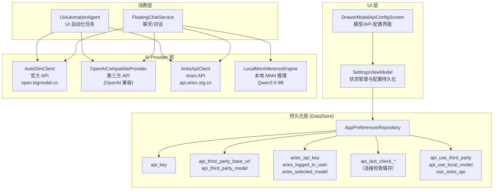
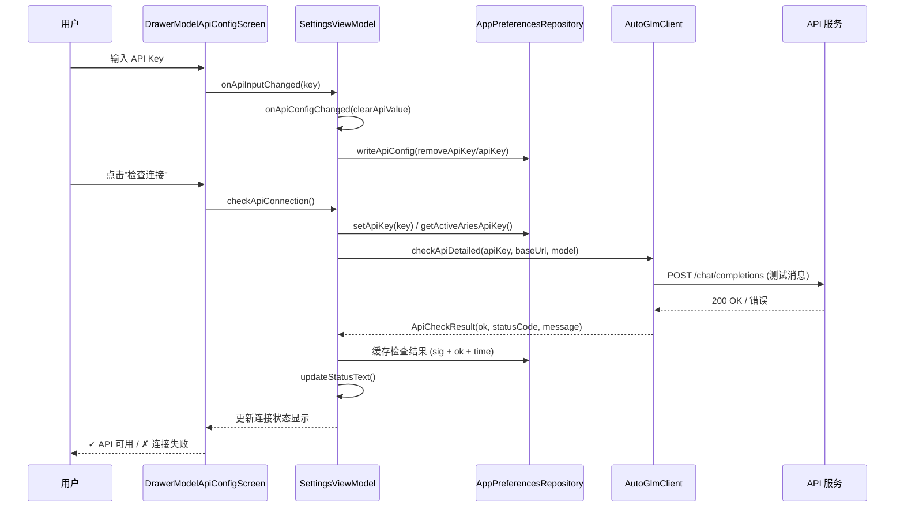
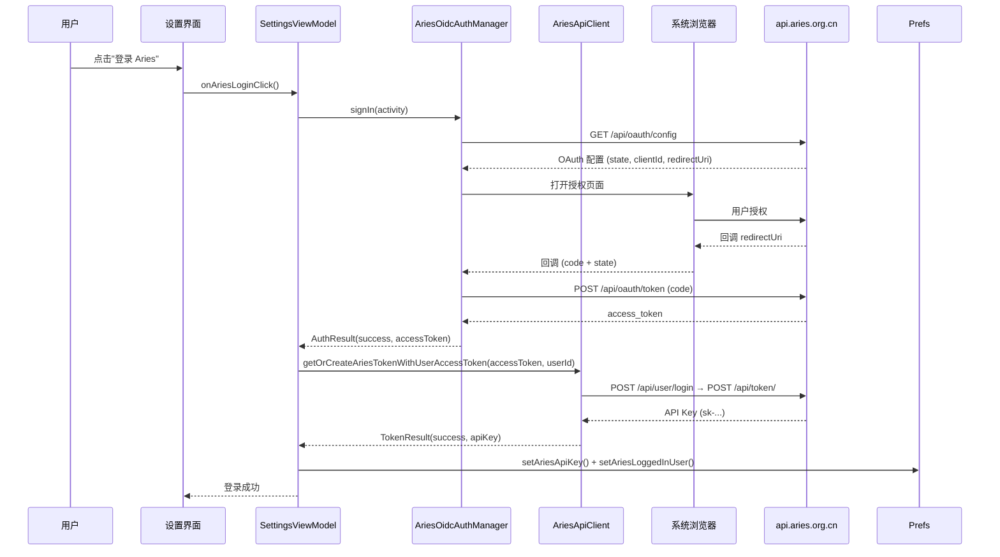

# API Key 与模型配置

Aries AI 提供灵活的 API Key 与模型配置系统，支持官方 API（智谱 AutoGLM）、第三方 OpenAI 兼容 API、Aries 自有 API 以及本地离线模型四种运行模式。

## 概述

Aries AI 的核心 AI 能力依赖于大语言模型推理。为了满足不同场景的需求，系统设计了一套多模式、可切换的 API 配置架构：

- **官方模式（Official）**：使用智谱 AI 的 AutoGLM 系列模型，开箱即用，推荐大多数用户使用
- **第三方模式（ThirdParty）**：接入任意 OpenAI 兼容 API（如 DeepSeek、Moonshot 等），灵活可控
- **Aries 模式（Aries）**：使用 Aries 自有 API 服务（`api.aries.org.cn`），通过 OAuth 登录获取 Token
- **本地模式（Local）**：在设备端运行 MNN 推理引擎，无需网络连接，隐私性最强

配置通过 Android DataStore 持久化存储，支持响应式观察（Kotlin `Flow`），UI 层通过 `SettingsViewModel` 管理状态，运行时由 `FloatingChatService` 和 `UiAutomationAgent` 统一解析使用。

## 架构



**架构说明：**

- **UI 层**：`DrawerModelApiConfigScreen` 提供四种模式的切换、API Key 输入、Base URL/Model 配置等界面。`SettingsViewModel` 负责状态管理、连接检查和配置持久化。
- **持久化层**：所有配置通过 `AppPreferencesRepository` 存入 Android Jetpack DataStore，支持协程式异步读写和 `Flow` 响应式观察。
- **Provider 层**：四种 Provider 实现了不同的 AI 推理后端。所有远程 Provider 均通过 `Bearer Token` 方式鉴权，请求路径统一为 `/chat/completions`（OpenAI 兼容格式）。
- **消费层**：`FloatingChatService`（聊天对话）和 `UiAutomationAgent`（UI 自动化）是系统中最主要的 API 消费者，通过 `resolveApiConfig()` 方法动态解析当前生效的配置。

## 四种 API 模式详解

### 模式对比

| 模式 | 标识符 | Provider | 网络需求 | API Key 来源 | 典型场景 |
|------|--------|----------|----------|-------------|----------|
| 官方 | `Official` | `AutoGlmClient` | 需要 | 智谱开放平台获取 | 日常使用，推荐 |
| 第三方 | `ThirdParty` | `OpenAICompatibleProvider` | 需要 | 各平台自行获取 | 使用其他模型/代理 |
| Aries | `Aries` | `AriesApiClient` | 需要 | OAuth 登录自动获取 | Aries 生态用户 |
| 本地 | `Local` | `LocalMnnInferenceEngine` | 不需要 | 无需 API Key | 离线/隐私场景 |

### 模式切换逻辑

当用户在设置界面切换模式时，`SettingsViewModel.onApiModeChange()` 负责应用新状态并清除之前的连接检查缓存：

> Source: [SettingsViewModel.kt](https://github.com/ZG0704666/Aries-AI/blob/main/app/src/main/java/com/ai/phoneagent/viewmodel/SettingsViewModel.kt#L243-L257)

```kotlin
fun onApiModeChange(mode: ApiMode, onToast: (String) -> Unit) {
    if (apiModePersistJob?.isActive == true) return
    if (mode == currentApiMode) return
    if (!showAriesApiSection && (mode == ApiMode.Local || mode == ApiMode.Aries)) return
    applyApiModeState(mode)
    apiCheckSeq++
    remoteApiOk = null
    remoteApiChecking = false
    lastCheckedApiKey = ""
    persistApiMode(clearCheckResults = true)
    if (mode == ApiMode.Local && !localModelReady) {
        onToast(stringRes(R.string.m3t_sidebar_local_model_not_ready))
    }
    updateStatusText()
}
```

### 运行时配置解析

在运行时，`FloatingChatService.resolveApiConfig()` 根据当前模式动态决定使用的 API Key、Base URL 和 Model：

> Source: [FloatingChatService.kt](https://github.com/ZG0704666/Aries-AI/blob/main/app/src/main/java/com/ai/phoneagent/FloatingChatService.kt#L340-L377)

```kotlin
private fun resolveApiConfig(): Triple<String, String, String> {
    val useAriesApi = appPrefsRepository.getUseAriesApiBlocking()
    val apiKey =
        if (useAriesApi) {
            appPrefsRepository.getActiveAriesApiKeyBlocking().trim()
        } else {
            appPrefsRepository.getApiKeyBlocking().trim()
        }
    val useThirdParty = appPrefsRepository.getApiUseThirdPartyBlocking()
    val useLocalModel = appPrefsRepository.getApiUseLocalModelBlocking()

    val baseUrl =
        if (useLocalModel) AutoGlmClient.DEFAULT_BASE_URL
        else if (useAriesApi) AriesApiClient.ARIES_API_V1_BASE_URL
        else if (!useThirdParty) AutoGlmClient.DEFAULT_BASE_URL
        else storedThirdPartyBaseUrl

    val model =
        if (useLocalModel) ModelScopeModelDownloader.QWEN35_MODEL_NAME
        else if (useAriesApi) AriesApiClient.ARIES_CHAT_MODEL
        else if (!useThirdParty) AutoGlmClient.DEFAULT_MODEL
        else appPrefsRepository.getApiThirdPartyModelBlockging().trim()
            .ifBlank { AutoGlmClient.DEFAULT_MODEL }

    return Triple(apiKey, baseUrl, model)
}
```

## 核心流程

### API Key 配置与连接检查流程



### Aries API OAuth 登录流程



## 持久化配置项

所有 API 相关的配置通过 `AppPreferencesRepository` 持久化存储。以下是核心存储 Key：

> Source: [AppPreferencesRepository.kt](https://github.com/ZG0704666/Aries-AI/blob/main/app/src/main/java/com/ai/phoneagent/data/preferences/AppPreferencesRepository.kt#L25-L47)

```kotlin
private object Keys {
    val apiKey = stringPreferencesKey("api_key")                    // 官方/第三方 API Key
    val autoglmApiKey = stringPreferencesKey("autoglm_api_key")     // AutoGLM 专用 Key
    val apiUseThirdParty = booleanPreferencesKey("api_use_third_party")  // 是否启用第三方
    val apiUseLocalModel = booleanPreferencesKey("api_use_local_model")  // 是否启用本地模型
    val apiThirdPartyBaseUrl = stringPreferencesKey("api_third_party_base_url")  // 第三方 Base URL
    val apiThirdPartyModel = stringPreferencesKey("api_third_party_model")       // 第三方模型名
    val apiLastCheckKey = stringPreferencesKey("api_last_check_key")   // 上次检查的 Key
    val apiLastCheckOk = booleanPreferencesKey("api_last_check_ok")    // 上次检查结果
    val apiLastCheckTime = longPreferencesKey("api_last_check_time")   // 上次检查时间
    val apiLastCheckSig = stringPreferencesKey("api_last_check_sig")   // 配置签名（用于缓存）
    val useAriesApi = booleanPreferencesKey("use_aries_api")           // 是否启用 Aries API
    val ariesApiSectionUnlocked = booleanPreferencesKey("aries_api_section_unlocked")
    val ariesLoggedInUser = stringPreferencesKey("aries_logged_in_user")  // Aries 登录用户名
    val ariesSelectedModel = stringPreferencesKey("aries_selected_model")  // Aries 已选模型
    val ariesApiKey = stringPreferencesKey("aries_api_key")              // Aries API Key
}
```

### 批量写入 API

`writeApiConfig()` 方法支持一次性写入多项 API 配置，避免多次 I/O 操作：

> Source: [AppPreferencesRepository.kt](https://github.com/ZG0704666/Aries-AI/blob/main/app/src/main/java/com/ai/phoneagent/data/preferences/AppPreferencesRepository.kt#L589-L620)

```kotlin
suspend fun writeApiConfig(
    apiKey: String? = null,
    removeApiKey: Boolean = false,
    useThirdParty: Boolean? = null,
    useLocalModel: Boolean? = null,
    thirdPartyBaseUrl: String? = null,
    thirdPartyModel: String? = null,
    lastCheckKey: String? = null,
    lastCheckOk: Boolean? = null,
    lastCheckTime: Long? = null,
    lastCheckSig: String? = null,
    clearCheckResults: Boolean = false,
) { ... }
```

### Aries API Key 获取优先级

`getActiveAriesApiKey()` 方法定义了 Aries 模式下的 Key 获取优先级：优先使用专用 `aries_api_key`，若为空则回退到通用 `api_key`（仅当已有登录用户时）：

> Source: [AppPreferencesRepository.kt](https://github.com/ZG0704666/Aries-AI/blob/main/app/src/main/java/com/ai/phoneagent/data/preferences/AppPreferencesRepository.kt#L270-L280)

```kotlin
suspend fun getActiveAriesApiKey(): String {
    val prefs = context.appPreferencesDataStore.data.first()
    val ariesKey = prefs[Keys.ariesApiKey].orEmpty()
    if (ariesKey.isNotBlank()) return ariesKey
    val loggedInUser = prefs[Keys.ariesLoggedInUser].orEmpty()
    return if (loggedInUser.isNotBlank()) {
        prefs[Keys.apiKey].orEmpty()
    } else {
        ""
    }
}
```

## 配置选项

### 全局 Agent 模型参数

`AgentConfiguration` 定义了统一的模型调用参数。所有参数都有合理默认值，可按需覆盖：

> Source: [AgentConfiguration.kt](https://github.com/ZG0704666/Aries-AI/blob/main/app/src/main/java/com/ai/phoneagent/core/config/AgentConfiguration.kt#L38-L166)

| 参数 | 类型 | 默认值 | 说明 |
|------|------|--------|------|
| `temperature` | `Float?` | `0.0f` | 温度参数，自动化任务需要高确定性 |
| `topP` | `Float?` | `0.85f` | nucleus sampling 参数 |
| `frequencyPenalty` | `Float?` | `0.2f` | 频率惩罚，减少重复 token |
| `maxTokens` | `Int?` | `4096` | 单次回复最大 token 数 |
| `maxModelRetries` | `Int` | `3` | 模型调用最大重试次数 |
| `modelRetryBaseDelayMs` | `Long` | `700` | 重试基础延迟（毫秒） |
| `maxContextTokens` | `Int` | `20000` | 最大上下文 token 数（本地裁剪阈值） |
| `maxHistoryTurns` | `Int` | `6` | 最多保留对话轮数 |
| `maxParseRepairs` | `Int` | `2` | 解析修复最大次数 |
| `maxActionRepairs` | `Int` | `1` | 动作执行修复最大次数 |

### AutoGLM 客户端默认值

> Source: [AutoGlmClient.kt](https://github.com/ZG0704666/Aries-AI/blob/main/app/src/main/java/com/ai/phoneagent/net/AutoGlmClient.kt#L159-L166)

| 参数 | 默认值 | 说明 |
|------|--------|------|
| `DEFAULT_BASE_URL` | `https://open.bigmodel.cn/api/paas/v4/` | 智谱官方 API 地址 |
| `DEFAULT_MODEL` | `glm-4.6v-flash` | 默认对话模型 |
| `PHONE_MODEL` | `autoglm-phone` | 手机自动化专用模型 |
| 默认温度 | `0.0f` | 高确定性 |
| 默认 top_p | `0.85f` | - |
| 默认 frequency_penalty | `0.2f` | - |
| 默认 max_tokens | `4096` | - |

### Aries API 常量

> Source: [AriesApiClient.kt](https://github.com/ZG0704666/Aries-AI/blob/main/app/src/main/java/com/ai/phoneagent/net/AriesApiClient.kt#L36-L41)

| 参数 | 值 | 说明 |
|------|-----|------|
| `BASE_URL` | `https://api.aries.org.cn` | Aries API 管理接口 |
| `ARIES_API_V1_BASE_URL` | `https://api.aries.org.cn/v1` | Aries API v1（OpenAI 兼容） |
| `ARIES_CHAT_MODEL` | `星环` | 默认对话模型 |
| `ARIES_VISION_MODEL` | `星环 Pro` | 视觉模型 |
| `ARIES_AUTOMATION_MODEL` | `GUI` | 自动化专用模型 |

### 本地模型参数

> Source: [LocalMnnInferenceEngine.kt](https://github.com/ZG0704666/Aries-AI/blob/main/app/src/main/java/com/ai/phoneagent/net/LocalMnnInferenceEngine.kt#L19-L23)

| 参数 | 默认值 | 说明 |
|------|--------|------|
| `LOCAL_MAX_NEW_TOKENS` | `640` | 每次推理最大新 token |
| `LOCAL_MAX_DURATION_MS` | `75000` | 单次推理最大时长（毫秒） |
| `LOCAL_MAX_OUTPUT_CHARS` | `3600` | 最大输出字符数 |
| `LOCAL_MAX_REPEAT_CHUNK_STREAK` | `22` | 连续重复片段阈值（触发截断） |
| `LOCAL_MAX_IMAGE_BYTES` | `8 MB` | 最大图片大小 |
| `QWEN35_MODEL_ID` | `MNN/Qwen3.5-9B-MNN` | ModelScope 模型 ID |
| `QWEN35_MODEL_NAME` | `Qwen3.5-9B` | 本地模型名称 |

## API Reference

### AIProvider 接口

> Source: [AIProvider.kt](https://github.com/ZG0704666/Aries-AI/blob/main/app/src/main/java/com/ai/phoneagent/net/AIProvider.kt#L9-L83)

```kotlin
interface AIProvider {
    val providerName: String          // 供应商名称
    val modelName: String             // 模型名称
    val supportsVision: Boolean       // 是否支持视觉输入
    val supportsAudio: Boolean        // 是否支持音频输入
    val supportsVideo: Boolean        // 是否支持视频输入
    val enableToolCall: Boolean       // 是否启用 Tool Call API

    suspend fun sendMessageStream(
        messages: List<ChatMessage>,
        onChunk: (String) -> Unit,
        onComplete: () -> Unit,
        onError: (Throwable) -> Unit
    )

    fun buildContentWithAttachments(
        text: String,
        attachments: List<AttachmentInfo>
    ): Any

    fun parseXmlToolCalls(content: String): Pair<String, Any?>
    fun parseXmlToolResults(content: String): Pair<String, Any?>
}
```

### OpenAICompatibleProvider

> Source: [OpenAICompatibleProvider.kt](https://github.com/ZG0704666/Aries-AI/blob/main/app/src/main/java/com/ai/phoneagent/net/OpenAICompatibleProvider.kt#L34-L42)

```kotlin
class OpenAICompatibleProvider(
    private val apiKey: String,              // API Key（自动添加 Bearer 前缀）
    private val baseUrl: String,             // API 端点 URL
    override val modelName: String,          // 模型名称
    override val supportsVision: Boolean,    // 视觉支持
    override val supportsAudio: Boolean,     // 音频支持
    override val supportsVideo: Boolean,     // 视频支持
    override val enableToolCall: Boolean     // Tool Call 支持
) : AIProvider
```

请求格式遵循 OpenAI Chat Completions API，鉴权通过 `Authorization: Bearer $apiKey` Header。

### AutoGlmClient API

> Source: [AutoGlmClient.kt](https://github.com/ZG0704666/Aries-AI/blob/main/app/src/main/java/com/ai/phoneagent/net/AutoGlmClient.kt#L207-L219)

```kotlin
// 流式聊天
suspend fun sendChatStreamResult(
    apiKey: String,
    messages: List<ChatRequestMessage>,
    baseUrl: String = DEFAULT_BASE_URL,
    model: String = DEFAULT_MODEL,
    temperature: Float? = DEFAULT_TEMPERATURE,
    maxTokens: Int? = DEFAULT_MAX_TOKENS,
    topP: Float? = DEFAULT_TOP_P,
    frequencyPenalty: Float? = DEFAULT_FREQUENCY_PENALTY,
    onReasoningDelta: (String) -> Unit,    // 思考过程增量回调
    onContentDelta: (String) -> Unit,      // 内容增量回调
    shouldStop: (() -> Boolean)? = null,   // 提前停止信号
    useFastTimeouts: Boolean = false,       // 是否使用更快超时
): Result<Unit>

// API 连接检查（详细）
suspend fun checkApiDetailed(
    apiKey: String,
    baseUrl: String = DEFAULT_BASE_URL,
    model: String = DEFAULT_MODEL,
): ApiCheckResult
```

### AriesApiClient API

> Source: [AriesApiClient.kt](https://github.com/ZG0704666/Aries-AI/blob/main/app/src/main/java/com/ai/phoneagent/net/AriesApiClient.kt#L162-L188)

```kotlin
// 登录并获取 API Key
suspend fun loginAndGetApiKey(
    username: String,
    password: String
): LoginAndTokenResult

// 获取可用模型列表
suspend fun fetchModels(apiKey: String): Result<List<ModelInfo>>
```

### LocalMnnInferenceEngine API

> Source: [LocalMnnInferenceEngine.kt](https://github.com/ZG0704666/Aries-AI/blob/main/app/src/main/java/com/ai/phoneagent/net/LocalMnnInferenceEngine.kt#L32-L38)

```kotlin
// 流式推理
suspend fun sendChatStreamResult(
    context: Context,
    messages: List<ChatRequestMessage>,
    onReasoningDelta: (String) -> Unit,
    onContentDelta: (String) -> Unit,
    shouldStop: (() -> Boolean)? = null,
): Result<Unit>

// 释放推理会话
suspend fun releaseSession()
```

## 使用示例

### 配置官方 API Key

用户在设置界面输入 API Key 后，点击"检查连接"按钮验证可用性。系统通过发送一条简单的测试消息完成健康检查：

> Source: [AutoGlmClient.kt](https://github.com/ZG0704666/Aries-AI/blob/main/app/src/main/java/com/ai/phoneagent/net/AutoGlmClient.kt#L361-L383)

```kotlin
suspend fun checkApiDetailed(
    apiKey: String,
    baseUrl: String = DEFAULT_BASE_URL,
    model: String = DEFAULT_MODEL,
): ApiCheckResult = withContext(Dispatchers.IO) {
    runCatching {
        val normalizedApiKey = normalizeApiKey(apiKey)
        val requestBodyJson = AppJson.encodeToString(
            ChatRequest(
                model = resolveModel(model),
                messages = listOf(
                    ChatRequestMessage(
                        role = "user",
                        content = "Reply with OK."
                    )
                ),
                stream = false,
                max_tokens = 32,
            )
        )
        val requestBuilder = Request.Builder()
            .url(normalizeBaseUrl(baseUrl) + "chat/completions")
            .addHeader("Content-Type", "application/json")
        if (normalizedApiKey.isNotBlank()) {
            requestBuilder.addHeader("Authorization", "Bearer $normalizedApiKey")
        }
        // ... 执行请求并解析结果
    }
}
```

### 配置第三方 API

切换到第三方模式后，需要填写自定义的 Base URL 和 Model 名称：

> Source: [SettingsViewModel.kt](https://github.com/ZG0704666/Aries-AI/blob/main/app/src/main/java/com/ai/phoneagent/viewmodel/SettingsViewModel.kt#L269-L281)

```kotlin
fun onApiBaseUrlChange(value: String) {
    apiBaseUrlText = value
    if (useThirdPartyApi) {
        onApiConfigChanged(clearApiValue = false)
    }
}

fun onApiModelChange(value: String) {
    apiModelText = value
    if (useThirdPartyApi) {
        onApiConfigChanged(clearApiValue = false)
    }
}
```

### 下载并启用本地模型

本地模型需要先从 ModelScope 下载 Qwen3.5-9B-MNN 模型文件，包含模型权重（`llm.mnn.weight`）、配置文件（`config.json`、`llm_config.json`）和分词器（`tokenizer.txt`）等：

> Source: [ModelScopeModelDownloader.kt](https://github.com/ZG0704666/Aries-AI/blob/main/app/src/main/java/com/ai/phoneagent/net/ModelScopeModelDownloader.kt#L45-L61)

```kotlin
private val requiredExactNames = setOf(
    "config.json",
    "configuration.json",
    "llm.mnn",
    "llm.mnn.json",
    "llm.mnn.weight",
    "llm_config.json",
    "tokenizer.txt",
    "visual.mnn",
    "visual.mnn.weight",
)

private val extraRequiredExactNamesByModelId = mapOf(
    "MNN/Qwen3.5-9B-MNN" to setOf("embeddings_bf16.bin"),
)
```

本地推理通过 `LocalMnnInferenceEngine` 执行，内置了生成保护机制（`GenerationGuard`），自动检测并截断循环输出、超长输出等异常情况。

### Aries API OAuth 登录

Aries 模式通过 OIDC 流程登录，无需手动填写 API Key。登录成功后在后台自动创建 Token：

> Source: [AriesOidcAuthManager.kt](https://github.com/ZG0704666/Aries-AI/blob/main/app/src/main/java/com/ai/phoneagent/net/AriesOidcAuthManager.kt#L64-L80)

```kotlin
suspend fun signIn(activity: Activity): AuthResult {
    val cookieJar = InMemoryCookieJar()
    val client = OkHttpClient.Builder()
        .cookieJar(cookieJar)
        .connectTimeout(30, TimeUnit.SECONDS)
        .readTimeout(30, TimeUnit.SECONDS)
        .build()
    val config = withContext(Dispatchers.IO) {
        fetchApiOAuthConfig(client)
    }.getOrElse { error ->
        return AuthResult(
            success = false,
            message = error.message?.trim().orEmpty()
                .ifBlank { "获取 Aries API 登录配置失败" },
        )
    }
    // ... OAuth 流程
}
```

## 相关链接

- [AppPreferencesRepository 源码](https://github.com/ZG0704666/Aries-AI/blob/main/app/src/main/java/com/ai/phoneagent/data/preferences/AppPreferencesRepository.kt) — API 配置持久化存储
- [SettingsViewModel 源码](https://github.com/ZG0704666/Aries-AI/blob/main/app/src/main/java/com/ai/phoneagent/viewmodel/SettingsViewModel.kt) — API 设置 ViewModel
- [DrawerSettingsScreen 源码](https://github.com/ZG0704666/Aries-AI/blob/main/app/src/main/java/com/ai/phoneagent/ui/settings/DrawerSettingsScreen.kt) — API 配置 UI
- [AutoGlmClient 源码](https://github.com/ZG0704666/Aries-AI/blob/main/app/src/main/java/com/ai/phoneagent/net/AutoGlmClient.kt) — 官方 API 客户端
- [OpenAICompatibleProvider 源码](https://github.com/ZG0704666/Aries-AI/blob/main/app/src/main/java/com/ai/phoneagent/net/OpenAICompatibleProvider.kt) — 第三方 API Provider
- [AriesApiClient 源码](https://github.com/ZG0704666/Aries-AI/blob/main/app/src/main/java/com/ai/phoneagent/net/AriesApiClient.kt) — Aries API 客户端
- [LocalMnnInferenceEngine 源码](https://github.com/ZG0704666/Aries-AI/blob/main/app/src/main/java/com/ai/phoneagent/net/LocalMnnInferenceEngine.kt) — 本地推理引擎
- [ModelScopeModelDownloader 源码](https://github.com/ZG0704666/Aries-AI/blob/main/app/src/main/java/com/ai/phoneagent/net/ModelScopeModelDownloader.kt) — 本地模型下载
- [AgentConfiguration 源码](https://github.com/ZG0704666/Aries-AI/blob/main/app/src/main/java/com/ai/phoneagent/core/config/AgentConfiguration.kt) — Agent 模型参数配置
- [FloatingChatService 源码](https://github.com/ZG0704666/Aries-AI/blob/main/app/src/main/java/com/ai/phoneagent/FloatingChatService.kt) — 运行时的 API 配置消费
- [AriesOidcAuthManager 源码](https://github.com/ZG0704666/Aries-AI/blob/main/app/src/main/java/com/ai/phoneagent/net/AriesOidcAuthManager.kt) — Aries OAuth 认证管理
- [AIProvider 接口](https://github.com/ZG0704666/Aries-AI/blob/main/app/src/main/java/com/ai/phoneagent/net/AIProvider.kt) — AI Provider 统一接口
- [智谱 AI 开放平台](https://open.bigmodel.cn/usercenter/proj-mgmt/apikeys) — 官方 API Key 获取页面
