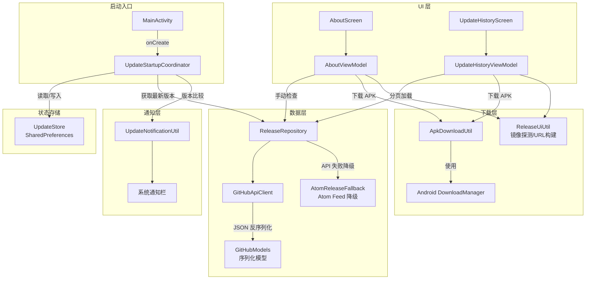
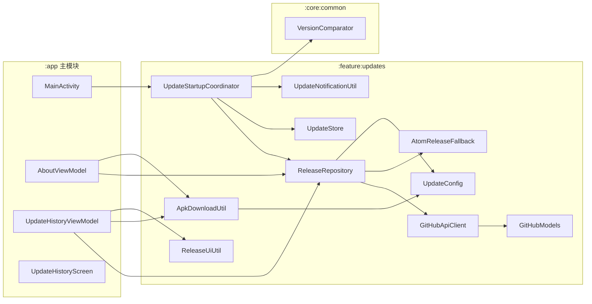

# APK 下载与安装

Aries AI 内置了完整的版本更新系统，支持从 GitHub Releases 自动检查新版本、下载 APK 并通过系统安装器完成安装。

## 概述

Aries AI 的 APK 下载与安装系统是一个多层次的功能模块，主要提供以下能力：

- **静默版本检查**：应用启动时自动在后台检查 GitHub Releases，发现新版本时通过通知栏提醒用户
- **手动检查更新**：用户可在"关于"页面主动检查更新，查看新版本信息
- **更新历史浏览**：以分页形式展示 GitHub Releases 上的所有发布版本，支持预发布版本过滤
- **多源 APK 下载**：支持官方直连和镜像加速两种下载源，自动探测可用性和延迟
- **下载管理**：使用 Android 系统 `DownloadManager` 管理下载任务，支持进度追踪和失败反馈

整个系统采用 **静默 + 显式** 双重检查策略：启动时静默检查确保用户不会错过重要更新，同时提供手动检查入口供用户主动获取最新版本。

## 架构



**架构说明：**

- **`UpdateStartupCoordinator`** 作为静默检查的入口，在 `MainActivity.onCreate()` 中被调用。它负责协调 `ReleaseRepository` 获取远端信息、`UpdateStore` 管理本地状态、`UpdateNotificationUtil` 发送通知
- **`ReleaseRepository`** 是数据层的核心，封装了从 GitHub API 获取 Release 信息的逻辑，内置重试和 Atom Feed 降级策略
- **`ApkDownloadUtil`** 封装了 `DownloadManager` 的使用细节：设置请求头（User-Agent、Authorization、Cookie）、配置下载目标路径、注册完成回调
- **`ReleaseUiUtil`** 提供镜像站点探测能力：并发探测多个下载源的可用性和延迟，按延迟排序后返回给用户
- **`UpdateStore`** 使用 SharedPreferences 持久化上次检查时间、最新版本信息、已通知版本号等状态

## 版本检查流程

```mermaid
sequenceDiagram
    participant MA as MainActivity
    participant USC as UpdateStartupCoordinator
    participant US as UpdateStore
    participant RR as ReleaseRepository
    participant GAC as GitHubApiClient
    participant ARF as AtomReleaseFallback
    participant UNU as UpdateNotificationUtil

    MA->>USC: silentCheckOnLaunch()
    USC->>US: loadLatest() 读取缓存
    US-->>USC: 缓存的 ReleaseEntry

    alt 缓存中有更新版本
        USC->>UNU: notifyIfNeeded()
        UNU-->>USC: 通知发送结果
    end

    USC->>US: shouldSilentCheck() 检查间隔
    alt 距上次检查不足 6 小时
        USC-->>MA: 跳过检查
    else 需要检查
        USC->>US: markSilentChecked() 更新时间戳
        USC->>RR: fetchLatestReleaseResilient()
        RR->>GAC: listReleases(page, perPage)
        
        alt GitHub API 成功
            GAC-->>RR: List&lt;GitHubRelease&gt;
        else API 失败
            RR->>GAC: 重试 (最多3次, 指数退避)
            GAC-->>RR: 失败
            RR->>ARF: fetchLatest() Atom Feed 降级
            ARF-->>RR: ReleaseEntry?
        end

        RR-->>USC: Result&lt;ReleaseEntry?&gt;
        
        alt 有新版本
            USC->>US: saveLatest()
            USC->>UNU: notifyNewVersion()
            UNU->>UNU: 构建 PendingIntent 指向 MainActivity
            UNU-->>USC: 通知发送成功
            USC->>US: markNotified()
        end
    end
```

### 关键设计决策

**6 小时静默检查间隔**：避免频繁的 GitHub API 调用。`UpdateStartupCoordinator` 使用 `SILENT_CHECK_INTERVAL_MS = 6 * 60 * 60 * 1000` 常量控制检查频率。

> Source: [UpdateStartupCoordinator.kt](https://github.com/ZG0704666/Aries-AI/blob/main/feature/updates/src/main/java/com/ai/phoneagent/updates/UpdateStartupCoordinator.kt#L15)

**Atom Feed 降级策略**：当 GitHub REST API 不可用（如触发限流）时，`ReleaseRepository.fetchLatestReleaseResilient()` 会经过 3 次指数退避重试后，降级到 GitHub Atom Feed（`releases.atom`）来解析版本信息。

> Source: [ReleaseRepository.kt](https://github.com/ZG0704666/Aries-AI/blob/main/feature/updates/src/main/java/com/ai/phoneagent/updates/ReleaseRepository.kt#L52-L71)

**版本比较算法**：使用语义化版本解析，支持 `major.minor.patch+build` 格式。先去除前缀 `v`/`V`，再按 major → minor → patch → build 顺序依次比较。

> Source: [VersionComparator.kt](https://github.com/ZG0704666/Aries-AI/blob/main/core/common/src/main/java/com/ai/phoneagent/core/common/VersionComparator.kt#L36-L44)

## APK 下载流程

```mermaid
flowchart TD
    Start([用户点击下载]) --> CheckToken{GITHUB_TOKEN<br/>是否配置?}
    
    CheckToken -->|是| DirectDL[使用 GitHub API<br/>下载 Asset]
    CheckToken -->|否| CheckURL{apkUrl<br/>是否为空?}
    
    CheckURL -->|是| OpenRelease1[跳转 GitHub Release 页面]
    CheckURL -->|否| MirrorOptions[ReleaseUiUtil<br/>构建镜像选项]
    
    MirrorOptions --> OptionCount{选项数量?}
    
    OptionCount -->|0| OpenRelease2[跳转 GitHub Release 页面]
    OptionCount -->|1| SingleURL[直接打开下载链接]
    OptionCount -->|>1| ShowDialog[显示下载源选择对话框]
    
    DirectDL --> BuildReq[构建 DownloadManager.Request]
    BuildReq --> SetHeaders[设置请求头:<br/>User-Agent, Authorization,<br/>Accept: octet-stream]
    SetHeaders --> SetDest[设置目标路径:<br/>DIRECTORY_DOWNLOADS/<br/>Aries-AI-{version}.apk]
    SetDest --> Enqueue[dm.enqueue() 入队下载]
    
    Enqueue --> RegisterReceiver[注册 BroadcastReceiver<br/>监听下载完成]
    RegisterReceiver --> ToastStart[Toast: 开始下载]
    ToastStart --> Done([下载进行中...])
    
    ShowDialog --> UserChoice{用户选择镜像}
    UserChoice --> MirrorURL[打开选中的镜像链接]
    
    SingleURL --> MirrorURL
    OpenRelease1 --> End1([结束])
    OpenRelease2 --> End1
    MirrorURL --> End1
```

### 核心实现

#### ApkDownloadUtil — 下载任务调度

`ApkDownloadUtil` 是 APK 下载的核心工具类，封装了 Android `DownloadManager` 的使用。它支持两种下载模式：

**模式一：通过 GitHub Token 直接下载 Asset（推荐）**

当 `local.properties` 中配置了 `github.token` 时，直接通过 GitHub API 的 asset 端点下载，携带 `Authorization` 请求头和 `Accept: application/octet-stream`：

```kotlin
fun enqueueApkDownload(context: Context, entry: ReleaseEntry): Boolean {
    val resolvedUrl =
        if (BuildConfig.GITHUB_TOKEN.isNotBlank() && entry.apkAssetId != null) {
            "https://api.github.com/repos/${UpdateConfig.REPO_OWNER}/${UpdateConfig.REPO_NAME}/releases/assets/${entry.apkAssetId}"
        } else {
            entry.apkUrl
        }

    if (resolvedUrl.isNullOrBlank()) {
        val opened = ReleaseUiUtil.openUrl(context, entry.releaseUrl)
        if (!opened) {
            Toast.makeText(context, R.string.about_open_url_failed, Toast.LENGTH_SHORT).show()
        }
        return opened
    }

    val fileName = "${UpdateConfig.REPO_NAME}-${entry.versionTag}.apk".replace("/", "_")
    val req = DownloadManager.Request(Uri.parse(resolvedUrl))
    req.setTitle(context.getString(R.string.update_download_title_format, entry.versionTag))
    req.setDescription(entry.title)
    req.setNotificationVisibility(DownloadManager.Request.VISIBILITY_VISIBLE_NOTIFY_COMPLETED)
    req.setMimeType("application/vnd.android.package-archive")
    req.setDestinationInExternalPublicDir(Environment.DIRECTORY_DOWNLOADS, fileName)
    req.addRequestHeader("User-Agent", "PhoneAgent")
    buildAuthHeader(BuildConfig.GITHUB_TOKEN)?.let { req.addRequestHeader("Authorization", it) }
    if (BuildConfig.GITHUB_TOKEN.isNotBlank() && entry.apkAssetId != null) {
        req.addRequestHeader("Accept", "application/octet-stream")
    }

    return enqueueRequest(context, req, fileName)
}
```

> Source: [ApkDownloadUtil.kt](https://github.com/ZG0704666/Aries-AI/blob/main/feature/updates/src/main/java/com/ai/phoneagent/updates/ApkDownloadUtil.kt#L55-L85)

**模式二：通用 URL 下载**

也支持下载任意 URL 的资源（如本地 AI 模型），自动携带 Cookie 以提升镜像站兼容性：

```kotlin
fun enqueueDownloadUrl(
    context: Context,
    url: String,
    fileName: String,
    title: String,
    description: String,
    mimeType: String? = null,
): Boolean {
    val req = DownloadManager.Request(Uri.parse(url))
    req.setTitle(title)
    req.setDescription(description)
    req.setNotificationVisibility(DownloadManager.Request.VISIBILITY_VISIBLE_NOTIFY_COMPLETED)
    if (!mimeType.isNullOrBlank()) {
        req.setMimeType(mimeType)
    }

    req.setDestinationInExternalPublicDir(Environment.DIRECTORY_DOWNLOADS, fileName)
    req.addRequestHeader("User-Agent", "PhoneAgent")

    // 在部分镜像站中，携带 Cookie 能显著提升 DownloadManager 拉起成功率
    val cookie = runCatching { CookieManager.getInstance().getCookie(url) }.getOrNull()
    if (!cookie.isNullOrBlank()) {
        req.addRequestHeader("Cookie", cookie)
    }

    return enqueueRequest(context, req, fileName)
}
```

> Source: [ApkDownloadUtil.kt](https://github.com/ZG0704666/Aries-AI/blob/main/feature/updates/src/main/java/com/ai/phoneagent/updates/ApkDownloadUtil.kt#L27-L53)

#### 下载完成回调

每次下载入队时，`ApkDownloadUtil` 会注册一个一次性的 `BroadcastReceiver` 监听 `ACTION_DOWNLOAD_COMPLETE`，下载完成后自动检查状态并在失败时以 Toast 提示错误原因：

```kotlin
val receiver =
    object : BroadcastReceiver() {
        override fun onReceive(ctx: Context?, intent: Intent?) {
            val id = intent?.getLongExtra(DownloadManager.EXTRA_DOWNLOAD_ID, -1L) ?: -1L
            if (id != downloadId) return

            runCatching {
                appContext.unregisterReceiver(this)
            }

            val q = DownloadManager.Query().setFilterById(downloadId)
            val cursor = dm.query(q)
            cursor.use {
                if (it == null || !it.moveToFirst()) return
                val statusIdx = it.getColumnIndex(DownloadManager.COLUMN_STATUS)
                if (statusIdx < 0) return
                val status = it.getInt(statusIdx)
                if (status == DownloadManager.STATUS_FAILED) {
                    val reasonIdx = it.getColumnIndex(DownloadManager.COLUMN_REASON)
                    val reason = if (reasonIdx >= 0) it.getInt(reasonIdx) else -1
                    Toast.makeText(
                        appContext,
                        context.getString(R.string.update_download_failed_reason_format, reason),
                        Toast.LENGTH_LONG,
                    ).show()
                }
            }
        }
    }
```

> Source: [ApkDownloadUtil.kt](https://github.com/ZG0704666/Aries-AI/blob/main/feature/updates/src/main/java/com/ai/phoneagent/updates/ApkDownloadUtil.kt#L120-L148)

#### 镜像站点探测

`ReleaseUiUtil` 支持并发探测多个下载源的可用性和延迟，按延迟排序后返回最优选择。探测使用 `HEAD` 优先、`GET` 降级的策略：

```kotlin
private val githubMirrors = listOf(
    MirrorSite("官方直连") { it },
    MirrorSite("镜像加速") { "https://ghfast.top/$it" },
)

suspend fun mirroredDownloadOptionsChecked(
    originalUrl: String?,
    timeoutMs: Int = 2500,
): List<Pair<String, String>> {
    val options = mirroredDownloadOptions(originalUrl)
    if (options.size <= 1) return options

    val probe = probeMirrorUrls(options.associate { it.first to it.second }, timeoutMs)
    val ok =
        options
            .mapNotNull { (name, u) ->
                val r = probe[name]
                if (r?.ok == true) name to u else null
            }
            .sortedWith(
                compareBy<Pair<String, String>> {
                    probe[it.first]?.latencyMs ?: Long.MAX_VALUE
                }
            )

    return if (ok.isNotEmpty()) ok else options
}
```

> Source: [ReleaseUiUtil.kt](https://github.com/ZG0704666/Aries-AI/blob/main/feature/updates/src/main/java/com/ai/phoneagent/updates/ReleaseUiUtil.kt#L20-L88)

## GitHub API 集成

### GitHubApiClient — REST API 客户端

使用 OkHttp 构建，自动注入 `User-Agent`、`Accept` 和可选 `Authorization` 请求头：

```kotlin
suspend fun listReleases(owner: String, repo: String, page: Int, perPage: Int): List<GitHubRelease> =
    withContext(Dispatchers.IO) {
        val url = "$BASE_URL/repos/$owner/$repo/releases?page=$page&per_page=$perPage"
        val request = Request.Builder().url(url).get().build()
        okHttpClient.newCall(request).execute().use { response ->
            if (!response.isSuccessful) {
                throw IOException("HTTP ${response.code} fetching releases")
            }
            val body = response.body?.string()
                ?: throw IOException("Empty response body")
            AppJson.decodeFromString<List<GitHubRelease>>(body)
        }
    }
```

> Source: [GitHubApiClient.kt](https://github.com/ZG0704666/Aries-AI/blob/main/feature/updates/src/main/java/com/ai/phoneagent/updates/GitHubApiClient.kt#L57-L70)

### ReleaseRepository — 版本数据仓库

负责将 GitHub API 的原始数据转换为内部 `ReleaseEntry` 模型：

```kotlin
suspend fun fetchReleasePage(page: Int, perPage: Int): Result<List<ReleaseEntry>> {
    return runCatching {
        val releases = GitHubApiClient.listReleases(owner = owner, repo = repo, page = page, perPage = perPage)
        releases
            .asSequence()
            .filter { !it.draft }
            .map { r ->
                val versionTag = r.tagName
                val version = versionTag.removePrefix("v")

                val apkAsset =
                    r.assets.firstOrNull { it.name.equals(UpdateConfig.APK_ASSET_NAME, ignoreCase = true) }
                        ?: r.assets.firstOrNull { it.name.endsWith(".apk", ignoreCase = true) }

                ReleaseEntry(
                    versionTag = versionTag,
                    version = version,
                    title = r.name?.takeIf { it.isNotBlank() } ?: "版本更新",
                    date = r.publishedAt?.take(10) ?: "",
                    isPrerelease = r.prerelease,
                    body = r.body ?: "",
                    releaseUrl = r.htmlUrl,
                    apkUrl = apkAsset?.browserDownloadUrl,
                    apkAssetId = apkAsset?.id,
                )
            }
            .toList()
    }
}
```

> Source: [ReleaseRepository.kt](https://github.com/ZG0704666/Aries-AI/blob/main/feature/updates/src/main/java/com/ai/phoneagent/updates/ReleaseRepository.kt#L7-L37)

### AtomReleaseFallback — Atom Feed 降级

当 GitHub REST API 不可用时降级为解析 `releases.atom` XML Feed：

```kotlin
suspend fun fetchLatest(owner: String, repo: String): Result<ReleaseEntry?> {
    return withContext(Dispatchers.IO) {
        runCatching {
            val url = "https://github.com/$owner/$repo/releases.atom"
            val req =
                Request.Builder()
                    .url(url)
                    .header("User-Agent", "PhoneAgent")
                    .build()

            val resp = client.newCall(req).execute()
            // ... XML 解析逻辑 ...
            val apkUrl =
                "https://github.com/$owner/$repo/releases/download/$versionTag/${UpdateConfig.APK_ASSET_NAME}"

            ReleaseEntry(
                versionTag = versionTag,
                version = version,
                title = if (title.isNotBlank()) title else "版本更新",
                date = date,
                isPrerelease = false,
                body = body,
                releaseUrl = linkHref,
                apkUrl = apkUrl,
                apkAssetId = null,
            )
        }
    }
}
```

> Source: [AtomReleaseFallback.kt](https://github.com/ZG0704666/Aries-AI/blob/main/feature/updates/src/main/java/com/ai/phoneagent/updates/AtomReleaseFallback.kt#L21-L71)

## UI 集成

### 关于页面 — 检查更新入口

用户在设置 → 关于页面点击"检查更新"，由 `AboutViewModel.checkForUpdates()` 驱动：

- 调用 `ReleaseRepository.fetchLatestReleaseResilient(includePrerelease = false)` 获取正式版
- 使用 `VersionComparator.compare()` 比较版本号
- 新版本弹出更新对话框（`UpdateDialogState`）
- 已是最新则弹出"已是最新版本"对话框（`UpToDateDialogState`）

> Source: [AboutViewModel.kt](https://github.com/ZG0704666/Aries-AI/blob/main/app/src/main/java/com/ai/phoneagent/viewmodel/AboutViewModel.kt#L147-L196)

### 更新历史页面 — 版本列表浏览

`UpdateHistoryViewModel` 支持分页加载 GitHub Releases 列表，每页 20 条：

```kotlin
private fun loadPage(resetError: Boolean) {
    if (_uiState.value.loading) return
    _uiState.update { 
        it.copy(loading = true, error = if (resetError) null else it.error) 
    }

    viewModelScope.launch {
        val currentPage = _uiState.value.page
        val includePrerelease = _uiState.value.includePrerelease
        val result = withContext(Dispatchers.IO) {
            repo.fetchReleasePage(page = currentPage, perPage = 20)
        }

        result.onSuccess { list ->
            val filtered = if (includePrerelease) list else list.filter { !it.isPrerelease }
            _uiState.update { state ->
                val newReleases = if (currentPage == 1) filtered else state.releases + filtered
                state.copy(loading = false, releases = newReleases, hasMore = filtered.isNotEmpty(), error = null)
            }
        }.onFailure { e ->
            _uiState.update { state ->
                state.copy(loading = false, error = ReleaseUiUtil.formatError(e))
            }
        }
    }
}
```

> Source: [UpdateHistoryViewModel.kt](https://github.com/ZG0704666/Aries-AI/blob/main/app/src/main/java/com/ai/phoneagent/viewmodel/UpdateHistoryViewModel.kt#L59-L97)

### 下载源选择对话框

当 APK 有多个可用下载源（官方直连 + 镜像加速）时，`UpdateHistoryScreen` 会弹出对话框让用户选择：

```kotlin
uiState.downloadOptionsDialogState?.let { state ->
    AlertDialog(
        onDismissRequest = { viewModel.dismissDownloadOptionsDialog() },
        title = { Text(stringResource(R.string.m3t_updates_choose_source)) },
        text = {
            Column {
                state.options.forEach { option ->
                    TextButton(
                        onClick = {
                            viewModel.dismissDownloadOptionsDialog()
                            viewModel.openReleaseUrlWithFeedback(option.second)
                        },
                        modifier = Modifier.fillMaxWidth()
                    ) {
                        Text(option.first)
                    }
                }
            }
        },
        confirmButton = {
            TextButton(onClick = { viewModel.dismissDownloadOptionsDialog() }) {
                Text(stringResource(com.ai.phoneagent.feature.settings.R.string.action_cancel))
            }
        }
    )
}
```

> Source: [UpdateHistoryScreen.kt](https://github.com/ZG0704666/Aries-AI/blob/main/app/src/main/java/com/ai/phoneagent/ui/updates/UpdateHistoryScreen.kt#L212-L237)

## 通知机制

`UpdateNotificationUtil` 在发现新版本时创建一条通知，点击后拉起 `MainActivity` 并携带 `EXTRA_SHOW_UPDATE_DIALOG` 标志位：

```kotlin
fun notifyNewVersion(context: Context, entry: ReleaseEntry): Boolean {
    if (Build.VERSION.SDK_INT >= Build.VERSION_CODES.TIRAMISU) {
        val granted =
            ContextCompat.checkSelfPermission(
                context,
                android.Manifest.permission.POST_NOTIFICATIONS,
            ) == android.content.pm.PackageManager.PERMISSION_GRANTED
        if (!granted) return false
    }

    createChannel(context)

    val intent =
        Intent()
            .setClassName(context, MAIN_ACTIVITY_CLASS)
            .addFlags(Intent.FLAG_ACTIVITY_NEW_TASK or Intent.FLAG_ACTIVITY_CLEAR_TOP)
            .putExtra(EXTRA_SHOW_UPDATE_DIALOG, true)

    val notif =
        NotificationCompat.Builder(context, CHANNEL_ID)
            .setSmallIcon(R.drawable.ic_update)
            .setContentTitle(context.getString(R.string.about_update_found_format, entry.versionTag))
            .setContentText(context.getString(R.string.m3t_updates_view_release))
            .setAutoCancel(true)
            .setContentIntent(pi)
            .setPriority(NotificationCompat.PRIORITY_DEFAULT)
            .build()

    NotificationManagerCompat.from(context).notify(NOTIFICATION_ID, notif)
    return true
}
```

> Source: [UpdateNotificationUtil.kt](https://github.com/ZG0704666/Aries-AI/blob/main/feature/updates/src/main/java/com/ai/phoneagent/updates/UpdateNotificationUtil.kt#L22-L60)

通知使用低优先级频道 `update_channel`（`IMPORTANCE_LOW`），不震动、不响铃，显示角标提示用户有可用的新版本。

## 数据模型

### ReleaseEntry — 版本信息

```kotlin
@Serializable
data class ReleaseEntry(
    val versionTag: String,    // Git tag，如 "v1.2.0"
    val version: String,       // 去除前缀的版本号，如 "1.2.0"
    val title: String,         // Release 标题
    val date: String,          // 发布日期 (YYYY-MM-DD)
    val isPrerelease: Boolean, // 是否为预发布版本
    val body: String,          // Release 变更说明 (Markdown)
    val releaseUrl: String,    // GitHub Release 页面 URL
    val apkUrl: String?,       // APK 直接下载 URL
    val apkAssetId: Long?,     // GitHub Asset ID（用于 API 下载）
)
```

> Source: [GitHubModels.kt](https://github.com/ZG0704666/Aries-AI/blob/main/feature/updates/src/main/java/com/ai/phoneagent/updates/GitHubModels.kt#L27-L37)

### GitHubRelease / GitHubReleaseAsset — API 响应模型

```kotlin
@Serializable
data class GitHubRelease(
    @SerialName("id") val id: Long,
    @SerialName("tag_name") val tagName: String,
    @SerialName("name") val name: String?,
    @SerialName("body") val body: String?,
    @SerialName("html_url") val htmlUrl: String,
    @SerialName("draft") val draft: Boolean,
    @SerialName("prerelease") val prerelease: Boolean,
    @SerialName("published_at") val publishedAt: String?,
    @SerialName("assets") val assets: List<GitHubReleaseAsset> = emptyList(),
)

@Serializable
data class GitHubReleaseAsset(
    @SerialName("id") val id: Long,
    @SerialName("name") val name: String,
    @SerialName("browser_download_url") val browserDownloadUrl: String,
)
```

> Source: [GitHubModels.kt](https://github.com/ZG0704666/Aries-AI/blob/main/feature/updates/src/main/java/com/ai/phoneagent/updates/GitHubModels.kt#L6-L24)

## 配置选项

| 配置项 | 类型 | 默认值 | 说明 |
|--------|------|--------|------|
| `github.token` | String | `""` | GitHub Personal Access Token，配置于 `local.properties`。配置后可提升 API 速率限制、直接通过 Asset API 下载 APK |
| `REPO_OWNER` | const | `"ZG0704666"` | GitHub 仓库所有者 |
| `REPO_NAME` | const | `"Aries-AI"` | GitHub 仓库名称 |
| `APK_ASSET_NAME` | const | `"app-release.apk"` | APK Asset 文件名，用于匹配 GitHub Release 中的 APK Asset |
| `SILENT_CHECK_INTERVAL_MS` | const | `21600000` (6小时) | 静默版本检查的最小间隔 |
| 分页大小 | const | `20` | UpdateHistory 页面每次加载的 Release 数量 |
| 探测超时 | const | `2500` ms | 镜像站点可用性探测的超时时间 |

> Sources:
> - [UpdateConfig.kt](https://github.com/ZG0704666/Aries-AI/blob/main/feature/updates/src/main/java/com/ai/phoneagent/updates/UpdateConfig.kt)
> - [UpdateStartupCoordinator.kt](https://github.com/ZG0704666/Aries-AI/blob/main/feature/updates/src/main/java/com/ai/phoneagent/updates/UpdateStartupCoordinator.kt#L15)
> - [ReleaseUiUtil.kt](https://github.com/ZG0704666/Aries-AI/blob/main/feature/updates/src/main/java/com/ai/phoneagent/updates/ReleaseUiUtil.kt#L69)
> - [build.gradle.kts](https://github.com/ZG0704666/Aries-AI/blob/main/feature/updates/build.gradle.kts#L7-L21)

### GitHub Token 配置方式

在项目根目录的 `local.properties` 中添加：

```properties
github.token=github_pat_xxxxxxxxxxxxx
```

`BuildConfig.GITHUB_TOKEN` 会在编译时从该文件读取并注入。仅在 Debug 构建中生效，Release 构建中为空字符串。

> Source: [build.gradle.kts](https://github.com/ZG0704666/Aries-AI/blob/main/feature/updates/build.gradle.kts#L29-L36)

## 模块依赖关系



## 源代码结构

```
feature/updates/
├── build.gradle.kts                                    # 模块构建配置（含 GITHUB_TOKEN 注入）
├── src/main/
│   ├── AndroidManifest.xml                             # 空 Manifest（库模块）
│   ├── java/com/ai/phoneagent/updates/
│   │   ├── ApkDownloadUtil.kt                          # APK 下载工具（DownloadManager 封装）
│   │   ├── AtomReleaseFallback.kt                      # Atom Feed 降级方案
│   │   ├── DialogSizingUtil.kt                         # 对话框尺寸自适应工具
│   │   ├── GitHubApiClient.kt                          # GitHub REST API 客户端
│   │   ├── GitHubModels.kt                             # 数据模型（GitHubRelease, ReleaseEntry 等）
│   │   ├── ReleaseHistoryAdapter.kt                    # 更新历史 RecyclerView 适配器
│   │   ├── ReleaseRepository.kt                        # Release 数据仓库
│   │   ├── ReleaseUiUtil.kt                            # UI 工具（镜像探测、URL 打开）
│   │   ├── UpdateConfig.kt                             # 更新配置常量
│   │   ├── UpdateLinkAdapter.kt                        # 下载链接 RecyclerView 适配器
│   │   ├── UpdateNotificationUtil.kt                   # 更新通知工具
│   │   ├── UpdateStartupCoordinator.kt                 # 启动时静默检查协调器
│   │   └── UpdateStore.kt                              # 更新状态持久化存储
│   └── res/
│       ├── drawable/ic_update.xml                      # 更新图标
│       ├── layout/
│       │   ├── item_release_history.xml                 # Release 历史项布局
│       │   └── item_update_link.xml                     # 下载链接项布局
│       └── values/
│           ├── history_strings.xml                      # 历史页面字符串
│           ├── strings.xml                              # 主字符串资源
│           ├── strings_m3_fix.xml                       # M3 主题修复字符串
│           └── update_strings.xml                       # 更新专用字符串

app/src/main/java/com/ai/phoneagent/
├── ui/updates/
│   └── UpdateHistoryScreen.kt                          # Compose 更新历史页面
├── viewmodel/
│   ├── AboutViewModel.kt                               # 关于页面 ViewModel（含手动检查更新）
│   └── UpdateHistoryViewModel.kt                       # 更新历史 ViewModel
└── di/UiModule.kt                                      # Koin DI 注册
```

## 相关链接

- [源码：ApkDownloadUtil.kt](https://github.com/ZG0704666/Aries-AI/blob/main/feature/updates/src/main/java/com/ai/phoneagent/updates/ApkDownloadUtil.kt)
- [源码：UpdateStartupCoordinator.kt](https://github.com/ZG0704666/Aries-AI/blob/main/feature/updates/src/main/java/com/ai/phoneagent/updates/UpdateStartupCoordinator.kt)
- [源码：ReleaseRepository.kt](https://github.com/ZG0704666/Aries-AI/blob/main/feature/updates/src/main/java/com/ai/phoneagent/updates/ReleaseRepository.kt)
- [源码：GitHubApiClient.kt](https://github.com/ZG0704666/Aries-AI/blob/main/feature/updates/src/main/java/com/ai/phoneagent/updates/GitHubApiClient.kt)
- [源码：ReleaseUiUtil.kt](https://github.com/ZG0704666/Aries-AI/blob/main/feature/updates/src/main/java/com/ai/phoneagent/updates/ReleaseUiUtil.kt)
- [源码：UpdateNotificationUtil.kt](https://github.com/ZG0704666/Aries-AI/blob/main/feature/updates/src/main/java/com/ai/phoneagent/updates/UpdateNotificationUtil.kt)
- [源码：UpdateHistoryViewModel.kt](https://github.com/ZG0704666/Aries-AI/blob/main/app/src/main/java/com/ai/phoneagent/viewmodel/UpdateHistoryViewModel.kt)
- [源码：AboutViewModel.kt](https://github.com/ZG0704666/Aries-AI/blob/main/app/src/main/java/com/ai/phoneagent/viewmodel/AboutViewModel.kt)
- [源码：UpdateHistoryScreen.kt](https://github.com/ZG0704666/Aries-AI/blob/main/app/src/main/java/com/ai/phoneagent/ui/updates/UpdateHistoryScreen.kt)
- [编译指南](https://github.com/ZG0704666/Aries-AI/blob/main/docs/BUILDING.md)
- [项目 README](https://github.com/ZG0704666/Aries-AI/blob/main/README.md)
