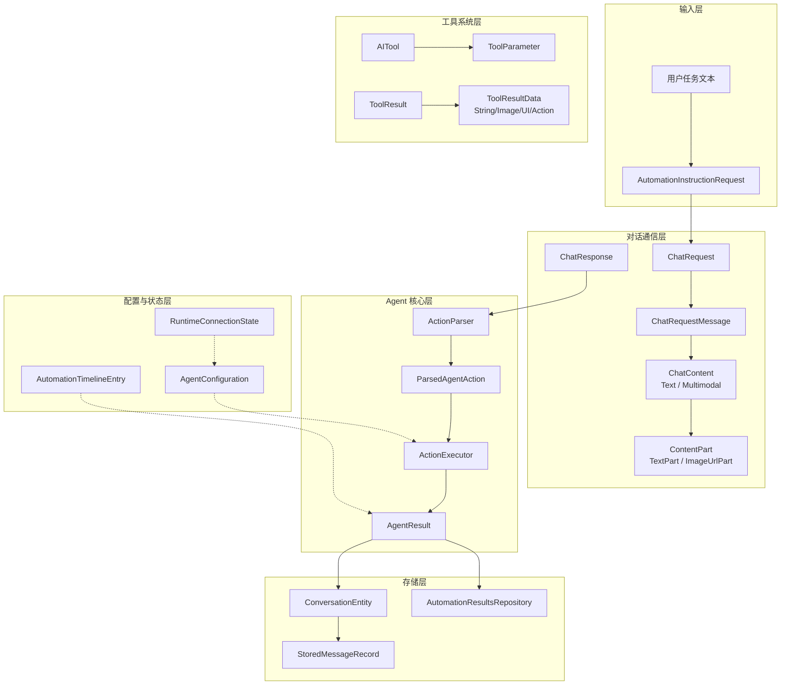
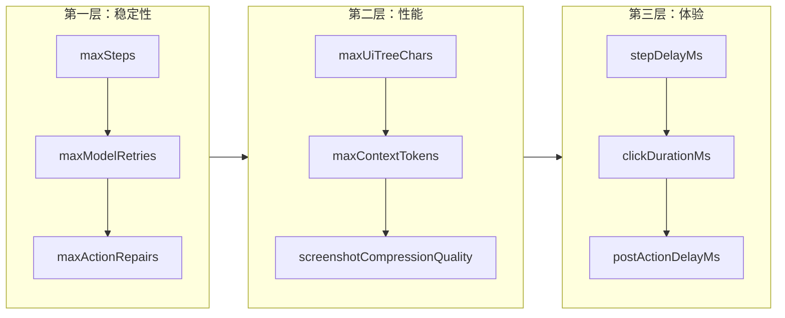
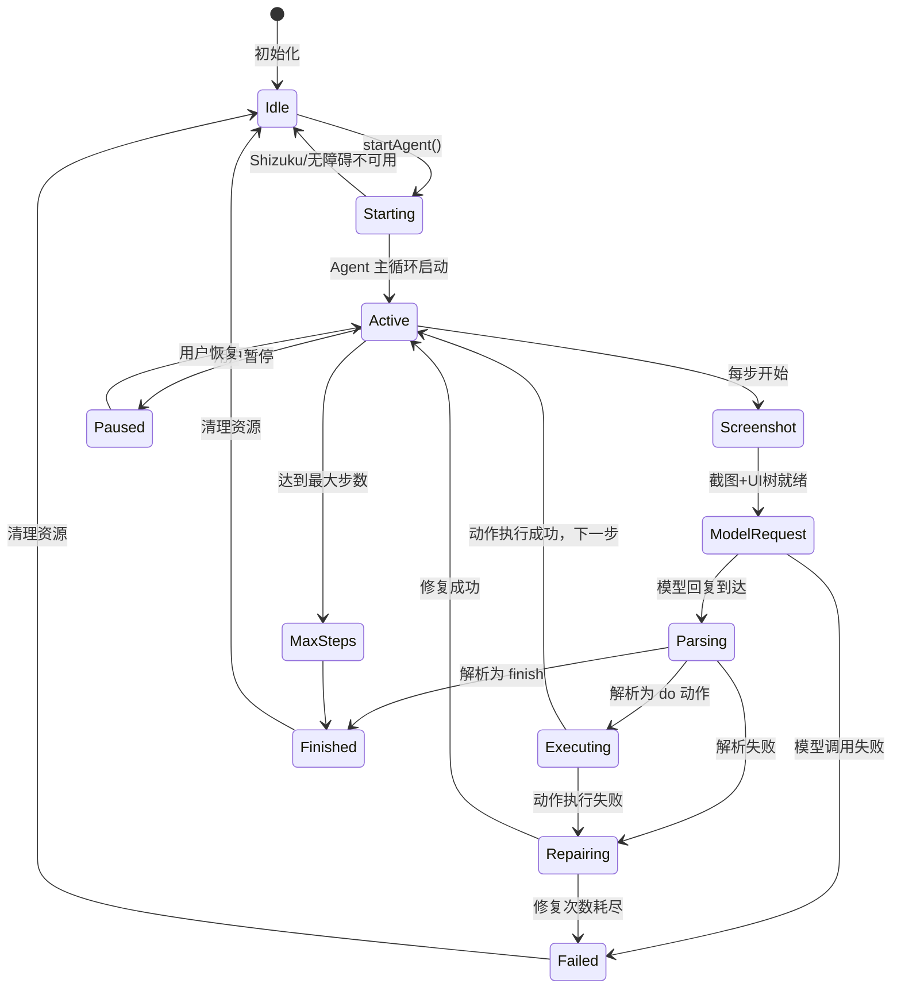

# Agent 数据模型与状态

Aries-AI Agent 数据模型体系定义了自动化 Agent 运行时的核心数据结构、状态管理和通信协议，涵盖从模型对话到动作执行、从工具调用到结果存储的完整数据流。

## 概述

Aries-AI 的 Agent 数据模型遵循分层设计原则，按职责划分为以下几个核心领域：

| 领域 | 核心类型 | 职责 |
|------|----------|------|
| **Agent 动作模型** | `ParsedAgentAction` | 解析后的结构化动作指令，连接模型输出与执行层 |
| **对话通信模型** | `ChatContent`, `ChatRequestMessage` | OpenAI 兼容的聊天消息格式，支持文本与多模态 |
| **工具系统模型** | `AITool`, `ToolResult` | 工具注册、参数传递与执行结果的数据抽象 |
| **自动化指令模型** | `AutomationInstructionRequest` | 跨组件任务分发与调度指令 |
| **配置与状态模型** | `AgentConfiguration`, `RuntimeConnectionState` | 运行参数配置与运行时连接状态 |
| **存储与结果模型** | `ConversationEntity`, `AgentResult`, `AutomationTimelineEntry` | 对话持久化、执行结果与时间线记录 |

这些模型共同构成了从"接收任务 → 请求模型 → 解析动作 → 执行操作 → 记录结果"的完整数据闭环。

## 架构

### 数据模型全景关系图



> 图中实线箭头表示数据流转方向，虚线箭头表示配置/状态依赖关系。

### 分层设计思想

数据模型的分层遵循"关注点分离"原则：

1. **输入层**：负责接收和规范化外部任务请求，`AutomationInstructionRequest` 封装了任务来源、自动启动策略等元信息。
2. **对话通信层**：实现与 OpenAI 兼容 API 的数据协议。`ChatContent` 采用 sealed class 设计，通过自定义序列化器 `ChatContentSerializer` 统一处理文本字符串与多模态数组两种格式。
3. **Agent 核心层**：`ParsedAgentAction` 是连接模型输出与执行引擎的桥梁，其 `metadata` 字段（`"do"` / `"finish"`）驱动整个状态流转。
4. **工具系统层**：`ToolResult` 采用 sealed class 的 `ToolResultData` 子类型，支持字符串、图片、UI 页面信息、UI 操作结果等多种返回形式。
5. **配置与状态层**：`AgentConfiguration` 采用 data class + companion object 预置方案提供开箱即用的默认配置，所有参数均有明确的设计意图注释。
6. **存储层**：通过 Room（`ConversationEntity`）和 DataStore（`AutomationResultsRepository`）实现对话与结果的持久化。

## 核心数据模型详解

### 1. ParsedAgentAction — Agent 动作模型

`ParsedAgentAction` 是整个 Agent 系统中最核心的数据结构，被 `UiAutomationAgent`、`ActionParser`、`ActionExecutor` 三大模块共同使用。它表示一条从模型输出中解析出的结构化动作指令。

```kotlin
data class ParsedAgentAction(
    val metadata: String,           // "do" 或 "finish"
    val actionName: String?,        // 动作名称（如 tap, swipe）
    val fields: Map<String, String>, // 动作参数
    val raw: String = ""            // 原始响应
)
```
> Source: [AgentModels.kt](https://github.com/ZG0704666/Aries-AI/blob/main/app/src/main/java/com/ai/phoneagent/core/agent/AgentModels.kt#L7-L12)

**字段说明：**

| 字段 | 类型 | 说明 |
|------|------|------|
| `metadata` | `String` | 动作元类型：`"do"` 表示执行操作，`"finish"` 表示任务完成 |
| `actionName` | `String?` | 具体动作名称，如 `tap`、`swipe`、`type`、`launch`、`back` 等 |
| `fields` | `Map<String, String>` | 动作参数字典，如 `{"x": "500", "y": "300"}` |
| `raw` | `String` | 模型原始输出文本，用于日志和错误排查 |

**设计意图**：使用 `Map<String, String>` 而非强类型字段，使得模型输出的参数格式具有最大灵活性——不同动作需要不同的参数集（如 `tap` 需要 `x/y`，`launch` 需要 `package`，`type` 需要 `text`），这种设计避免了为每种动作定义单独类型的复杂性。

### 2. ChatContent / ContentPart — 对话内容模型

对话内容模型实现了 OpenAI 兼容 API 的双格式消息内容表示：纯文本字符串和多模态内容数组。

```kotlin
@Serializable(with = ChatContentSerializer::class)
sealed class ChatContent {
    @Serializable
    data class Text(val text: String) : ChatContent()

    @Serializable
    data class Multimodal(val parts: List<ContentPart>) : ChatContent()
}
```
> Source: [ChatContent.kt](https://github.com/ZG0704666/Aries-AI/blob/main/app/src/main/java/com/ai/phoneagent/data/model/ChatContent.kt#L24-L34)

```kotlin
@Serializable(with = ContentPartSerializer::class)
sealed class ContentPart {
    @Serializable
    data class TextPart(
        @SerialName("text") val text: String,
    ) : ContentPart()

    @Serializable
    data class ImageUrlPart(
        @SerialName("image_url") val imageUrl: ImageUrl,
    ) : ContentPart()
}

@Serializable
data class ImageUrl(
    @SerialName("url") val url: String,
)
```
> Source: [ContentPart.kt](https://github.com/ZG0704666/Aries-AI/blob/main/app/src/main/java/com/ai/phoneagent/data/model/ContentPart.kt#L25-L42)

**设计意图**：

- 使用 `sealed class` 保证类型安全，所有子类在编译期已知，支持 `when` 表达式的穷举检查。
- 自定义序列化器（`ChatContentSerializer`、`ContentPartSerializer`）处理序列化/反序列化的双格式兼容：序列化时 `Text` 输出为 JSON 原始字符串，`Multimodal` 输出为 JSON 数组；反序列化时根据 JSON 元素类型自动判断。

**序列化规则：**

| Kotlin 类型 | JSON 输出 | JSON 输入 → 解析结果 |
|------------|-----------|---------------------|
| `ChatContent.Text` | `"hello world"`（JSON 字符串） | JSON 原始字符串 → `Text` |
| `ChatContent.Multimodal` | `[{type:"text",text:"..."},{type:"image_url",...}]` | JSON 数组 → `Multimodal` |

### 3. ChatRequest / ChatRequestMessage — 模型请求模型

```kotlin
@Serializable
data class ChatRequest(
    val model: String,
    val messages: List<ChatRequestMessage>,
    val stream: Boolean = false,
    val temperature: Float? = null,
    @SerialName("max_tokens") val max_tokens: Int? = null,
    @SerialName("top_p") val top_p: Float? = null,
    @SerialName("frequency_penalty") val frequency_penalty: Float? = null,
)

@Serializable
data class ChatRequestMessage(
    val role: String,
    val content: ChatContent,
)
```
> Source: [ChatModels.kt](https://github.com/ZG0704666/Aries-AI/blob/main/app/src/main/java/com/ai/phoneagent/net/ChatModels.kt#L10-L24)

`ChatRequestMessage` 设计了一个兼容构造器，支持从 `String`、`List`、`Map` 等旧格式自动转换为类型安全的 `ChatContent`，确保向后兼容：

```kotlin
constructor(role: String, content: Any) : this(role, content.toChatContent())
```
> Source: [ChatModels.kt](https://github.com/ZG0704666/Aries-AI/blob/main/app/src/main/java/com/ai/phoneagent/net/ChatModels.kt#L30)

### 4. AITool / ToolResult — 工具系统模型

工具系统模型定义了 Agent 可调用的工具抽象及其执行结果。

```kotlin
@Serializable
data class AITool(
    val name: String,
    val parameters: List<ToolParameter> = emptyList(),
)

@Serializable
data class ToolParameter(
    val name: String,
    val value: String,
)
```
> Source: [AITool.kt](https://github.com/ZG0704666/Aries-AI/blob/main/app/src/main/java/com/ai/phoneagent/data/model/AITool.kt#L5-L16)

```kotlin
@Serializable
data class ToolResult(
    val toolName: String,
    val success: Boolean,
    val result: ToolResultData? = null,
    val error: String = ""
)

@Serializable
sealed class ToolResultData

@Serializable
data class StringResultData(val data: String) : ToolResultData()

@Serializable
data class ImageResultData(
    val width: Int, val height: Int, val base64Data: String
) : ToolResultData()

@Serializable
data class UIPageResultData(
    val packageName: String,
    val activityName: String,
    val uiElements: List<SimplifiedUINode>
) : ToolResultData()

@Serializable
data class UIActionResultData(
    val action: String, val success: Boolean, val message: String
) : ToolResultData()
```
> Source: [ToolResult.kt](https://github.com/ZG0704666/Aries-AI/blob/main/app/src/main/java/com/ai/phoneagent/data/model/ToolResult.kt#L12-L77)

**设计意图**：`ToolResultData` 采用 sealed class 而非单一类型，使不同工具返回的结果可以采用最适合的数据结构：

| 结果类型 | 适用场景 |
|----------|----------|
| `StringResultData` | 文本类工具（`get_ui_tree`、`get_current_app`） |
| `ImageResultData` | 截图工具（`screenshot`） |
| `UIPageResultData` | 页面信息采集工具 |
| `UIActionResultData` | UI 操作工具（`tap`、`swipe`、`input_text`） |

### 5. AgentConfiguration — 运行时配置模型

`AgentConfiguration` 是 Agent 的"参数控制中心"，采用 **"默认即用"** 设计原则——不传入任何参数即可完成端到端自动化任务。

```kotlin
data class AgentConfiguration(
    // ========== 执行参数 ==========
    val useBackgroundVirtualDisplay: Boolean = false,
    val useShizukuInteraction: Boolean = false,
    val maxSteps: Int = 100,

    // ========== 模型调用参数 ==========
    val maxModelRetries: Int = 3,
    val maxParseRepairs: Int = 2,
    val maxActionRepairs: Int = 1,
    val temperature: Float? = 0.0f,
    val maxTokens: Int? = 4096,

    // ========== 上下文管理参数 ==========
    val maxContextTokens: Int = 20000,
    val maxUiTreeChars: Int = 3000,
    val maxHistoryTurns: Int = 6,

    // ========== 截图优化参数 ==========
    val enableScreenshotCache: Boolean = true,
    val enableScreenshotThrottle: Boolean = true,
    val screenshotCompressionQuality: Int = 85,
    // ... 更多参数
) {
    companion object {
        val DEFAULT = AgentConfiguration()
        val TEST = AgentConfiguration(
            maxSteps = 10,
            stepDelayMs = 50L,
            maxModelRetries = 1,
        )
    }

    fun getActionDelayMs(actionName: String): Long { /* ... */ }
    fun isDangerousKeyword(text: String): Boolean { /* ... */ }
}
```
> Source: [AgentConfiguration.kt](https://github.com/ZG0704666/Aries-AI/blob/main/app/src/main/java/com/ai/phoneagent/core/config/AgentConfiguration.kt#L38-L392)

**配置分层调参策略：**



## Agent 运行状态模型

### 自动化指令请求与分发

```kotlin
data class AutomationInstructionRequest(
    val instruction: String,
    val source: Source = Source.MANUAL_AGENT_MODE,
    val autoStart: Boolean = true,
    val forceTopOnEntry: Boolean = false,
    val keepMainOnTop: Boolean = false,
) {
    enum class Source(val wireValue: String) {
        MANUAL_AGENT_MODE("manual_agent_mode"),
        ADVANCED_AI("advanced_ai"),
    }
}

data class AutomationDispatchResult(
    val success: Boolean,
    val message: String,
)
```
> Source: [AutomationInstructionGateway.kt](https://github.com/ZG0704666/Aries-AI/blob/main/app/src/main/java/com/ai/phoneagent/core/automation/AutomationInstructionGateway.kt#L11-L27)

### AgentResult — 执行结果

```kotlin
data class AgentResult(
    val success: Boolean,
    val message: String,
    val steps: Int,
)
```
> Source: [UiAutomationAgent.kt](https://github.com/ZG0704666/Aries-AI/blob/main/app/src/main/java/com/ai/phoneagent/UiAutomationAgent.kt#L103-L107)

`AgentResult` 的三个字段精确反映了自动化执行的关键指标：成功与否（`success`）、结果描述（`message`，成功时为 `"已完成"`，失败时为具体错误信息）、执行步数（`steps`，反映任务复杂度）。

### RuntimeConnectionState — 运行时连接状态

```kotlin
data class RuntimeConnectionState(
    val accessibilityEnabled: Boolean,
    val accessibilityConnected: Boolean,
    val shizukuBinderConnected: Boolean,
    val shizukuPermissionGranted: Boolean,
) {
    val shizukuReady: Boolean
        get() = shizukuBinderConnected && shizukuPermissionGranted
}
```
> Source: [AutomationViewModel.kt](https://github.com/ZG0704666/Aries-AI/blob/main/app/src/main/java/com/ai/phoneagent/viewmodel/AutomationViewModel.kt#L94-L102)

这个状态对象综合评估了两种执行通道（无障碍服务 + Shizuku）的就绪情况，`resolveRuntimeInteractionPreference` 方法据此决定实际使用的交互模式。

### AutomationTimelineEntry — 时间线条目

```kotlin
data class AutomationTimelineEntry(
    var displayText: String,
    var action: String? = null,
)
```
> Source: [AutomationTimelineFormatter.kt](https://github.com/ZG0704666/Aries-AI/blob/main/app/src/main/java/com/ai/phoneagent/helper/AutomationTimelineFormatter.kt#L3-L6)

每个条目包含一次操作的显示文本（如"点击搜索按钮"）和动作标签（如"tap"），用于构建可视化的执行时间线。

## Agent 执行流程与状态转换



**关键状态说明：**

| 状态 | 说明 | 触发条件 |
|------|------|----------|
| `Idle` | 空闲状态 | 初始化/任务结束 |
| `Active` | Agent 主循环运行中 | 进入 `runAgentLoop` |
| `Screenshot` | 截图与 UI 树采集 | 每步开始时 |
| `ModelRequest` | 等待模型响应 | 构建消息后发起请求 |
| `Parsing` | 解析模型输出 | 模型返回文本后 |
| `Executing` | 执行 UI 动作 | 解析得到有效 `do` 动作 |
| `Repairing` | 动作修复中 | 执行失败或解析失败 |
| `Paused` | 暂停状态 | 用户手动暂停 |
| `Finished` | 任务完成 | `finish` 动作或达最大步数 |
| `Failed` | 任务失败 | 不可恢复的错误 |

## 对话历史存储模型

```kotlin
@Entity(tableName = "conversations")
data class ConversationEntity(
    @PrimaryKey val id: Long,
    val title: String,
    val updatedAt: Long,
    val messagesJson: String,
)

data class StoredMessageRecord(
    val author: String,
    val content: String,
    val isUser: Boolean,
    val thinkingDurationMs: Long? = null,
    val attachments: List<StoredAttachmentRecord> = emptyList(),
)

data class ConversationRecord(
    val id: Long,
    val title: String,
    val messages: List<StoredMessageRecord>,
    val updatedAt: Long,
)
```
> Sources:
> - [ConversationEntity.kt](https://github.com/ZG0704666/Aries-AI/blob/main/app/src/main/java/com/ai/phoneagent/data/local/ConversationEntity.kt#L7-L14)
> - [ConversationStorageModels.kt](https://github.com/ZG0704666/Aries-AI/blob/main/app/src/main/java/com/ai/phoneagent/data/local/ConversationStorageModels.kt#L6-L28)

对话历史通过 Room 数据库持久化。`messagesJson` 字段将消息列表序列化为 JSON 字符串存储，这种设计避免了为每条消息创建单独数据库行的复杂性。

## 内容安全过滤模型

`ContentFilter` 采用白名单+黑名单双机制：

```kotlin
object ContentFilter {
    // 真正危险的操作（需要拦截）
    private val dangerousKeywords = setOf(
        "delete all", "format device", "factory reset",
        "uninstall system", "root exploit", "malware", "ransomware"
    )

    // 允许的正常操作（不拦截）
    private val allowedKeywords = setOf(
        "purchase", "buy", "payment", "transfer",
        "open app", "settings", "click", "search", // ...
    )
}
```
> Source: [ContentFilter.kt](https://github.com/ZG0704666/Aries-AI/blob/main/app/src/main/java/com/ai/phoneagent/core/agent/ContentFilter.kt#L20-L62)

**设计意图**：白名单机制允许正常的购物、支付、金融查询等商业操作通过，而黑名单仅拦截真正危险的系统级操作（格式化设备、恶意软件等）。这种"信任用户"的设计避免了过度限制。

## API 参考

### `ParsedAgentAction` 动作名称映射

`ActionExecutor.execute()` 方法根据 `actionName` 路由到具体的执行函数：

| actionName 支持的别名 | 执行方法 | 说明 |
|----------------------|----------|------|
| `launch`, `open_app`, `start_app` | `executeLaunch()` | 启动应用 |
| `back` | `executeBack()` | 返回上一页 |
| `home` | `executeHome()` | 回到桌面 |
| `wait`, `sleep` | `executeWait()` | 等待指定时长 |
| `type`, `input`, `text`, `type_name` | `executeType()` | 输入文本 |
| `tap`, `click`, `press` | `executeTap()` | 点击坐标 |
| `longpress`, `long_press` | `executeLongPress()` | 长按 |
| `doubletap`, `double_tap` | `executeDoubleTap()` | 双击 |
| `swipe`, `scroll` | `executeSwipe()` | 滑动 |
| `take_over`, `takeover` | `executeTakeOver()` | 人工接管 |
| `finish` | 直接返回 `true` | 任务完成 |

> Source: [ActionExecutor.kt](https://github.com/ZG0704666/Aries-AI/blob/main/app/src/main/java/com/ai/phoneagent/core/executor/ActionExecutor.kt#L171-L211)

### `ActionParser.parse(raw: String): ParsedAgentAction`

解析模型输出的原始文本，提取结构化动作。

**解析策略**（按优先级）：
1. 从 `<answer>` XML 标签中提取动作
2. 从 `【回答开始】【回答结束】` 中文标签中提取
3. 查找 `do(` 或 `finish(` 位置作为兜底策略
4. 支持 Open-AutoGLM 格式的 `<think>` + `<answer>` 标签

> Source: [ActionParser.kt](https://github.com/ZG0704666/Aries-AI/blob/main/app/src/main/java/com/ai/phoneagent/core/parser/ActionParser.kt#L33-L77)

### `ActionParser.parseWithThinking(content: String): Pair<String?, String>`

同时提取思考过程和回答内容，兼容多种格式：

- Open-AutoGLM 格式：`<think>` + `<answer>`
- Aries 自定义格式：`【思考开始】...【思考结束】` + `【回答开始】...【回答结束】`
- XML 标签格式：`<think>` + `<answer>` 通用标签
- 简单格式：以 `finish(message=` 或 `do(action=` 为分界

> Source: [ActionParser.kt](https://github.com/ZG0704666/Aries-AI/blob/main/app/src/main/java/com/ai/phoneagent/core/parser/ActionParser.kt#L184-L224)

## 配置选项速览

以下是 `AgentConfiguration` 中最关键的配置项：

| 选项 | 类型 | 默认值 | 说明 |
|------|------|--------|------|
| `useBackgroundVirtualDisplay` | `Boolean` | `false` | 是否使用后台虚拟屏执行 |
| `useShizukuInteraction` | `Boolean` | `false` | 是否启用 Shizuku 交互模式 |
| `maxSteps` | `Int` | `100` | 最大执行步数 |
| `stepDelayMs` | `Long` | `160` | 每步间基础延迟(ms) |
| `maxModelRetries` | `Int` | `3` | 模型调用最大重试次数 |
| `maxParseRepairs` | `Int` | `2` | 解析修复最大次数 |
| `maxActionRepairs` | `Int` | `1` | 动作执行修复最大次数 |
| `temperature` | `Float?` | `0.0` | 模型温度参数 |
| `maxTokens` | `Int?` | `4096` | 单次回复最大 token 数 |
| `maxContextTokens` | `Int` | `20000` | 上下文 token 上限 |
| `maxUiTreeChars` | `Int` | `3000` | UI 树最大字符数 |
| `maxHistoryTurns` | `Int` | `6` | 最多保留对话轮数 |
| `screenshotCompressionQuality` | `Int` | `85` | 截图压缩质量(0-100) |
| `screenshotMaxSizeKB` | `Int` | `150` | 截图目标最大体积(KB) |

> Source: [AgentConfiguration.kt](https://github.com/ZG0704666/Aries-AI/blob/main/app/src/main/java/com/ai/phoneagent/core/config/AgentConfiguration.kt#L38-L357)

## 相关链接

- [ParsedAgentAction 定义](https://github.com/ZG0704666/Aries-AI/blob/main/app/src/main/java/com/ai/phoneagent/core/agent/AgentModels.kt)
- [ChatContent 对话内容模型](https://github.com/ZG0704666/Aries-AI/blob/main/app/src/main/java/com/ai/phoneagent/data/model/ChatContent.kt)
- [ContentPart 多模态内容](https://github.com/ZG0704666/Aries-AI/blob/main/app/src/main/java/com/ai/phoneagent/data/model/ContentPart.kt)
- [ChatModels 请求/响应模型](https://github.com/ZG0704666/Aries-AI/blob/main/app/src/main/java/com/ai/phoneagent/net/ChatModels.kt)
- [ToolResult 工具结果模型](https://github.com/ZG0704666/Aries-AI/blob/main/app/src/main/java/com/ai/phoneagent/data/model/ToolResult.kt)
- [AITool 工具定义](https://github.com/ZG0704666/Aries-AI/blob/main/app/src/main/java/com/ai/phoneagent/data/model/AITool.kt)
- [AgentConfiguration 配置中心](https://github.com/ZG0704666/Aries-AI/blob/main/app/src/main/java/com/ai/phoneagent/core/config/AgentConfiguration.kt)
- [ActionExecutor 动作执行器](https://github.com/ZG0704666/Aries-AI/blob/main/app/src/main/java/com/ai/phoneagent/core/executor/ActionExecutor.kt)
- [ActionParser 动作解析器](https://github.com/ZG0704666/Aries-AI/blob/main/app/src/main/java/com/ai/phoneagent/core/parser/ActionParser.kt)
- [UiAutomationAgent 主 Agent](https://github.com/ZG0704666/Aries-AI/blob/main/app/src/main/java/com/ai/phoneagent/UiAutomationAgent.kt)
- [AutomationInstructionGateway 指令分发](https://github.com/ZG0704666/Aries-AI/blob/main/app/src/main/java/com/ai/phoneagent/core/automation/AutomationInstructionGateway.kt)
- [ContentFilter 内容过滤器](https://github.com/ZG0704666/Aries-AI/blob/main/app/src/main/java/com/ai/phoneagent/core/agent/ContentFilter.kt)
- [ConversationStorageModels 对话存储](https://github.com/ZG0704666/Aries-AI/blob/main/app/src/main/java/com/ai/phoneagent/data/local/ConversationStorageModels.kt)
- [AutomationResultsRepository 结果存储](https://github.com/ZG0704666/Aries-AI/blob/main/app/src/main/java/com/ai/phoneagent/data/preferences/AutomationResultsRepository.kt)
- [AutomationTimelineFormatter 时间线格式化](https://github.com/ZG0704666/Aries-AI/blob/main/app/src/main/java/com/ai/phoneagent/helper/AutomationTimelineFormatter.kt)
- [ThinkingTags 思考标签常量](https://github.com/ZG0704666/Aries-AI/blob/main/app/src/main/java/com/ai/phoneagent/core/utils/ThinkingTags.kt)
