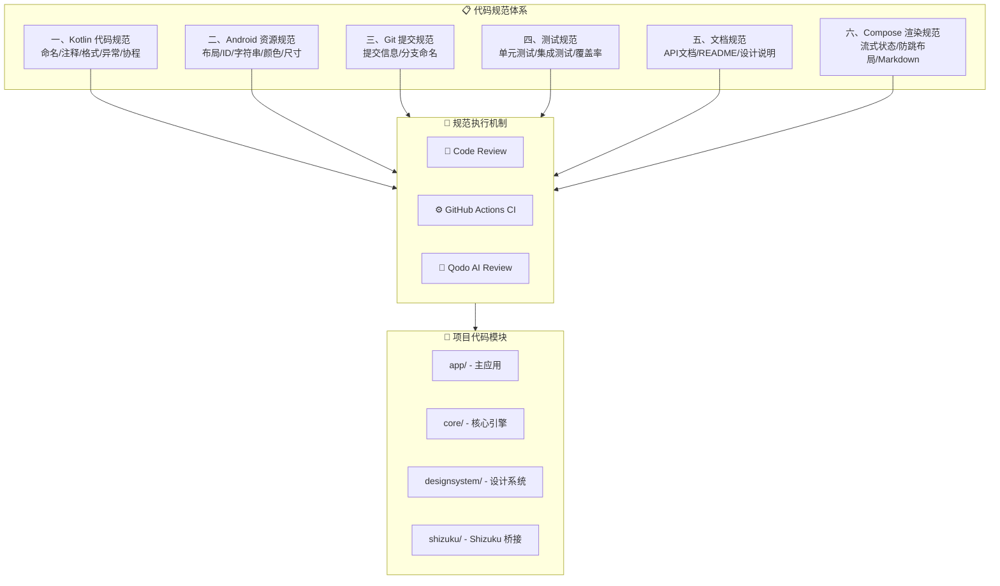
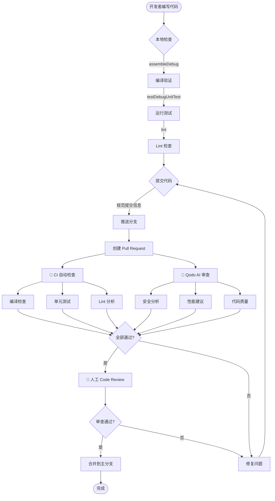

# 代码规范 (CODING_STANDARDS)

Aries AI (Phone Agent) 项目的代码编写规范，确保团队代码风格一致性和可维护性。

## 概述

本文档定义了 Aries AI 项目中所有代码、资源、Git 提交、测试和文档的编写标准。规范覆盖项目中的 Kotlin 代码、Android 资源文件、Git 工作流、单元测试与集成测试、API 文档以及 Compose UI 渲染等多个维度。

**核心目标：**
- **一致性**：统一的编码风格，降低团队成员之间的阅读成本
- **可维护性**：清晰的注释和命名，便于长期迭代
- **可审查性**：标准化格式，方便 Code Review 与自动化检查
- **质量保障**：通过测试规范和覆盖率要求保证代码质量

**适用范围：** 所有 `app/`、`core/`、`accessibility/` 等模块下的 Kotlin 源码、XML 资源文件、Gradle 构建脚本以及文档。

## 规范体系架构



规范分为 **六大领域**，每一领域都有明确的条目和示例。所有规范通过 **Code Review**、**CI 自动检查** 和 **Qodo AI 审查** 三道防线落实，覆盖项目的四个核心代码模块。

---

## 一、Kotlin 代码规范

### 1.1 命名规范

#### 类和接口命名

使用 PascalCase（大驼峰）命名。`fun interface` 仅包含一个抽象方法，用于简洁声明函数式接口。

> Source: [ToolExecutor.kt](https://github.com/ZG0704666/Aries-AI/blob/main/app/src/main/java/com/ai/phoneagent/core/tools/ToolExecutor.kt#L10-L16)

```kotlin
// ✅ 正确：PascalCase
class ScreenshotCache { }
interface IToolExecutor { }
data class ScreenshotData { }
object AppPackageManager { }

// ❌ 错误：小写开头
class phoneAgentService { }
interface iToolExecutor { }
```

#### 函数和变量命名

使用 camelCase（小驼峰）命名。

> Source: [ScreenshotThrottler.kt](https://github.com/ZG0704666/Aries-AI/blob/main/app/src/main/java/com/ai/phoneagent/core/cache/ScreenshotThrottler.kt#L9-L14)

```kotlin
// ✅ 正确：camelCase
fun getUiHierarchy() { }
val screenshotCache = ScreenshotCache()
var lastScreenshotTime = 0L

// ❌ 错误：PascalCase
fun GetUiHierarchy() { }
val ScreenshotCache = ScreenshotCache()
```

#### 常量命名

使用 UPPER_SNAKE_CASE 命名。

> Source: [ScreenshotOverlayGuard.kt](https://github.com/ZG0704666/Aries-AI/blob/main/app/src/main/java/com/ai/phoneagent/core/cache/ScreenshotOverlayGuard.kt#L18-L19)

```kotlin
// ✅ 正确：UPPER_SNAKE_CASE
const val MAX_CACHE_SIZE = 3
const val SCREENSHOT_QUALITY = 75
const val DEFAULT_TIMEOUT = 5000L
private const val STUCK_HIDE_TIMEOUT_MS = 10_000L

// ❌ 错误：小写或驼峰
const val maxCacheSize = 3
const val screenshotQuality = 75
```

#### 属性命名（Backing Property 约定）

公开只读属性与私有可变属性分离时，私有属性使用下划线前缀：

```kotlin
// ✅ 正确：公开只读 + 私有可变下划线前缀
private val _context: MutableLiveData<Context> = MutableLiveData()
val context: LiveData<Context> get() = _context

// ✅ 正确：普通私有属性直接用驼峰命名，不加下划线
private val isBound = false
private val cache = ScreenshotCache()

// ❌ 错误：滥用下划线前缀
private val _isBound = false
```

### 1.2 文件注释规范

#### 类注释（必须）

每个公开类都必须包含 KDoc 注释，说明职责和设计意图。

> Source: [ScreenshotCache.kt](https://github.com/ZG0704666/Aries-AI/blob/main/app/src/main/java/com/ai/phoneagent/core/cache/ScreenshotCache.kt#L5-L11)

```kotlin
/**
 * 截图缓存管理器
 * 实现LRU缓存策略，避免短时间内重复截图
 */
class ScreenshotCache(
    private val maxSize: Int = 3,           // 最大缓存条目数
    private val ttlMs: Long = 2000L         // 缓存过期时间（2秒）
) {
    // ...
}
```

#### 函数注释（复杂函数必须）

> Source: [ScreenshotManager.kt](https://github.com/ZG0704666/Aries-AI/blob/main/app/src/main/java/com/ai/phoneagent/core/cache/ScreenshotManager.kt#L44-L53)

```kotlin
/**
 * 优化的截图获取方法
 * 1. 检查是否启用虚拟屏模式，如是则使用虚拟屏截图
 * 2. 检查节流器，防止频繁截图
 * 3. 检查缓存，避免重复截图
 * 4. 执行截图并压缩优化
 */
suspend fun getOptimizedScreenshot(
    service: PhoneAgentAccessibilityService?
): PhoneAgentAccessibilityService.ScreenshotData? {
    // ...
}
```

#### 行内注释（关键逻辑必须）

关键分支、复杂算法和性能敏感点必须添加行内注释说明 WHY：

```kotlin
if (shouldTakeScreenshot()) {
    // 节流：避免频繁截图导致性能下降
    return cachedScreenshot
}

// 检查缓存是否过期
if (System.currentTimeMillis() - timestamp > TTL) {
    cache.remove(key)
}
```

### 1.3 代码格式规范

| 规则 | 要求 | 说明 |
|------|------|------|
| 缩进 | 4 个空格 | 不使用 Tab |
| 行宽 | 120 字符 | 超出则换行 |
| 文件编码 | UTF-8 | 默认编码 |
| 大括号 | 左大括号不换行 | K&R 风格 |
| 空行 | 逻辑块之间一个空行 | 避免连续多个空行 |

```kotlin
// ✅ 正确：4空格缩进，左大括号不换行
class ScreenshotCache {
    private val cache = object : LinkedHashMap<String, CacheEntry>(16, 0.75f, true) {
        override fun removeEldestEntry(eldest: MutableMap.MutableEntry<String, CacheEntry>?): Boolean {
            return size > maxSize
        }
    }

    @Synchronized
    fun get(key: String): Any? {
        val entry = cache[key] ?: return null
        // 检查是否过期
        if (System.currentTimeMillis() - entry.timestamp > ttlMs) {
            cache.remove(key)
            return null
        }
        return entry.screenshot
    }
}
```

### 1.4 异常处理规范

#### 异常捕获

捕获具体的异常类型，**禁止**使用 `catch (e: Exception)` 吞噬所有异常：

```kotlin
// ✅ 正确：捕获特定异常
try {
    val result = service.getUiHierarchy()
    return result
} catch (e: IllegalStateException) {
    AppLogger.e(TAG, "UI状态异常", e)
    return null
} catch (e: AccessibilityServiceException) {
    AppLogger.e(TAG, "无障碍服务异常", e)
    return null
}

// ❌ 错误：捕获所有异常
try {
    return service.getUiHierarchy()
} catch (e: Exception) {
    return null
}
```

#### 异常抛出

抛出具体的异常类型，附带清晰的错误消息：

```kotlin
// ✅ 正确：抛出具体异常
fun getUiHierarchy(): String {
    val service = PhoneAgentAccessibilityService.instance
        ?: throw IllegalStateException("无障碍服务未启用")
    return service.dumpUiTree()
}
```

### 1.5 协程使用规范

#### 协程作用域

- 在 `ViewModel` 中使用 `viewModelScope`
- 在 Composable 中使用 `rememberCoroutineScope()`
- **严禁**使用 `GlobalScope`（除非有充分理由并注释说明）

```kotlin
// ✅ 正确：使用 viewModelScope
class AutomationViewModel : ViewModel() {
    fun startAutomation() {
        viewModelScope.launch {
            val result = withContext(Dispatchers.IO) {
                service.executeAction()
            }
            _uiState.value = result
        }
    }
}
```

#### 协程上下文切换

明确使用 `withContext` 切换线程：

```kotlin
// ✅ 正确：明确切换上下文
suspend fun executeAction(): Result<String> {
    return withContext(Dispatchers.IO) {
        val result = networkCall()
        // IO 操作完成后返回
        Result.success(result)
    }
}
```

#### 并发安全

使用 `@Synchronized`、`@Volatile` 或 `Mutex` 保护共享状态：

> Source: [ScreenshotThrottler.kt](https://github.com/ZG0704666/Aries-AI/blob/main/app/src/main/java/com/ai/phoneagent/core/cache/ScreenshotThrottler.kt#L13-L21)

```kotlin
class ScreenshotThrottler(
    private val minIntervalMs: Long = 1100L
) {
    @Volatile
    private var lastScreenshotTime: Long = 0L

    @Synchronized
    fun canTakeScreenshot(): Boolean {
        val currentTime = System.currentTimeMillis()
        val timeSinceLastScreenshot = currentTime - lastScreenshotTime
        if (timeSinceLastScreenshot >= minIntervalMs) {
            lastScreenshotTime = currentTime
            return true
        }
        return false
    }
}
```

`suspend` 函数中的共享状态推荐使用 `kotlinx.coroutines.sync.Mutex`：

> Source: [ScreenshotManager.kt](https://github.com/ZG0704666/Aries-AI/blob/main/app/src/main/java/com/ai/phoneagent/core/cache/ScreenshotManager.kt#L42)

```kotlin
class ScreenshotManager(private val config: AgentConfiguration = AgentConfiguration.DEFAULT) {
    private val mutex = Mutex()

    suspend fun getOptimizedScreenshot(service: PhoneAgentAccessibilityService?) {
        mutex.withLock {
            // 临界区逻辑
        }
    }
}
```

---

## 二、Android 资源规范

### 2.1 布局文件命名

使用小写字母 + 下划线格式：

```
✅ activity_main.xml
✅ fragment_automation.xml
✅ item_screenshot.xml
✅ dialog_permission.xml

❌ ActivityMain.xml
❌ FragmentAutomation.xml
```

### 2.2 ID 命名规范

格式：`前缀_功能描述`，使用小写字母 + 下划线：

| 前缀 | 组件类型 | 示例 |
|------|---------|------|
| `btn_` | Button | `btn_submit` |
| `et_` | EditText | `et_search` |
| `tv_` | TextView | `tv_title` |
| `iv_` | ImageView | `iv_avatar` |
| `rv_` | RecyclerView | `rv_list` |
| `cl_` | ConstraintLayout | `cl_container` |

```xml
<Button
    android:id="@+id/btn_submit"
    android:text="@string/btn_submit" />

<EditText
    android:id="@+id/et_search"
    android:hint="@string/hint_search" />
```

### 2.3 字符串资源命名

格式：`前缀_描述`，使用小写字母 + 下划线：

```xml
<resources>
    <string name="btn_submit">提交</string>
    <string name="et_search_hint">搜索</string>
    <string name="tv_title">标题</string>
    <string name="msg_success">操作成功</string>
    <string name="error_network">网络错误</string>
</resources>
```

### 2.4 颜色与尺寸资源

格式：`用途_描述`，使用小写字母 + 下划线：

```xml
<!-- 颜色 -->
<color name="color_primary">#6200EE</color>
<color name="color_background">#FFFFFF</color>

<!-- 尺寸 -->
<dimen name="margin_small">8dp</dimen>
<dimen name="text_size_medium">16sp</dimen>
```

### 2.5 禁止硬编码

> Source: [CONTRIBUTING.md](https://github.com/ZG0704666/Aries-AI/blob/main/CONTRIBUTING.md#L216-L224)

```kotlin
// ❌ 错误：硬编码
textView.textSize = 16f
textView.setTextColor(Color.parseColor("#FF0000"))

// ✅ 正确：使用资源
textView.textSize = resources.getDimension(R.dimen.text_size_medium)
textView.setTextColor(ContextCompat.getColor(context, R.color.error))
```

---

## 三、Git 提交规范

### 3.1 提交信息格式

```
<type>(<scope>): <subject>

<body>

<footer>
```

#### 类型（type）

| 类型 | 说明 | 示例 |
|------|------|------|
| `feat` | 新功能 | `feat(tool): 新增get_page_info工具` |
| `fix` | 修复 bug | `fix(ui): 修复UI树解析失败` |
| `perf` | 性能优化 | `perf(cache): 优化截图缓存策略` |
| `refactor` | 重构代码 | `refactor(service): 重构无障碍服务` |
| `docs` | 文档更新 | `docs(readme): 更新README` |
| `test` | 测试相关 | `test(unit): 添加单元测试` |
| `style` | 代码格式（不影响功能） | `style(core): 统一格式化` |
| `chore` | 构建/工具链 | `chore(deps): 更新依赖版本` |

#### 范围（scope）

| 范围 | 说明 |
|------|------|
| `tool` | 工具系统 |
| `ui` | UI 及 Compose |
| `service` | 无障碍服务 |
| `cache` | 缓存相关 |
| `agent` | Agent 逻辑 |
| `config` | 配置相关 |
| `vdiso` | 虚拟屏模块 |
| `input` | 输入注入 |
| `shizuku` | Shizuku 桥接 |

#### 提交示例

```bash
# ✅ 功能开发
git commit -m "feat(tool): 新增click_element工具

- 支持resourceId/text/className/index点击
- selector优先，坐标兜底
- 支持模糊匹配(partialMatch)

Closes #005"

# ✅ Bug修复
git commit -m "fix(ui): 修复UI树解析失败

- XML格式不兼容，调整解析器
- 添加异常处理

Fixes #003"

# ✅ 性能优化
git commit -m "perf(cache): 优化截图缓存策略

- 调整TTL从2秒到1.5秒
- 增加LRU淘汰策略
- 缓存命中率从20%提升到35%

Related to #013"
```

### 3.2 分支命名规范

```bash
# 功能分支
feature/ui-tree-张三
feature/tool-click-element-李四

# 修复分支
fix/ui-parse-error-张三

# 热修复分支
hotfix/crash-fix-张三
```

---

## 四、测试规范

### 4.1 测试类与方法命名

- 测试类：`被测试类名 + Test`（如 `ScreenshotCacheTest`）
- 测试方法：使用反引号包裹的中文描述，清晰表达测试意图

### 4.2 测试结构

使用 Given-When-Then（AAA）模式编写测试：

> Source: [CoreModuleTest.kt](https://github.com/ZG0704666/Aries-AI/blob/main/app/src/test/java/com/ai/phoneagent/core/CoreModuleTest.kt#L14-L40)

```kotlin
class CoreModuleTest {

    // ========== 配置层测试 ==========

    @Test
    fun `AgentConfiguration 默认值测试`() {
        val config = AgentConfiguration.DEFAULT

        assertEquals(100, config.maxSteps)
        assertEquals(160L, config.stepDelayMs)
        assertEquals(3, config.maxModelRetries)
        assertEquals(20000, config.maxContextTokens)
        assertTrue(config.enableScreenshotCache)
        assertTrue(config.enableScreenshotThrottle)
    }

    @Test
    fun `AgentConfiguration getActionDelayMs 测试`() {
        val config = AgentConfiguration.DEFAULT

        assertEquals(1050L, config.getActionDelayMs("launch"))
        assertEquals(260L, config.getActionDelayMs("type"))
        assertEquals(320L, config.getActionDelayMs("tap"))
        assertEquals(420L, config.getActionDelayMs("swipe"))
    }
}
```

### 4.3 单元测试示例

> Source: [CONTRIBUTING.md](https://github.com/ZG0704666/Aries-AI/blob/main/CONTRIBUTING.md#L240-L254)

```kotlin
class ScreenshotCacheTest {
    private lateinit var cache: ScreenshotCache

    @Before
    fun setup() {
        cache = ScreenshotCache(maxSize = 3)
    }

    @Test
    fun `test cache hit`() {
        // Given
        val data = ScreenshotData("base64", System.currentTimeMillis(), "hash")
        cache.put("key1", data)

        // When
        val result = cache.get("key1")

        // Then
        assertNotNull(result)
        assertEquals("base64", result.base64)
    }
}
```

### 4.4 测试覆盖率要求

| 模块 | 最低覆盖率 | 推荐覆盖率 |
|------|-----------|-----------|
| 核心模块（core/） | 70% | 80% |
| 工具模块（Tools） | 60% | 70% |
| UI 模块（Activity、Fragment） | 50% | 60% |
| 网络模块（net/） | 50% | 60% |
| 工具类（Utils） | 40% | 50% |

```bash
# 运行所有单元测试
./gradlew testDebugUnitTest

# 运行特定测试类
./gradlew testDebugUnitTest --tests "com.ai.phoneagent.core.CoreModuleTest"

# 生成覆盖率报告
./gradlew jacocoTestReport
```

---

## 五、文档规范

### 5.1 公共 API 文档

使用标准 KDoc 标签：`@param`、`@return`、`@throws`、`@see`、`@since`：

```kotlin
/**
 * 获取UI层次结构
 *
 * 支持XML和JSON两种格式输出
 *
 * @param format 输出格式，可选值：xml, json，默认xml
 * @param detail 详细程度，可选值：minimal, summary, full，默认summary
 * @return UI树字符串，格式取决于format参数
 *
 * @throws IllegalStateException 当无障碍服务未启用时抛出
 *
 * @see UIHierarchyManager
 * @since 1.0.0
 */
suspend fun getUiHierarchy(
    format: String = "xml",
    detail: String = "summary"
): String
```

### 5.2 复杂逻辑文档

复杂算法和决策逻辑必须在注释中说明设计意图和决策原因。

> Source: [AgentConfiguration.kt](https://github.com/ZG0704666/Aries-AI/blob/main/app/src/main/java/com/ai/phoneagent/core/config/AgentConfiguration.kt#L20-L37)

```kotlin
/**
 * Agent配置 - 统一的配置管理中心
 *
 * 整合了原有分散的Config类，提供完整的配置管理
 * 所有参数都有合理的默认值，可按需覆盖。
 *
 * 设计原则：
 * 1) **默认可用**：不传入任何参数即可完成一次完整的端到端自动化任务。
 * 2) **可解释**：每个参数对应明确的"稳定性/性能/体验"目标，尽量避免魔法数。
 * 3) **可分层调参**：
 *    - 首先调"重试/修复/等待"以提升稳定性
 *    - 其次调"截图/上下文截断"以控制 token 与延迟
 *    - 最后调"动作延迟"以优化动画与观感
 *
 * 约定：
 * - 所有 `*Ms` 字段单位均为毫秒。
 * - `maxTokens/maxContextTokens` 等为"近似上限"，实际仍受模型与服务端限制影响。
 */
data class AgentConfiguration(
    // ...
)
```

### 5.3 项目文档维护规则

- 公共 API 变更 → 更新 API 文档注释
- 重要功能新增/变更 → 更新 `Aries AI 开发文档.md`
- 构建流程变更 → 更新 `docs/BUILDING.md`
- 规范变更 → 更新 `docs/CODING_STANDARDS.md`

---

## 六、Compose 与 Markdown 渲染规范

### 6.1 流式 UI 状态分层

流式回复必须严格区分三层数据：

| 层级 | 说明 |
|------|------|
| raw buffer | 保存模型原始输出，用于复制、持久化和最终消息 |
| render preview | 节流后的 UI 可见快照，用于减少重组频率 |
| safe Markdown | 只用于展示的临时 Markdown 补全结果 |

**要求：**
- 不要每个 token 都直接驱动 Compose 树重组
- 不要把临时补全写回原始消息
- `copyText` 和持久化内容必须保留模型原文

### 6.2 Markdown 渲染路径

主页消息正文统一走 `ui.components.markdown.Markdown` 组件：

- 流式阶段从一开始就渲染 Markdown，不先展示裸 Markdown 原文
- 最终消息与流式消息使用同一套 Markdown/CodeBlock 组件，避免结束后代码块样式回退
- 流式阶段可通过 `MarkdownSettings(enableCodeHighlight = false)` 禁用代码高亮异步重算
- 最终消息再启用完整代码高亮、复制、保存、换行和行号工具栏

### 6.3 防跳布局

流式消息需要控制布局稳定性：

- 消息容器应设置合理的最小高度，避免首包和短文本阶段高度抖动
- 不要在流式正文上叠加复杂动画或频繁 `animateContentSize`
- 宽度必须稳定，避免滚动条、内外层卡片或临时按钮导致换行点变化
- 新增颜色、间距、尺寸优先使用 `m3t.xml` token

### 6.4 测试要求

修改 Markdown 或流式 transcript 时，至少覆盖：

- 首包前 loading 状态
- 普通文本缓冲推进
- 标题、列表、代码块等 Markdown 结构识别
- 未闭合 Markdown 的临时补全
- 最终原文不被临时补全污染

```bash
./gradlew :app:testDebugUnitTest --tests "com.ai.phoneagent.ui.messages.StreamingTranscriptPreviewTest"
```

---

## 核心流程：从代码到合入



---

## 检查清单

在提交代码前，请逐项确认：

### 代码质量
- [ ] 代码符合命名规范（PascalCase 类名、camelCase 函数/变量、UPPER_SNAKE_CASE 常量）
- [ ] 公共 API 有完整 KDoc 注释
- [ ] 复杂逻辑有详细的行内注释说明
- [ ] 异常处理完善（捕获具体异常类型）
- [ ] 无硬编码（颜色、尺寸、字符串均使用资源引用）
- [ ] 无调试代码（`System.out.println`、`Log.wtf` 等）
- [ ] 并发共享状态使用 `@Synchronized` / `Mutex` / `@Volatile` 保护

### 测试要求
- [ ] 新功能有单元测试
- [ ] 测试覆盖率达到模块最低要求
- [ ] 所有测试通过（`./gradlew testDebugUnitTest`）
- [ ] 新增测试遵循 Given-When-Then 模式

### 文档要求
- [ ] 公共 API 有完整的 KDoc 文档
- [ ] 重要功能变更已更新 `Aries AI 开发文档.md`
- [ ] 变更说明完整清晰

### Git 要求
- [ ] 提交信息符合 `<type>(<scope>): <subject>` 格式
- [ ] 分支命名正确（`feature/xxx`、`fix/xxx`、`hotfix/xxx`）
- [ ] 无敏感信息提交（API Key、Token、密码等）
- [ ] 合并前已更新相关文档

---

## 相关链接

- [CODING_STANDARDS.md (源文件)](https://github.com/ZG0704666/Aries-AI/blob/main/docs/CODING_STANDARDS.md) — 完整规范源文档
- [CONTRIBUTING.md](https://github.com/ZG0704666/Aries-AI/blob/main/CONTRIBUTING.md) — 贡献者指南
- [BUILDING.md](https://github.com/ZG0704666/Aries-AI/blob/main/docs/BUILDING.md) — 构建指南
- [GIT_WORKFLOW.md](https://github.com/ZG0704666/Aries-AI/blob/main/docs/GIT_WORKFLOW.md) — Git 工作流规范
- [TECHNICAL_OVERVIEW.md](https://github.com/ZG0704666/Aries-AI/blob/main/docs/TECHNICAL_OVERVIEW.md) — 技术架构文档
- [AI_PR_REVIEW.md](https://github.com/ZG0704666/Aries-AI/blob/main/docs/AI_PR_REVIEW.md) — AI PR 审阅指南

---

**文档版本**：v1.0  
**最后更新**：基于仓库 main 分支  
**维护人**：ZG0704666
