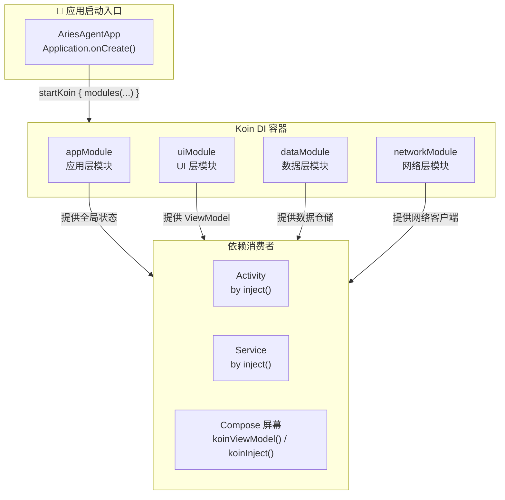
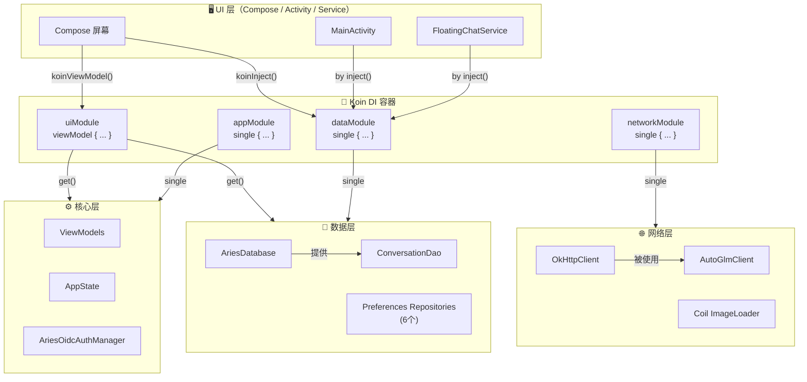
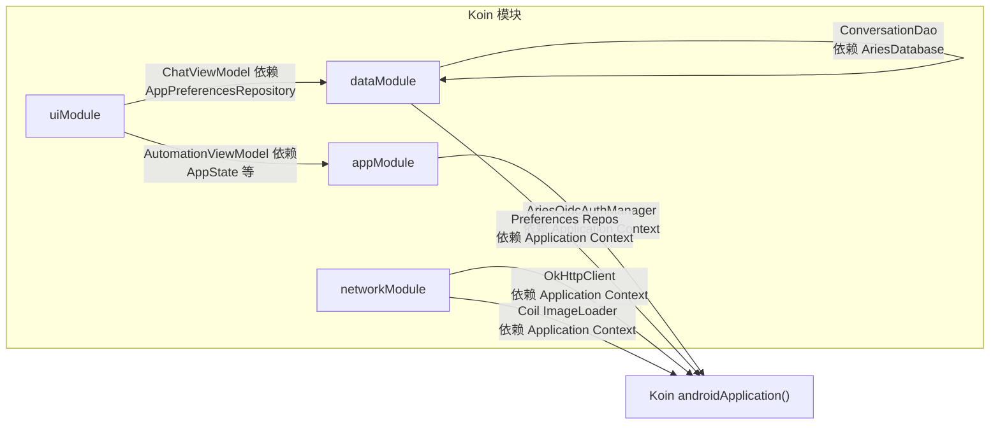
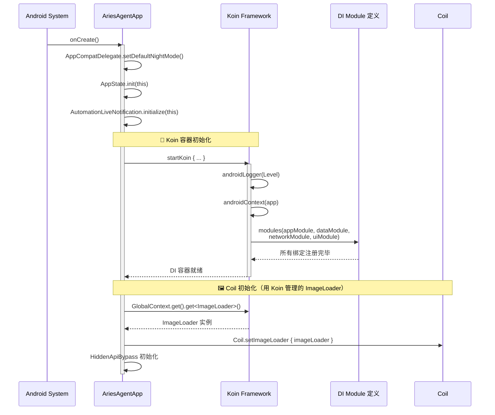

# DI 依赖注入 (Koin)

Aries-AI 使用 **Koin 3.5.6** 作为依赖注入框架，通过分层模块化设计管理应用中的所有核心组件、数据层、网络层和 UI 层依赖关系。

## 概述

依赖注入（Dependency Injection）是 Aries-AI 架构的核心支柱之一。项目选用 Koin 而非 Dagger/Hilt，主要基于以下设计考量：

- **轻量级**：Koin 是基于 Kotlin DSL 的纯运行时 DI 框架，无需注解处理器或代码生成，编译速度更快
- **Kotlin 原生**：完全使用 Kotlin DSL 定义模块，与 Compose Multiplatform 生态天然契合
- **Android 深度集成**：提供 `koin-android` 和 `koin-androidx-compose` 扩展，无缝支持 ViewModel 自动注入
- **测试友好**：内置 `KoinTest` 支持，可轻松替换模块绑定以进行单元测试

整个 DI 容器在 `AriesAgentApp.onCreate()` 中启动，按**四层架构**组织模块：



**四层模块各司其职：**

| 模块 | 文件 | 职责 | 典型绑定 |
|------|------|------|----------|
| `appModule` | [di/AppModule.kt](https://github.com/ZG0704666/Aries-AI/blob/main/app/src/main/java/com/ai/phoneagent/di/AppModule.kt) | 应用级全局单例 | `AppState`、`AriesOidcAuthManager` |
| `dataModule` | [di/DataModule.kt](https://github.com/ZG0704666/Aries-AI/blob/main/app/src/main/java/com/ai/phoneagent/di/DataModule.kt) | 数据持久层 | `AriesDatabase`、`ConversationDao`、6 个 DataStore Preferences Repository |
| `networkModule` | [di/NetworkModule.kt](https://github.com/ZG0704666/Aries-AI/blob/main/app/src/main/java/com/ai/phoneagent/di/NetworkModule.kt) | 网络通信层 | `OkHttpClient`、`AutoGlmClient`、Coil `ImageLoader` |
| `uiModule` | [di/UiModule.kt](https://github.com/ZG0704666/Aries-AI/blob/main/app/src/main/java/com/ai/phoneagent/di/UiModule.kt) | ViewModel 绑定 | `ChatViewModel`、`AutomationViewModel`、`SettingsViewModel` 等 6 个 ViewModel |

## 架构

### 整体分层设计

Aries-AI 的 DI 架构遵循**清洁架构（Clean Architecture）**原则，每一层模块只暴露该层所需的依赖，层与层之间通过 Koin 自动解析实现解耦：



### 模块间依赖关系



> **设计说明**：模块之间通过 Koin 的 `get()` 函数在运行时解析依赖，而非硬编码引用。这使得每个模块可以独立测试（使用 mock 替换），也便于将来按需拆分模块。

## 模块详解

### appModule — 应用层模块

`appModule` 绑定应用级全局单例，是整个 DI 图的根基。

> Source: [di/AppModule.kt](https://github.com/ZG0704666/Aries-AI/blob/main/app/src/main/java/com/ai/phoneagent/di/AppModule.kt#L36-L47)

```kotlin
val appModule = module {

    // AppState is a Kotlin object (singleton); bind it so Koin-injected code can resolve it.
    single { AppState }
    single { AriesOidcAuthManager(androidApplication()) }

    // TODO(T3): Uncomment once ConversationManager is extracted from object/singleton:
    // single { ConversationManager(get()) }

    // TODO(T3): Uncomment once ConversationTranscriptState is introduced:
    // single { ConversationTranscriptState() }
}
```

**关键设计点：**

- `AppState` 是 Kotlin `object`（语言级单例），通过 `single { AppState }` 绑定后，其他组件即可通过 `get<AppState>()` 或 `by inject()` 获取，无需硬编码 `AppState` 引用
- `AriesOidcAuthManager` 需要 `Application` 实例，通过 `androidApplication()` Koin 扩展自动注入
- 模块注释中标注了 `TODO(T3)`，表明 `ConversationManager` 和 `ConversationTranscriptState` 将在后续迁移中加入到 Koin 管理

### dataModule — 数据层模块

`dataModule` 管理 Room 数据库、DAO 和所有 DataStore-backed Preferences 仓储。

> Source: [di/DataModule.kt](https://github.com/ZG0704666/Aries-AI/blob/main/app/src/main/java/com/ai/phoneagent/di/DataModule.kt#L41-L58)

```kotlin
val dataModule = module {

    // Room database — delegates to the existing thread-safe getInstance() to avoid double-init.
    single<AriesDatabase> {
        AriesDatabase.getInstance(androidContext())
    }

    // Conversation DAO resolved through the database singleton.
    single { get<AriesDatabase>().conversationDao() }

    // DataStore preferences repositories — all require application context.
    single { MainUiPreferencesRepository(androidContext()) }
    single { AppPreferencesRepository(androidContext()) }
    single { FloatingChatPreferencesRepository(androidContext()) }
    single { VirtualDisplayConfigRepository(androidContext()) }
    single { ToolPermissionsRepository(androidContext()) }
    single { AutomationResultsRepository(androidContext()) }
}
```

**关键设计点：**

- Room 数据库复用现有的 `getInstance()` 线程安全单例方法，Koin 仅做委托包装，避免双重初始化
- `ConversationDao` 通过 `get<AriesDatabase>().conversationDao()` 解析，体现了"通过 Koin 级联解析"的模式
- 全部 6 个 DataStore Preferences Repository 均需要 `androidContext()` 作为构造参数

### networkModule — 网络层模块

`networkModule` 管理 HTTP 客户端、AI 提供商客户端和 Coil 图片加载器。

> Source: [di/NetworkModule.kt](https://github.com/ZG0704666/Aries-AI/blob/main/app/src/main/java/com/ai/phoneagent/di/NetworkModule.kt#L47-L101)

```kotlin
val networkModule = module {

    /**
     * Shared OkHttpClient singleton — mirrors the configuration from [AutoGlmClient]'s
     * internal SharedHttpClient. Using a Koin-managed instance allows tests to swap it out.
     */
    single<OkHttpClient> {
        val logger = HttpLoggingInterceptor().apply {
            level = if (BuildConfig.DEBUG) {
                HttpLoggingInterceptor.Level.BASIC
            } else {
                HttpLoggingInterceptor.Level.NONE
            }
        }
        OkHttpClient.Builder()
            .addInterceptor(logger)
            .retryOnConnectionFailure(true)
            .connectTimeout(60, TimeUnit.SECONDS)
            .readTimeout(300, TimeUnit.SECONDS)
            .writeTimeout(120, TimeUnit.SECONDS)
            .callTimeout(360, TimeUnit.SECONDS)
            .connectionPool(ConnectionPool(10, 5, TimeUnit.MINUTES))
            .protocols(listOf(Protocol.HTTP_2, Protocol.HTTP_1_1))
            .build()
    }

    // AutoGlmClient is a Kotlin object (singleton); bind it so it can be injected or mocked in tests.
    single { AutoGlmClient }

    /**
     * Coil ImageLoader singleton for Compose image loading.
     * Configured with memory and disk caching for efficient attachment thumbnail loading.
     */
    single<ImageLoader> {
        ImageLoader.Builder(androidContext())
            .crossfade(true)
            .memoryCache {
                MemoryCache.Builder(androidContext())
                    .maxSizePercent(0.25)
                    .build()
            }
            .diskCache {
                DiskCache.Builder()
                    .directory(androidContext().cacheDir.resolve("image_cache"))
                    .maxSizePercent(0.02)
                    .build()
            }
            .build()
    }

    // TODO(T7): Add factory for OpenAICompatibleProvider once runtime-param strategy is finalized:
    // factory { (apiKey: String, baseUrl: String, modelName: String) ->
    //     OpenAICompatibleProvider(apiKey = apiKey, baseUrl = baseUrl, modelName = modelName)
    // }
}
```

**关键设计点：**

- `OkHttpClient` 使用延迟配置：Debug 模式下启用 `BASIC` 级别日志，Release 模式完全关闭
- AI 服务超时配置体现业务特点：读超时 300s（AI 生成响应可能较慢），调用超时 360s
- **设计决策**：`OpenAICompatibleProvider` 需要运行时参数（apiKey、baseUrl、modelName），**故意未注册为静态单例**。当前使用方直接构造或通过 Koin parameters 传递，将在 T7 迁移任务中加入 `factory` 绑定
- Coil `ImageLoader` 配置了内存缓存（25%）和磁盘缓存（2%），专门为附件缩略图加载优化

### uiModule — UI 层模块

`uiModule` 使用 Koin 的 `viewModel` DSL 注册所有 Compose ViewModel。

> Source: [di/UiModule.kt](https://github.com/ZG0704666/Aries-AI/blob/main/app/src/main/java/com/ai/phoneagent/di/UiModule.kt#L35-L45)

```kotlin
val uiModule = module {

    // ChatViewModel is an AndroidViewModel; Koin's viewModel {} block handles
    // the Application parameter automatically.
    viewModel { ChatViewModel(get()) }
    viewModel { AutomationViewModel(get(), get(), get()) }
    viewModel { SettingsViewModel(get(), get(), get()) }
    viewModel { AppearanceViewModel(get(), get()) }
    viewModel { com.ai.phoneagent.viewmodel.AboutViewModel(get(),
        com.ai.phoneagent.updates.ReleaseRepository(), get()) }
    viewModel { com.ai.phoneagent.viewmodel.UpdateHistoryViewModel(get(),
        com.ai.phoneagent.updates.ReleaseRepository()) }
}
```

**关键设计点：**

- `viewModel {}` 是 Koin AndroidX 扩展提供的 DSL，自动处理 `AndroidViewModel` 的 `Application` 参数
- `get()` 调用由 Koin 自动解析：例如 `AutomationViewModel(get(), get(), get())` 中的三个 `get()` 分别解析其构造参数所需的依赖
- `ReleaseRepository()` 直接实例化（非 Koin 管理），因为它是轻量级的无依赖工厂类

## 注入方式

Aries-AI 中根据使用场景提供了三种注入方式：

### 方式一：Activity/Service 中的属性委托注入

适用于传统 Android 组件（Activity、Service），使用 `by inject<T>()` 惰性委托。

> Source: [MainActivity.kt](https://github.com/ZG0704666/Aries-AI/blob/main/app/src/main/java/com/ai/phoneagent/MainActivity.kt#L434-L435)

```kotlin
import org.koin.android.ext.android.inject

class MainActivity : AppCompatActivity() {
    private val appPrefsRepository by inject<AppPreferencesRepository>()
    private val floatingChatPrefs by inject<FloatingChatPreferencesRepository>()
    // ...
}
```

> Source: [FloatingChatService.kt](https://github.com/ZG0704666/Aries-AI/blob/main/app/src/main/java/com/ai/phoneagent/FloatingChatService.kt#L133-L134)

```kotlin
import org.koin.android.ext.android.inject

class FloatingChatService : LifecycleService(), SavedStateRegistryOwner {
    private val appPrefsRepository by inject<AppPreferencesRepository>()
    private val floatingChatPrefs by inject<FloatingChatPreferencesRepository>()
    // ...
}
```

`by inject<T>()` 是 Koin 为 `ComponentActivity` 和 `LifecycleService` 提供的扩展属性，利用 Kotlin 委托属性实现惰性初始化——依赖在首次访问时才从 Koin 容器中解析。

### 方式二：Compose 中的 koinViewModel

适用于 Jetpack Compose 可组合函数，自动管理 ViewModel 生命周期。

> Source: [AutomationScreen.kt](https://github.com/ZG0704666/Aries-AI/blob/main/app/src/main/java/com/ai/phoneagent/ui/automation/AutomationScreen.kt#L33-L35)

```kotlin
import org.koin.androidx.compose.koinViewModel

@Composable
fun AutomationScreen(hostActivity: Activity, navController: NavHostController) {
    // Scope ViewModel to Activity so it survives nav pop
    val activityOwner = hostActivity as? androidx.lifecycle.ViewModelStoreOwner
    val viewModel: AutomationViewModel = koinViewModel(
        viewModelStoreOwner = activityOwner ?: LocalViewModelStoreOwner.current!!,
    )
    // ...
}
```

> Source: [SettingsRoute.kt](https://github.com/ZG0704666/Aries-AI/blob/main/app/src/main/java/com/ai/phoneagent/ui/settings/SettingsRoute.kt#L72)

```kotlin
import org.koin.androidx.compose.koinViewModel

@Composable
fun SettingsRoute(
    navController: NavController,
    viewModel: SettingsViewModel = koinViewModel(),
) {
    // ...
}
```

`koinViewModel()` 不仅从 Koin 容器获取 ViewModel，还自动将其作用域绑定到 `ViewModelStoreOwner`的生命周期。

### 方式三：Compose 中的 koinInject

适用于在 Compose 函数中注入非 ViewModel 的普通依赖。

> Source: [OnboardingScreen.kt](https://github.com/ZG0704666/Aries-AI/blob/main/app/src/main/java/com/ai/phoneagent/ui/onboarding/OnboardingScreen.kt#L126)

```kotlin
import org.koin.compose.koinInject

@Composable
fun OnboardingRoute(
    navController: NavController,
    flow: String?,
    appPreferencesRepository: AppPreferencesRepository = koinInject(),
) {
    OnboardingScreen(
        flowMode = parseOnboardingFlowMode(flow),
        appPreferencesRepository = appPreferencesRepository,
        onBack = { navController.popBackStack() },
        onDone = { navController.popBackStack() },
    )
}
```

> **三者选择决策**：ViewModel 使用 `koinViewModel()`（自动管理生命周期），Compose 中的普通单例用 `koinInject()`，传统 Activity/Service 中用 `by inject<T>()`。

## 初始化流程

Koin 容器的初始化是整个应用启动链路中的关键一步，在 `AriesAgentApp.onCreate()` 中执行：



> Source: [AriesAgentApp.kt](https://github.com/ZG0704666/Aries-AI/blob/main/app/src/main/java/com/ai/phoneagent/AriesAgentApp.kt#L65-L100)

```kotlin
override fun onCreate() {
    super.onCreate()

    // 跟随系统自动切换日夜模式
    AppCompatDelegate.setDefaultNightMode(AppCompatDelegate.MODE_NIGHT_FOLLOW_SYSTEM)

    // 初始化全局上下文
    AppState.init(this)
    AutomationLiveNotification.initialize(this)

    // 初始化 Koin 依赖注入框架
    startKoin {
        androidLogger(if (android.util.Log.isLoggable("Koin", android.util.Log.DEBUG))
            Level.DEBUG else Level.ERROR)
        androidContext(this@AriesAgentApp)
        modules(appModule, dataModule, networkModule, uiModule)
    }

    // 配置 Coil ImageLoader（使用 Koin 管理的实例）
    try {
        val imageLoader = org.koin.core.context.GlobalContext.get().get<ImageLoader>()
        Coil.setImageLoader { imageLoader }
        logi("Coil ImageLoader initialized from Koin")
    } catch (t: Throwable) {
        logw("Coil ImageLoader initialization failed", t)
    }

    // 初始化 HiddenApiBypass（虚拟屏创建必需）
    try {
        if (Build.VERSION.SDK_INT >= 28) {
            HiddenApiBypass.addHiddenApiExemptions("L")
            logi("HiddenApiBypass initialized successfully")
        }
    } catch (t: Throwable) {
        logw("HiddenApiBypass initialization failed", t)
    }
}
```

**关键设计点：**

1. **日志级别自适应**：通过 `android.util.Log.isLoggable("Koin", ...)` 检测系统日志配置，DEBUG 可日志时才启用 Koin 详细日志，避免生产环境日志污染
2. **Coil 后置初始化**：Koin 启动后立即通过 `GlobalContext.get().get<ImageLoader>()` 获取 ImageLoader 并设置到 Coil（全局图片加载框架），体现 Koin 作为"依赖源"的角色
3. **尽力而为策略**：Coil 和 HiddenApiBypass 的初始化均使用 `try-catch`，任何失败都不会阻塞应用启动

## 构建配置

Koin 依赖通过 Gradle Version Catalog 统一管理版本。

> Source: [libs.versions.toml](https://github.com/ZG0704666/Aries-AI/blob/main/gradle/libs.versions.toml#L17)

```toml
[versions]
koin = "3.5.6"

[libraries]
koin-android = { module = "io.insert-koin:koin-android", version.ref = "koin" }
koin-androidx-compose = { module = "io.insert-koin:koin-androidx-compose", version.ref = "koin" }
koin-test = { module = "io.insert-koin:koin-test", version.ref = "koin" }
koin-test-junit4 = { module = "io.insert-koin:koin-test-junit4", version.ref = "koin" }
```

> Source: [build.gradle.kts](https://github.com/ZG0704666/Aries-AI/blob/main/app/build.gradle.kts#L193-L197)

```kotlin
// Koin - Dependency Injection
implementation(libs.koin.android)
implementation(libs.koin.androidx.compose)
testImplementation(libs.koin.test)
testImplementation(libs.koin.test.junit4)
```

| 依赖 | 作用域 | 说明 |
|------|--------|------|
| `koin-android` | `implementation` | Koin 核心 Android 扩展，提供 `androidContext()`、`androidLogger()`、`by inject()` |
| `koin-androidx-compose` | `implementation` | Jetpack Compose 集成，提供 `koinViewModel()`、`koinInject()` |
| `koin-test` | `testImplementation` | Koin 测试核心，提供 `KoinTest`、`get()` |
| `koin-test-junit4` | `testImplementation` | JUnit4 规则支持，提供 `KoinTestRule` |

## 测试策略

Aries-AI 为 Koin DI 图编写了两类专项测试来验证 DI 容器的正确性。

### 模块接线验证测试

> Source: [KoinModuleCheckTest.kt](https://github.com/ZG0704666/Aries-AI/blob/main/app/src/test/java/com/ai/phoneagent/di/KoinModuleCheckTest.kt#L54-L118)

`KoinModuleCheckTest` 验证完整的 DI 图可正确解析，策略是：**用 mock 替换需要 Android Context 的模块，验证整个图可以接线成功**。

```kotlin
class KoinModuleCheckTest : KoinTest {

    @After
    fun tearDown() {
        stopKoin()
    }

    @Test
    fun `appModule resolves AppState`() {
        val mockContext = mockk<Application>(relaxed = true)

        startKoin {
            androidContext(mockContext)
            modules(appModule)
        }

        val appState = get<AppState>()
        assertNotNull(appState)
    }

    @Test
    fun `full module graph resolves with mock overrides`() {
        val mockApp = mockk<Application>(relaxed = true)
        val mockDb = mockk<AriesDatabase>(relaxed = true)
        val mockDao = mockk<ConversationDao>(relaxed = true)
        every { mockDb.conversationDao() } returns mockDao

        // Pre-supply all Android-dependent bindings so the graph resolves
        val testOverrides = module {
            single<AriesDatabase> { mockDb }
            single<ConversationDao> { mockDao }
            single { AppPreferencesRepository(get()) }
            single { MainUiPreferencesRepository(get()) }
            // ... other repos ...
            single<OkHttpClient> { mockk(relaxed = true) }
            single<ImageLoader> { mockk(relaxed = true) }
        }

        startKoin {
            androidContext(mockApp)
            modules(appModule, testOverrides, uiModule)
        }

        assertNotNull(get<AppState>())
        assertNotNull(get<AriesDatabase>())
        assertNotNull(get<OkHttpClient>())
    }
}
```

### 单例作用域验证测试

> Source: [KoinScopeTest.kt](https://github.com/ZG0704666/Aries-AI/blob/main/app/src/test/java/com/ai/phoneagent/di/KoinScopeTest.kt#L39-L67)

`KoinScopeTest` 验证 Koin 的 `single` 定义确实保证同一个实例：

```kotlin
class KoinScopeTest : KoinTest {

    @Before
    fun setUp() {
        startKoin {
            androidContext(mockk<Application>(relaxed = true))
            modules(appModule)
        }
    }

    @After
    fun tearDown() {
        stopKoin()
    }

    @Test
    fun `AppState singleton returns same instance on repeated get`() {
        val instance1 = get<AppState>()
        val instance2 = get<AppState>()
        assertSame(instance1, instance2)
    }

    @Test
    fun `verify singleton scope behavior across multiple resolutions`() {
        val instances = List(5) { get<AppState>() }
        instances.forEach { instance ->
            assertSame(instances[0], instance)
        }
    }
}
```

**测试设计要点：**

- 使用 `stopKoin()` 在每个测试后清理 Koin 全局状态，保证测试隔离
- 使用 MockK 创建 mock 对象替代真实的 Android Context 和 Room 数据库
- `KoinTest` 接口提供 `get()`、`inject()` 等便捷扩展，无需手动获取 Koin 实例
- 测试侧重验证**接线（wiring）**而非实现（implementation），确保 DI 图结构正确

## DI 完整绑定清单

以下列出 Koin DI 容器中的所有绑定及其生命周期：

| 绑定类型 | 声明位置 | 绑定方式 | 生命周期 |
|----------|----------|----------|----------|
| `AppState` | appModule | `single { AppState }` | 全局单例 |
| `AriesOidcAuthManager` | appModule | `single { ... }` | 全局单例 |
| `AriesDatabase` | dataModule | `single<AriesDatabase> { ... }` | 全局单例 |
| `ConversationDao` | dataModule | `single { get<...>().conversationDao() }` | 全局单例 |
| `MainUiPreferencesRepository` | dataModule | `single { ... }` | 全局单例 |
| `AppPreferencesRepository` | dataModule | `single { ... }` | 全局单例 |
| `FloatingChatPreferencesRepository` | dataModule | `single { ... }` | 全局单例 |
| `VirtualDisplayConfigRepository` | dataModule | `single { ... }` | 全局单例 |
| `ToolPermissionsRepository` | dataModule | `single { ... }` | 全局单例 |
| `AutomationResultsRepository` | dataModule | `single { ... }` | 全局单例 |
| `OkHttpClient` | networkModule | `single<OkHttpClient> { ... }` | 全局单例 |
| `AutoGlmClient` | networkModule | `single { AutoGlmClient }` | 全局单例 |
| `ImageLoader` (Coil) | networkModule | `single<ImageLoader> { ... }` | 全局单例 |
| `ChatViewModel` | uiModule | `viewModel { ... }` | ViewModelStoreOwner 作用域 |
| `AutomationViewModel` | uiModule | `viewModel { ... }` | ViewModelStoreOwner 作用域 |
| `SettingsViewModel` | uiModule | `viewModel { ... }` | ViewModelStoreOwner 作用域 |
| `AppearanceViewModel` | uiModule | `viewModel { ... }` | ViewModelStoreOwner 作用域 |
| `AboutViewModel` | uiModule | `viewModel { ... }` | ViewModelStoreOwner 作用域 |
| `UpdateHistoryViewModel` | uiModule | `viewModel { ... }` | ViewModelStoreOwner 作用域 |

> **注意**：`OpenAICompatibleProvider` 需要运行时参数（apiKey、baseUrl、modelName），**未注册到 Koin**。当前使用方直接构造。等到 T7 迁移任务中会以 `factory` 方式注册（详见 [networkModule 中的 TODO 注释](https://github.com/ZG0704666/Aries-AI/blob/main/app/src/main/java/com/ai/phoneagent/di/NetworkModule.kt#L97-L100)）。

## 相关链接

- [appModule 源码](https://github.com/ZG0704666/Aries-AI/blob/main/app/src/main/java/com/ai/phoneagent/di/AppModule.kt)
- [dataModule 源码](https://github.com/ZG0704666/Aries-AI/blob/main/app/src/main/java/com/ai/phoneagent/di/DataModule.kt)
- [networkModule 源码](https://github.com/ZG0704666/Aries-AI/blob/main/app/src/main/java/com/ai/phoneagent/di/NetworkModule.kt)
- [uiModule 源码](https://github.com/ZG0704666/Aries-AI/blob/main/app/src/main/java/com/ai/phoneagent/di/UiModule.kt)
- [Application 入口 (Koin 初始化)](https://github.com/ZG0704666/Aries-AI/blob/main/app/src/main/java/com/ai/phoneagent/AriesAgentApp.kt)
- [Koin 模块接线测试](https://github.com/ZG0704666/Aries-AI/blob/main/app/src/test/java/com/ai/phoneagent/di/KoinModuleCheckTest.kt)
- [Koin 单例作用域测试](https://github.com/ZG0704666/Aries-AI/blob/main/app/src/test/java/com/ai/phoneagent/di/KoinScopeTest.kt)
- [Gradle 版本目录 (Koin 版本定义)](https://github.com/ZG0704666/Aries-AI/blob/main/gradle/libs.versions.toml)
- [Koin 官方文档](https://insert-koin.io/)
