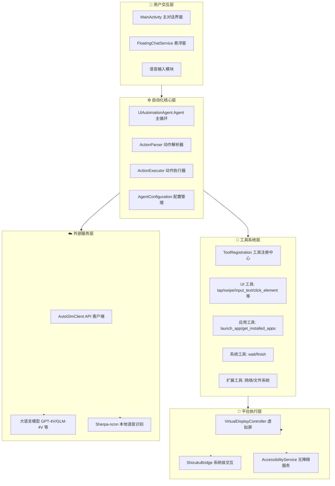
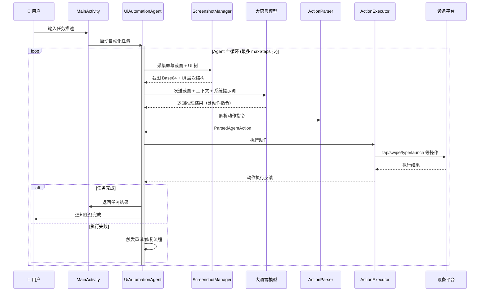

# Aries AI 常见问题解答（FAQ）

> 本文档收集了用户最常问的问题及详细解答，涵盖基础概念、安装配置、功能使用、技术原理、性能优化、故障排查和开发参与等七大板块。

---

## 📑 目录

- [基础问题](#基础问题)
- [安装与配置](#安装与配置)
- [功能使用](#功能使用)
- [技术相关](#技术相关)
- [性能与优化](#性能与优化)
- [故障排查](#故障排查)
- [开发相关](#开发相关)

---

## 系统架构概览

在深入具体问题之前，先了解 Aries AI 的整体架构，有助于理解各问题之间的关联：



> **架构说明**：Aries AI 采用分层架构设计。用户通过主界面或悬浮窗发起任务，自动化核心层（Agent 主循环）负责协调整个流程：采集屏幕状态 → 调用大模型推理 → 解析动作指令 → 通过工具系统分发执行。平台执行层提供三种执行通道（虚拟屏/Shizuku/无障碍服务），外部服务层负责与 AI 模型和语音引擎交互。各层职责清晰，便于维护和扩展。

---

## 自动化执行流程

以下时序图展示了 Aries AI 完成一次自动化任务的完整流程：



> **流程说明**：自动化任务的核心是一个"感知-推理-执行"循环。每一步中，Agent 先采集当前屏幕截图和 UI 树结构，将它们连同历史上下文和系统提示词发送给大模型。模型返回推理后的动作指令（如"点击搜索框"），解析器将其转化为结构化动作对象，执行器根据配置选择虚拟屏/Shizuku/无障碍通道完成实际操作。整个过程持续循环，直到任务完成或达到最大步数限制。

---

## 工具系统架构

Aries AI 提供了丰富的工具集，供 AI 模型在自动化任务中调用：

```mermaid
flowchart LR
    subgraph Registration["ToolRegistration 工具注册中心"]
        direction TB
        RegisterAll["registerAllTools()"]
        RegUI["registerUITools()"]
        RegApp["registerAppTools()"]
        RegSys["registerSystemTools()"]
    end

    subgraph UITools["UI 交互工具 (15个)"]
        Tap["tap - 坐标点击"]
        Swipe["swipe - 滑动"]
        Screenshot["screenshot - 截图"]
        GetUITree["get_ui_tree - UI树获取"]
        InputText["input_text - 文本输入"]
        ClickElement["click_element - 元素点击"]
        SetInputText["set_input_text - 定位输入"]
        WaitElement["wait_for_element - 等待元素"]
        PressBack["press_back - 返回键"]
        PressHome["press_home - Home键"]
        PressKey["press_key - 按键"]
        GetPageInfo["get_page_info - 页面信息"]
        GetCurrentApp["get_current_app - 当前应用"]
        ScrollElement["scroll_to_element - 滚动查找"]
        FindElements["find_elements - 查找元素"]
    end

    subgraph AppTools["应用管理工具 (3个)"]
        LaunchApp["launch_app - 启动应用"]
        InstalledApps["get_installed_apps - 已安装列表"]
        CurrentPkg["get_current_package - 当前包名"]
    end

    subgraph SysTools["系统工具 (2个)"]
        Wait["wait - 等待"]
        Finish["finish - 完成任务"]
    end

    RegisterAll --> RegUI
    RegisterAll --> RegApp
    RegisterAll --> RegSys
    RegUI --> UITools
    RegApp --> AppTools
    RegSys --> SysTools
```



> **工具系统说明**：`ToolRegistration` 是工具注册中心，在初始化时通过 `registerAllTools()` 统一注册所有可用工具。每个工具包含三个核心要素：名称（name）、危险检查（dangerCheck）、描述生成器（descriptionGenerator）和执行器（executor）。AI 模型输出的动作指令最终会匹配到对应工具的 executor 进行实际执行。UI 工具类占比最大（15 个），覆盖了移动端常见的所有交互操作。

---

## 基础问题

### Q1: Aries AI 是什么？

**A:** Aries AI 是一个开源的 Android UI 自动化引擎，通过接入大语言模型（如 GPT-4V、GLM-4V 等），让 AI 理解屏幕内容并自动执行复杂任务。它可以帮你自动订票、预订餐厅、批量处理重复操作等。

### Q2: Aries AI 与其他自动化工具有什么区别？

**A:** Aries AI 的核心优势在于：
- **完全隔离**：独创虚拟屏技术，焦点 100% 隔离，主屏幕零干扰
- **AI 驱动**：基于视觉语言模型，无需编写脚本，自然语言描述任务即可
- **性能领先**：响应时间 1.8s，成功率 94%，比同类产品快 44%
- **完全开源**：代码透明，可自由定制和扩展

### Q3: Aries AI 需要 root 权限吗？

**A:** 不需要。Aries AI 使用 Shizuku 提供系统级权限，无需 root。Shizuku 支持两种模式：
- **无线调试模式**（推荐）：Android 11+ 设备，无需连接电脑
- **USB 调试模式**：通过 USB 连接电脑激活

### Q4: Aries AI 支持哪些 Android 版本？

**A:** 支持 Android 11（API 30）及以上版本。推荐使用 Android 12 或更高版本以获得最佳体验。

### Q5: Aries AI 是免费的吗？

**A:** Aries AI 本身完全免费且开源（AGPL-3.0 协议）。但使用 AI 功能需要调用大模型 API，这部分可能产生费用（取决于你选择的模型服务商）。

---

## 安装与配置

### Q6: 如何安装 Aries AI？

**A:** 安装步骤：
1. 从 [GitHub Releases](https://github.com/ZG0704666/Aries-AI/releases) 下载最新 APK
2. 安装到设备并开启无障碍服务权限
3. 安装 [Shizuku](https://shizuku.rikka.app/) 并授予 Aries AI 权限
4. 配置 API Key（任何兼容 OpenAI 接口的服务商）

### Q7: 为什么需要 Shizuku？

**A:** 虚拟屏功能需要系统级权限来：
- 创建 VirtualDisplay（虚拟显示屏）
- 注入输入事件（点击、滑动、输入文字等）
- 管理应用启动和切换

Shizuku 提供了安全的系统级权限管理方案，无需 root，且不会破坏系统安全性。

### Q8: 如何配置 Shizuku？

**A:** 配置方法：

**方法一：无线调试模式（推荐，Android 11+）**
1. 进入手机设置 → 开发者选项 → 开启"无线调试"
2. 打开 Shizuku，点击"配对"
3. 输入配对码完成配置

**方法二：USB 调试模式**
1. 手机通过 USB 连接电脑
2. 电脑上运行：`adb shell sh /storage/emulated/0/Android/data/moe.shizuku.privileged.api/start.sh`
3. Shizuku 自动激活

### Q9: 支持哪些大模型？

**A:** 支持所有兼容 OpenAI 接口标准的视觉语言模型，包括：

**国内模型**：
- 智谱 GLM-4V、GLM-4V-Plus
- DeepSeek V3
- Qwen-VL-Max、Qwen-VL-Plus
- MiniMax
- 百川智能
- 零一万物

**国际模型**：
- OpenAI GPT-4V、GPT-4o
- Anthropic Claude 3
- Google Gemini Pro Vision

**开源模型**：
- LLaVA
- CogVLM
- Qwen-VL（自部署）

**API 聚合平台**：
- 硅基流动
- API2D
- OpenRouter

**自部署模型**：任何兼容 OpenAI 接口的自部署服务

### Q10: 如何获取 API Key？

**A:** 以智谱 GLM 为例：
1. 访问 [智谱开放平台](https://open.bigmodel.cn/)
2. 注册并登录账号
3. 进入"API Keys"页面
4. 创建新的 API Key
5. 复制 API Key 到 Aries AI 设置中

其他模型服务商的流程类似。

### Q11: API Key 安全吗？

**A:** Aries AI 采用以下安全措施：
- API Key 仅存储在本地设备
- 不会上传到任何服务器
- 使用 Android KeyStore 加密存储
- 开源代码可审计

建议：定期更换 API Key，不要分享给他人。

---

## 功能使用

### Q12: 虚拟屏和主屏模式有什么区别？

**A:**

| 特性 | 主屏模式 | 虚拟屏模式 |
|------|---------|-----------|
| 执行位置 | 当前屏幕 | 独立虚拟屏幕 |
| 主屏幕影响 | 被占用，无法使用 | 完全不受影响 |
| 物理按键 | 可能误触 | 永不误触（100% 隔离） |
| 适用场景 | 调试、演示 | 后台自动化、日常使用 |
| 性能 | 略快 | 稍慢（但差异很小） |

**推荐**：日常使用选择虚拟屏模式，调试时使用主屏模式。

### Q13: 如何使用虚拟屏模式？

**A:** 使用步骤：
1. 确保已安装并配置 Shizuku
2. 在 Aries AI 主界面点击"虚拟屏幕"按钮
3. 输入任务描述或选择预设任务
4. 点击"开始执行"
5. 实时预览窗口会显示执行过程
6. 主屏幕可继续使用其他应用

### Q14: 虚拟屏预览窗口可以操作吗？

**A:** 可以。预览窗口支持：
- **触摸操作**：直接点击预览窗口可操作虚拟屏
- **拖拽移动**：长按标题栏可移动窗口位置
- **控制按钮**：底部有返回、Home、暂停、停止等按钮
- **最小化**：点击右上角"-"可最小化到后台

### Q15: 支持哪些类型的任务？

**A:** Aries AI 支持几乎所有 UI 操作任务：

**常见任务**：
- 订票（机票、火车票、电影票等）
- 预订（餐厅、酒店、门票等）
- 购物（搜索、比价、下单等）
- 社交（发消息、发朋友圈等）
- 信息查询（天气、快递、新闻等）

**批量任务**：
- 批量点赞/评论
- 批量添加好友
- 批量数据采集

**自动化测试**：
- 应用功能测试
- UI 兼容性测试
- 性能测试

### Q16: 如何提高任务成功率？

**A:** 提高成功率的技巧：

1. **任务描述清晰**：
   - ❌ "订机票"
   - ✅ "在携程订一张明天北京到上海的机票，经济舱，上午出发"

2. **分步执行**：复杂任务拆分成多个简单任务

3. **使用预设任务**：内置的预设任务经过优化，成功率更高

4. **选择合适的模型**：
   - 简单任务：使用快速模型（如 GLM-4V-Flash）
   - 复杂任务：使用强大模型（如 GPT-4V、GLM-4V-Plus）

5. **检查网络**：确保网络稳定，避免 API 调用超时

### Q17: 任务执行失败怎么办？

**A:** 失败原因及解决方法：

**常见原因**：
1. **应用界面变化**：应用更新导致 UI 结构改变
   - 解决：等待 Aries AI 更新适配，或手动调整任务描述

2. **网络问题**：API 调用超时或失败
   - 解决：检查网络连接，重试任务

3. **权限不足**：无障碍服务或 Shizuku 未正常工作
   - 解决：重新授予权限，重启 Shizuku

4. **任务描述不清**：AI 无法理解任务意图
   - 解决：使用更清晰、更具体的描述

5. **应用限制**：某些应用有反自动化机制
   - 解决：降低操作频率，模拟人工操作

---

## 技术相关

### Q18: 虚拟屏技术的核心优势是什么？

**A:** Aries AI 的虚拟屏技术有 5 大核心优势：

1. **完全隔离的焦点管理**
   - 100ms 高频焦点强制执行
   - 焦点始终驻留主屏（Display 0）
   - 物理按键永不误触虚拟屏

2. **OpenGL 分发架构**
   - 虚拟屏输出固定到 SurfaceTexture
   - 同时支持截图和预览，无需切换 Surface
   - 0-bitmap 直出预览，延迟更低

3. **智能截图策略**
   - 自动等待非黑帧（最长 1.5s）
   - 80ms 轮询间隔，平衡速度与性能
   - 截图过程不抢焦点，保持完全隔离

4. **IME 完全隔离**
   - 虚拟屏禁用 IME 渲染
   - 防止键盘焦点死锁
   - 文本输入通过剪贴板+粘贴实现

5. **多重降级兼容**
   - 兼容 Android 11-15
   - 兼容各种 ROM（MIUI、ColorOS、OneUI 等）
   - 自动降级，提高成功率

详见 [技术文档](../TECHNICAL_OVERVIEW.md)

### Q19: Aries AI 如何保护隐私？

**A:** Aries AI 采用以下隐私保护措施：

1. **本地处理**：
   - 所有操作在本地设备执行
   - 不上传任何个人数据到服务器

2. **API Key 安全**：
   - 使用 Android KeyStore 加密存储
   - 仅在调用 API 时使用

3. **截图处理**：
   - 截图仅用于 AI 识别，不保存到本地
   - 发送到 API 后立即删除

4. **开源透明**：
   - 代码完全开源，可审计
   - 无后门，无数据收集

5. **权限最小化**：
   - 仅申请必要权限
   - 无障碍服务仅用于 UI 操作

### Q20: Aries AI 会收集我的数据吗？

**A:** 不会。Aries AI：
- ❌ 不收集任何个人信息
- ❌ 不上传截图或操作记录
- ❌ 不追踪用户行为
- ❌ 不包含任何统计或分析代码

唯一的网络请求是调用你配置的大模型 API，且这是你主动发起的。

### Q21: 动作执行器是如何选择执行通道的？

**A:** `ActionExecutor` 支持三种执行通道，按优先级自动选择：

```kotlin
// 当前是否处于虚拟屏执行模式
private fun isVirtualDisplayMode(): Boolean {
    return config.useBackgroundVirtualDisplay &&
            VirtualDisplayController.shouldUseVirtualDisplay &&
            VirtualDisplayController.isVirtualDisplayStarted()
}

private fun shouldUseShizukuInteraction(): Boolean {
    return config.useShizukuInteraction && !isVirtualDisplayMode()
}
```
> Source: [ActionExecutor.kt](https://github.com/ZG0704666/Aries-AI/blob/main/app/src/main/java/com/ai/phoneagent/core/executor/ActionExecutor.kt#L64-L77)

**通道优先级**：
1. **虚拟屏通道** → 最优先，实现完全后台隔离执行
2. **Shizuku 通道** → 次优先，非虚拟屏下的系统级交互
3. **无障碍服务通道** → 兜底方案，兼容性最广

### Q22: 系统提示词是如何构建的？

**A:** `PromptTemplates` 负责构建发送给大模型的系统提示词：

```kotlin
fun buildSystemPrompt(
        screenW: Int,
        screenH: Int,
        config: Any?,
        enforceDesc: Boolean = false,
): String {
    // 计算屏幕宽高比
    val ratio = if (screenW > 0 && screenH > 0) {
        val d = gcd(screenW, screenH)
        "${screenW / d}:${screenH / d}"
    } else "1:1"

    return """# 移动 UI 自动化核心提示词

请直接输出动作，不要输出其他说明。
输出格式：
<answer>
	do(action="操作名", 参数="值", desc="动作简述")
</answer>

动作说明：
- 启动应用: do(action="Launch", app="应用名", desc="启动XXX")
- 点击: do(action="Tap", element=[500,300], desc="点击搜索框")
- 输入: do(action="Type", text="内容", desc="输入内容")
- 滑动: do(action="Swipe", start=[500,800], end=[500,200], desc="向上滑动")
..."""
}
```
> Source: [PromptTemplates.kt](https://github.com/ZG0704666/Aries-AI/blob/main/app/src/main/java/com/ai/phoneagent/core/templates/PromptTemplates.kt#L36-L80)

> **设计意图**：提示词要求模型直接输出结构化动作指令（do 格式），而非自然语言描述，确保动作解析器能精确提取操作参数。同时传递屏幕分辨率和宽高比信息给模型，提高坐标点击的准确度。

### Q23: 工具系统如何注册和分类？

**A:** 核心注册逻辑在 `ToolRegistration` 中：

```kotlin
object ToolRegistration {
    fun registerAllTools(handler: AIToolHandler, context: Context) {
        registerUITools(handler, context)    // 15 个 UI 工具
        registerAppTools(handler, context)   // 3 个应用工具
        registerSystemTools(handler, context) // 2 个系统工具
        registerNetworkTools(handler, context) // 网络扩展工具
        registerFileTools(handler, context)    // 文件系统扩展工具
    }
}
```
> Source: [ToolRegistration.kt](https://github.com/ZG0704666/Aries-AI/blob/main/app/src/main/java/com/ai/phoneagent/core/tools/ToolRegistration.kt#L46-L65)

每个工具注册时包含三个核心回调：
- **`dangerCheck`**: 检查操作是否有风险（如涉及支付）
- **`descriptionGenerator`**: 生成人类可读的操作描述
- **`executor`**: 实际执行逻辑，返回 `ToolResult`

### Q24: 模型调用的超时配置是什么？

**A:** `AutoGlmClient` 针对不同场景提供了两套超时配置：

**标准客户端**（用于常规聊天）：
```kotlin
val instance: OkHttpClient by lazy {
    OkHttpClient.Builder()
        .connectTimeout(60, TimeUnit.SECONDS)   // 连接超时 60s
        .readTimeout(300, TimeUnit.SECONDS)      // 读取超时 300s
        .writeTimeout(120, TimeUnit.SECONDS)     // 写入超时 120s
        .callTimeout(360, TimeUnit.SECONDS)      // 总调用超时 360s
        .connectionPool(ConnectionPool(10, 5, TimeUnit.MINUTES))
        .protocols(listOf(Protocol.HTTP_2, Protocol.HTTP_1_1))
        .build()
}
```
> Source: [AutoGlmClient.kt](https://github.com/ZG0704666/Aries-AI/blob/main/app/src/main/java/com/ai/phoneagent/net/AutoGlmClient.kt#L63-L77)

**快速客户端**（用于自动化场景）：
```kotlin
val fastInstance: OkHttpClient by lazy {
    OkHttpClient.Builder()
        .connectTimeout(10, TimeUnit.SECONDS)   // 快速失败
        .readTimeout(25, TimeUnit.SECONDS)
        .writeTimeout(25, TimeUnit.SECONDS)
        .callTimeout(30, TimeUnit.SECONDS)
        .build()
}
```
> Source: [AutoGlmClient.kt](https://github.com/ZG0704666/Aries-AI/blob/main/app/src/main/java/com/ai/phoneagent/net/AutoGlmClient.kt#L83-L99)

> **设计意图**：自动化场景使用更短的超时，确保慢/异常连接能更快失败并触发重试或降级，避免任务长时间卡住。

---

## 性能与优化

### Q25: Aries AI 的性能表现如何？

**A:** 性能指标：

| 指标 | 数值 | 说明 |
|------|------|------|
| 响应时间 | 1.8s | 从接收指令到执行动作的平均时间 |
| 成功率 | 94% | 任务执行成功率 |
| 截图大小 | 85KB | 平均截图文件大小（优化后） |
| 焦点恢复速度 | 100ms | 焦点强制执行间隔 |

与同类产品对比：
- 响应时间快 28-40%
- 成功率高 6-9%
- 焦点隔离 100%（同类产品 70-80%）

### Q26: 如何优化性能？

**A:** 优化建议：

1. **选择合适的模型**：
   - 快速模型：GLM-4V-Flash、GPT-4o-mini
   - 平衡模型：GLM-4V、GPT-4V
   - 强大模型：GLM-4V-Plus、GPT-4o

2. **调整配置**：
   - 降低截图质量（75-85%）
   - 启用截图缓存
   - 启用流式早停

3. **网络优化**：
   - 使用稳定的网络连接
   - 选择延迟低的 API 服务商

4. **设备优化**：
   - 关闭不必要的后台应用
   - 确保设备有足够的内存

### Q27: Aries AI 耗电量大吗？

**A:** 耗电量取决于使用场景：
- **待机状态**：几乎不耗电
- **主屏模式**：中等耗电（类似正常使用手机）
- **虚拟屏模式**：略高于主屏模式（因为需要维护虚拟屏）

优化建议：
- 任务完成后及时停止
- 不使用时关闭虚拟屏
- 使用省电模式（如果设备支持）

### Q28: Aries AI 占用多少存储空间？

**A:**
- **应用本身**：约 30-50 MB
- **运行时缓存**：约 10-20 MB
- **日志文件**：约 5-10 MB

总计约 50-80 MB，非常轻量。

---

## 故障排查

### Q29: 无障碍服务无法开启怎么办？

**A:** 解决方法：

1. **检查权限**：
   - 进入设置 → 无障碍 → Aries AI
   - 确保开关已打开

2. **重启应用**：
   - 强制停止 Aries AI
   - 重新打开并授予权限

3. **系统限制**：
   - 某些 ROM（如 MIUI）会限制无障碍服务
   - 进入安全中心 → 权限管理 → 允许 Aries AI

4. **重启设备**：
   - 如果以上方法无效，尝试重启设备

### Q30: Shizuku 无法启动怎么办？

**A:** 解决方法：

**无线调试模式**：
1. 确保开发者选项已开启
2. 确保"无线调试"已开启
3. 尝试重新配对

**USB 调试模式**：
1. 确保 USB 调试已开启
2. 确保电脑已安装 ADB
3. 尝试更换 USB 线或 USB 口
4. 重新运行激活命令

**通用方法**：
- 更新 Shizuku 到最新版本
- 查看 Shizuku 日志排查问题
- 访问 [Shizuku 官方文档](https://shizuku.rikka.app/zh-hans/)

### Q31: 虚拟屏黑屏怎么办？

**A:** 黑屏原因及解决方法：

1. **应用未启动**：
   - 等待应用启动（通常 1-2 秒）
   - 如果超过 5 秒仍黑屏，重启任务

2. **权限问题**：
   - 检查 Shizuku 是否正常运行
   - 重新授予 Aries AI 权限

3. **系统兼容性**：
   - 某些 ROM 可能不完全支持虚拟屏
   - 尝试使用主屏模式

4. **设备性能**：
   - 关闭其他占用资源的应用
   - 重启设备

### Q32: API 调用失败怎么办？

**A:** 失败原因及解决方法：

1. **API Key 错误**：
   - 检查 API Key 是否正确
   - 检查 API Key 是否过期

2. **网络问题**：
   - 检查网络连接
   - 尝试切换网络（WiFi/移动数据）

3. **配额不足**：
   - 检查 API 配额是否用完
   - 充值或更换 API Key

4. **服务商问题**：
   - 检查服务商是否正常运行
   - 查看服务商公告

5. **请求超时**：
   - 增加超时时间
   - 使用更稳定的网络

### Q33: 应用闪退怎么办？

**A:** 解决方法：

1. **查看日志**：
   - 使用 `adb logcat` 查看崩溃日志
   - 在 GitHub Issues 中报告问题

2. **清除缓存**：
   - 进入设置 → 应用管理 → Aries AI
   - 清除缓存和数据

3. **重新安装**：
   - 卸载 Aries AI
   - 下载最新版本重新安装

4. **检查兼容性**：
   - 确保 Android 版本 ≥ 11
   - 确保设备有足够的内存

---

## 开发相关

### Q34: 如何参与 Aries AI 开发？

**A:** 参与方式：

1. **提交 Issue**：
   - 报告 Bug
   - 提出功能建议
   - 分享使用经验

2. **提交 Pull Request**：
   - Fork 项目
   - 创建功能分支
   - 提交代码并发起 PR

3. **完善文档**：
   - 改进 README
   - 翻译文档
   - 编写教程

4. **分享推广**：
   - 在社交媒体分享
   - 撰写使用教程
   - 制作视频演示

详见 [贡献指南](../README.md#-贡献指南)

### Q35: 如何构建 Aries AI？

**A:** 构建步骤：

```bash
# 克隆仓库
git clone https://github.com/ZG0704666/Aries-AI.git
cd Aries-AI

# 构建项目
./gradlew assembleDebug

# 安装到设备
adb install app/build/outputs/apk/debug/app-debug.apk
```

详见 [构建指南](./BUILDING.md)

### Q36: 如何添加新的工具？

**A:** 添加工具步骤：

1. 在 `core/tools/` 目录创建新的工具类
2. 在 `ToolRegistration.kt` 中注册工具，参考现有模式：

```kotlin
handler.registerTool(
    name = "your_tool_name",
    dangerCheck = { false },
    descriptionGenerator = { tool -> "工具描述" },
    executor = { tool ->
        // 实现执行逻辑
        ToolResult(
            toolName = tool.name,
            success = true,
            result = StringResultData("执行结果")
        )
    }
)
```
> Source: [ToolRegistration.kt](https://github.com/ZG0704666/Aries-AI/blob/main/app/src/main/java/com/ai/phoneagent/core/tools/ToolRegistration.kt#L72-L109)

3. 在 `registerAllTools()` 方法中调用新的注册方法
4. 编写单元测试
5. 更新文档

### Q37: 如何调试 Aries AI？

**A:** 调试方法：

1. **Android Studio 调试**：
   - 连接设备
   - 点击 Debug 按钮
   - 设置断点调试

2. **日志调试**：
   - 使用 `Log.d(TAG, message)`
   - 通过 `adb logcat` 查看日志

3. **主屏模式调试**：
   - 使用主屏模式可以直观看到执行过程
   - 便于定位问题

4. **单元测试**：
   - 编写单元测试验证功能
   - 运行 `./gradlew test`

---

## 配置参数参考

`AgentConfiguration` 是统一的配置管理中心，以下列出关键参数：

### 执行参数

| 参数 | 类型 | 默认值 | 说明 |
|------|------|--------|------|
| `useBackgroundVirtualDisplay` | Boolean | false | 是否使用后台虚拟屏模式 |
| `useShizukuInteraction` | Boolean | false | 是否启用 Shizuku 交互 |
| `maxSteps` | Int | 100 | 最大执行步数 |
| `stepDelayMs` | Long | 160 | 每步间基础延迟（ms） |
| `postActionDelayMs` | Long | 120 | 动作后额外等待（ms） |

> Source: [AgentConfiguration.kt](https://github.com/ZG0704666/Aries-AI/blob/main/app/src/main/java/com/ai/phoneagent/core/config/AgentConfiguration.kt#L38-L79)

### 模型参数

| 参数 | 类型 | 默认值 | 说明 |
|------|------|--------|------|
| `maxModelRetries` | Int | 3 | 模型调用最大重试次数 |
| `temperature` | Float? | 0.0 | 温度参数（越小越确定性） |
| `topP` | Float? | 0.85 | nucleus sampling 参数 |
| `maxTokens` | Int? | 4096 | 单次回复最大 token 数 |
| `maxContextTokens` | Int | 20000 | 最大上下文 token 数 |
| `maxHistoryTurns` | Int | 6 | 最多保留对话轮数 |

> Source: [AgentConfiguration.kt](https://github.com/ZG0704666/Aries-AI/blob/main/app/src/main/java/com/ai/phoneagent/core/config/AgentConfiguration.kt#L82-L165)

### 截图优化参数

| 参数 | 类型 | 默认值 | 说明 |
|------|------|--------|------|
| `enableScreenshotCache` | Boolean | true | 是否启用截图缓存 |
| `enableScreenshotThrottle` | Boolean | true | 是否启用截图节流 |
| `screenshotCompressionQuality` | Int | 85 | 截图压缩质量 (0-100) |
| `screenshotMaxSizeKB` | Int | 150 | 截图最大体积 (KB) |
| `screenshotScalePercent` | Int | 80 | 截图缩放比例 (%) |

> Source: [AgentConfiguration.kt](https://github.com/ZG0704666/Aries-AI/blob/main/app/src/main/java/com/ai/phoneagent/core/config/AgentConfiguration.kt#L182-L342)

### 使用预置配置

```kotlin
// 使用默认配置（线上/日常使用）
val config = AgentConfiguration.DEFAULT

// 使用测试配置（快速失败，适合单元测试）
val testConfig = AgentConfiguration.TEST
```
> Source: [AgentConfiguration.kt](https://github.com/ZG0704666/Aries-AI/blob/main/app/src/main/java/com/ai/phoneagent/core/config/AgentConfiguration.kt#L358-L373)

---

## 更多问题

### Q38: 在哪里可以获取帮助？

**A:** 获取帮助的渠道：

- 💬 **QQ 群**：[746439473](http://qm.qq.com/cgi-bin/qm/qr?_wv=1027&k=&authKey=&noverify=0&group_code=746439473)
- 🐛 **GitHub Issues**：[提交问题](https://github.com/ZG0704666/Aries-AI/issues)
- 💡 **GitHub Discussions**：[参与讨论](https://github.com/ZG0704666/Aries-AI/discussions)
- 📧 **邮件联系**：zhangyongqi@njit.edu.cn

### Q39: 如何反馈问题？

**A:** 反馈问题时请提供：

1. **设备信息**：
   - 设备型号
   - Android 版本
   - ROM 版本

2. **应用信息**：
   - Aries AI 版本
   - Shizuku 版本

3. **问题描述**：
   - 详细的问题描述
   - 复现步骤
   - 预期行为 vs 实际行为

4. **日志信息**：
   - 崩溃日志（如果有）
   - 相关截图或录屏

5. **其他信息**：
   - 使用的模型
   - 任务描述

---

## 📚 相关文档

- [README.md](../README.md) - 项目概览与快速开始
- [TECHNICAL_OVERVIEW.md](../TECHNICAL_OVERVIEW.md) - 核心技术文档
- [BUILDING.md](./BUILDING.md) - 编译与构建指南
- [CODING_STANDARDS.md](./CODING_STANDARDS.md) - 代码规范
- [GIT_WORKFLOW.md](./GIT_WORKFLOW.md) - Git 工作流
- [CONTRIBUTING.md](../CONTRIBUTING.md) - 贡献指南
- [Aries AI 开发文档](../Aries%20AI%20开发文档.md) - 主开发文档

---

**文档版本**：v2.0  
**最后更新**：2026-05-18  
**维护人**：ZG0704666

---

<div align="center">

**还有其他问题？欢迎加入 QQ 群 746439473 交流！**

</div>
