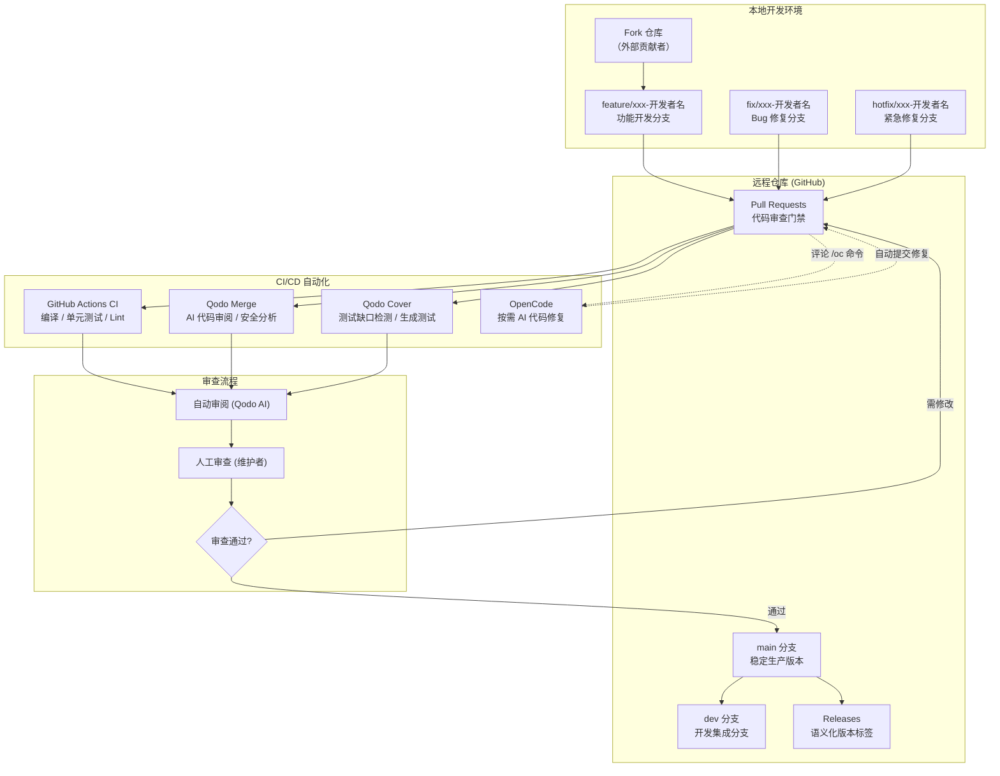
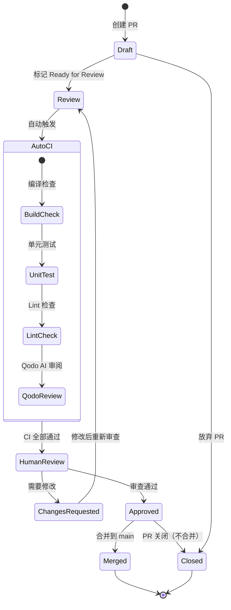
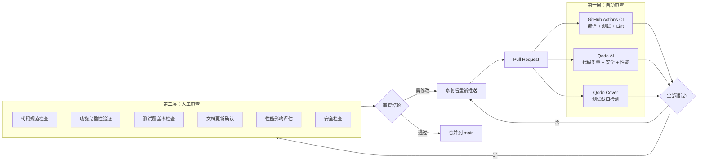
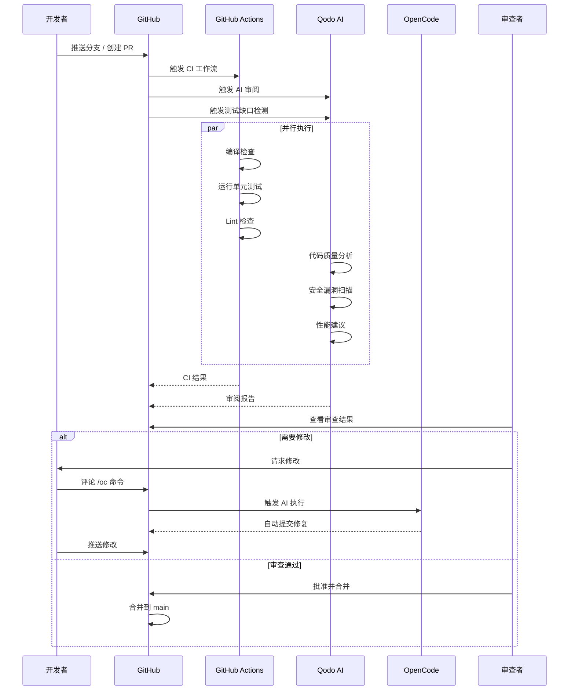
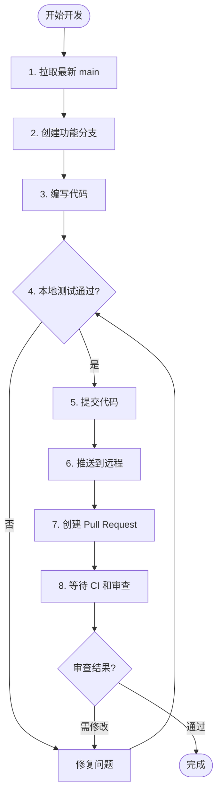
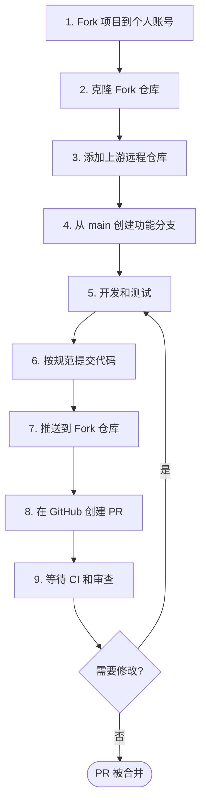

# Git 工作流

> 本文档定义 Aries AI 项目的 Git 工作流规范，涵盖分支策略、提交规范、Pull Request 流程、代码审查、合并与冲突解决、版本管理以及 CI/CD 自动化集成，确保团队协作顺畅和版本管理规范。

## 概述

Aries AI 项目采用基于 **GitHub Flow + 语义化版本** 的 Git 工作流模型。所有代码变更必须通过 Pull Request（PR）合并到主分支，并在合并前经过自动化 CI 检查和人工代码审查。

### 核心原则

- **分支隔离**：每个功能/修复在独立分支开发，不直接在 `main` 分支提交
- **提交规范**：遵循 `type(scope): subject` 格式，提交信息清晰可追溯
- **审查门禁**：所有 PR 必须通过 CI 自动化检查和至少 1 人的人工审查
- **语义化版本**：采用 `MAJOR.MINOR.PATCH` 版本号，明确变更影响范围
- **AI 辅助审阅**：由 Qodo AI 自动审阅代码，OpenCode 按需执行修复任务

### 适用对象

- 项目维护者（Owner/Member）：负责合并 PR、版本发布、代码审查
- 贡献者（Collaborator）：负责功能开发、Bug 修复、文档更新
- 外部贡献者：通过 Fork → PR 流程参与贡献

---

## 架构总览



**架构说明：**

- **本地开发层**：开发者在本地从 `main` 或 `dev` 分支创建特性分支，完成开发后推送至远程仓库
- **PR 门禁层**：所有代码变更通过 Pull Request 提交，触发 CI 自动化流水线
- **CI/CD 层**：GitHub Actions 执行编译和测试，Qodo AI 进行代码审阅，确保代码质量
- **审查层**：AI 自动审阅 + 人工审查双重保障，审查通过后方可合并
- **发布层**：合并到 `main` 后创建语义化版本标签，通过 GitHub Releases 发布

---

## 一、分支策略

### 1.1 分支类型与用途

| 分支类型 | 命名格式 | 用途 | 生命周期 | 基准分支 |
|----------|----------|------|----------|----------|
| `main` | main | 稳定版本，生产就绪代码 | 永久 | - |
| `dev` | dev | 开发集成分支 | 永久 | main |
| `feature` | feature/xxx-开发者名 | 新功能开发 | 临时 | main/dev |
| `fix` | fix/xxx-开发者名 | Bug 修复 | 临时 | main/dev |
| `hotfix` | hotfix/xxx-开发者名 | 紧急线上修复 | 临时 | main |

### 1.2 分支命名规范

分支名必须包含**功能描述**和**开发者标识**，使用连字符分隔：

```bash
# ✅ 功能分支（推荐）
feature/ui-tree-张三
feature/tool-click-element-李四
feature/perf-cache-王五
feature/virtual-screen-optimization

# ✅ 修复分支
fix/ui-parse-error-张三
fix/cache-bug-李四
fix/crash-fix-王五
fix/screenshot-black-frame

# ✅ 热修复分支
hotfix/crash-fix-张三
hotfix/memory-leak-李四
hotfix/security-fix-王五

# ❌ 不推荐的分支名
test           # 无意义
temp           # 无意义
my-branch      # 缺乏功能描述和开发者标识
```

> Source: [docs/GIT_WORKFLOW.md](https://github.com/ZG0704666/Aries-AI/blob/main/docs/GIT_WORKFLOW.md#L34-L48)

### 1.3 分支使用规则

**✅ 必须遵守：**
- 所有功能开发从 `feature/xxx-开发者名` 分支开始
- 所有 Bug 修复从 `fix/xxx-开发者名` 分支开始
- 紧急修复从 `hotfix/xxx-开发者名` 分支开始
- 分支名必须包含开发者标识，便于追踪和归属

**❌ 严格禁止：**
- 不要直接在 `main` 分支开发
- 不要在 `dev` 分支直接开发（除非是集成测试）
- 不要创建无意义的分支名（如 `test`、`temp`）
- 不要提交敏感信息（API 密钥、密码等）

---

## 二、提交规范

### 2.1 提交信息格式

提交信息遵循 **Conventional Commits** 规范，在此基础上增加了**开发者标识**：

```
<type>(<scope>): <subject>-<developer>

<body>

<footer>
```

> Source: [docs/GIT_WORKFLOW.md](https://github.com/ZG0704666/Aries-AI/blob/main/docs/GIT_WORKFLOW.md#L69-L75)

### 2.2 提交类型（type）

| 类型 | 说明 | 使用场景 |
|------|------|---------|
| `feat` | 新功能 | 新增工具、模块、API |
| `fix` | Bug 修复 | 修复已知问题 |
| `perf` | 性能优化 | 缓存策略优化、算法改进 |
| `refactor` | 代码重构 | 架构调整、代码清理 |
| `docs` | 文档更新 | README、API 文档、注释 |
| `test` | 测试相关 | 单元测试、集成测试 |
| `chore` | 构建/工具链 | 依赖更新、Gradle 配置 |
| `style` | 代码格式 | 不影响功能的格式调整 |

> Sources:
> - [docs/GIT_WORKFLOW.md](https://github.com/ZG0704666/Aries-AI/blob/main/docs/GIT_WORKFLOW.md#L79-L87)
> - [CONTRIBUTING.md](https://github.com/ZG0704666/Aries-AI/blob/main/CONTRIBUTING.md#L118-L127)

### 2.3 范围（scope）

范围用于标识变更影响的模块：

| 范围 | 说明 | 示例 |
|------|------|------|
| `tool` | 工具相关 | `feat(tool): 新增get_page_info工具` |
| `ui` | UI 相关 | `fix(ui): 修复UI树解析失败` |
| `service` | 服务相关 | `perf(service): 优化无障碍服务` |
| `cache` | 缓存相关 | `feat(cache): 新增缓存机制` |
| `agent` | Agent 相关 | `refactor(agent): 重构Agent逻辑` |
| `config` | 配置相关 | `chore(config): 更新Gradle配置` |
| `input` | 输入注入 | `fix(input): 修复IME焦点死锁` |
| `vdiso` | 虚拟屏模块 | `feat(vdiso): 新增OpenGL帧分发器` |
| `core` | 核心模块 | `test(core): 添加AgentConfiguration测试` |

> Sources:
> - [docs/GIT_WORKFLOW.md](https://github.com/ZG0704666/Aries-AI/blob/main/docs/GIT_WORKFLOW.md#L91-L99)
> - [CONTRIBUTING.md](https://github.com/ZG0704666/Aries-AI/blob/main/CONTRIBUTING.md#L131-L139)

### 2.4 完整提交示例

**功能开发：**
```bash
git add .
git commit -m "feat(tool): 新增get_page_info工具-张三

- 支持获取页面信息(package+activity+UI树)
- 支持format参数(xml/json)
- 支持detail参数(minimal/summary/full)
- 对齐Operit工具接口

Closes #005"
```

**Bug 修复：**
```bash
git add .
git commit -m "fix(ui): 修复UI树解析失败-李四

- XML格式不兼容，调整解析器
- 添加异常处理
- 增加单元测试

Fixes #003"
```

**性能优化：**
```bash
git add .
git commit -m "perf(cache): 优化截图缓存策略-王五

- 调整TTL从2秒到1.5秒
- 增加LRU淘汰策略
- 缓存命中率从20%提升到35%

Related to #013"
```

> Source: [docs/GIT_WORKFLOW.md](https://github.com/ZG0704666/Aries-AI/blob/main/docs/GIT_WORKFLOW.md#L138-L169)

### 2.5 提交注意事项

**✅ 推荐做法：**
- **频繁提交**：每完成一个小功能就提交，不要积累大量代码
- **清晰描述**：主题（subject）简洁明了，不超过 50 字符，使用中文
- **详细正文**：列出主要变更点和影响范围
- **关联追踪**：通过 `Closes #xxx`、`Fixes #xxx`、`Related to #xxx` 关联 Issue

**❌ 禁止内容：**
- 不要提交敏感信息（API 密钥、密码、Token）
- 不要提交临时文件（.tmp、.bak 等）
- 不要提交编译产物（build/、.gradle/ 等）
- 不要提交无详细说明的大批量代码

---

## 三、Pull Request 流程

### 3.1 PR 生命周期



### 3.2 创建 PR 的步骤

**方式一：使用 GitHub CLI：**
```bash
gh pr create --title "feat(tool): 新增get_page_info工具-张三" \
             --body "## 变更内容

- 新增get_page_info工具
- 支持format参数(xml/json)
- 支持detail参数(minimal/summary/full)

## 测试

- [x] 单元测试通过
- [x] 真机测试通过

Closes #005" \
             --base main \
             --head feature/tool-get-page-info-张三
```

**方式二：通过 GitHub 网页：**
1. 进入项目页面 → "Pull requests" → "New pull request"
2. 选择 base 分支：`main`，head 分支：`feature/xxx-开发者名`
3. 填写标题和描述（参考 PR 模板）
4. 点击 "Create pull request"

> Source: [docs/GIT_WORKFLOW.md](https://github.com/ZG0704666/Aries-AI/blob/main/docs/GIT_WORKFLOW.md#L177-L191)

### 3.3 PR 描述模板

```markdown
## 变更内容

### 主要变更
- 新增get_page_info工具
- 支持format参数(xml/json)
- 支持detail参数(minimal/summary/full)

### 影响范围
- `ToolRegistration.kt` - 新增工具注册
- `PhoneAgentAccessibilityService.kt` - 新增getUiHierarchy方法

## 测试

### 单元测试
- [x] ScreenshotCacheTest通过
- [x] ToolRegistrationTest通过
- [x] 测试覆盖率≥70%

### 集成测试
- [x] 在真机上测试通过
- [x] UI树输出格式正确

## 相关Issue

Closes #005
Related to #003, #004

## 审查清单

- [x] 代码符合规范
- [x] 公共API有注释
- [x] 异常处理完善
- [x] 无敏感信息
- [x] 文档已更新
```

> Source: [docs/GIT_WORKFLOW.md](https://github.com/ZG0704666/Aries-AI/blob/main/docs/GIT_WORKFLOW.md#L195-L242)

### 3.4 PR 状态标签

| 标签 | 说明 | 触发条件 |
|------|------|---------|
| `draft` | 草稿 | PR 创建后尚未完成 |
| `review` | 审查中 | 等待代码审查 |
| `approved` | 已批准 | 审查通过，等待合并 |
| `changes requested` | 需要修改 | 审查者提出修改意见 |
| `merged` | 已合并 | 已成功合并到目标分支 |
| `closed` | 已关闭 | 未合并被关闭 |

---

## 四、代码审查流程

### 4.1 审查层级

Aries AI 项目采用**双层审查机制**：



### 4.2 审查者检查清单

| 审查项 | 检查内容 | 通过标准 |
|---------|---------|---------|
| 代码规范 | 命名、格式、注释 | 完全符合 [CODING_STANDARDS.md](./CODING_STANDARDS.md) |
| 功能完整性 | 所有功能已实现 | 功能完整，无遗漏 |
| 测试覆盖 | 单元测试覆盖率 | 核心模块 ≥70%，工具模块 ≥60% |
| 文档更新 | README、API 文档 | 文档同步更新 |
| 性能影响 | 无性能退化 | 性能良好，无明显瓶颈 |
| 安全检查 | 无敏感信息泄露 | 安全合规 |

> Source: [docs/GIT_WORKFLOW.md](https://github.com/ZG0704666/Aries-AI/blob/main/docs/GIT_WORKFLOW.md#L261-L268)

### 4.3 审查意见格式

审查意见应包含**优点**、**需要改进**和**具体问题**三部分：

```markdown
### 优点

- XML schema设计合理
- 代码结构清晰
- 异常处理完善

### 需要改进

- 需要更新README.md
- 建议添加更多单元测试
- 建议优化缓存策略

### 具体问题

1. **第15行**：变量命名不符合规范
   - 当前：`ScreenshotCache`
   - 建议：`screenshotCache`
   - 位置：`ScreenshotCache.kt:15`

2. **第42行**：缺少异常处理
   - 建议：添加try-catch块
   - 位置：`ToolRegistration.kt:42`
```

> Source: [docs/GIT_WORKFLOW.md](https://github.com/ZG0704666/Aries-AI/blob/main/docs/GIT_WORKFLOW.md#L272-L295)

### 4.4 AI 辅助审阅

项目集成了两个 AI 工具协同工作：

| 工具 | 角色 | 触发方式 | 使用模型 |
|------|------|----------|---------|
| **Qodo AI** | 自动审阅者 | PR 创建/更新时自动触发 | Qodo 内置模型 |
| **OpenCode** | 代码执行者 | 评论 `/oc` 命令触发 | 通义千问 3.5 Plus |

**OpenCode 常用命令：**

```bash
# 修复问题
/oc 修复 Qodo 指出的空指针问题

# 解释代码
/oc 解释一下这个 PR 的主要改动

# 添加测试
/oc 为这个新增的类添加单元测试

# 更新文档
/oc 更新 README.md，添加新功能的说明
```

> Source: [docs/AI_PR_REVIEW.md](https://github.com/ZG0704666/Aries-AI/blob/main/docs/AI_PR_REVIEW.md#L72-L113)

---

## 五、合并流程

### 5.1 合并前检查清单

在合并前，项目负责人需确认：

- [ ] 所有 PR 已通过 CI 自动化检查
- [ ] Qodo AI 审阅无高优先级问题
- [ ] 人工审查已通过
- [ ] 所有测试通过且覆盖率达标
- [ ] 文档已同步更新
- [ ] 无合并冲突
- [ ] 版本号已更新（如需要）

### 5.2 合并策略

| 场景 | 策略 | 命令 |
|------|------|------|
| 无冲突 | `--no-ff` 合并（保留分支历史） | `git merge --no-ff feature/xxx` |
| 有冲突 | 手动解决冲突后合并 | `git merge feature/xxx`（手动解决） |
| 多个 PR | 按优先级顺序依次合并 | 依次合并，避免冲突叠加 |

### 5.3 合并操作步骤

```bash
# 1. 切换到 main 分支并拉取最新代码
git checkout main
git pull origin main

# 2. 合并功能分支（使用 --no-ff 保留分支历史）
git merge --no-ff feature/tool-get-page-info-张三

# 3. 推送合并后的 main
git push origin main

# 4. 删除已合并的本地分支
git branch -d feature/tool-get-page-info-张三

# 5. 删除远程已合并分支
git push origin --delete feature/tool-get-page-info-张三

# 6. 创建版本标签（可选）
git tag -a v1.0.1 -m "Release v1.0.1"
git push origin v1.0.1
```

> Source: [docs/GIT_WORKFLOW.md](https://github.com/ZG0704666/Aries-AI/blob/main/docs/GIT_WORKFLOW.md#L305-L315)

---

## 六、冲突解决

### 6.1 常见冲突场景

| 冲突类型 | 场景 | 解决策略 |
|----------|------|---------|
| 同一文件修改 | 多人修改同一文件的同一区域 | 手动合并，保留双方有效修改 |
| 删除冲突 | 一方删除文件，另一方修改文件 | 确认删除意图，与修改方协商 |
| 重命名冲突 | 同一文件被不同分支重命名 | 追踪文件历史，统一命名 |

### 6.2 冲突解决步骤

```bash
# 1. 拉取最新代码
git checkout main
git pull origin main

# 2. 尝试合并功能分支
git merge feature/xxx-张三

# 3. 查看冲突文件列表
git status
# 输出示例：
# both modified:   app/src/main/java/.../ScreenshotCache.kt
# both modified:   app/src/main/java/.../ToolRegistration.kt

# 4. 打开冲突文件，冲突标记如下：
# <<<<<<< HEAD
#   （main 分支的代码）
# =======
#   （feature 分支的代码）
# >>>>>>> feature/xxx-张三

# 5. 手动解决冲突：保留需要的代码，删除冲突标记

# 6. 标记冲突已解决
git add <冲突文件>

# 7. 完成合并
git commit -m "merge: 合并feature/xxx-张三到main，解决冲突"
```

> Source: [docs/GIT_WORKFLOW.md](https://github.com/ZG0704666/Aries-AI/blob/main/docs/GIT_WORKFLOW.md#L368-L395)

### 6.3 冲突解决示例

```kotlin
// 冲突前（main 分支）
class ScreenshotCache {
    private val cache = HashMap<String, ScreenshotData>()
}

// 冲突后（feature 分支）
class ScreenshotCache {
    private val cache = LinkedHashMap<String, ScreenshotData>()
}

// 解决冲突（合并后，采用 feature 分支的 LinkedHashMap 实现）
class ScreenshotCache {
    private val cache = LinkedHashMap<String, ScreenshotData>()
}
```

> Source: [docs/GIT_WORKFLOW.md](https://github.com/ZG0704666/Aries-AI/blob/main/docs/GIT_WORKFLOW.md#L399-L414)

---

## 七、版本管理

### 7.1 语义化版本规范

采用 `MAJOR.MINOR.PATCH` 格式：

| 版本号变更 | 说明 | 示例场景 |
|-----------|------|---------|
| `MAJOR` +1 | 不兼容的 API 变更 | 架构重构、破坏性接口变更 |
| `MINOR` +1 | 向后兼容的新功能 | 新增工具模块、新增 Provider |
| `PATCH` +1 | 向后兼容的 Bug 修复 | 修复崩溃、修复解析错误 |

### 7.2 版本号配置

版本号在 `app/build.gradle.kts` 中定义：

```kotlin
// app/build.gradle.kts
android {
    defaultConfig {
        versionCode = 1        // 整数，每次发布递增
        versionName = "1.0.0"  // 语义化版本字符串
    }
}
```

> Source: [docs/GIT_WORKFLOW.md](https://github.com/ZG0704666/Aries-AI/blob/main/docs/GIT_WORKFLOW.md#L433-L441)

### 7.3 版本发布流程

```bash
# 1. 在本地更新版本号
# 修改 app/build.gradle.kts 中的 versionCode（递增）和 versionName（语义化版本）
# versionCode: 递增（如 15 → 16）
# versionName: 遵循语义化版本（如 "1.3.2" → "1.4.0"）

# 2. 提交版本更新
git add app/build.gradle.kts
git commit -m "chore(config): 更新版本号至v1.4.0"
git push origin main

# 3. 创建版本标签（使用语义化版本号）
git tag -a v1.4.0 -m "Release v1.4.0 - 架构优化"

# 4. 推送标签
git push origin v1.4.0

# 5. 创建 GitHub Release
gh release create v1.4.0 \
    --title "v1.4.0 - 架构优化" \
    --notes "## 新增功能

- 新增XX工具
- 支持XX格式

## Bug修复

- 修复XX崩溃
- 修复XX解析错误" \
    --target main
```

> Source: [docs/GIT_WORKFLOW.md](https://github.com/ZG0704666/Aries-AI/blob/main/docs/GIT_WORKFLOW.md#L445-L462)

---

## 八、CI/CD 自动化集成

### 8.1 自动化工作流总览



### 8.2 自动触发的工作流

| 工作流 | 触发时机 | 检查内容 |
|--------|---------|---------|
| **GitHub Actions CI** | PR 创建/更新 | 编译、单元测试、Lint |
| **Qodo Merge** | PR 创建/更新 | AI 代码审阅、安全分析、性能建议 |
| **Qodo Cover** | PR 创建 | 检测测试缺口、生成单元测试建议 |

> Source: [CONTRIBUTING.md](https://github.com/ZG0704666/Aries-AI/blob/main/CONTRIBUTING.md#L286-L292)

### 8.3 OpenCode 触发机制

OpenCode 通过在工作流配置中监听 PR 评论触发。配置位于 `.github/workflows/opencode.yml`：

```yaml
name: opencode

on:
  issue_comment:
    types: [created]
  pull_request_review_comment:
    types: [created]

jobs:
  opencode:
    if: |
      (
        contains(github.event.comment.body, ' /oc') ||
        startsWith(github.event.comment.body, '/oc') ||
        contains(github.event.comment.body, ' /opencode') ||
        startsWith(github.event.comment.body, '/opencode')
      ) &&
      (
        github.event.comment.author_association == 'OWNER' ||
        github.event.comment.author_association == 'MEMBER' ||
        github.event.comment.author_association == 'COLLABORATOR'
      )
    runs-on: ubuntu-latest
    permissions:
      contents: write
      pull-requests: write
      issues: write
    steps:
      - name: Run opencode
        uses: anomalyco/opencode/github@latest
        env:
          ALIBABA_CODING_PLAN_API_KEY: ${{ secrets.ALIBABA_CODING_PLAN_API_KEY }}
          GITHUB_TOKEN: ${{ secrets.GITHUB_TOKEN }}
        with:
          model: alibaba-coding-plan/qwen3.5-plus
          use_github_token: true
```

> Source: [docs/AI_PR_REVIEW.md](https://github.com/ZG0704666/Aries-AI/blob/main/docs/AI_PR_REVIEW.md#L197-L247)

---

## 九、每日开发流程

### 9.1 开发者每日工作流



**对应的 Git 命令：**

```bash
# 1. 拉取最新代码
git checkout main
git pull origin main

# 2. 创建功能分支
git checkout -b feature/xxx-张三

# 3. 开发代码
# ... 编写代码 ...

# 4. 本地测试
./gradlew testDebugUnitTest
./gradlew assembleDebug

# 5. 提交代码
git add .
git commit -m "feat(scope): xxx-张三

- 变更点1
- 变更点2

Closes #xxx"

# 6. 推送到远程
git push origin feature/xxx-张三

# 7. 创建 PR（在 GitHub 网页操作）
# 等待 CI 自动检查和人工审查
```

> Source: [docs/GIT_WORKFLOW.md](https://github.com/ZG0704666/Aries-AI/blob/main/docs/GIT_WORKFLOW.md#L470-L494)

### 9.2 项目负责人合并流程

```bash
# 1. 检查所有 Open 的 Pull Request（GitHub 网页查看）

# 2. 审查代码
# - 检查代码规范
# - 检查功能完整性
# - 检查测试覆盖率

# 3. 合并到 main
git checkout main
git pull origin main
git merge --no-ff feature/xxx-张三
git push origin main

# 4. 删除已合并分支
git branch -d feature/xxx-张三
git push origin --delete feature/xxx-张三
```

> Source: [docs/GIT_WORKFLOW.md](https://github.com/ZG0704666/Aries-AI/blob/main/docs/GIT_WORKFLOW.md#L498-L516)

---

## 十、外部贡献者流程

对于外部贡献者（非项目成员），采用标准的 Fork → PR 流程：



**关键命令：**

```bash
# 1. Fork 项目（在 GitHub 网页点击 "Fork" 按钮）

# 2. 克隆 Fork 仓库
git clone https://github.com/YOUR_USERNAME/Aries-AI.git
cd Aries-AI

# 3. 添加上游仓库
git remote add upstream https://github.com/ZG0704666/Aries-AI.git

# 4. 创建功能分支
git checkout -b feature/your-feature-name

# 5. 保持与上游同步
git fetch upstream
git rebase upstream/main

# 6. 开发和提交
git add .
git commit -m "feat(scope): description"

# 7. 推送到 Fork 仓库
git push origin feature/your-feature-name

# 8. 在 GitHub 上创建 Pull Request（从 Fork 分支到上游 main）
```

> Source: [CONTRIBUTING.md](https://github.com/ZG0704666/Aries-AI/blob/main/CONTRIBUTING.md#L56-L155)

---

## 快速参考

### 常用 Git 命令速查

| 操作 | 命令 |
|------|------|
| 创建分支 | `git checkout -b feature/xxx-开发者名` |
| 提交代码 | `git commit -m "feat(scope): 描述-开发者名"` |
| 推送分支 | `git push origin feature/xxx-开发者名` |
| 创建 PR | `gh pr create --title "..." --body "..." --base main --head feature/xxx` |
| 合并分支 | `git merge --no-ff feature/xxx-开发者名` |
| 删除分支 | `git branch -d feature/xxx-开发者名` |
| 创建标签 | `git tag -a v1.0.0 -m "Release v1.0.0"` |
| 推送标签 | `git push origin v1.0.0` |
| 查看状态 | `git status` |
| 查看日志 | `git log --oneline --graph` |

### 最佳实践总结

**✅ 推荐做法：**
1. **频繁提交**：每完成一个小功能就提交，保持提交粒度适中
2. **清晰的提交信息**：使用标准 `type(scope): subject` 格式，便于追溯
3. **代码审查**：所有 PR 必须经过至少 1 人审查
4. **测试先行**：提交前确保本地测试通过
5. **文档同步**：代码变更必须同步更新文档
6. **利用 AI 工具**：善用 Qodo 审阅和 OpenCode 修复，提升开发效率

**❌ 避免做法：**
1. 不要直接在 `main` 分支提交代码
2. 不要提交敏感信息（API 密钥、密码、Token）
3. 不要忽略测试（核心模块覆盖率 ≥70%）
4. 不要忽略文档更新
5. 不要创建无意义的分支名

---

## 相关链接

- [GIT_WORKFLOW.md](https://github.com/ZG0704666/Aries-AI/blob/main/docs/GIT_WORKFLOW.md) — Git 工作流详细文档（原始文件）
- [CONTRIBUTING.md](https://github.com/ZG0704666/Aries-AI/blob/main/CONTRIBUTING.md) — 贡献者指南
- [AI_PR_REVIEW.md](https://github.com/ZG0704666/Aries-AI/blob/main/docs/AI_PR_REVIEW.md) — AI 自动化 PR 审阅指南
- [CODING_STANDARDS.md](https://github.com/ZG0704666/Aries-AI/blob/main/docs/CODING_STANDARDS.md) — 代码规范
- [BUILDING.md](https://github.com/ZG0704666/Aries-AI/blob/main/docs/BUILDING.md) — 编译指南
- [FEISHU_COLLABORATION.md](https://github.com/ZG0704666/Aries-AI/blob/main/docs/FEISHU_COLLABORATION.md) — 飞书协作文档模板
- [README.md](https://github.com/ZG0704666/Aries-AI/blob/main/README.md) — 项目概述
- [GitHub Issues](https://github.com/ZG0704666/Aries-AI/issues) — 问题反馈
- [GitHub Discussions](https://github.com/ZG0704666/Aries-AI/discussions) — 功能建议
- [Releases](https://github.com/ZG0704666/Aries-AI/releases) — 版本发布

---

**文档版本**：v1.2
**最后更新**：2026-02-28
**维护人**：ZG0704666
