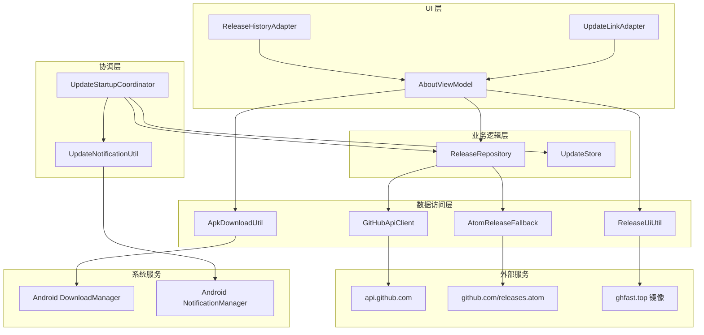
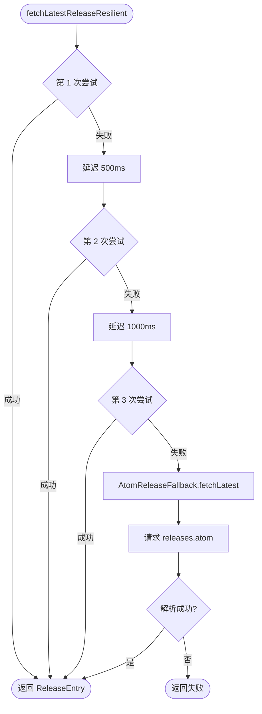

# GitHub Release 集成

Aries AI 通过 GitHub REST API 与 Atom Feed 实现应用版本更新检测、通知和 APK 下载功能，涵盖 Android 客户端内建更新检查与官方网站的下载链接自动解析。

## 概述

GitHub Release 集成是 Aries AI 的**核心分发与更新机制**。由于该应用未上架 Google Play 商店，所有版本均通过 GitHub Releases 发布，因此应用内部实现了一套完整的更新检测系统：

- **自动静默检查**：应用启动时，每 6 小时自动在后台检查一次最新版本
- **多级回退策略**：GitHub REST API → 3 次重试（指数退避）→ Atom Feed 回退，确保在任何网络条件下都能获取版本信息
- **系统通知**：检测到新版本时，通过 Android Notification 通知用户
- **APK 下载**：利用 Android DownloadManager 完成 APK 下载，支持 GitHub Token 鉴权与镜像加速
- **网站端集成**：官方站点通过 GitHub API 自动解析最新 APK 地址，提供官方直连与镜像加速双通道下载

该模块位于 `feature/updates` 目录下，采用 Kotlin 协程、OkHttp、kotlinx.serialization 等主流技术栈。

## 架构



**架构说明：**

- **UI 层**：`AboutViewModel` 是更新功能的核心 ViewModel，管理检查更新、下载、对话框状态等所有 UI 逻辑。`ReleaseHistoryAdapter` 和 `UpdateLinkAdapter` 分别负责版本历史列表和下载源选择列表的渲染。

- **协调层**：`UpdateStartupCoordinator` 在应用启动时触发静默检查；`UpdateNotificationUtil` 负责弹出系统通知。

- **业务逻辑层**：`ReleaseRepository` 封装版本获取的业务规则（排除 draft、过滤 prerelease、APK 资产匹配）；`UpdateStore` 使用 SharedPreferences 持久化检查状态与缓存。

- **数据访问层**：`GitHubApiClient` 是主要的 API 客户端，携带 GitHub Token 进行鉴权；`AtomReleaseFallback` 是无需鉴权的备选方案；`ApkDownloadUtil` 封装 Android DownloadManager 的下载逻辑；`ReleaseUiUtil` 处理 URL 打开与镜像探测。

## 核心流程

### 启动时静默检查

```mermaid
sequenceDiagram
    participant App as 应用启动
    participant SC as UpdateStartupCoordinator
    participant Store as UpdateStore
    participant Repo as ReleaseRepository
    participant API as GitHubApiClient
    participant Atom as AtomReleaseFallback
    participant NF as UpdateNotificationUtil
    participant Sys as Android 系统

    App->>SC: silentCheckOnLaunch()
    SC->>SC: 获取当前版本号
    SC->>Store: loadLatest() 读缓存
    alt 缓存版本 > 当前版本
        SC->>NF: notifyNewVersion(缓存版本)
        NF->>Sys: 发送通知
    end

    SC->>Store: shouldSilentCheck(now, 6h)
    alt 未到检查间隔
        SC-->>App: 跳过网络检查
    else 需要检查
        SC->>Store: markSilentChecked()
        SC->>Repo: fetchLatestReleaseResilient()
        Repo->>API: listReleases(owner, repo, page, perPage)
        alt API 成功
            API-->>Repo: List&lt;GitHubRelease&gt;
        else API 失败
            Repo->>Repo: 等待 500ms 重试
            Note over Repo: 最多 3 次重试<br/>指数退避: 500ms → 1s → 2s
            alt 重试成功
                Repo-->>Repo: 获得 Releases
            else 全部失败
                Repo->>Atom: fetchLatest() 回退
                Atom->>Atom: 解析 releases.atom
                Atom-->>Repo: ReleaseEntry
            end
        end
        Repo-->>SC: Result&lt;ReleaseEntry&gt;
        SC->>SC: VersionComparator.compare()
        alt 发现新版本
            SC->>Store: saveLatest()
            SC->>NF: notifyNewVersion()
            NF->>Sys: 弹出通知
        end
    end
```

### 用户手动检查更新

```mermaid
sequenceDiagram
    participant User as 用户
    participant VM as AboutViewModel
    participant Repo as ReleaseRepository
    participant VC as VersionComparator
    participant UI as UI 对话框

    User->>VM: 点击"检查更新"
    VM->>VM: isCheckingUpdates = true
    VM->>Repo: fetchLatestReleaseResilient(false)
    Repo-->>VM: Result&lt;ReleaseEntry&gt;

    alt 网络错误
        VM->>UI: 显示 ErrorDialog
    else 无 Release
        VM->>UI: 显示"未获取到 Release"
    else 获取成功
        VM->>VC: compare(latest.version, currentVersion)
        alt 有新版本
            VM->>Store: saveLatest()
            VM->>UI: 显示 UpdateDialog（更新日志）
            User->>VM: 点击下载
            VM->>VM: handleDownload()
            alt 有 GITHUB_TOKEN
                VM->>DownloadUtil: enqueueApkDownload()
                DownloadUtil->>System: DownloadManager 下载
            else 无 Token
                VM->>UiUtil: mirroredDownloadOptions()
                alt 单一源
                    VM->>VM: 直接打开 URL
                else 多源
                    VM->>UI: 显示 DownloadOptionsDialog
                    User->>VM: 选择下载源
                end
            end
        else 已是最新
            VM->>UI: 显示 UpToDateDialog
        end
    end
```

### 多级回退策略



该回退策略的设计意图是：GitHub REST API 对未认证请求有严格的限流（60次/小时），而 Atom Feed 是公开的、不限流的 XML 订阅源。通过多级回退，确保在 API 限流、网络波动等场景下仍然能够获取版本信息。

## 核心组件详解

### GitHubApiClient — API 客户端

`GitHubApiClient` 是整个更新系统的数据入口，负责与 `api.github.com` 通信。

**鉴权机制：**

- 支持 GitHub Personal Access Token（PAT）：以 `github_pat_` 开头的使用 `Bearer` 认证，否则使用 `token` 认证
- Token 通过 `local.properties` 中的 `github.token` 配置项注入到 `BuildConfig.GITHUB_TOKEN`
- 未配置 Token 时以匿名身份请求，受 API 限流限制

> Source: [GitHubApiClient.kt](https://github.com/ZG0704666/Aries-AI/blob/main/feature/updates/src/main/java/com/ai/phoneagent/updates/GitHubApiClient.kt#L18-L26)

**HTTP 客户端配置：**

```kotlin
private val okHttpClient: OkHttpClient by lazy {
    val logger = HttpLoggingInterceptor().apply {
        level = if (BuildConfig.DEBUG) HttpLoggingInterceptor.Level.BASIC
                else HttpLoggingInterceptor.Level.NONE
    }

    val headerInterceptor = Interceptor { chain ->
        val reqBuilder = chain.request().newBuilder()
            .header("User-Agent", "PhoneAgent")
            .header("Accept", "application/vnd.github+json")

        buildAuthHeader(BuildConfig.GITHUB_TOKEN)?.let { auth ->
            reqBuilder.header("Authorization", auth)
        }

        chain.proceed(reqBuilder.build())
    }

    OkHttpClient.Builder()
        .addInterceptor(headerInterceptor)
        .addInterceptor(logger)
        .retryOnConnectionFailure(true)
        .connectTimeout(20, TimeUnit.SECONDS)
        .readTimeout(30, TimeUnit.SECONDS)
        .writeTimeout(30, TimeUnit.SECONDS)
        .callTimeout(60, TimeUnit.SECONDS)
        .build()
}
```

> Source: [GitHubApiClient.kt](https://github.com/ZG0704666/Aries-AI/blob/main/feature/updates/src/main/java/com/ai/phoneagent/updates/GitHubApiClient.kt#L28-L55)

**请求构建：**

```kotlin
suspend fun listReleases(owner: String, repo: String, page: Int, perPage: Int): List<GitHubRelease> =
    withContext(Dispatchers.IO) {
        val url = "$BASE_URL/repos/$owner/$repo/releases?page=$page&per_page=$perPage"
        val request = Request.Builder().url(url).get().build()
        okHttpClient.newCall(request).execute().use { response ->
            if (!response.isSuccessful) {
                throw IOException("HTTP ${response.code} fetching releases")
            }
            val body = response.body?.string()
                ?: throw IOException("Empty response body")
            AppJson.decodeFromString<List<GitHubRelease>>(body)
        }
    }
```

> Source: [GitHubApiClient.kt](https://github.com/ZG0704666/Aries-AI/blob/main/feature/updates/src/main/java/com/ai/phoneagent/updates/GitHubApiClient.kt#L57-L69)

设计意图：使用 `Accept: application/vnd.github+json` 请求头告知 GitHub API 返回 v3 版本的 JSON 格式；使用 `Dispatchers.IO` 确保网络请求不阻塞主线程。

### GitHubModels — 数据模型

```kotlin
@Serializable
data class GitHubRelease(
    @SerialName("id") val id: Long,
    @SerialName("tag_name") val tagName: String,
    @SerialName("name") val name: String?,
    @SerialName("body") val body: String?,
    @SerialName("html_url") val htmlUrl: String,
    @SerialName("draft") val draft: Boolean,
    @SerialName("prerelease") val prerelease: Boolean,
    @SerialName("published_at") val publishedAt: String?,
    @SerialName("assets") val assets: List<GitHubReleaseAsset> = emptyList(),
)

@Serializable
data class GitHubReleaseAsset(
    @SerialName("id") val id: Long,
    @SerialName("name") val name: String,
    @SerialName("browser_download_url") val browserDownloadUrl: String,
)

@Serializable
data class ReleaseEntry(
    val versionTag: String,
    val version: String,
    val title: String,
    val date: String,
    val isPrerelease: Boolean,
    val body: String,
    val releaseUrl: String,
    val apkUrl: String?,
    val apkAssetId: Long?,
)
```

> Source: [GitHubModels.kt](https://github.com/ZG0704666/Aries-AI/blob/main/feature/updates/src/main/java/com/ai/phoneagent/updates/GitHubModels.kt#L6-L37)

设计意图：`GitHubRelease` / `GitHubReleaseAsset` 是 GitHub API 的原始响应模型（使用 `@SerialName` 映射 JSON 字段名），而 `ReleaseEntry` 是应用内部使用的标准化模型。这种分层设计将外部 API 格式与应用内部逻辑解耦——当 GitHub API 格式变化时，只需要修改 `GitHubRelease` 的映射，`ReleaseEntry` 不受影响。

### ReleaseRepository — 版本仓库

`ReleaseRepository` 是核心业务逻辑所在，主要功能为：

**1. 版本分页获取与映射**

排除 draft 版本，匹配 APK 资产（优先精确匹配 `app-release.apk`，其次匹配任意 `.apk` 文件）：

```kotlin
suspend fun fetchReleasePage(page: Int, perPage: Int): Result<List<ReleaseEntry>> {
    return runCatching {
        val releases = GitHubApiClient.listReleases(owner = owner, repo = repo, page = page, perPage = perPage)
        releases
            .asSequence()
            .filter { !it.draft }
            .map { r ->
                // ... 映射逻辑
                val apkAsset =
                    r.assets.firstOrNull { it.name.equals(UpdateConfig.APK_ASSET_NAME, ignoreCase = true) }
                        ?: r.assets.firstOrNull { it.name.endsWith(".apk", ignoreCase = true) }

                ReleaseEntry(
                    versionTag = versionTag,
                    version = version,
                    title = title,
                    date = date,
                    isPrerelease = r.prerelease,
                    body = r.body ?: "",
                    releaseUrl = r.htmlUrl,
                    apkUrl = apkAsset?.browserDownloadUrl,
                    apkAssetId = apkAsset?.id,
                )
            }
            .toList()
    }
}
```

> Source: [ReleaseRepository.kt](https://github.com/ZG0704666/Aries-AI/blob/main/feature/updates/src/main/java/com/ai/phoneagent/updates/ReleaseRepository.kt#L7-L37)

**2. 最新版本查找（带分页扫描）**

最多扫描 3 页（每页 10 条），确保在有大量 prerelease 的情况下仍能找到最新的正式版：

```kotlin
suspend fun fetchLatestRelease(includePrerelease: Boolean): Result<ReleaseEntry?> {
    return runCatching {
        var page = 1
        while (page <= 3) {
            val entries = fetchReleasePage(page = page, perPage = 10).getOrElse { throw it }
            val candidate = entries.firstOrNull { e -> includePrerelease || !e.isPrerelease }
            if (candidate != null) return@runCatching candidate
            page += 1
        }
        null
    }
}
```

> Source: [ReleaseRepository.kt](https://github.com/ZG0704666/Aries-AI/blob/main/feature/updates/src/main/java/com/ai/phoneagent/updates/ReleaseRepository.kt#L39-L50)

**3. 弹性获取（重试 + Atom 回退）**

```kotlin
suspend fun fetchLatestReleaseResilient(includePrerelease: Boolean): Result<ReleaseEntry?> {
    var lastErr: Throwable? = null
    var delayMs = 500L
    repeat(3) { attempt ->
        val result = fetchLatestRelease(includePrerelease)
        if (result.isSuccess) return result
        lastErr = result.exceptionOrNull()
        if (attempt < 2) {
            kotlinx.coroutines.delay(delayMs)
            delayMs *= 2
        }
    }

    val atom = AtomReleaseFallback.fetchLatest(owner = owner, repo = repo)
    if (atom.isSuccess) {
        val latest = atom.getOrNull()
        return Result.success(latest)
    }
    return Result.failure(atom.exceptionOrNull() ?: lastErr ?: RuntimeException("fetchLatestRelease failed"))
}
```

> Source: [ReleaseRepository.kt](https://github.com/ZG0704666/Aries-AI/blob/main/feature/updates/src/main/java/com/ai/phoneagent/updates/ReleaseRepository.kt#L52-L71)

设计意图：指数退避重试（500ms → 1000ms → 2000ms）可以有效应对 GitHub API 的临时限流（429 Too Many Requests）。三重试全部失败后，降级到 Atom Feed 解析——Atom Feed 是公开的 RSS 订阅源，不占用 API 配额。

### AtomReleaseFallback — Atom Feed 回退

当 GitHub REST API 不可用时，通过解析 `https://github.com/{owner}/{repo}/releases.atom` 获取最新版本信息。这是一个无需鉴权、不限流的 XML 解析方案。

核心设计特点：
- **零依赖 XML 解析**：不引入第三方 XML 库，通过字符串查找手动解析 Atom Feed
- **信息提取**：从 XML 中提取 title、updated、link href、content/summary 等关键字段
- **版本推导**：从 link href 中解析 `/releases/tag/vX.X.X` 模式获取版本标签
- **APK URL 构造**：根据版本标签按约定格式构造下载链接

> Source: [AtomReleaseFallback.kt](https://github.com/ZG0704666/Aries-AI/blob/main/feature/updates/src/main/java/com/ai/phoneagent/updates/AtomReleaseFallback.kt#L21-L71)

### UpdateConfig — 配置常量

```kotlin
object UpdateConfig {
    const val REPO_OWNER = "ZG0704666"
    const val REPO_NAME = "Aries-AI"

    const val APK_ASSET_NAME = "app-release.apk"
}
```

> Source: [UpdateConfig.kt](https://github.com/ZG0704666/Aries-AI/blob/main/feature/updates/src/main/java/com/ai/phoneagent/updates/UpdateConfig.kt#L3-L8)

### UpdateStore — 状态持久化

`UpdateStore` 使用 Android SharedPreferences 管理更新相关的本地状态：

| 操作 | 方法 | 用途 |
|------|------|------|
| 检查间隔控制 | `shouldSilentCheck()` / `markSilentChecked()` | 确保每 6 小时最多执行一次静默检查 |
| 通知去重 | `shouldNotify()` / `markNotified()` | 同一版本只通知一次 |
| 版本缓存 | `saveLatest()` / `loadLatest()` | 持久化最新版本信息，用于离线/快速展示 |

> Source: [UpdateStore.kt](https://github.com/ZG0704666/Aries-AI/blob/main/feature/updates/src/main/java/com/ai/phoneagent/updates/UpdateStore.kt#L5-L76)

### UpdateStartupCoordinator — 启动协调

应用启动时执行静默检查的入口：

```kotlin
object UpdateStartupCoordinator {
    private const val SILENT_CHECK_INTERVAL_MS = 6L * 60L * 60L * 1000L  // 6小时

    fun silentCheckOnLaunch(activity: AppCompatActivity) {
        val currentVersion = runCatching {
            activity.packageManager.getPackageInfo(activity.packageName, 0).versionName.orEmpty()
        }.getOrDefault("")

        // 优先从缓存通知
        notifyFromCacheIfNeeded(activity, currentVersion)

        val now = System.currentTimeMillis()
        if (!UpdateStore.shouldSilentCheck(activity, nowMs = now, intervalMs = SILENT_CHECK_INTERVAL_MS)) {
            return
        }
        UpdateStore.markSilentChecked(activity, nowMs = now)

        activity.lifecycleScope.launch {
            val result = withContext(Dispatchers.IO) {
                ReleaseRepository().fetchLatestReleaseResilient(includePrerelease = false)
            }
            result
                .onSuccess { latest ->
                    if (latest == null) return@onSuccess
                    if (VersionComparator.compare(latest.version, currentVersion) <= 0) return@onSuccess
                    UpdateStore.saveLatest(activity, latest)
                    notifyIfNeeded(activity, latest)
                }
                .onFailure {
                    // Silent update checks should not interrupt the launch flow.
                }
        }
    }
}
```

> Source: [UpdateStartupCoordinator.kt](https://github.com/ZG0704666/Aries-AI/blob/main/feature/updates/src/main/java/com/ai/phoneagent/updates/UpdateStartupCoordinator.kt#L13-L49)

设计意图：如果此前已缓存了新版本信息（例如用户上次检查更新发现新版本但未下载），应用启动时会优先从缓存中读取版本信息并弹出通知，无需等待网络请求。这确保用户即使离线也能被提醒有新版本可用。

### VersionComparator — 版本比较

```kotlin
object VersionComparator {
    private val numberRegex = Regex("""\d+""")

    fun compare(v1: String, v2: String): Int {
        val p1 = parse(v1)
        val p2 = parse(v2)
        if (p1.major != p2.major) return p1.major.compareTo(p2.major)
        if (p1.minor != p2.minor) return p1.minor.compareTo(p2.minor)
        if (p1.patch != p2.patch) return p1.patch.compareTo(p2.patch)
        return p1.build.compareTo(p2.build)
    }
}
```

> Source: [VersionComparator.kt](https://github.com/ZG0704666/Aries-AI/blob/main/core/common/src/main/java/com/ai/phoneagent/core/common/VersionComparator.kt#L3-L44)

设计意图：使用语义化版本（SemVer）比较策略，按 major → minor → patch → build 优先级依次比较。可以正确处理 `v1.4.3`、`V1.4.3`、`1.4.2-release` 等不同格式的版本号，并忽略 v/V 前缀及后缀标签。

### ApkDownloadUtil — APK 下载

利用 Android DownloadManager 实现 APK 后台下载：

- **认证下载**：配置了 GitHub Token 时，通过 Asset ID 调用 GitHub Asset API，携带 Authorization 头
- **公开下载**：未配置 Token 时，直接使用 `browser_download_url` 下载
- **失败监听**：注册 BroadcastReceiver 监听下载完成事件，失败时显示具体原因码
- **Cookie 支持**：从 WebView CookieManager 获取 Cookie 并附加到请求头，提升镜像站兼容性

> Source: [ApkDownloadUtil.kt](https://github.com/ZG0704666/Aries-AI/blob/main/feature/updates/src/main/java/com/ai/phoneagent/updates/ApkDownloadUtil.kt#L55-L155)

### ReleaseUiUtil — 镜像与探测

提供镜像站点下载选项与连通性探测：

- **镜像列表**：官方直连 + ghfast.top 镜像加速
- **URL 可探测性检查**：使用 HEAD/GET 请求（Range: bytes=0-0）快速探测每个镜像的可用性和延迟
- **智能排序**：按延迟升序排列可用镜像，确保用户首选最快的下载源
- **错误格式化**：将 HTTP 错误码转化为用户可读的中文提示

> Source: [ReleaseUiUtil.kt](https://github.com/ZG0704666/Aries-AI/blob/main/feature/updates/src/main/java/com/ai/phoneagent/updates/ReleaseUiUtil.kt#L14-L161)

### 网站端集成

Aries AI 官方站点（`Aries-site`）也集成了 GitHub Release 信息。通过配置全局数据：

```javascript
window.ARIES_DATA = {
  githubReleasesPageUrl: 'https://github.com/ZG0704666/Aries-AI/releases',
  githubLatestReleaseApi: 'https://api.github.com/repos/ZG0704666/Aries-AI/releases/latest',
  fixedApkUrl: 'https://github.com/ZG0704666/Aries-AI/releases/download/V1.2.0/app-release.apk',
};
```

> Source: [config.js](https://github.com/ZG0704666/Aries-AI/blob/main/Aries-site/scripts/config.js#L5-L13)

站点启动时异步调用 `githubLatestReleaseApi` 获取最新 release 的 APK asset URL，失败则回退到 `fixedApkUrl`。下载弹窗提供官方直连、ghfast.top 镜像、gitmirror.com 镜像三个下载通道。

> Source: [modal.js](https://github.com/ZG0704666/Aries-AI/blob/main/Aries-site/scripts/modal.js#L101-L118)

## 使用示例

### 在 AboutViewModel 中手动检查更新

```kotlin
fun checkForUpdates() {
    if (_uiState.value.isCheckingUpdates) return
    val context = getApplication<Application>()
    val currentVersion = currentVersionName(context)

    _uiState.update {
        it.copy(
            isCheckingUpdates = true,
            checkUpdateButtonText = context.getString(R.string.about_checking_updates)
        )
    }

    viewModelScope.launch {
        try {
            val result = withContext(Dispatchers.IO) {
                releaseRepo.fetchLatestReleaseResilient(includePrerelease = false)
            }

            val latest = result.getOrNull()
            val error = result.exceptionOrNull()

            if (error != null) {
                _uiState.update { it.copy(errorDialogState = ErrorDialogState(ReleaseUiUtil.formatError(error))) }
                return@launch
            }

            if (latest == null) {
                _uiState.update { it.copy(errorDialogState = ErrorDialogState(context.getString(R.string.about_no_release_found))) }
                return@launch
            }

            val newer = VersionComparator.compare(latest.version, currentVersion) > 0
            if (newer) {
                UpdateStore.saveLatest(context, latest)
                _uiState.update { it.copy(updateDialogState = UpdateDialogState(latest)) }
            } else {
                _uiState.update { it.copy(upToDateDialogState = UpToDateDialogState(currentVersion)) }
            }
        } catch (e: Throwable) {
            _uiState.update { it.copy(errorDialogState = ErrorDialogState(ReleaseUiUtil.formatError(e))) }
        } finally {
            _uiState.update {
                it.copy(
                    isCheckingUpdates = false,
                    checkUpdateButtonText = context.getString(R.string.about_check_updates)
                )
            }
        }
    }
}
```

> Source: [AboutViewModel.kt](https://github.com/ZG0704666/Aries-AI/blob/main/app/src/main/java/com/ai/phoneagent/viewmodel/AboutViewModel.kt#L147-L196)

### 处理下载操作

```kotlin
fun handleDownload(entry: ReleaseEntry) {
    val context = getApplication<Application>()
    val options = ReleaseUiUtil.mirroredDownloadOptions(entry.apkUrl)

    runCatching {
        if (UpdatesBuildConfig.GITHUB_TOKEN.isNotBlank()) {
            val submitted = ApkDownloadUtil.enqueueApkDownload(context, entry)
            if (!submitted) {
                Toast.makeText(context, R.string.update_download_submit_failed, Toast.LENGTH_SHORT).show()
                openReleaseUrlWithFeedback(entry.releaseUrl)
            }
            return
        }

        if (entry.apkUrl.isNullOrBlank()) {
            Toast.makeText(context, R.string.update_apk_missing_fallback_release, Toast.LENGTH_SHORT).show()
            openReleaseUrlWithFeedback(entry.releaseUrl)
            return
        }
        if (options.isEmpty()) {
            openReleaseUrlWithFeedback(entry.releaseUrl)
            return
        }
        if (options.size == 1) {
            openReleaseUrlWithFeedback(options.first().second)
            return
        }

        _uiState.update { it.copy(downloadOptionsDialogState = DownloadOptionsDialogState(entry, options)) }
    }.onFailure {
        Toast.makeText(context, R.string.update_download_submit_failed, Toast.LENGTH_SHORT).show()
        openReleaseUrlWithFeedback(entry.releaseUrl)
    }
}
```

> Source: [AboutViewModel.kt](https://github.com/ZG0704666/Aries-AI/blob/main/app/src/main/java/com/ai/phoneagent/viewmodel/AboutViewModel.kt#L198-L231)

## 配置选项

### GitHub Token 配置

在项目根目录的 `local.properties` 文件中配置 GitHub Personal Access Token：

```properties
github.token=github_pat_YOUR_TOKEN_HERE
```

Token 通过 Gradle 构建时注入 `BuildConfig.GITHUB_TOKEN`：

```kotlin
val githubToken: String by lazy {
    val f = rootProject.file("local.properties")
    if (!f.exists()) return@lazy ""

    val line = f.readLines()
        .asSequence()
        .map { it.trim() }
        .firstOrNull { it.isNotBlank() && !it.startsWith("#") && it.startsWith("github.token") }
        ?: return@lazy ""

    val eqIdx = line.indexOf('=')
    if (eqIdx < 0) return@lazy ""
    line.substring(eqIdx + 1).trim()
}
```

> Source: [build.gradle.kts](https://github.com/ZG0704666/Aries-AI/blob/main/feature/updates/build.gradle.kts#L7-L21)

### 更新配置常量

| 配置项 | 类型 | 默认值 | 说明 |
|--------|------|--------|------|
| `REPO_OWNER` | String | `"ZG0704666"` | GitHub 仓库所有者 |
| `REPO_NAME` | String | `"Aries-AI"` | GitHub 仓库名称 |
| `APK_ASSET_NAME` | String | `"app-release.apk"` | APK 资产文件名 |
| `SILENT_CHECK_INTERVAL_MS` | Long | `21600000` (6小时) | 启动时静默检查间隔 |
| `SILENT_CHECK_RETRY_COUNT` | Int | `3` | API 失败后重试次数 |
| `SILENT_CHECK_RETRY_DELAY_MS` | Long | `500` | 首次重试延迟（指数增长） |

> Sources:
> - [UpdateConfig.kt](https://github.com/ZG0704666/Aries-AI/blob/main/feature/updates/src/main/java/com/ai/phoneagent/updates/UpdateConfig.kt#L3-L8)
> - [UpdateStartupCoordinator.kt](https://github.com/ZG0704666/Aries-AI/blob/main/feature/updates/src/main/java/com/ai/phoneagent/updates/UpdateStartupCoordinator.kt#L15)
> - [ReleaseRepository.kt](https://github.com/ZG0704666/Aries-AI/blob/main/feature/updates/src/main/java/com/ai/phoneagent/updates/ReleaseRepository.kt#L53-L55)

### 网站端配置

| 配置项 | 类型 | 说明 |
|--------|------|------|
| `githubReleasesPageUrl` | String | GitHub Releases 页面链接 |
| `githubLatestReleaseApi` | String | GitHub 最新 Release API 地址 |
| `fixedApkUrl` | String | 固定的 APK 回退下载链接 |

> Source: [config.js](https://github.com/ZG0704666/Aries-AI/blob/main/Aries-site/scripts/config.js#L5-L13)

## API 参考

### GitHubApiClient

#### `listReleases(owner: String, repo: String, page: Int, perPage: Int): List<GitHubRelease>`

获取指定仓库的 Release 列表（分页）。

**参数：**
- `owner` (String)：仓库所有者
- `repo` (String)：仓库名称
- `page` (Int)：页码（从 1 开始）
- `perPage` (Int)：每页数量

**返回：** `List<GitHubRelease>` — 反序列化的 Release 列表

**抛出：**
- `IOException`：HTTP 状态码非 2xx 或响应体为空

> Source: [GitHubApiClient.kt](https://github.com/ZG0704666/Aries-AI/blob/main/feature/updates/src/main/java/com/ai/phoneagent/updates/GitHubApiClient.kt#L57-L69)

### ReleaseRepository

#### `fetchReleasePage(page: Int, perPage: Int): Result<List<ReleaseEntry>>`

获取一页 Release，映射为内部 `ReleaseEntry` 模型。

**参数：**
- `page` (Int)：页码
- `perPage` (Int)：每页数量

**返回：** `Result<List<ReleaseEntry>>` — 包含过滤和映射后的 Release 列表

#### `fetchLatestRelease(includePrerelease: Boolean): Result<ReleaseEntry?>`

获取最新 Release（最多扫描 3 页）。

**参数：**
- `includePrerelease` (Boolean)：是否包含预发布版本

**返回：** `Result<ReleaseEntry?>` — 最新的 Release，无匹配时返回 null

> Source: [ReleaseRepository.kt](https://github.com/ZG0704666/Aries-AI/blob/main/feature/updates/src/main/java/com/ai/phoneagent/updates/ReleaseRepository.kt#L39-L50)

#### `fetchLatestReleaseResilient(includePrerelease: Boolean): Result<ReleaseEntry?>`

弹性获取最新版本，包含重试和 Atom Feed 回退。

**参数：**
- `includePrerelease` (Boolean)：是否包含预发布版本

**返回：** `Result<ReleaseEntry?>` — 最可靠的获取结果

> Source: [ReleaseRepository.kt](https://github.com/ZG0704666/Aries-AI/blob/main/feature/updates/src/main/java/com/ai/phoneagent/updates/ReleaseRepository.kt#L52-L71)

### AtomReleaseFallback

#### `fetchLatest(owner: String, repo: String): Result<ReleaseEntry?>`

从 Atom Feed 解析最新版本信息。

**参数：**
- `owner` (String)：仓库所有者
- `repo` (String)：仓库名称

**返回：** `Result<ReleaseEntry?>` — 解析结果

> Source: [AtomReleaseFallback.kt](https://github.com/ZG0704666/Aries-AI/blob/main/feature/updates/src/main/java/com/ai/phoneagent/updates/AtomReleaseFallback.kt#L21-L71)

### ApkDownloadUtil

#### `enqueueApkDownload(context: Context, entry: ReleaseEntry): Boolean`

将 APK 下载加入 DownloadManager 队列。

**参数：**
- `context` (Context)：Android 上下文
- `entry` (ReleaseEntry)：Release 信息

**返回：** `Boolean` — 是否成功提交下载任务

> Source: [ApkDownloadUtil.kt](https://github.com/ZG0704666/Aries-AI/blob/main/feature/updates/src/main/java/com/ai/phoneagent/updates/ApkDownloadUtil.kt#L55-L85)

### VersionComparator

#### `compare(v1: String, v2: String): Int`

比较两个版本号的大小。

**参数：**
- `v1` (String)：版本号 1（如 `"V1.4.3"`, `"v1.4.2-release"`）
- `v2` (String)：版本号 2

**返回：** `Int` — 正数表示 v1 > v2，零表示相等，负数表示 v1 < v2

> Source: [VersionComparator.kt](https://github.com/ZG0704666/Aries-AI/blob/main/core/common/src/main/java/com/ai/phoneagent/core/common/VersionComparator.kt#L36-L44)

## 相关链接

### 源文件
- [GitHubApiClient.kt](https://github.com/ZG0704666/Aries-AI/blob/main/feature/updates/src/main/java/com/ai/phoneagent/updates/GitHubApiClient.kt) — GitHub REST API 客户端
- [GitHubModels.kt](https://github.com/ZG0704666/Aries-AI/blob/main/feature/updates/src/main/java/com/ai/phoneagent/updates/GitHubModels.kt) — 数据模型定义
- [ReleaseRepository.kt](https://github.com/ZG0704666/Aries-AI/blob/main/feature/updates/src/main/java/com/ai/phoneagent/updates/ReleaseRepository.kt) — 版本仓库业务逻辑
- [AtomReleaseFallback.kt](https://github.com/ZG0704666/Aries-AI/blob/main/feature/updates/src/main/java/com/ai/phoneagent/updates/AtomReleaseFallback.kt) — Atom Feed 回退机制
- [UpdateConfig.kt](https://github.com/ZG0704666/Aries-AI/blob/main/feature/updates/src/main/java/com/ai/phoneagent/updates/UpdateConfig.kt) — 配置常量
- [UpdateStore.kt](https://github.com/ZG0704666/Aries-AI/blob/main/feature/updates/src/main/java/com/ai/phoneagent/updates/UpdateStore.kt) — 状态持久化
- [UpdateStartupCoordinator.kt](https://github.com/ZG0704666/Aries-AI/blob/main/feature/updates/src/main/java/com/ai/phoneagent/updates/UpdateStartupCoordinator.kt) — 启动协调器
- [UpdateNotificationUtil.kt](https://github.com/ZG0704666/Aries-AI/blob/main/feature/updates/src/main/java/com/ai/phoneagent/updates/UpdateNotificationUtil.kt) — 通知工具
- [ApkDownloadUtil.kt](https://github.com/ZG0704666/Aries-AI/blob/main/feature/updates/src/main/java/com/ai/phoneagent/updates/ApkDownloadUtil.kt) — APK 下载工具
- [ReleaseUiUtil.kt](https://github.com/ZG0704666/Aries-AI/blob/main/feature/updates/src/main/java/com/ai/phoneagent/updates/ReleaseUiUtil.kt) — UI 工具与镜像探测
- [ReleaseHistoryAdapter.kt](https://github.com/ZG0704666/Aries-AI/blob/main/feature/updates/src/main/java/com/ai/phoneagent/updates/ReleaseHistoryAdapter.kt) — 版本历史列表适配器
- [AboutViewModel.kt](https://github.com/ZG0704666/Aries-AI/blob/main/app/src/main/java/com/ai/phoneagent/viewmodel/AboutViewModel.kt) — 关于页面 ViewModel
- [VersionComparator.kt](https://github.com/ZG0704666/Aries-AI/blob/main/core/common/src/main/java/com/ai/phoneagent/core/common/VersionComparator.kt) — 版本号比较器
- [build.gradle.kts](https://github.com/ZG0704666/Aries-AI/blob/main/feature/updates/build.gradle.kts) — 模块构建配置

### 网站端
- [config.js](https://github.com/ZG0704666/Aries-AI/blob/main/Aries-site/scripts/config.js) — 网站全局配置
- [modal.js](https://github.com/ZG0704666/Aries-AI/blob/main/Aries-site/scripts/modal.js) — 下载弹窗逻辑

### 外部链接
- [GitHub Releases 页面](https://github.com/ZG0704666/Aries-AI/releases) — Aries AI 的 GitHub Release 发布页
- [GitHub REST API - Releases](https://docs.github.com/en/rest/releases/releases) — GitHub Release API 官方文档
