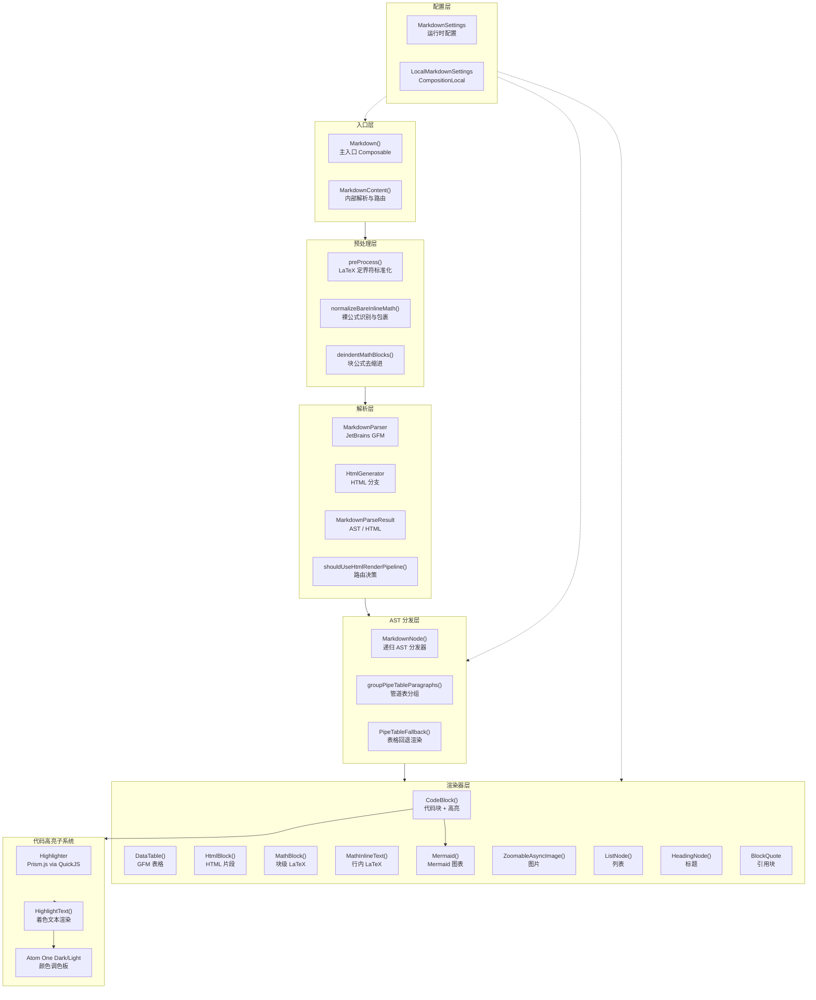
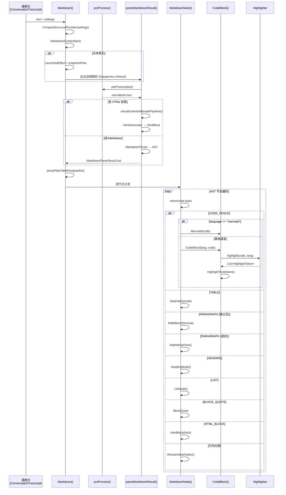
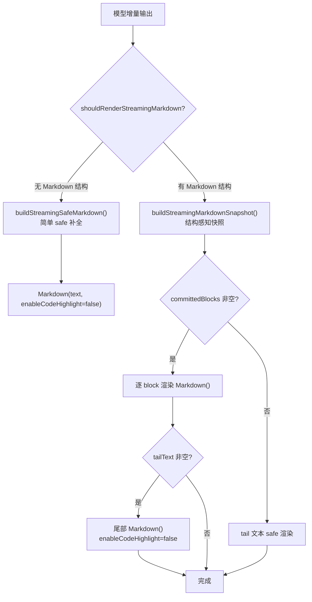

# Markdown 组件体系

Aries AI 的 Markdown 渲染组件体系，用于将 AI 模型的 Markdown 格式响应实时渲染为 Compose UI，涵盖 AST 解析、代码高亮、LaTeX 数学公式、Mermaid 图表、HTML 片段、GFM 表格和图片等多种 Markdown 扩展特性。

## 概述

Markdown 组件体系是 Aries AI 对话界面的核心渲染引擎，位于 `ui.components.markdown` 包下。该体系设计要点：

- **自研渲染管线**：基于 JetBrains GFM（GitHub Flavored Markdown）解析器构建 AST，递归分发到专用 Composable 组件渲染，不再依赖外部 Markdown 渲染库（`multiplatform-markdown-renderer` 处于过渡期保留状态）
- **流式友好**：支持流式场景下的增量渲染、未闭合结构的临时补全、节流快照和异步高亮禁用，避免流式输出阶段的布局抖动
- **多格式扩展**：内置代码语法高亮（Prism.js via QuickJS）、LaTeX 数学公式渲染（JLatexMath-Android）、Mermaid 图表（WebView + CDN）、HTML 片段和 GFM 表格
- **主题自适应**：所有组件响应 Material 3 主题色系，支持亮色/暗色双模式

核心入口为 `Markdown()` Composable，通过 `CompositionLocalProvider(LocalMarkdownSettings)` 控制运行时行为。

## 架构



### 架构说明

**预处理层**：接收原始 Markdown 文本，在 GFM 解析前完成 LaTeX 定界符标准化（`\[...\]` → `$$...$$`、`\(...\)` → `$...$`）、裸数学公式识别包裹（如 `y = mx + b` → `$y = mx + b$`）、以及块公式去缩进（防止 4 空格缩进被误判为代码块）。

**解析层**：使用 JetBrains GFM 解析器将预处理后的文本解析为 AST。若文本包含特定 HTML 标签或属性（`details`、`table`、`style` 等），则走 HTML 生成分支——先解析为 AST 再通过 `HtmlGenerator` 生成 HTML，交给 `HtmlBlock` 渲染。

**AST 分发层**：`MarkdownNode()` 根据 AST 节点类型递归分发到对应的渲染器。特殊处理包括管道表分组（将连续管道符段落合并为表格）、LaTeX 文档检测（完整 `\begin{document}` 文档提取数学环境）、以及块公式/行内公式的混合内容处理。

**渲染器层**：每个 Markdown 元素有专用 Composable，彼此独立、可组合。代码块进一步委托给高亮子系统和 Mermaid 图表渲染。

## 核心渲染流程



## MarkdownSettings 配置

`MarkdownSettings` 通过 Compose `CompositionLocal` 向整个子树传递，控制渲染器的运行时行为：

> Source: [Markdown.kt](https://github.com/ZG0704666/Aries-AI/blob/main/app/src/main/java/com/ai/phoneagent/ui/components/markdown/Markdown.kt#L80-L93)

```kotlin
@Immutable
data class MarkdownSettings(
    /** 自动换行长代码行 */
    val autoWrap: Boolean     = true,
    /** 代码块显示行号 */
    val lineNumbers: Boolean  = true,
    /** 自动折叠超过 10 行的代码块 */
    val autoCollapse: Boolean = false,
    /** 语法高亮（流式阶段禁用避免布局抖动） */
    val enableCodeHighlight: Boolean = true,
    /** 使用 JLatexMath 渲染 LaTeX 公式（关闭时回退到等宽文本） */
    val enableLatex: Boolean  = true,
)

val LocalMarkdownSettings = compositionLocalOf { MarkdownSettings() }
```

### 流式与最终消息的配置差异

在 `ConversationTranscript.kt` 中，流式消息和最终消息使用不同的配置策略：

> Source: [ConversationTranscript.kt](https://github.com/ZG0704666/Aries-AI/blob/main/app/src/main/java/com/ai/phoneagent/ui/messages/ConversationTranscript.kt#L1032-L1038)

```kotlin
// 流式阶段：禁用代码高亮，减少异步重算导致的布局抖动
Markdown(
    text = buildStreamingSafeMarkdown(body),
    settings = LocalMarkdownSettings.current.copy(enableCodeHighlight = false),
)
```

> Source: [ConversationTranscript.kt](https://github.com/ZG0704666/Aries-AI/blob/main/app/src/main/java/com/ai/phoneagent/ui/messages/ConversationTranscript.kt#L1061-L1064)

```kotlin
// 最终消息：使用完整默认配置，启用高亮、行号、换行等全部工具栏
Markdown(
    text = body,
    modifier = Modifier.fillMaxWidth(),
)
```

## 预处理管线

`preProcess()` 是渲染管道的第一步，在 GFM 解析前完成文本标准化：

> Source: [Markdown.kt](https://github.com/ZG0704666/Aries-AI/blob/main/app/src/main/java/com/ai/phoneagent/ui/components/markdown/Markdown.kt#L146-L199)

```kotlin
fun preProcess(text: String): String {
    val codeRanges = buildList {
        addAll(FENCED_CODE_RE.findAll(text).map { it.range })
        addAll(INLINE_CODE_RE.findAll(text).map { it.range })
    }.sortedBy { it.first }

    fun inCodeRange(index: Int): Boolean { /* ... */ }

    val sb = StringBuilder(text.length)
    var i  = 0
    while (i < text.length) {
        if (inCodeRange(i)) { sb.append(text[i++]); continue }
        // \$...\$ → $...$ (转义美元符 → 行内公式)
        if (text.startsWith("\\$", i)) { /* 检测 LaTeX 内容后转换 */ }
        // \[...\] → $$...$$
        if (text.startsWith("\\[", i)) { /* 转换并跳过 */ }
        // \(...\) → $...$
        if (text.startsWith("\\(", i)) { /* 转换并跳过 */ }
        sb.append(text[i++])
    }
    return normalizeBareInlineMath(deindentMathBlocks(sb.toString()))
}
```

预处理步骤依次为：

1. **定位代码范围**：识别围栏代码块（` ``` `）和行内代码（`` ` ``），后续步骤跳过这些区域
2. **转义美元符转换**：`\$...\$` → `$...$`（仅当内容看起来像 LaTeX 公式时）
3. **方括号定界符转换**：`\[...\]` → `$$...$$`、`\(...\)` → `$...$`
4. **裸数学公式识别**：检测 `y = mx + b` 等未包裹的表达式并自动添加 `$...$`
5. **块公式去缩进**：防止缩进的 `$$` 块被 GFM 解析为 4 空格代码块

## 组件详解

### Markdown — 主入口

> Source: [Markdown.kt](https://github.com/ZG0704666/Aries-AI/blob/main/app/src/main/java/com/ai/phoneagent/ui/components/markdown/Markdown.kt#L324-L332)

```kotlin
@Composable
fun Markdown(
    text: String,
    modifier: Modifier = Modifier,
    settings: MarkdownSettings = LocalMarkdownSettings.current,
) {
    CompositionLocalProvider(LocalMarkdownSettings provides settings) {
        MarkdownContent(text = text, modifier = modifier)
    }
}
```

内部通过 `snapshotFlow` + `mapLatest` 在 `Dispatchers.Default` 上异步解析，解析期间显示原文作为 fallback。结果分两路：AST 路径（标准 Markdown 元素分发）和 HTML 路径（含特定 HTML 标签时走 HtmlGenerator）。

### MarkdownNode — AST 递归分发器

> Source: [Markdown.kt](https://github.com/ZG0704666/Aries-AI/blob/main/app/src/main/java/com/ai/phoneagent/ui/components/markdown/Markdown.kt#L558-L736)

`MarkdownNode()` 是核心分发器，根据节点类型路由到对应渲染器：

| AST 类型 | 渲染目标 | 说明 |
|----------|----------|------|
| `MARKDOWN_FILE` | 递归子节点 | 文档根节点 |
| `PARAGRAPH` | MathBlock / ParagraphNode / MathMixedText | 根据内容判断纯公式/混合/普通段落 |
| `ATX_1` ~ `ATX_6`, `SETEXT_1~2` | HeadingNode | 六级标题映射到 Material 3 排版 |
| `CODE_FENCE` | CodeBlock / MathBlock / LatexDocBlock | 含 Mermaid 短路、LaTeX 检测 |
| `CODE_BLOCK` | CodeBlock | 4 空格缩进代码块 |
| `HTML_BLOCK` | HtmlBlock | 原始 HTML 块 |
| `TABLE` (GFM) | DataTable | GFM 表解析 |
| `UNORDERED_LIST` / `ORDERED_LIST` | ListNode | 有序/无序列表 |
| `BLOCK_QUOTE` | 引用块 | 左侧色条 + 缩进 |
| `HORIZONTAL_RULE` | HorizontalDivider | 水平分割线 |
| 行内元素 | RenderInlineNodes | 粗体/斜体/删除线/行内代码/链接/图片 |

### CodeBlock — 代码块组件

> Source: [CodeBlock.kt](https://github.com/ZG0704666/Aries-AI/blob/main/app/src/main/java/com/ai/phoneagent/ui/components/markdown/CodeBlock.kt#L77-L242)

代码块渲染是整个体系中最复杂的组件之一，功能包括：

- **Mermaid 短路**：当语言标记为 `mermaid` 时直接委托给 `Mermaid()` 
- **异步语法高亮**：通过 `Highlighter.highlight()` 调用 Prism.js via QuickJS
- **工具栏**：语言标签、行号切换、软换行切换、保存到下载、一键复制
- **折叠/展开**：超过 10 行的代码块自动折叠（由 `autoCollapse` 设置控制）
- **HTML/SVG 预览**：HTML、SVG、XML 语言提供 WebView 预览对话框

```kotlin
// 高亮仅在 enableCodeHighlight=true 时执行
LaunchedEffect(code, language, settings.enableCodeHighlight) {
    tokens = if (settings.enableCodeHighlight) {
        Highlighter.highlight(code, language)
    } else {
        listOf(HighlightToken.Plain(code))
    }
}
```

### Highlighter — 代码高亮引擎

> Source: [Highlighter.kt](https://github.com/ZG0704666/Aries-AI/blob/main/app/src/main/java/com/ai/phoneagent/ui/components/markdown/Highlighter.kt#L38-L107)

基于 QuickJS 嵌入式 JS 引擎运行 Prism.js（全语言包），协程安全的单例设计：

- **初始化**：`Highlighter.init(context)` 在 Application 启动时调用一次，加载 `assets/highlight/prism.js`
- **异步高亮**：`Highlighter.highlight(code, lang)` 是 suspend 函数，在 QuickJS 中执行 `Prism.tokenize()`
- **退避策略**：QuickJS 不可用时返回 `HighlightToken.Plain(code)` 纯文本
- **互斥锁**：`Mutex` 确保 QuickJS evaluate 调用串行化

### Mermaid — 图表渲染

> Source: [Mermaid.kt](https://github.com/ZG0704666/Aries-AI/blob/main/app/src/main/java/com/ai/phoneagent/ui/components/markdown/Mermaid.kt#L75-L168)

利用 WebView 加载 CDN 上的 Mermaid.js 11，通过 `JavascriptInterface` 回调与 Compose 通信：

- **高度自适应**：WebView 渲染完成后通过 `AndroidInterface.updateHeight(px)` 回传高度
- **高度缓存**：`mermaidHeightCache` HashMap 缓存每个图的高度，避免 WebView 重用时跳变
- **SVG 导出**：通过 `AndroidInterface.exportImage(svgData)` 获取渲染后的 SVG，支持保存到 Downloads
- **预览底部面板**：`ModalBottomSheet` 提供全宽预览
- **主题变量注入**：从 Material 3 ColorScheme 动态提取颜色注入 Mermaid 主题变量

### MathRenderers — LaTeX 数学渲染

> Source: [MathRenderers.kt](https://github.com/ZG0704666/Aries-AI/blob/main/app/src/main/java/com/ai/phoneagent/ui/components/markdown/MathRenderers.kt)

基于 JLatexMath-Android 的公式渲染系统，支持块级和行内两种模式：

- **`MathBlock`**：居中展示的块级公式，带水平滚动，后台渲染为 Bitmap
- **`MathInlineText`**：行内公式，通过 `InlineTextContent` 将 Bitmap 嵌入文本流
- **`processLatex()`**：多步骤公式预处理：剥离定界符 → 提取文档体 → 移除文档级命令 → 提取数学环境
- **LRU 缓存**：`latexBitmapCache`（96 条目）缓存渲染后的 Bitmap，避免重复渲染
- **尺寸预估**：`assumeLatexSize()` 在 Bitmap 准备好前提供占位尺寸

### 其他组件

| 组件 | 文件 | 职责 |
|------|------|------|
| `DataTable` | DataTable.kt | 解析 GFM TABLE AST 节点，渲染为 Material 3 风格表格（表头高亮、斑马条纹） |
| `HtmlBlock` | HtmlBlock.kt | 使用 Jsoup 解析 HTML 片段，支持丰富的块级和行内标签子集 |
| `HighlightText` | HighlightText.kt | 将 `List<HighlightToken>` 渲染为着色文本，支持行号和软换行 |
| `ZoomableAsyncImage` | MarkdownImage.kt | 基于 Coil 3 的异步图片加载，支持 Shimmer 占位、手势缩放、全屏预览 |
| `MarkdownSettings` | Markdown.kt | 不可变配置数据类，通过 CompositionLocal 传递 |

## 流式 Markdown 渲染

流式输出场景下，Markdown 组件体系面临特殊挑战——文本是增量到达的，可能在任意位置截断（未闭合的代码块、加粗、链接等）。

### 流式渲染策略



### 结构检测

> Source: [ConversationTranscript.kt](https://github.com/ZG0704666/Aries-AI/blob/main/app/src/main/java/com/ai/phoneagent/ui/messages/ConversationTranscript.kt#L1110-L1131)

```kotlin
private fun shouldRenderStreamingMarkdown(text: String): Boolean {
    if (text.length < 2) return false
    return text.contains("```") ||       // 代码块
        text.contains("$$") ||           // 块公式
        text.contains("\\(") ||          // 行内公式
        text.contains("\\[") ||          // 块公式
        text.contains("\\begin{") ||     // LaTeX 环境
        text.contains("**") ||           // 粗体
        text.startsWith("# ") ||         // 标题
        text.startsWith("- ") ||         // 无序列表
        text.startsWith("> ") ||         // 引用
        text.contains("](") ||           // 链接
        text.contains("|") ||            // 表格
        STREAMING_MARKDOWN_ORDERED_LIST_RE.containsMatchIn(text)  // 有序列表
}
```

### 流式安全补全

`buildStreamingSafeMarkdown()` 对未闭合结构做临时补全，确保 Markdown 解析器不会崩溃：

> Source: [ConversationTranscript.kt](https://github.com/ZG0704666/Aries-AI/blob/main/app/src/main/java/com/ai/phoneagent/ui/messages/ConversationTranscript.kt#L104-L108)

```kotlin
private const val STREAMING_MARKDOWN_RENDER_INTERVAL_MS = 80L   // 渲染节流间隔
private const val STREAMING_MARKDOWN_MIN_CHUNK_DELTA = 12       // 最小推进增量
private const val STREAMING_PENDING_INLINE_TAIL_LIMIT = 32      // 行内尾部暂扣上限
```

关键策略：
- **代码块临时闭合**：未闭合的 fence 临时补全，使流式阶段也保持代码块形态
- **行内样式暂扣**：未闭合的 `**bold**`、`*italic*`、`` `code` `` 和 `[text](url)` 尾部先不展示
- **节流控制**：80ms 间隔 sample + 最小 12 字符增量，避免逐 token 重组

## 依赖库

| 库 | 版本 | 用途 |
|----|------|------|
| `org.jetbrains:markdown` | 0.7.3 | GFM Markdown AST 解析器 |
| `com.mikepenz:multiplatform-markdown-renderer-m3` | 0.27.0 | Compose Markdown 渲染（过渡期保留） |
| `io.github.dokar3:quickjs-kt` | 1.0.5 | 嵌入式 JS 引擎，运行 Prism.js |
| `ru.noties:jlatexmath-android` | 0.2.0 | LaTeX 公式渲染 |
| `org.jsoup:jsoup` | 1.19.1 | HTML 片段解析 |
| Prism.js | 1.30.0 | 代码语法高亮（assets 内嵌） |
| Mermaid.js | 11 | 图表渲染（CDN 加载） |

> Source: [libs.versions.toml](https://github.com/ZG0704666/Aries-AI/blob/main/gradle/libs.versions.toml#L20-L24)

## 使用示例

### 基本用法

在 Compose 中渲染 Markdown 文本：

```kotlin
Markdown(
    text = "# 标题\n\n这是一段**粗体**和*斜体*的文字。\n\n- 列表项 A\n- 列表项 B",
    modifier = Modifier.fillMaxWidth(),
)
```
> Source: [ConversationTranscript.kt](https://github.com/ZG0704666/Aries-AI/blob/main/app/src/main/java/com/ai/phoneagent/ui/messages/ConversationTranscript.kt#L1061-L1064)

### 流式消息渲染

流式输出时传入 `enableCodeHighlight = false`：

```kotlin
CompositionLocalProvider(
    LocalMarkdownSettings provides MarkdownSettings(
        autoWrap = codeBlockPrefs.autoWrap,
        lineNumbers = codeBlockPrefs.lineNumbers,
        enableCodeHighlight = false,  // 流式阶段禁高亮
    )
) {
    Markdown(
        text = buildStreamingSafeMarkdown(body),
        modifier = Modifier.fillMaxWidth().padding(horizontal = spacingMd, vertical = spacingMd),
    )
}
```
> Source: [ConversationTranscript.kt](https://github.com/ZG0704666/Aries-AI/blob/main/app/src/main/java/com/ai/phoneagent/ui/messages/ConversationTranscript.kt#L372-L377)

### 最终消息渲染

流式结束后启用完整高亮和工具栏：

```kotlin
@Composable
private fun AssistantMessageFinalBody(body: String, spacingMd: Dp, spacingXs: Dp) {
    Box(
        modifier = Modifier.fillMaxWidth().padding(horizontal = spacingMd, vertical = spacingXs),
    ) {
        Markdown(
            text = body,
            modifier = Modifier.fillMaxWidth(),
        )
    }
}
```
> Source: [ConversationTranscript.kt](https://github.com/ZG0704666/Aries-AI/blob/main/app/src/main/java/com/ai/phoneagent/ui/messages/ConversationTranscript.kt#L1050-L1065)

### 初始化 Highlighter

在 `Application.onCreate()` 中初始化：

```kotlin
// 在 Application 中调用一次
Highlighter.init(context)
```

然后在协程中异步高亮：

```kotlin
val tokens = Highlighter.highlight(code, "kotlin")
// tokens 为 List<HighlightToken>，可直接传给 HighlightText()
```
> Source: [Highlighter.kt](https://github.com/ZG0704666/Aries-AI/blob/main/app/src/main/java/com/ai/phoneagent/ui/components/markdown/Highlighter.kt#L55-L71)

## 相关链接

- [ConversationTranscript — 对话消息渲染（集成 Markdown）](https://github.com/ZG0704666/Aries-AI/blob/main/app/src/main/java/com/ai/phoneagent/ui/messages/ConversationTranscript.kt)
- [Markdown 主入口源码](https://github.com/ZG0704666/Aries-AI/blob/main/app/src/main/java/com/ai/phoneagent/ui/components/markdown/Markdown.kt)
- [CodeBlock 代码块组件](https://github.com/ZG0704666/Aries-AI/blob/main/app/src/main/java/com/ai/phoneagent/ui/components/markdown/CodeBlock.kt)
- [Highlighter 代码高亮引擎](https://github.com/ZG0704666/Aries-AI/blob/main/app/src/main/java/com/ai/phoneagent/ui/components/markdown/Highlighter.kt)
- [Mermaid 图表渲染](https://github.com/ZG0704666/Aries-AI/blob/main/app/src/main/java/com/ai/phoneagent/ui/components/markdown/Mermaid.kt)
- [MathRenderers LaTeX 渲染](https://github.com/ZG0704666/Aries-AI/blob/main/app/src/main/java/com/ai/phoneagent/ui/components/markdown/MathRenderers.kt)
- [HtmlBlock HTML 片段渲染](https://github.com/ZG0704666/Aries-AI/blob/main/app/src/main/java/com/ai/phoneagent/ui/components/markdown/HtmlBlock.kt)
- [MarkdownImage 图片组件](https://github.com/ZG0704666/Aries-AI/blob/main/app/src/main/java/com/ai/phoneagent/ui/components/markdown/MarkdownImage.kt)
- [HighlightText 语法着色](https://github.com/ZG0704666/Aries-AI/blob/main/app/src/main/java/com/ai/phoneagent/ui/components/markdown/HighlightText.kt)
- [DataTable GFM 表格](https://github.com/ZG0704666/Aries-AI/blob/main/app/src/main/java/com/ai/phoneagent/ui/components/markdown/DataTable.kt)
- [版本目录（依赖声明）](https://github.com/ZG0704666/Aries-AI/blob/main/gradle/libs.versions.toml)
- [编码规范 — Compose 与 Markdown 渲染规范](https://github.com/ZG0704666/Aries-AI/blob/main/docs/CODING_STANDARDS.md#六compose-与-markdown-渲染规范)
- [技术概览 — 流式 Markdown 渲染](https://github.com/ZG0704666/Aries-AI/blob/main/docs/TECHNICAL_OVERVIEW.md#72-流式-markdown-渲染)
- [流式预览测试](https://github.com/ZG0704666/Aries-AI/blob/main/app/src/test/java/com/ai/phoneagent/ui/messages/StreamingTranscriptPreviewTest.kt)
