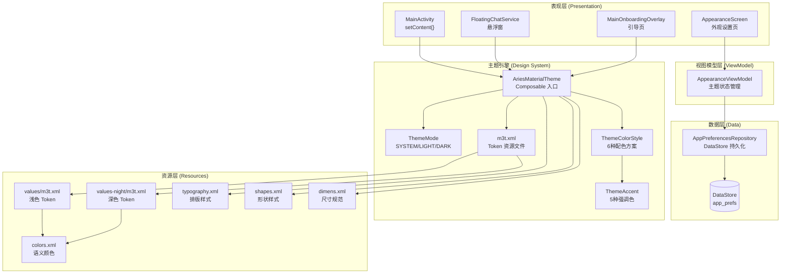
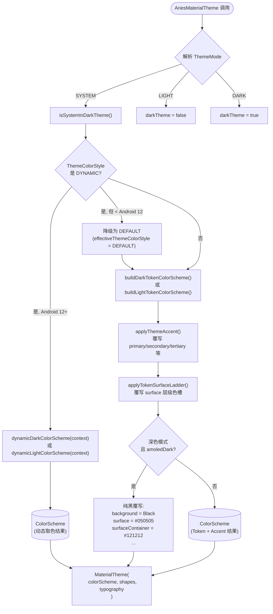
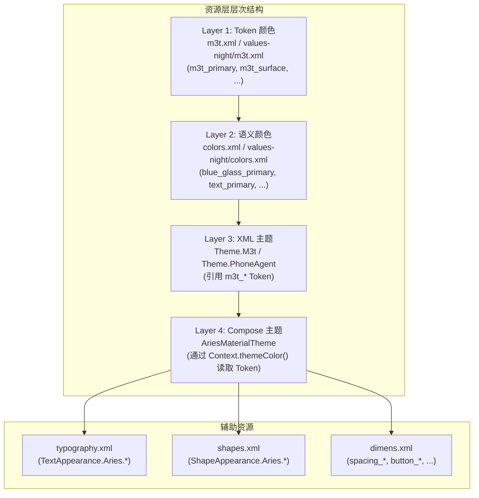
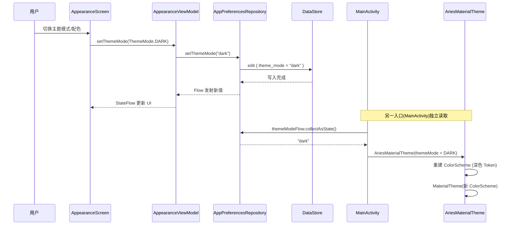

# Material 3 主题系统

Aries AI 基于 Material 3 (Material You) 规范构建了一套完整的主题系统，支持明暗模式切换、多套配色方案、AMOLED 纯黑模式、动态取色（Android 12+）以及自定义字体缩放/字体家族。主题系统采用 **单一数据源** 架构，所有的颜色、形状、排版均通过集中式 Token 资源 + Compose `AriesMaterialTheme` 可组合函数统一注入。

## 概述

### 设计目标

Aries 主题系统围绕以下核心原则设计：

1. **集中化管理** — 所有颜色、尺寸、排版、形状、组件样式通过 `m3t.xml` Token 资源文件统一定义，禁止在布局或代码中硬编码 UI 样式
2. **Material 3 原生集成** — 完全兼容 `androidx.compose.material3`，利用 `ColorScheme`、`Shapes`、`Typography` 等标准类型
3. **多维度可定制** — 支持主题模式（跟随系统/浅色/深色）、配色方案（6 种预设 + 动态取色）、AMOLED 纯黑、字体缩放等多层定制
4. **Compose 优先** — 通过 `AriesMaterialTheme` 可组合函数包裹整个 UI 树，自动向下传递主题 Token
5. **向后兼容** — 同时提供 XML View 系统的 `Theme.M3t` 主题样式家族

### 关键概念

| 概念 | 说明 |
|------|------|
| **M3T Token** | 从 `m3t.xml` 资源文件中读取的 Material 3 设计 Token，是颜色、尺寸等所有样式的唯一来源 |
| **ThemeMode** | 控制浅色/深色模式的选择策略，可选 `SYSTEM`（跟随系统）、`LIGHT`（始终浅色）、`DARK`（始终深色） |
| **ThemeColorStyle** | 配色方案枚举，包含 `DEFAULT`、`OCEAN`、`FOREST`、`SUNSET`、`ROSE` 五种预设和 `DYNAMIC`（Android 12+ 动态取色） |
| **ThemeAccent** | 强调色枚举，作为 `ThemeColorStyle` 的构建块，每个方案对应一组 light/dark 双色调色板 |
| **AMOLED Dark** | 深色模式下启用纯黑背景（`#000000`），专为 AMOLED 屏幕优化，可显著节省电量 |
| **Surface Ladder** | Material 3 定义的表面层级体系（`surfaceDim` → `surfaceBright` → `surfaceContainerLowest` …） |

---

## 架构

### 系统架构图



### 架构说明

主题系统的核心入口是 `AriesMaterialTheme` 可组合函数。当 `MainActivity` 或 `FloatingChatService` 调用 `setContent {}` 时，首先读取 `AppPreferencesRepository` 中持久化的主题偏好，然后将这些偏好转换为 `ThemeMode`、`ThemeColorStyle` 等枚举，传递给 `AriesMaterialTheme`。

`AriesMaterialTheme` 内部执行一条**优先级链**来决定最终的 `ColorScheme`：

1. **ThemeMode 解析** → 确定当前是浅色还是深色模式
2. **动态取色判断** → 如果 `ThemeColorStyle.DYNAMIC` 且 Android 12+，使用系统壁纸取色
3. **Token 基础配色** → 从 `m3t.xml` 读取浅色/深色 Token 构建基础 `ColorScheme`
4. **强调色覆写** → 如果非动态方案，用对应 `ThemeAccent` 的调色板覆写 primary/secondary/tertiary 角色
5. **Surface Ladder 覆写** → 用 Token 中的 surface 层级值覆写容器颜色
6. **AMOLED 覆写** → 如果深色模式 + AMOLED 开启，将所有背景色替换为纯黑阶梯

最后将最终的 `ColorScheme`、`Shapes`、`Typography` 注入 `MaterialTheme`，完成整个主题环境的搭建。

---

## 核心组件详解

### 1. AriesMaterialTheme — 主题入口

`AriesMaterialTheme` 是整个 Compose UI 树的主题根节点。所有依赖 Material 3 主题的 Composable 都必须在其作用域内渲染。

```kotlin
@Composable
fun AriesMaterialTheme(
    themeMode: ThemeMode = ThemeMode.SYSTEM,
    themeColorStyle: ThemeColorStyle = ThemeColorStyle.DEFAULT,
    amoledDark: Boolean = false,
    fontScale: Float = 1.0f,
    fontFamily: FontFamily = FontFamily.Default,
    content: @Composable () -> Unit,
)
```
> Source: [AriesMaterialTheme.kt](https://github.com/ZG0704666/Aries-AI/blob/main/core/designsystem/src/main/java/com/ai/phoneagent/core/designsystem/theme/AriesMaterialTheme.kt#L54-L62)

**参数说明：**

| 参数 | 类型 | 默认值 | 说明 |
|------|------|--------|------|
| `themeMode` | `ThemeMode` | `ThemeMode.SYSTEM` | 浅色/深色模式策略 |
| `themeColorStyle` | `ThemeColorStyle` | `ThemeColorStyle.DEFAULT` | 配色方案，决定主色、辅色、第三色 |
| `amoledDark` | `Boolean` | `false` | 深色模式下是否使用纯黑 AMOLED 背景 |
| `fontScale` | `Float` | `1.0f` | 字体缩放倍率，作用于所有 M3 排版级别 |
| `fontFamily` | `FontFamily` | `FontFamily.Default` | 全局字体家族 |
| `content` | `@Composable () -> Unit` | — | 主题作用域内的 Composable 内容 |

**优先级链：AMOLED > 配色方案 > Surface Ladder**

这一设计确保 AMOLED 纯黑具有最高优先级——一旦开启，所有 surface/background 颜色都会被纯黑阶梯覆写，无论当前使用的是哪种配色方案。

### 2. ThemeMode — 主题模式

```kotlin
enum class ThemeMode {
    SYSTEM,  // 跟随系统深色模式设置
    LIGHT,   // 始终浅色
    DARK,    // 始终深色
}
```
> Source: [ThemeMode.kt](https://github.com/ZG0704666/Aries-AI/blob/main/core/designsystem/src/main/java/com/ai/phoneagent/core/designsystem/theme/ThemeMode.kt#L24-L31)

`ThemeMode.SYSTEM` 通过 `isSystemInDarkTheme()` 读取系统设置，`LIGHT`/`DARK` 则强制覆盖。

### 3. ThemeColorStyle & ThemeAccent — 配色方案

`ThemeColorStyle` 是配色方案的顶层枚举，每个方案关联一个 `ThemeAccent`：

```kotlin
enum class ThemeColorStyle(val storageKey: String, val accent: ThemeAccent?) {
    DEFAULT("default", ThemeAccent.DEFAULT),
    OCEAN("ocean", ThemeAccent.OCEAN),
    FOREST("forest", ThemeAccent.FOREST),
    SUNSET("sunset", ThemeAccent.SUNSET),
    ROSE("rose", ThemeAccent.ROSE),
    DYNAMIC("dynamic", null),  // 无固定 Accent，使用系统壁纸取色
}
```
> Source: [ThemeColorStyle.kt](https://github.com/ZG0704666/Aries-AI/blob/main/core/designsystem/src/main/java/com/ai/phoneagent/core/designsystem/theme/ThemeColorStyle.kt#L5-L15)

每种强调色都定义了一组完整的 **浅色/深色双色调色板** (`ThemeAccentPalette`)，包含 `primary`、`onPrimary`、`primaryContainer`、`onPrimaryContainer`、`secondary`、`tertiary` 等 13 个色槽：

```kotlin
// 以 Ocean 浅色调色板为例
private val oceanLightPalette = ThemeAccentPalette(
    primary = Color(0xFF006495),
    onPrimary = Color(0xFFFFFFFF),
    primaryContainer = Color(0xFFCDE5FF),
    onPrimaryContainer = Color(0xFF001D31),
    inversePrimary = Color(0xFF8CCFFF),
    secondary = Color(0xFF50606F),
    // ...
)
```
> Source: [ThemeAccent.kt](https://github.com/ZG0704666/Aries-AI/blob/main/core/designsystem/src/main/java/com/ai/phoneagent/core/designsystem/theme/ThemeAccent.kt#L99-L114)

**设计意图：** 每种配色方案都定义了浅色和深色两套完整的调色板，确保无论在哪种模式下都有协调的视觉效果。`DEFAULT` 方案的 `palette()` 返回 `null`，表示直接使用 Token 文件中定义的原始颜色（即 `m3t.xml` 中的蓝色系主色）。

### 4. 颜色方案构建流程



**关键实现：Token 颜色方案构建**

`buildDarkTokenColorScheme` 和 `buildLightTokenColorScheme` 分别从浅色/深色 `m3t.xml` 中读取 Token 颜色。这里使用了一个精巧的技巧——通过 `createConfigurationContext` 根据当前 `darkTheme` 状态创建一个带夜间模式标记的 `Context`，这样 `ContextCompat.getColor()` 能自动解析到正确的 `values-night/m3t.xml` 或 `values/m3t.xml`：

```kotlin
val themeResourceContext = remember(context, configuration, darkTheme) {
    val themedConfiguration = Configuration(configuration).apply {
        val nightMode = if (darkTheme) Configuration.UI_MODE_NIGHT_YES 
                        else Configuration.UI_MODE_NIGHT_NO
        uiMode = (uiMode and Configuration.UI_MODE_NIGHT_MASK.inv()) or nightMode
    }
    context.createConfigurationContext(themedConfiguration)
}
```
> Source: [AriesMaterialTheme.kt](https://github.com/ZG0704666/Aries-AI/blob/main/core/designsystem/src/main/java/com/ai/phoneagent/core/designsystem/theme/AriesMaterialTheme.kt#L72-L78)

### 5. Shapes 形状系统

Compose 的 `Shapes` 通过 `m3t_radius_*` Token 尺寸构建，与 XML 形状资源保持一致：

```kotlin
val shapes = Shapes(
    extraSmall = RoundedCornerShape(dimensionResource(R.dimen.m3t_radius_sm)),  // 12dp
    small      = RoundedCornerShape(dimensionResource(R.dimen.m3t_radius_sm)),  // 12dp
    medium     = RoundedCornerShape(dimensionResource(R.dimen.m3t_radius_md)),  // 16dp
    large      = RoundedCornerShape(dimensionResource(R.dimen.m3t_radius_lg)),  // 24dp
    extraLarge = RoundedCornerShape(dimensionResource(R.dimen.m3t_radius_xl)),  // 32dp
)
```
> Source: [AriesMaterialTheme.kt](https://github.com/ZG0704666/Aries-AI/blob/main/core/designsystem/src/main/java/com/ai/phoneagent/core/designsystem/theme/AriesMaterialTheme.kt#L129-L136)

### 6. Typography 排版系统

所有 Material 3 的 15 个排版级别均支持 `fontScale` 缩放和 `fontFamily` 自定义：

```kotlin
val baseTypography = Typography()
val typography: Typography = Typography(
    displayLarge  = baseTypography.displayLarge.scaledBy(fontScale).withFontFamily(fontFamily),
    displayMedium = baseTypography.displayMedium.scaledBy(fontScale).withFontFamily(fontFamily),
    // ... 共 15 个级别
    labelSmall    = baseTypography.labelSmall.scaledBy(fontScale).withFontFamily(fontFamily),
)
```
> Source: [AriesMaterialTheme.kt](https://github.com/ZG0704666/Aries-AI/blob/main/core/designsystem/src/main/java/com/ai/phoneagent/core/designsystem/theme/AriesMaterialTheme.kt#L139-L157)

---

## 资源层架构

### Token 资源文件体系

整个主题的资源层分为以下层次：



### Light/Dark 颜色 Token 对照

| Token 名称 | 浅色值 | 深色值 | 用途 |
|-----------|--------|--------|------|
| `m3t_primary` | `#005AC1` | `#A9C7FF` | 主色 |
| `m3t_on_primary` | `#FFFFFF` | `#003061` | 主色上的内容色 |
| `m3t_primary_container` | `#D7E5FF` | `#134782` | 主色容器 |
| `m3t_background` | `#F5FAFF` | `#0F141B` | 页面背景 |
| `m3t_surface` | `#FFFFFF` | `#121A24` | 表面/卡片背景 |
| `m3t_surface_container` | `#E8F1FF` | `#18222E` | 表面容器 |
| `m3t_surface_container_high` | `#E2EEFF` | `#1F2A37` | 高层级表面 |

> Source (浅色): [m3t.xml](https://github.com/ZG0704666/Aries-AI/blob/main/core/designsystem/src/main/res/values/m3t.xml#L5-L35)
> Source (深色): [values-night/m3t.xml](https://github.com/ZG0704666/Aries-AI/blob/main/core/designsystem/src/main/res/values-night/m3t.xml#L5-L35)

### 语义颜色映射

`colors.xml` 定义语义颜色名称（如 `text_primary`、`button_primary`、`card_background`），在深色模式下通过 `values-night/colors.xml` 重新映射到深色 Token：

```xml
<!-- 浅色: values/colors.xml -->
<color name="text_primary">#1B2B3D</color>
<color name="surface">#FFFFFF</color>

<!-- 深色: values-night/colors.xml — 全部映射到 m3t_* Token -->
<color name="text_primary">@color/m3t_on_surface</color>      <!-- → #E1E7F1 -->
<color name="surface">@color/m3t_surface</color>               <!-- → #121A24 -->
```
> Source (深色): [values-night/colors.xml](https://github.com/ZG0704666/Aries-AI/blob/main/core/designsystem/src/main/res/values-night/colors.xml#L28-L41)

这种设计让 XML View 系统和 Compose 系统共享同一套颜色 Token，实现了 **View + Compose 混合架构下的主题一致性**。

---

## 数据流与状态管理

### 主题偏好持久化



### 关键数据流

所有主题偏好通过 `AppPreferencesRepository` 以 `Flow` 形式暴露，消费方通过 `collectAsState()` 实现响应式订阅：

**MainActivity 中的主题消费：**
```kotlin
setContent {
    val themeModeStr by appPrefsRepository.themeModeFlow.collectAsState(initial = "system")
    val themeColorStyleRaw by appPrefsRepository.themeColorStyleFlow.collectAsState(initial = ThemeColorStyle.DEFAULT.storageKey)
    val amoledDark by appPrefsRepository.amoledDarkEnabledFlow.collectAsState(initial = false)
    val fontScale by appPrefsRepository.chatFontScaleFlow.collectAsState(initial = 1.0f)

    val themeMode = when (themeModeStr.lowercase()) {
        "light" -> ThemeMode.LIGHT
        "dark"  -> ThemeMode.DARK
        else    -> ThemeMode.SYSTEM
    }

    AriesMaterialTheme(
        themeMode = themeMode,
        themeColorStyle = ThemeColorStyle.fromStorage(themeColorStyleRaw),
        amoledDark = amoledDark,
        fontScale = fontScale,
        fontFamily = resolvedFontFamily,
    ) {
        // UI 内容
    }
}
```
> Source: [MainActivity.kt](https://github.com/ZG0704666/Aries-AI/blob/main/app/src/main/java/com/ai/phoneagent/MainActivity.kt#L685-L755)

---

## XML 主题系统（View 层兼容）

虽然 Compose 是主要的 UI 框架，Aries 仍然通过 `Theme.M3t` 系列为传统 XML View（如 Dialog、BottomSheet）提供完整支持：

```xml
<!-- 基础 M3 主题，继承 Material3 DayNight -->
<style name="Theme.M3t" parent="Theme.Material3.DayNight.NoActionBar">
    <item name="colorPrimary">@color/m3t_primary</item>
    <item name="colorSurface">@color/m3t_surface</item>
    <item name="android:colorBackground">@color/m3t_background</item>
    <!-- ... 完整的 Material 3 颜色属性映射 ... -->
    <item name="android:statusBarColor">@android:color/transparent</item>
    <item name="android:navigationBarColor">@android:color/transparent</item>
    <item name="android:windowLightStatusBar">@bool/m3t_light_system_bars</item>
</style>
```
> Source: [m3t.xml](https://github.com/ZG0704666/Aries-AI/blob/main/core/designsystem/src/main/res/values/m3t.xml#L427-L465)

主题继承链：

```
Theme.Material3.DayNight.NoActionBar  (Material 3 基础)
  └── Theme.M3t                       (Aries M3T Token 主题)
        ├── Theme.M3t.App             (带 windowBackground)
        │     └── Theme.PhoneAgent    (App 入口主题)
        ├── Theme.M3t.TransparentLaunch (透明启动页)
        ├── Theme.M3t.Dialog          (对话框覆盖)
        └── Theme.M3t.BottomSheet     (底部弹窗覆盖)
```
> Source: [themes.xml](https://github.com/ZG0704666/Aries-AI/blob/main/core/designsystem/src/main/res/values/themes.xml#L3-L12)

此外还提供了兼容性别名，方便渐进迁移：
```xml
<style name="Widget.Aries.Toolbar" parent="Widget.M3t.Toolbar" />
<style name="Widget.Aries.Card" parent="Widget.M3t.Card" />
<style name="Widget.Aries.Button" parent="Widget.M3t.Button.Filled" />
```
> Source: [m3t.xml](https://github.com/ZG0704666/Aries-AI/blob/main/core/designsystem/src/main/res/values/m3t.xml#L505-L511)

---

## 使用示例

### 基本用法 — 在 Activity 中包裹主题

```kotlin
// MainActivity.kt
setContent {
    AriesMaterialTheme(
        themeMode = ThemeMode.SYSTEM,
        themeColorStyle = ThemeColorStyle.DEFAULT,
    ) {
        // 所有子 Composable 自动获取 MaterialTheme.colorScheme / typography / shapes
        MyAppContent()
    }
}
```

### 高级用法 — 读取用户偏好并响应式应用

```kotlin
// 从 AppPreferencesRepository 读取持久化偏好
setContent {
    val themeModeStr by appPrefsRepository.themeModeFlow.collectAsState(initial = "system")
    val themeColorStyleRaw by appPrefsRepository.themeColorStyleFlow
        .collectAsState(initial = ThemeColorStyle.DEFAULT.storageKey)
    val amoledDark by appPrefsRepository.amoledDarkEnabledFlow.collectAsState(initial = false)
    val fontScale by appPrefsRepository.chatFontScaleFlow.collectAsState(initial = 1.0f)

    AriesMaterialTheme(
        themeMode = when (themeModeStr.lowercase()) {
            "light" -> ThemeMode.LIGHT
            "dark"  -> ThemeMode.DARK
            else    -> ThemeMode.SYSTEM
        },
        themeColorStyle = ThemeColorStyle.fromStorage(themeColorStyleRaw),
        amoledDark = amoledDark,
        fontScale = fontScale,
    ) {
        AriesNavGraph()
    }
}
```
> Source: [MainActivity.kt](https://github.com/ZG0704666/Aries-AI/blob/main/app/src/main/java/com/ai/phoneagent/MainActivity.kt#L686-L755)

### 在 Composable 中使用主题 Token

```kotlin
// AriesSettingsListItem — 始终通过 MaterialTheme 读取颜色
ListItem(
    colors = ListItemDefaults.colors(
        containerColor = MaterialTheme.colorScheme.background,
    ),
    headlineContent = {
        Text(
            text = headlineText,
            style = MaterialTheme.typography.bodyLarge,
            color = MaterialTheme.colorScheme.onSurface,
        )
    },
    // ...
)
```
> Source: [AriesSettingsListItem.kt](https://github.com/ZG0704666/Aries-AI/blob/main/core/designsystem/src/main/java/com/ai/phoneagent/core/designsystem/theme/AriesSettingsListItem.kt#L50-L63)

### 强制 AMOLED 纯黑深色模式

```kotlin
AriesMaterialTheme(
    themeMode = ThemeMode.DARK,
    themeColorStyle = ThemeColorStyle.OCEAN,
    amoledDark = true,  // 背景变为纯黑 #000000
) {
    // 此时 background = Color.Black,
    // surface = Color(0xFF050505),
    // surfaceContainer = Color(0xFF121212) ...
}
```
> Source: [AriesMaterialTheme.kt](https://github.com/ZG0704666/Aries-AI/blob/main/core/designsystem/src/main/java/com/ai/phoneagent/core/designsystem/theme/AriesMaterialTheme.kt#L112-L127)

---

## 配置选项

### AriesMaterialTheme 参数

| 参数 | 类型 | 默认值 | 说明 |
|------|------|--------|------|
| `themeMode` | `ThemeMode` | `SYSTEM` | `SYSTEM`：跟随系统 / `LIGHT`：浅色 / `DARK`：深色 |
| `themeColorStyle` | `ThemeColorStyle` | `DEFAULT` | 配色方案，见下方枚举表 |
| `amoledDark` | `Boolean` | `false` | 深色模式下使用纯黑背景（AMOLED 优化） |
| `fontScale` | `Float` | `1.0` | 全局字体缩放比例，作用于全部 15 个 M3 排版级别 |
| `fontFamily` | `FontFamily` | `FontFamily.Default` | 全局字体家族 |

### ThemeColorStyle 配色方案

| 方案 | storageKey | 说明 | 最低 API |
|------|-----------|------|----------|
| `DEFAULT` | `"default"` | 蓝色系默认方案（Token 原始色） | API 30+ |
| `OCEAN` | `"ocean"` | 海洋蓝配色 | API 30+ |
| `FOREST` | `"forest"` | 森林绿配色 | API 30+ |
| `SUNSET` | `"sunset"` | 日落橙配色 | API 30+ |
| `ROSE` | `"rose"` | 玫瑰粉配色 | API 30+ |
| `DYNAMIC` | `"dynamic"` | 跟随系统壁纸动态取色 | API 31+ (Android 12) |

> Source: [ThemeColorStyle.kt](https://github.com/ZG0704666/Aries-AI/blob/main/core/designsystem/src/main/java/com/ai/phoneagent/core/designsystem/theme/ThemeColorStyle.kt#L5-L15)

### DataStore 持久化键

| 键名 | 类型 | 默认值 | 说明 |
|------|------|--------|------|
| `theme_mode` | `String` | `"system"` | `"system"` / `"light"` / `"dark"` |
| `theme_color_style` | `String` | `"default"` | 配色方案 storageKey |
| `theme_accent` | `String` | `"default"` | 强调色 storageKey |
| `amoled_dark_enabled` | `Boolean` | `false` | 是否启用 AMOLED 纯黑 |
| `chat_font_scale` | `Float` | `1.0` | 聊天字体缩放 |
| `chat_font_family` | `String` | `"default"` | 聊天字体家族 |

> Source: [AppPreferencesRepository.kt](https://github.com/ZG0704666/Aries-AI/blob/main/app/src/main/java/com/ai/phoneagent/data/preferences/AppPreferencesRepository.kt#L50-L59)

---

## 设计 Token 参考

### 圆角尺寸

| Token | 值 | 用途 |
|-------|-----|------|
| `m3t_radius_sm` | 12dp | 小组件（输入框、紧凑按钮） |
| `m3t_radius_md` | 16dp | 中等组件（卡片） |
| `m3t_radius_lg` | 24dp | 大组件（对话框、主按钮） |
| `m3t_radius_xl` | 32dp | 超大组件（底部弹窗顶部圆角） |

> Source: [m3t.xml](https://github.com/ZG0704666/Aries-AI/blob/main/core/designsystem/src/main/res/values/m3t.xml#L132-L135)

### 间距系统

| Token | 值 |
|-------|-----|
| `m3t_spacing_xxxs` | 2dp |
| `m3t_spacing_xs` | 4dp |
| `m3t_spacing_sm` | 8dp |
| `m3t_spacing_md` | 12dp |
| `m3t_spacing_lg` | 16dp |
| `m3t_spacing_xl` | 20dp |
| `m3t_spacing_xxl` | 24dp |

> Source: [m3t.xml](https://github.com/ZG0704666/Aries-AI/blob/main/core/designsystem/src/main/res/values/m3t.xml#L111-L118)

---

## API 参考

### `AriesMaterialTheme`

```kotlin
@Composable
fun AriesMaterialTheme(
    themeMode: ThemeMode = ThemeMode.SYSTEM,
    themeColorStyle: ThemeColorStyle = ThemeColorStyle.DEFAULT,
    amoledDark: Boolean = false,
    fontScale: Float = 1.0f,
    fontFamily: FontFamily = FontFamily.Default,
    content: @Composable () -> Unit,
)
```

Compose 主题根节点。内部完成：解析明暗模式 → 构建 ColorScheme → 应用配色 Accent → 应用 Surface Ladder → 可选 AMOLED 覆写 → 注入 `MaterialTheme`。

> Source: [AriesMaterialTheme.kt](https://github.com/ZG0704666/Aries-AI/blob/main/core/designsystem/src/main/java/com/ai/phoneagent/core/designsystem/theme/AriesMaterialTheme.kt#L54-L62)

### `ThemeColorStyle.fromStorage`

```kotlin
companion object {
    fun fromStorage(value: String): ThemeColorStyle
}
```

将持久化的 `storageKey` 字符串解析为 `ThemeColorStyle` 枚举。未识别的值安全降级为 `DEFAULT`。

> Source: [ThemeColorStyle.kt](https://github.com/ZG0704666/Aries-AI/blob/main/core/designsystem/src/main/java/com/ai/phoneagent/core/designsystem/theme/ThemeColorStyle.kt#L23-L26)

### `ThemeAccent.fromStorage`

```kotlin
companion object {
    fun fromStorage(value: String): ThemeAccent
}
```

将持久化的 `storageKey` 解析为 `ThemeAccent` 枚举。未识别的值安全降级为 `DEFAULT`。

> Source: [ThemeAccent.kt](https://github.com/ZG0704666/Aries-AI/blob/main/core/designsystem/src/main/java/com/ai/phoneagent/core/designsystem/theme/ThemeAccent.kt#L19-L22)

### `ThemeColorStyle.previewColors`

```kotlin
@Composable
fun ThemeColorStyle.previewColors(isDarkTheme: Boolean): ThemeAccentPreview?
```

在设置界面中预览配色方案的颜色。`DYNAMIC` 方案返回 `null`（无法预览动态取色结果）。

> Source: [ThemeColorStyle.kt](https://github.com/ZG0704666/Aries-AI/blob/main/core/designsystem/src/main/java/com/ai/phoneagent/core/designsystem/theme/ThemeColorStyle.kt#L29-L31)

---

## 相关链接

### 核心源文件

| 文件 | 说明 |
|------|------|
| [AriesMaterialTheme.kt](https://github.com/ZG0704666/Aries-AI/blob/main/core/designsystem/src/main/java/com/ai/phoneagent/core/designsystem/theme/AriesMaterialTheme.kt) | Compose 主题入口，颜色方案构建核心 |
| [ThemeMode.kt](https://github.com/ZG0704666/Aries-AI/blob/main/core/designsystem/src/main/java/com/ai/phoneagent/core/designsystem/theme/ThemeMode.kt) | 主题模式枚举 |
| [ThemeColorStyle.kt](https://github.com/ZG0704666/Aries-AI/blob/main/core/designsystem/src/main/java/com/ai/phoneagent/core/designsystem/theme/ThemeColorStyle.kt) | 配色方案枚举 |
| [ThemeAccent.kt](https://github.com/ZG0704666/Aries-AI/blob/main/core/designsystem/src/main/java/com/ai/phoneagent/core/designsystem/theme/ThemeAccent.kt) | 强调色调色板定义 |
| [AriesSettingsListItem.kt](https://github.com/ZG0704666/Aries-AI/blob/main/core/designsystem/src/main/java/com/ai/phoneagent/core/designsystem/theme/AriesSettingsListItem.kt) | 主题驱动的设置列表组件 |

### 资源文件

| 文件 | 说明 |
|------|------|
| [values/m3t.xml](https://github.com/ZG0704666/Aries-AI/blob/main/core/designsystem/src/main/res/values/m3t.xml) | 浅色模式 Token、Widget 样式、Theme.M3t 定义 |
| [values-night/m3t.xml](https://github.com/ZG0704666/Aries-AI/blob/main/core/designsystem/src/main/res/values-night/m3t.xml) | 深色模式 Token |
| [values/colors.xml](https://github.com/ZG0704666/Aries-AI/blob/main/core/designsystem/src/main/res/values/colors.xml) | 语义颜色定义（浅色） |
| [values-night/colors.xml](https://github.com/ZG0704666/Aries-AI/blob/main/core/designsystem/src/main/res/values-night/colors.xml) | 语义颜色定义（深色，映射到 m3t_* Token） |
| [values/shapes.xml](https://github.com/ZG0704666/Aries-AI/blob/main/core/designsystem/src/main/res/values/shapes.xml) | 形状样式定义 |
| [values/typography.xml](https://github.com/ZG0704666/Aries-AI/blob/main/core/designsystem/src/main/res/values/typography.xml) | 排版样式定义 |
| [values/dimens.xml](https://github.com/ZG0704666/Aries-AI/blob/main/core/designsystem/src/main/res/values/dimens.xml) | 尺寸规范定义 |

### 消费方

| 文件 | 说明 |
|------|------|
| [MainActivity.kt](https://github.com/ZG0704666/Aries-AI/blob/main/app/src/main/java/com/ai/phoneagent/MainActivity.kt) | 主 Activity 主题消费入口 |
| [FloatingChatService.kt](https://github.com/ZG0704666/Aries-AI/blob/main/app/src/main/java/com/ai/phoneagent/FloatingChatService.kt) | 悬浮窗主题消费 |
| [AppearanceScreen.kt](https://github.com/ZG0704666/Aries-AI/blob/main/app/src/main/java/com/ai/phoneagent/ui/settings/AppearanceScreen.kt) | 外观设置页面 |
| [AppearanceViewModel.kt](https://github.com/ZG0704666/Aries-AI/blob/main/app/src/main/java/com/ai/phoneagent/viewmodel/AppearanceViewModel.kt) | 外观设置 ViewModel |
| [AppPreferencesRepository.kt](https://github.com/ZG0704666/Aries-AI/blob/main/app/src/main/java/com/ai/phoneagent/data/preferences/AppPreferencesRepository.kt) | 主题偏好持久化仓库 |
