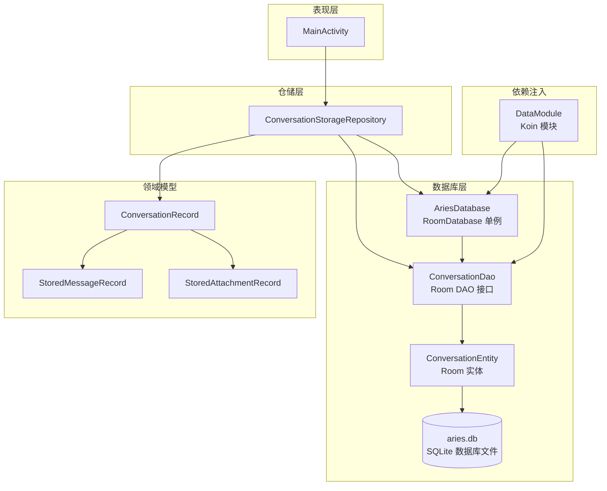
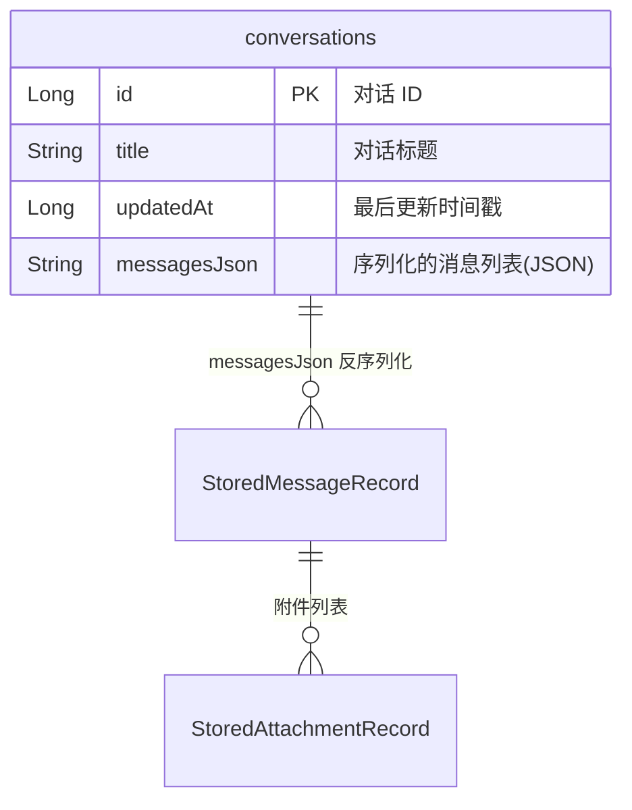
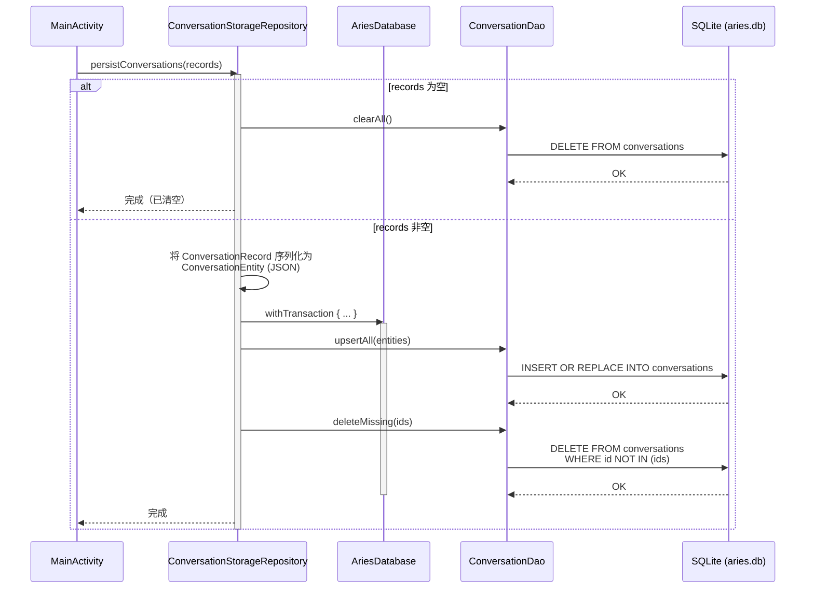
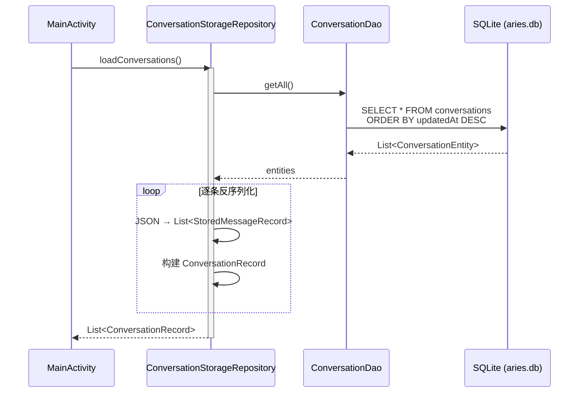

# Room 数据库 (AriesDatabase)

AriesDatabase 是 Aries AI Android 应用的本地持久化核心，基于 Room 数据库框架，专门管理对话（Conversation）记录的存储与检索。

## 概述

`AriesDatabase` 是一个继承自 `RoomDatabase` 的抽象类，作为应用内唯一的 Room 数据库实例。它通过**双重检查锁定（Double-Checked Locking）** 实现线程安全的单例模式，由 Koin DI 容器统一管理生命周期。

数据库目前仅包含一个实体表 —— `conversations`，用于存储 Aries AI 助手的对话历史。消息内容以 JSON 序列化形式存放在单列中（`messagesJson`），这样的设计在保留数据灵活性的同时，避免了为每个消息建立关联表的复杂性。

### 核心特性

- **线程安全单例**：通过 `@Volatile` + `synchronized` 保证多线程环境下的唯一实例
- **事务性批量写入**：`persistConversations` 在一次事务中完成 upsert + 删除不存在记录，保证数据一致性
- **JSON 序列化策略**：消息列表通过 `kotlinx.serialization` 序列化为 JSON 字符串存储，支持消息内容的灵活扩展
- **Koin DI 集成**：通过 `DataModule` 将数据库和 DAO 注入全应用

## 架构



**架构说明：**

| 层级 | 组件 | 职责 |
|------|------|------|
| 表现层 | `MainActivity` | 调用 `ConversationStorageRepository` 进行对话的加载和持久化 |
| 仓储层 | `ConversationStorageRepository` | 封装数据库操作，在 Room 实体和领域模型之间进行转换（JSON 序列化/反序列化） |
| 数据库层 | `AriesDatabase` | Room 数据库单例，管理数据库文件和连接 |
| 数据库层 | `ConversationDao` | 定义 SQL 查询和 CRUD 操作 |
| 数据库层 | `ConversationEntity` | 映射到 `conversations` 表的 Room 实体 |
| 依赖注入 | `DataModule` | 通过 Koin 提供 `AriesDatabase` 和 `ConversationDao` 单例 |
| 领域模型 | `ConversationRecord` 等 | 业务层使用的纯数据类，与存储格式解耦 |

## 数据模型

### 实体关系



### 实体与领域模型映射

数据库实体 `ConversationEntity` 通过 JSON 序列化桥接到领域模型：

- **`ConversationEntity`** → 直接映射到 `conversations` 表
- **`messagesJson`** → 序列化/反序列化桥接到 `List<StoredMessageRecord>`
- **`ConversationRecord`** → 业务层使用的完整对话对象

## 核心实现

### AriesDatabase — 数据库单例

```kotlin
@Database(
    entities = [ConversationEntity::class],
    version = 1,
    exportSchema = false,
)
abstract class AriesDatabase : RoomDatabase() {
    abstract fun conversationDao(): ConversationDao

    companion object {
        @Volatile
        private var instance: AriesDatabase? = null

        fun getInstance(context: Context): AriesDatabase {
            return instance ?: synchronized(this) {
                instance ?: Room.databaseBuilder(
                    context.applicationContext,
                    AriesDatabase::class.java,
                    "aries.db",
                ).build().also { instance = it }
            }
        }
    }
}
```
> Source: [AriesDatabase.kt](https://github.com/ZG0704666/Aries-AI/blob/main/app/src/main/java/com/ai/phoneagent/data/local/AriesDatabase.kt#L1-L30)

**设计意图：**

1. **`@Database(exportSchema = false)`**：关闭 schema 导出是为了简化构建流程。在多贡献者环境中关闭 schema 导出意味着不需要将 schema JSON 文件提交到版本控制中，适合项目初期的快速迭代。
2. **双重检查锁定**：使用 `@Volatile` 确保 `instance` 在所有线程间的可见性，`synchronized(this)` 确保只有一个线程能创建实例。这是 Android Room 官方推荐的单例模式。
3. **`context.applicationContext`**：使用 Application Context 而非 Activity Context，防止因 Activity 销毁导致的内存泄漏。
4. **数据库文件名 `aries.db`**：直接以应用名命名，简洁明了。

### ConversationEntity — 数据库实体

```kotlin
@Serializable
@Entity(tableName = "conversations")
data class ConversationEntity(
    @PrimaryKey val id: Long,
    val title: String,
    val updatedAt: Long,
    val messagesJson: String,
)
```
> Source: [ConversationEntity.kt](https://github.com/ZG0704666/Aries-AI/blob/main/app/src/main/java/com/ai/phoneagent/data/local/ConversationEntity.kt#L1-L14)

**设计意图：**

- **`id` 作为主键**：使用 `Long` 类型直接存储对话 ID，没有使用自增策略，表明 ID 由业务层生成并传入。
- **`messagesJson` 策略**：将整个消息列表序列化为单一 JSON 字符串，而不是建立独立的 `messages` 表。这种"文档存储"模式简化了 schema，适用于消息总是整体读写、不需要按条件查询单条消息的场景。
- **`@Serializable`**：实体同时标记为 `@Serializable`，支持 kotlinx.serialization，便于序列化传递（尽管 Room 实体本身不直接使用此注解进行持久化）。

### ConversationDao — 数据访问对象

```kotlin
@Dao
interface ConversationDao {
    @Query("SELECT * FROM conversations ORDER BY updatedAt DESC")
    suspend fun getAll(): List<ConversationEntity>

    @Upsert
    suspend fun upsertAll(items: List<ConversationEntity>)

    @Query("DELETE FROM conversations")
    suspend fun clearAll()

    @Query("DELETE FROM conversations WHERE id NOT IN (:ids)")
    suspend fun deleteMissing(ids: List<Long>)
}
```
> Source: [ConversationDao.kt](https://github.com/ZG0704666/Aries-AI/blob/main/app/src/main/java/com/ai/phoneagent/data/local/ConversationDao.kt#L1-L20)

**方法详解：**

| 方法 | SQL 操作 | 用途 |
|------|----------|------|
| `getAll()` | `SELECT *` + `ORDER BY updatedAt DESC` | 获取全部对话，按更新时间降序排列（最近活跃的排前面） |
| `upsertAll(items)` | Room `@Upsert` | 批量插入或更新对话（存在则更新，不存在则插入） |
| `clearAll()` | `DELETE FROM conversations` | 清空所有对话（一般在记录为空列表时触发） |
| `deleteMissing(ids)` | `DELETE ... WHERE id NOT IN (:ids)` | 删除不在给定 ID 列表中的对话（用于同步清理已删除的对话） |

**设计意图：**

- **`@Upsert`**：Room 2.5+ 引入的注解，相比手动判断 `INSERT OR REPLACE` 更简洁。批量 `upsertAll` 可一次性同步多对话状态。
- **`deleteMissing` + `upsertAll` 配合使用**：这是"全量同步"策略的核心——先批量 upsert，再删除不在列表中的记录。确保数据库状态与内存状态完全一致。
- **所有方法均为 `suspend`**：完全基于 Kotlin 协程，不阻塞主线程。

### ConversationStorageRepository — 仓储实现

```kotlin
class ConversationStorageRepository(
    context: Context,
    private val json: Json =
        Json {
            ignoreUnknownKeys = true
            encodeDefaults = true
        },
) {
    private val database = AriesDatabase.getInstance(context)
    private val dao = database.conversationDao()

    suspend fun loadConversations(): List<ConversationRecord> {
        return dao.getAll().map { entity ->
            ConversationRecord(
                id = entity.id,
                title = entity.title,
                updatedAt = entity.updatedAt,
                messages = json.decodeFromString(
                    ListSerializer(StoredMessageRecord.serializer()),
                    entity.messagesJson,
                ),
            )
        }
    }

    suspend fun persistConversations(records: List<ConversationRecord>) {
        database.withTransaction {
            if (records.isEmpty()) {
                dao.clearAll()
                return@withTransaction
            }

            dao.upsertAll(
                records.map { record ->
                    ConversationEntity(
                        id = record.id,
                        title = record.title,
                        updatedAt = record.updatedAt,
                        messagesJson = json.encodeToString(
                            ListSerializer(StoredMessageRecord.serializer()),
                            record.messages,
                        ),
                    )
                },
            )
            dao.deleteMissing(records.map { it.id })
        }
    }
}
```
> Source: [ConversationStorageRepository.kt](https://github.com/ZG0704666/Aries-AI/blob/main/app/src/main/java/com/ai/phoneagent/data/local/ConversationStorageRepository.kt#L1-L58)

**设计意图：**

1. **实体与领域模型分离**：`ConversationEntity` 是数据库层面的表示（`messagesJson` 为裸字符串），而 `ConversationRecord` 是业务层面的表示（`messages` 为结构化的 `List<StoredMessageRecord>`）。Repository 负责两者之间的转换。
2. **空列表优化**：当传入空列表时，直接调用 `clearAll()` 清空所有记录，避免不必要的序列化和数据库操作。
3. **事务保证一致性**：`withTransaction` 确保 `upsertAll` 和 `deleteMissing` 在同一个事务中执行。如果其中一个操作失败，整个事务回滚，保证数据库始终处于一致状态。
4. **JSON 配置**：`ignoreUnknownKeys = true` 允许向前兼容——未来新增字段不会导致反序列化失败；`encodeDefaults = true` 确保所有字段都被序列化，便于调试和完整存储。

### 领域模型

```kotlin
data class ConversationRecord(
    val id: Long,
    val title: String,
    val messages: List<StoredMessageRecord>,
    val updatedAt: Long,
)

@Serializable
data class StoredMessageRecord(
    val author: String,
    val content: String,
    val isUser: Boolean,
    val thinkingDurationMs: Long? = null,
    val attachments: List<StoredAttachmentRecord> = emptyList(),
)

@Serializable
data class StoredAttachmentRecord(
    val filePath: String,
    val fileName: String,
    val mimeType: String,
    val fileSize: Long,
    val content: String = "",
)
```
> Source: [ConversationStorageModels.kt](https://github.com/ZG0704666/Aries-AI/blob/main/app/src/main/java/com/ai/phoneagent/data/local/ConversationStorageModels.kt#L1-L28)

**模型层次说明：**

- **`ConversationRecord`**：顶层对话记录，包含 ID、标题、消息列表和更新时间。
- **`StoredMessageRecord`**：单条消息，区分用户消息（`isUser`）和 AI 消息，支持思考耗时统计（`thinkingDurationMs`）和附件列表。
- **`StoredAttachmentRecord`**：消息附件，记录文件路径、名称、MIME 类型、大小和内容。

## 核心流程

### 数据持久化流程



### 数据加载与还原流程



**流程要点：**

1. 持久化时先在内存中将领域对象转为 `ConversationEntity`（序列化消息到 JSON），再通过事务批量写入
2. 加载时从数据库读取 `ConversationEntity`，再反序列化 JSON 还原为结构化消息列表
3. 空列表场景直接清空表，避免无效操作

## 使用示例

### 基本用法 — 通过 Repository 加载和持久化

以下示例来自 `MainActivity`，展示如何在 Activity 中使用 `ConversationStorageRepository`：

```kotlin
// 初始化 Repository（lazy 初始化，使用 ApplicationContext）
private val conversationStorageRepository by lazy {
    ConversationStorageRepository(applicationContext)
}

// 加载已存储的对话
val stored = runCatching {
    runBlocking(Dispatchers.IO) {
        conversationStorageRepository.loadConversations()
    }
}.getOrNull().orEmpty()

// 持久化对话快照
lifecycleScope.launch(Dispatchers.IO) {
    runCatching {
        conversationStorageRepository.persistConversations(snapshot)
    }
}
```
> Source: [MainActivity.kt](https://github.com/ZG0704666/Aries-AI/blob/main/app/src/main/java/com/ai/phoneagent/MainActivity.kt#L438-L599)

### 通过 Koin DI 获取依赖

在 Koin 管理的组件中，可以通过注入直接获取 DAO：

```kotlin
// DataModule 提供的绑定
val dataModule = module {
    // Room 数据库 — 委托给现有的线程安全 getInstance()
    single<AriesDatabase> {
        AriesDatabase.getInstance(androidContext())
    }

    // 从数据库单例解析 Conversation DAO
    single { get<AriesDatabase>().conversationDao() }
}
```
> Source: [DataModule.kt](https://github.com/ZG0704666/Aries-AI/blob/main/app/src/main/java/com/ai/phoneagent/di/DataModule.kt#L41-L58)

## 配置选项

| 选项 | 类型 | 默认值 | 说明 |
|------|------|--------|------|
| `exportSchema` | Boolean | `false` | 是否导出 Room schema 到版本控制。当前关闭以简化构建 |
| `version` | Int | `1` | 数据库版本号。升级时需配合 `Migration` 使用 |
| 数据库文件名 | String | `"aries.db"` | SQLite 数据库文件名，存储在应用内部存储空间 |
| JSON `ignoreUnknownKeys` | Boolean | `true` | 反序列化时忽略未知 JSON 键，提供向前兼容性 |
| JSON `encodeDefaults` | Boolean | `true` | 序列化时包含默认值字段 |

## API 参考

### `AriesDatabase`

#### `getInstance(context: Context): AriesDatabase`

获取数据库单例实例。

**参数：**
- `context` (Context)：Android 上下文，内部使用 `applicationContext` 防止泄漏

**返回：** `AriesDatabase` 单例实例

**线程安全：** 是（通过 `@Volatile` + `synchronized` 保证）

---

### `ConversationDao`

#### `suspend fun getAll(): List<ConversationEntity>`

获取所有对话实体，按 `updatedAt` 降序排列。

**返回：** 全部 `ConversationEntity` 列表，最新更新的在前

---

#### `suspend fun upsertAll(items: List<ConversationEntity>)`

批量插入或更新对话记录。基于 Room `@Upsert` 注解，根据主键自动判断插入还是更新。

**参数：**
- `items` (List\<ConversationEntity\>)：需要 upsert 的实体列表

---

#### `suspend fun clearAll()`

删除 `conversations` 表中所有记录。

---

#### `suspend fun deleteMissing(ids: List<Long>)`

删除 ID 不在指定列表中的对话记录，用于清理已删除的对话。

**参数：**
- `ids` (List\<Long\>)：有效的对话 ID 列表，不在此列表中的记录将被删除

---

### `ConversationStorageRepository`

#### `constructor(context: Context, json: Json = defaultJson)`

创建 Repository 实例，自动获取数据库和 DAO 实例。

**参数：**
- `context` (Context)：Android 上下文
- `json` (Json)：用于序列化/反序列化消息的 Json 实例，默认配置为 `ignoreUnknownKeys=true` 和 `encodeDefaults=true`

---

#### `suspend fun loadConversations(): List<ConversationRecord>`

从数据库加载所有对话，并将 JSON 消息反序列化为结构化的 `StoredMessageRecord` 列表。

**返回：** `ConversationRecord` 列表，消息已完全反序列化

---

#### `suspend fun persistConversations(records: List<ConversationRecord>)`

持久化对话列表。在单个数据库事务中执行 upsert + 清理操作。

**参数：**
- `records` (List\<ConversationRecord\>)：需要持久化的对话记录。空列表 → 清空数据库

**事务性：** 是（通过 `withTransaction` 保证原子性）

---

## 相关链接

- [AriesDatabase 源文件](https://github.com/ZG0704666/Aries-AI/blob/main/app/src/main/java/com/ai/phoneagent/data/local/AriesDatabase.kt) — Room 数据库单例定义
- [ConversationEntity 源文件](https://github.com/ZG0704666/Aries-AI/blob/main/app/src/main/java/com/ai/phoneagent/data/local/ConversationEntity.kt) — 数据库实体定义
- [ConversationDao 源文件](https://github.com/ZG0704666/Aries-AI/blob/main/app/src/main/java/com/ai/phoneagent/data/local/ConversationDao.kt) — 数据访问对象接口
- [ConversationStorageRepository 源文件](https://github.com/ZG0704666/Aries-AI/blob/main/app/src/main/java/com/ai/phoneagent/data/local/ConversationStorageRepository.kt) — 仓储实现
- [ConversationStorageModels 源文件](https://github.com/ZG0704666/Aries-AI/blob/main/app/src/main/java/com/ai/phoneagent/data/local/ConversationStorageModels.kt) — 领域模型定义
- [DataModule 源文件](https://github.com/ZG0704666/Aries-AI/blob/main/app/src/main/java/com/ai/phoneagent/di/DataModule.kt) — Koin DI 模块（数据库绑定）
- [KoinModuleCheckTest 源文件](https://github.com/ZG0704666/Aries-AI/blob/main/app/src/test/java/com/ai/phoneagent/di/KoinModuleCheckTest.kt) — DI 图验证测试
- [MainActivity 源文件](https://github.com/ZG0704666/Aries-AI/blob/main/app/src/main/java/com/ai/phoneagent/MainActivity.kt) — 主要调用方
- [Android Room 官方文档](https://developer.android.com/training/data-storage/room) — Room 持久化库参考
