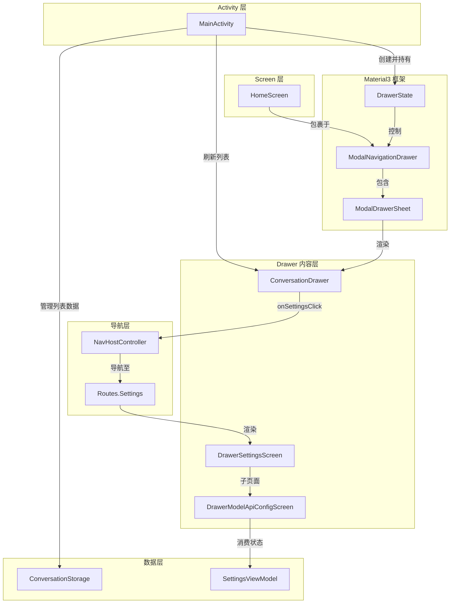
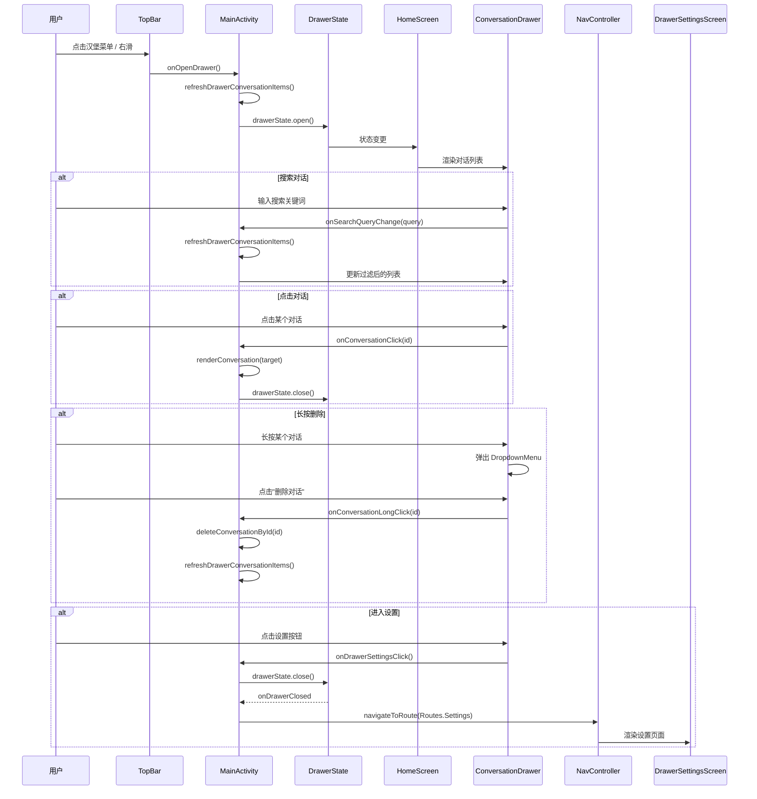

# 侧边栏与抽屉导航

Aries-AI 使用 Material3 的 `ModalNavigationDrawer` 实现主界面侧边栏导航，集成了对话历史管理、全局搜索、设置入口等功能。

## 概述

侧边栏（Drawer）是 Aries-AI 主界面的核心导航组件。它通过 Material3 的模态导航抽屉模式实现，从屏幕左侧滑出，覆盖在主内容之上。侧边栏承担两个主要职责：

1. **对话历史管理**：展示用户的所有历史对话，支持搜索、点击切换和长按删除操作
2. **设置入口**：提供进入应用设置页面的快捷方式

侧边栏在 `HomeScreen` 中被集成，内容由 `ConversationDrawer` 组件渲染，状态由 `MainActivity` 中的 `DrawerState` 统一管理。点击设置按钮后，通过 Compose Navigation 路由到 `DrawerSettingsScreen`，进而进入子页面配置 API、外观等选项。

## 架构



**架构说明：**

- **MainActivity** 是 Drawer 状态的最终持有者，通过 `rememberDrawerState(initialValue = DrawerValue.Closed)` 创建状态，并委托给 `HomeScreen`
- **HomeScreen** 使用 Material3 的 `ModalNavigationDrawer` 包裹整个 Scaffold 内容，`ModalDrawerSheet` 中嵌入 `ConversationDrawer`
- **ConversationDrawer** 是纯 UI 组件，不持有业务逻辑，所有回调（搜索、点击、长按、设置）均向上传递
- **DrawerSettingsScreen** 和 **DrawerModelApiConfigScreen** 通过 Compose Navigation 独立路由，与 Drawer 面板本身解耦
- 当 Drawer 关闭时，通过 `LaunchedEffect(drawerState.currentValue)` 触发 `onDrawerClosed` 回调，执行延迟的导航操作

## 核心组件

### ConversationDrawer — 对话列表面板

`ConversationDrawer` 是侧边栏的核心内容组件，位于 `app/src/main/java/com/ai/phoneagent/ui/drawer/ConversationDrawer.kt`。它负责渲染对话搜索栏、分类标题、对话列表以及底部的设置按钮。

#### 数据模型

对话列表使用 `DrawerConversationUiItem` 密封接口表示，支持两种 UI 元素：

```kotlin
@Immutable
sealed interface DrawerConversationUiItem {
    val stableKey: String

    @Immutable
    data class Header(
        val label: String
    ) : DrawerConversationUiItem

    @Immutable
    data class Conversation(
        val conversationId: Long,
        val title: String,
        val preview: String,
        val selected: Boolean,
    ) : DrawerConversationUiItem
}
```
> Source: [ConversationDrawer.kt](https://github.com/ZG0704666/Aries-AI/blob/main/app/src/main/java/com/ai/phoneagent/ui/drawer/ConversationDrawer.kt#L54-L74)

使用 `sealed interface` + `@Immutable` 的设计，确保 Compose 编译器能正确进行重组优化。每个 item 通过 `stableKey` 提供稳定的标识，用于 LazyColumn 的 key 参数。

#### 搜索功能

搜索框位于 Drawer 面板顶部，使用 Material3 `TextField` 实现。搜索触发回调 `onSearchQueryChange`，由 `MainActivity` 在 `refreshDrawerConversationItems()` 中执行过滤：

```kotlin
private fun refreshDrawerConversationItems() {
    val query = drawerSearchQueryState.value.trim()
    val filtered =
        conversations
            .sortedByDescending { it.updatedAt }
            .filter { conversation ->
                if (query.isBlank()) {
                    true
                } else {
                    val preview = buildDrawerConversationPreview(conversation)
                    conversation.title.contains(query, ignoreCase = true) ||
                        preview.contains(query, ignoreCase = true)
                }
            }
    // ... 映射为 DrawerConversationUiItem
}
```
> Source: [MainActivity.kt](https://github.com/ZG0704666/Aries-AI/blob/main/app/src/main/java/com/ai/phoneagent/MainActivity.kt#L1629-L1642)

搜索逻辑同时匹配对话标题和最后一条消息的预览文本，按更新时间降序排列。

#### 对话列表渲染

列表使用 `LazyColumn` 实现，按 `stableKey` 区分 Header 和 Conversation 两种类型：

```kotlin
if (items.isEmpty()) {
    Box(modifier = Modifier.weight(1f).fillMaxWidth(), contentAlignment = Alignment.Center) {
        Text(text = emptyMessage, ...)
    }
} else {
    LazyColumn(...) {
        items(items = items, key = { it.stableKey }) { item ->
            when (item) {
                is DrawerConversationUiItem.Header -> DrawerConversationHeader(item.label)
                is DrawerConversationUiItem.Conversation -> {
                    DrawerConversationRow(item, ...)
                }
            }
        }
    }
}
```
> Source: [ConversationDrawer.kt](https://github.com/ZG0704666/Aries-AI/blob/main/app/src/main/java/com/ai/phoneagent/ui/drawer/ConversationDrawer.kt#L134-L169)

- 空状态：展示 `emptyMessage`（"暂无聊天记录" 或 "没有匹配的聊天"）
- 选中态：当前活跃对话的 item 背景色设为 `surfaceContainerHigh`
- 长按：触发触觉反馈并弹出 `DropdownMenu`，提供"删除对话"操作

#### 设置入口

面板底部通过 `HorizontalDivider` 分隔，提供设置按钮。点击设置按钮时，优先调用 `onSettingsClick` 回调（如来自 `HomeScreen` 则为先关闭 Drawer 再导航），否则 fallback 到直接通过 `NavController` 导航：

```kotlin
Surface(
    modifier = Modifier.fillMaxWidth().clickable(
        onClick = {
            onSettingsClick?.invoke()
                ?: navController?.navigate(Routes.Settings.route)
        },
    ),
    color = Color.Transparent,
) {
    Row(...) {
        Icon(imageVector = Lucide.Settings, ...)
        Text(text = stringResource(R.string.drawer_settings), ...)
    }
}
```
> Source: [ConversationDrawer.kt](https://github.com/ZG0704666/Aries-AI/blob/main/app/src/main/java/com/ai/phoneagent/ui/drawer/ConversationDrawer.kt#L176-L209)

### HomeScreen — Drawer 的宿主容器

`HomeScreen` 是 Drawer 的宿主，位于 `app/src/main/java/com/ai/phoneagent/ui/home/HomeScreen.kt`。它使用 Material3 的 `ModalNavigationDrawer` 作为顶层容器：

```kotlin
ModalNavigationDrawer(
    drawerState = drawerState,
    gesturesEnabled = drawerGesturesEnabled,
    scrimColor = colorResource(R.color.m3t_drawer_scrim),
    drawerContent = {
        ModalDrawerSheet(
            modifier = Modifier.width(drawerWidth),
            drawerContainerColor = MaterialTheme.colorScheme.surface,
        ) {
            Box(modifier = Modifier.fillMaxSize().statusBarsPadding()
                .navigationBarsPadding()
                .padding(horizontal = dialogPadding, vertical = spacingXl)) {
                ConversationDrawer(
                    searchQuery = drawerSearchQuery,
                    items = drawerItems,
                    emptyMessage = drawerEmptyMessage,
                    onSearchQueryChange = onDrawerSearchQueryChange,
                    onConversationClick = onDrawerConversationClick,
                    onConversationLongClick = onDrawerConversationLongClick,
                    onSettingsClick = onDrawerSettingsClick,
                )
            }
        }
    },
) {
    // Scaffold 内容...
}
```
> Source: [HomeScreen.kt](https://github.com/ZG0704666/Aries-AI/blob/main/app/src/main/java/com/ai/phoneagent/ui/home/HomeScreen.kt#L112-L181)

关键设计决策：
- `gesturesEnabled` 参数控制手势开关，引导页显示时禁用手势避免干扰
- `scrimColor` 使用 `m3t_drawer_scrim`（半透明深色遮罩）提供视觉层次
- Drawer 宽度固定为 `m3t_drawer_width`（296dp）
- Drawer 关闭时通过 `LaunchedEffect` 检测状态变化并触发清理逻辑

### DrawerSettingsScreen — 设置面板

点击侧边栏的设置按钮后，应用导航到 `DrawerSettingsScreen`（`app/src/main/java/com/ai/phoneagent/ui/settings/DrawerSettingsScreen.kt`）。这是从 Drawer 独立出来的页面，拥有自己的导航栈。

`DrawerSettingsScreen` 包含以下设置条目：

| 类型 | 标题 | 图标 | 目标页面 |
|------|------|------|----------|
| Appearance | 外观 | Sparkles | 主题模式设置 |
| ModelApi | 模型与 API | KeyRound | 模型 API 配置 |
| Automation | 自动化 | Cpu | 自动化控制面板 |
| About | 关于 | Info | 关于页面 |

```kotlin
val entries = listOf(
    SettingsEntryUi(
        type = SettingsEntryType.Appearance,
        title = stringResource(R.string.settings_entry_appearance_title),
        subtitle = stringResource(R.string.settings_entry_appearance_subtitle),
        icon = Lucide.Sparkles,
    ),
    // ... 其他条目
)
```
> Source: [DrawerSettingsScreen.kt](https://github.com/ZG0704666/Aries-AI/blob/main/app/src/main/java/com/ai/phoneagent/ui/settings/DrawerSettingsScreen.kt#L115-L141)

设置页面同样支持搜索过滤，按分类组织为 Section 卡片。

### DrawerModelApiConfigScreen — 模型与 API 配置

`DrawerModelApiConfigScreen` 是设置页面中"模型与 API"的子页面，负责配置 AI 模型的连接方式。支持四种 API 模式：

- **Official（官方 API）**：使用智谱官方 API，仅需输入 API Key
- **ThirdParty（第三方 API）**：使用 OpenAI 兼容的第三方/自定义 API，需配置 Base URL、模型名称和 API Key
- **Local（本地模型）**：使用本地运行的 Qwen3.5-9B 模型，需先下载模型文件
- **Aries（Aries 平台）**：通过 OAuth SSO 登录 Aries 平台使用云端模型

```kotlin
fun DrawerModelApiConfigScreen(
    currentApiMode: SettingsViewModel.ApiMode,
    apiInput: String,
    apiBaseUrl: String,
    apiModel: String,
    apiStatus: String,
    apiStatusPositive: Boolean,
    qwenButtonText: String,
    qwenButtonEnabled: Boolean,
    showAriesApiSection: Boolean,
    // ... 回调参数
)
```
> Source: [DrawerSettingsScreen.kt](https://github.com/ZG0704666/Aries-AI/blob/main/app/src/main/java/com/ai/phoneagent/ui/settings/DrawerSettingsScreen.kt#L414-L438)

## 核心流程



**流程说明：**

1. **打开 Drawer**：用户通过顶栏按钮或右滑手势触发，MainActivity 先刷新对话列表数据，再通过协程打开 Drawer。引导页显示期间（`onboardingOverlay.isShowing()`），手势和打开操作均被禁用。

2. **搜索**：搜索是即时的——每次输入变化都触发 `refreshDrawerConversationItems()`，同时匹配标题和最后一条消息的预览文本。

3. **点击对话**：先渲染目标对话内容，再关闭 Drawer，确保用户看到平滑的过渡。

4. **导航延迟执行**：当从 Drawer 内发起导航（如进入设置）时，MainActivity 先将 Drawer 关闭，在 `onDrawerClosed` 回调中执行 `runPendingDrawerNavigationAction()`，确保导航动画不与 Drawer 关闭动画冲突。

5. **删除对话**：通过长按触发上下文菜单，确认后从存储中删除并刷新列表。

## 配置选项

### 尺寸配置

| 选项 | 类型 | 默认值 | 描述 |
|------|------|--------|------|
| `m3t_drawer_width` | dimen | 296dp | Drawer 面板宽度 |
| `m3t_drawer_conversation_radius` | dimen | 20dp | 对话项圆角半径 |
| `m3t_drawer_conversation_item_padding_h` | dimen | 16dp | 对话项水平内边距 |
| `m3t_drawer_conversation_item_padding_v` | dimen | 14dp | 对话项垂直内边距 |
| `m3t_drawer_header_top_padding` | dimen | 36dp | Drawer 头部顶部内边距 |
| `m3t_drawer_search_height` | dimen | 56dp | 搜索栏高度 |
| `m3t_drawer_footer_height` | dimen | 72dp | Drawer 底部区域高度 |
| `m3t_drawer_input_min_height` | dimen | 42dp | 输入框最小高度 |
| `m3t_drawer_api_field_height` | dimen | 48dp | API 字段高度 |
| `m3t_drawer_profile_avatar_size` | dimen | 72dp | 头像尺寸 |

> Source: [m3t.xml](https://github.com/ZG0704666/Aries-AI/blob/main/app/src/main/res/values/m3t.xml#L151-L174)

### 颜色配置

**浅色主题：**

| 选项 | 类型 | 默认值 | 描述 |
|------|------|--------|------|
| `m3t_drawer_background` | color | #EAF3FF | Drawer 背景色（浅蓝） |
| `m3t_drawer_section_bg` | color | #F1F7FF | 分组区域背景 |
| `m3t_drawer_input_bg` | color | #DFEAF8 | 输入框背景 |
| `m3t_drawer_footer_bg` | color | #E2EEFF | 底部区域背景 |
| `m3t_drawer_active_item_bg` | color | #D8E7FF | 选中项高亮背景 |
| `m3t_drawer_scrim` | color | #520E1621 | Drawer 打开时的遮罩色 |

> Source: [m3t.xml](https://github.com/ZG0704666/Aries-AI/blob/main/app/src/main/res/values/m3t.xml#L53-L58)

**深色主题：**

| 选项 | 类型 | 默认值 | 描述 |
|------|------|--------|------|
| `m3t_drawer_background` | color | #152231 | Drawer 背景色（深蓝） |
| `m3t_drawer_section_bg` | color | #1A2A3C | 分组区域背景 |
| `m3t_drawer_input_bg` | color | #213247 | 输入框背景 |

> Source: [values-night/m3t.xml](https://github.com/ZG0704666/Aries-AI/blob/main/app/src/main/res/values-night/m3t.xml#L53-L55)

### 手势配置

| 选项 | 类型 | 描述 |
|------|------|------|
| `gesturesEnabled` | Boolean | 是否启用手势滑动打开 Drawer。引导页显示期间为 `false` |

## API 参考

### `ConversationDrawer`

```kotlin
@Composable
fun ConversationDrawer(
    searchQuery: String,
    items: List<DrawerConversationUiItem>,
    emptyMessage: String,
    navController: NavHostController? = null,
    onSearchQueryChange: (String) -> Unit,
    onConversationClick: (Long) -> Unit,
    onConversationLongClick: (Long) -> Unit,
    onSettingsClick: (() -> Unit)? = null,
)
```

> Source: [ConversationDrawer.kt](https://github.com/ZG0704666/Aries-AI/blob/main/app/src/main/java/com/ai/phoneagent/ui/drawer/ConversationDrawer.kt#L77-L86)

**参数：**
- `searchQuery` (String)：当前搜索框中的文本
- `items` (List\<DrawerConversationUiItem\>)：对话列表数据，支持 Header 和 Conversation 混合类型
- `emptyMessage` (String)：列表为空时显示的提示文本
- `navController` (NavHostController?)：可选的导航控制器，用于 fallback 导航
- `onSearchQueryChange` ((String) -> Unit)：搜索文本变化回调
- `onConversationClick` ((Long) -> Unit)：点击对话项回调，传入 conversationId
- `onConversationLongClick` ((Long) -> Unit)：长按对话项回调，传入 conversationId（目前仅用于删除）
- `onSettingsClick` (() -> Unit?)：点击设置按钮回调，如果提供则调用此回调而非直接导航

### `DrawerSettingsScreen`

```kotlin
@Composable
fun DrawerSettingsScreen(
    onBack: () -> Unit,
    onOpenAppearance: () -> Unit,
    onOpenModelApi: () -> Unit,
    onOpenAutomation: () -> Unit,
    onOpenAbout: () -> Unit,
)
```

> Source: [DrawerSettingsScreen.kt](https://github.com/ZG0704666/Aries-AI/blob/main/app/src/main/java/com/ai/phoneagent/ui/settings/DrawerSettingsScreen.kt#L103-L109)

**参数：**
- `onBack` (() -> Unit)：返回回调，回到上一页
- `onOpenAppearance` (() -> Unit)：打开外观设置页面
- `onOpenModelApi` (() -> Unit)：打开模型 API 配置页面
- `onOpenAutomation` (() -> Unit)：打开自动化控制面板
- `onOpenAbout` (() -> Unit)：打开关于页面

### `DrawerModelApiConfigScreen`

```kotlin
@Composable
fun DrawerModelApiConfigScreen(
    currentApiMode: SettingsViewModel.ApiMode,
    apiInput: String,
    apiBaseUrl: String,
    apiModel: String,
    apiStatus: String,
    apiStatusPositive: Boolean,
    qwenButtonText: String,
    qwenButtonEnabled: Boolean,
    showAriesApiSection: Boolean,
    ariesLoggedInUser: String,
    ariesSelectedModel: String,
    onChangeAriesModel: () -> Unit,
    onBack: () -> Unit,
    onApiModeChange: (SettingsViewModel.ApiMode) -> Unit,
    onApiInputChange: (String) -> Unit,
    onOpenApiKeyPage: () -> Unit,
    onOpenMembership: () -> Unit,
    onAriesLoginClick: () -> Unit,
    onAriesLogout: () -> Unit,
    onApiBaseUrlChange: (String) -> Unit,
    onApiModelChange: (String) -> Unit,
    onCheckApi: () -> Unit,
    onDownloadQwenModel: () -> Unit,
)
```

> Source: [DrawerSettingsScreen.kt](https://github.com/ZG0704666/Aries-AI/blob/main/app/src/main/java/com/ai/phoneagent/ui/settings/DrawerSettingsScreen.kt#L414-L438)

**参数：**
- `currentApiMode` (SettingsViewModel.ApiMode)：当前 API 模式，可选 Official / ThirdParty / Local / Aries
- `apiInput` (String)：API Key 输入文本
- `apiBaseUrl` (String)：自定义 API Base URL（仅第三方模式使用）
- `apiModel` (String)：模型名称（仅第三方模式使用）
- `apiStatus` (String)：API 连接状态文本
- `apiStatusPositive` (Boolean)：API 状态是否为正面（连接成功）
- `qwenButtonText` (String)：本地模型下载按钮文本
- `qwenButtonEnabled` (Boolean)：下载按钮是否可用
- `showAriesApiSection` (Boolean)：是否显示 Aries 和本地模型区域
- `ariesLoggedInUser` (String)：已登录的 Aries 用户名
- `ariesSelectedModel` (String)：已选择的 Aries 模型名称
- `onChangeAriesModel` (() -> Unit)：切换 Aries 模型回调
- `onBack` (() -> Unit)：返回
- `onApiModeChange` ((ApiMode) -> Unit)：API 模式切换回调
- `onApiInputChange` ((String) -> Unit)：API Key 输入变化
- `onOpenApiKeyPage` (() -> Unit)：打开获取 API Key 的页面
- `onOpenMembership` (() -> Unit)：打开会员页面
- `onAriesLoginClick` (() -> Unit)：Aries SSO 登录
- `onAriesLogout` (() -> Unit)：Aries 登出
- `onApiBaseUrlChange` ((String) -> Unit)：自定义 API 地址变化
- `onApiModelChange` ((String) -> Unit)：自定义模型名称变化
- `onCheckApi` (() -> Unit)：验证 API 连接
- `onDownloadQwenModel` (() -> Unit)：下载 Qwen 本地模型

### `DrawerConversationUiItem`

```kotlin
@Immutable
sealed interface DrawerConversationUiItem {
    val stableKey: String

    data class Header(val label: String) : DrawerConversationUiItem
    data class Conversation(
        val conversationId: Long,
        val title: String,
        val preview: String,
        val selected: Boolean,
    ) : DrawerConversationUiItem
}
```

> Source: [ConversationDrawer.kt](https://github.com/ZG0704666/Aries-AI/blob/main/app/src/main/java/com/ai/phoneagent/ui/drawer/ConversationDrawer.kt#L54-L74)

**子类型：**
- `Header`：分组标题行，如"最近聊天"
- `Conversation`：单个对话条目，包含 ID、标题、预览文本和选中状态

## 使用示例

### 在 HomeScreen 中集成 ConversationDrawer

```kotlin
ModalNavigationDrawer(
    drawerState = drawerState,
    gesturesEnabled = drawerGesturesEnabled,
    scrimColor = colorResource(R.color.m3t_drawer_scrim),
    drawerContent = {
        ModalDrawerSheet(
            modifier = Modifier.width(drawerWidth),
            drawerContainerColor = MaterialTheme.colorScheme.surface,
        ) {
            Box(
                modifier = Modifier
                    .fillMaxSize()
                    .statusBarsPadding()
                    .navigationBarsPadding()
                    .padding(horizontal = dialogPadding, vertical = spacingXl),
            ) {
                ConversationDrawer(
                    searchQuery = drawerSearchQuery,
                    items = drawerItems,
                    emptyMessage = drawerEmptyMessage,
                    onSearchQueryChange = onDrawerSearchQueryChange,
                    onConversationClick = onDrawerConversationClick,
                    onConversationLongClick = onDrawerConversationLongClick,
                    onSettingsClick = onDrawerSettingsClick,
                )
            }
        }
    },
) {
    // 主界面内容...
}
```

> Source: [HomeScreen.kt](https://github.com/ZG0704666/Aries-AI/blob/main/app/src/main/java/com/ai/phoneagent/ui/home/HomeScreen.kt#L112-L181)

### MainActivity 中管理 Drawer 状态

```kotlin
// 创建 DrawerState
val drawerState = rememberDrawerState(initialValue = DrawerValue.Closed)

// 打开 Drawer
val onOpenDrawer = remember(drawerState, composeScope) {
    {
        if (!onboardingOverlay.isShowing()) {
            vibrateLight()
            hideKeyboard()
            composeScope.launch { drawerState.open() }
        }
    }
}

// 从 Drawer 中点击对话后的关闭
val onDrawerConversationClick = remember(drawerState, composeScope) {
    { conversationId: Long ->
        val target = conversations.firstOrNull { it.id == conversationId }
        if (target != null) {
            renderConversation(target, animateTransition = true)
            persistConversations()
            composeScope.launch { drawerState.close() }
        }
    }
}
```

> Source: [MainActivity.kt](https://github.com/ZG0704666/Aries-AI/blob/main/app/src/main/java/com/ai/phoneagent/MainActivity.kt#L833-L911)

### 构建 Drawer 对话预览

```kotlin
private fun buildDrawerConversationPreview(conversation: Conversation): String {
    val lastMessage = conversation.messages.lastOrNull() ?: return ""
    return if (lastMessage.isUser) {
        lastMessage.content.trim()
    } else {
        parseStoredAiContent(lastMessage.content).second.trim()
    }
}
```

> Source: [MainActivity.kt](https://github.com/ZG0704666/Aries-AI/blob/main/app/src/main/java/com/ai/phoneagent/MainActivity.kt#L1662-L1669)

预览逻辑：取最后一条消息，如果是用户消息直接取原文，如果是 AI 回复则解析存储内容提取纯文本部分。

## Drawer 背景 Drawable

侧边栏面板和对话项使用 XML drawable 定义背景样式：

**面板背景** (`bg_drawer_panel.xml`)：

```xml
<shape xmlns:android="http://schemas.android.com/apk/res/android"
    android:shape="rectangle">
    <solid android:color="@color/m3t_drawer_background" />
    <corners android:radius="@dimen/m3t_radius_xl" />
</shape>
```

> Source: [bg_drawer_panel.xml](https://github.com/ZG0704666/Aries-AI/blob/main/app/src/main/res/drawable/bg_drawer_panel.xml)

**对话项选择器** (`bg_drawer_conversation_item.xml`)：

```xml
<selector xmlns:android="http://schemas.android.com/apk/res/android">
    <item android:state_activated="true">
        <shape android:shape="rectangle">
            <solid android:color="@color/m3t_drawer_active_item_bg" />
            <corners android:radius="@dimen/m3t_drawer_conversation_radius" />
        </shape>
    </item>
    <item>
        <shape android:shape="rectangle">
            <solid android:color="@android:color/transparent" />
            <corners android:radius="@dimen/m3t_drawer_conversation_radius" />
        </shape>
    </item>
</selector>
```

> Source: [bg_drawer_conversation_item.xml](https://github.com/ZG0704666/Aries-AI/blob/main/app/src/main/res/drawable/bg_drawer_conversation_item.xml)

**输入框背景** (`bg_input_field_drawer.xml`)：

```xml
<shape xmlns:android="http://schemas.android.com/apk/res/android"
    android:shape="rectangle">
    <solid android:color="@color/m3t_drawer_input_bg" />
    <corners android:radius="@dimen/m3t_radius_sm" />
</shape>
```

> Source: [bg_input_field_drawer.xml](https://github.com/ZG0704666/Aries-AI/blob/main/app/src/main/res/drawable/bg_input_field_drawer.xml)

## 导航流程

侧边栏涉及两条导航路径：

1. **Drawer → 设置**：`ConversationDrawer.onSettingsClick` → `MainActivity.navigateToRoute(Routes.Settings, closeDrawerFirst = true)` → 先关闭 Drawer，在 `onDrawerClosed` 中执行导航 → `NavHost` 路由到 `SettingsRoute` → 渲染 `DrawerSettingsScreen`

2. **设置 → 子页面**：`DrawerSettingsScreen.onOpenModelApi` → `SettingsViewModel.openModelApiPage()` → `AnimatedContent` 过渡到 `DrawerModelApiConfigScreen`

导航使用延迟执行模式（`pendingDrawerNavigationAction`），确保 Drawer 关闭动画完成后再执行路由跳转，避免动画冲突：

```kotlin
private fun navigateFromDrawer(action: () -> Unit) {
    if (onboardingOverlay.isShowing()) return
    pendingDrawerNavigationAction = action
    hideKeyboard()
    // Drawer 关闭后通过 onDrawerClosed → runPendingDrawerNavigationAction() 执行
}
```

> Source: [MainActivity.kt](https://github.com/ZG0704666/Aries-AI/blob/main/app/src/main/java/com/ai/phoneagent/MainActivity.kt#L2526-L2531)

## 设计意图

### 为什么使用 ModalNavigationDrawer？

Material3 的 `ModalNavigationDrawer` 提供了标准的侧边栏交互模式——模态遮罩层 + 从边缘滑出的面板。相比传统的 `DrawerLayout`，Compose 版本与声明式 UI 范式更加契合，状态管理通过 `DrawerState` 完成，能更好地与 Compose 的重组机制配合。

### 为什么数据模型使用 sealed interface？

`DrawerConversationUiItem` 使用 `sealed interface` 而非普通 class，原因：
1. **类型安全**：`when` 分支覆盖所有子类型，编译器确保无遗漏
2. **重组优化**：`@Immutable` 标记让 Compose 编译器跳过不必要的重组
3. **混合列表**：同一 `LazyColumn` 中渲染不同类型（Header / Conversation），通过 `stableKey` 保证稳定标识

### 为什么导航要延迟执行？

从 Drawer 内发起导航时，直接执行可能导致 Drawer 关闭动画与新页面入场动画同时播放，造成视觉不连贯。通过 `pendingDrawerNavigationAction` 暂存导航动作，在 `onDrawerClosed` 回调中执行，确保动画顺序清晰。

## 相关链接

- [ConversationDrawer.kt 源码](https://github.com/ZG0704666/Aries-AI/blob/main/app/src/main/java/com/ai/phoneagent/ui/drawer/ConversationDrawer.kt)
- [DrawerSettingsScreen.kt 源码](https://github.com/ZG0704666/Aries-AI/blob/main/app/src/main/java/com/ai/phoneagent/ui/settings/DrawerSettingsScreen.kt)
- [HomeScreen.kt 源码](https://github.com/ZG0704666/Aries-AI/blob/main/app/src/main/java/com/ai/phoneagent/ui/home/HomeScreen.kt)
- [MainActivity.kt 源码](https://github.com/ZG0704666/Aries-AI/blob/main/app/src/main/java/com/ai/phoneagent/MainActivity.kt)
- [SettingsRoute.kt 源码](https://github.com/ZG0704666/Aries-AI/blob/main/app/src/main/java/com/ai/phoneagent/ui/settings/SettingsRoute.kt)
- [Routes.kt 导航定义](https://github.com/ZG0704666/Aries-AI/blob/main/app/src/main/java/com/ai/phoneagent/navigation/Routes.kt)
- [色彩与尺寸定义 - m3t.xml](https://github.com/ZG0704666/Aries-AI/blob/main/app/src/main/res/values/m3t.xml)
- [深色主题色彩 - values-night/m3t.xml](https://github.com/ZG0704666/Aries-AI/blob/main/app/src/main/res/values-night/m3t.xml)
- [Drawer 字符串资源](https://github.com/ZG0704666/Aries-AI/blob/main/app/src/main/res/values/strings.xml)
- [侧边栏字符串补充](https://github.com/ZG0704666/Aries-AI/blob/main/app/src/main/res/values/strings_m3_fix.xml)
- [Drawer 背景 Drawable](https://github.com/ZG0704666/Aries-AI/blob/main/app/src/main/res/drawable/bg_drawer_panel.xml)
- [对话项背景选择器](https://github.com/ZG0704666/Aries-AI/blob/main/app/src/main/res/drawable/bg_drawer_conversation_item.xml)
- [输入框背景 Drawable](https://github.com/ZG0704666/Aries-AI/blob/main/app/src/main/res/drawable/bg_input_field_drawer.xml)
