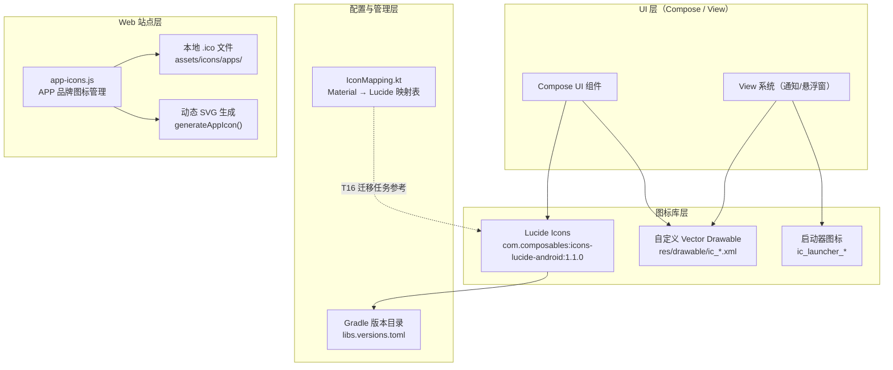
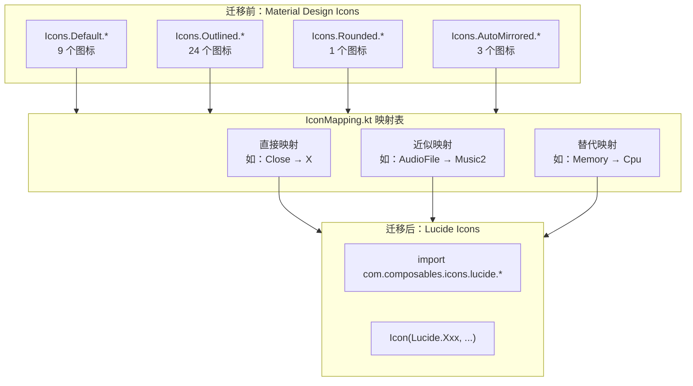
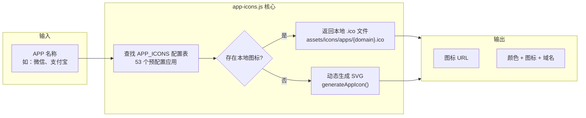

# 图标系统

Aries-AI 的图标系统采用多层架构设计，为 Android 客户端和 Web 站点提供统一、一致的图标体验。系统核心基于 Lucide 图标库，并辅以自定义 Android Vector Drawable 和 Web 端动态图标生成能力。

## 概述

图标系统是 Aries-AI 跨平台视觉语言的核心组成部分。它负责管理应用中所有图标的定义、导入和渲染。系统的设计目标是：

- **一致性**：全应用使用统一的图标风格（Lucide），替代原先混杂的 Material Design Icons
- **可维护性**：通过版本目录（Version Catalog）集中管理图标依赖，通过 `IconMapping.kt` 跟踪迁移状态
- **跨场景覆盖**：从 Compose UI 组件到 Android 通知栏、系统级资源，再到 Web 站点均有对应的图标解决方案

图标系统支撑了包括对话界面、自动化控制面板、权限引导、设置抽屉、会员页面、代码块渲染等在内的所有 UI 场景。

## 架构

下图展示了 Aries-AI 图标系统的整体架构：



### 架构说明

架构分为四个层次：

1. **UI 层**：包括 Jetpack Compose 组件和传统 View 系统（通知、悬浮窗），它们作为图标的消费者
2. **图标库层**：核心数据层，提供三类图标资源——Lucide 矢量图标、自定义 Android Vector Drawable 和启动器图标
3. **配置与管理层**：通过 Gradle 版本目录统一管理版本，通过 `IconMapping.kt` 记录 Material Design Icons 到 Lucide 的完整映射关系
4. **Web 站点层**：独立于 Android 客户端的 Web 图标管理模块，用于 Aries 站点的 APP 品牌图标展示

## 图标库层详解

### 1. Lucide Icons（主要图标库）

Aries-AI 已将所有 Compose UI 中的图标从 Material Design Icons 迁移至 **Lucide** 图标库。Lucide 是一个现代、简洁的图标集，提供超过 1000 个开源图标。

#### 依赖配置

在版本目录中统一定义：

> Source: [libs.versions.toml](https://github.com/ZG0704666/Aries-AI/blob/main/gradle/libs.versions.toml#L63)

```toml
compose-icons-lucide = { module = "com.composables:icons-lucide-android", version = "1.1.0" }
```

在 App 模块和 feature 模块中引用：

> Sources:
> - [app/build.gradle.kts](https://github.com/ZG0704666/Aries-AI/blob/main/app/build.gradle.kts#L204-L205)
> - [feature/settings/build.gradle.kts](https://github.com/ZG0704666/Aries-AI/blob/main/feature/settings/build.gradle.kts#L47-L48)

```kotlin
// Lucide Icons
implementation(libs.compose.icons.lucide)
```

#### 使用方式

在 Compose 中通过 `com.composables.icons.lucide` 包导入并使用：

> Source: [MainActivity.kt](https://github.com/ZG0704666/Aries-AI/blob/main/app/src/main/java/com/ai/phoneagent/MainActivity.kt#L121-L128)

```kotlin
import androidx.compose.material3.Icon
import com.composables.icons.lucide.Lucide
import com.composables.icons.lucide.Music2
import com.composables.icons.lucide.FileText
import com.composables.icons.lucide.Camera
import com.composables.icons.lucide.Monitor
import com.composables.icons.lucide.Video
import com.composables.icons.lucide.Image as LucideImage
```

在 Composable 中渲染图标：

> Source: [DrawerSettingsScreen.kt](https://github.com/ZG0704666/Aries-AI/blob/main/app/src/main/java/com/ai/phoneagent/ui/settings/DrawerSettingsScreen.kt#L183-L187)

```kotlin
IconButton(onClick = onBack) {
    Icon(
        imageVector = Lucide.ArrowLeft,
        contentDescription = stringResource(R.string.about_back),
    )
}
```

> Source: [MembershipScreen.kt](https://github.com/ZG0704666/Aries-AI/blob/main/app/src/main/java/com/ai/phoneagent/ui/settings/MembershipScreen.kt#L134-L136)

```kotlin
TierCard(
    tier = MembershipTier.Basic,
    icon = { Icon(Lucide.Zap, contentDescription = null, modifier = Modifier.size(20.dp)) },
    // ...
)
```

#### 被引用的 Lucide 图标一览

| 图标 | 使用文件 | 用途 |
|------|---------|------|
| `ArrowLeft` | AutomationControlScreen, DrawerSettingsScreen, LicensesScreen, MembershipScreen, AppearanceScreen, OnboardingScreen, AboutScreen 等 | 返回导航按钮 |
| `Camera` | MainActivity, AttachmentComponents | 相机/拍照附件选项 |
| `Check` | ConversationTranscript | 确认/成功指示 |
| `ChevronDown` | ConversationTranscript, CodeBlock | 展开/折叠指示器 |
| `CircleCheck` | DrawerSettingsScreen | 已验证状态指示 |
| `CircleStop` | AutomationControlScreen | 停止自动化按钮 |
| `Cloud` | DrawerSettingsScreen | 云端模型指示器 |
| `Code` | CodeBlock | 代码块图标 |
| `Copy` | ConversationTranscript, CodeBlock | 复制文本按钮 |
| `Cpu` | DrawerSettingsScreen | 本地模型/计算指示器 |
| `Crown` | DrawerSettingsScreen, MembershipScreen | 会员/高级功能 |
| `Download` | DrawerSettingsScreen, MarkdownImage, Mermaid, UpdateHistoryScreen | 下载/安装操作 |
| `Expand` | Mermaid | 展开图表 |
| `ExternalLink` | MainOnboardingOverlay, PermissionBottomSheet, DrawerSettingsScreen, OnboardingScreen | 外链/打开设置 |
| `Eye` | CodeBlock | 预览代码 |
| `FileText` | MainActivity, AttachmentComponents, ConversationTranscript | 文档附件图标 |
| `Globe` | AboutScreen | 网站链接 |
| `Hash` | CodeBlock | 标题锚点 |
| `History` | AboutScreen | 历史记录 |
| `Info` | DrawerSettingsScreen, InfoTooltip | 信息/帮助指示 |
| `Keyboard` | InputBar | 切换到键盘输入 |
| `KeyRound` | DrawerSettingsScreen | API 密钥/凭证字段 |
| `Layers` | PermissionGuideScreen | 叠加层权限 |
| `LogIn` | DrawerSettingsScreen | 登录操作 |
| `Mail` | AboutScreen | 邮件联系 |
| `MessageCircle` | ConversationHistoryDialog, ConversationTranscript | 对话/消息指示 |
| `Mic` | MainOnboardingOverlay, PermissionBottomSheet, AutomationControlScreen, InputBar, OnboardingScreen, PermissionGuideScreen | 语音输入/麦克风权限 |
| `Monitor` | MainActivity, AttachmentComponents | 屏幕截图附件 |
| `Music2` | MainActivity, AttachmentComponents | 音频文件附件 |
| `Pencil` | ConversationTranscript | 编辑文本按钮 |
| `Plus` | InputBar | 添加附件按钮 |
| `RefreshCw` | AutomationControlScreen, ConversationTranscript, AboutScreen | 刷新按钮 |
| `RotateCw` | DrawerSettingsScreen | 同步/刷新操作 |
| `Save` | CodeBlock | 保存代码 |
| `ScrollText` | AboutScreen | 文本协议 |
| `Search` | ConversationDrawer, ConversationTranscript | 搜索对话按钮 |
| `Settings` | ConversationDrawer, ConversationTranscript | 设置按钮 |
| `Shield` | MainOnboardingOverlay, PermissionBottomSheet, AutomationControlScreen, OnboardingScreen, AboutScreen | 安全/权限指示 |
| `SlidersHorizontal` | AutomationControlScreen | 设置/配置按钮 |
| `Smartphone` | MainOnboardingOverlay, PermissionBottomSheet, AutomationControlScreen, OnboardingScreen, PermissionGuideScreen | 无障碍服务/手机 |
| `Sparkles` | DrawerSettingsScreen, MembershipScreen, ConversationTranscript | AI 功能/会员特权 |
| `Trash2` | ConversationDrawer, ConversationHistoryDialog | 删除按钮 |
| `Video` | MainActivity, AttachmentComponents | 视频附件 |
| `WandSparkles` | AutomationControlScreen | AI/自动化功能指示 |
| `WrapText` | CodeBlock | 换行切换 |
| `X` | AttachmentComponents, ConversationHistoryDialog, ConversationTranscript, MarkdownImage | 关闭/移除按钮 |
| `Zap` | MembershipScreen | 基础会员 |

### 2. 自定义 Vector Drawable

对于系统级（通知栏、悬浮窗）和不适合使用 Lucide 的场景，项目维护了一套自定义 Android Vector Drawable 资源：

> 文件位于 [app/src/main/res/drawable/](https://github.com/ZG0704666/Aries-AI/blob/main/app/src/main/res/drawable/) 目录

| 资源文件 | 用途 |
|---------|------|
| `ic_launcher_monochrome.png` | 通知栏小图标（单色） |
| `ic_floating_window_24.xml` | 悬浮窗通知图标 |
| `ic_fullscreen_24.xml` | 全屏切换按钮 |
| `ic_close_24.xml` | 关闭按钮 |
| `ic_send_24.xml` | 发送消息按钮 |
| `ic_mic_24.xml` / `ic_mic.xml` | 麦克风按钮 |
| `ic_stop_24.xml` | 停止按钮 |
| `ic_pause_24.xml` | 暂停按钮 |
| `ic_add_24.xml` | 添加按钮 |
| `ic_arrow_back_24.xml` | 返回箭头 |
| `ic_arrow_right.xml` | 右箭头 |
| `ic_check_circle_24.xml` | 勾选圆圈 |
| `ic_content_copy_24.xml` | 复制 |
| `ic_search_24.xml` | 搜索 |
| `ic_settings_24.xml` | 设置 |
| `ic_refresh_24.xml` | 刷新 |
| `ic_new_chat_24.xml` | 新对话 |
| `ic_history_24.xml` / `ic_history_reverse_24.xml` | 历史记录 |
| `ic_home_24.xml` | 主页 |
| `ic_menu_24.xml` | 菜单 |
| `ic_cognition_24.xml` | 认知/思考 |
| `ic_developer.xml` | 开发者选项 |
| `ic_email.xml` | 邮件 |
| `ic_key_24.xml` | 密钥 |
| `ic_license.xml` | 许可证 |
| `ic_public_24.xml` | 公开 |
| `ic_minimize_24.xml` | 最小化 |

在悬浮窗和通知中使用示例：

> Source: [FloatingChatService.kt](https://github.com/ZG0704666/Aries-AI/blob/main/app/src/main/java/com/ai/phoneagent/FloatingChatService.kt#L846)

```kotlin
.setSmallIcon(R.drawable.ic_floating_window_24)
```

> Source: [AutomationLiveNotification.kt](https://github.com/ZG0704666/Aries-AI/blob/main/app/src/main/java/com/ai/phoneagent/AutomationLiveNotification.kt#L251-L252)

```kotlin
.setSmallIcon(R.drawable.ic_launcher_monochrome)
.setLargeIcon(BitmapFactory.decodeResource(context.resources, R.mipmap.ic_launcher_round))
```

Compose 中通过 `painterResource` 使用：

> Source: [FloatingChatService.kt](https://github.com/ZG0704666/Aries-AI/blob/main/app/src/main/java/com/ai/phoneagent/FloatingChatService.kt#L1895-L1905)

```kotlin
IconButton(onClick = onFullscreen, modifier = Modifier.size(32.dp)) {
    Icon(
        painter = painterResource(id = R.drawable.ic_fullscreen_24),
        contentDescription = "全屏",
    )
}
IconButton(onClick = onClose, modifier = Modifier.size(32.dp)) {
    Icon(
        painter = painterResource(id = R.drawable.ic_close_24),
        contentDescription = "关闭",
    )
}
```

### 3. 其他图标资源

- **`about_icon_bg.xml`**：关于页面图标的圆形背景，使用 Material 3 `surface_container` 色调
- **`ic_launcher_background.xml`**：启动器图标背景（纯黑 108dp 方形）
- **`ic_launcher_foreground.png`**：启动器图标前景层

## Material Icons → Lucide 迁移

项目通过 `IconMapping.kt` 文件记录了从 Material Design Icons 到 Lucide 的完整迁移映射。该文件是为 T16（图标替换任务）准备的核心参考文档。

### 迁移流程图



### 映射统计

> Source: [IconMapping.kt](https://github.com/ZG0704666/Aries-AI/blob/main/app/src/main/java/com/ai/phoneagent/ui/icons/IconMapping.kt#L195-L208)

- **总计** 37 个唯一 Material Icons 引用
  - `Icons.Default.*`：9 个
  - `Icons.Outlined.*`：24 个
  - `Icons.Rounded.*`：1 个
  - `Icons.AutoMirrored.*`：3 个
- **映射覆盖率**：37/37（100%）
- **无直接等价图标**：2 个（`AudioFile` → `Music2`，`ScreenshotMonitor` → `Monitor`），均已找到最接近的替代

### 典型映射示例

| Material 图标 | → | Lucide 图标 | 映射类型 |
|--------------|-----|------------|---------|
| `Icons.Default.Add` | → | `Plus` | 直接映射 |
| `Icons.Default.Mic` | → | `Mic` | 完全等价 |
| `Icons.Outlined.DeleteOutline` | → | `Trash2` | 直接映射 |
| `Icons.Outlined.ContentCopy` | → | `Copy` | 完全等价 |
| `Icons.Outlined.Info` | → | `Info` | 完全等价 |
| `Icons.Outlined.Settings` | → | `Settings` | 完全等价 |
| `Icons.Outlined.Memory` | → | `Cpu` | 语义映射 |
| `Icons.AutoMirrored.Filled.ArrowBack` | → | `ArrowLeft` | 直接映射 |
| `Icons.AutoMirrored.Outlined.Chat` | → | `MessageCircle` | 语义映射 |
| `Icons.AutoMirrored.Outlined.OpenInNew` | → | `ExternalLink` | 直接映射 |

## Web 站点图标系统

Aries 站点使用独立的 JavaScript 模块管理 APP 品牌图标，用于展示自动化操作的目标应用图标。

### 架构



### 核心 API

> Source: [app-icons.js](https://github.com/ZG0704666/Aries-AI/blob/main/Aries-site/scripts/app-icons.js)

模块以 IIFE 模式组织，通过 `window.APP_ICONS` 暴露以下 API：

| API | 说明 |
|-----|------|
| `APP_ICONS.data` | 所有已注册 APP 的配置数据（53 个应用） |
| `APP_ICONS.getIconUrl(name)` | 获取指定 APP 的图标 URL，优先本地文件，缺失时生成 SVG |
| `APP_ICONS.getAppConfig(name)` | 获取 APP 配置（颜色、图标名、域名） |
| `APP_ICONS.generateAppIcon(name, config)` | 动态生成带品牌色的 SVG 图标 |

### 图标生成逻辑

> Source: [app-icons.js](https://github.com/ZG0704666/Aries-AI/blob/main/Aries-site/scripts/app-icons.js#L67-L84)

```javascript
function generateAppIcon(name, config) {
    const initials = name.substring(0, 1);
    const color = config.color || '#666';
    
    return `data:image/svg+xml,${encodeURIComponent(`
      <svg xmlns="http://www.w3.org/2000/svg" viewBox="0 0 100 100">
        <defs>
          <linearGradient id="grad" x1="0%" y1="0%" x2="100%" y2="100%">
            <stop offset="0%" style="stop-color:${color};stop-opacity:1" />
            <stop offset="100%" style="stop-color:${adjustColor(color, -20)};stop-opacity:1" />
          </linearGradient>
        </defs>
        <rect width="100" height="100" rx="22" fill="url(#grad)"/>
        <text x="50" y="65" font-family="..." 
              font-size="45" font-weight="bold" fill="white" text-anchor="middle">${initials}</text>
      </svg>
    `)}`;
}
```

该函数根据品牌颜色生成带渐变背景的圆角矩形 SVG，居中显示应用名称的首字。`adjustColor()` 辅助函数将颜色加深 20 个单位用于渐变终点，营造立体感。

### APP 品牌配置示例

> Source: [app-icons.js](https://github.com/ZG0704666/Aries-AI/blob/main/Aries-site/scripts/app-icons.js#L12-L17)

```javascript
const APP_ICONS = {
    '淘宝': { color: '#FF5000', icon: 'taobao', domain: 'taobao.com' },
    '支付宝': { color: '#1677FF', icon: 'alipay', domain: 'alipay.com' },
    '美团': { color: '#FFC300', icon: 'meituan', domain: 'meituan.com' },
    '高德地图': { color: '#4285F4', icon: 'amap', domain: 'amap.com' },
    '微信': { color: '#07C160', icon: 'wechat', domain: 'weixin.qq.com' },
    // ...共 53 个预配置应用
};
```

每个配置项包含：
- `color`：官方品牌色（HEX 格式）
- `icon`：图标标识名称
- `domain`：应用域名，用于定位本地 .ico 文件

## 使用示例

### Compose 中使用 Lucide 图标

> Source: [DrawerSettingsScreen.kt](https://github.com/ZG0704666/Aries-AI/blob/main/app/src/main/java/com/ai/phoneagent/ui/settings/DrawerSettingsScreen.kt#L559-L566)

```kotlin
// 根据 API 模式动态选择图标
imageVector =
    when (currentApiMode) {
        SettingsViewModel.ApiMode.Official -> Lucide.KeyRound
        SettingsViewModel.ApiMode.ThirdParty -> Lucide.Cloud
        SettingsViewModel.ApiMode.Local -> Lucide.Cpu
        SettingsViewModel.ApiMode.Aries -> Lucide.Sparkles
    },
```

> Source: [DrawerSettingsScreen.kt](https://github.com/ZG0704666/Aries-AI/blob/main/app/src/main/java/com/ai/phoneagent/ui/settings/DrawerSettingsScreen.kt#L647-L651)

```kotlin
// 输入框前置图标
leadingIcon = {
    Icon(Lucide.KeyRound, contentDescription = null)
},
```

### 附件类型图标映射

> Source: [AttachmentComponents.kt](https://github.com/ZG0704666/Aries-AI/blob/main/app/src/main/java/com/ai/phoneagent/ui/components/AttachmentComponents.kt#L28-L35)

```kotlin
import com.composables.icons.lucide.Camera
import com.composables.icons.lucide.Image
import com.composables.icons.lucide.FileText
import com.composables.icons.lucide.Monitor
import com.composables.icons.lucide.Music2
import com.composables.icons.lucide.Video
import com.composables.icons.lucide.X
```

文件类型与图标的对应关系：
| 文件类型 | Lucide 图标 | 说明 |
|---------|-----------|------|
| 图片 | `Image` | 直接等价 |
| 文档 | `FileText` | 文本文件表示 |
| 音频 | `Music2` | 最接近的音频图标 |
| 视频 | `Video` | 直接等价 |
| 截图 | `Monitor` | 最接近的屏幕图标 |
| 拍照 | `Camera` | 直接等价 |

### 权限引导中的图标使用

> Source: [MainOnboardingOverlay.kt](https://github.com/ZG0704666/Aries-AI/blob/main/app/src/main/java/com/ai/phoneagent/MainOnboardingOverlay.kt#L556-L562)

```kotlin
PermissionRow(Lucide.Smartphone, 
    stringResource(R.string.perm_sheet_accessibility_title), 
    stringResource(R.string.perm_sheet_accessibility_desc), 
    permissionUiState.accessibilityReady, 
    stringResource(R.string.perm_sheet_action_enable), 
    onOpenAccessibility, compactButtonHeight)
HorizontalDivider(color = MaterialTheme.colorScheme.outlineVariant)
PermissionRow(Lucide.ExternalLink, 
    stringResource(R.string.perm_sheet_overlay_title), 
    stringResource(R.string.perm_sheet_overlay_desc), 
    permissionUiState.overlayReady, 
    stringResource(R.string.perm_sheet_action_settings), 
    onOpenOverlay, compactButtonHeight)
HorizontalDivider(color = MaterialTheme.colorScheme.outlineVariant)
PermissionRow(Lucide.Mic, 
    stringResource(R.string.perm_sheet_microphone_title), 
    stringResource(R.string.perm_sheet_microphone_desc), 
    permissionUiState.microphoneReady, 
    stringResource(R.string.perm_sheet_action_grant), 
    onOpenMic, compactButtonHeight)
```

### 会员等级图标

> Source: [MembershipScreen.kt](https://github.com/ZG0704666/Aries-AI/blob/main/app/src/main/java/com/ai/phoneagent/ui/settings/MembershipScreen.kt#L134-L161)

```kotlin
// Basic → Zap（闪电）
icon = { Icon(Lucide.Zap, contentDescription = null, modifier = Modifier.size(20.dp)) }

// Pro → Sparkles（星芒）
icon = { Icon(Lucide.Sparkles, contentDescription = null, modifier = Modifier.size(20.dp)) }

// Ultimate → Crown（皇冠）
icon = { Icon(Lucide.Crown, contentDescription = null, modifier = Modifier.size(20.dp)) }
```

图标语义与会员等级形成视觉递进：闪电（基础功能）→ 星芒（AI 增强）→ 皇冠（至尊体验）。

## 配置选项

### Gradle 依赖配置

| 配置项 | 类型 | 默认值 | 描述 |
|--------|------|--------|------|
| `compose-icons-lucide` | 依赖声明 | `com.composables:icons-lucide-android:1.1.0` | Lucide 图标库的核心依赖 |

### APP 图标配置字段（Web）

| 字段 | 类型 | 必填 | 描述 |
|------|------|------|------|
| `color` | string（HEX） | 是 | 品牌色，用于 SVG 渐变背景 |
| `icon` | string | 是 | 图标标识名称 |
| `domain` | string | 是 | 应用域名，用于定位本地 .ico 文件 |

## 图标系统设计原则

### 1. 语义化选择

每个图标的选择基于其语义含义而非外观相似度。例如：
- `Memory` → `Cpu`：因为都代表本地计算/处理能力
- `AutoAwesome` → `WandSparkles`：因为都传达 AI/魔法增强的语义
- `Chat` → `MessageCircle`：因为都是对话/消息的通用符号

### 2. 就近替代策略

当 Lucide 中不存在完全等价的图标时，选择语义最接近的替代方案：
- `AudioFile` → `Music2`（Lucide 缺少专门的音频文件图标）
- `ScreenshotMonitor` → `Monitor`（Lucide 缺少截图图标）

### 3. 子集收敛

所有图标样式统一为单一来源（Lucide），消除了原先 Material Icons 四种样式（Default、Outlined、Rounded、AutoMirrored）带来的不一致性。

### 4. 最小侵入

在尚未完成迁移的场景（通知栏、悬浮窗），保留原有的自定义 Vector Drawable，避免对系统级功能造成影响。

## 相关链接

- [IconMapping.kt — Material → Lucide 映射表](https://github.com/ZG0704666/Aries-AI/blob/main/app/src/main/java/com/ai/phoneagent/ui/icons/IconMapping.kt)
- [app-icons.js — Web 站点图标管理](https://github.com/ZG0704666/Aries-AI/blob/main/Aries-site/scripts/app-icons.js)
- [libs.versions.toml — 版本目录配置](https://github.com/ZG0704666/Aries-AI/blob/main/gradle/libs.versions.toml)
- [app/build.gradle.kts — App 模块依赖](https://github.com/ZG0704666/Aries-AI/blob/main/app/build.gradle.kts)
- [feature/settings/build.gradle.kts — Settings 模块依赖](https://github.com/ZG0704666/Aries-AI/blob/main/feature/settings/build.gradle.kts)
- [自定义 Vector Drawable 资源目录](https://github.com/ZG0704666/Aries-AI/blob/main/app/src/main/res/drawable/)
- [Lucide Icons 官方文档](https://lucide.dev/icons/)
- [composables-icons-lucide Maven 包](https://central.sonatype.com/artifact/com.composables/icons-lucide-android)
