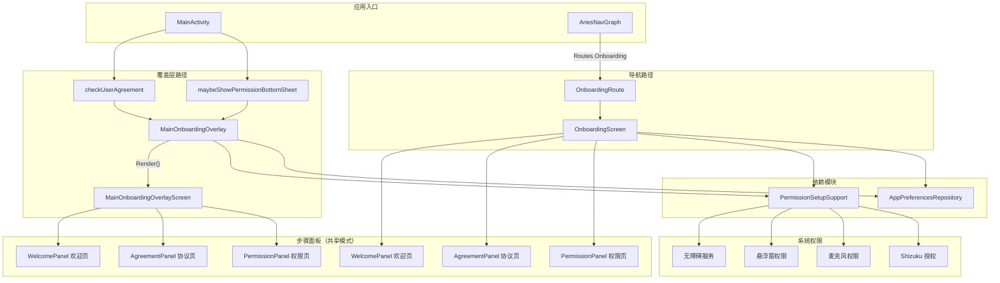
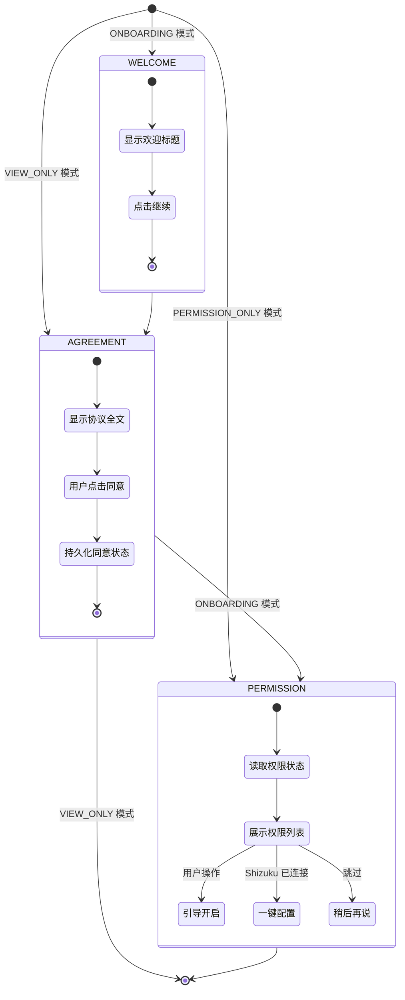
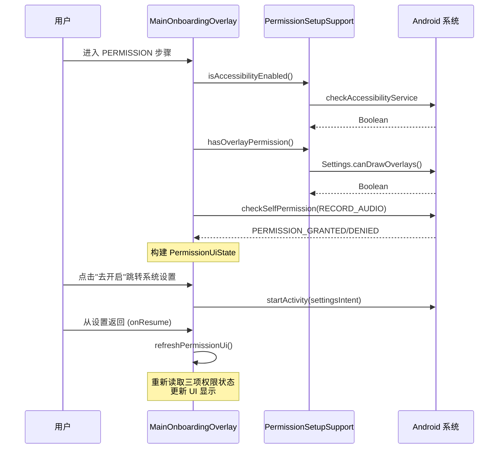


# 引导页 (Onboarding)

Aries AI 的引导页系统负责在用户首次启动应用时引导其完成用户协议阅读和关键权限配置。系统采用双入口架构，同时支持主界面覆盖层和独立导航页面两种展示模式。

## 概述

引导页是 Aries AI 的首次用户体验（FTUE）入口，在用户未接受用户协议或未完成权限设置时自动触发。其主要职责包括：

1. **用户协议展示与确认**：向用户展示基于 AGPL V3 的用户协议，并在获得同意后持久化状态
2. **关键权限引导**：引导用户开启无障碍服务、悬浮窗和麦克风三项关键权限
3. **Shizuku 一键配置**：对于已安装 Shizuku 的用户，提供一键自动配置所有权限的快捷方式
4. **流程模式切换**：支持完整引导（ONBOARDING）、仅权限（PERMISSION_ONLY）和仅查看（VIEW_ONLY）三种模式

引导页系统的设计目标是**最小化用户摩擦**，同时确保法律合规性和功能可用性。系统提供了灵活的跳过机制（"稍后再说"），避免因权限缺失而阻塞用户进入应用。

## 架构

Aries AI 的引导页系统采用**双入口架构**，以适应不同的触发场景：

| 入口 | 实现类 | 使用场景 |
|------|--------|----------|
| **覆盖层模式** | `MainOnboardingOverlay` | 首次启动，作为 HomeScreen 上层渲染 |
| **导航页模式** | `OnboardingScreen` / `OnboardingRoute` | 从设置页、权限引导页等通过导航进入 |



### 架构说明

**双入口设计的原因：**

- **覆盖层模式**：`MainOnboardingOverlay` 在 `MainActivity.onCreate` 中创建，通过 `HomeScreen` 的 `onboardingContent` 参数渲染。选择覆盖层而非导航的原因是：首次启动时用户还未进入任何导航栈，覆盖层可直接叠加在主界面之上，避免额外的导航状态管理。同时，覆盖层可以控制 `drawerGesturesEnabled` 来禁用侧滑抽屉，防止用户绕过引导。

- **导航页模式**：`OnboardingScreen` 作为独立导航目的地注册在 `AriesNavGraph` 中，支持通过 URL 参数 `flow` 传递模式（`onboarding`、`permission_only`、`view_only`）。这种设计允许用户从设置页、权限指南页等位置重新进入引导流程。

**两种实现共享相同的步骤结构（WELCOME → AGREEMENT → PERMISSION），但各自维护独立的 UI 组合函数。** 这是因为覆盖层模式下不需要 `Scaffold`/`TopAppBar` 等导航 chrome 元素，而导航页模式则需要完整的页面框架。

## 核心流程

### 步骤流转

引导页的标准流程分为三个步骤，仅在 `ONBOARDING` 模式下按顺序展示全部三步：



### 权限检查与状态刷新



当用户在 `PERMISSION` 步骤时从系统设置页面返回，`onResume()` 会自动触发权限状态刷新，确保 UI 显示的权限状态与实际保持一致。

### 返回键处理

返回键行为根据流程模式有所不同：

- **ONBOARDING 模式**：回退到上一步（PERMISSION → AGREEMENT → WELCOME），不允许在 WELCOME 步骤退出
- **PERMISSION_ONLY 模式**：直接关闭覆盖层
- **VIEW_ONLY 模式**（导航页）：调用 `navController.popBackStack()` 返回上一页

这种设计确保首次使用的用户必须至少看到欢迎页，无法直接通过返回键跳过整个引导流程。

## 使用示例

### 基本用法：MainActivity 中集成覆盖层

```kotlin
// 1. 声明
private lateinit var onboardingOverlay: MainOnboardingOverlay

// 2. 在 onCreate 中创建
onboardingOverlay = MainOnboardingOverlay(
    activity = this,
    appPrefs = appPrefsRepository,
)

// 3. 在 onResume 中检查并触发
override fun onResume() {
    super.onResume()
    maybeShowPermissionBottomSheet()
    onboardingOverlay.onResume()
}

// 4. 渲染到 HomeScreen
HomeScreen(
    drawerGesturesEnabled = !onboardingOverlay.isShowing(),
    onboardingContent = { onboardingOverlay.Render() },
    // ...
)

// 5. 处理权限请求结果
override fun onRequestPermissionsResult(...) {
    if (onboardingOverlay.onRequestPermissionsResult(requestCode, permissions, grantResults)) {
        return
    }
}
```

> Source: [MainActivity.kt](https://github.com/ZG0704666/Aries-AI/blob/main/app/src/main/java/com/ai/phoneagent/MainActivity.kt#L424-L425) | [MainActivity.kt](https://github.com/ZG0704666/Aries-AI/blob/main/app/src/main/java/com/ai/phoneagent/MainActivity.kt#L670-L673) | [MainActivity.kt](https://github.com/ZG0704666/Aries-AI/blob/main/app/src/main/java/com/ai/phoneagent/MainActivity.kt#L1675-L1685)

### 用户协议检查与触发

```kotlin
private fun checkUserAgreement() {
    if (!prefs.getBoolean("user_agreement_accepted", false)) {
        showUserAgreementDialog()
    }
}

private fun showUserAgreementDialog() {
    onboardingOverlay.showOnboarding()
}
```

> Source: [MainActivity.kt](https://github.com/ZG0704666/Aries-AI/blob/main/app/src/main/java/com/ai/phoneagent/MainActivity.kt#L1114-L1122)

### 仅权限引导模式

```kotlin
fun showPermissionOnlyIfNeeded() {
    if (!appPrefs.getUserAgreementAcceptedBlocking()) return
    if (appPrefs.getPermGuideShownBlocking()) return
    flowMode = FlowMode.PERMISSION_ONLY
    showOverlay(Step.PERMISSION)
}
```

> Source: [MainOnboardingOverlay.kt](https://github.com/ZG0704666/Aries-AI/blob/main/app/src/main/java/com/ai/phoneagent/MainOnboardingOverlay.kt#L141-L146)

### 导航页模式：通过路由进入

```kotlin
// 注册路由 - 支持可选 flow 参数
composable(
    route = Routes.Onboarding.routeWithOptionalFlow,  // "onboarding?flow={flow}"
    arguments = listOf(
        navArgument(Routes.Onboarding.FLOW_ARG) {
            type = NavType.StringType
            nullable = true
            defaultValue = Routes.Onboarding.FLOW_ONBOARDING
        },
    ),
) { entry ->
    OnboardingRoute(
        navController = navController,
        flow = entry.arguments?.getString(Routes.Onboarding.FLOW_ARG),
    )
}
```

> Source: [AriesNavGraph.kt](https://github.com/ZG0704666/Aries-AI/blob/main/app/src/main/java/com/ai/phoneagent/navigation/AriesNavGraph.kt#L63-L78)

### 权限状态读取

```kotlin
private fun readPermissionUiState(): PermissionUiState {
    val accessibilityReady = PermissionSetupSupport.isAccessibilityEnabled(activity)
    val overlayReady = PermissionSetupSupport.hasOverlayPermission(activity)
    val microphoneReady =
        ContextCompat.checkSelfPermission(activity, android.Manifest.permission.RECORD_AUDIO) ==
            android.content.pm.PackageManager.PERMISSION_GRANTED
    return PermissionUiState(accessibilityReady, overlayReady, microphoneReady)
}
```

> Source: [MainOnboardingOverlay.kt](https://github.com/ZG0704666/Aries-AI/blob/main/app/src/main/java/com/ai/phoneagent/MainOnboardingOverlay.kt#L188-L195)

## 流程模式

引导页支持三种流程模式（Flow Mode），通过不同的入口点触发：

| 模式 | 枚举值 | 起始步骤 | 触发场景 |
|------|--------|----------|----------|
| ONBOARDING | `FlowMode.ONBOARDING` | WELCOME | 首次启动，用户未接受协议 |
| PERMISSION_ONLY | `FlowMode.PERMISSION_ONLY` | PERMISSION | 已接受协议但未完成权限引导 |
| VIEW_ONLY | `OnboardingFlowMode.VIEW_ONLY` | AGREEMENT | 从设置页查看用户协议（仅导航页模式） |

### 导航路由参数

导航页模式通过 URL 的 `flow` 参数指定模式：

```
onboarding                    → ONBOARDING（默认）
onboarding?flow=onboarding    → ONBOARDING
onboarding?flow=permission_only → PERMISSION_ONLY
onboarding?flow=view_only     → VIEW_ONLY
```

参数解析逻辑：

```kotlin
fun parseOnboardingFlowMode(raw: String?): OnboardingFlowMode =
    when (raw) {
        "view_only" -> OnboardingFlowMode.VIEW_ONLY
        "permission_only" -> OnboardingFlowMode.PERMISSION_ONLY
        else -> OnboardingFlowMode.ONBOARDING
    }
```

> Source: [OnboardingScreen.kt](https://github.com/ZG0704666/Aries-AI/blob/main/app/src/main/java/com/ai/phoneagent/ui/onboarding/OnboardingScreen.kt#L115-L120)

## 权限管理

### 权限列表

引导页管理三项关键权限：

| 权限 | 系统 API | 用途 |
|------|----------|------|
| 无障碍服务 | `Settings.Secure` 已启用的无障碍服务列表 | 执行点击、滑动、返回等自动化操作 |
| 悬浮窗显示 | `Settings.canDrawOverlays()` | 显示悬浮入口和后台助手界面 |
| 麦克风 | `Manifest.permission.RECORD_AUDIO` | 语音输入和语音识别 |

### 权限状态模型

```kotlin
data class PermissionUiState(
    val accessibilityReady: Boolean,
    val overlayReady: Boolean,
    val microphoneReady: Boolean,
) {
    val allReady: Boolean
        get() = accessibilityReady && overlayReady && microphoneReady
}
```

> Source: [MainOnboardingOverlay.kt](https://github.com/ZG0704666/Aries-AI/blob/main/app/src/main/java/com/ai/phoneagent/MainOnboardingOverlay.kt#L83-L90)

`allReady` 计算属性用于判断是否所有权限都已就绪，这会影响主按钮文案（"一键完成配置" vs "开始使用"）以及是否显示"稍后再说"按钮。

### Shizuku 一键配置

当用户已安装并授权 Shizuku 时，引导页的权限面板顶部会显示 Shizuku 推荐卡片。点击"一键完成配置"按钮时，通过 `PermissionSetupSupport.guideAll()` 调用 Shizuku 服务自动完成无障碍、悬浮窗和麦克风权限的配置：

```kotlin
private fun guideAll() {
    PermissionSetupSupport.guideAll(
        activity = activity,
        requestShizukuPermissionCode = REQ_SHIZUKU_PERMISSION,
        requestMicPermission = { requestMicPermission() },
        onReady = {
            refreshPermissionUi()
            hideOverlay()
        },
        onUiRefresh = { refreshPermissionUi() },
    )
}
```

> Source: [MainOnboardingOverlay.kt](https://github.com/ZG0704666/Aries-AI/blob/main/app/src/main/java/com/ai/phoneagent/MainOnboardingOverlay.kt#L260-L271)

## 步骤面板详解

### 欢迎面板（WelcomePanel）

展示应用名称和简短的引导说明，是 ONBOARDING 模式的入口。包含标题 "欢迎使用 Aries AI" 和描述 "开始前，请先阅读用户协议并完成首次权限设置"，以及"继续"按钮。

### 协议面板（AgreementPanel）

使用 `AndroidView` 嵌入原生 `ScrollView` + `TextView` 来渲染 HTML 格式的用户协议内容。协议内容包括：
- AGPL V3 开源协议条款
- 无担保与责任限制声明
- 用户责任与使用限制
- 隐私政策
- 商业使用与合作规定

点击"同意并继续"按钮后，系统通过 `AppPreferencesRepository.setUserAgreementAccepted(true)` 持久化同意状态。

### 权限面板（PermissionPanel）

使用 `LazyColumn` 展示三项权限的状态卡片，每个卡片包含：
- 权限图标（Smartphone / ExternalLink / Mic）
- 权限名称和描述
- 当前状态（"已就绪"或"待开启"）
- 操作按钮（"已完成"/"去开启"/"去设置"/"授权"）

主按钮文案根据 `allReady` 动态切换：
- 未全部就绪：显示"一键完成配置"
- 全部就绪：显示"开始使用"

当权限未全部就绪或处于 `PERMISSION_ONLY` 模式时，额外显示"稍后再说"次要按钮。

## 步骤动画

引导页使用 Jetpack Compose 的 `AnimatedContent` 实现步骤间的过渡动画：

- **前进动画**：新内容从右侧滑入（`slideInHorizontally`），旧内容向左滑出
- **后退动画**：新内容从左侧滑入，旧内容向右滑出
- **渐入渐出**：结合 `fadeIn` / `fadeOut` 增强过渡效果
- **进度条**：使用 `animateFloatAsState` 实现滑动动画，动画时长 420ms，缓动曲线为 `FastOutSlowInEasing`

> Source: [MainOnboardingOverlay.kt](https://github.com/ZG0704666/Aries-AI/blob/main/app/src/main/java/com/ai/phoneagent/MainOnboardingOverlay.kt#L304-L314) | [OnboardingScreen.kt](https://github.com/ZG0704666/Aries-AI/blob/main/app/src/main/java/com/ai/phoneagent/ui/onboarding/OnboardingScreen.kt#L260-L275)

## 状态持久化

引导页通过 `AppPreferencesRepository` 管理两个关键持久化标记：

| 标记 | 存储键 | 作用 |
|------|--------|------|
| 用户协议已接受 | `userAgreementAccepted` | 阻止重复弹出完整引导流程 |
| 权限引导已展示 | `permGuideShown` | 阻止在 `onResume` 时重复弹出仅权限引导 |

这两个标记在覆盖层和导航页两种模式中共享，确保无论通过哪个入口完成引导，都不会重复触发。

## API 参考

### MainOnboardingOverlay

```kotlin
class MainOnboardingOverlay(
    private val activity: AppCompatActivity,
    private val appPrefs: AppPreferencesRepository,
)
```

> Source: [MainOnboardingOverlay.kt](https://github.com/ZG0704666/Aries-AI/blob/main/app/src/main/java/com/ai/phoneagent/MainOnboardingOverlay.kt#L68-L71)

**主要方法：**

| 方法 | 描述 |
|------|------|
| `fun Render(): @Composable` | 渲染覆盖层 UI |
| `fun showOnboarding()` | 显示完整引导流程（WELCOME 步骤开始） |
| `fun showPermissionOnlyIfNeeded()` | 条件性地显示仅权限引导 |
| `fun onResume()` | Activity resume 时调用，刷新权限状态 |
| `fun onRequestPermissionsResult(...): Boolean` | 处理麦克风权限请求结果 |
| `fun isShowing(): Boolean` | 返回覆盖层是否正在显示 |

**内部枚举：**

- `FlowMode { ONBOARDING, PERMISSION_ONLY }` — 流程模式
- `Step { WELCOME, AGREEMENT, PERMISSION }` — 步骤定义

**内部数据类：**

- `PermissionUiState(accessibilityReady, overlayReady, microphoneReady)` — 权限状态，提供 `allReady` 计算属性

### OnboardingScreen（导航页模式）

```kotlin
@Composable
fun OnboardingRoute(
    navController: NavController,
    flow: String?,
    appPreferencesRepository: AppPreferencesRepository = koinInject(),
)
```

> Source: [OnboardingScreen.kt](https://github.com/ZG0704666/Aries-AI/blob/main/app/src/main/java/com/ai/phoneagent/ui/onboarding/OnboardingScreen.kt#L122-L134)

```kotlin
@Composable
fun OnboardingScreen(
    flowMode: OnboardingFlowMode,
    appPreferencesRepository: AppPreferencesRepository,
    onBack: () -> Unit,
    onDone: () -> Unit,
)
```

> Source: [OnboardingScreen.kt](https://github.com/ZG0704666/Aries-AI/blob/main/app/src/main/java/com/ai/phoneagent/ui/onboarding/OnboardingScreen.kt#L137-L143)

### 路由定义

```kotlin
data object Onboarding : Routes("onboarding") {
    const val FLOW_ARG = "flow"
    const val FLOW_ONBOARDING = "onboarding"
    const val FLOW_VIEW_ONLY = "view_only"
    const val FLOW_PERMISSION_ONLY = "permission_only"

    val routeWithOptionalFlow: String = "onboarding?flow={flow}"

    fun withFlow(flow: String): String = "onboarding?flow=$flow"
}
```

> Source: [Routes.kt](https://github.com/ZG0704666/Aries-AI/blob/main/app/src/main/java/com/ai/phoneagent/navigation/Routes.kt#L12-L21)

## 相关链接

### 源文件

- [MainOnboardingOverlay.kt](https://github.com/ZG0704666/Aries-AI/blob/main/app/src/main/java/com/ai/phoneagent/MainOnboardingOverlay.kt) — 覆盖层模式引导页实现
- [OnboardingScreen.kt](https://github.com/ZG0704666/Aries-AI/blob/main/app/src/main/java/com/ai/phoneagent/ui/onboarding/OnboardingScreen.kt) — 导航页模式引导页实现
- [Routes.kt](https://github.com/ZG0704666/Aries-AI/blob/main/app/src/main/java/com/ai/phoneagent/navigation/Routes.kt) — 路由定义
- [AriesNavGraph.kt](https://github.com/ZG0704666/Aries-AI/blob/main/app/src/main/java/com/ai/phoneagent/navigation/AriesNavGraph.kt) — 导航图注册
- [MainActivity.kt](https://github.com/ZG0704666/Aries-AI/blob/main/app/src/main/java/com/ai/phoneagent/MainActivity.kt) — 引导页集成入口
- [PermissionSetupSupport.kt](https://github.com/ZG0704666/Aries-AI/blob/main/feature/settings/src/main/java/com/ai/phoneagent/PermissionSetupSupport.kt) — 权限操作支持工具
- [onboarding_strings.xml](https://github.com/ZG0704666/Aries-AI/blob/main/feature/settings/src/main/res/values/onboarding_strings.xml) — 引导页字符串资源
- [HomeScreen.kt](https://github.com/ZG0704666/Aries-AI/blob/main/app/src/main/java/com/ai/phoneagent/ui/home/HomeScreen.kt) — 主界面（承载引导覆盖层）

### 相关文档

- [权限引导 (Permission Guide)](./permission-guide) — 独立的权限引导页面
- [用户协议 (User Agreement)](./user-agreement) — 用户协议独立查看页面
- [设置 (Settings)](./settings) — 应用设置页面
