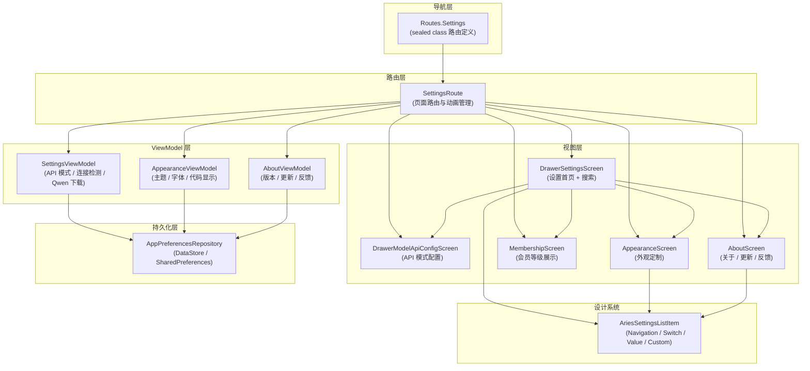
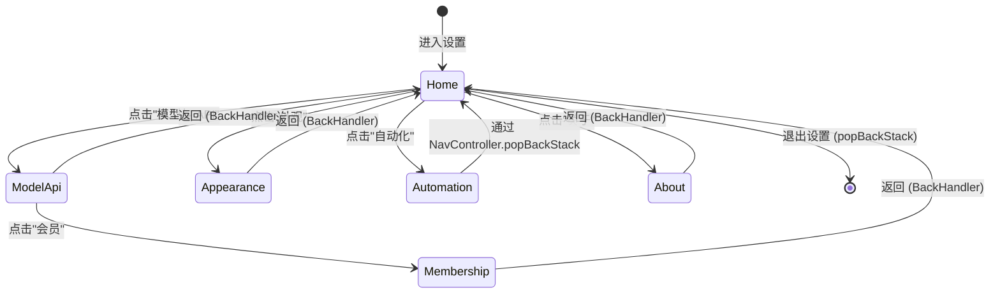
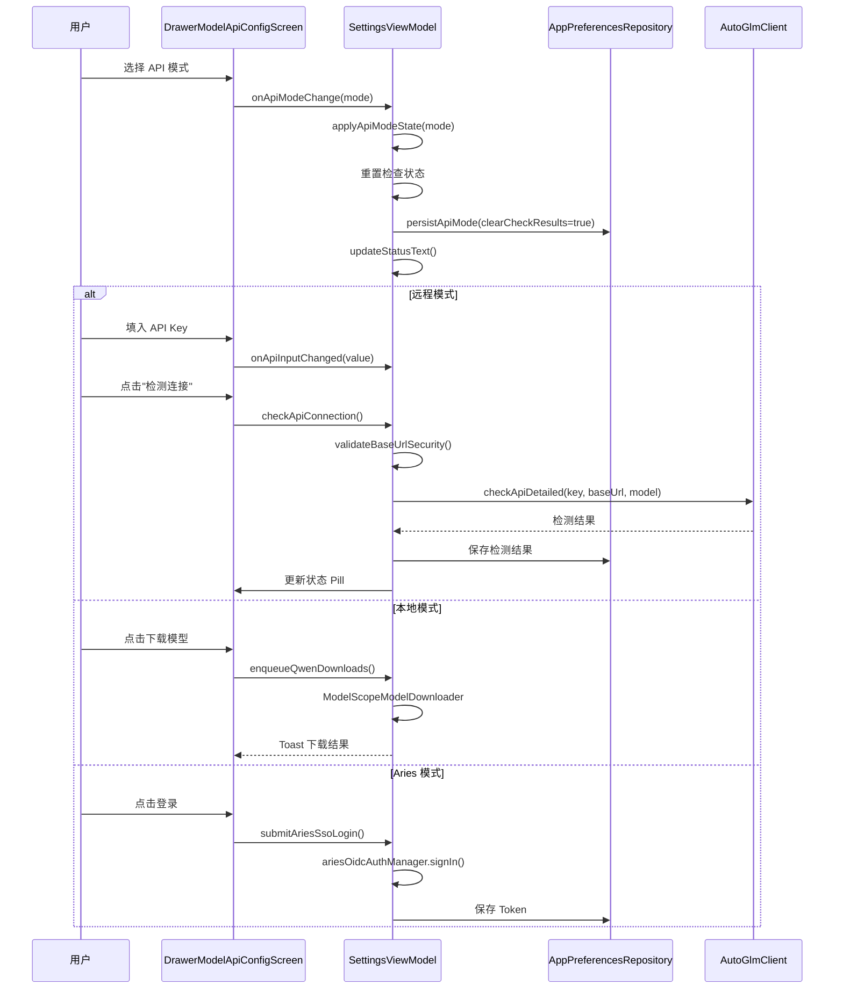
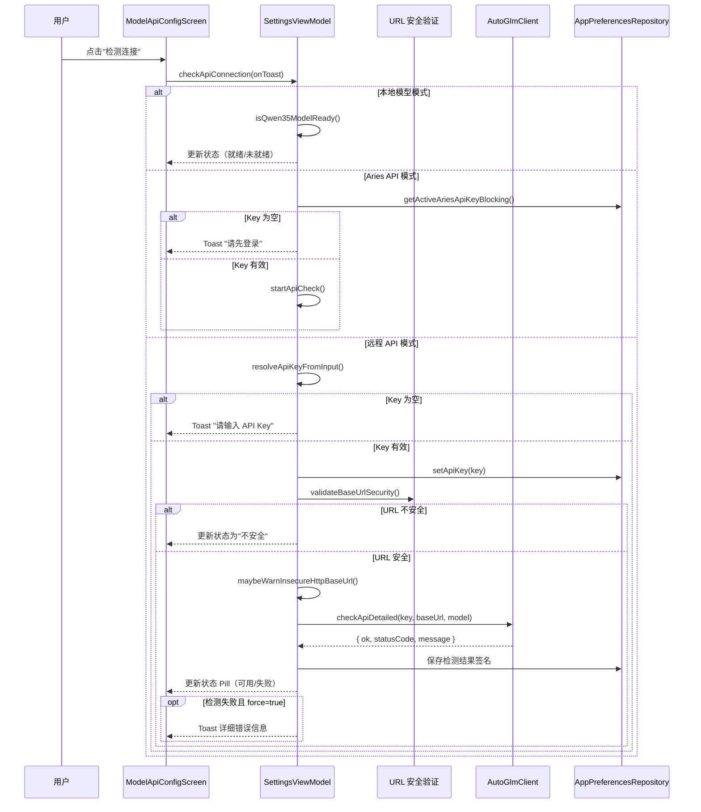
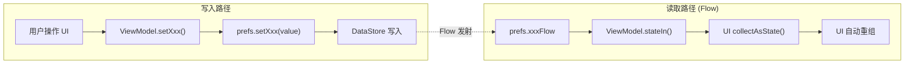

# 设置界面体系

Aries-AI 的设置界面体系是一套基于 Jetpack Compose 的多页面设置系统，为应用提供统一的用户偏好管理、API 配置、外观定制、会员体系和关于信息的入口。

## 概述

设置界面体系采用**单一路由多子页面**的架构设计。`SettingsRoute` 作为顶层路由入口，通过 `AnimatedContent` 实现页面间的平滑动画切换，内部管理五个子页面：首页（Home）、模型与 API 配置（ModelApi）、会员（Membership）、外观（Appearance）和关于（About）。

**核心设计原则：**

- **路由集中管理**：`SettingsRoute` 负责所有子页面之间的导航，使用 `SettingsViewModel.SettingsPage` 枚举驱动页面切换
- **页面动画一致**：所有子页面切换均使用水平滑动动画（`slideInHorizontally` + `fadeIn`），通过 `pageTransitionForward` 控制方向
- **状态持久化**：所有设置项通过 `AppPreferencesRepository` 持久化到本地存储，支持跨页面和跨会话恢复
- **MVVM 分层**：每个子页面有独立的 ViewModel，遵循单向数据流原则，UI 仅消费状态并转发用户事件
- **设计系统复用**：抽取 `AriesSettingsListItem` 系列组件提供统一的设置行样式

## 架构

设置界面体系由三层组成：**路由层**管理页面导航，**视图层**提供具体的 UI 渲染，**ViewModel 层**处理业务逻辑和状态管理。



**架构说明：**

- **路由层**：`SettingsRoute` 是设置体系的唯一入口，通过 `Sealed Class Routes.Settings` 定义路由路径。所有子页面都在此路由内通过 `AnimatedContent` 管理，无需额外的 Navigation 栈操作，简化了回退逻辑
- **ViewModel 层**：`SettingsViewModel` 是核心，管理 API 模式切换、连接检测和本地模型下载；`AppearanceViewModel` 管理主题和字体偏好；`AboutViewModel` 管理版本信息和更新检测
- **视图层**：每个页面都是独立的 Composable 函数，通过回调函数与 ViewModel 通信，保持 UI 的纯展示性
- **设计系统**：`AriesSettingsListItem` 提供四种标准的设置行组件，确保整个设置界面的视觉一致性
- **持久化层**：`AppPreferencesRepository` 封装了所有偏好设置的读写，使用 Kotlin Flow 实现响应式状态更新

## 页面体系与导航流

设置界面支持五个子页面之间的导航，页面切换由 `SettingsViewModel.SettingsPage` 枚举驱动：



> Source: [SettingsRoute.kt](https://github.com/ZG0704666/Aries-AI/blob/main/app/src/main/java/com/ai/phoneagent/ui/settings/SettingsRoute.kt#L69-L248)

**设计要点：**

- **Home 页面**是设置体系的根页面，展示分组的设置入口卡片，支持搜索过滤
- **ModelApi/Apperance/About** 等子页面使用 `BackHandler` 拦截系统返回键，统一回到 Home 而非退出设置
- **Automation** 页面比较特殊——它通过 `navController.navigate(Routes.Automation.route)` 直接跳转到独立路由，跳出 Settings 体系
- 页面切换时通过 `pageTransitionForward` 控制动画方向：进入子页面向右滑动（forward），返回 Home 向左滑动（backward）

## 核心组件

### SettingsRoute — 路由控制器

`SettingsRoute` 是设置体系的顶层 Composable，负责页面切换和生命周期管理。

> Source: [SettingsRoute.kt](https://github.com/ZG0704666/Aries-AI/blob/main/app/src/main/java/com/ai/phoneagent/ui/settings/SettingsRoute.kt#L69-L141)

```kotlin
@Composable
fun SettingsRoute(
    navController: NavController,
    viewModel: SettingsViewModel = koinViewModel(),
) {
    // 生命周期感知：恢复时刷新状态
    DisposableEffect(lifecycleOwner, viewModel) {
        val observer = LifecycleEventObserver { _, event ->
            if (event == Lifecycle.Event.ON_RESUME) {
                viewModel.refreshLocalModelState()
                viewModel.restoreSettings()
            }
        }
        lifecycleOwner.lifecycle.addObserver(observer)
        onDispose { lifecycleOwner.lifecycle.removeObserver(observer) }
    }

    // 子页面拦截系统返回键
    val isSubPage = viewModel.currentPage != SettingsViewModel.SettingsPage.Home
    if (isSubPage) {
        BackHandler { viewModel.openHomePage() }
    }

    // 动画驱动的页面切换
    AnimatedContent(
        targetState = viewModel.currentPage,
        transitionSpec = {
            if (viewModel.pageTransitionForward) {
                slideInHorizontally(animationSpec = tween(260), initialOffsetX = { it })
                    + fadeIn(animationSpec = tween(220)) togetherWith
                    slideOutHorizontally(animationSpec = tween(260), targetOffsetX = { -it })
                    + fadeOut(animationSpec = tween(220))
            } else {
                // 反向动画
                slideInHorizontally(animationSpec = tween(260), initialOffsetX = { -it })
                    + fadeIn(animationSpec = tween(220)) togetherWith
                    slideOutHorizontally(animationSpec = tween(260), targetOffsetX = { it })
                    + fadeOut(animationSpec = tween(220))
            }
        },
        label = "settingsPageTransition",
    ) { page ->
        when (page) {
            SettingsViewModel.SettingsPage.Home -> DrawerSettingsScreen(...)
            SettingsViewModel.SettingsPage.ModelApi -> DrawerModelApiConfigScreen(...)
            SettingsViewModel.SettingsPage.Membership -> MembershipScreen(...)
            SettingsViewModel.SettingsPage.Appearance -> AppearanceScreen(...)
            SettingsViewModel.SettingsPage.About -> SettingsAboutContent(...)
        }
    }
}
```

**设计意图：**
- `DisposableEffect` 确保每次页面恢复时（`ON_RESUME`）刷新本地模型状态并恢复持久化的设置，避免设置变更后不同步的问题
- `BackHandler` 仅在子页面激活时拦截返回键，跳转到 Home 而非直接退出，提升用户体验
- `AnimatedContent` 的 `transitionSpec` 根据 `pageTransitionForward` 动态切换动画方向，实现"进入向右、返回向左"的自然过渡

### DrawerSettingsScreen — 设置首页

设置首页采用分组卡片布局，包含搜索过滤功能，是用户进入设置后首先看到的界面。

> Source: [DrawerSettingsScreen.kt](https://github.com/ZG0704666/Aries-AI/blob/main/app/src/main/java/com/ai/phoneagent/ui/settings/DrawerSettingsScreen.kt#L101-L242)

```kotlin
@Composable
fun DrawerSettingsScreen(
    onBack: () -> Unit,
    onOpenAppearance: () -> Unit,
    onOpenModelApi: () -> Unit,
    onOpenAutomation: () -> Unit,
    onOpenAbout: () -> Unit,
) {
    var searchQuery by rememberSaveable { mutableStateOf("") }

    val entries = listOf(
        SettingsEntryUi(SettingsEntryType.Appearance, ...),
        SettingsEntryUi(SettingsEntryType.ModelApi, ...),
        SettingsEntryUi(SettingsEntryType.Automation, ...),
        SettingsEntryUi(SettingsEntryType.About, ...),
    )

    val filteredEntries = entries.filter { entry ->
        query.isBlank() || entry.title.contains(query, ignoreCase = true)
                || entry.subtitle.contains(query, ignoreCase = true)
    }

    // 分组展示（无搜索时）或搜索结果展示
    Scaffold(...) {
        LazyColumn {
            item { SettingsSearchField(value = searchQuery, ...) }
            if (searchQuery.isBlank()) {
                sections.forEach { section ->
                    item { SettingsSectionCard(title = section.title, entries = section.entries, ...) }
                }
            } else {
                item { SettingsSectionCard(title = "搜索结果", entries = filteredEntries, ...) }
            }
            if (filteredEntries.isEmpty()) {
                item { SettingsEmptySearchState(text = "未找到匹配的设置项") }
            }
        }
    }
}
```

**设计意图：**
- `rememberSaveable` 保存搜索查询状态，配置变更（如旋转屏幕）时不会丢失
- 搜索仅在 `title` 和 `subtitle` 中进行忽略大小写的匹配，简单高效
- 无搜索时按分组展示（外观 / 模型与自动化 / 关于）；有搜索时切换为扁平搜索结果
- 空搜索结果提供明确的空状态提示，避免用户困惑

### DrawerModelApiConfigScreen — API 配置页面

这是设置体系中最复杂的子页面，提供四种 API 模式的切换和配置。

> Source: [DrawerSettingsScreen.kt](https://github.com/ZG0704666/Aries-AI/blob/main/app/src/main/java/com/ai/phoneagent/ui/settings/DrawerSettingsScreen.kt#L412-L796)

**四种 API 模式：**

| 模式 | 枚举值 | 说明 |
|------|--------|------|
| 官方 API | `ApiMode.Official` | 使用智谱官方 API，需填入 API Key |
| 第三方 API | `ApiMode.ThirdParty` | 兼容 OpenAI 格式的第三方 API，支持自定义 Base URL 和模型名 |
| 本地模型 | `ApiMode.Local` | 使用 Qwen3.5 本地模型，需下载模型文件（隐藏特性） |
| Aries API | `ApiMode.Aries` | 使用 Aries 自有 API，需通过 SSO 登录（隐藏特性） |

**模式切换流程：**



### AppearanceScreen — 外观设置

外观设置页面提供主题模式、配色方案、字体大小和代码显示选项的完整定制能力。

> Source: [AppearanceScreen.kt](https://github.com/ZG0704666/Aries-AI/blob/main/app/src/main/java/com/ai/phoneagent/ui/settings/AppearanceScreen.kt#L58-L321)

**外观配置项一览：**

| 配置项 | 类型 | 可选值 | 默认值 | 说明 |
|--------|------|--------|--------|------|
| 主题模式 | `ThemeMode` | SYSTEM / LIGHT / DARK | SYSTEM | 跟随系统 / 浅色 / 深色 |
| AMOLED 纯黑 | `Boolean` | true / false | false | 深色模式下启用纯黑背景（仅深色模式可用） |
| 配色方案 | `ThemeColorStyle` | DEFAULT / OCEAN / FOREST / SUNSET / ROSE / DYNAMIC | DEFAULT | 六种 Material You 风格调色板 |
| 字体大小 | `Float` | 0.8× ~ 1.4×（步进 0.2） | 1.0× | 聊天消息字体缩放 |
| 字体样式 | `String` | default / sans_serif / serif / monospace | default | 聊天字体族 |
| 代码自动换行 | `Boolean` | true / false | true | 代码块超宽时自动换行 |
| 代码行号 | `Boolean` | true / false | true | 代码块显示行号 |
| 代码自动折叠 | `Boolean` | true / false | false | 长代码块默认折叠 |

**设计亮点：**

- 主题模式使用 `SingleChoiceSegmentedButtonRow` 实现 iOS 风格的三段式选择器
- 配色方案提供色块预览（`ThemeAccentSwatch`），展示 primary / secondary / tertiary 三种强调色
- `DYNAMIC` 配色方案仅在 Android 12+ (API 31+) 设备上可用（Monet 动态取色）
- AMOLED 纯黑开关仅在深色主题激活时可用（`enabled = isDarkThemeActive`）

### MembershipScreen — 会员页面

会员页面展示三级订阅方案（Basic / Pro / Ultimate），包含价格卡片和功能对比表格。

> Source: [MembershipScreen.kt](https://github.com/ZG0704666/Aries-AI/blob/main/app/src/main/java/com/ai/phoneagent/ui/settings/MembershipScreen.kt#L61-L172)

```kotlin
private enum class MembershipTier {
    Basic,
    Pro,
    Ultimate,
}

// 功能对比维度
private data class FeatureRow(
    val label: String,        // 功能名称（如"每日任务数"）
    val basic: String,        // Basic 等级的值
    val pro: String,          // Pro 等级的值
    val ultimate: String,     // Ultimate 等级的值
)
```

**设计意图：**
- 三级方案卡片使用不同的容器颜色区分：Basic 使用 `surface`，Pro 使用 `primaryContainer`（30% 透明度），Ultimate 使用 `tertiaryContainer`
- Pro 等级标记为"推荐"：通过 `BorderStroke(2.dp, primary)` 高亮边框 + "推荐"标签（`primary` 色背景的 `Surface`）
- 当前方案显示禁用状态的 `OutlinedButton`（文字"当前方案"），其余方案显示可点击的 `Button`
- 功能对比表格中 Pro 列高亮显示（`primaryContainer` 背景），引导用户选择 Pro

### AboutScreen — 关于页面

关于页面展示应用信息、运行环境、操作入口和开发者信息。

> Source: [AboutScreen.kt](https://github.com/ZG0704666/Aries-AI/blob/main/feature/settings/src/main/java/com/ai/phoneagent/ui/AboutScreen.kt#L55-L206)

**关于页面功能入口：**

| 入口 | 功能 | 实现方式 |
|------|------|----------|
| Hero 区域 | 应用图标 + 名称 + 版本号 | 点击触发开发者模式（连击 5 次切换本地模型下载按钮） |
| 运行信息 | Prompt 版本 | Value 行展示 |
| 检查更新 | 拉取最新 Release 信息 | `ReleaseRepository.fetchLatestReleaseResilient()` |
| 更新日志 | 导航到 UpdateHistory 页面 | `navController.navigate(Routes.UpdateHistory)` |
| 源代码 | 打开 GitHub 仓库 | `Intent.ACTION_VIEW` 打开浏览器 |
| 任务反馈 | 导出脱敏日志包并分享 | `FeedbackLogExporter.exportSanitizedBundle()` |
| 用户协议 | 导航到 UserAgreement 页面 | `navController.navigate(Routes.UserAgreement)` |
| 开源许可 | 导航到 Licenses 页面 | `navController.navigate(Routes.Licenses)` |
| 官方网站 | 打开项目网站 | `Intent.ACTION_VIEW` |
| 联系我们 | 复制邮箱到剪贴板 | `ClipboardManager.setPrimaryClip()` |
| 版权信息 | 显示版权 + 开发者 + 别名 | 别名点击 20 次解锁 Aries API 隐藏功能 |

## 隐藏特性机制

设置体系中包含两个通过"连击"触发的隐藏特性，设计精巧且具有趣味性：

### 开发者模式（本地模型下载按钮）

> Source: [AboutViewModel.kt](https://github.com/ZG0704666/Aries-AI/blob/main/app/src/main/java/com/ai/phoneagent/viewmodel/AboutViewModel.kt#L91-L115)

- **触发方式**：在关于页面的 Hero 区域（应用图标/名称区域）快速连击 5 次
- **触发条件**：每次点击间隔 ≤ 1200ms（`localModelDownloadToggleTapIntervalMs`）
- **效果**：切换本地模型下载按钮的可见性，Toast 提示当前状态

### Aries API 区段解锁

> Source: [AboutViewModel.kt](https://github.com/ZG0704666/Aries-AI/blob/main/app/src/main/java/com/ai/phoneagent/viewmodel/AboutViewModel.kt#L117-L145)

- **触发方式**：在关于页面底部的别名文本 "xuanyu.xyla" 上快速连击 20 次
- **触发条件**：每次点击间隔 ≤ 1200ms（`ariesApiUnlockTapIntervalMs`）
- **效果**：解锁 `ApiMode.Local` 和 `ApiMode.Aries` 选项，`AppPreferencesRepository` 中的 `ariesApiSectionUnlockedFlow` 会实时通知 `SettingsViewModel` 更新可见性

## 核心流程序列

### API 连接检测流程



**设计要点：**
- `apiCheckSeq` 序列号机制确保过时请求的结果不会覆盖当前状态（用户快速切换模式时）
- `apiConfigSignature` 基于 API Key + Base URL + Model 的哈希签名，用于判断配置是否变更，避免不必要的重复检测
- URL 安全验证检查 scheme 是否为 `https` 或 `http`，对非本地 HTTP 连接发出警告

### 偏好设置响应式同步



所有偏好设置使用 Kotlin Flow 实现响应式同步，保证设置变更后所有观察者（包括浮动聊天窗口等外部组件）实时更新。

## 设计系统组件

设置界面使用了统一的设计系统组件 `AriesSettingsListItem`，提供四种标准行样式：

> Source: [AriesSettingsListItem.kt](https://github.com/ZG0704666/Aries-AI/blob/main/core/designsystem/src/main/java/com/ai/phoneagent/core/designsystem/theme/AriesSettingsListItem.kt#L42-L262)

| 组件 | 用途 | 尾部控件 |
|------|------|----------|
| `AriesSettingsNavigationItem` | 导航到子页面的设置行 | 右箭头图标 (180° 旋转的返回箭头) |
| `AriesSettingsSwitchItem` | 开关型设置行 | `Switch` 组件，点击整行翻转 |
| `AriesSettingsValueItem` | 展示当前值的设置行 | 文本值展示，可点击 |
| `AriesSettingsCustomItem` | 自定义控件的设置行 | 任意 Composable（如 `Slider`、`SegmentedButton`） |
| `AriesSettingsSectionHeader` | 分组标题 | 无，`primary` 色的 `labelMedium` 文本 |

**设计意图：**
- 所有组件基于 `androidx.compose.material3.ListItem`，无 Card 包裹、无 elevation 阴影、无边框，确保扁平化 Material 3 风格
- 颜色全部由 `MaterialTheme` 令牌驱动，不硬编码，自动适配浅色/深色主题
- 行内点击区域覆盖整行（`clickable` + `fillMaxWidth`），符合 Android 原生设置的习惯

## 配置选项

### SettingsViewModel 核心状态

> Source: [SettingsViewModel.kt](https://github.com/ZG0704666/Aries-AI/blob/main/app/src/main/java/com/ai/phoneagent/viewmodel/SettingsViewModel.kt#L25-L161)

| 状态属性 | 类型 | 默认值 | 说明 |
|----------|------|--------|------|
| `currentPage` | `SettingsPage` | `Home` | 当前显示的设置页面 |
| `pageTransitionForward` | `Boolean` | `true` | 页面切换动画方向（前进/后退） |
| `currentApiMode` | `ApiMode` | `Official` | 当前 API 模式 |
| `apiInputText` | `String` | `""` | API Key 输入框显示文本（脱敏后） |
| `apiBaseUrlText` | `String` | `AutoGlmClient.DEFAULT_BASE_URL` | 第三方 API Base URL |
| `apiModelText` | `String` | `AutoGlmClient.DEFAULT_MODEL` | 第三方 API 模型名 |
| `apiStatusText` | `String` | `"未检测"` | API 连接状态文字 |
| `apiStatusPositive` | `Boolean` | `false` | API 状态是否为正面（可用） |
| `qwenButtonText` | `String` | `"下载 Qwen 模型"` | Qwen 下载按钮文字 |
| `qwenButtonEnabled` | `Boolean` | `true` | Qwen 下载按钮是否可用 |
| `showAriesApiSection` | `Boolean` | `false` | Aries API 区段可见性（隐藏特性） |
| `localModelReady` | `Boolean` | `false` | 本地模型是否就绪 |

### AppearanceViewModel 偏好配置

> Source: [AppearanceViewModel.kt](https://github.com/ZG0704666/Aries-AI/blob/main/app/src/main/java/com/ai/phoneagent/viewmodel/AppearanceViewModel.kt#L15-L128)

| 偏好项 | Flow 源 | 默认值 | 说明 |
|--------|---------|--------|------|
| `themeMode` | `prefs.themeModeFlow` | `SYSTEM` | 主题模式 (system/light/dark) |
| `themeColorStyle` | `prefs.themeColorStyleFlow` | `DEFAULT` | 配色方案 |
| `amoledDarkEnabled` | `prefs.amoledDarkEnabledFlow` | `false` | AMOLED 纯黑模式 |
| `chatFontScale` | `prefs.chatFontScaleFlow` | `1.0f` | 聊天字体缩放比例 (0.8~1.4) |
| `chatFontFamily` | `prefs.chatFontFamilyFlow` | `"default"` | 聊天字体族 |
| `codeAutoWrap` | `prefs.codeAutoWrapFlow` | `true` | 代码自动换行 |
| `codeLineNumbers` | `prefs.codeLineNumbersFlow` | `true` | 代码行号显示 |
| `codeAutoCollapse` | `prefs.codeAutoCollapseFlow` | `false` | 代码自动折叠 |

## API 参考

### SettingsViewModel

> Source: [SettingsViewModel.kt](https://github.com/ZG0704666/Aries-AI/blob/main/app/src/main/java/com/ai/phoneagent/viewmodel/SettingsViewModel.kt#L25-L782)

#### `restoreSettings()`
从 `AppPreferencesRepository` 恢复所有持久化的设置状态，包括 API Key（脱敏显示）、API 模式、Aries 登录状态等。

#### `onApiModeChange(mode: ApiMode, onToast: (String) -> Unit)`
切换 API 模式。会重置 API 检测状态（`remoteApiOk = null`、清空 `lastCheckedApiKey`），并将新模式持久化。若切换到本地模式且模型未就绪，Toast 提示用户。

#### `checkApiConnection(onToast: (String) -> Unit)`
根据当前模式检测 API 可用性：
- 本地模式：检查 `ModelScopeModelDownloader.isQwen35ModelReady()`
- Aries 模式：验证 Key 存在后调用 `startApiCheck()`
- 远程模式：解析输入框中的 Key，通过 `AutoGlmClient.checkApiDetailed()` 检测

#### `enqueueQwenDownloads(onToast: (String) -> Unit)`
触发 Qwen3.5 本地模型下载。使用 `ModelScopeModelDownloader.enqueueQwen35Downloads()` 执行下载，`qwenDownloadInFlight` 防止重复提交。

#### `resolveApiKeyFromInput(): String`
从输入框文本中解析真实的 API Key。处理逻辑：若输入框显示脱敏文本（包含 `*`），则从持久化存储中获取原始 Key。

#### `maskKey(raw: String): String`
对 API Key 进行脱敏处理：保留前 4 位和后 4 位，中间用 `*` 替代。

#### `validateBaseUrlSecurity(baseUrl: String): String?`
验证 Base URL 的安全性：检查 scheme 是否为 `http` 或 `https`，host 是否非空。

### AppearanceViewModel

> Source: [AppearanceViewModel.kt](https://github.com/ZG0704666/Aries-AI/blob/main/app/src/main/java/com/ai/phoneagent/viewmodel/AppearanceViewModel.kt#L15-L128)

| 方法 | 参数 | 说明 |
|------|------|------|
| `setThemeMode` | `value: ThemeMode` | 设置主题模式 (SYSTEM/LIGHT/DARK) |
| `setThemeColorStyle` | `value: ThemeColorStyle` | 设置配色方案 |
| `setAmoledDarkEnabled` | `value: Boolean` | 设置 AMOLED 纯黑开关 |
| `setChatFontScale` | `value: Float` | 设置聊天字体缩放 (0.8~1.4) |
| `setChatFontFamily` | `value: String` | 设置聊天字体族 |
| `setCodeAutoWrap` | `value: Boolean` | 设置代码自动换行 |
| `setCodeLineNumbers` | `value: Boolean` | 设置代码行号 |
| `setCodeAutoCollapse` | `value: Boolean` | 设置代码自动折叠 |

所有 setter 方法均通过 `viewModelScope.launch { prefs.setXxx(value) }` 异步持久化，同时通过 Flow 自动通知 UI 更新。

## 相关链接

### 源文件

- [SettingsRoute.kt](https://github.com/ZG0704666/Aries-AI/blob/main/app/src/main/java/com/ai/phoneagent/ui/settings/SettingsRoute.kt) — 设置路由控制器
- [DrawerSettingsScreen.kt](https://github.com/ZG0704666/Aries-AI/blob/main/app/src/main/java/com/ai/phoneagent/ui/settings/DrawerSettingsScreen.kt) — 设置首页 + ModelApi 配置页
- [AppearanceScreen.kt](https://github.com/ZG0704666/Aries-AI/blob/main/app/src/main/java/com/ai/phoneagent/ui/settings/AppearanceScreen.kt) — 外观设置页
- [MembershipScreen.kt](https://github.com/ZG0704666/Aries-AI/blob/main/app/src/main/java/com/ai/phoneagent/ui/settings/MembershipScreen.kt) — 会员页
- [AboutScreen.kt](https://github.com/ZG0704666/Aries-AI/blob/main/feature/settings/src/main/java/com/ai/phoneagent/ui/AboutScreen.kt) — 关于页
- [AboutRoute.kt](https://github.com/ZG0704666/Aries-AI/blob/main/app/src/main/java/com/ai/phoneagent/ui/settings/AboutRoute.kt) — 关于路由（独立版本）
- [SettingsViewModel.kt](https://github.com/ZG0704666/Aries-AI/blob/main/app/src/main/java/com/ai/phoneagent/viewmodel/SettingsViewModel.kt) — 设置核心 ViewModel
- [AppearanceViewModel.kt](https://github.com/ZG0704666/Aries-AI/blob/main/app/src/main/java/com/ai/phoneagent/viewmodel/AppearanceViewModel.kt) — 外观 ViewModel
- [AboutViewModel.kt](https://github.com/ZG0704666/Aries-AI/blob/main/app/src/main/java/com/ai/phoneagent/viewmodel/AboutViewModel.kt) — 关于 ViewModel
- [AriesSettingsListItem.kt](https://github.com/ZG0704666/Aries-AI/blob/main/core/designsystem/src/main/java/com/ai/phoneagent/core/designsystem/theme/AriesSettingsListItem.kt) — 设计系统设置行组件
- [Routes.kt](https://github.com/ZG0704666/Aries-AI/blob/main/app/src/main/java/com/ai/phoneagent/navigation/Routes.kt) — 导航路由定义
- [ThemeMode.kt](https://github.com/ZG0704666/Aries-AI/blob/main/core/designsystem/src/main/java/com/ai/phoneagent/core/designsystem/theme/ThemeMode.kt) — 主题模式枚举
- [ThemeColorStyle.kt](https://github.com/ZG0704666/Aries-AI/blob/main/core/designsystem/src/main/java/com/ai/phoneagent/core/designsystem/theme/ThemeColorStyle.kt) — 配色方案枚举

### 相关文档

- [自动化控制界面](./automation) — Automation 页面详情
- [导航体系](./navigation) — 应用导航架构
- [设计系统主题](./design-system-theme) — AriesMaterialTheme 主题体系
