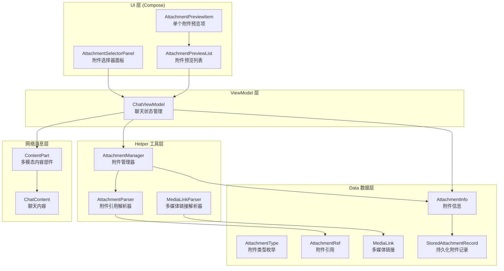
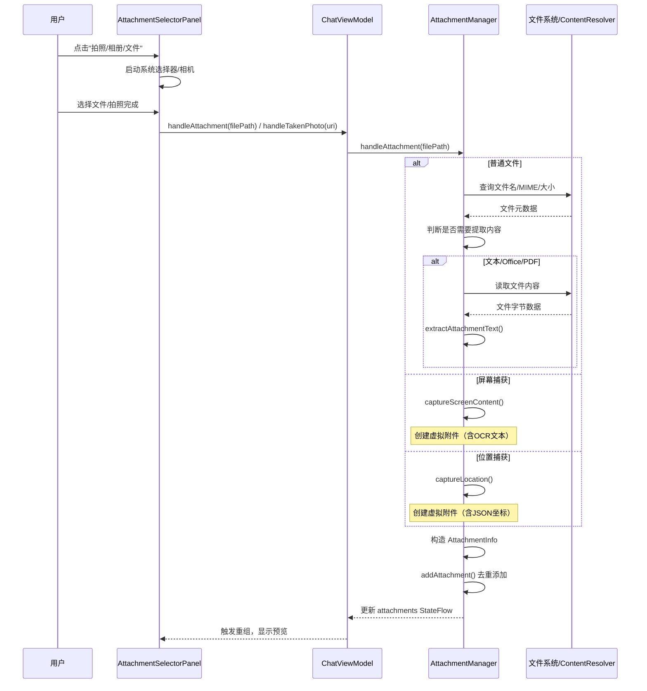
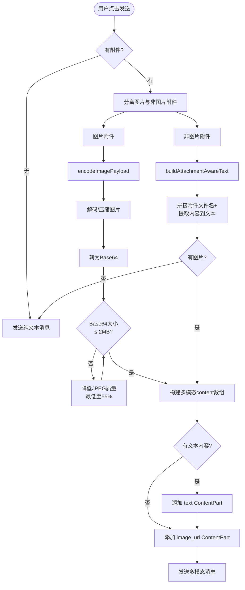


# 附件组件与文件展示

Aries-AI 的附件系统为聊天交互提供了丰富的多模态输入能力，支持图片、文件、相机拍照、屏幕内容捕获及位置信息等多种附件类型，并通过与 OpenAI 兼容的多模态消息格式无缝集成到 AI 对话流程中。

## 概述

附件组件是 Aries-AI 聊天系统的核心输入辅助模块，负责统一管理用户在对话中附加的各种媒体资源。该系统的设计遵循以下核心原则：

- **多类型统一管理**：无论是图片、PDF/Office 文档、音频视频，还是屏幕截图 OCR 文本、位置信息、时间戳等虚拟附件，均通过统一的 `AttachmentInfo` 数据模型和 `AttachmentManager` 管理器进行处理
- **内容智能提取**：对于文本文件、Office 文档、PDF 等，系统自动提取正文内容作为内联文本附着到附件中，使 AI 模型能够直接理解文件内容
- **多模态 API 适配**：图片附件自动编码为 Base64，并通过 `ChatViewModel.buildMessageWithAttachments()` 构建符合 OpenAI 多模态格式的 `content` 数组
- **千问风格 UI**：附件选择器采用 Material 3 `ModalBottomSheet` 实现底部弹出面板，提供拍照、相册、文件三种选项

### 支持的附件类型

| 类型 | 枚举值 | 说明 |
|------|--------|------|
| 图片 | `IMAGE` | 支持 JPEG/PNG/GIF/WebP/HEIC 等格式 |
| 文件 | `FILE` | 支持 TXT/PDF/DOC/DOCX/PPT/PPTX/XLS/XLSX 及代码文件 |
| 音频 | `AUDIO` | MP3/WAV/M4A/AAC/OGG/FLAC |
| 视频 | `VIDEO` | MP4/MKV/WEBM/3GP/AVI/MOV |
| 屏幕内容 | `SCREEN_CONTENT` | 截图 OCR 识别文本 |
| 位置信息 | `LOCATION` | GPS 经纬度 JSON |
| 记忆文件夹 | `MEMORY` | 预留类型 |
| 相机拍照 | `CAMERA` | 实时拍摄的照片 |

## 架构设计

附件系统采用分层架构，从 UI 交互到数据模型、再到 AI 消息构建形成完整的处理链路。



### 架构说明

- **UI 层**：基于 Jetpack Compose 构建，`AttachmentSelectorPanel` 负责展示附件选择入口（拍照/相册/文件），`AttachmentPreviewList` 以横向滚动列表展示已选附件，每个附件项支持预览、插入引用和移除操作
- **ViewModel 层**：`ChatViewModel` 作为 AndroidViewModel 持有 `AttachmentManager` 实例，管理附件选择器可见性状态，并将附件操作暴露给 UI 层
- **Helper 工具层**：`AttachmentManager` 是核心管理器，负责附件的添加/删除/清空、文件内容提取、特殊附件捕获；`AttachmentParser` 处理消息中 `<attachment/>` XML 引用标签的解析与生成；`MediaLinkParser` 处理 `[IMAGE:mime:base64]` 格式的内嵌媒体
- **Data 层**：`AttachmentInfo` 为运行时附件数据模型，`StoredAttachmentRecord` 用于持久化存储
- **网络消息层**：通过 `ChatViewModel.buildMessageWithAttachments()` 将图片附件编码为 Base64，构建 OpenAI 兼容的 `ContentPart.ImageUrlPart` 多模态消息

## 数据模型

### AttachmentInfo — 核心附件数据类

```kotlin
@Serializable
data class AttachmentInfo(
    val filePath: String,
    val fileName: String,
    val mimeType: String,
    val fileSize: Long,
    val content: String = ""
)
```
> Source: [AttachmentInfo.kt](https://github.com/ZG0704666/Aries-AI/blob/main/app/src/main/java/com/ai/phoneagent/data/AttachmentInfo.kt#L17-L23)

关键字段说明：
- `filePath`：对于实际文件为文件系统路径或 `content://` URI；对于虚拟附件为唯一标识符（如 `screen_ocr_123456`）
- `fileName`：用户可见的显示名称
- `mimeType`：MIME 类型，用于判断附件类别和选择合适的图标
- `fileSize`：文件大小（字节），虚拟附件为内容长度
- `content`：内联文本内容。对于文本文件和 Office 文档，存储提取出的正文；对于 OCR 附件，存储识别文本和提示指令

### AttachmentType — 附件类型枚举

```kotlin
enum class AttachmentType {
    IMAGE,           // 图片
    FILE,            // 文件
    AUDIO,           // 音频
    VIDEO,           // 视频
    SCREEN_CONTENT,  // 屏幕内容（OCR）
    LOCATION,        // 位置
    MEMORY,          // 记忆文件夹
    CAMERA           // 相机拍照
}
```
> Source: [AttachmentInfo.kt](https://github.com/ZG0704666/Aries-AI/blob/main/app/src/main/java/com/ai/phoneagent/data/AttachmentInfo.kt#L28-L37)

### AttachmentRef — 附件引用数据类

```kotlin
@Serializable
data class AttachmentRef(
    val id: String,
    val filename: String,
    val type: String,
    val size: Long = 0,
    val content: String? = null
)
```
> Source: [AttachmentInfo.kt](https://github.com/ZG0704666/Aries-AI/blob/main/app/src/main/java/com/ai/phoneagent/data/AttachmentInfo.kt#L43-L50)

### MediaLink — 多媒体链接数据类

```kotlin
@Serializable
data class MediaLink(
    val type: String,        // "image", "audio", "video"
    val mimeType: String,    // MIME类型
    val base64Data: String   // Base64编码的数据
)
```
> Source: [AttachmentInfo.kt](https://github.com/ZG0704666/Aries-AI/blob/main/app/src/main/java/com/ai/phoneagent/data/AttachmentInfo.kt#L56-L61)

## 核心流程

### 附件添加流程



### 消息发送时的附件处理



> 该流程的核心实现位于 `ChatViewModel.buildMessageWithAttachments()` 方法。
> Source: [ChatViewModel.kt](https://github.com/ZG0704666/Aries-AI/blob/main/app/src/main/java/com/ai/phoneagent/viewmodel/ChatViewModel.kt#L201-L245)

## 附件管理器 (AttachmentManager)

`AttachmentManager` 是附件系统的核心，负责所有附件操作的统一管理。

### 核心能力

| 功能 | 方法 | 说明 |
|------|------|------|
| 添加附件 | `addAttachment()` / `addAttachments()` | 支持去重添加（按 filePath 判断） |
| 移除附件 | `removeAttachment(filePath)` | 按路径移除单个附件 |
| 清空附件 | `clearAttachments()` | 清空全部附件 |
| 更新列表 | `updateAttachments()` | 整体替换附件列表 |
| 处理文件 | `handleAttachment(filePath)` | 统一入口，支持 `content://` URI 和文件路径 |
| 处理拍照 | `handleTakenPhoto(uri)` | 处理相机拍照结果 |
| 屏幕捕获 | `captureScreenContent()` | 截图 + OCR 文本识别 |
| 位置捕获 | `captureLocation()` | 获取 GPS 位置信息 |
| 时间捕获 | `captureCurrentTime()` | 捕获当前时间戳 |
| 创建引用 | `createAttachmentReference()` | 生成 `<attachment/>` XML 标签 |

> Source: [AttachmentManager.kt](https://github.com/ZG0704666/Aries-AI/blob/main/app/src/main/java/com/ai/phoneagent/helper/AttachmentManager.kt#L44-L54)

### 文件内容提取策略

```kotlin
private val textAttachmentExtensions =
    setOf(
        "txt", "md", "markdown", "json", "xml", "csv", "log",
        "kt", "java", "py", "js", "ts", "jsx", "tsx",
        "html", "htm", "css", "yml", "yaml", "ini", "properties"
    )

private val structuredDocumentExtensions =
    setOf("pdf", "doc", "docx", "ppt", "pptx", "xls", "xlsx")
```
> Source: [AttachmentManager.kt](https://github.com/ZG0704666/Aries-AI/blob/main/app/src/main/java/com/ai/phoneagent/helper/AttachmentManager.kt#L64-L72)

附件管理器根据文件扩展名和 MIME 类型自动判断是否需要提取文本内容：

- **纯文本文件** (`.txt`, `.json`, `.xml`, `.kt`, `.py` 等)：直接按 UTF-8 读取
- **PDF**：使用 iText 库逐页提取文本
- **Word** (`.doc`/`.docx`)：使用 Apache POI 提取
- **PowerPoint** (`.ppt`/`.pptx`)：使用 Apache POI SlideShow 提取
- **Excel** (`.xls`/`.xlsx`)：使用 Apache POI Excel 提取

### 关键限制常量

| 常量 | 值 | 说明 |
|------|-----|------|
| `MAX_TEXT_ATTACHMENT_CHARS` | 120,000 | 附件文本最大字符数，超出截断 |
| `MAX_EXTRACTABLE_FILE_BYTES` | 20 MB | 可提取文本的文件最大字节数 |
| `MAX_CACHED_IMAGE_BYTES` | 8 MB | 图片缓存最大字节数 |
| `MAX_BASE64_IMAGE_BYTES` | 2 MB | 发送给 AI 的 Base64 图片最大字节数 |

> Source: [AttachmentManager.kt](https://github.com/ZG0704666/Aries-AI/blob/main/app/src/main/java/com/ai/phoneagent/helper/AttachmentManager.kt#L48-L53) 及 [ChatViewModel.kt](https://github.com/ZG0704666/Aries-AI/blob/main/app/src/main/java/com/ai/phoneagent/viewmodel/ChatViewModel.kt#L28-L33)

## 附件引用解析器 (AttachmentParser)

`AttachmentParser` 是一个单例对象，负责处理消息中的附件引用标签。

### 引用标签格式

```
<attachment id="path" filename="name" type="mime" size="123" content="text"/>
```

### 核心方法

```kotlin
object AttachmentParser {
    // 检查文本中是否包含附件引用
    fun hasAttachmentRefs(text: String): Boolean

    // 从文本中提取所有附件引用
    fun extractAttachmentRefs(text: String): List<AttachmentRef>

    // 从文本中移除附件引用标签
    fun removeAttachmentRefs(text: String): String

    // 创建附件引用标签（含XML转义）
    fun createAttachmentRef(
        id: String, filename: String, type: String,
        size: Long = 0, content: String? = null
    ): String
}
```
> Source: [AttachmentParser.kt](https://github.com/ZG0704666/Aries-AI/blob/main/app/src/main/java/com/ai/phoneagent/helper/AttachmentParser.kt#L11-L101)

`createAttachmentRef()` 在生成标签时会自动对 `content` 中的特殊字符（`&`, `<`, `>`, `"`, `'`）进行 XML 转义，确保消息的格式正确性。

## 多媒体链接解析器 (MediaLinkParser)

`MediaLinkParser` 用于处理内嵌在消息中的 Base64 编码媒体数据。

### 内嵌格式

```
[IMAGE:mime_type:base64_data]
[AUDIO:mime_type:base64_data]
[VIDEO:mime_type:base64_data]
```

### 核心方法

```kotlin
object MediaLinkParser {
    fun hasImageLinks(text: String): Boolean
    fun hasMediaLinks(text: String): Boolean
    fun extractImageLinks(text: String): List<MediaLink>
    fun extractMediaLinks(text: String): List<MediaLink>
    fun removeImageLinks(text: String): String
    fun removeMediaLinks(text: String): String
    fun createMediaLink(filePath: String, mimeType: String): String?
    fun decodeBase64(base64Data: String): ByteArray?
}
```
> Source: [MediaLinkParser.kt](https://github.com/ZG0704666/Aries-AI/blob/main/app/src/main/java/com/ai/phoneagent/helper/MediaLinkParser.kt#L15-L131)

## UI 组件

### AttachmentSelectorPanel — 附件选择器面板

千问风格的底部弹出面板，使用 Material 3 `ModalBottomSheet` 实现，支持拖动关闭。

```kotlin
@Composable
fun AttachmentSelectorPanel(
    visible: Boolean,
    attachmentManager: AttachmentManager,
    onDismiss: () -> Unit
)
```
> Source: [AttachmentComponents.kt](https://github.com/ZG0704666/Aries-AI/blob/main/app/src/main/java/com/ai/phoneagent/ui/components/AttachmentComponents.kt#L60-L66)

面板提供三个选项：

| 选项 | 实现方式 | 说明 |
|------|---------|------|
| 拍照 | 反射调用 `MainActivity.launchCamera()` | 使用 `FileProvider` 创建临时文件 URI |
| 相册 | `PickMultipleVisualMedia` (API 33+) / `GetMultipleContents` | 支持多选，最多 20 张 |
| 文件 | `GetMultipleContents` 启动器，MIME 类型为 `*/*` | 支持多选任意类型文件 |

点击每个选项时会触发 80ms 的触觉震动反馈。

### AttachmentPreviewList — 附件预览列表

```kotlin
@Composable
fun AttachmentPreviewList(
    attachments: List<AttachmentInfo>,
    attachmentManager: AttachmentManager,
    onInsertReference: (AttachmentInfo) -> Unit,
    modifier: Modifier = Modifier
)
```
> Source: [AttachmentComponents.kt](https://github.com/ZG0704666/Aries-AI/blob/main/app/src/main/java/com/ai/phoneagent/ui/components/AttachmentComponents.kt#L211-L245)

以 `LazyRow` 横向滚动列表展示所有已添加的附件，包含附件数量标题。每个附件项支持：
- **点击插入引用**：将 `<attachment/>` 标签插入到输入框
- **移除按钮**：从列表中删除该附件
- **图标展示**：根据文件类型自动选择合适的图标（相机/图片/屏幕/音频/视频/文件）

### 附件图标映射逻辑

```kotlin
val icon = when {
    attachment.fileName.startsWith("camera_") -> Lucide.Camera
    attachment.mimeType.startsWith("image/") -> Lucide.Image
    attachment.filePath.startsWith("screen_") -> Lucide.Monitor
    attachment.mimeType.startsWith("audio/") -> Lucide.Music2
    attachment.mimeType.startsWith("video/") -> Lucide.Video
    else -> Lucide.FileText
}
```
> Source: [AttachmentComponents.kt](https://github.com/ZG0704666/Aries-AI/blob/main/app/src/main/java/com/ai/phoneagent/ui/components/AttachmentComponents.kt#L262-L269)

## 使用示例

### 基本用法：在 Compose 中集成附件功能

```kotlin
@Composable
private fun HomeInputBar() {
    val attachmentManager = remember(chatViewModel) { chatViewModel.getAttachmentManager() }

    Box(modifier = Modifier.fillMaxWidth()) {
        Column(modifier = Modifier.fillMaxWidth()) {
            HomeAttachmentPreviewSection(attachmentManager = attachmentManager)
            HomeInputBarControls()
        }
        HomeAttachmentSelectorSheet(attachmentManager = attachmentManager)
    }
}
```
> Source: [MainActivity.kt](https://github.com/ZG0704666/Aries-AI/blob/main/app/src/main/java/com/ai/phoneagent/MainActivity.kt#L3010-L3021)

### 附件预览区域

```kotlin
@Composable
private fun HomeAttachmentPreviewSection(
    attachmentManager: com.ai.phoneagent.helper.AttachmentManager,
) {
    val attachments by chatViewModel.attachments.collectAsState()
    if (attachments.isEmpty()) return

    com.ai.phoneagent.ui.components.AttachmentPreviewList(
        attachments = attachments,
        attachmentManager = attachmentManager,
        onInsertReference = { attachment ->
            val reference = chatViewModel.createAttachmentReference(attachment)
            inputTextState.value = inputTextState.value + "\n" + reference
        },
    )
}
```
> Source: [MainActivity.kt](https://github.com/ZG0704666/Aries-AI/blob/main/app/src/main/java/com/ai/phoneagent/MainActivity.kt#L3024-L3039)

### 构建多模态消息（图片 + 文本）

```kotlin
fun buildMessageWithAttachments(
    userMessage: String,
    sourceAttachments: List<AttachmentInfo>? = null
): Any {
    val currentAttachments = sourceAttachments ?: attachments.value
    if (currentAttachments.isEmpty()) return userMessage

    val imageAttachments = currentAttachments.filter { isImageAttachment(it) }
    val nonImageAttachments = currentAttachments.filterNot { isImageAttachment(it) }
    val textPayload = buildAttachmentAwareText(userMessage, nonImageAttachments)

    if (imageAttachments.isNotEmpty()) {
        val contentArray = mutableListOf<Map<String, Any>>()
        if (textPayload.isNotBlank()) {
            contentArray.add(mapOf("type" to "text", "text" to textPayload))
        }
        imageAttachments.forEach { attachment ->
            val imagePayload = encodeImagePayload(attachment)
            if (imagePayload != null) {
                contentArray.add(mapOf(
                    "type" to "image_url",
                    "image_url" to mapOf(
                        "url" to "data:${imagePayload.mimeType};base64,${imagePayload.base64}"
                    )
                ))
            }
        }
        return contentArray
    }
    return textPayload
}
```
> Source: [ChatViewModel.kt](https://github.com/ZG0704666/Aries-AI/blob/main/app/src/main/java/com/ai/phoneagent/viewmodel/ChatViewModel.kt#L201-L245)

### 发送消息后自动清空附件

```kotlin
// 在发送消息成功后
if (dispatchResult.success) {
    inputTextState.value = ""
    chatViewModel.clearAttachments()
}
```
> Source: [MainActivity.kt](https://github.com/ZG0704666/Aries-AI/blob/main/app/src/main/java/com/ai/phoneagent/MainActivity.kt#L3091-L3093)

## 配置选项

### 图片编码限制 (ChatViewModel)

| 选项 | 类型 | 默认值 | 描述 |
|------|------|--------|------|
| `MAX_BASE64_IMAGE_BYTES` | Long | 2 MB | 发送给 AI 的 Base64 图片最大字节数 |
| `MAX_RAW_FALLBACK_IMAGE_BYTES` | Long | 512 KB | 回退读取的原始图片最大字节数 |
| `MAX_IMAGE_EDGE_PX` | Int | 1568 | 图片最大边像素数，超出自动缩放 |
| `JPEG_QUALITY_START` | Int | 85 | JPEG 压缩初始质量 |
| `JPEG_QUALITY_MIN` | Int | 55 | JPEG 压缩最低质量 |
| `JPEG_QUALITY_STEP` | Int | 10 | JPEG 压缩质量递减步长 |

> Source: [ChatViewModel.kt](https://github.com/ZG0704666/Aries-AI/blob/main/app/src/main/java/com/ai/phoneagent/viewmodel/ChatViewModel.kt#L27-L34)

### 附件处理限制 (AttachmentManager)

| 选项 | 类型 | 默认值 | 描述 |
|------|------|--------|------|
| `MAX_TEXT_ATTACHMENT_CHARS` | Int | 120,000 | 附件文本内容最大字符数，超出截断 |
| `MAX_EXTRACTABLE_FILE_BYTES` | Long | 20 MB | 可提取文本的文件最大字节数 |
| `MAX_CACHED_IMAGE_BYTES` | Long | 8 MB | 相机拍照缓存最大字节数 |

> Source: [AttachmentManager.kt](https://github.com/ZG0704666/Aries-AI/blob/main/app/src/main/java/com/ai/phoneagent/helper/AttachmentManager.kt#L49-L53)

### UI 尺寸配置

| 选项 | 默认值 | 描述 |
|------|--------|------|
| `m3t_user_attachment_chip_size` | 24dp | 附件标签尺寸 |
| `m3t_user_attachment_chip_icon_size` | 14dp | 附件标签图标尺寸 |
| `m3t_user_attachment_chip_spacing` | 4dp | 附件标签间距 |
| `m3t_user_attachment_chip_radius` | 8dp | 附件标签圆角 |
| `m3t_user_attachment_thumb_size` | 32dp | 附件缩略图尺寸 |
| `m3t_user_attachment_name_max_width` | 148dp | 附件名称最大宽度 |

> Source: [m3t.xml](https://github.com/ZG0704666/Aries-AI/blob/main/app/src/main/res/values/m3t.xml#L132-L137)

### UI 颜色配置

| 选项 | 浅色模式 | 深色模式 | 描述 |
|------|---------|---------|------|
| `m3t_attachment_option_bg` | `#E6F0FF` | `#2F4762` | 附件选项背景色 |
| `m3t_attachment_option_icon` | `#1F4168` | `#E8F2FF` | 附件选项图标色 |
| `m3t_attachment_option_text` | `#2A425F` | `#E2EDFF` | 附件选项文字色 |
| `m3t_attachment_preview_title` | `#4A617F` | `#BCCADF` | 预览标题色 |
| `m3t_attachment_preview_card_bg` | `#EFF5FF` | `#223448` | 预览卡片背景色 |
| `m3t_attachment_preview_card_stroke` | `#B5C7DA` | `#47617B` | 预览卡片边框色 |
| `m3t_attachment_preview_icon` | `#2F5D91` | `#BFD8FF` | 预览图标色 |
| `m3t_attachment_preview_name` | `#1C314D` | `#E5F0FF` | 预览文件名色 |
| `m3t_attachment_preview_size` | `#5C738E` | `#A9BCD4` | 预览文件大小色 |

> Sources: [m3t.xml (light)](https://github.com/ZG0704666/Aries-AI/blob/main/app/src/main/res/values/m3t.xml#L82-L90) / [m3t.xml (dark)](https://github.com/ZG0704666/Aries-AI/blob/main/app/src/main/res/values-night/m3t.xml#L78-L86)

## API 参考

### ChatViewModel — 附件相关 API

#### `fun addAttachment(attachment: AttachmentInfo)`
添加单个附件（去重）。

#### `fun removeAttachment(filePath: String)`
按文件路径移除附件。

#### `fun clearAttachments()`
清空所有附件。通常在消息发送成功后调用。

#### `fun handleAttachment(filePath: String)`
异步处理文件附件。支持 `content://` URI、普通文件路径，以及 `screen_capture`/`location_capture` 等特殊标识符。
- **参数**: `filePath` — 文件路径或特殊标识符
- **协程**: 在 `viewModelScope` 中启动，IO 线程执行内容提取

#### `fun handleTakenPhoto(uri: Uri)`
处理相机拍照结果。将拍照的临时文件复制到缓存目录并创建附件。

#### `fun captureScreenContent()`
捕获屏幕内容。当前为预留功能（TODO），将创建包含 OCR 文本提示的虚拟附件。

#### `fun captureLocation()`
捕获位置信息。当前使用模拟位置数据（TODO），创建 JSON 格式的虚拟附件。

#### `fun createAttachmentReference(attachment: AttachmentInfo): String`
创建 `<attachment/>` XML 引用标签字符串，可直接插入到输入框中。

#### `fun getAttachmentManager(): AttachmentManager`
获取底层 `AttachmentManager` 实例，供 UI 组件直接使用。

#### `fun buildMessageWithAttachments(userMessage: String, sourceAttachments: List<AttachmentInfo>? = null): Any`
构建包含附件的完整消息。返回值为 `String`（纯文本）或 `List<Map<String, Any>>`（多模态数组）。

#### `fun showAttachmentSelector()` / `fun hideAttachmentSelector()` / `fun toggleAttachmentSelector()`
控制附件选择器面板的可见性。

> Source: [ChatViewModel.kt](https://github.com/ZG0704666/Aries-AI/blob/main/app/src/main/java/com/ai/phoneagent/viewmodel/ChatViewModel.kt#L26-L144)

### AttachmentManager — 核心 API

#### `fun addAttachments(attachments: List<AttachmentInfo>)`
批量添加附件，自动去重（按 `filePath` 判断）。

#### `fun addAttachment(attachment: AttachmentInfo)`
添加单个附件。

#### `fun removeAttachment(filePath: String)`
按文件路径移除附件。

#### `fun clearAttachments()`
清空全部附件。

#### `fun updateAttachments(newAttachments: List<AttachmentInfo>)`
整体替换附件列表。

#### `suspend fun handleAttachment(filePath: String)`
核心附件处理方法。支持以下路径类型：
- `content://` URI → 通过 `ContentResolver` 读取元数据和内容
- 普通文件路径 → 直接读取文件
- `"screen_capture"` → 触发屏幕内容捕获
- `"location_capture"` → 触发位置信息捕获

#### `fun formatFileSize(size: Long): String`
格式化文件大小为人类可读格式（B/KB/MB/GB）。

#### `fun getDisplayName(attachment: AttachmentInfo, maxLength: Int = 20): String`
获取截断后的显示名称，过长的文件名中间部分用 `...` 替代。

> Source: [AttachmentManager.kt](https://github.com/ZG0704666/Aries-AI/blob/main/app/src/main/java/com/ai/phoneagent/helper/AttachmentManager.kt#L44-L703)

## 相关链接

- [AttachmentInfo 数据模型](https://github.com/ZG0704666/Aries-AI/blob/main/app/src/main/java/com/ai/phoneagent/data/AttachmentInfo.kt) — 附件数据类定义
- [AttachmentManager 附件管理器](https://github.com/ZG0704666/Aries-AI/blob/main/app/src/main/java/com/ai/phoneagent/helper/AttachmentManager.kt) — 核心附件管理逻辑
- [AttachmentParser 附件解析器](https://github.com/ZG0704666/Aries-AI/blob/main/app/src/main/java/com/ai/phoneagent/helper/AttachmentParser.kt) — 附件引用标签解析
- [MediaLinkParser 多媒体解析器](https://github.com/ZG0704666/Aries-AI/blob/main/app/src/main/java/com/ai/phoneagent/helper/MediaLinkParser.kt) — Base64 内嵌媒体解析
- [AttachmentComponents UI 组件](https://github.com/ZG0704666/Aries-AI/blob/main/app/src/main/java/com/ai/phoneagent/ui/components/AttachmentComponents.kt) — Compose UI 实现
- [ChatViewModel 视图模型](https://github.com/ZG0704666/Aries-AI/blob/main/app/src/main/java/com/ai/phoneagent/viewmodel/ChatViewModel.kt) — 附件状态管理
- [ContentPart 多模态内容部件](https://github.com/ZG0704666/Aries-AI/blob/main/app/src/main/java/com/ai/phoneagent/data/model/ContentPart.kt) — OpenAI 兼容内容格式
- [ChatModels 聊天模型](https://github.com/ZG0704666/Aries-AI/blob/main/app/src/main/java/com/ai/phoneagent/net/ChatModels.kt) — 聊天请求/响应结构
- [ConversationStorageModels 持久化模型](https://github.com/ZG0704666/Aries-AI/blob/main/app/src/main/java/com/ai/phoneagent/data/local/ConversationStorageModels.kt) — 附件持久化存储
- [MainActivity 主界面集成](https://github.com/ZG0704666/Aries-AI/blob/main/app/src/main/java/com/ai/phoneagent/MainActivity.kt) — 附件功能在主界面的集成点
- [UI 颜色配置](https://github.com/ZG0704666/Aries-AI/blob/main/app/src/main/res/values/m3t.xml) — 附件相关颜色和尺寸定义
