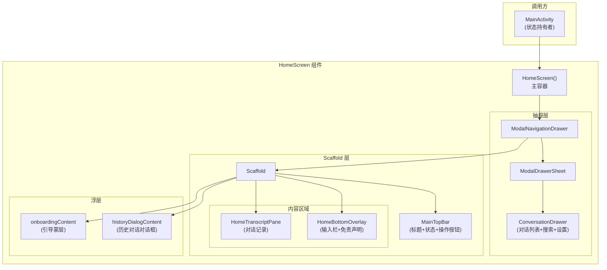
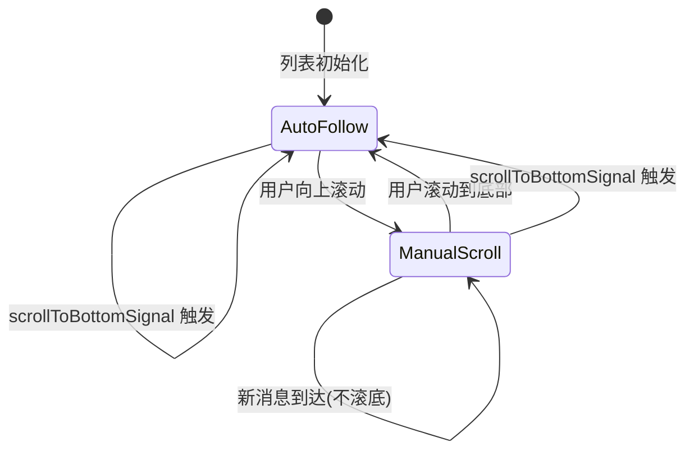
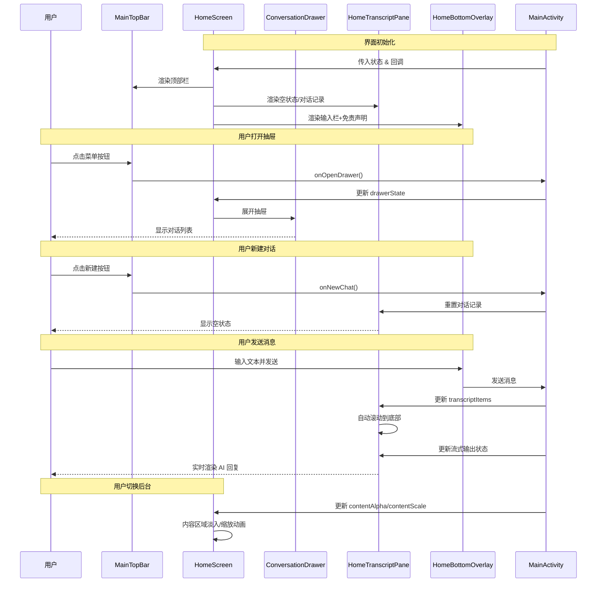

# 主对话界面 (HomeScreen)

`HomeScreen` 是 Aries-AI 应用的核心屏幕组件，作为整个主对话界面的容器，负责将导航抽屉、顶部操作栏、对话记录区域和底部输入栏有机地组织在一起，并提供动画过渡和浮层控制能力。

## 概述

`HomeScreen` 是一个 Composable 函数，承担着 AI 手机助手应用的主界面编排角色。它采用 Material 3 的 `ModalNavigationDrawer` 和 `Scaffold` 作为基础布局框架，将以下四个核心区域整合为一套协调的交互体验：

- **左侧导航抽屉**：展示历史对话列表、搜索和设置入口
- **顶部操作栏**：显示应用名称、当前模型、连接状态，并提供菜单、新建对话和悬浮窗按钮
- **中央对话记录区**：展示用户与 AI 助手的对话历史，支持流式输出渲染
- **底部输入叠加层**：包含消息输入栏和 AI 生成内容免责声明

`HomeScreen` 本身不管理业务状态，而是通过 Composable 参数接收所有状态和回调，这种设计使其成为纯 UI 编排层（Orchestrator），将状态管理完全交由调用方（`MainActivity`）负责，实现了清晰的关注点分离。

> Source: [HomeScreen.kt](https://github.com/ZG0704666/Aries-AI/blob/main/app/src/main/java/com/ai/phoneagent/ui/home/HomeScreen.kt#L57-L83)

## 架构



### 架构说明

`HomeScreen` 采用嵌套布局架构，从外到内分为三个层级：

1. **抽屉层**（`ModalNavigationDrawer`）：最外层容器，管理左侧抽屉的打开/关闭状态。抽屉内部使用 `ModalDrawerSheet` 包裹 `ConversationDrawer`，后者提供搜索框、对话列表和设置按钮。

2. **Scaffold 层**：主内容容器，通过 `topBar` 参数挂载 `MainTopBar`，内容区域（`content` lambda）放置对话记录区和底部输入叠加层。Scaffold 的 `paddingValues` 用于处理顶部栏与内容之间的间距协调。

3. **浮层**：`onboardingContent` 和 `historyDialogContent` 通过 Composable lambda 注入，作为覆盖层在 Scaffold 之上渲染，用于引导流程和历史对话管理。

核心设计意图是：**HomeScreen 自身不持有任何业务状态**，所有数据通过参数传入，所有交互通过回调传出。这使其成为一个"哑组件"（Dumb Component），易于测试和维护。

> Sources:
> - [HomeScreen.kt](https://github.com/ZG0704666/Aries-AI/blob/main/app/src/main/java/com/ai/phoneagent/ui/home/HomeScreen.kt#L57-L182)
> - [MainTopBar.kt](https://github.com/ZG0704666/Aries-AI/blob/main/app/src/main/java/com/ai/phoneagent/ui/topbar/MainTopBar.kt#L37-L155)
> - [ConversationDrawer.kt](https://github.com/ZG0704666/Aries-AI/blob/main/app/src/main/java/com/ai/phoneagent/ui/drawer/ConversationDrawer.kt#L77-L211)

---

## 组件构成

### 1. HomeScreen 主容器

`HomeScreen` 是整个主界面的入口 Composable 函数，接收 20+ 个参数，涵盖状态、回调和内容注入三个维度。

#### 参数设计

| 参数类别 | 参数名 | 类型 | 说明 |
|---------|--------|------|------|
| **抽屉状态** | `drawerState` | `DrawerState` | 抽屉的打开/关闭状态 |
| | `drawerGesturesEnabled` | `Boolean` | 是否允许手势打开抽屉，引导页显示时禁用 |
| **顶部栏** | `statusText` | `String` | 连接状态文本 |
| | `statusVisible` | `Boolean` | 状态条是否可见 |
| | `modelName` | `String` | 当前使用的 AI 模型名称 |
| | `onToggleStatus` | `() -> Unit` | 点击标题区域切换状态显示 |
| | `onOpenDrawer` | `() -> Unit` | 打开抽屉回调 |
| | `onNewChat` | `() -> Unit` | 新建对话回调 |
| | `onOpenFloatingWindow` | `() -> Unit` | 打开悬浮窗回调 |
| **抽屉内容** | `drawerSearchQuery` | `String` | 抽屉搜索关键词 |
| | `drawerItems` | `List<DrawerConversationUiItem>` | 对话列表项 |
| | `drawerEmptyMessage` | `String` | 空列表提示文本 |
| **内容区域** | `transcriptPaneContent` | `@Composable (Dp, Dp, Dp) -> Unit` | 对话记录面板的内容注入 |
| | `inputBarContent` | `@Composable () -> Unit` | 输入栏的内容注入 |
| | `aiNoticeText` | `String` | AI 生成内容免责声明文本 |
| **动画** | `contentAlpha` | `Float` | 内容区域透明度（用于过渡动画） |
| | `contentScale` | `Float` | 内容区域缩放比例（用于过渡动画） |
| **浮层** | `onboardingContent` | `@Composable (() -> Unit)?` | 引导蒙层，可选 |
| | `historyDialogContent` | `@Composable (() -> Unit)?` | 历史对话对话框，可选 |

> Source: [HomeScreen.kt](https://github.com/ZG0704666/Aries-AI/blob/main/app/src/main/java/com/ai/phoneagent/ui/home/HomeScreen.kt#L57-L83)

#### 抽屉关闭处理

`HomeScreen` 通过 `LaunchedEffect` 监听抽屉状态的变化，当抽屉关闭时触发 `onDrawerClosed` 回调。这种设计允许调用方在抽屉关闭后执行延迟操作（如导航到指定对话），避免在抽屉动画期间执行导航导致视觉跳动：

```kotlin
LaunchedEffect(drawerState.currentValue) {
    if (drawerState.currentValue == DrawerValue.Closed) {
        onDrawerClosed()
    }
}
```

> Source: [HomeScreen.kt](https://github.com/ZG0704666/Aries-AI/blob/main/app/src/main/java/com/ai/phoneagent/ui/home/HomeScreen.kt#L106-L110)

#### 内容动画系统

`contentAlpha` 和 `contentScale` 参数用于实现内容区域的过渡动画效果。当应用进入后台或执行其他导航操作时，`MainActivity` 会动态调整这两个值，使内容区域产生淡入/淡出和轻微缩放效果，提供平滑的视觉过渡：

```kotlin
val scaffoldModifier =
    if (contentAlpha != 1f || contentScale != 1f) {
        Modifier
            .fillMaxSize()
            .graphicsLayer {
                alpha = contentAlpha
                scaleX = contentScale
                scaleY = contentScale
            }
    } else {
        Modifier.fillMaxSize()
    }
```

> Source: [HomeScreen.kt](https://github.com/ZG0704666/Aries-AI/blob/main/app/src/main/java/com/ai/phoneagent/ui/home/HomeScreen.kt#L93-L104)

---

### 2. HomeTranscriptPane — 对话记录面板

`HomeTranscriptPane` 负责渲染对话记录的核心区域，处理空状态和消息列表两种场景。

#### 空状态展示

当对话记录为空且没有流式输出时，显示 `TranscriptEmptyHintCard`，该卡片包含应用品牌图标、标语和建议性提示问题，引导用户开始第一次对话：

```kotlin
if (transcriptItems.isEmpty() && streamingTranscriptItem == null) {
    Box(
        modifier = Modifier
            .fillMaxSize()
            .padding(horizontal = spacingMd),
    ) {
        TranscriptEmptyHintCard(
            modifier = Modifier
                .align(Alignment.Center)
                .offset(y = -spacingSm)
                .padding(bottom = bottomOverlayPadding / 3),
            onSuggestionClick = onEmptySuggestionClick,
        )
    }
    return
}
```

> Source: [HomeScreen.kt](https://github.com/ZG0704666/Aries-AI/blob/main/app/src/main/java/com/ai/phoneagent/ui/home/HomeScreen.kt#L203-L218)

#### 消息列表

有对话内容时，使用 `LazyColumn` 渲染消息列表。列表包含两部分：

1. **已完成的对话消息**：通过 `conversationTranscriptItems` 扩展函数添加到 LazyColumn
2. **流式输出中的消息**：通过 `conversationTranscriptItem` 单独渲染流式输出状态

列表底部有一个 `Spacer`，高度等于底部叠加层的高度（`bottomOverlayPadding`），确保最后一条消息不会被输入栏遮挡。

```kotlin
LazyColumn(
    modifier = Modifier
        .fillMaxSize()
        .padding(horizontal = spacingMd)
        .padding(top = spacingXxxs),
    state = listState,
) {
    conversationTranscriptItems(
        items = transcriptItems,
        onCopyMessage = onCopyMessage,
        onRetryMessage = onRetryMessage,
        onAutomationAction = onAutomationAction,
        thinkingExpandedByDefault = thinkingExpandedByDefault,
        onEditMessage = onEditMessage,
        codeBlockPrefs = codeBlockPrefs,
    )

    streamingTranscriptItem?.let { item ->
        conversationTranscriptItem(
            item = item,
            onCopyMessage = onCopyMessage,
            onRetryMessage = onRetryMessage,
            onAutomationAction = onAutomationAction,
            thinkingExpandedByDefault = thinkingExpandedByDefault,
            onEditMessage = onEditMessage,
            codeBlockPrefs = codeBlockPrefs,
        )
    }

    item(key = "bottom_overlay_spacer", contentType = "bottom_spacer") {
        Spacer(modifier = Modifier.height(bottomOverlayPadding))
    }
}
```

> Source: [HomeScreen.kt](https://github.com/ZG0704666/Aries-AI/blob/main/app/src/main/java/com/ai/phoneagent/ui/home/HomeScreen.kt#L247-L279)

---

### 3. HomeTranscriptAutoFollowController — 自动跟随控制器

这是一个私有 Composable 组件，负责管理对话列表的自动滚动行为。其核心逻辑是：

- **首次加载时**：自动滚动到列表底部
- **用户手动滚动时**：检测用户是否在底部。如果用户在底部，保持自动跟随；如果用户滚离底部查看历史消息，则停止自动跟随
- **新消息到达时**：仅在 `autoFollowBottom = true` 时自动滚动到底部
- **外部触发滚动**：当 `scrollToBottomSignal` 值变化（如用户发送新消息）时，强制滚动到底部并恢复自动跟随



> Source: [HomeScreen.kt](https://github.com/ZG0704666/Aries-AI/blob/main/app/src/main/java/com/ai/phoneagent/ui/home/HomeScreen.kt#L282-L349)

---

### 4. HomeBottomOverlay — 底部叠加层

底部叠加层是一个 `BoxScope` 扩展函数，通过 `Alignment.BottomCenter` 固定在内容区域的底部。它包含：

- **输入栏内容**（`inputBarContent`）：由调用方注入，实现消息输入功能
- **AI 免责声明文本**（`aiNoticeText`）：使用 `labelSmall` 样式渲染，通常显示类似"AI 生成的内容可能不准确"的提示

叠加层通过 `onSizeChanged` 感知自身高度变化，将高度值回传给父组件，父组件据此设置对话列表的底部间距：

```kotlin
Column(
    modifier = Modifier
        .align(Alignment.BottomCenter)
        .fillMaxWidth()
        .onSizeChanged { onHeightChanged(it.height) }
        .padding(bottom = spacingXxxs),
    horizontalAlignment = Alignment.CenterHorizontally,
) {
    inputBarContent()
    Text(
        text = aiNoticeText,
        style = MaterialTheme.typography.labelSmall,
        color = MaterialTheme.colorScheme.onSurfaceVariant,
        modifier = Modifier.padding(top = spacingXxxs),
    )
}
```

> Source: [HomeScreen.kt](https://github.com/ZG0704666/Aries-AI/blob/main/app/src/main/java/com/ai/phoneagent/ui/home/HomeScreen.kt#L351-L375)

---

## 核心流程

### 整体交互流程



### 关键设计决策

1. **内容注入模式**：`transcriptPaneContent` 和 `inputBarContent` 使用 Composable lambda 参数而非直接依赖具体实现，实现了依赖反转，使得 `HomeScreen` 可以与不同的输入栏或对话面板实现组合使用。

2. **底部间距自适应**：`HomeBottomOverlay` 通过 `onSizeChanged` 动态感知高度变化，反馈给 `HomeTranscriptPane` 设置列表底部间距。这避免了硬编码或手动计算底部栏高度，确保了在不同设备和输入法状态下的正确布局。

3. **动画与手势协调**：当引导蒙层（`onboardingContent`）显示时，抽屉手势被禁用（`drawerGesturesEnabled = !onboardingOverlay.isShowing()`），避免引导页和抽屉手势冲突。

---

## 使用示例

### 基本用法（在 MainActivity 中调用）

以下是 `MainActivity` 中调用 `HomeScreen` 的实际代码：

```kotlin
HomeScreen(
    drawerState = drawerState,
    drawerGesturesEnabled = !onboardingOverlay.isShowing(),
    statusText = currentStatusText,
    statusVisible = currentStatusVisible,
    onToggleStatus = onToggleStatus,
    onOpenDrawer = onOpenDrawer,
    onNewChat = onNewChat,
    onOpenFloatingWindow = onOpenFloatingWindow,
    modelName = modelDisplayName,
    drawerSearchQuery = currentDrawerSearchQuery,
    drawerItems = currentDrawerItems,
    drawerEmptyMessage = currentDrawerEmptyMessage,
    onDrawerSearchQueryChange = onDrawerSearchQueryChange,
    onDrawerConversationClick = onDrawerConversationClick,
    onDrawerConversationLongClick = onDrawerConversationLongClick,
    onDrawerSettingsClick = onDrawerSettingsClick,
    transcriptPaneContent = { bottomOverlayPadding, spacingMd, spacingXxxs ->
        HomeTranscriptRoute(
            bottomOverlayPadding = bottomOverlayPadding,
            spacingMd = spacingMd,
            spacingXxxs = spacingXxxs,
            codeBlockPrefs = codeBlockPrefs,
            onCopyMessage = onCopyMessage,
            onRetryMessage = onRetryMessage,
            onEditMessage = onEditMessage,
            onAutomationAction = onAutomationAction,
            onEmptySuggestionClick = onEmptySuggestionClick,
        )
    },
    inputBarContent = { HomeInputBar() },
    aiNoticeText = aiNoticeText,
    contentAlpha = currentContentAlpha,
    contentScale = currentContentScale,
    onboardingContent = { onboardingOverlay.Render() },
    historyDialogContent = { HomeHistoryDialog() },
    onDrawerClosed = onDrawerClosed,
)
```

> Source: [MainActivity.kt](https://github.com/ZG0704666/Aries-AI/blob/main/app/src/main/java/com/ai/phoneagent/MainActivity.kt#L987-L1024)

### 使用 HomeTranscriptPane 独立渲染对话面板

```kotlin
HomeTranscriptPane(
    transcriptItems = immutableTranscriptItems,
    streamingTranscriptItem = currentStreamingItem,
    transcriptResetKey = currentTranscriptAnimKey,
    thinkingExpandedByDefault = currentThinkingExpanded,
    codeBlockPrefs = codeBlockPrefs,
    onCopyMessage = onCopyMessage,
    onRetryMessage = onRetryMessage,
    onEditMessage = onEditMessage,
    onAutomationAction = onAutomationAction,
    onEmptySuggestionClick = onEmptySuggestionClick,
    scrollToBottomSignal = currentScrollSignal,
    bottomOverlayPadding = bottomOverlayPadding,
    spacingMd = spacingMd,
    spacingXxxs = spacingXxxs,
)
```

> Source: [MainActivity.kt](https://github.com/ZG0704666/Aries-AI/blob/main/app/src/main/java/com/ai/phoneagent/MainActivity.kt#L1050-L1068)

---

## 配置选项

`HomeScreen` 本身不直接读取配置，所有行为由参数控制：

| 选项 | 类型 | 默认值 | 说明 |
|------|------|--------|------|
| `drawerGesturesEnabled` | `Boolean` | — | 是否启用抽屉手势；引导页显示时设为 `false` |
| `contentAlpha` | `Float` | `1f` | 内容透明度，用于过渡动画 |
| `contentScale` | `Float` | `1f` | 内容缩放比例，用于过渡动画 |
| `statusVisible` | `Boolean` | — | 是否显示连接状态条 |

---

## 开发和调试

### 重组日志

`HomeScreen`、`HomeTranscriptPane` 和 `HomeBottomOverlay` 都集成了 `DebugRecomposeLogger`，在 Debug 构建中跟踪 Composable 重组次数，帮助开发者诊断性能问题：

```kotlin
DebugRecomposeLogger(scope = "HomeScreen")
```

该 Logger 仅在 `BuildConfig.DEBUG` 为 `true` 时生效，每 25 次重组打印一次日志到 Logcat 的 `ComposePerf` 标签。

> Sources:
> - [HomeScreen.kt](https://github.com/ZG0704666/Aries-AI/blob/main/app/src/main/java/com/ai/phoneagent/ui/home/HomeScreen.kt#L84)
> - [ComposePerfDebug.kt](https://github.com/ZG0704666/Aries-AI/blob/main/app/src/main/java/com/ai/phoneagent/ui/debug/ComposePerfDebug.kt#L15-L29)

---

## 相关链接

### 源文件

- [HomeScreen.kt — 主组件实现](https://github.com/ZG0704666/Aries-AI/blob/main/app/src/main/java/com/ai/phoneagent/ui/home/HomeScreen.kt)
- [MainActivity.kt — 调用方（状态持有者）](https://github.com/ZG0704666/Aries-AI/blob/main/app/src/main/java/com/ai/phoneagent/MainActivity.kt)
- [ConversationDrawer.kt — 导航抽屉](https://github.com/ZG0704666/Aries-AI/blob/main/app/src/main/java/com/ai/phoneagent/ui/drawer/ConversationDrawer.kt)
- [MainTopBar.kt — 顶部操作栏](https://github.com/ZG0704666/Aries-AI/blob/main/app/src/main/java/com/ai/phoneagent/ui/topbar/MainTopBar.kt)
- [ConversationTranscript.kt — 对话消息渲染](https://github.com/ZG0704666/Aries-AI/blob/main/app/src/main/java/com/ai/phoneagent/ui/messages/ConversationTranscript.kt)
- [ComposePerfDebug.kt — 重组日志工具](https://github.com/ZG0704666/Aries-AI/blob/main/app/src/main/java/com/ai/phoneagent/ui/debug/ComposePerfDebug.kt)

### 关联组件

- **ConversationDrawer**: 左侧导航抽屉组件，管理对话历史列表和搜索
- **MainTopBar**: 顶部操作栏组件，显示标题、模型名称和操作按钮
- **TranscriptMessageUi**: 对话消息的数据模型
- **StreamingTranscriptMessageState**: 流式输出消息的状态管理类
- **TranscriptEmptyHintCard**: 对话为空时的引导提示卡片
- **ConversationTranscript**: 消息列表渲染和交互处理模块
