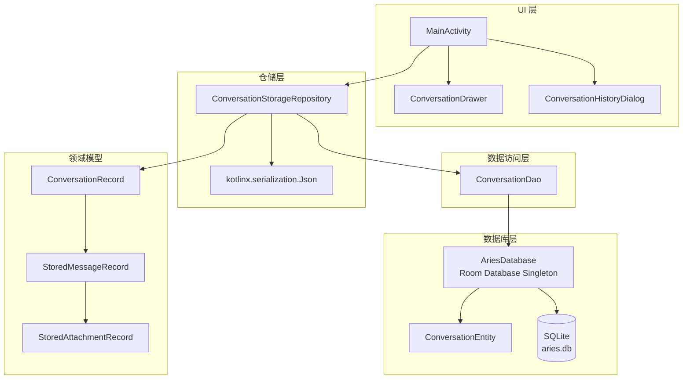
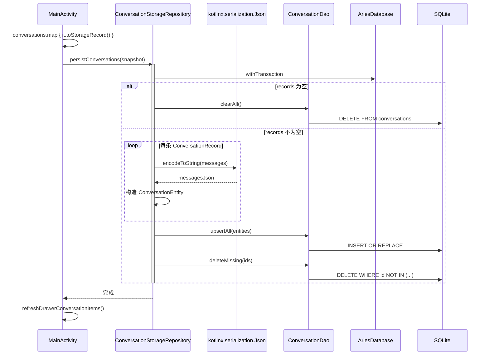
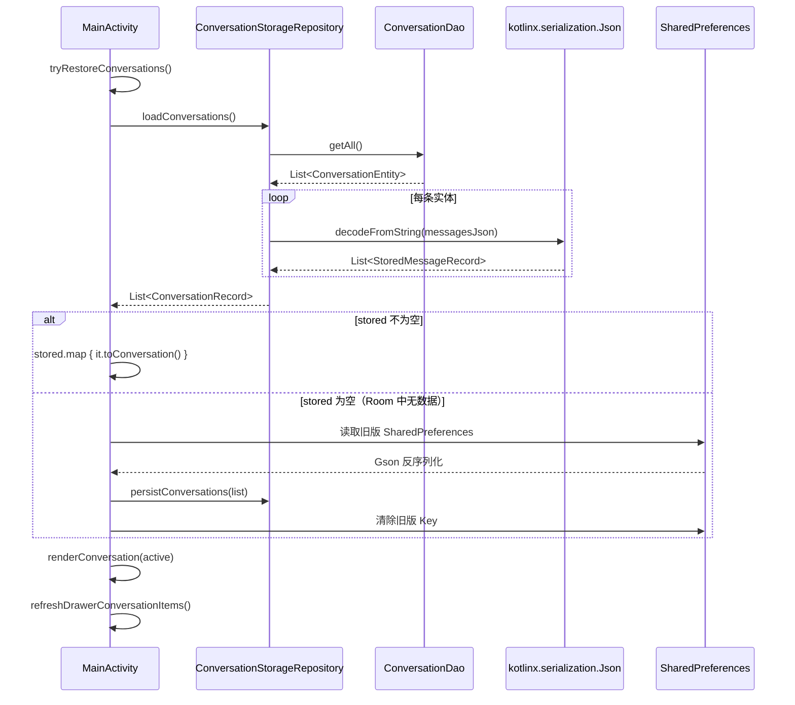
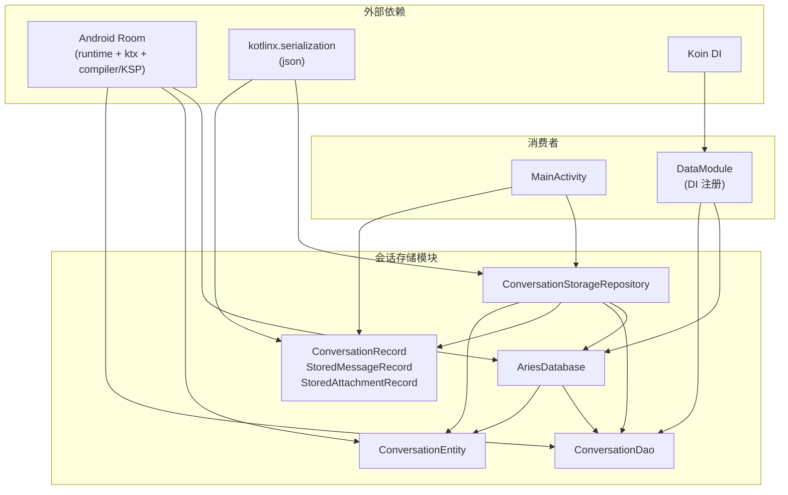

# 会话存储与仓储

Aries AI 的会话持久化子系统，基于 Room 数据库将会话（Conversation）数据持久化到本地 SQLite，并通过 JSON 序列化处理消息及附件的结构化存储。

## 概述

会话存储与仓储模块是整个 Aries AI 应用的数据持久化核心。它将用户与 AI 的对话历史、消息内容、附件信息可靠地保存到本地数据库中，确保应用重启后会话数据不会丢失。该模块由四个核心层组成：

1. **实体层（Entity）**：定义 Room 数据表结构 — `ConversationEntity`
2. **数据访问层（DAO）**：提供数据库 CRUD 操作 — `ConversationDao`
3. **仓储层（Repository）**：将数据库实体与领域模型互相转换 — `ConversationStorageRepository`
4. **数据库层（Database）**：Room 数据库单例封装 — `AriesDatabase`

**设计意图**：消息列表（可能包含附件）以 JSON 字符串形式存储在 `messagesJson` 列中，而非拆分为多张关联表。这种扁平化设计避免了复杂的 JOIN 查询，简化了序列化/反序列化逻辑，适合该应用"整存整取"的会话访问模式。另外，模块还承担了从旧版 SharedPreferences 存储到新 Room 存储的**数据迁移**职责。

## 架构



**架构说明**：

- **UI 层**（`MainActivity`）通过 `ConversationStorageRepository` 与存储系统交互，不直接接触 DAO 或 Entity
- **仓储层** 负责双向转换：`ConversationEntity`（数据库行）↔ `ConversationRecord`（领域模型），消息列表通过 `kotlinx.serialization.Json` 进行序列化/反序列化
- **DAO 层** 提供四项原子操作：全量查询、批量 Upsert、清空、按 ID 集合删除多余记录
- **数据库层** 采用线程安全的双重检查锁定单例模式（`@Volatile + synchronized`），数据库文件命名为 `aries.db`

## 核心组件

### 1. 数据库实体 — ConversationEntity

```kotlin
@Serializable
@Entity(tableName = "conversations")
data class ConversationEntity(
    @PrimaryKey val id: Long,
    val title: String,
    val updatedAt: Long,
    val messagesJson: String,
)
```
> Source: [ConversationEntity.kt](https://github.com/ZG0704666/Aries-AI/blob/main/app/src/main/java/com/ai/phoneagent/data/local/ConversationEntity.kt#L7-L14)

**设计要点**：

- `id` 作为主键，与会话的业务 ID 直接对应，不使用自增 ID
- `messagesJson` 存储整个消息列表的 JSON 序列化结果，而非建立独立的消息表。这样每条会话的所有消息作为一个整体进行读写，避免了跨表查询开销
- `updatedAt` 记录最后更新时间戳，用于侧边栏按时间倒序排列会话列表
- 类本身标注 `@Serializable`，但不直接序列化 — 实际序列化操作在 Repository 中使用 `kotlinx.serialization` 处理 `messagesJson` 字段

### 2. 数据访问对象 — ConversationDao

```kotlin
@Dao
interface ConversationDao {
    @Query("SELECT * FROM conversations ORDER BY updatedAt DESC")
    suspend fun getAll(): List<ConversationEntity>

    @Upsert
    suspend fun upsertAll(items: List<ConversationEntity>)

    @Query("DELETE FROM conversations")
    suspend fun clearAll()

    @Query("DELETE FROM conversations WHERE id NOT IN (:ids)")
    suspend fun deleteMissing(ids: List<Long>)
}
```
> Source: [ConversationDao.kt](https://github.com/ZG0704666/Aries-AI/blob/main/app/src/main/java/com/ai/phoneagent/data/local/ConversationDao.kt#L7-L20)

**设计要点**：

- `getAll()` 按 `updatedAt DESC` 排序，确保最新的会话排在最前 — 与侧边栏展示顺序一致
- `upsertAll()` 使用 Room 2.5+ 的 `@Upsert` 注解，单次操作即可完成插入或更新，避免了先查询再决定 INSERT/UPDATE 的冗余逻辑
- `deleteMissing(ids)` 采用"排除法"删除：保留传入 ID 集合中的记录，删除不在集合中的记录。配合 `upsertAll()` 构成完整的"全量替换"持久化策略
- 所有方法均为 `suspend` 函数，在 Kotlin 协程中执行，确保不阻塞主线程

### 3. 领域模型 — ConversationRecord 及相关类型

```kotlin
@Serializable
data class StoredAttachmentRecord(
    val filePath: String,
    val fileName: String,
    val mimeType: String,
    val fileSize: Long,
    val content: String = "",
)

@Serializable
data class StoredMessageRecord(
    val author: String,
    val content: String,
    val isUser: Boolean,
    val thinkingDurationMs: Long? = null,
    val attachments: List<StoredAttachmentRecord> = emptyList(),
)

data class ConversationRecord(
    val id: Long,
    val title: String,
    val messages: List<StoredMessageRecord>,
    val updatedAt: Long,
)
```
> Source: [ConversationStorageModels.kt](https://github.com/ZG0704666/Aries-AI/blob/main/app/src/main/java/com/ai/phoneagent/data/local/ConversationStorageModels.kt#L5-L28)

**设计要点**：

- `StoredMessageRecord` 和 `StoredAttachmentRecord` 标注 `@Serializable`，因为它们会被序列化为 JSON 存入 `messagesJson` 列
- `ConversationRecord` **不标注** `@Serializable` — 它是仓储层的领域模型，存储时拆解为 `ConversationEntity`（将 `messages` 序列化为 JSON），读取时由 JSON 反序列化组装
- `thinkingDurationMs` 为可空类型 — 仅 AI 消息才包含思考耗时
- `attachments` 默认为空列表，避免空值处理

### 4. 仓储 — ConversationStorageRepository

```kotlin
class ConversationStorageRepository(
    context: Context,
    private val json: Json = Json {
        ignoreUnknownKeys = true
        encodeDefaults = true
    },
) {
    private val database = AriesDatabase.getInstance(context)
    private val dao = database.conversationDao()

    suspend fun loadConversations(): List<ConversationRecord> {
        return dao.getAll().map { entity ->
            ConversationRecord(
                id = entity.id,
                title = entity.title,
                updatedAt = entity.updatedAt,
                messages = json.decodeFromString(
                    ListSerializer(StoredMessageRecord.serializer()),
                    entity.messagesJson,
                ),
            )
        }
    }

    suspend fun persistConversations(records: List<ConversationRecord>) {
        database.withTransaction {
            if (records.isEmpty()) {
                dao.clearAll()
                return@withTransaction
            }

            dao.upsertAll(
                records.map { record ->
                    ConversationEntity(
                        id = record.id,
                        title = record.title,
                        updatedAt = record.updatedAt,
                        messagesJson = json.encodeToString(
                            ListSerializer(StoredMessageRecord.serializer()),
                            record.messages,
                        ),
                    )
                },
            )
            dao.deleteMissing(records.map { it.id })
        }
    }
}
```
> Source: [ConversationStorageRepository.kt](https://github.com/ZG0704666/Aries-AI/blob/main/app/src/main/java/com/ai/phoneagent/data/local/ConversationStorageRepository.kt#L8-L58)

**设计要点**：

- **JSON 配置**：`ignoreUnknownKeys = true` 确保向后兼容 — 旧版本存储的 JSON 新增字段时不会导致反序列化失败；`encodeDefaults = true` 保证序列化输出包含默认值，避免反序列化时缺失字段
- **事务保证**：`persistConversations()` 使用 `database.withTransaction` 包裹 upsert + delete 操作，确保原子性 — 要么全部成功，要么全部回滚
- **空列表优化**：当传入空列表时直接调用 `clearAll()`，跳过序列化和 upsert 开销
- **全量替换策略**：`upsertAll` + `deleteMissing` 实现"先写入全部当前会话，再删除不在列表中的旧会话"。这比逐条比对增删改更简单可靠
- **懒加载**：`database` 和 `dao` 在构造时即初始化，因为 `AriesDatabase.getInstance()` 本身是惰性单例

## 核心流程

### 会话持久化流程



### 会话恢复流程



### 旧版数据迁移

当 Room 数据库中无数据时，`tryRestoreConversations()` 会调用 `tryRestoreLegacyConversations()` 尝试从旧版 SharedPreferences 中恢复数据。迁移完成后，立即将数据持久化到 Room 并清除 SharedPreferences 中的旧 Key（`conversations_json`、`active_conversation_id`），实现存储引擎的无缝切换。

```kotlin
private fun tryRestoreLegacyConversations(): MutableList<Conversation> {
    val json = prefs.getString(conversationsKey, null) ?: return mutableListOf()
    return runCatching {
        val type = object : com.google.gson.reflect.TypeToken<List<Conversation>>() {}.type
        val list: List<Conversation> = com.google.gson.Gson().fromJson(json, type) ?: emptyList()
        val activeId = prefs.getLong(activeConversationIdKey, -1L)
        lifecycleScope.launch(Dispatchers.IO) {
            runCatching {
                conversationStorageRepository.persistConversations(list.map { it.toStorageRecord() })
                uiPreferencesRepository.setActiveConversationId(activeId)
                prefs.edit().remove(conversationsKey).remove(activeConversationIdKey).apply()
            }
        }
        list.toMutableList()
    }.getOrDefault(mutableListOf())
}
```
> Source: [MainActivity.kt](https://github.com/ZG0704666/Aries-AI/blob/main/app/src/main/java/com/ai/phoneagent/MainActivity.kt#L626-L641)

## 使用示例

### 基本用法：持久化会话列表

```kotlin
// MainActivity 中 — 将内存中的 Conversation 列表保存到数据库
private fun persistConversations() {
    val snapshot = conversations.map { it.toStorageRecord() }
    val activeConversationId = activeConversation?.id
    lifecycleScope.launch(Dispatchers.IO) {
        runCatching {
            conversationStorageRepository.persistConversations(snapshot)
            uiPreferencesRepository.setActiveConversationId(activeConversationId)
        }
    }
    refreshDrawerConversationItems()
}
```
> Source: [MainActivity.kt](https://github.com/ZG0704666/Aries-AI/blob/main/app/src/main/java/com/ai/phoneagent/MainActivity.kt#L584-L594)

### 基本用法：从数据库恢复会话

```kotlin
// MainActivity 中 — 应用启动时从数据库加载会话
private fun tryRestoreConversations(): Boolean {
    val stored = runCatching {
        runBlocking(Dispatchers.IO) { conversationStorageRepository.loadConversations() }
    }.getOrNull().orEmpty()

    val restoredConversations = if (stored.isNotEmpty()) {
        stored.map { it.toConversation() }
    } else {
        tryRestoreLegacyConversations()
    }
    if (restoredConversations.isEmpty()) return false

    conversations.clear()
    conversations.addAll(restoredConversations)
    // ... 恢复活跃会话 ...
    refreshDrawerConversationItems()
    return true
}
```
> Source: [MainActivity.kt](https://github.com/ZG0704666/Aries-AI/blob/main/app/src/main/java/com/ai/phoneagent/MainActivity.kt#L596-L624)

### 领域模型转换

```kotlin
// Conversation → ConversationRecord（用于持久化）
private fun Conversation.toStorageRecord(): ConversationRecord {
    return ConversationRecord(
        id = id,
        title = title,
        updatedAt = updatedAt,
        messages = messages.map { message ->
            StoredMessageRecord(
                author = message.author,
                content = message.content,
                isUser = message.isUser,
                thinkingDurationMs = message.thinkingDurationMs,
                attachments = message.attachments.orEmpty().map { attachment ->
                    StoredAttachmentRecord(
                        filePath = attachment.filePath,
                        fileName = attachment.fileName,
                        mimeType = attachment.mimeType,
                        fileSize = attachment.fileSize,
                        content = attachment.content,
                    )
                },
            )
        },
    )
}

// ConversationRecord → Conversation（用于从数据库恢复）
private fun ConversationRecord.toConversation(): Conversation {
    return Conversation(
        id = id,
        title = title,
        updatedAt = updatedAt,
        messages = messages.map { message ->
            UiMessage(
                author = message.author,
                content = message.content,
                isUser = message.isUser,
                thinkingDurationMs = message.thinkingDurationMs,
                attachments = message.attachments.map { attachment ->
                    AttachmentInfo(
                        filePath = attachment.filePath,
                        fileName = attachment.fileName,
                        mimeType = attachment.mimeType,
                        fileSize = attachment.fileSize,
                        content = attachment.content,
                    )
                }.takeIf { it.isNotEmpty() },
            )
        }.toMutableList(),
    )
}
```
> Source: [MainActivity.kt](https://github.com/ZG0704666/Aries-AI/blob/main/app/src/main/java/com/ai/phoneagent/MainActivity.kt#L360-L412)

### Room 数据库单例获取

```kotlin
@Database(
    entities = [ConversationEntity::class],
    version = 1,
    exportSchema = false,
)
abstract class AriesDatabase : RoomDatabase() {
    abstract fun conversationDao(): ConversationDao

    companion object {
        @Volatile
        private var instance: AriesDatabase? = null

        fun getInstance(context: Context): AriesDatabase {
            return instance ?: synchronized(this) {
                instance ?: Room.databaseBuilder(
                    context.applicationContext,
                    AriesDatabase::class.java,
                    "aries.db",
                ).build().also { instance = it }
            }
        }
    }
}
```
> Source: [AriesDatabase.kt](https://github.com/ZG0704666/Aries-AI/blob/main/app/src/main/java/com/ai/phoneagent/data/local/AriesDatabase.kt#L8-L30)

### 依赖注入注册

```kotlin
val dataModule = module {
    // Room 数据库 — 委托给已有的线程安全 getInstance() 避免重复初始化
    single<AriesDatabase> {
        AriesDatabase.getInstance(androidContext())
    }

    // ConversationDao 通过数据库单例获取
    single { get<AriesDatabase>().conversationDao() }

    // ... 其他 DataStore 偏好仓储 ...
}
```
> Source: [DataModule.kt](https://github.com/ZG0704666/Aries-AI/blob/main/app/src/main/java/com/ai/phoneagent/di/DataModule.kt#L41-L58)

## 配置选项

| 配置项 | 类型 | 默认值 | 说明 |
|--------|------|--------|------|
| Room 数据库版本 | `Int` | `1` | `@Database(version = 1)`，用于 Room 数据库迁移 |
| 数据库文件名 | `String` | `"aries.db"` | SQLite 数据库文件名 |
| 导出 Schema | `Boolean` | `false` | `exportSchema = false`，不导出 Room schema 文件 |
| JSON `ignoreUnknownKeys` | `Boolean` | `true` | 反序列化时忽略未知 Key，保证向后兼容 |
| JSON `encodeDefaults` | `Boolean` | `true` | 序列化时包含默认值，防止缺失字段 |
| 表名 | `String` | `"conversations"` | Room 实体映射的数据库表名称 |

## API 参考

### `ConversationStorageRepository`

#### `suspend fun loadConversations(): List<ConversationRecord>`

从数据库加载所有会话记录，按 `updatedAt DESC` 排序，并反序列化每条消息的 JSON 数据。

**返回：** 所有已持久化的会话记录列表。如果数据库为空则返回空列表。

**内部流程：** `dao.getAll()` → 遍历 Entity → `Json.decodeFromString()` 反序列化 `messagesJson` → 组装 `ConversationRecord`

---

#### `suspend fun persistConversations(records: List<ConversationRecord>)`

将一组会话记录持久化到数据库。在单个事务中执行 upsert 和清理操作。

**参数：**
- `records` (`List<ConversationRecord>`)：待持久化的会话记录列表。传入空列表将清空数据库。

**内部流程：** 若 `records` 为空 → `dao.clearAll()`；否则 → 序列化每条记录的消息 → `dao.upsertAll(entities)` → `dao.deleteMissing(ids)`

---

### `ConversationDao`

| 方法 | 返回类型 | 说明 |
|------|----------|------|
| `suspend fun getAll()` | `List<ConversationEntity>` | 查询全部会话，按 `updatedAt DESC` 排序 |
| `suspend fun upsertAll(items)` | `Unit` | 批量插入或更新会话 |
| `suspend fun clearAll()` | `Unit` | 删除所有会话 |
| `suspend fun deleteMissing(ids)` | `Unit` | 删除 ID 不在指定集合中的会话 |

### `AriesDatabase`

| 方法 | 返回类型 | 说明 |
|------|----------|------|
| `abstract fun conversationDao()` | `ConversationDao` | 获取 ConversationDao 实例 |
| `companion fun getInstance(context)` | `AriesDatabase` | 线程安全的数据库单例获取 |

## 依赖关系



## 相关链接

- [ConversationEntity 源码](https://github.com/ZG0704666/Aries-AI/blob/main/app/src/main/java/com/ai/phoneagent/data/local/ConversationEntity.kt)
- [ConversationDao 源码](https://github.com/ZG0704666/Aries-AI/blob/main/app/src/main/java/com/ai/phoneagent/data/local/ConversationDao.kt)
- [ConversationStorageModels 源码](https://github.com/ZG0704666/Aries-AI/blob/main/app/src/main/java/com/ai/phoneagent/data/local/ConversationStorageModels.kt)
- [ConversationStorageRepository 源码](https://github.com/ZG0704666/Aries-AI/blob/main/app/src/main/java/com/ai/phoneagent/data/local/ConversationStorageRepository.kt)
- [AriesDatabase 源码](https://github.com/ZG0704666/Aries-AI/blob/main/app/src/main/java/com/ai/phoneagent/data/local/AriesDatabase.kt)
- [DataModule DI 注册](https://github.com/ZG0704666/Aries-AI/blob/main/app/src/main/java/com/ai/phoneagent/di/DataModule.kt)
- [MainActivity 消费者](https://github.com/ZG0704666/Aries-AI/blob/main/app/src/main/java/com/ai/phoneagent/MainActivity.kt)
- [ConversationDrawer 侧边栏](https://github.com/ZG0704666/Aries-AI/blob/main/app/src/main/java/com/ai/phoneagent/ui/drawer/ConversationDrawer.kt)
- [ConversationHistoryDialog 历史对话框](https://github.com/ZG0704666/Aries-AI/blob/main/app/src/main/java/com/ai/phoneagent/ui/history/ConversationHistoryDialog.kt)
- [ConversationTranscript 对话记录渲染](https://github.com/ZG0704666/Aries-AI/blob/main/app/src/main/java/com/ai/phoneagent/ui/messages/ConversationTranscript.kt)
- [KoinModuleCheckTest DI 测试](https://github.com/ZG0704666/Aries-AI/blob/main/app/src/test/java/com/ai/phoneagent/di/KoinModuleCheckTest.kt)
- [build.gradle.kts Room 依赖声明](https://github.com/ZG0704666/Aries-AI/blob/main/app/build.gradle.kts#L224-L227)