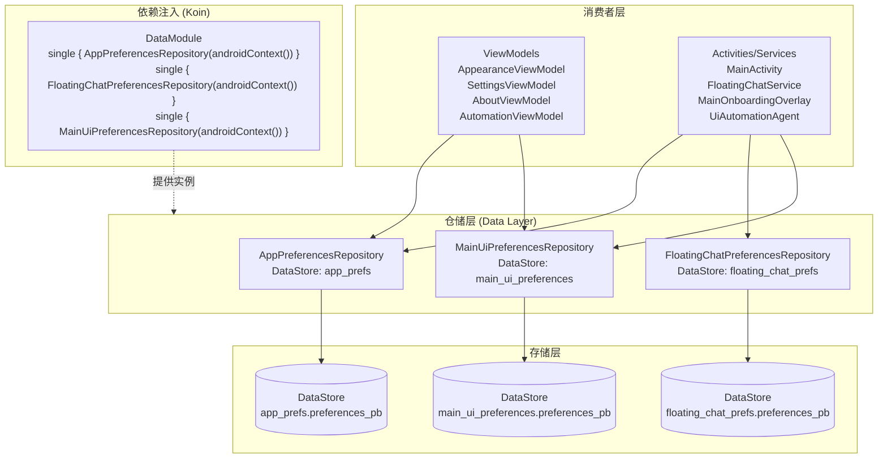
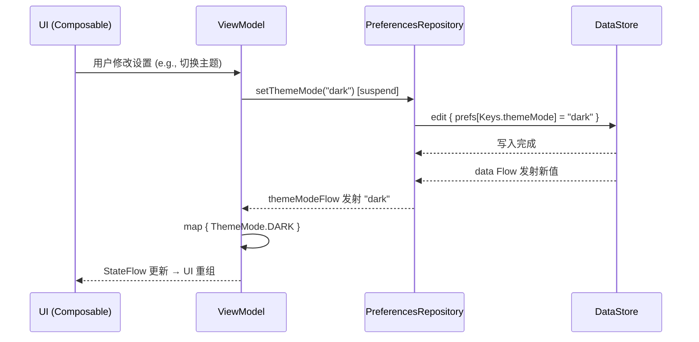

# 偏好设置仓储 (Preferences)

偏好设置仓储是 Aries AI 的数据持久化层核心组件，基于 Android Jetpack DataStore 实现，为应用提供响应式、类型安全的键值对偏好设置存储能力。

## 概述

偏好设置仓储模块位于 `com.ai.phoneagent.data.preferences` 包下，包含三个独立的 DataStore 仓储类，分别管理应用全局配置、悬浮窗聊天状态和主界面 UI 偏好。三个仓储均采用统一的架构模式：通过 `preferencesDataStore` 委托创建 DataStore 实例、以内部 `Keys` 对象集中管理所有偏好键定义、同时提供挂起（suspend）和阻塞（blocking）两种访问方式。

### 设计意图

该模块的设计遵循以下核心原则：

- **响应式数据流（Reactive Streams）**：所有偏好值均通过 Kotlin `Flow` 暴露，UI 层可通过 `collectAsState()` 实时响应配置变更，无需手动轮询。
- **协程安全**：主读写接口使用 `suspend` 函数，确保在 Kotlin 协程上下文中安全执行，避免主线程阻塞。
- **向后兼容**：在无法使用协程的遗留代码或非协程调用点，提供 `Blocking` 后缀的同步封装方法（内部通过 `runBlocking` 实现）。
- **依赖注入友好**：构造函数仅依赖 `android.content.Context`，通过 Koin DI 容器以 `single`（单例）作用域注册。

### 三个仓储的职责划分

| 仓储类 | DataStore 名称 | 职责范围 |
|--------|---------------|---------|
| `AppPreferencesRepository` | `app_prefs` | 应用全局配置：API 密钥、第三方模型、用户协议、主题外观、会话数据 |
| `FloatingChatPreferencesRepository` | `floating_chat_prefs` | 悬浮窗聊天：消息内容、窗口位置与尺寸 |
| `MainUiPreferencesRepository` | `main_ui_preferences` | 主界面 UI 状态：当前活跃会话 ID、思维链展开偏好 |

---

## 架构

### 仓储分层架构



> **架构说明**：三个仓储各自管理独立的 DataStore 文件，互不干扰。ViewModels 通过 Koin 注入获得 `AppPreferencesRepository` 实例，以响应式 Flow 驱动 UI 状态更新；Activities 和 Services 则可能混合使用协程挂起方法和阻塞方法。`MainOnboardingOverlay` 和 `UiAutomationAgent` 等组件通过构造函数直接接收 `AppPreferencesRepository` 实例，而非通过 DI 容器，体现了灵活性。

### 偏好值流向



---

## 核心仓储详解

### 1. AppPreferencesRepository — 应用全局配置

`AppPreferencesRepository` 是三个仓储中最复杂的，管理应用的全局偏好设置，覆盖 API 配置、用户状态、主题外观和会话数据四大领域。

#### 1.1 数据存储键定义

所有偏好键通过内部 `Keys` 对象集中管理，键名与存储值之间形成一一映射：

> Source: [AppPreferencesRepository.kt](https://github.com/ZG0704666/Aries-AI/blob/main/app/src/main/java/com/ai/phoneagent/data/preferences/AppPreferencesRepository.kt#L25-L60)

```kotlin
private object Keys {
    // ─── API 配置 ──────────────────────────────────────
    val apiKey = stringPreferencesKey("api_key")
    val autoglmApiKey = stringPreferencesKey("autoglm_api_key")
    val apiUseThirdParty = booleanPreferencesKey("api_use_third_party")
    val apiUseLocalModel = booleanPreferencesKey("api_use_local_model")
    val apiThirdPartyBaseUrl = stringPreferencesKey("api_third_party_base_url")
    val apiThirdPartyModel = stringPreferencesKey("api_third_party_model")
    val apiLastCheckKey = stringPreferencesKey("api_last_check_key")
    val apiLastCheckOk = booleanPreferencesKey("api_last_check_ok")
    val apiLastCheckTime = longPreferencesKey("api_last_check_time")
    val apiLastCheckSig = stringPreferencesKey("api_last_check_sig")
    
    // ─── 用户状态 ──────────────────────────────────────
    val userAgreementAccepted = booleanPreferencesKey("user_agreement_accepted")
    val permGuideShown = booleanPreferencesKey("perm_guide_shown")
    
    // ─── Aries API ─────────────────────────────────────
    val useAriesApi = booleanPreferencesKey("use_aries_api")
    val ariesApiSectionUnlocked = booleanPreferencesKey("aries_api_section_unlocked")
    val ariesLoggedInUser = stringPreferencesKey("aries_logged_in_user")
    val ariesSelectedModel = stringPreferencesKey("aries_selected_model")
    val ariesApiKey = stringPreferencesKey("aries_api_key")
    
    // ─── 会话数据 ──────────────────────────────────────
    val conversations = stringPreferencesKey("conversations")
    val legacyConversationsJson = stringPreferencesKey("conversations_json")
    val legacyActiveConversationId = longPreferencesKey("active_conversation_id")
    val qwenPendingDownloadIds = stringSetPreferencesKey("qwen_pending_download_ids")
    
    // ─── 主题外观 ──────────────────────────────────────
    val themeMode = stringPreferencesKey("theme_mode")
    val themeColorStyle = stringPreferencesKey("theme_color_style")
    val themeAccent = stringPreferencesKey("theme_accent")
    val amoledDarkEnabled = booleanPreferencesKey("amoled_dark_enabled")
    val dynamicColorEnabled = booleanPreferencesKey("dynamic_color_enabled")
    val chatFontScale = floatPreferencesKey("chat_font_scale")
    val chatFontFamily = stringPreferencesKey("chat_font_family")
    val codeAutoWrap = booleanPreferencesKey("code_auto_wrap")
    val codeLineNumbers = booleanPreferencesKey("code_line_numbers")
    val codeAutoCollapse = booleanPreferencesKey("code_auto_collapse")
}
```

#### 1.2 双重 API 设计：Suspend + Blocking

`AppPreferencesRepository` 为几乎所有读写操作提供了两套接口：

- **suspend 方法**：在协程中使用，通过 `DataStore.data.first()` 读取或 `DataStore.edit {}` 写入。
- **blocking 方法**：以 `Blocking` 为后缀，内部使用 `runBlocking` 封装，适用于非协程调用点（如 Service 生命周期回调、遗留代码）。

> Source: [AppPreferencesRepository.kt](https://github.com/ZG0704666/Aries-AI/blob/main/app/src/main/java/com/ai/phoneagent/data/preferences/AppPreferencesRepository.kt#L183-L192)

```kotlin
// 挂起方法（协程安全）
suspend fun getApiKey(): String {
    val prefs = context.appPreferencesDataStore.data.first()
    return prefs[Keys.apiKey] ?: ""
}

suspend fun setApiKey(value: String) {
    context.appPreferencesDataStore.edit { prefs ->
        prefs[Keys.apiKey] = value
    }
}

// 阻塞方法（非协程调用点）
fun getApiKeyBlocking(): String = runBlocking { getApiKey() }
fun setApiKeyBlocking(value: String) = runBlocking { setApiKey(value) }
```

> **设计意图**：这种双重 API 设计是为了兼容项目中不同调用场景。例如，`UiAutomationAgent` 在非协程上下文中需要使用 `getApiUseLocalModelBlocking()` 来检查是否启用本地模型，而 `AppearanceViewModel` 则在 `viewModelScope` 中直接调用 `setThemeMode()` 挂起方法。

#### 1.3 批量写入 API

对于需要同时更新多个 API 配置项的场景（如切换 API 源时），仓储提供了 `writeApiConfig` 批量写入方法，在单次 `edit {}` 事务中完成所有变更：

> Source: [AppPreferencesRepository.kt](https://github.com/ZG0704666/Aries-AI/blob/main/app/src/main/java/com/ai/phoneagent/data/preferences/AppPreferencesRepository.kt#L589-L620)

```kotlin
suspend fun writeApiConfig(
    apiKey: String? = null,
    removeApiKey: Boolean = false,
    useThirdParty: Boolean? = null,
    useLocalModel: Boolean? = null,
    thirdPartyBaseUrl: String? = null,
    thirdPartyModel: String? = null,
    lastCheckKey: String? = null,
    lastCheckOk: Boolean? = null,
    lastCheckTime: Long? = null,
    lastCheckSig: String? = null,
    clearCheckResults: Boolean = false,
) {
    context.appPreferencesDataStore.edit { prefs ->
        if (removeApiKey) prefs.remove(Keys.apiKey)
        else if (apiKey != null) prefs[Keys.apiKey] = apiKey
        useThirdParty?.let { prefs[Keys.apiUseThirdParty] = it }
        useLocalModel?.let { prefs[Keys.apiUseLocalModel] = it }
        thirdPartyBaseUrl?.let { prefs[Keys.apiThirdPartyBaseUrl] = it }
        thirdPartyModel?.let { prefs[Keys.apiThirdPartyModel] = it }
        if (clearCheckResults) {
            prefs.remove(Keys.apiLastCheckSig)
            prefs.remove(Keys.apiLastCheckKey)
            prefs.remove(Keys.apiLastCheckOk)
            prefs.remove(Keys.apiLastCheckTime)
        }
        lastCheckKey?.let { prefs[Keys.apiLastCheckKey] = it }
        lastCheckOk?.let { prefs[Keys.apiLastCheckOk] = it }
        lastCheckTime?.let { prefs[Keys.apiLastCheckTime] = it }
        lastCheckSig?.let { prefs[Keys.apiLastCheckSig] = it }
    }
}
```

> **设计意图**：批量写入减少了多次 `edit {}` 调用的开销，并且保证原子性——要么所有变更一起写入，要么都不写入。`clearCheckResults` 参数允许一键清除上一次 API 检查的缓存结果。

#### 1.4 主题颜色解析策略

主题颜色相关的偏好值并非一一对应存储，而是通过 `resolveThemeColorStyleStorage` 方法进行智能解析：

> Source: [AppPreferencesRepository.kt](https://github.com/ZG0704666/Aries-AI/blob/main/app/src/main/java/com/ai/phoneagent/data/preferences/AppPreferencesRepository.kt#L674-L682)

```kotlin
private fun resolveThemeColorStyleStorage(
    prefs: androidx.datastore.preferences.core.Preferences,
): String {
    prefs[Keys.themeColorStyle]?.let { return it }  // 优先使用显式设置
    if (prefs[Keys.dynamicColorEnabled] == true) {
        return ThemeColorStyle.DYNAMIC.storageKey   // 动态色彩标记
    }
    return prefs[Keys.themeAccent] ?: ThemeColorStyle.DEFAULT.storageKey  // 回退到强调色
}
```

> **设计意图**：该解析策略实现了向后兼容——用户可能来自仅设置了 `dynamicColorEnabled` 或 `themeAccent` 的旧版本，通过三级优先级（显式 colorStyle → dynamicColor 标记 → accent 回退）确保始终能解析出有效的颜色风格。

#### 1.5 活跃 Aries API Key 获取逻辑

`getActiveAriesApiKey()` 方法实现了一个优先级链来获取当前有效的 API 密钥：

> Source: [AppPreferencesRepository.kt](https://github.com/ZG0704666/Aries-AI/blob/main/app/src/main/java/com/ai/phoneagent/data/preferences/AppPreferencesRepository.kt#L270-L280)

```kotlin
suspend fun getActiveAriesApiKey(): String {
    val prefs = context.appPreferencesDataStore.data.first()
    val ariesKey = prefs[Keys.ariesApiKey].orEmpty()
    if (ariesKey.isNotBlank()) return ariesKey           // 优先级1: 专用 Aries API Key
    val loggedInUser = prefs[Keys.ariesLoggedInUser].orEmpty()
    return if (loggedInUser.isNotBlank()) {
        prefs[Keys.apiKey].orEmpty()                      // 优先级2: 登录用户的通用 API Key
    } else {
        ""                                                 // 未登录用户：无可用 Key
    }
}
```

#### 1.6 遗留数据迁移

仓储保留了从旧版本迁移的方法，支持读取和写入旧格式的会话数据：

> Source: [AppPreferencesRepository.kt](https://github.com/ZG0704666/Aries-AI/blob/main/app/src/main/java/com/ai/phoneagent/data/preferences/AppPreferencesRepository.kt#L365-L393)

```kotlin
suspend fun getLegacyConversationsJson(): String? {
    val prefs = context.appPreferencesDataStore.data.first()
    return prefs[Keys.legacyConversationsJson]
}

suspend fun setLegacyConversationsJson(value: String?) {
    context.appPreferencesDataStore.edit { prefs ->
        if (value == null) prefs.remove(Keys.legacyConversationsJson)
        else prefs[Keys.legacyConversationsJson] = value
    }
}

suspend fun getLegacyActiveConversationId(defaultValue: Long = -1L): Long {
    val prefs = context.appPreferencesDataStore.data.first()
    return prefs[Keys.legacyActiveConversationId] ?: defaultValue
}
```

---

### 2. FloatingChatPreferencesRepository — 悬浮窗聊天状态

`FloatingChatPreferencesRepository` 负责持久化悬浮窗聊天的运行时状态，包括消息内容和窗口几何信息。

#### 2.1 数据存储键定义

> Source: [FloatingChatPreferencesRepository.kt](https://github.com/ZG0704666/Aries-AI/blob/main/app/src/main/java/com/ai/phoneagent/data/preferences/FloatingChatPreferencesRepository.kt#L19-L26)

```kotlin
private object Keys {
    val floatingMessages = stringPreferencesKey("floating_messages")
    val floatingMessagesUpdatedAt = longPreferencesKey("floating_messages_updated_at")
    val windowX = intPreferencesKey("window_x")
    val windowY = intPreferencesKey("window_y")
    val windowWidth = intPreferencesKey("window_width")
    val windowHeight = intPreferencesKey("window_height")
}
```

#### 2.2 窗口位置默认值

窗口位置具有合理的默认值：X 坐标默认 100px，Y 坐标默认 200px，确保悬浮窗在首次启动时出现在屏幕可见区域内。

> Source: [FloatingChatPreferencesRepository.kt](https://github.com/ZG0704666/Aries-AI/blob/main/app/src/main/java/com/ai/phoneagent/data/preferences/FloatingChatPreferencesRepository.kt#L38-L46)

```kotlin
val windowXFlow: Flow<Int> =
    context.floatingChatPreferencesDataStore.data.map { prefs ->
        prefs[Keys.windowX] ?: 100
    }

val windowYFlow: Flow<Int> =
    context.floatingChatPreferencesDataStore.data.map { prefs ->
        prefs[Keys.windowY] ?: 200
    }
```

#### 2.3 消息清除

提供专门的 `clearFloatingMessages()` 方法，同时移除消息内容和时间戳：

> Source: [FloatingChatPreferencesRepository.kt](https://github.com/ZG0704666/Aries-AI/blob/main/app/src/main/java/com/ai/phoneagent/data/preferences/FloatingChatPreferencesRepository.kt#L128-L133)

```kotlin
suspend fun clearFloatingMessages() {
    context.floatingChatPreferencesDataStore.edit { prefs ->
        prefs.remove(Keys.floatingMessages)
        prefs.remove(Keys.floatingMessagesUpdatedAt)
    }
}
```

---

### 3. MainUiPreferencesRepository — 主界面 UI 状态

`MainUiPreferencesRepository` 是最精简的仓储，仅管理两个偏好项。

#### 3.1 数据存储键定义

> Source: [MainUiPreferencesRepository.kt](https://github.com/ZG0704666/Aries-AI/blob/main/app/src/main/java/com/ai/phoneagent/data/preferences/MainUiPreferencesRepository.kt#L19-L22)

```kotlin
private object Keys {
    val activeConversationId = longPreferencesKey("active_conversation_id")
    val thinkingExpandedByDefault = booleanPreferencesKey("thinking_expanded_by_default")
}
```

#### 3.2 自定义 Long 更新工具方法

`MainUiPreferencesRepository` 定义了一个私有的 `MutablePreferences.updateLong()` 扩展函数，用于安全地处理可空 Long 值的写入——当值为 `null` 或负数时移除键，否则写入值：

> Source: [MainUiPreferencesRepository.kt](https://github.com/ZG0704666/Aries-AI/blob/main/app/src/main/java/com/ai/phoneagent/data/preferences/MainUiPreferencesRepository.kt#L47-L56)

```kotlin
private fun MutablePreferences.updateLong(
    key: Preferences.Key<Long>,
    value: Long?,
) {
    if (value == null || value < 0L) {
        remove(key)
    } else {
        this[key] = value
    }
}
```

> **设计意图**：将无效值（null/负数）映射为键删除而非写入哨兵值，使下游可以通过键是否存在来判断活跃状态，语义更清晰。

---

## 主题相关类型

仓储模块通过 typealias 引用了 `core.designsystem.theme` 包中的三个核心主题枚举类型：

### ThemeMode — 主题模式

> Source: [ThemeMode.kt](https://github.com/ZG0704666/Aries-AI/blob/main/core/designsystem/src/main/java/com/ai/phoneagent/core/designsystem/theme/ThemeMode.kt#L24-L31)

```kotlin
enum class ThemeMode {
    /** 跟随系统深色模式设置 */
    SYSTEM,
    /** 始终使用亮色主题 */
    LIGHT,
    /** 始终使用暗色主题 */
    DARK,
}
```

### ThemeAccent — 主题强调色

> Source: [ThemeAccent.kt](https://github.com/ZG0704666/Aries-AI/blob/main/core/designsystem/src/main/java/com/ai/phoneagent/core/designsystem/theme/ThemeAccent.kt#L9-L22)

```kotlin
enum class ThemeAccent(val storageKey: String) {
    DEFAULT("default"),
    OCEAN("ocean"),
    FOREST("forest"),
    SUNSET("sunset"),
    ROSE("rose");

    companion object {
        fun fromStorage(value: String): ThemeAccent =
            entries.firstOrNull { it.storageKey == value.lowercase() } ?: DEFAULT
    }
}
```

### ThemeColorStyle — 主题颜色风格

> Source: [ThemeColorStyle.kt](https://github.com/ZG0704666/Aries-AI/blob/main/core/designsystem/src/main/java/com/ai/phoneagent/core/designsystem/theme/ThemeColorStyle.kt#L5-L27)

```kotlin
enum class ThemeColorStyle(val storageKey: String, val accent: ThemeAccent?) {
    DEFAULT("default", ThemeAccent.DEFAULT),
    OCEAN("ocean", ThemeAccent.OCEAN),
    FOREST("forest", ThemeAccent.FOREST),
    SUNSET("sunset", ThemeAccent.SUNSET),
    ROSE("rose", ThemeAccent.ROSE),
    DYNAMIC("dynamic", null);   // Material You 动态取色

    val isDynamic: Boolean get() = this == DYNAMIC
    val accentOrDefault: ThemeAccent get() = accent ?: ThemeAccent.DEFAULT
}
```

> **设计意图**：`ThemeColorStyle` 统一了静态强调色和动态取色两种策略。`DYNAMIC` 的 `accent` 为 `null`，表示不使用预设调色板，而是由系统通过 Material You 动态生成。这种设计使得设置界面可以统一展示六种选项，而非分成两个独立的设置项。

---

## 依赖注入

三个仓储通过 Koin 的 `dataModule` 以单例模式注册：

> Source: [DataModule.kt](https://github.com/ZG0704666/Aries-AI/blob/main/app/src/main/java/com/ai/phoneagent/di/DataModule.kt#L41-L58)

```kotlin
val dataModule = module {
    // Room database
    single<AriesDatabase> {
        AriesDatabase.getInstance(androidContext())
    }
    single { get<AriesDatabase>().conversationDao() }

    // DataStore preferences repositories — all require application context.
    single { MainUiPreferencesRepository(androidContext()) }
    single { AppPreferencesRepository(androidContext()) }
    single { FloatingChatPreferencesRepository(androidContext()) }
    single { VirtualDisplayConfigRepository(androidContext()) }
    single { ToolPermissionsRepository(androidContext()) }
    single { AutomationResultsRepository(androidContext()) }
}
```

各消费者通过 `by inject<AppPreferencesRepository>()` 延迟注入获取实例：

```kotlin
// MainActivity.kt
private val appPrefsRepository by inject<AppPreferencesRepository>()
private val floatingChatPrefs by inject<FloatingChatPreferencesRepository>()

// FloatingChatService.kt
private val appPrefsRepository by inject<AppPreferencesRepository>()
private val floatingChatPrefs by inject<FloatingChatPreferencesRepository>()
```

部分场景也直接通过构造函数实例化：

```kotlin
// UiAutomationAgent.kt
private val appPreferencesRepository by lazy {
    AppPreferencesRepository(appContext.applicationContext)
}
```

---

## 使用示例

### 基本用法：在 ViewModel 中消费 Flow 并写入

> Source: [AppearanceViewModel.kt](https://github.com/ZG0704666/Aries-AI/blob/main/app/src/main/java/com/ai/phoneagent/viewmodel/AppearanceViewModel.kt#L20-L103)

```kotlin
class AppearanceViewModel(
    application: Application,
    private val prefs: AppPreferencesRepository,
) : AndroidViewModel(application) {

    // 读取：通过 Flow 转换为 StateFlow 暴露给 UI
    val themeMode: StateFlow<ThemeMode> =
        prefs.themeModeFlow
            .map { raw ->
                when (raw.lowercase()) {
                    "light" -> ThemeMode.LIGHT
                    "dark" -> ThemeMode.DARK
                    else -> ThemeMode.SYSTEM
                }
            }
            .stateIn(
                scope = viewModelScope,
                started = SharingStarted.WhileSubscribed(5_000),
                initialValue = ThemeMode.SYSTEM,
            )

    val themeColorStyle: StateFlow<ThemeColorStyle> =
        prefs.themeColorStyleFlow
            .map(ThemeColorStyle::fromStorage)
            .stateIn(
                scope = viewModelScope,
                started = SharingStarted.WhileSubscribed(5_000),
                initialValue = ThemeColorStyle.DEFAULT,
            )

    // 写入：在协程中调用 suspend 方法
    fun setThemeMode(value: ThemeMode) {
        val raw = when (value) {
            ThemeMode.LIGHT -> "light"
            ThemeMode.DARK -> "dark"
            ThemeMode.SYSTEM -> "system"
        }
        viewModelScope.launch { prefs.setThemeMode(raw) }
    }

    fun setThemeColorStyle(value: ThemeColorStyle) {
        viewModelScope.launch { prefs.setThemeColorStyle(value.storageKey) }
    }
}
```

### 在 Composable 中实时响应偏好变更

> Source: [MainActivity.kt](https://github.com/ZG0704666/Aries-AI/blob/main/app/src/main/java/com/ai/phoneagent/MainActivity.kt#L686-L732) 和 [FloatingChatService.kt](https://github.com/ZG0704666/Aries-AI/blob/main/app/src/main/java/com/ai/phoneagent/FloatingChatService.kt#L901-L922)

```kotlin
// 在 setContent 中通过 collectAsState 收集 Flow
val themeModeStr by appPrefsRepository.themeModeFlow
    .collectAsState(initial = "system")
val themeColorStyleRaw by appPrefsRepository.themeColorStyleFlow
    .collectAsState(initial = ThemeColorStyle.DEFAULT.storageKey)
val amoledDark by appPrefsRepository.amoledDarkEnabledFlow
    .collectAsState(initial = false)

// 转换为枚举并应用到主题
val themeMode = when (themeModeStr.lowercase()) {
    "light" -> ThemeMode.LIGHT
    "dark" -> ThemeMode.DARK
    else -> ThemeMode.SYSTEM
}
val themeColorStyle = ThemeColorStyle.fromStorage(themeColorStyleRaw)

AriesMaterialTheme(
    themeMode = themeMode,
    themeColorStyle = themeColorStyle,
    amoledDark = amoledDark,
) {
    // 应用内容
}
```

### 批量写入 API 配置

```kotlin
// 一次性更新多个 API 配置项
appPrefsRepository.writeApiConfigBlocking(
    apiKey = "sk-xxx",
    useThirdParty = true,
    thirdPartyBaseUrl = "https://api.example.com/v1",
    thirdPartyModel = "gpt-4",
    clearCheckResults = true,  // 清除上次的检查缓存
)
```

### 悬浮窗状态管理

```kotlin
// 更新悬浮窗位置（在拖拽结束时调用）
floatingChatPrefs.setWindowX(newX)
floatingChatPrefs.setWindowY(newY)

// 缓存消息供下次启动恢复（在 Service 销毁前调用）
FloatingChatService.cacheMessagesForNextStart(context, messages)
```

---

## 配置选项总览

### AppPreferencesRepository 偏好键

| 键名 | 类型 | 默认值 | 说明 |
|------|------|--------|------|
| `api_key` | String | `""` | 通用 API 密钥 |
| `autoglm_api_key` | String | `""` | AutoGLM 专用 API 密钥 |
| `api_use_third_party` | Boolean | `false` | 是否使用第三方 API |
| `api_use_local_model` | Boolean | `false` | 是否使用本地模型 |
| `api_third_party_base_url` | String | `""` | 第三方 API 基础 URL |
| `api_third_party_model` | String | `""` | 第三方模型名称 |
| `api_last_check_key` | String | `""` | 上次 API 检查的密钥 |
| `api_last_check_ok` | Boolean | `false` | 上次 API 检查是否通过 |
| `api_last_check_time` | Long | `0L` | 上次 API 检查时间戳 |
| `api_last_check_sig` | String | `""` | 上次 API 检查签名 |
| `use_aries_api` | Boolean | `false` | 是否使用 Aries API |
| `aries_api_section_unlocked` | Boolean | `false` | Aries API 设置区域是否解锁 |
| `aries_logged_in_user` | String | `""` | Aries 登录用户名 |
| `aries_selected_model` | String | `""` | Aries 选择的模型 |
| `aries_api_key` | String | `""` | Aries API 密钥 |
| `user_agreement_accepted` | Boolean | `false` | 用户协议是否已接受 |
| `perm_guide_shown` | Boolean | `false` | 权限引导是否已显示 |
| `theme_mode` | String | `"system"` | 主题模式：`light`/`dark`/`system` |
| `theme_color_style` | String | `"default"` | 主题颜色风格 |
| `theme_accent` | String | `"default"` | 主题强调色 |
| `amoled_dark_enabled` | Boolean | `false` | 是否启用 AMOLED 纯黑模式 |
| `dynamic_color_enabled` | Boolean | `false` | 是否启用 Material You 动态取色 |
| `chat_font_scale` | Float | `1.0f` | 聊天字体缩放比例 |
| `chat_font_family` | String | `"default"` | 聊天字体族 |
| `code_auto_wrap` | Boolean | `true` | 代码块是否自动换行 |
| `code_line_numbers` | Boolean | `true` | 代码块是否显示行号 |
| `code_auto_collapse` | Boolean | `false` | 代码块是否自动折叠 |

### FloatingChatPreferencesRepository 偏好键

| 键名 | 类型 | 默认值 | 说明 |
|------|------|--------|------|
| `floating_messages` | String? | `null` | 悬浮窗消息 JSON |
| `floating_messages_updated_at` | Long | `0L` | 消息最后更新时间戳 |
| `window_x` | Int | `100` | 悬浮窗 X 坐标 (px) |
| `window_y` | Int | `200` | 悬浮窗 Y 坐标 (px) |
| `window_width` | Int | `0` | 悬浮窗宽度 (px) |
| `window_height` | Int | `0` | 悬浮窗高度 (px) |

### MainUiPreferencesRepository 偏好键

| 键名 | 类型 | 默认值 | 说明 |
|------|------|--------|------|
| `active_conversation_id` | Long? | `null` | 当前活跃会话 ID |
| `thinking_expanded_by_default` | Boolean | `false` | 思维链是否默认展开 |

---

## API 参考

### AppPreferencesRepository

#### Flow 属性（响应式读取）

| 属性 | 类型 | 说明 |
|------|------|------|
| `apiKeyFlow` | `Flow<String>` | API 密钥流，默认 `""` |
| `autoglmApiKeyFlow` | `Flow<String>` | AutoGLM API 密钥流 |
| `apiUseThirdPartyFlow` | `Flow<Boolean>` | 是否使用第三方 API |
| `apiUseLocalModelFlow` | `Flow<Boolean>` | 是否使用本地模型 |
| `useAriesApiFlow` | `Flow<Boolean>` | 是否使用 Aries API |
| `ariesApiSectionUnlockedFlow` | `Flow<Boolean>` | Aries 区域是否解锁 |
| `ariesLoggedInUserFlow` | `Flow<String>` | Aries 登录用户 |
| `ariesSelectedModelFlow` | `Flow<String>` | Aries 选中模型 |
| `ariesApiKeyFlow` | `Flow<String>` | Aries API 密钥 |
| `apiThirdPartyBaseUrlFlow` | `Flow<String>` | 第三方 API 基础 URL |
| `apiThirdPartyModelFlow` | `Flow<String>` | 第三方模型名称 |
| `userAgreementAcceptedFlow` | `Flow<Boolean>` | 用户协议接受状态 |
| `permGuideShownFlow` | `Flow<Boolean>` | 权限引导显示状态 |
| `conversationsFlow` | `Flow<String?>` | 会话数据流（可为 null） |
| `qwenPendingDownloadIdsFlow` | `Flow<Set<String>>` | Qwen 待下载 ID 集合 |
| `themeModeFlow` | `Flow<String>` | 主题模式流，默认 `"system"` |
| `themeColorStyleFlow` | `Flow<String>` | 主题颜色风格流（经过解析） |
| `themeAccentFlow` | `Flow<String>` | 主题强调色流，默认 `"default"` |
| `amoledDarkEnabledFlow` | `Flow<Boolean>` | AMOLED 暗色流，默认 `false` |
| `dynamicColorEnabledFlow` | `Flow<Boolean>` | 动态取色流（从 colorStyle 派生） |
| `chatFontScaleFlow` | `Flow<Float>` | 聊天字体缩放流，默认 `1.0f` |
| `chatFontFamilyFlow` | `Flow<String>` | 聊天字体族流，默认 `"default"` |
| `codeAutoWrapFlow` | `Flow<Boolean>` | 代码换行流，默认 `true` |
| `codeLineNumbersFlow` | `Flow<Boolean>` | 代码行号流，默认 `true` |
| `codeAutoCollapseFlow` | `Flow<Boolean>` | 代码折叠流，默认 `false` |

#### 核心挂起方法

| 方法 | 返回类型 | 说明 |
|------|----------|------|
| `getApiKey()` | `String` | 获取当前 API 密钥 |
| `setApiKey(value: String)` | `Unit` | 设置 API 密钥 |
| `getAutoglmApiKey()` | `String` | 获取 AutoGLM API 密钥 |
| `setAutoglmApiKey(value: String)` | `Unit` | 设置 AutoGLM API 密钥 |
| `getActiveAriesApiKey()` | `String` | 按优先级获取活跃 Aries API 密钥 |
| `getAriesApiSectionUnlocked()` | `Boolean` | 获取 Aries 区域解锁状态 |
| `setAriesApiSectionUnlocked(value: Boolean)` | `Unit` | 设置 Aries 区域解锁状态 |
| `getAriesLoggedInUser()` | `String` | 获取 Aries 登录用户 |
| `setAriesLoggedInUser(value: String)` | `Unit` | 设置 Aries 登录用户（空值移除键） |
| `getAriesSelectedModel()` | `String` | 获取 Aries 选中模型 |
| `setAriesSelectedModel(value: String)` | `Unit` | 设置 Aries 选中模型（空值移除键） |
| `getAriesApiKey()` | `String` | 获取 Aries API 密钥 |
| `setAriesApiKey(value: String)` | `Unit` | 设置 Aries API 密钥（空值移除键） |
| `getApiLastCheckKey()` | `String` | 获取上次 API 检查的密钥 |
| `getApiLastCheckOk()` | `Boolean` | 获取上次 API 检查是否通过 |
| `getApiLastCheckTime()` | `Long` | 获取上次 API 检查时间戳 |
| `getApiLastCheckSig()` | `String` | 获取上次 API 检查签名 |
| `getConversations()` | `String?` | 获取会话数据 |
| `setConversations(value: String?)` | `Unit` | 设置会话数据（null 移除键） |
| `getThemeMode()` | `String` | 获取主题模式，默认 `"system"` |
| `setThemeMode(value: String)` | `Unit` | 设置主题模式 |
| `getThemeColorStyle()` | `String` | 获取主题颜色风格（经过解析） |
| `setThemeColorStyle(value: String)` | `Unit` | 设置主题颜色风格（连带更新 accent/dynamicColor） |
| `getThemeAccent()` | `String` | 获取主题强调色 |
| `setThemeAccent(value: String)` | `Unit` | 设置主题强调色（连带更新 colorStyle/动态色禁用） |
| `getAmoledDarkEnabled()` | `Boolean` | 获取 AMOLED 暗色状态 |
| `getDynamicColorEnabled()` | `Boolean` | 获取动态取色状态（从 colorStyle 派生） |
| `setDynamicColorEnabled(value: Boolean)` | `Unit` | 设置动态取色状态 |
| `getChatFontScale()` | `Float` | 获取聊天字体缩放 |
| `getChatFontFamily()` | `String` | 获取聊天字体族 |
| `getCodeAutoWrap()` | `Boolean` | 获取代码自动换行 |
| `getCodeLineNumbers()` | `Boolean` | 获取代码行号显示 |
| `getCodeAutoCollapse()` | `Boolean` | 获取代码自动折叠 |
| `writeApiConfig(...)` | `Unit` | 批量写入 API 配置 |

### FloatingChatPreferencesRepository

#### Flow 属性

| 属性 | 类型 | 说明 |
|------|------|------|
| `floatingMessagesFlow` | `Flow<String?>` | 悬浮窗消息流 |
| `floatingMessagesUpdatedAtFlow` | `Flow<Long>` | 消息更新时间流 |
| `windowXFlow` | `Flow<Int>` | 窗口 X 坐标流，默认 `100` |
| `windowYFlow` | `Flow<Int>` | 窗口 Y 坐标流，默认 `200` |
| `windowWidthFlow` | `Flow<Int>` | 窗口宽度流，默认 `0` |
| `windowHeightFlow` | `Flow<Int>` | 窗口高度流，默认 `0` |

#### 核心挂起方法

| 方法 | 返回类型 | 说明 |
|------|----------|------|
| `getFloatingMessages()` | `String?` | 获取悬浮窗消息 |
| `setFloatingMessages(value: String?)` | `Unit` | 设置悬浮窗消息（null 移除键） |
| `getFloatingMessagesUpdatedAt()` | `Long` | 获取消息更新时间 |
| `setFloatingMessagesUpdatedAt(value: Long)` | `Unit` | 设置消息更新时间 |
| `getWindowX()` | `Int` | 获取窗口 X 坐标 |
| `setWindowX(value: Int)` | `Unit` | 设置窗口 X 坐标 |
| `getWindowY()` | `Int` | 获取窗口 Y 坐标 |
| `setWindowY(value: Int)` | `Unit` | 设置窗口 Y 坐标 |
| `getWindowWidth()` | `Int` | 获取窗口宽度 |
| `setWindowWidth(value: Int)` | `Unit` | 设置窗口宽度 |
| `getWindowHeight()` | `Int` | 获取窗口高度 |
| `setWindowHeight(value: Int)` | `Unit` | 设置窗口高度 |
| `clearFloatingMessages()` | `Unit` | 清除消息内容和时间戳 |

### MainUiPreferencesRepository

#### Flow 属性

| 属性 | 类型 | 说明 |
|------|------|------|
| `thinkingExpandedByDefaultFlow` | `Flow<Boolean>` | 思维链默认展开流，默认 `false` |

#### 核心挂起方法

| 方法 | 返回类型 | 说明 |
|------|----------|------|
| `getActiveConversationId()` | `Long?` | 获取活跃会话 ID |
| `setActiveConversationId(conversationId: Long?)` | `Unit` | 设置活跃会话 ID（null/负值移除键） |
| `setThinkingExpandedByDefault(expanded: Boolean)` | `Unit` | 设置思维链默认展开状态 |

---

## 相关链接

### 源代码

- [AppPreferencesRepository.kt](https://github.com/ZG0704666/Aries-AI/blob/main/app/src/main/java/com/ai/phoneagent/data/preferences/AppPreferencesRepository.kt) — 应用全局偏好仓储
- [FloatingChatPreferencesRepository.kt](https://github.com/ZG0704666/Aries-AI/blob/main/app/src/main/java/com/ai/phoneagent/data/preferences/FloatingChatPreferencesRepository.kt) — 悬浮窗偏好仓储
- [MainUiPreferencesRepository.kt](https://github.com/ZG0704666/Aries-AI/blob/main/app/src/main/java/com/ai/phoneagent/data/preferences/MainUiPreferencesRepository.kt) — 主界面 UI 偏好仓储
- [DataModule.kt](https://github.com/ZG0704666/Aries-AI/blob/main/app/src/main/java/com/ai/phoneagent/di/DataModule.kt) — Koin 依赖注入模块
- [DataStoreRepositoryTest.kt](https://github.com/ZG0704666/Aries-AI/blob/main/app/src/test/java/com/ai/phoneagent/data/preferences/DataStoreRepositoryTest.kt) — 仓储 API 表面测试

### 主题类型

- [ThemeMode.kt](https://github.com/ZG0704666/Aries-AI/blob/main/core/designsystem/src/main/java/com/ai/phoneagent/core/designsystem/theme/ThemeMode.kt) — 主题模式枚举
- [ThemeAccent.kt](https://github.com/ZG0704666/Aries-AI/blob/main/core/designsystem/src/main/java/com/ai/phoneagent/core/designsystem/theme/ThemeAccent.kt) — 主题强调色枚举及调色板
- [ThemeColorStyle.kt](https://github.com/ZG0704666/Aries-AI/blob/main/core/designsystem/src/main/java/com/ai/phoneagent/core/designsystem/theme/ThemeColorStyle.kt) — 主题颜色风格枚举

### 消费者

- [AppearanceViewModel.kt](https://github.com/ZG0704666/Aries-AI/blob/main/app/src/main/java/com/ai/phoneagent/viewmodel/AppearanceViewModel.kt) — 外观设置 ViewModel
- [SettingsViewModel.kt](https://github.com/ZG0704666/Aries-AI/blob/main/app/src/main/java/com/ai/phoneagent/viewmodel/SettingsViewModel.kt) — 通用设置 ViewModel
- [FloatingChatService.kt](https://github.com/ZG0704666/Aries-AI/blob/main/app/src/main/java/com/ai/phoneagent/FloatingChatService.kt) — 悬浮窗聊天服务
- [MainActivity.kt](https://github.com/ZG0704666/Aries-AI/blob/main/app/src/main/java/com/ai/phoneagent/MainActivity.kt) — 主 Activity
- [UiAutomationAgent.kt](https://github.com/ZG0704666/Aries-AI/blob/main/app/src/main/java/com/ai/phoneagent/UiAutomationAgent.kt) — UI 自动化代理

### 官方文档

- [Android Jetpack DataStore](https://developer.android.com/topic/libraries/architecture/datastore) — Android 官方 DataStore 文档
- [Kotlin Coroutines Flow](https://kotlinlang.org/docs/flow.html) — Kotlin Flow 官方文档
