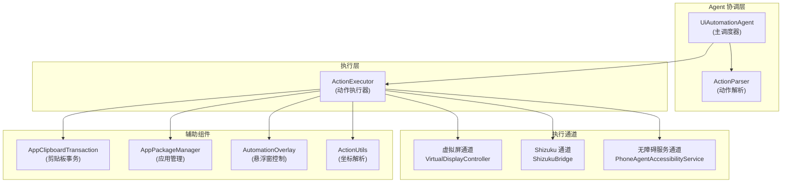
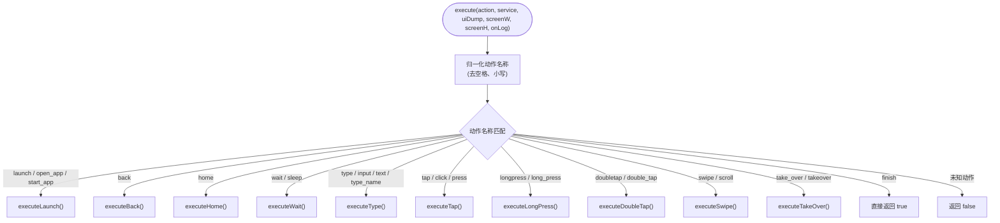
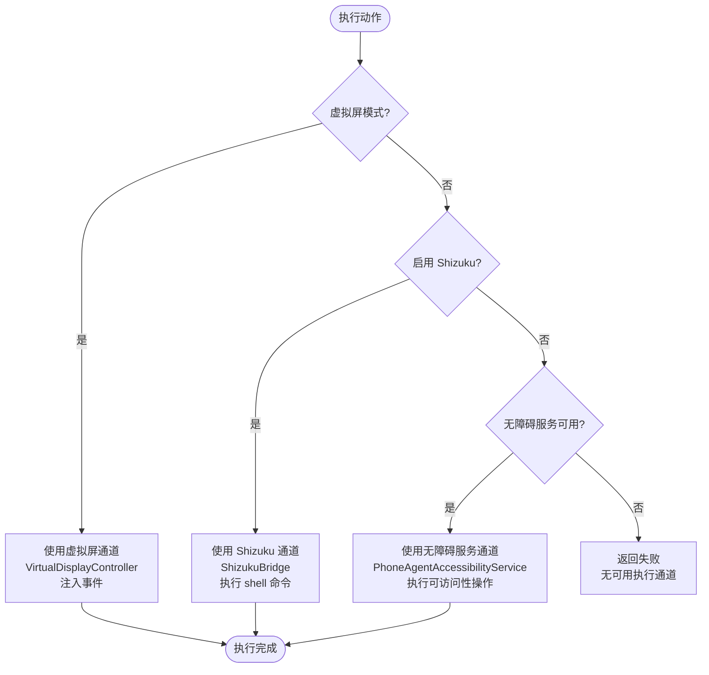
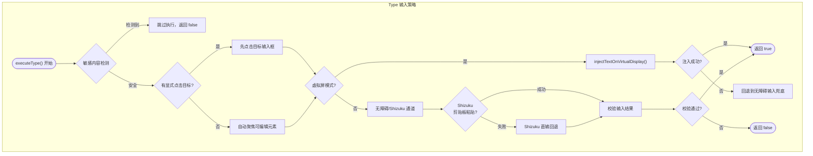
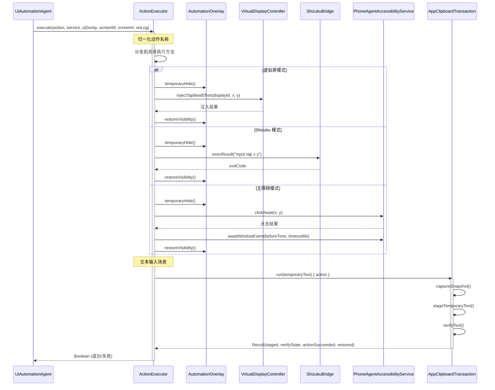

# 动作执行器 (ActionExecutor)

动作执行器是 Aries AI 自动化框架中的核心执行组件，负责将 AI 模型生成的解析动作（ParsedAgentAction）转换为实际的 Android UI 操作。

## 概述

`ActionExecutor` 位于 Aries AI 分层架构的**执行层**，是连接 AI 推理结果与真实设备操作的关键桥梁。它接收来自 `ActionParser` 的标准化动作指令，并根据当前运行环境智能选择最优执行通道。

**核心设计目标：**

1. **多通道自适应**：根据运行模式（虚拟屏 / Shizuku / 无障碍服务）自动选择最优执行路径，并在当前通道失败时自动回退
2. **健壮性优先**：每个动作类型都有多层回退策略，确保在复杂 Android 环境下尽可能完成任务
3. **安全内建**：内置敏感内容检测、悬浮窗自动隐藏/恢复、剪贴板快照/恢复机制
4. **可观测性**：通过 `onLog` 回调提供细粒度的执行阶段日志，支持调试和排错

**在系统架构中的位置：**

```
任务输入 → UiAutomationAgent → 截图/UI树采集 → 模型推理 → 动作解析(ActionParser) → 动作执行(ActionExecutor) → 执行反馈 → 循环
```

## 架构

### 系统上下文图



> `ActionExecutor` 被 `UiAutomationAgent` 创建和调用，通过三个执行通道将动作传递到 Android 系统。辅助组件提供剪贴板管理、应用解析、悬浮窗控制和坐标解析等支持功能。

### 动作分发架构



> `execute()` 方法作为统一入口，首先对动作名称进行归一化处理（去掉引号、空格，转为小写），然后通过 `when` 表达式分发到对应的专用执行方法。

### 执行通道选择策略



> 执行通道选择遵循固定优先级：**虚拟屏 > Shizuku > 无障碍服务**。当高优先级通道不可用或执行失败时，会尝试回退到下一优先级的通道。

## 核心设计

### 设计原则

1. **通道无关性**：上层调用者（UiAutomationAgent）无需关心具体的执行通道，`ActionExecutor` 内部完成通道选择与回退
2. **宽松解析**：对模型输出的字段名做大量兼容处理（如 `resourceId`、`resource_id`、`resourceid` 等效），降低模型输出格式要求
3. **防御性编程**：每次操作前检查敏感内容，执行期间自动隐藏悬浮窗避免遮挡，输入操作后进行验证确保内容正确写入
4. **事务安全**：剪贴板操作使用快照-写入-验证-恢复的事务模式，确保用户剪贴板数据不被污染

### 坐标系统

Aries AI 使用 **0-1000 归一化坐标系**，通过 `ActionUtils.parsePointToScreen()` 方法转换为实际像素坐标：

```
像素坐标 = (归一化坐标 / 1000.0) × 屏幕尺寸
```

> Source: [ActionUtils.kt](https://github.com/ZG0704666/Aries-AI/blob/main/app/src/main/java/com/ai/phoneagent/core/utils/ActionUtils.kt#L180-L186)

### 敏感内容检测

在执行 `type` 和 `tap` 动作前，会检查 UI 树中是否包含敏感关键词（支付密码、银行卡号、验证码等），若匹配则跳过执行，防止自动化操作触及敏感界面。

> Source: [ActionExecutor.kt](https://github.com/ZG0704666/Aries-AI/blob/main/app/src/main/java/com/ai/phoneagent/core/executor/ActionExecutor.kt#L523-L526)

### 悬浮窗管理

通过 `withAutomationOverlayHidden()` 内联函数，在执行动作前临时隐藏悬浮窗，执行后在 `finally` 块中恢复显示，避免悬浮窗遮挡目标控件：

> Source: [ActionExecutor.kt](https://github.com/ZG0704666/Aries-AI/blob/main/app/src/main/java/com/ai/phoneagent/core/executor/ActionExecutor.kt#L144-L153)

## 支持的动作类型

| 动作名称（别名） | 执行方法 | 说明 |
|---|---|---|
| `launch` / `open_app` / `start_app` | `executeLaunch()` | 启动应用，支持通过包名/应用名/标签智能匹配 |
| `back` | `executeBack()` | 执行返回操作 |
| `home` | `executeHome()` | 回到主屏幕 |
| `wait` / `sleep` | `executeWait()` | 等待指定时长（支持 ms/s/second 单位） |
| `type` / `input` / `text` / `type_name` | `executeType()` | 文本输入（支持剪贴板粘贴、Shizuku 直输、无障碍输入） |
| `tap` / `click` / `press` | `executeTap()` | 点击操作（支持坐标点击和元素选择器点击） |
| `longpress` / `long_press` / `long press` | `executeLongPress()` | 长按操作 |
| `doubletap` / `double_tap` / `double tap` | `executeDoubleTap()` | 双击操作 |
| `swipe` / `scroll` | `executeSwipe()` | 滑动操作 |
| `take_over` / `takeover` | `executeTakeOver()` | 请求人工接管 |
| `finish` | — | 任务完成，直接返回 true |

## 动作执行详解

### 应用启动（Launch）

应用启动采用**三级智能匹配**策略：

1. **精确匹配**：通过 `AppPackageManager.resolvePackageName()` 使用 Shizuku 查询已安装应用
2. **标签匹配**：通过无障碍服务的 `resolvePackageByLabel()` 按应用显示名称查找
3. **模糊匹配**：当精确匹配无结果时，回退到所有已安装应用列表做词边界匹配

在虚拟屏模式下，启动通过 Shizuku 的 `cmd activity start-activity --display` 命令进行，并准备了多种格式的命令候选以提高成功率。

> Source: [ActionExecutor.kt](https://github.com/ZG0704666/Aries-AI/blob/main/app/src/main/java/com/ai/phoneagent/core/executor/ActionExecutor.kt#L213-L333)

### 文本输入（Type）

文本输入是 `ActionExecutor` 中最复杂的操作，体现了多层次回退设计理念：



> 文本输入策略体现了"先尝试最优路径，逐层回退"的设计思想。虚拟屏模式下剪贴板粘贴优先，Shizuku 模式下也遵循剪贴板→直输→无障碍的回退链。

### 虚拟屏文本注入策略

`injectTextOnVirtualDisplay()` 方法内部实现三级注入策略：

1. **ASCII 直输**：对于纯 ASCII 文本且指定 displayId 时，优先使用 `input -d <displayId> text` 命令直输
2. **剪贴板粘贴**：始终尝试剪贴板写入+粘贴（通过 `AppClipboardTransaction` 事务保证安全）
3. **直输回退**：剪贴板失败时回退到 `input text` 直输
4. **前台回退**：指定 display 注入失败时，回退到前台输入兜底

> Source: [ActionExecutor.kt](https://github.com/ZG0704666/Aries-AI/blob/main/app/src/main/java/com/ai/phoneagent/core/executor/ActionExecutor.kt#L1014-L1051)

### 元素定位（Tap/Type 通用）

在执行点击和输入时，`ActionExecutor` 支持两种定位方式：

1. **选择器定位**（仅无障碍服务模式）：通过 `resourceId`、`contentDesc`、`className`、`elementText` 属性定位元素
2. **坐标定位**（所有通道）：通过 `element`/`point`/`pos` 字段指定的归一化坐标（0-1000）转换为像素坐标

选择器定位仅在非虚拟屏、非 Shizuku 且有可用无障碍服务时尝试，失败后自动回退到坐标定位。

> Source: [ActionExecutor.kt](https://github.com/ZG0704666/Aries-AI/blob/main/app/src/main/java/com/ai/phoneagent/core/executor/ActionExecutor.kt#L737-L758)

## 核心执行流程

以下是 `UiAutomationAgent` 调用 `ActionExecutor` 的完整交互序列：



> 所有通道的执行都包裹在 `withAutomationOverlayHidden()` 中，确保悬浮窗在操作前隐藏、操作后恢复。虚拟屏模式下额外调用 `ensureVdFocus()` 预留了焦点准备逻辑（当前为 no-op）。

## 使用示例

### 基本用法 - 点击操作

以下示例展示 `UiAutomationAgent` 如何调用 `ActionExecutor` 执行点击动作：

```kotlin
// UiAutomationAgent 中创建和使用 ActionExecutor
private val actionExecutor = ActionExecutor(appContext, config)

// 执行点击动作
actionExecutor.execute(
    currentAction,      // ParsedAgentAction - 包含动作名和参数
    service,            // PhoneAgentAccessibilityService? - 无障碍服务
    uiDump,             // String - UI 树 XML 文本
    currentScreenW,     // Int - 屏幕宽度（像素）
    currentScreenH,     // Int - 屏幕高度（像素）
    onLog               // (String) -> Unit - 日志回调
)
```

> Source: [UiAutomationAgent.kt](https://github.com/ZG0704666/Aries-AI/blob/main/app/src/main/java/com/ai/phoneagent/UiAutomationAgent.kt#L67)

### 高级用法 - Tap+Type 合并执行

```kotlin
// UiAutomationAgent 中的合并执行逻辑
// 将点击输入框和输入文本合并为一步操作
if (isVdMode) {
    val displayId = VirtualDisplayController.getDisplayId() ?: -1
    VirtualDisplayController.injectTapBestEffort(displayId, x.toInt(), y.toInt())
    delay(config.tapTypeCombineKeyboardWaitMs)

    var result = actionExecutor.injectTextOnVirtualDisplay(displayId, inputText, onLog)
    if (!result) {
        // 虚拟屏输入失败，补一次点击后重试
        onLog("[合并执行] 虚拟屏输入失败，补一次点击后重试")
        VirtualDisplayController.injectTapBestEffort(displayId, x.toInt(), y.toInt())
        delay(config.tapTypeCombineSecondSetTextWaitMs)
        result = actionExecutor.injectTextOnVirtualDisplay(displayId, inputText, onLog)
    }
    if (!result && service != null) {
        // 虚拟屏输入仍失败，回退到无障碍输入兜底
        onLog("[合并执行] 虚拟屏输入仍失败，回退到无障碍输入兜底")
        return actionExecutor.execute(typeAction, service, uiDump, screenW, screenH, onLog)
    }
    return result
}
```

> Source: [UiAutomationAgent.kt](https://github.com/ZG0704666/Aries-AI/blob/main/app/src/main/java/com/ai/phoneagent/UiAutomationAgent.kt#L999-L1016)

### 解析动作数据结构

```kotlin
/**
 * 解析的Agent动作
 * 核心数据结构，被 UiAutomationAgent、ActionParser、ActionExecutor 等模块使用
 */
data class ParsedAgentAction(
    val metadata: String,           // "do" 或 "finish"
    val actionName: String?,        // 动作名称（如 tap, swipe）
    val fields: Map<String, String>, // 动作参数
    val raw: String = ""            // 原始响应
)
```

> Source: [AgentModels.kt](https://github.com/ZG0704666/Aries-AI/blob/main/app/src/main/java/com/ai/phoneagent/core/agent/AgentModels.kt#L7-L12)

## 配置选项

以下列出 `AgentConfiguration` 中与 `ActionExecutor` 直接相关的配置参数：

### 执行通道配置

| 选项 | 类型 | 默认值 | 说明 |
|------|------|--------|------|
| `useBackgroundVirtualDisplay` | `Boolean` | `false` | 是否启用后台虚拟屏执行模式 |
| `useShizukuInteraction` | `Boolean` | `false` | 是否启用 Shizuku 交互能力 |

### 动作延迟参数

| 选项 | 类型 | 默认值 | 说明 |
|------|------|--------|------|
| `launchActionDelayMs` | `Long` | `1050` | 启动应用后延迟（ms） |
| `typeActionDelayMs` | `Long` | `260` | 输入动作延迟（ms） |
| `tapActionDelayMs` | `Long` | `320` | 点击动作延迟（ms） |
| `swipeActionDelayMs` | `Long` | `420` | 滑动动作延迟（ms） |
| `backActionDelayMs` | `Long` | `220` | 返回动作延迟（ms） |
| `homeActionDelayMs` | `Long` | `420` | 回主页动作延迟（ms） |
| `waitActionDelayMs` | `Long` | `650` | 等待动作延迟（ms） |
| `defaultActionDelayMs` | `Long` | `240` | 默认动作延迟（ms） |

### 窗口事件等待超时

| 选项 | 类型 | 默认值 | 说明 |
|------|------|--------|------|
| `launchAwaitWindowTimeoutMs` | `Long` | `2200` | 启动等待窗口事件超时（ms） |
| `backAwaitWindowTimeoutMs` | `Long` | `1400` | 返回等待窗口事件超时（ms） |
| `homeAwaitWindowTimeoutMs` | `Long` | `1800` | 回主页等待窗口事件超时（ms） |
| `tapAwaitWindowTimeoutMs` | `Long` | `1400` | 点击等待窗口事件超时（ms） |
| `swipeAwaitWindowTimeoutMs` | `Long` | `1600` | 滑动等待窗口事件超时（ms） |
| `typeAwaitWindowTimeoutMs` | `Long` | `1200` | 输入等待窗口事件超时（ms） |
| `defaultAwaitWindowTimeoutMs` | `Long` | `1500` | 默认窗口事件等待超时（ms） |

### 点击/长按/双击参数

| 选项 | 类型 | 默认值 | 说明 |
|------|------|--------|------|
| `clickDurationMs` | `Long` | `60` | 点击持续时间（ms） |
| `longPressDurationMs` | `Long` | `520` | 长按持续时间（ms） |
| `doubleTapIntervalMs` | `Long` | `90` | 双击间隔时间（ms） |

### 滚动/输入参数

| 选项 | 类型 | 默认值 | 说明 |
|------|------|--------|------|
| `scrollDurationMs` | `Long` | `400` | 滑动持续时间（ms） |
| `defaultScrollDirection` | `String` | `"down"` | 默认滑动方向 |
| `shizukuAutoFocusFirstTypeOnly` | `Boolean` | `true` | Shizuku 输入自动聚焦策略（仅首轮 Type 前自动聚焦一次） |
| `appLaunchWaitTimeoutMs` | `Long` | `2200` | 应用启动等待超时（ms） |

### 敏感内容检测

| 选项 | 类型 | 默认值 | 说明 |
|------|------|--------|------|
| `sensitiveKeywords` | `List<String>` | `["支付密码", "银行卡", ...]` | 敏感关键词列表（触发时跳过 tap/type 操作） |

### Tap+Type 合并执行参数

| 选项 | 类型 | 默认值 | 说明 |
|------|------|--------|------|
| `tapTypeCombineKeyboardWaitMs` | `Long` | `400` | Tap后等待键盘弹出（ms） |
| `tapTypeCombineSecondSetTextWaitMs` | `Long` | `250` | 二次输入等待间隔（ms） |

> Source: [AgentConfiguration.kt](https://github.com/ZG0704666/Aries-AI/blob/main/app/src/main/java/com/ai/phoneagent/core/config/AgentConfiguration.kt#L38-L356)

## API 参考

### `execute(action, service, uiDump, screenW, screenH, onLog): Boolean`

执行单条解析动作，并路由到对应执行器。这是 `ActionExecutor` 的主入口方法。

**参数：**

| 参数名 | 类型 | 说明 |
|--------|------|------|
| `action` | `ParsedAgentAction` | 解析后的 Agent 动作，包含动作名和参数字段 |
| `service` | `PhoneAgentAccessibilityService?` | 无障碍服务实例（可为 null） |
| `uiDump` | `String` | UI 树的 XML 文本表示 |
| `screenW` | `Int` | 屏幕宽度（像素） |
| `screenH` | `Int` | 屏幕高度（像素） |
| `onLog` | `(String) -> Unit` | 日志回调函数 |

**返回：** `Boolean` — 执行成功返回 `true`，失败返回 `false`

> Source: [ActionExecutor.kt](https://github.com/ZG0704666/Aries-AI/blob/main/app/src/main/java/com/ai/phoneagent/core/executor/ActionExecutor.kt#L171-L211)

---

### `injectTextOnVirtualDisplay(displayId, text, onLog): Boolean`

在虚拟屏场景注入文本（内部方法，但对合并执行等场景开放调用）。

**参数：**

| 参数名 | 类型 | 说明 |
|--------|------|------|
| `displayId` | `Int` | 虚拟屏 display ID（≤0 表示前台注入） |
| `text` | `String` | 要注入的文本内容 |
| `onLog` | `(String) -> Unit` | 日志回调 |

**返回：** `Boolean` — 注入成功返回 `true`

**注入策略：**
1. ASCII 文本 + 指定 displayId → 先尝试 `input -d displayId text` 直输
2. 剪贴板写入 + 粘贴（始终尝试）
3. 回退到 `input text` 直输
4. 指定 display 失败时回退到前台输入

> Source: [ActionExecutor.kt](https://github.com/ZG0704666/Aries-AI/blob/main/app/src/main/java/com/ai/phoneagent/core/executor/ActionExecutor.kt#L1014-L1051)

---

### `resetSessionState()`

重置会话状态。清除 Shizuku 的自动聚焦消费标记（`shizukuAutoFocusConsumed`），用于新一轮任务开始时重置焦点逻辑。

> Source: [ActionExecutor.kt](https://github.com/ZG0704666/Aries-AI/blob/main/app/src/main/java/com/ai/phoneagent/core/executor/ActionExecutor.kt#L166-L168)

## 相关链接

### 核心依赖

- [ParsedAgentAction (数据模型)](https://github.com/ZG0704666/Aries-AI/blob/main/app/src/main/java/com/ai/phoneagent/core/agent/AgentModels.kt) — 被 ActionExecutor 消费的核心数据结构
- [AgentConfiguration (配置管理)](https://github.com/ZG0704666/Aries-AI/blob/main/app/src/main/java/com/ai/phoneagent/core/config/AgentConfiguration.kt) — 所有执行参数和超时配置
- [ActionUtils (工具类)](https://github.com/ZG0704666/Aries-AI/blob/main/app/src/main/java/com/ai/phoneagent/core/utils/ActionUtils.kt) — 坐标解析、敏感检测等辅助方法
- [AppClipboardTransaction (剪贴板事务)](https://github.com/ZG0704666/Aries-AI/blob/main/app/src/main/java/com/ai/phoneagent/core/input/AppClipboardTransaction.kt) — 安全的剪贴板快照-写入-恢复事务

### 调用方

- [UiAutomationAgent (主调度器)](https://github.com/ZG0704666/Aries-AI/blob/main/app/src/main/java/com/ai/phoneagent/UiAutomationAgent.kt) — ActionExecutor 的主要调用者

### 执行通道

- [VirtualDisplayController](https://github.com/ZG0704666/Aries-AI/blob/main/app/src/main/java/com/ai/phoneagent/VirtualDisplayController.kt) — 虚拟屏事件注入
- [ShizukuBridge](https://github.com/ZG0704666/Aries-AI/blob/main/app/src/main/java/com/ai/phoneagent/ShizukuBridge.kt) — Shizuku 系统级命令执行
- [PhoneAgentAccessibilityService](https://github.com/ZG0704666/Aries-AI/blob/main/app/src/main/java/com/ai/phoneagent/PhoneAgentAccessibilityService.kt) — 无障碍服务

### 系统架构

- [Aries AI 开发文档](https://github.com/ZG0704666/Aries-AI/blob/main/Aries%20AI%20%E5%BC%80%E5%8F%91%E6%96%87%E6%A1%A3.md) — 项目整体架构说明
