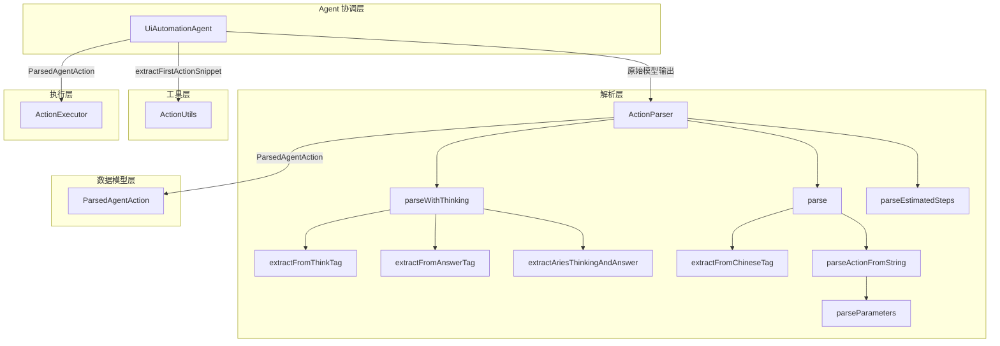
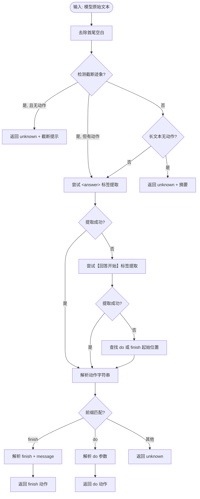
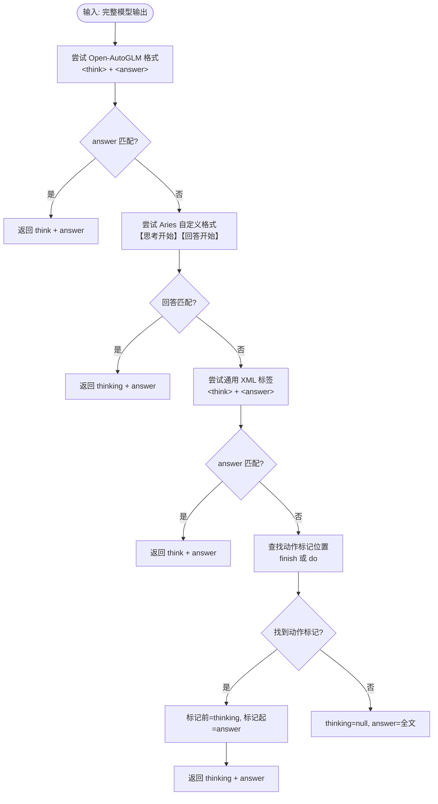
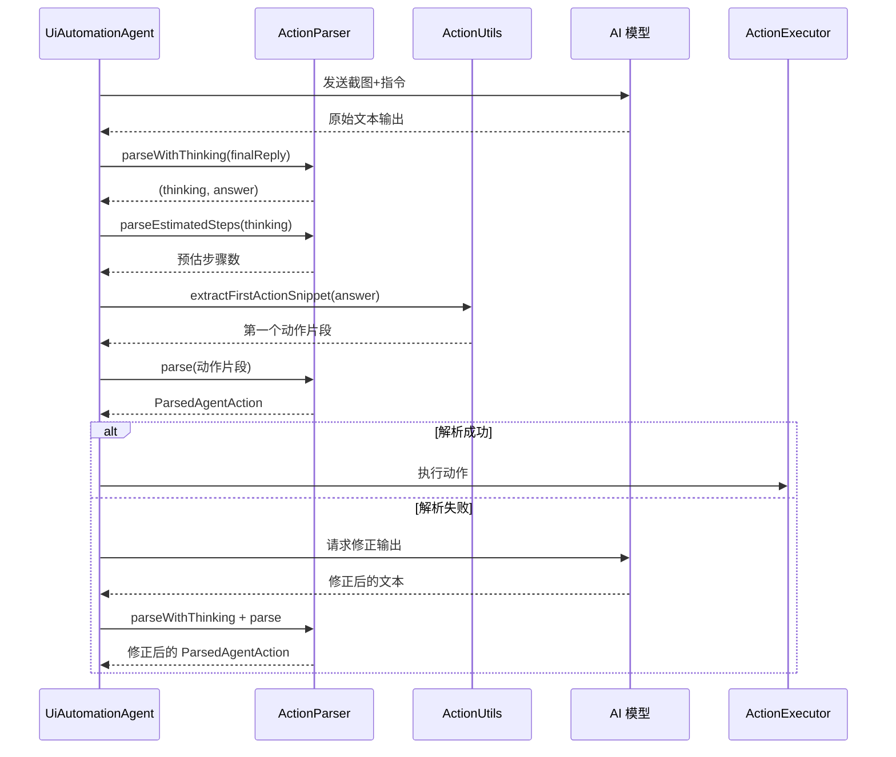

# 动作解析器 (ActionParser)

ActionParser 是 Aries-AI 中负责解析 AI 模型输出文本、提取自动化动作信息的核心组件。它将模型生成的原始文本（可能包含思考过程和动作指令）转换为结构化的 `ParsedAgentAction` 数据对象，供下游执行器使用。

---

## 概述

在 Aries-AI 的 UI 自动化流水线中，AI 模型（如 AutoGLM）接收屏幕截图和用户指令后，返回自然语言文本输出。这些输出通常包含两个部分：

1. **思考过程（Thinking）**：模型对当前屏幕状态的分析、下一步计划等推理内容
2. **动作指令（Answer）**：具体的自动化操作，如点击坐标、输入文本、滑动屏幕或结束任务

ActionParser 的核心职责是将这些非结构化的文本输出**可靠地解析**为结构化动作数据。它需要处理多种模型输出格式、容错截断输出、以及应对模型的"不听话"（输出不符合预期格式）。

**设计意图（WHY）：**
- **解耦解析逻辑**：将文本解析从主 Agent 循环中分离，遵循单一职责原则，便于独立测试和维护
- **多格式兼容**：支持 Open-AutoGLM 的 `<think>/<answer>` XML 标签格式、Aries 自有的中文标签格式以及原始动作字符串格式，确保对各种模型后端的兼容
- **鲁棒性优先**：面对模型输出的截断、格式错误、语言混用等边缘情况，通过多层回退策略保证系统不崩溃

ActionParser 在 Aries-AI 分层架构中属于**解析层**，上游是 `UiAutomationAgent`（主 Agent），下游是 `ActionExecutor`（动作执行器）。

---

## 架构



**架构说明：**

- **UiAutomationAgent** 是 ActionParser 的唯一调用方，在 Agent 主循环的两个关键路径中使用它：
  - 步骤执行时：解析模型的思考+动作输出，并估算步骤数
  - 解析修复时：当动作无法解析时，重新请求模型修正输出后再次解析
- **ActionParser** 对外暴露三个公共方法：`parse`（核心解析）、`parseWithThinking`（思考/动作分离）、`parseEstimatedSteps`（步骤估算），内部由多个私有辅助方法组成
- **ParsedAgentAction** 是解析结果的数据载体，包含 `metadata`（"do"/"finish"/"unknown"）、`actionName`、`fields` 和 `raw` 四个字段
- **ActionUtils** 在解析之前提供 `extractFirstActionSnippet` 辅助方法，从回答文本中提取第一个动作片段，减轻 ActionParser 的负担

---

## 核心数据结构

### ParsedAgentAction

```kotlin
data class ParsedAgentAction(
    val metadata: String,           // "do" 或 "finish"
    val actionName: String?,        // 动作名称（如 tap, swipe）
    val fields: Map<String, String>, // 动作参数
    val raw: String = ""            // 原始响应
)
```
> Source: [AgentModels.kt](https://github.com/ZG0704666/Aries-AI/blob/main/app/src/main/java/com/ai/phoneagent/core/agent/AgentModels.kt#L7-L12)

| 字段 | 类型 | 说明 |
|------|------|------|
| `metadata` | `String` | 动作类型：`"do"` 表示执行操作，`"finish"` 表示任务完成，`"unknown"` 表示无法识别 |
| `actionName` | `String?` | 具体动作名称，如 `"Tap"`、`"Swipe"`、`"Launch"`、`"Type"` 等，`finish` 时为 null |
| `fields` | `Map<String, String>` | 动作的键值对参数，如 `element`、`text`、`start`、`end`、`message` 等 |
| `raw` | `String` | 解析前的原始文本片段，用于日志和调试 |

---

## 解析流程

### 主解析流程 — `parse()` 方法



这个流程的设计体现了**防御式解析**的核心理念：

1. **截断检测作为第一道防线**：针对模型输出被截断的常见故障模式，提前识别并返回明确的错误信息，而非产生无意义的 `unknown`
2. **标签提取优先于位置查找**：`<answer>` 和【回答开始】标签提供了更精确的动作边界，优先使用它们可以避免将思考内容误判为动作
3. **位置查找作为兜底**：当所有标签都缺失时，直接在文本中搜索 `do(` 或 `finish(` 的最后出现位置，提高容错能力

### 思考/动作分离 — `parseWithThinking()` 方法



**设计意图：** `parseWithThinking` 是 `parse` 的前置步骤。模型输出通常混合了推理过程和动作指令，先分离再解析可以让两个步骤各司其职。分离后的 thinking 还可用于步骤预估（`parseEstimatedSteps`），而 answer 则传递给 `parse` 进行结构化解析。

---

## 支持的输入格式

### 格式一：Open-AutoGLM 标准格式

```
<think>
我需要先点击搜索按钮，然后输入关键词...
</think>

<answer>
do(action="Tap", element=[500,300])
</answer>
```

这是 Open-AutoGLM 模型的原生输出格式，也是 Aries-AI 的**首选格式**。

### 格式二：Aries 自定义中文标签格式

```
【思考开始】
当前屏幕显示了一个搜索界面，我需要...
【思考结束】

【回答开始】
do(action="Tap", element=[500,300])
【回答结束】
```

Aries 自有格式，兼容不支持标准 XML 标签的模型后端。

### 格式三：纯动作字符串（无思考标记）

```
do(action="Tap", element=[500,300])
```

或

```
finish(message="任务已完成")
```

当模型输出不包含任何思考/回答标记时的兜底解析。解析器会在文本中搜索 `do(` 或 `finish(` 的位置。

---

## 参数解析

ActionParser 使用正则表达式解析 `do(...)` 内的键值对参数：

```kotlin
private fun parseParameters(paramsStr: String): Map<String, String> {
    val fields = mutableMapOf<String, String>()
    val regex = Regex("""(\w+)\s*=\s*(?:\[(.*?)\]|"(.*?)"|'([^']*)'|([^,)]+))""")
    regex.findAll(paramsStr).forEach { m ->
        val key = m.groupValues[1].trim()
        if (key.isBlank()) return@forEach
        val value = m.groupValues.drop(2).firstOrNull { it.isNotEmpty() } ?: ""
        fields[key] = value
        val lowerKey = key.lowercase()
        if (!fields.containsKey(lowerKey)) {
            fields[lowerKey] = value
        }
    }
    return fields
}
```
> Source: [ActionParser.kt](https://github.com/ZG0704666/Aries-AI/blob/main/app/src/main/java/com/ai/phoneagent/core/parser/ActionParser.kt#L165-L179)

支持四种参数值格式：

| 格式 | 示例 | 说明 |
|------|------|------|
| 方括号数组 | `element=[500,300]` | 用于坐标等数组值 |
| 双引号字符串 | `text="你好世界"` | 标准字符串 |
| 单引号字符串 | `text='hello'` | 备选字符串格式 |
| 裸值 | `app=微信` | 无引号的简单值 |

**设计细节：** 解析器同时存储原始 key 和小写 key，这样后续代码无论使用 `fields["action"]` 还是 `fields["Action"]` 都能正确获取值。

---

## 步骤预估 — `parseEstimatedSteps()`

ActionParser 还负责从模型的思考文本中预估任务所需的总步骤数，用于给用户显示进度信息：

```kotlin
fun parseEstimatedSteps(thinking: String): Int {
    // 1. 显式模式："需要5步完成"
    // 2. "我需要" 模式：解析编号列表中的最大数字
    // 3. 编号步骤模式：提取 "1. xxx  2. xxx  3. xxx" 中的最大编号
    // 4. 动作关键词计数：统计"点击""输入""滑动"等关键词出现次数
    return 0  // 无法预估时返回 0
}
```
> Source: [ActionParser.kt](https://github.com/ZG0704666/Aries-AI/blob/main/app/src/main/java/com/ai/phoneagent/core/parser/ActionParser.kt#L288-L341)

预估策略采用**四级回退机制**：

```mermaid
flowchart TD
    Input[思考文本] --> Strategy1[策略1: 显式数字匹配<br/>"需要约5步完成" → 5]
    Strategy1 --> Found1{命中?}
    Found1 -->|是| Return1[返回数值]
    Found1 -->|否| Strategy2

    Strategy2[策略2: "我需要"模式<br/>解析编号列表最大数字]
    Strategy2 --> Found2{命中且2≤n≤20?}
    Found2 -->|是| Return2[返回数值]
    Found2 -->|否| Strategy3

    Strategy3[策略3: 编号步骤匹配<br/>"1.xxx 2.xxx 3.xxx" → 3]
    Strategy3 --> Found3{命中且2≤n≤20?}
    Found3 -->|是| Return3[返回数值]
    Found3 -->|否| Strategy4

    Strategy4[策略4: 动作关键词计数<br/>统计"点击""输入"等词频]
    Strategy4 --> Found4{计数≥2?}
    Found4 -->|是| Return4[返回限制在2-15]
    Found4 -->|否| Return0[返回 0 = 无法预估]
```

**设计意图：** 步骤预估不是一个精确计算，而是给用户提供心理预期。因此返回值的约束范围是 2-20（显式/编号模式）或 2-15（关键词模式）。返回 0 表示"无法预估"，UI 层会隐藏步骤指示器。

---

## 在 Agent 主循环中的使用



---

## 使用示例

### 基本用法 — 解析 do 动作

```kotlin
val parser = ActionParser()
val action = parser.parse("do(action=\"Tap\", element=[500,500])")

// action.metadata == "do"
// action.actionName == "Tap"
// action.fields["element"] == "500,500"
```
> Source: [CoreModuleTest.kt](https://github.com/ZG0704666/Aries-AI/blob/main/app/src/test/java/com/ai/phoneagent/core/CoreModuleTest.kt#L63-L69)

### 解析 finish 动作

```kotlin
val parser = ActionParser()
val action = parser.parse("finish(message=\"任务完成\")")

// action.metadata == "finish"
// action.fields["message"] == "任务完成"
```
> Source: [CoreModuleTest.kt](https://github.com/ZG0704666/Aries-AI/blob/main/app/src/test/java/com/ai/phoneagent/core/CoreModuleTest.kt#L73-L78)

### 解析带思考的回答

```kotlin
val parser = ActionParser()
val (thinking, answer) = parser.parseWithThinking("""
    【思考开始】
    我需要点击这个按钮来完成操作
    【思考结束】
    
    【回答开始】
    do(action="Tap", element=[300,400])
    【回答结束】
""".trimIndent())

// thinking 包含 "我需要点击这个按钮来完成操作"
// answer 包含 "do(action="Tap", element=[300,400])"
```
> Source: [CoreModuleTest.kt](https://github.com/ZG0704666/Aries-AI/blob/main/app/src/test/java/com/ai/phoneagent/core/CoreModuleTest.kt#L82-L97)

### 解析预估步骤数

```kotlin
val parser = ActionParser()

// 显式数字
val steps1 = parser.parseEstimatedSteps("我需要大约5步完成")
// steps1 == 5

// 编号步骤
val steps2 = parser.parseEstimatedSteps("第一步...第二步...第三步")
// steps2 == 3
```
> Source: [CoreModuleTest.kt](https://github.com/ZG0704666/Aries-AI/blob/main/app/src/test/java/com/ai/phoneagent/core/CoreModuleTest.kt#L101-L110)

### 在 Agent 主循环中的实际调用

```kotlin
// 1. 分离思考和动作
val (thinking, answer) = actionParser.parseWithThinking(finalReply)

// 2. 记录思考内容
if (!thinking.isNullOrBlank()) {
    onLog("[Step $step] 思考：$thinking")
    // 第一步时预估总步骤数
    if (step == 1) {
        val estimatedSteps = actionParser.parseEstimatedSteps(thinking)
        if (estimatedSteps > 0) {
            AutomationOverlay.updateEstimatedSteps(estimatedSteps)
        }
    }
}

// 3. 解析动作
val action = actionParser.parse(
    ActionUtils.extractFirstActionSnippet(answerText) ?: answerText
)
```
> Source: [UiAutomationAgent.kt](https://github.com/ZG0704666/Aries-AI/blob/main/app/src/main/java/com/ai/phoneagent/UiAutomationAgent.kt#L383-L411)

---

## 异常与边缘情况处理

| 场景 | 检测方式 | 处理策略 |
|------|----------|----------|
| **输出被截断** | 检测 `\uFFFD`、末尾 `…`/`...`、"我需要"无动作 | 返回 `metadata="unknown"`，`raw` 中包含截断提示 |
| **长文本无动作** | `text=` 出现 + 大量 `=` + 无 `do(`/`finish(` | 返回 `unknown` + 前 200 字符摘要 |
| **do 命令不完整** | 找不到 `(` | 返回 `unknown` + "do命令不完整" |
| **无法匹配 action 参数** | `do(...)` 解析后无 `action` 键 | 返回 `unknown` |
| **括号未闭合** | 括号计数无法归零 | 使用截断策略：取 `(` 后内容并去除末尾括号/逗号 |
| **多层标签/嵌套** | 多种标签同时存在 | 按优先级：Open-AutoGLM → Aries 中文 → XML → 简单位置查找 |
| **无法分离思考/动作** | `parseWithThinking` 所有策略失败 | 返回 `(null, 全文)`，将全文作为 answer |

---

## 配置选项

ActionParser 本身是无状态的轻量类，不需要配置参数。与解析行为相关的配置位于 `AgentConfiguration` 中：

| 选项 | 类型 | 默认值 | 说明 |
|------|------|--------|------|
| `maxParseRepairs` | `Int` | `2` | 当解析失败时，向模型请求修正输出的最大重试次数 |
| `logAnswerTruncateLength` | `Int` | `220` | 日志中 answer 文本的截断长度 |

> Source: [AgentConfiguration.kt](https://github.com/ZG0704666/Aries-AI/blob/main/app/src/main/java/com/ai/phoneagent/core/config/AgentConfiguration.kt#L102) | [AgentConfiguration.kt](https://github.com/ZG0704666/Aries-AI/blob/main/app/src/main/java/com/ai/phoneagent/core/config/AgentConfiguration.kt#L303)

---

## API 参考

### `parse(raw: String): ParsedAgentAction`

解析模型输出文本中的动作指令。

**参数：**
- `raw` (`String`)：模型的原始输出文本，可包含思考、回答、标签等任意内容

**返回值：** `ParsedAgentAction`
- `metadata` 为 `"do"` 表示执行动作、`"finish"` 表示任务完成、`"unknown"` 表示无法解析
- `actionName` 在 `"do"` 时包含动作名称，如 `"Tap"`, `"Swipe"`, `"Launch"`, `"Type"` 等
- `fields` 包含动作的全部键值对参数
- `raw` 包含用于解析的原始文本片段

**内部流程：**
1. 截断检测 → 2. 长文本检测 → 3. `<answer>` 标签提取 → 4. 【回答开始】标签提取 → 5. 位置查找 → 6. 动作字符串解析

---

### `parseWithThinking(content: String): Pair<String?, String>`

从模型输出中分离思考过程和动作指令。

**参数：**
- `content` (`String`)：模型的完整输出文本

**返回值：** `Pair<String?, String>`
- `first`：思考内容文本，如果无法分离则为 `null`
- `second`：动作指令文本

**支持的格式（按优先级）：**
1. Open-AutoGLM：`<think>...</think><answer>...</answer>`
2. Aries 自定义：`【思考开始】...【思考结束】【回答开始】...【回答结束】`
3. 通用 XML：`<think>...</think><answer>...</answer>`
4. 简单格式：以 `finish(` 或 `do(` 为分界

---

### `parseEstimatedSteps(thinking: String): Int`

从模型的思考文本中预估任务所需的总步骤数。

**参数：**
- `thinking` (`String`)：模型的思考内容

**返回值：** `Int`
- 预估的步骤数（2-20 之间），返回 `0` 表示无法预估

**预估策略（按优先级）：**
1. 显式数字匹配："需要5步完成" → 5
2. "我需要"模式中的编号列表
3. 文本中的步骤编号（如 "1.xxx  2.xxx"）
4. 动作关键词计数（"点击"、"输入"、"滑动"等）

---

## 性能特征

ActionParser 设计为轻量级解析器，无状态、无外部依赖：

```kotlin
// 1000 次解析四种典型动作的耗时 < 2000ms
val parser = ActionParser()
val actions = listOf(
    "do(action=\"Tap\", element=[500,500])",
    "do(action=\"Type\", text=\"测试文本\")",
    "do(action=\"Swipe\", start=[0,500], end=[0,1000])",
    "finish(message=\"任务完成\")"
)
repeat(1000) { actions.forEach { parser.parse(it) } }
```
> Source: [CoreModuleTest.kt](https://github.com/ZG0704666/Aries-AI/blob/main/app/src/test/java/com/ai/phoneagent/core/CoreModuleTest.kt#L216-L233)

单次解析通常在微秒级别完成，不会成为 Agent 主循环的性能瓶颈。

---

## 相关链接

- [ActionParser 源代码](https://github.com/ZG0704666/Aries-AI/blob/main/app/src/main/java/com/ai/phoneagent/core/parser/ActionParser.kt)
- [ParsedAgentAction 数据模型](https://github.com/ZG0704666/Aries-AI/blob/main/app/src/main/java/com/ai/phoneagent/core/agent/AgentModels.kt)
- [UiAutomationAgent — ActionParser 的调用方](https://github.com/ZG0704666/Aries-AI/blob/main/app/src/main/java/com/ai/phoneagent/UiAutomationAgent.kt)
- [ActionExecutor — 动作执行器](https://github.com/ZG0704666/Aries-AI/blob/main/app/src/main/java/com/ai/phoneagent/core/executor/ActionExecutor.kt)
- [ActionUtils — 动作工具类](https://github.com/ZG0704666/Aries-AI/blob/main/app/src/main/java/com/ai/phoneagent/core/utils/ActionUtils.kt)
- [AgentConfiguration — 解析相关配置](https://github.com/ZG0704666/Aries-AI/blob/main/app/src/main/java/com/ai/phoneagent/core/config/AgentConfiguration.kt)
- [CoreModuleTest — 单元测试](https://github.com/ZG0704666/Aries-AI/blob/main/app/src/test/java/com/ai/phoneagent/core/CoreModuleTest.kt)
