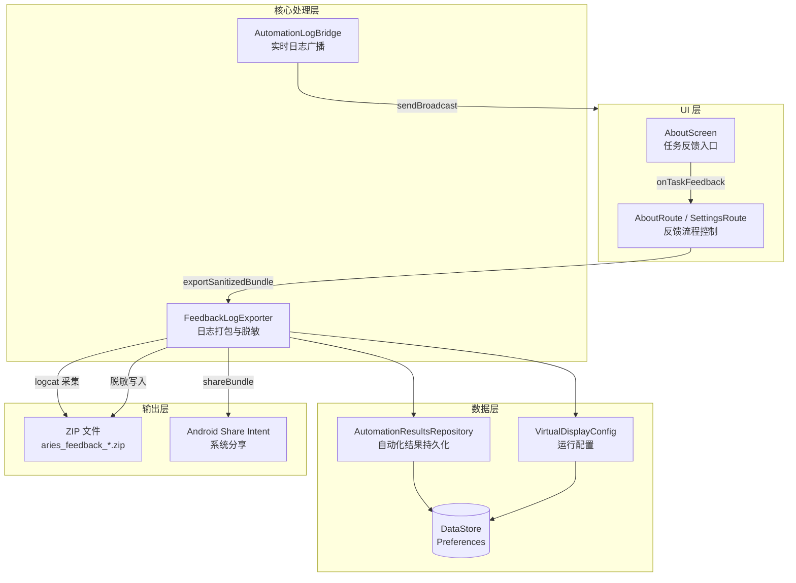
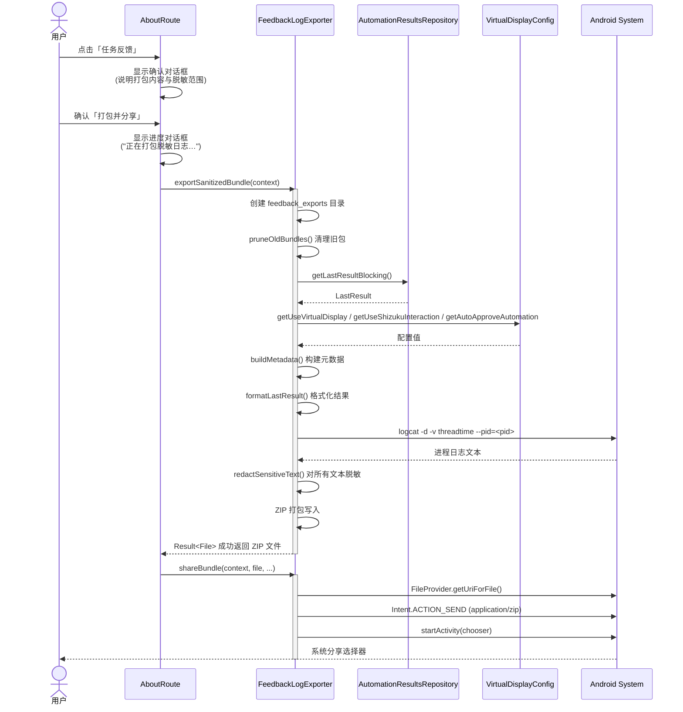

# 反馈日志与问题排查

Aries AI 提供了一套完整的反馈日志打包、脱敏与分享机制，以及面向开发者和用户的问题排查路径，帮助快速定位和解决自动化执行、模型请求及运行时相关问题。

## 概述

反馈日志系统是 Aries AI 问题排查的核心工具。当自动化任务执行异常、模型请求失败（如 429 限流）、权限缺失或出现其他运行时问题时，用户可通过「关于」页面一键打包当前进程日志、最近一次自动化执行结果和设备元数据，并自动对邮箱、手机号、Token、API Key、Cookie、密码等敏感字段进行脱敏处理，然后通过系统分享渠道发送给开发者。

**设计意图**：该系统采用"最小数据收集 + 自动脱敏"的设计思路——仅采集当前进程的 logcat 和最近一次自动化结果，避免过度收集用户数据；在写入 ZIP 之前对所有文本内容执行多层正则脱敏，确保敏感信息不会泄露。

## 架构



**架构说明**：

- **UI 层**：`AboutScreen` 提供「任务反馈」入口（Bug 图标）；`AboutRoute` 和 `SettingsRoute` 负责确认对话框流程、导出进度状态管理和分享调用
- **核心处理层**：`FeedbackLogExporter` 是单例工具类，负责 ZIP 打包、敏感数据脱敏、logcat 采集和旧包清理；`AutomationLogBridge` 通过 Android Broadcast 机制实时推送自动化执行日志
- **数据层**：`AutomationResultsRepository` 基于 DataStore 持久化最近一次自动化执行的成功/失败状态、步骤数、消息和完整日志；`VirtualDisplayConfig` 提供后台执行/Shizuku 交互/自动审批等运行配置
- **输出层**：生成带时间戳的 ZIP 包，通过 Android `FileProvider` + `Intent.ACTION_SEND` 分享给目标应用

## 核心组件

### FeedbackLogExporter — 日志打包与脱敏导出器

`FeedbackLogExporter` 是整个反馈系统的核心，负责将应用状态打包为可分享的 ZIP 文件。

> Source: [FeedbackLogExporter.kt](https://github.com/ZG0704666/Aries-AI/blob/main/app/src/main/java/com/ai/phoneagent/helper/FeedbackLogExporter.kt)

#### 打包内容

导出的 ZIP 包（命名为 `aries_feedback_yyyyMMdd_HHmmss.zip`）包含三个文件：

| 文件 | 内容 | 说明 |
|------|------|------|
| `metadata.txt` | 设备信息、应用版本、运行配置 | 包名、版本、设备厂商/型号、Android 版本、后台执行模式、Shizuku 交互状态、自动审批状态 |
| `automation_last_result.txt` | 最近一次自动化结果 | 时间、成功/失败状态、执行步骤数、消息、完整日志 |
| `logcat_current_process.txt` | 当前进程 logcat | 通过 `logcat -d -v threadtime --pid=<pid>` 采集的详细日志 |

#### 脱敏机制

系统内置 6 类正则脱敏规则，在写入 ZIP 前对所有文本执行：

| 模式 | 正则变量 | 脱敏策略 |
|------|---------|---------|
| Bearer Token | `bearerRegex` | `Bearer xxx` → `Bearer abc***yz` |
| HTTP Headers | `headerSecretRegex` | `authorization/cookie/x-api-key/token/password` 等敏感 header 值脱敏 |
| URL 查询参数 | `querySecretRegex` | `?token=abc123&...` → `?token=abc***23&...` |
| JSON 字段 | `jsonSecretRegex` | JSON 中的 `apiKey/token/password` 等字段值脱敏 |
| 邮箱 | `emailRegex` | `user@example.com` → `u***r@example.com` |
| 手机号 | `phoneRegex` | `13812345678` → `138****5678` |

脱敏辅助函数 `maskSecret()` 对于 ≤6 字符的值替换为 `***`，否则保留前 3 位和后 2 位（如 `abcdefgh` → `abc***gh`）。

> Source: [FeedbackLogExporter.kt#L23-L34](https://github.com/ZG0704666/Aries-AI/blob/main/app/src/main/java/com/ai/phoneagent/helper/FeedbackLogExporter.kt#L23-L34)
> Source: [FeedbackLogExporter.kt#L170-L216](https://github.com/ZG0704666/Aries-AI/blob/main/app/src/main/java/com/ai/phoneagent/helper/FeedbackLogExporter.kt#L170-L216)

#### 旧包清理

每次导出前，`pruneOldBundles()` 会按最后修改时间降序排列 `feedback_exports` 目录中的文件，仅保留最近的 5 个 ZIP 包，删除更早的文件。这避免了缓存目录无限膨胀。

> Source: [FeedbackLogExporter.kt#L163-L168](https://github.com/ZG0704666/Aries-AI/blob/main/app/src/main/java/com/ai/phoneagent/helper/FeedbackLogExporter.kt#L163-L168)

### AutomationLogBridge — 实时日志广播

`AutomationLogBridge` 是一个轻量级的进程内广播工具，用于在自动化执行过程中实时推送日志行。

> Source: [AutomationLogBridge.kt](https://github.com/ZG0704666/Aries-AI/blob/main/app/src/main/java/com/ai/phoneagent/core/automation/AutomationLogBridge.kt)

- **发布端**：`publish(context, line)` 通过 `sendBroadcast` 发送指定 Action 的 Intent，携带日志行
- **消费端**：`extract(intent)` 从 Intent 中提取日志文本
- **设计意图**：使用进程内广播而非直接回调，支持多组件解耦消费（如控制台 UI、日志持久化等），且空行会被自动过滤

### AutomationResultsRepository — 自动化结果持久化

基于 DataStore 的自动化结果存储，提供 Flow 响应式读取和阻塞式快照两种访问方式。

> Source: [AutomationResultsRepository.kt](https://github.com/ZG0704666/Aries-AI/blob/main/app/src/main/java/com/ai/phoneagent/data/preferences/AutomationResultsRepository.kt)

**存储字段**：

| 字段 | 类型 | 说明 |
|------|------|------|
| `last_result_success` | Boolean | 最近一次执行是否成功 |
| `last_result_message` | String | 最近一次执行的消息 |
| `last_result_steps` | Int | 最近一次执行的步骤数 |
| `last_result_time` | Long | 最近一次执行的时间戳 |
| `last_log` | String | 最近一次执行的完整日志 |

`LastResult` 数据类通过 `getLastResultBlocking()` 提供同步快照，供 `FeedbackLogExporter` 在打包时使用。

## 核心流程



**流程说明**：

1. **入口触发**：用户在「关于」页面点击「任务反馈」项，触发 `onTaskFeedback` 回调
2. **确认阶段**：弹出确认对话框，告知用户将打包的内容（当前应用日志 + 最近一次自动化结果）和脱敏范围（邮箱、手机号、Token、API Key、Cookie 等）
3. **导出阶段**：在 IO 协程中异步执行打包——采集 metadata、最近结果、进程 logcat，全部脱敏后写入 ZIP
4. **分享阶段**：通过 `FileProvider` 生成 content URI，构造 `ACTION_SEND` Intent 启动系统分享选择器
5. **错误处理**：导出失败时显示具体错误信息；分享失败时同样给出 Toast 提示

## 使用示例

### 在 AboutRoute 中触发反馈流程

> Source: [AboutRoute.kt#L110-L179](https://github.com/ZG0704666/Aries-AI/blob/main/app/src/main/java/com/ai/phoneagent/ui/settings/AboutRoute.kt#L110-L179)

```kotlin
// AboutScreen 中传递 onTaskFeedback 回调
onTaskFeedback = {
    vibrateLight()
    showFeedbackConfirmDialog = true
}

// 确认对话框
if (showFeedbackConfirmDialog) {
    AlertDialog(
        onDismissRequest = { showFeedbackConfirmDialog = false },
        title = { Text(stringResource(R.string.about_feedback_confirm_title)) },
        text = { Text(stringResource(R.string.about_feedback_confirm_message)) },
        confirmButton = {
            TextButton(
                onClick = {
                    showFeedbackConfirmDialog = false
                    isExportingFeedbackBundle = true
                    scope.launch {
                        val result = FeedbackLogExporter.exportSanitizedBundle(context)
                        isExportingFeedbackBundle = false
                        result.onSuccess { bundleFile ->
                            FeedbackLogExporter.shareBundle(
                                context = context,
                                file = bundleFile,
                                chooserTitle = context.getString(R.string.about_feedback_share_chooser),
                                subject = context.getString(R.string.about_feedback_share_subject),
                            ).onFailure {
                                Toast.makeText(context, /* 错误信息 */, Toast.LENGTH_LONG).show()
                            }
                        }.onFailure {
                            Toast.makeText(context, /* 错误信息 */, Toast.LENGTH_LONG).show()
                        }
                    }
                },
            ) {
                Text(stringResource(R.string.about_feedback_confirm_action))
            }
        },
        dismissButton = {
            TextButton(onClick = { showFeedbackConfirmDialog = false }) {
                Text(stringResource(R.string.action_cancel))
            }
        },
    )
}
```

### 直接调用 FeedbackLogExporter

> Source: [FeedbackLogExporter.kt#L36-L81](https://github.com/ZG0704666/Aries-AI/blob/main/app/src/main/java/com/ai/phoneagent/helper/FeedbackLogExporter.kt#L36-L81)

```kotlin
// 在协程中导出脱敏日志包
scope.launch(Dispatchers.IO) {
    val result = FeedbackLogExporter.exportSanitizedBundle(context)
    result.onSuccess { bundleFile ->
        // bundleFile 为 aries_feedback_20260518_143052.zip
        FeedbackLogExporter.shareBundle(
            context = context,
            file = bundleFile,
            chooserTitle = "发送日志包",
            subject = "Aries AI 任务反馈日志包",
        )
    }.onFailure { error ->
        // 处理导出失败
        Log.e("Feedback", "导出失败", error)
    }
}
```

### 发布自动化日志

> Source: [AutomationLogBridge.kt](https://github.com/ZG0704666/Aries-AI/blob/main/app/src/main/java/com/ai/phoneagent/core/automation/AutomationLogBridge.kt)

```kotlin
// 发布日志行（自动化执行过程中）
AutomationLogBridge.publish(context, "步骤 3/5: 点击「设置」按钮完成")

// 消费日志行（在 BroadcastReceiver 中）
val line = AutomationLogBridge.extract(intent)
if (line != null) {
    // 追加到控制台 UI
    logViewModel.appendLine(line)
}
```

## 配置选项

### FeedbackLogExporter 内部常量

| 常量 | 值 | 说明 |
|------|-----|------|
| `exportDir` | `{cacheDir}/feedback_exports` | ZIP 包导出目录 |
| `bundleFile 命名` | `aries_feedback_yyyyMMdd_HHmmss.zip` | 文件名格式，使用导出时间戳 |
| `maxBundles` | 5 | 保留的最大 ZIP 包数量（`drop(4)` 保留 5 个） |

### ZIP 包内 metadata 字段

> Source: [FeedbackLogExporter.kt#L83-L116](https://github.com/ZG0704666/Aries-AI/blob/main/app/src/main/java/com/ai/phoneagent/helper/FeedbackLogExporter.kt#L83-L116)

| 字段 | 来源 | 说明 |
|------|------|------|
| `exported_at` | `Date()` | 导出时间 |
| `package_name` | `context.packageName` | 应用包名 |
| `app_version` | `PackageInfo.versionName` | 应用版本 |
| `device` | `Build.MANUFACTURER + Build.MODEL` | 设备制造商和型号 |
| `android` | `Build.VERSION.RELEASE + SDK_INT` | Android 版本和 SDK 级别 |
| `background_execution` | `VirtualDisplayConfig.getUseVirtualDisplay()` | 是否启用后台执行 |
| `shizuku_interaction` | `VirtualDisplayConfig.getUseShizukuInteraction()` | 是否使用 Shizuku 交互 |
| `auto_approve` | `VirtualDisplayConfig.getAutoApproveAutomation()` | 是否自动审批自动化操作 |
| `last_result_time` | `AutomationResultsRepository` | 最近一次自动化执行时间 |
| `redaction` | 固定值 | 说明已执行的脱敏字段列表 |

## API 参考

### `FeedbackLogExporter`

#### `exportSanitizedBundle(context: Context): Result<File>`

挂起函数，在 IO 线程中导出脱敏日志包。

**参数：**
- `context` (Context)：Android 上下文，用于获取 cache 目录、包信息、DataStore 和运行进程 logcat

**返回：** `Result<File>` — 成功时包含 ZIP 文件，失败时包含异常信息

**流程：**
1. 创建 `feedback_exports` 目录
2. 清理旧包（保留最近 5 个）
3. 收集自动化结果、设备元数据、进程 logcat
4. 对所有文本脱敏
5. 打包为 ZIP 并返回

> Source: [FeedbackLogExporter.kt#L36-L60](https://github.com/ZG0704666/Aries-AI/blob/main/app/src/main/java/com/ai/phoneagent/helper/FeedbackLogExporter.kt#L36-L60)

#### `shareBundle(context: Context, file: File, chooserTitle: String, subject: String): Result<Unit>`

通过系统分享 Intent 发送 ZIP 文件。

**参数：**
- `context` (Context)：Android 上下文
- `file` (File)：要分享的 ZIP 文件
- `chooserTitle` (String)：分享选择器标题
- `subject` (String)：分享主题（邮件标题等）

**返回：** `Result<Unit>` — 成功或失败

**实现细节：** 使用 `FileProvider` 获取 content URI（authority = `{packageName}.fileprovider`），构造 `ACTION_SEND` Intent（MIME type = `application/zip`），并通过 `Intent.createChooser` 启动选择器。

> Source: [FeedbackLogExporter.kt#L62-L81](https://github.com/ZG0704666/Aries-AI/blob/main/app/src/main/java/com/ai/phoneagent/helper/FeedbackLogExporter.kt#L62-L81)

### `AutomationLogBridge`

#### `publish(context: Context, line: String)`

发布自动化日志行（进程内广播）。

**参数：**
- `context` (Context)：Android 上下文
- `line` (String)：日志行内容，空行会被过滤

> Source: [AutomationLogBridge.kt#L11-L19](https://github.com/ZG0704666/Aries-AI/blob/main/app/src/main/java/com/ai/phoneagent/core/automation/AutomationLogBridge.kt#L11-L19)

#### `extract(intent: Intent?): String?`

从广播 Intent 中提取日志行。

**参数：**
- `intent` (Intent?)：收到的广播 Intent

**返回：** `String?` — 日志文本，或 null（如果 Intent 为空或日志行为空白）

> Source: [AutomationLogBridge.kt#L21-L24](https://github.com/ZG0704666/Aries-AI/blob/main/app/src/main/java/com/ai/phoneagent/core/automation/AutomationLogBridge.kt#L21-L24)

### `AutomationResultsRepository`

#### `saveResult(success: Boolean, message: String, steps: Int, time: Long, log: String)`

保存自动化执行结果。

#### `getLastResultBlocking(): LastResult`

同步获取最近一次自动化结果快照（`LastResult` 数据类）。

#### `clearAll()`

清除所有已保存的自动化结果。

> Source: [AutomationResultsRepository.kt#L108-L148](https://github.com/ZG0704666/Aries-AI/blob/main/app/src/main/java/com/ai/phoneagent/data/preferences/AutomationResultsRepository.kt#L108-L148)

## 常见问题排查

### 运行时问题

| 问题类型 | 排查路径 | 首选材料 |
|---------|---------|---------|
| 模型请求失败 (HTTP 429 / 超时) | 检查代理/VPN 配置、API Key 有效性、服务商配额 | 反馈日志包中的 `logcat` 查看 HTTP 响应 |
| 权限问题（无障碍/Shizuku/悬浮窗） | 设置页中权限入口保持可见可恢复 | `metadata.txt` 中的执行模式配置 |
| 自动化执行异常 | 查看控制台实时日志输出、最近一次结果 | `automation_last_result.txt` 中的步骤日志 |
| 应用崩溃 | 通过 `adb logcat` 或打包日志查看 | 反馈日志包中 `logcat_current_process.txt` |

### 构建与编译问题

详细排查指南请参见 [BUILDING.md - 七、常见问题排查](https://github.com/ZG0704666/Aries-AI/blob/main/docs/BUILDING.md#七常见问题排查)，涵盖：
- Gradle 同步失败（网络/镜像配置）
- 依赖下载失败（`FAIL_ON_PROJECT_REPOS` 模式注意事项）
- 编译错误（符号找不到、清理重编译）
- 设备连接问题（adb 服务重启、USB 调试授权）
- 内存不足错误（Gradle JVM / Android Studio 内存调整）

### 反馈问题时需提供的信息

建议用户在反馈问题时提供以下信息（大部分已包含在自动打包的日志中）：

1. **设备信息**：设备型号、Android 版本、ROM 版本
2. **应用信息**：Aries AI 版本、Shizuku 版本
3. **问题描述**：详细描述、复现步骤、预期 vs 实际行为
4. **日志信息**：通过「任务反馈」功能导出的脱敏日志包
5. **其他信息**：使用的模型、任务描述

## 字符串资源参考

反馈流程中使用的 UI 文本全部来自字符串资源：

> Source: [strings.xml](https://github.com/ZG0704666/Aries-AI/blob/main/feature/settings/src/main/res/values/strings.xml)

| 资源 ID | 中文文本 |
|---------|---------|
| `about_feedback` | 任务反馈 |
| `about_feedback_desc` | 确认后打包并分享脱敏日志 |
| `about_feedback_confirm_title` | 打包日志包 |
| `about_feedback_confirm_message` | 将打包当前应用日志与最近一次自动化结果，并对邮箱、手机号、Token、API Key、Cookie 等敏感字段做脱敏处理。是否继续？ |
| `about_feedback_confirm_action` | 打包并分享 |
| `about_feedback_exporting` | 正在打包脱敏日志… |
| `about_feedback_export_failed` | 打包日志包失败：%1$s |
| `about_feedback_share_subject` | Aries AI 任务反馈日志包 |
| `about_feedback_share_chooser` | 发送日志包 |

## 相关链接

- [FeedbackLogExporter.kt](https://github.com/ZG0704666/Aries-AI/blob/main/app/src/main/java/com/ai/phoneagent/helper/FeedbackLogExporter.kt) — 日志打包与脱敏核心实现
- [AutomationLogBridge.kt](https://github.com/ZG0704666/Aries-AI/blob/main/app/src/main/java/com/ai/phoneagent/core/automation/AutomationLogBridge.kt) — 实时日志广播
- [AutomationResultsRepository.kt](https://github.com/ZG0704666/Aries-AI/blob/main/app/src/main/java/com/ai/phoneagent/data/preferences/AutomationResultsRepository.kt) — 自动化结果持久化
- [AboutRoute.kt](https://github.com/ZG0704666/Aries-AI/blob/main/app/src/main/java/com/ai/phoneagent/ui/settings/AboutRoute.kt) — 反馈流程 UI 控制
- [AboutScreen.kt](https://github.com/ZG0704666/Aries-AI/blob/main/feature/settings/src/main/java/com/ai/phoneagent/ui/AboutScreen.kt) — 关于页面（含反馈入口）
- [VirtualDisplayConfig.kt](https://github.com/ZG0704666/Aries-AI/blob/main/app/src/main/java/com/ai/phoneagent/VirtualDisplayConfig.kt) — 运行配置
- [BUILDING.md](https://github.com/ZG0704666/Aries-AI/blob/main/docs/BUILDING.md) — 构建指南与常见问题排查
- [FAQ.md](https://github.com/ZG0704666/Aries-AI/blob/main/docs/FAQ.md) — 常见问题解答
- [TECHNICAL_OVERVIEW.md](https://github.com/ZG0704666/Aries-AI/blob/main/docs/TECHNICAL_OVERVIEW.md) — 技术架构概述
- [问题反馈 (GitHub Issues)](https://github.com/ZG0704666/Aries-AI/issues) — 提交 Bug 或问题
