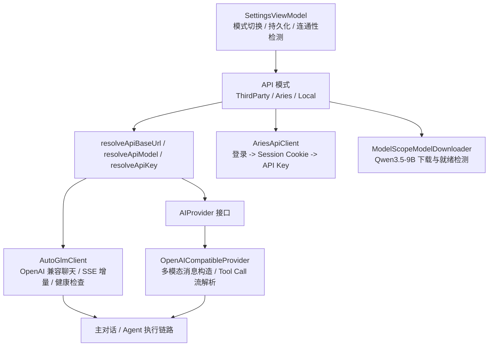

# 多模型接入总览

本文档说明 Aries AI 在当前代码库中的多模型接入设计，包括第三方 OpenAI 兼容 API、Aries 自有 API 与本地模型三条接入路径，以及它们在设置、鉴权、请求构造和流式响应解析中的分工。

---

## 概述

Aries AI 并不是把“模型”硬编码在某一个网络客户端中，而是拆成了四层职责：

1. **模式选择层**：由 `SettingsViewModel` 管理第三方 API、Aries API、本地模型三种模式的切换与恢复。
2. **Provider 抽象层**：由 `AIProvider` 定义统一的流式发送、多模态内容构造、Tool Call 解析接口。
3. **网络客户端层**：由 `AutoGlmClient` 与 `OpenAICompatibleProvider` 负责 OpenAI 兼容请求、SSE 增量解析与连接复用。
4. **凭据与资源层**：由 `AriesApiClient` 负责 Aries 账号换取 API Key，由 `ModelScopeModelDownloader` 负责本地模型下载与就绪检测。

这种拆分让 Aries AI 可以在不改动 Agent 主循环的前提下，切换不同模型来源，并复用同一套消息、附件和自动化执行链路。

## 架构总览

## 三种模型接入模式

| 模式 | 入口 | Base URL / Model 来源 | 认证方式 | 典型代码锚点 |
|------|------|------------------------|----------|--------------|
| 第三方 API | 设置页手动输入 | `apiBaseUrlText` / `apiModelText` | 用户输入 API Key | `SettingsViewModel.resolveRemoteApiBaseUrl()`、`AutoGlmClient` |
| Aries API | Aries 账号登录后启用 | `AriesApiClient.ARIES_API_V1_BASE_URL` 与 Aries 预置模型 | 先登录，再换取 `sk-...` API Key | `AriesApiClient.loginAndGetApiKey()` |
| 本地模型 | 设置页切换到 Local | `ModelScopeModelDownloader.QWEN35_MODEL_NAME` | 无远端认证，依赖本地文件完整性 | `ModelScopeModelDownloader.isQwen35ModelReady()` |

### 第三方 OpenAI 兼容 API

第三方模式是当前最通用的接入方式。代码侧的关键点有：

- `AutoGlmClient.DEFAULT_BASE_URL` 和 `DEFAULT_MODEL` 提供默认兜底值。
- `SettingsViewModel` 在第三方模式下通过 `resolveRemoteApiBaseUrl()` 与 `resolveRemoteApiModel()` 解析最终请求参数。
- `startApiCheck()` 会在发起检查前调用 `validateBaseUrlSecurity()` 与 `maybeWarnInsecureHttpBaseUrl()`，避免错误 URL 或公网 HTTP 明文连接。
- `AutoGlmClient` 统一构造 `chat/completions` 请求，支持长连接、流式增量和快速超时两套 OkHttp 配置。

### Aries API

Aries API 模式的目标，是把“账号体系”和“OpenAI 兼容调用”拆开：

- `AriesApiClient` 先通过登录接口建立 Session Cookie。
- 随后调用 token 接口获取 Aries 专用 API Key。
- 获取到的 Key 最终仍然可以走 OpenAI 兼容协议，供对话或自动化链路复用。
- 模型名由 Aries 侧统一约束，如 `星环`、`星环 Pro`、`GUI` 等。

这种设计让 Aries 平台既能保留自有会员与账号系统，又不会打破现有请求协议。

### 本地模型

本地模式当前围绕 Qwen3.5-9B MNN 包展开，核心职责集中在 `ModelScopeModelDownloader`：

- 通过 ModelScope API 查询仓库文件列表。
- 过滤出运行所需文件，例如 `llm.mnn`、`llm.mnn.weight`、`llm_config.json` 等。
- 借助 `DownloadManager` 进行后台下载。
- 通过 `isQwen35ModelReady()` 检查本地目录是否完整可用。

这条链路不直接发起远端 API 检查，而是通过“文件是否齐全”来判断模型是否可用。

## Provider 抽象与多模态消息

`AIProvider` 定义了 Aries AI 面向不同模型供应商的最小公共接口，至少包括：

- `providerName` / `modelName`
- `supportsVision` / `supportsAudio` / `supportsVideo`
- `sendMessageStream()`
- `buildContentWithAttachments()`
- `parseXmlToolCalls()` / `parseXmlToolResults()`

其中 `OpenAICompatibleProvider` 负责较完整的多模态输入与 Tool Call 处理：

- 当消息带有附件时，会把文本与媒体内容统一编码进 OpenAI 兼容消息体。
- 当流式返回包含 `tool_calls` 增量时，会用 `StreamingJsonXmlConverter` 持续拼接为可消费的 XML 片段。
- 普通文本增量与 Tool Call 增量可以在同一条流中交错出现，并被拆分回 UI 或工具执行链路。

这意味着 Aries AI 在“多模型支持”上，并不只停留在 Base URL 可配置，而是连多模态与工具调用的协议差异也做了适配。

## 网络客户端与流式响应策略

`AutoGlmClient` 是当前最关键的 OpenAI 兼容客户端之一，承担以下职责：

- 共享 `OkHttpClient` 与连接池，减少重复建连成本。
- 提供标准超时与快速超时两套实例，分别适配普通对话与自动化场景。
- 在流式模式下解析 SSE 数据块，拆出 reasoning 与 content 增量。
- 使用 `activeStreamCall` 保存当前请求，以便外部在任务中途取消流式响应。

自动化场景之所以能维持较低等待时间，很大程度上依赖这里的连接复用和超时分层，而不是简单地缩短服务端生成时间。

## 运行时解析规则

在设置页之外，运行时最终只关心三个结果：

1. 当前使用哪种 API 模式。
2. 这一模式对应的 Base URL / Model 是什么。
3. 可用凭据是否已就绪。

`SettingsViewModel` 提供的 `resolveApiBaseUrl()` 与 `resolveApiModel()` 正是这层收敛点：

- Aries 模式走 Aries 固定地址和模型。
- Local 模式走本地模型常量。
- ThirdParty 模式走用户输入并经校验后的值。

这样上层调用方就不需要关心“是第三方、Aries，还是本地模型”，只消费解析后的统一参数即可。

## 设计收益

这套实现带来的直接收益包括：

- **模式切换成本低**：UI 和 Agent 主流程不必针对每个供应商写分支。
- **协议复用高**：第三方 API 和 Aries API 共用 OpenAI 兼容请求路径。
- **多模态能力可扩展**：图片、音频、视频与 Tool Call 都挂在统一的 Provider 抽象上。
- **本地与远端并存**：离线与在线能力可以共存于同一设置入口。
- **安全边界更清晰**：URL 校验、HTTP 警告、API 检测与 Key 持久化都集中在设置层处理。

## 相关文档

- [模型模式切换与配置链路](./模型模式切换与配置链路.md)
- [快速开始 / API Key 与模型配置](../快速开始/API%20Key%20与模型配置.md)
- [技术架构 / 整体架构设计](../技术架构/整体架构设计.md)
- [自动化引擎 / 自动化 Agent 主循环](../自动化引擎/自动化%20Agent%20主循环.md)
