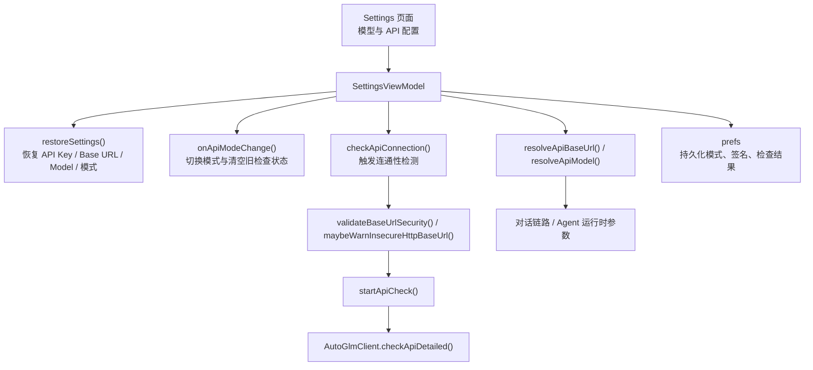

# 模型模式切换与配置链路

本文档聚焦 Aries AI 当前代码中的“模型配置入口”实现，说明设置页如何在第三方 API、Aries API 与本地模型之间切换，以及这些状态如何被校验、持久化并最终汇总成运行时可消费的参数。

---

## 概述

模型接入在运行时看似只是三个输入项：API Key、Base URL、Model。但在代码中，这三项配置要同时满足以下约束：

- 模式切换后 UI 状态要立即更新。
- 重启应用后配置要能恢复。
- API 检查结果要与当前配置签名绑定，避免误用旧检测结果。
- 非安全 URL 要在真正请求前被拦截或告警。
- Local / Aries / ThirdParty 三种模式要输出统一的运行时参数。

当前这条链路的主要收敛点在 `SettingsViewModel`。

## 配置链路总览

## 启动恢复：`restoreSettings()`

应用进入设置页时，`restoreSettings()` 会把上一轮配置恢复到 ViewModel 状态中，包含：

- API Key 的掩码展示与原始 tag 值
- ThirdParty / Local / Aries 模式选择状态
- 第三方 Base URL 与模型名
- Aries 登录用户与已选模型
- 上次 API 检测结果与其对应签名

这里最关键的不是“把字符串读回来”，而是避免把旧的检测结果错配到新的配置上。因此代码中会把：

- 当前 API Key
- 当前 Base URL
- 当前 Model
- 当前是否启用第三方模式

组合成 `apiConfigSignature()`，只有签名一致时才复用上次的检测状态。

## 模式切换：`onApiModeChange()`

切换模式时，`SettingsViewModel` 做的不是单一布尔值切换，而是一次完整的状态刷新：

1. 忽略重复切换与不允许的模式。
2. 更新当前模式状态。
3. 增加 `apiCheckSeq`，使旧的异步检查结果失效。
4. 清空 `remoteApiOk`、`lastCheckedApiKey` 等检查缓存。
5. 触发持久化并更新状态文案。

这样做的目的，是确保用户从“第三方 API”切到“本地模型”时，不会继续展示上一轮远端检测结果。

## 三种模式的最终解析规则

### ThirdParty

ThirdParty 模式下，最终请求参数来自用户输入：

- Base URL: `resolveRemoteApiBaseUrl()`
- Model: `resolveRemoteApiModel()`
- Key: `resolveApiKeyFromInput()`

如果用户没有填写，系统会回退到 `AutoGlmClient.DEFAULT_BASE_URL` 与 `DEFAULT_MODEL`。

### Aries

Aries 模式下，不再使用用户输入的第三方地址，而是切换到固定值：

- Base URL: `AriesApiClient.ARIES_API_V1_BASE_URL`
- Model: Aries 预置聊天模型
- Key: 从 Aries 账号体系获取的有效 token / API Key

因此 Aries 模式本质上是“托管配置模式”，而不是“开放输入模式”。

### Local

Local 模式下，不再依赖远端连通性检测：

- Base URL 由 ViewModel 返回默认值占位
- Model 固定为 `ModelScopeModelDownloader.QWEN35_MODEL_NAME`
- 是否可用取决于本地模型目录是否完整

UI 里看到的“可用/不可用”，对应的是模型文件准备状态，而非网络健康状态。

## 连通性检测：`checkApiConnection()` 与 `startApiCheck()`

### Local 模式

Local 模式下不会真正发起网络请求，而是：

- 调用 `ModelScopeModelDownloader.isQwen35ModelReady()`
- 更新下载按钮文案与本地模型状态
- 如果模型未就绪，直接提示用户下载

### Aries 模式

Aries 模式会先检查当前账号是否已拥有可用 API Key：

- 若没有登录结果，直接提示登录
- 若已有 Key，则使用 Aries 固定 Base URL 和模型发起检查

### ThirdParty 模式

ThirdParty 模式会：

1. 取出输入中的 API Key
2. 校验 Base URL 的 scheme 与 host
3. 对公网 HTTP 地址弹出明文连接警告
4. 调用 `AutoGlmClient.checkApiDetailed()` 发起真实检查
5. 用最新签名写回检查结果

这一层实际上承担了“请求前安全网关”的职责。

## 安全校验与错误隔离

模型配置并不是“只要能连就行”。当前实现至少做了两层保护：

### URL 结构校验

`validateBaseUrlSecurity()` 会检查：

- URL 是否可以被正常解析
- scheme 是否是 `http` 或 `https`
- host 是否存在

非法 URL 会在发请求前直接被拦下。

### HTTP 明文告警

`maybeWarnInsecureHttpBaseUrl()` 允许本地开发场景继续使用 `http://localhost` 等地址，但对公网 HTTP 连接会主动提示风险。

这避免了用户把 API Key 直接发送到不安全的公网明文地址。

## 持久化与“旧结果失效”机制

模型配置链路的一个细节，是它并不信任“上一次检查成功”这个状态本身，而是只信任“当前配置是否与上一次完全一致”。

因此 `apiConfigSignature()` 会把以下信息组成签名：

- 当前是否启用第三方模式
- API Key
- Base URL
- Model

只要其中任意一项变化，之前的检测结果就会被视为过期，从而避免 UI 误报“API 可用”。

## 对运行时的输出

设置层最终向上层提供的是两个统一出口：

- `resolveApiBaseUrl()`
- `resolveApiModel()`

这让主对话链路和 Agent 调度层不必关心复杂的模式选择逻辑，只消费已经归一化后的结果。

换句话说，Settings 页负责处理差异，运行时只拿到统一配置。

## 设计收益

当前这套配置链路的价值主要体现在：

- **避免旧状态污染新模式**：切换模式时立刻使旧检查结果失效。
- **把风险拦在请求前**：非法 URL 和公网 HTTP 在请求前就能被发现。
- **把复杂性限制在设置层**：运行时不需要知道用户在设置页做过哪些选择。
- **对三类模式一视同仁**：无论远端还是本地，最终都能输出统一的“是否可用”和“用什么参数调用”。

## 相关文档

- [多模型接入总览](./多模型接入总览.md)
- [快速开始 / API Key 与模型配置](../快速开始/API%20Key%20与模型配置.md)
- [开发规范与工具 / 构建脚本与工具链](../开发规范与工具/构建脚本与工具链.md)
- [常见问题与支持 / 故障排查指南](../常见问题与支持/故障排查指南.md)
