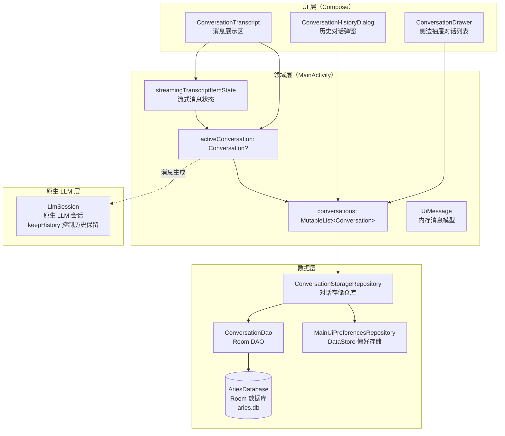
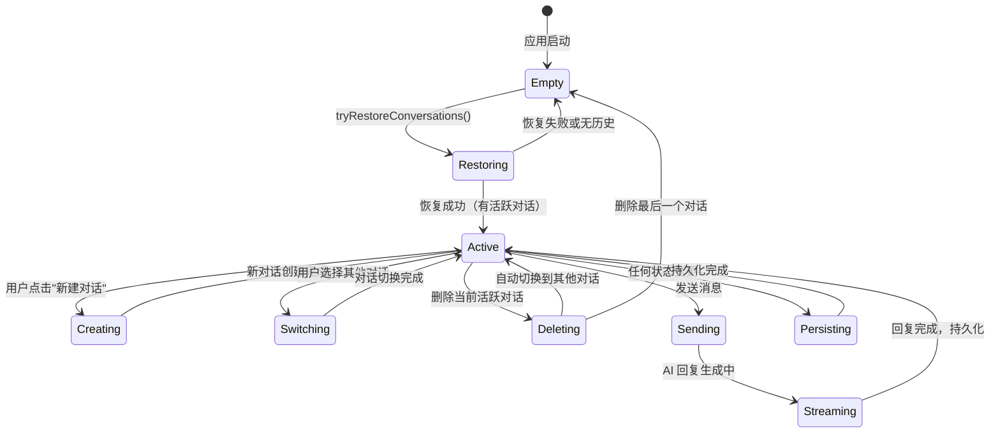
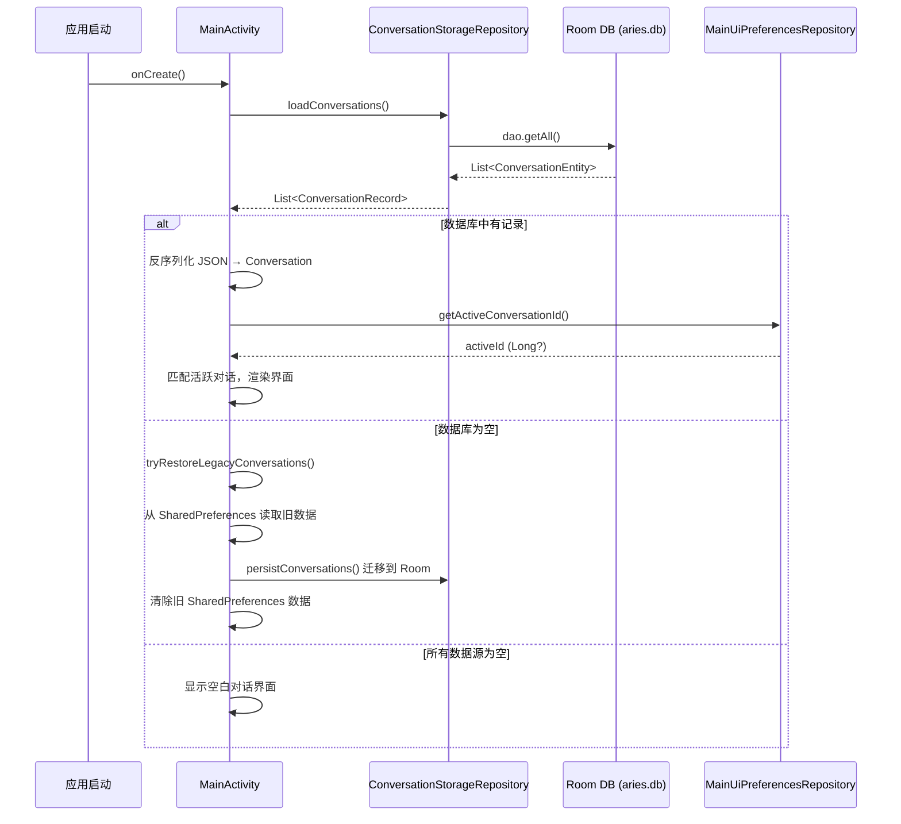
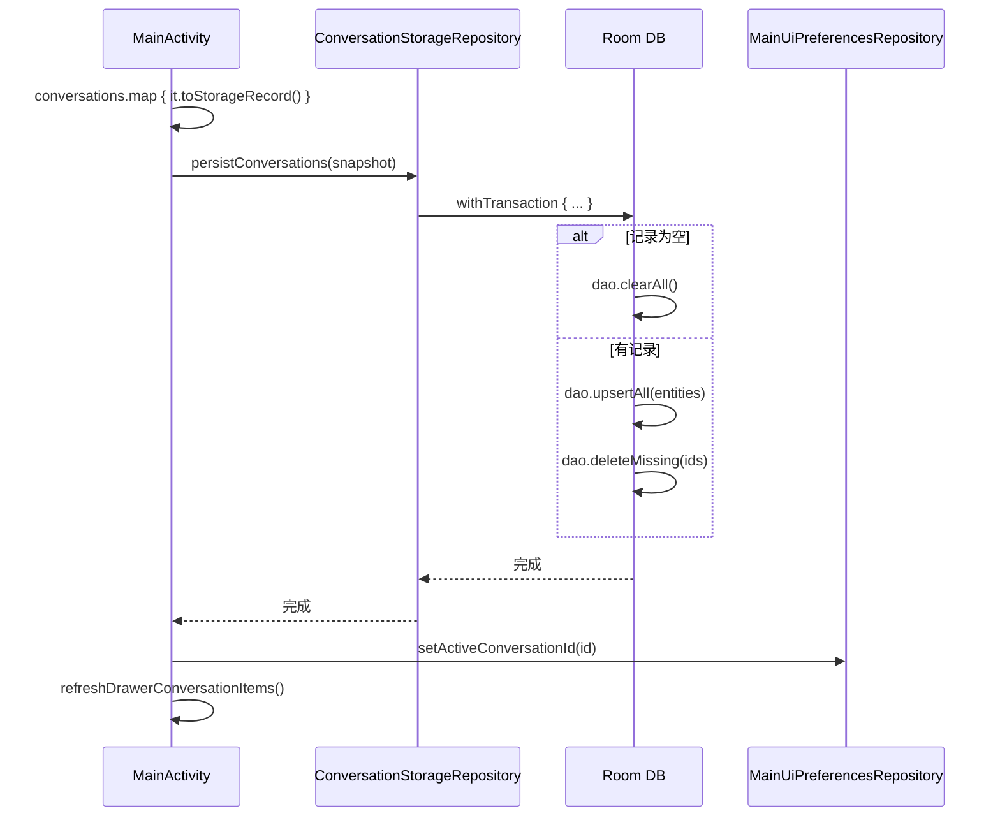

# 对话历史与会话管理

Aries AI 的对话历史与会话管理系统负责管理所有用户对话的全生命周期，包括对话的创建、存储、检索、切换、删除以及实时流式消息状态的维护。该系统采用 Room 数据库作为持久化存储，结合 DataStore 维护 UI 偏好，并通过原生 LLM Session 管理模型侧的对话历史。

## 概述

对话历史与会话管理是 Aries AI 的核心基础设施之一。系统围绕"对话（Conversation）"这一核心概念构建——每个对话包含一组有序的消息（Message），每条消息记录发送者、内容、附件以及思考耗时等元数据。

系统的主要功能包括：

- **对话创建**: 用户发起新对话时，自动生成一个以时间戳为 ID 的新会话
- **对话持久化**: 所有对话通过 Room 数据库持久化存储，消息以 JSON 格式内嵌在对话记录中
- **对话恢复**: 应用启动时自动从 Room DB 加载对话，并恢复上次活跃的对话
- **对话切换**: 支持通过侧边抽屉和"历史对话"对话框浏览并切换对话
- **对话删除**: 支持删除单个对话，自动清理关联数据
- **流式消息**: 独立管理 AI 回复的实时流式状态，与持久化的静态对话数据分离
- **旧版兼容**: 支持从旧版 SharedPreferences 迁移数据到 Room 数据库

## 架构



**架构说明：**

- **UI 层**通过 Compose 状态（`mutableStateOf`）与领域层双向绑定，`ConversationDrawer` 和 `ConversationHistoryDialog` 直接操作 `conversations` 列表
- **领域层**以 `MainActivity` 为核心，维护 `conversations`（所有对话）和 `activeConversation`（当前活跃对话）两个核心状态
- **数据层**通过 `ConversationStorageRepository` 封装所有持久化操作，内部使用 Room DAO 操作数据库，使用 DataStore 存储活跃对话 ID
- **流式消息状态**独立于持久化的对话数据，仅在 AI 回复生成期间存在
- **原生 LLM 层**的 `LlmSession` 维护模型内部的对话历史上下文（通过 `keepHistory` 参数控制），与应用层对话管理协同工作

## 数据模型

### 持久化实体

```kotlin
@Entity(tableName = "conversations")
data class ConversationEntity(
    @PrimaryKey val id: Long,
    val title: String,
    val updatedAt: Long,
    val messagesJson: String,  // 消息列表序列化为 JSON 字符串存储
)
```
> Source: [ConversationEntity.kt](https://github.com/ZG0704666/Aries-AI/blob/main/app/src/main/java/com/ai/phoneagent/data/local/ConversationEntity.kt#L7-L14)

### 存储模型（序列化中间层）

消息和附件作为 JSON 序列化的中间层模型，通过 `kotlinx.serialization` 实现与 JSON 字符串的互转：

```kotlin
@Serializable
data class StoredMessageRecord(
    val author: String,
    val content: String,
    val isUser: Boolean,
    val thinkingDurationMs: Long? = null,
    val attachments: List<StoredAttachmentRecord> = emptyList(),
)

@Serializable
data class StoredAttachmentRecord(
    val filePath: String,
    val fileName: String,
    val mimeType: String,
    val fileSize: Long,
    val content: String = "",
)

data class ConversationRecord(
    val id: Long,
    val title: String,
    val messages: List<StoredMessageRecord>,
    val updatedAt: Long,
)
```
> Source: [ConversationStorageModels.kt](https://github.com/ZG0704666/Aries-AI/blob/main/app/src/main/java/com/ai/phoneagent/data/local/ConversationStorageModels.kt#L5-L28)

### 内存模型（领域层）

应用运行时使用的内存模型，支持可变操作：

```kotlin
private data class UiMessage(
    val author: String,
    val content: String,
    val isUser: Boolean,
    val thinkingDurationMs: Long? = null,
    val attachments: List<AttachmentInfo>? = null,
)

private data class Conversation(
    val id: Long,
    var title: String,
    val messages: MutableList<UiMessage>,
    var updatedAt: Long,
)
```
> Source: [MainActivity.kt](https://github.com/ZG0704666/Aries-AI/blob/main/app/src/main/java/com/ai/phoneagent/MainActivity.kt#L345-L358)

### 设计意图

系统采用了**三层数据模型**设计：

1. **`ConversationEntity`** — 数据库实体层，将消息列表序列化为 JSON 字符串（`messagesJson`）存储在单一列中。这种单表设计的优势在于简化了数据库结构，避免了多表 JOIN 操作，代价是无法对单条消息进行 SQL 查询
2. **`ConversationRecord` / `StoredMessageRecord`** — 序列化中间层，通过 `kotlinx.serialization` 在 JSON 字符串与结构化数据之间转换
3. **`Conversation` / `UiMessage`** — 内存模型层，消息列表使用 `MutableList`，支持运行时的高效增删改操作

### 模型转换

持久化与内存模型之间通过扩展函数相互转换：

```kotlin
// 内存模型 → 存储模型（持久化前）
private fun Conversation.toStorageRecord(): ConversationRecord {
    return ConversationRecord(
        id = id, title = title, updatedAt = updatedAt,
        messages = messages.map { message ->
            StoredMessageRecord(
                author = message.author, content = message.content,
                isUser = message.isUser,
                thinkingDurationMs = message.thinkingDurationMs,
                attachments = message.attachments.orEmpty().map { attachment ->
                    StoredAttachmentRecord(
                        filePath = attachment.filePath, fileName = attachment.fileName,
                        mimeType = attachment.mimeType, fileSize = attachment.fileSize,
                        content = attachment.content,
                    )
                },
            )
        },
    )
}

// 存储模型 → 内存模型（加载后）
private fun ConversationRecord.toConversation(): Conversation {
    return Conversation(
        id = id, title = title, updatedAt = updatedAt,
        messages = messages.map { message ->
            UiMessage(
                author = message.author, content = message.content,
                isUser = message.isUser,
                thinkingDurationMs = message.thinkingDurationMs,
                attachments = message.attachments.map { attachment ->
                    AttachmentInfo(
                        filePath = attachment.filePath, fileName = attachment.fileName,
                        mimeType = attachment.mimeType, fileSize = attachment.fileSize,
                        content = attachment.content,
                    )
                }.takeIf { it.isNotEmpty() },
            )
        }.toMutableList(),
    )
}
```
> Source: [MainActivity.kt](https://github.com/ZG0704666/Aries-AI/blob/main/app/src/main/java/com/ai/phoneagent/MainActivity.kt#L360-L412)

## 核心流程

### 对话生命周期



### 启动恢复流程


> Source: [MainActivity.kt](https://github.com/ZG0704666/Aries-AI/blob/main/app/src/main/java/com/ai/phoneagent/MainActivity.kt#L596-L641)

### 对话创建流程

```mermaid
flowchart TD
    Start([用户发起新建对话]) --> Check{是否已在空对话中?}
    Check -->|是| Refresh[仅刷新 UI 状态]
    Check -->|否| Create[创建新 Conversation 对象]
    Create --> SetId["id = System.currentTimeMillis()"]
    SetId --> AddToList["conversations.add(0, c)"]
    AddToList --> SetActive["activeConversation = c"]
    SetActive --> ClearStreaming[清除流式消息状态]
    ClearStreaming --> SyncUI[同步消息展示到 UI]
    SyncUI --> Persist[persistConversations()]
    Persist --> ScrollBottom[滚动到底部]
    Refresh --> ScrollBottom
    ScrollBottom --> End([完成])
```
> Source: [MainActivity.kt](https://github.com/ZG0704666/Aries-AI/blob/main/app/src/main/java/com/ai/phoneagent/MainActivity.kt#L3194-L3223)

### 对话持久化流程


> Source: [ConversationStorageRepository.kt](https://github.com/ZG0704666/Aries-AI/blob/main/app/src/main/java/com/ai/phoneagent/data/local/ConversationStorageRepository.kt#L34-L57)

## 数据访问层

### Room DAO

`ConversationDao` 提供对 `conversations` 表的基本 CRUD 操作：

```kotlin
@Dao
interface ConversationDao {
    @Query("SELECT * FROM conversations ORDER BY updatedAt DESC")
    suspend fun getAll(): List<ConversationEntity>

    @Upsert
    suspend fun upsertAll(items: List<ConversationEntity>)

    @Query("DELETE FROM conversations")
    suspend fun clearAll()

    @Query("DELETE FROM conversations WHERE id NOT IN (:ids)")
    suspend fun deleteMissing(ids: List<Long>)
}
```
> Source: [ConversationDao.kt](https://github.com/ZG0704666/Aries-AI/blob/main/app/src/main/java/com/ai/phoneagent/data/local/ConversationDao.kt#L7-L19)

#### 关键设计点

- **`getAll()`** 按 `updatedAt` 降序排列，确保最新的对话排在最前面
- **`upsertAll()`** 使用 Room 的 `@Upsert` 注解，根据主键自动判断插入或更新，在事务中批量执行
- **`deleteMissing()`** 在每次持久化时清理数据库中已被删除的对话记录，通过差集（`NOT IN`）实现增量删除

### 数据库

`AriesDatabase` 是 Room 数据库的单例实现：

- 数据库名称：`aries.db`
- 版本：`1`
- 使用双重检查锁定（DCL）确保线程安全的单例模式
- 通过 Koin 依赖注入提供给各模块使用

```kotlin
@Database(
    entities = [ConversationEntity::class],
    version = 1,
    exportSchema = false,
)
abstract class AriesDatabase : RoomDatabase() {
    abstract fun conversationDao(): ConversationDao

    companion object {
        @Volatile
        private var instance: AriesDatabase? = null

        fun getInstance(context: Context): AriesDatabase {
            return instance ?: synchronized(this) {
                instance ?: Room.databaseBuilder(
                    context.applicationContext,
                    AriesDatabase::class.java,
                    "aries.db",
                ).build().also { instance = it }
            }
        }
    }
}
```
> Source: [AriesDatabase.kt](https://github.com/ZG0704666/Aries-AI/blob/main/app/src/main/java/com/ai/phoneagent/data/local/AriesDatabase.kt#L8-L30)

### ConversationStorageRepository

`ConversationStorageRepository` 是持久化层的统一入口，封装了 JSON 序列化/反序列化和数据库操作：

```kotlin
class ConversationStorageRepository(
    context: Context,
    private val json: Json = Json {
        ignoreUnknownKeys = true
        encodeDefaults = true
    },
) {
    private val database = AriesDatabase.getInstance(context)
    private val dao = database.conversationDao()

    suspend fun loadConversations(): List<ConversationRecord> {
        return dao.getAll().map { entity ->
            ConversationRecord(
                id = entity.id, title = entity.title,
                updatedAt = entity.updatedAt,
                messages = json.decodeFromString(
                    ListSerializer(StoredMessageRecord.serializer()),
                    entity.messagesJson,
                ),
            )
        }
    }

    suspend fun persistConversations(records: List<ConversationRecord>) {
        database.withTransaction {
            if (records.isEmpty()) {
                dao.clearAll()
                return@withTransaction
            }
            dao.upsertAll(records.map { record ->
                ConversationEntity(
                    id = record.id, title = record.title,
                    updatedAt = record.updatedAt,
                    messagesJson = json.encodeToString(
                        ListSerializer(StoredMessageRecord.serializer()),
                        record.messages,
                    ),
                )
            })
            dao.deleteMissing(records.map { it.id })
        }
    }
}
```
> Source: [ConversationStorageRepository.kt](https://github.com/ZG0704666/Aries-AI/blob/main/app/src/main/java/com/ai/phoneagent/data/local/ConversationStorageRepository.kt#L8-L57)

## UI 组件

### 对话抽屉（ConversationDrawer）

侧边抽屉提供对话列表的浏览、搜索和快速切换功能：

- 支持**搜索过滤**：按标题和预览内容搜索对话
- 支持**长按菜单**：长按对话项可弹出删除选项（带触觉反馈）
- 高亮当前活跃对话（选中状态显示不同背景色）
- 列表为空时显示提示信息

```kotlin
sealed interface DrawerConversationUiItem {
    data class Header(val label: String) : DrawerConversationUiItem
    data class Conversation(
        val conversationId: Long,
        val title: String,
        val preview: String,
        val selected: Boolean,
    ) : DrawerConversationUiItem
}
```
> Source: [ConversationDrawer.kt](https://github.com/ZG0704666/Aries-AI/blob/main/app/src/main/java/com/ai/phoneagent/ui/drawer/ConversationDrawer.kt#L54-L74)

### 历史对话对话框（ConversationHistoryDialog）

点击顶栏历史按钮时弹出，以对话框形式展示所有对话：

- 每条记录显示对话标题和最后一条消息的预览
- 点击选择对话，点击删除按钮删除对话
- 列表为空时自动关闭
- 使用 `MessageCircle` 图标标识每个对话项

```kotlin
data class ConversationHistoryItemUi(
    val id: Long,
    val title: String,
    val preview: String,
)
```
> Source: [ConversationHistoryDialog.kt](https://github.com/ZG0704666/Aries-AI/blob/main/app/src/main/java/com/ai/phoneagent/ui/history/ConversationHistoryDialog.kt#L37-L41)

### 对话展示区（ConversationTranscript）

消息展示组件负责渲染对话中的所有消息，支持：

- **用户消息**：显示在右侧气泡中，支持复制、重试、编辑操作
- **AI 消息**：显示在左侧，支持 Markdown 渲染、思考过程展开/折叠
- **附件展示**：以流式布局（FlowRow）展示附件标签
- **流式渲染**：实时渲染 AI 生成中的消息，支持 Markdown 增量解析

```kotlin
@Immutable
data class TranscriptMessageUi(
    val conversationId: Long,
    val messageIndex: Int,
    val id: String,
    val author: String,
    val body: String,
    val thinking: String?,
    val isUser: Boolean,
    val attachments: ImmutableList<String>,
    val isAutomation: Boolean,
    val automation: TranscriptAutomationUi? = null,
    val copyText: String,
    val retryText: String?,
    val isStreaming: Boolean = false,
    val thinkingDurationMs: Long? = null,
)
```
> Source: [ConversationTranscript.kt](https://github.com/ZG0704666/Aries-AI/blob/main/app/src/main/java/com/ai/phoneagent/ui/messages/ConversationTranscript.kt#L138-L154)

## 原生 LLM 会话

`LlmSession` 通过 JNI 调用原生 MNN LLM 库，负责模型侧的对话历史管理：

```kotlin
class LlmSession(
    private val configPath: String,
    private val keepHistory: Boolean = true,
) {
    fun submitFullHistory(
        history: List<Pair<String, String>>,
        progressListener: GenerateProgressListener
    ): HashMap<String, Any>
    
    fun reset()
    fun release()
}
```
> Source: [LlmSession.kt](https://github.com/ZG0704666/Aries-AI/blob/main/app/src/main/java/com/alibaba/mnnllm/android/llm/LlmSession.kt#L8-L111)

### 设计要点

- **`keepHistory`** 参数控制原生引擎是否在内部保留对话历史。在本地推理模式下设置为 `false`，由应用层完全管理历史上下文
- **`submitFullHistory()`** 将完整的对话历史（role-content 对）传递给原生引擎进行推理
- **`reset()`** 清除原生引擎的内部状态，切换对话时调用
- 通过 `submitFullHistoryNative()` JNI 方法将历史传递给 C++ 层的 MNN 引擎

## 偏好存储

`MainUiPreferencesRepository` 基于 Jetpack DataStore 存储 UI 相关的偏好：

```kotlin
class MainUiPreferencesRepository(
    private val context: Context,
) {
    private object Keys {
        val activeConversationId = longPreferencesKey("active_conversation_id")
        val thinkingExpandedByDefault = booleanPreferencesKey("thinking_expanded_by_default")
    }

    suspend fun getActiveConversationId(): Long?
    suspend fun setActiveConversationId(conversationId: Long?)
    suspend fun setThinkingExpandedByDefault(expanded: Boolean)
}
```
> Source: [MainUiPreferencesRepository.kt](https://github.com/ZG0704666/Aries-AI/blob/main/app/src/main/java/com/ai/phoneagent/data/preferences/MainUiPreferencesRepository.kt#L16-L56)

活跃对话 ID 通过 DataStore 独立存储（不在 Room 数据库中），确保应用重启后能恢复到上次使用的对话。

## 旧版数据迁移

系统兼容从旧版 SharedPreferences 存储格式的迁移：

```kotlin
private fun tryRestoreLegacyConversations(): MutableList<Conversation> {
    val json = prefs.getString(conversationsKey, null) ?: return mutableListOf()
    return runCatching {
        // 1. 使用 Gson 反序列化旧格式数据
        val type = object : TypeToken<List<Conversation>>() {}.type
        val list: List<Conversation> = Gson().fromJson(json, type)
        val activeId = prefs.getLong(activeConversationIdKey, -1L)
        // 2. 迁移到 Room 数据库
        lifecycleScope.launch(Dispatchers.IO) {
            conversationStorageRepository.persistConversations(
                list.map { it.toStorageRecord() }
            )
            uiPreferencesRepository.setActiveConversationId(activeId)
            // 3. 清除旧的 SharedPreferences 数据
            prefs.edit().remove(conversationsKey)
                .remove(activeConversationIdKey).apply()
        }
        list.toMutableList()
    }.getOrDefault(mutableListOf())
}
```
> Source: [MainActivity.kt](https://github.com/ZG0704666/Aries-AI/blob/main/app/src/main/java/com/ai/phoneagent/MainActivity.kt#L626-L641)

迁移策略采用**读时迁移**（Migration-on-Read）模式：当 Room 数据库为空时检查旧格式数据，读取后立即写入 Room 并清除旧数据。这种策略避免了复杂的数据库版本迁移逻辑。

## 配置选项

| 选项 | 类型 | 默认值 | 说明 |
|------|------|--------|------|
| `active_conversation_id` | Long? | null | 当前活跃对话的 ID，存储在 DataStore 中 |
| `thinking_expanded_by_default` | Boolean | false | 新建对话时思考过程是否默认展开 |
| `keepHistory` (LlmSession) | Boolean | true | 原生 LLM 引擎是否保留对话历史 |
| 数据库名称 | String | "aries.db" | Room 数据库文件名 |

## API 参考

### ConversationStorageRepository

#### `suspend fun loadConversations(): List<ConversationRecord>`

从 Room 数据库加载所有对话记录，并按 `updatedAt` 降序排列。

**参数：** 无

**返回：** 反序列化后的 `ConversationRecord` 列表

**实现细节：** 先通过 DAO 获取 `ConversationEntity` 列表，然后使用 `kotlinx.serialization` 将每行的 `messagesJson` 列反序列化为 `List<StoredMessageRecord>`

> Source: [ConversationStorageRepository.kt](https://github.com/ZG0704666/Aries-AI/blob/main/app/src/main/java/com/ai/phoneagent/data/local/ConversationStorageRepository.kt#L19-L32)

---

#### `suspend fun persistConversations(records: List<ConversationRecord>)`

持久化对话记录列表。在单个数据库事务中执行 upsert 和清理操作。

**参数：**
- `records` (List<ConversationRecord>): 要持久化的对话记录列表

**实现细节：**
- 如果 `records` 为空，清空整个 `conversations` 表
- 否则：批量 upsert 所有记录，然后删除数据库中不在 `records` 中的行（通过 `deleteMissing`）
- 整个操作在 `withTransaction` 中执行，保证原子性

> Source: [ConversationStorageRepository.kt](https://github.com/ZG0704666/Aries-AI/blob/main/app/src/main/java/com/ai/phoneagent/data/local/ConversationStorageRepository.kt#L34-L57)

---

### MainActivity (对话管理方法)

#### `private fun startNewChat(clearUi: Boolean)`

创建新对话。如果当前已在空对话中，则仅刷新 UI 状态，避免创建重复空会话。

**参数：**
- `clearUi` (Boolean): 是否同时清理 UI 状态（动画 key 重置等）

**实现细节：**
- 通过 `isAlreadyInNewChat()` 检查是否已在空对话中
- 新对话 ID 使用 `System.currentTimeMillis()`
- 新对话插入 `conversations` 列表头部
- 自动调用 `persistConversations()` 持久化

> Source: [MainActivity.kt](https://github.com/ZG0704666/Aries-AI/blob/main/app/src/main/java/com/ai/phoneagent/MainActivity.kt#L3194-L3223)

---

#### `private fun deleteConversationById(conversationId: Long, clearUiForActive: Boolean): Boolean`

按 ID 删除对话。如果删除的是当前活跃对话，会自动切换到其他对话或创建新对话。

**参数：**
- `conversationId` (Long): 要删除的对话 ID
- `clearUiForActive` (Boolean): 删除活跃对话时是否清理 UI

**返回：** 是否成功删除（对话不存在时返回 false）

> Source: [MainActivity.kt](https://github.com/ZG0704666/Aries-AI/blob/main/app/src/main/java/com/ai/phoneagent/MainActivity.kt#L1612-L1627)

---

#### `private fun tryRestoreConversations(): Boolean`

应用启动时尝试恢复对话数据。优先从 Room 数据库加载，数据库为空时回退到旧版 SharedPreferences 迁移。

**返回：** 是否成功恢复了对话

> Source: [MainActivity.kt](https://github.com/ZG0704666/Aries-AI/blob/main/app/src/main/java/com/ai/phoneagent/MainActivity.kt#L596-L624)

### LlmSession

#### `fun submitFullHistory(history: List<Pair<String, String>>, progressListener: GenerateProgressListener): HashMap<String, Any>`

将完整对话历史提交给原生 LLM 引擎进行推理。

**参数：**
- `history` (List<Pair<String, String>>): 角色-内容对列表，表示完整的对话历史
- `progressListener` (GenerateProgressListener): 生成进度回调

**返回：** 原生引擎返回的推理结果，以 HashMap 形式返回

> Source: [LlmSession.kt](https://github.com/ZG0704666/Aries-AI/blob/main/app/src/main/java/com/alibaba/mnnllm/android/llm/LlmSession.kt#L47-L57)

## 相关链接

- [ConversationEntity.kt](https://github.com/ZG0704666/Aries-AI/blob/main/app/src/main/java/com/ai/phoneagent/data/local/ConversationEntity.kt) — Room 数据库实体定义
- [ConversationDao.kt](https://github.com/ZG0704666/Aries-AI/blob/main/app/src/main/java/com/ai/phoneagent/data/local/ConversationDao.kt) — Room DAO 接口
- [ConversationStorageModels.kt](https://github.com/ZG0704666/Aries-AI/blob/main/app/src/main/java/com/ai/phoneagent/data/local/ConversationStorageModels.kt) — 存储模型定义
- [ConversationStorageRepository.kt](https://github.com/ZG0704666/Aries-AI/blob/main/app/src/main/java/com/ai/phoneagent/data/local/ConversationStorageRepository.kt) — 对话存储仓库
- [AriesDatabase.kt](https://github.com/ZG0704666/Aries-AI/blob/main/app/src/main/java/com/ai/phoneagent/data/local/AriesDatabase.kt) — Room 数据库定义
- [MainUiPreferencesRepository.kt](https://github.com/ZG0704666/Aries-AI/blob/main/app/src/main/java/com/ai/phoneagent/data/preferences/MainUiPreferencesRepository.kt) — UI 偏好存储
- [ConversationDrawer.kt](https://github.com/ZG0704666/Aries-AI/blob/main/app/src/main/java/com/ai/phoneagent/ui/drawer/ConversationDrawer.kt) — 对话抽屉 UI 组件
- [ConversationHistoryDialog.kt](https://github.com/ZG0704666/Aries-AI/blob/main/app/src/main/java/com/ai/phoneagent/ui/history/ConversationHistoryDialog.kt) — 历史对话对话框
- [ConversationTranscript.kt](https://github.com/ZG0704666/Aries-AI/blob/main/app/src/main/java/com/ai/phoneagent/ui/messages/ConversationTranscript.kt) — 对话展示区组件
- [LlmSession.kt](https://github.com/ZG0704666/Aries-AI/blob/main/app/src/main/java/com/alibaba/mnnllm/android/llm/LlmSession.kt) — 原生 LLM 会话管理
- [DataModule.kt](https://github.com/ZG0704666/Aries-AI/blob/main/app/src/main/java/com/ai/phoneagent/di/DataModule.kt) — Koin 依赖注入配置
