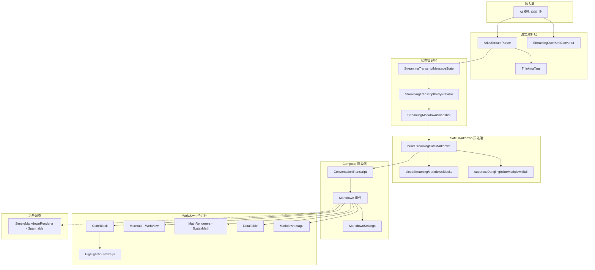
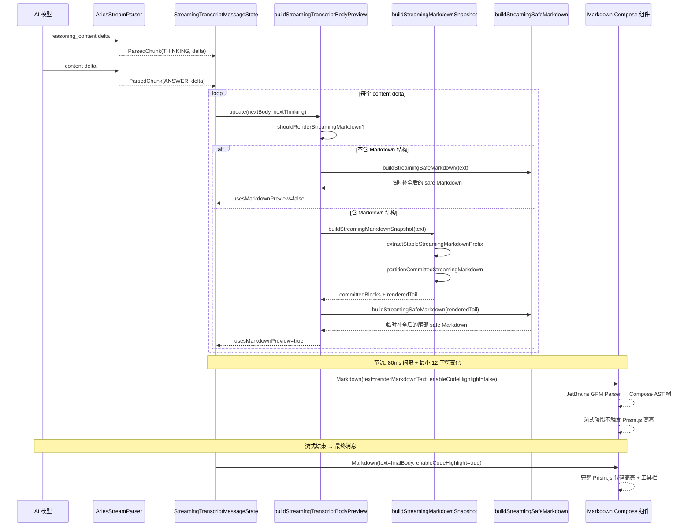
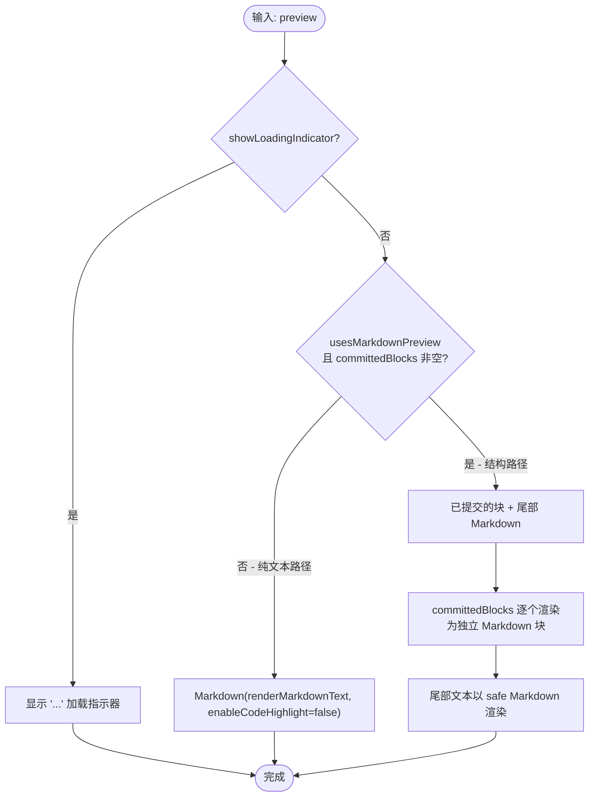

# 流式 Markdown 渲染

Aries-AI 对话系统中的流式 Markdown 渲染子系统，负责将 AI 模型实时输出的增量文本以格式化的 Markdown 形态渲染到 Compose UI 中，同时支持代码高亮、LaTeX 数学公式、Mermaid 图表和 HTML 预览等丰富内容类型。

## 概述

流式 Markdown 渲染是 Aries-AI 对话体验的核心组件之一。当 AI 模型通过 SSE（Server-Sent Events）实时返回回答文本时，该子系统需要：

1. **解析流式输出**：从 AI 模型的增量输出中正确分离思考过程（`<think>` 标签）和回答正文
2. **实时渲染 Markdown**：将不完整的、逐步增长的 Markdown 文本尽可能以格式化形态展示，而非裸 Markdown 源码
3. **保持布局稳定**：避免逐 token 重组导致的视觉抖动，通过节流和缓冲区策略控制 UI 更新频率
4. **临时补全**：对未闭合的代码块、数学公式等 Markdown 结构进行临时补全，确保流式阶段也保持合理的视觉形态
5. **最终渲染**：流式结束后启用完整的代码高亮、行号、工具栏等增强功能

### 设计理念

**三层文本模型** 是整个流式 Markdown 渲染的核心设计：

| 层级 | 说明 | 是否可持久化 |
|------|------|------------|
| raw buffer | 保存模型原始增量输出 | 是 |
| render preview | 按节流节拍推进 UI 可见内容 | 否 |
| safe Markdown | 对未闭合 Markdown 做临时补全后交给 Compose 渲染 | 否 |

关键原则：
- 流式阶段从一开始就渲染 Markdown，不先展示裸 Markdown 原文
- 最终消息与流式消息使用同一套 Markdown / CodeBlock 组件，避免结束后样式回退
- `copyText` 和持久化内容必须保留模型原文，不被临时补全污染
- 流式阶段禁用代码高亮异步重算，最终消息再启用完整高亮和工具栏

## 架构

### 系统架构图



### 架构说明

1. **输入层**：AI 模型通过 `AutoGlmClient` 发送 SSE 流，增量文本到达流式解析层
2. **流式解析层**：`AriesStreamParser` 负责从增量输出中分离思考内容和回答正文，支持 `<think>`、`<思考>`、`【思考开始】` 等多种标记格式
3. **状态管理层**：`StreamingTranscriptMessageState` 持有流式消息的完整状态，`StreamingTranscriptBodyPreview` 封装渲染预览数据，`StreamingMarkdownSnapshot` 记录已提交的 Markdown 块和尾部未完成文本
4. **Safe Markdown 预处理**：在将文本交给 Compose `Markdown` 组件之前，对未闭合的代码块（fence）和数学公式（`$$`）进行临时补全，同时抑制悬空的加粗、斜体、行内代码等标记
5. **Compose 渲染层**：`ConversationTranscript` 是消息列表的主要 UI 容器，根据消息是流式还是最终状态选择不同的渲染路径
6. **Markdown 子组件**：基于 JetBrains GFM Parser 的完整 Markdown 渲染管线，支持代码高亮（Prism.js + QuickJS）、Mermaid 图表（WebView）、LaTeX 数学（JLatexMath）等

## 核心流程

### 流式 Markdown 渲染全流程



### 流式 Markdown 快照分区算法

```mermaid
flowchart TD
    Start([输入: 原始 text]) --> Check{text 是否含 Markdown 结构?}
    Check -->|否| Plain[纯文本路径: safe Markdown]
    Check -->|是| Extract[extractStableStreamingMarkdownPrefix]
    Extract --> Scan[扫描文本, 跟踪 fence/inline code/block math/inline math 开闭状态]
    Scan --> FindEnd[找到"安全的"断点位置 safeEnd]
    FindEnd --> Partition[partitionCommittedStreamingMarkdown]
    Partition --> BlockStart[从 blockStart 开始扫描]
    BlockStart --> Track{跟踪 fence/math 状态}
    Track -->|代码块关闭| Committed[flushBlock: 提交完整代码块]
    Track -->|块数学关闭| Committed
    Track -->|空行| FlushBlank[flushBlock: 空行分段]
    Track -->|关闭后遇到非结构文本| FlushAfter[flushBlock: 结构块后换行]
    Committed --> Next[继续扫描]
    FlushBlank --> Next
    FlushAfter --> Next
    Next -->|扫描完成| Result[返回 committedBlocks + committedPrefixLength]
    Plain --> Safe[buildStreamingSafeMarkdown]
    Result --> Tail[尾部 = text 从 committedPrefixLength 截取]
    Tail --> Safe
    Safe --> MK[交付 Markdown 组件渲染]
```

### 临时补全策略

流式阶段最关键的挑战是 Markdown 结构可能尚未闭合（如代码块的 \`\`\` 只写了开头）。`buildStreamingSafeMarkdown` 函数执行以下处理：

1. **抑制悬空块标记**：如果最后一行是 `#`、`-`、`*`、`1.` 等块标记但后续没有内容，则抑制该行，避免渲染为孤立的标题/列表标记
2. **抑制悬空行内标记**：检测未闭合的 \`code\`、`**bold**`、`*italic*`、`[link](...)`，如果尾部距离起始位置在阈值内则截断
3. **关闭未闭合代码块**：如果代码 fence 开闭次数为奇数（有打开没关闭），追加 \`\`\`
4. **关闭未闭合块数学**：如果 `$$` 出现奇数次，追加 `$$`

> 关键源码：
> - [ConversationTranscript.kt](https://github.com/ZG0704666/Aries-AI/blob/main/app/src/main/java/com/ai/phoneagent/ui/messages/ConversationTranscript.kt#L1304-L1351)

## Markdown 渲染组件

### Markdown 主组件

`Markdown` 是 Compose 端的 Markdown 渲染入口。它使用 JetBrains GFM（GitHub Flavored Markdown）解析器将 Markdown 文本解析为 AST，然后递归地将 AST 节点分发到对应的 Compose 渲染器。

```kotlin
@Composable
fun Markdown(
    text: String,
    modifier: Modifier = Modifier,
    settings: MarkdownSettings = LocalMarkdownSettings.current,
)
```

> Source: [Markdown.kt](https://github.com/ZG0704666/Aries-AI/blob/main/app/src/main/java/com/ai/phoneagent/ui/components/markdown/Markdown.kt#L324-L333)

**解析流程**：
- 先调用 `preProcess()` 进行 LaTeX 定界符规范化（`\[…\]` → `$$…$$`，`\(…\)` → `$…$`）
- 判断是否走 HTML 渲染管线（含 `<details>`、`<table>` 等 HTML 标签时）
- 否则使用 `MarkdownParser(flavour=GFM)` 构建 AST
- 在 `Dispatchers.Default` 上异步解析，解析期间显示原始文本作为 fallback

**支持的 Markdown 元素**：

| 元素类型 | AST 节点 | 渲染器 |
|---------|---------|-------|
| 标题 H1-H6 | ATX_1 ~ ATX_6, SETEXT_1 ~ SETEXT_2 | `HeadingNode` |
| 代码块 | CODE_FENCE, CODE_BLOCK | `CodeBlock` |
| GFM 表格 | TABLE | `DataTable` |
| 无序列表 | UNORDERED_LIST | `ListNode` |
| 有序列表 | ORDERED_LIST | `ListNode` |
| 引用块 | BLOCK_QUOTE | Row + 竖线 + Column |
| 行内格式 | EMPH, STRONG, STRIKETHROUGH | `buildInlineAnnotatedString` |
| 行内代码 | CODE_SPAN | Monospace SpanStyle |
| 链接 | INLINE_LINK, AUTOLINK | 可点击 + 下划线 |
| 图片 | IMAGE | `ZoomableAsyncImage` |
| 块数学 | PARAGRAPH (纯 $$…$$) | `MathBlock` |
| 行内数学 | TEXT ($…$) | `MathInlineText` |
| Mermaid | CODE_FENCE (lang=mermaid) | `Mermaid` (WebView) |
| HTML 块 | HTML_BLOCK | `HtmlBlock` |

### MarkdownSettings

```kotlin
@Immutable
data class MarkdownSettings(
    val autoWrap: Boolean     = true,
    val lineNumbers: Boolean  = true,
    val autoCollapse: Boolean = false,
    val enableCodeHighlight: Boolean = true,
    val enableLatex: Boolean  = true,
)
```

> Source: [Markdown.kt](https://github.com/ZG0704666/Aries-AI/blob/main/app/src/main/java/com/ai/phoneagent/ui/components/markdown/Markdown.kt#L79-L91)

**流式阶段的设置差异**：

```kotlin
// 流式阶段：禁用代码高亮，减少异步重算导致的重组和布局跳动
LocalMarkdownSettings.current.copy(enableCodeHighlight = false)

// 最终消息：完整功能
MarkdownSettings()  // 使用默认值
```

> Source: [ConversationTranscript.kt](https://github.com/ZG0704666/Aries-AI/blob/main/app/src/main/java/com/ai/phoneagent/ui/messages/ConversationTranscript.kt#L932)

### CodeBlock 组件

`CodeBlock` 负责渲染围栏代码块，提供完整的代码展示体验：

```kotlin
@Composable
fun CodeBlock(
    language: String,
    code: String,
    blockKey: String = code.hashCode().toString(),
    modifier: Modifier = Modifier,
)
```

> Source: [CodeBlock.kt](https://github.com/ZG0704666/Aries-AI/blob/main/app/src/main/java/com/ai/phoneagent/ui/components/markdown/CodeBlock.kt#L77-L83)

**功能特性**：
- **语法高亮**：通过 QuickJS 运行时加载 Prism.js 进行异步 tokenization
- **语言标签**：显示代码块的语言标识
- **工具栏**：复制、保存到下载、行号切换、自动换行切换、折叠/展开
- **HTML/SVG 预览**：对 HTML / SVG / XML 代码块提供 WebView 预览
- **Mermaid 委托**：当 `language="mermaid"` 时，直接委托给 `Mermaid` 组件

```kotlin
// CodeBlock 核心渲染逻辑
val settings     = LocalMarkdownSettings.current
// ...
LaunchedEffect(code, language, settings.enableCodeHighlight) {
    tokens =
        if (settings.enableCodeHighlight) {
            Highlighter.highlight(code, language)
        } else {
            listOf(HighlightToken.Plain(code))
        }
}
```

> Source: [CodeBlock.kt](https://github.com/ZG0704666/Aries-AI/blob/main/app/src/main/java/com/ai/phoneagent/ui/components/markdown/CodeBlock.kt#L96-L106)

### Highlighter - 代码高亮引擎

`Highlighter` 基于 QuickJS 嵌入式 JS 运行时 + Prism.js 实现语法高亮：

```kotlin
object Highlighter {
    fun init(context: Context)
    suspend fun highlight(code: String, language: String): List<HighlightToken>
}
```

> Source: [Highlighter.kt](https://github.com/ZG0704666/Aries-AI/blob/main/app/src/main/java/com/ai/phoneagent/ui/components/markdown/Highlighter.kt#L38-L81)

**工作流程**：
1. 应用启动时调用 `Highlighter.init(context)` 加载 `assets/highlight/prism.js`
2. 每次需要高亮时，在 `Dispatchers.IO` 上通过 QuickJS 执行 `Prism.tokenize(code, lang)`
3. 将返回的 JSON token 数组解析为 `List<HighlightToken>`
4. 使用 `Mutex` 保证 QuickJS 调用的串行化，避免并发问题
5. 如果 Prism.js 加载失败或不支持该语言，回退为纯文本

### Mermaid 组件

`Mermaid` 通过 WebView 加载 Mermaid.js CDN 来渲染图表：

```kotlin
@Composable
fun Mermaid(code: String, modifier: Modifier = Modifier)
```

> Source: [Mermaid.kt](https://github.com/ZG0704666/Aries-AI/blob/main/app/src/main/java/com/ai/phoneagent/ui/components/markdown/Mermaid.kt#L73-L76)

**功能特性**：
- **自适应高度**：通过 JS bridge `updateHeight(px)` 回调动态调整 WebView 高度
- **高度缓存**：`mermaidHeightCache` 避免重复渲染时的 WebView 跳动
- **主题跟随**：根据系统暗色模式自动选择 Mermaid 主题（`dark` / `default`）
- **SVG 导出**：通过 `exportImage(svgData)` 回调支持将图表导出为 SVG 文件
- **全屏预览**：通过 `ModalBottomSheet` 提供图表预览

### MathRenderers - LaTeX 数学渲染

LaTeX 数学公式通过 JLatexMath 库渲染为位图：

```kotlin
@Composable
fun MathBlock(formula: String, modifier: Modifier = Modifier)

@Composable
fun MathInlineText(text: String, modifier: Modifier = Modifier)
```

> Source: [MathRenderers.kt](https://github.com/ZG0704666/Aries-AI/blob/main/app/src/main/java/com/ai/phoneagent/ui/components/markdown/MathRenderers.kt#L233-L324)

**核心流程**：
1. `processLatex()` 对原始 LaTeX 进行多步骤规范化：剥离定界符 → 提取文档体 → 去掉文档级命令 → 提取数学环境
2. `renderLatexToBitmap()` 使用 `TeXFormula` + `TeXIcon` 渲染为透明背景的 `Bitmap`
3. 使用 `LruCache`（容量 96）缓存渲染结果
4. 行内数学通过 `BasicText` 的 `InlineTextContent` 嵌入公式图片

### SimpleMarkdownRenderer - 后备渲染器

当 Compose Markdown 组件不可用时，`SimpleMarkdownRenderer` 提供基于 Android `SpannableStringBuilder` 的后备方案：

```kotlin
object SimpleMarkdownRenderer {
    fun render(text: String): SpannableStringBuilder
    fun renderCodeBlock(code: String, language: String): SpannableStringBuilder
}
```

> Source: [MarkdownRenderer.kt](https://github.com/ZG0704666/Aries-AI/blob/main/app/src/main/java/com/ai/phoneagent/helper/MarkdownRenderer.kt#L14-L283)

支持的基本格式：
- 标题（`#`、`##`、`###`）
- 代码块（`` ``` ``）
- 行内代码（`` ` ``）
- 粗体（`**`）和斜体（`*`）
- 无序列表（`-`、`*`）和有序列表（`1.`）
- 引用块（`>`）

## 流式解析器

### AriesStreamParser

`AriesStreamParser` 负责解析 AI 模型的流式输出，正确分离思考过程和回答内容：

```kotlin
class AriesStreamParser {
    enum class ChunkType { THINKING, ANSWER, CONTROL }
    enum class ParseState { IDLE, IN_THINKING, IN_THINKING_ANGLE, IN_ANSWER }

    fun processReasoningDelta(delta: String): List<ParsedChunk>
    fun processContentDelta(delta: String): List<ParsedChunk>
    fun flush(): List<ParsedChunk>
}
```

> Source: [AriesStreamParser.kt](https://github.com/ZG0704666/Aries-AI/blob/main/app/src/main/java/com/ai/phoneagent/helper/AriesStreamParser.kt#L16-L77)

**状态机设计**：

```mermaid
stateDiagram-v2
    [*] --> IDLE
    IDLE --> IN_THINKING: 检测到思考开始标记<br/>&lt;think&gt;, &lt;思考&gt;, 【思考开始】等
    IDLE --> IN_THINKING_ANGLE: 检测到 &lt;思考： 或 &lt;思考:
    IDLE --> IN_ANSWER: 检测到回答开始标记<br/>【回答开始】, 【回答】<br/>或已收到 reasoning_content

    IN_THINKING --> IDLE: 检测到思考结束标记<br/>&lt;/think&gt;, &lt;/思考&gt;, 【思考结束】等
    IN_THINKING_ANGLE --> IDLE: 检测到 &gt;

    IN_ANSWER --> IN_THINKING: 检测到思考开始标记
    IN_ANSWER --> IN_ANSWER: 检测到嵌套回答标记
```

**支持的标记格式**：

| 类别 | 标记 |
|------|------|
| 思考开始 | `<think>`, `<思考>`, `<思考：>`, `<思考:>`, `【思考开始】`, `【思考】` |
| 思考结束 | `</think>`, `</思考>`, `【思考结束】`, `【回答】`, `【回答开始】` |
| 回答开始 | `【回答开始】`, `【回答】` |
| 回答结束 | `【回答结束】` |

**潜在标记前缀检测**：在流式解析中，文本可能以不完整的标记结尾（如 `...<thi` 可能是 `<think>` 的前缀）。解析器使用 `ThinkingTags` 中的前缀列表判断是否应该缓冲等待后续 token。

> Source: [ThinkingTags.kt](https://github.com/ZG0704666/Aries-AI/blob/main/app/src/main/java/com/ai/phoneagent/core/utils/ThinkingTags.kt)

## 流式消息状态管理

### StreamingTranscriptMessageState

```kotlin
@Stable
class StreamingTranscriptMessageState(
    val conversationId: Long,
    val messageIndex: Int,
    val id: String,
    val author: String,
    val retryText: String?,
    initialBody: String,
    initialThinking: String?,
    initialCopyText: String,
    initialBodyPreview: StreamingTranscriptBodyPreview,
)
```

> Source: [ConversationTranscript.kt](https://github.com/ZG0704666/Aries-AI/blob/main/app/src/main/java/com/ai/phoneagent/ui/messages/ConversationTranscript.kt#L175-L237)

`StreamingTranscriptMessageState` 使用 Compose `mutableStateOf` 管理响应式状态：
- `bodyPreview`：UI 渲染快照，通过 `selectStreamingBodyPreview` 选择是否推进
- `thinking`：思考内容
- `copyText`：保留原始输出用于复制

### StreamingTranscriptBodyPreview

```kotlin
@Immutable
data class StreamingTranscriptBodyPreview(
    val usesMarkdownPreview: Boolean,
    val committedBlocks: ImmutableList<String>,
    val committedPrefixLength: Int,
    val tailText: String,
    val renderMarkdownText: String,
    val showLoadingIndicator: Boolean,
    val fullTextLength: Int,
    val layoutVersion: Int,
)
```

> Source: [ConversationTranscript.kt](https://github.com/ZG0704666/Aries-AI/blob/main/app/src/main/java/com/ai/phoneagent/ui/messages/ConversationTranscript.kt#L163-L173)

**渲染预览的选择策略** (`selectStreamingBodyPreview`)：

1. 如果正在加载中，保持 loading 直到有足够内容
2. 如果 committedBlocks 数量变化 → 推进
3. 如果 usesMarkdownPreview 标记变化 → 推进
4. 如果新内容不以旧内容开头（内容结构变化） → 推进
5. 如果新内容包含渲染边界（换行、标点、Markdown 结构） → 推进
6. 否则，检查可见增量是否达到 `STREAMING_MARKDOWN_MIN_CHUNK_DELTA`（12 字符）

```kotlin
// 渲染边界检测
private fun hasStreamingRenderBoundary(text: String): Boolean {
    val last = text.lastOrNull() ?: return false
    if (last == '\n' || last == '\r') return true
    if (last in listOf('.', '!', '?', ':', ';')) return true
    if (last in listOf('。', '！', '？', '：', '；', '，', ',')) return true
    // 检测 Markdown 结构边界
    return text.endsWith("```") || text.endsWith("$$") ||
        STREAMING_MARKDOWN_STRUCTURE_RE.containsMatchIn(recentTail)
}
```

> Source: [ConversationTranscript.kt](https://github.com/ZG0704666/Aries-AI/blob/main/app/src/main/java/com/ai/phoneagent/ui/messages/ConversationTranscript.kt#L1285-L1294)

## 渲染路径选择

### 流式消息的三条渲染路径

`StreamingAssistantBodyPreview` 根据 `StreamingTranscriptBodyPreview` 的状态选择渲染方式：



> Source: [ConversationTranscript.kt](https://github.com/ZG0704666/Aries-AI/blob/main/app/src/main/java/com/ai/phoneagent/ui/messages/ConversationTranscript.kt#L904-L962)

**三条路径的区别**：

| 路径 | 触发条件 | 渲染方式 |
|------|---------|---------|
| Loading | `showLoadingIndicator=true` | 显示 `...` |
| 纯文本 | 不含 Markdown 结构 | 单一 `Markdown` 组件 + `enableCodeHighlight=false` |
| 结构路径 | 含代码块/数学等结构 | 已提交块分别渲染 + 尾部 safe Markdown |

## 使用示例

### 流式消息渲染

以下是 `ConversationTranscript.kt` 中流式消息的主体渲染链路：

```kotlin
@Composable
private fun StreamingAssistantBodySection(
    itemState: StreamingTranscriptMessageState,
) {
    val spacingMd = dimensionResource(R.dimen.m3t_spacing_md)
    val bodyPreview = itemState.bodyPreview
    val showLoadingIndicator =
        bodyPreview.showLoadingIndicator && itemState.thinking.isNullOrBlank()
    if (bodyPreview.fullTextLength == 0 && !showLoadingIndicator) return

    StreamingAssistantBodyPreview(
        preview = bodyPreview,
        showLoadingIndicator = showLoadingIndicator,
        spacingMd = spacingMd,
    )
}
```

> Source: [ConversationTranscript.kt](https://github.com/ZG0704666/Aries-AI/blob/main/app/src/main/java/com/ai/phoneagent/ui/messages/ConversationTranscript.kt#L887-L902)

### 构建流式正文预览

```kotlin
fun buildStreamingTranscriptBodyPreview(text: String): StreamingTranscriptBodyPreview {
    if (text.isBlank()) {
        return StreamingTranscriptBodyPreview(
            usesMarkdownPreview = false,
            committedBlocks = emptyList<String>().toImmutableList(),
            committedPrefixLength = 0,
            tailText = "",
            renderMarkdownText = "",
            showLoadingIndicator = true,
            fullTextLength = 0,
            layoutVersion = 1,
        )
    }

    if (!shouldRenderStreamingMarkdown(text)) {
        val renderText = buildStreamingSafeMarkdown(text)
        return StreamingTranscriptBodyPreview(
            usesMarkdownPreview = false,
            // ...
            renderMarkdownText = renderText,
            showLoadingIndicator = false,
        )
    }

    val snapshot = buildStreamingMarkdownSnapshot(text)
    // ... 处理已提交块和尾部 ...
}
```

> Source: [ConversationTranscript.kt](https://github.com/ZG0704666/Aries-AI/blob/main/app/src/main/java/com/ai/phoneagent/ui/messages/ConversationTranscript.kt#L1204-L1260)

### 流式阶段 vs 最终消息的 Markdown 设置

```kotlin
// 流式阶段：禁用代码高亮
Markdown(
    text = preview.renderMarkdownText,
    modifier = Modifier.fillMaxWidth().padding(horizontal = spacingMd, vertical = spacingMd),
    settings = LocalMarkdownSettings.current.copy(enableCodeHighlight = false),
)

// 最终消息：完整功能
Markdown(
    text = body,
    modifier = Modifier.fillMaxWidth(),
    // settings 使用默认值（含 enableCodeHighlight=true）
)
```

> Sources:
> - [ConversationTranscript.kt](https://github.com/ZG0704666/Aries-AI/blob/main/app/src/main/java/com/ai/phoneagent/ui/messages/ConversationTranscript.kt#L926-L933)
> - [ConversationTranscript.kt](https://github.com/ZG0704666/Aries-AI/blob/main/app/src/main/java/com/ai/phoneagent/ui/messages/ConversationTranscript.kt#L1050-L1066)

## 配置选项

### 流式渲染常量

| 常量 | 值 | 说明 |
|------|-----|------|
| `STREAMING_MARKDOWN_RENDER_INTERVAL_MS` | 80ms | Markdown 快照更新节流间隔 |
| `STREAMING_MARKDOWN_MIN_CHUNK_DELTA` | 12 | 推进渲染快照的最小字符变化量 |
| `STREAMING_PENDING_INLINE_TAIL_LIMIT` | 32 | 悬空行内标记检测的尾部长度限制 |
| `CODE_BLOCK_COLLAPSE_LINE_THRESHOLD` | 10 | 代码块自动折叠的行数阈值 |

> Source: [ConversationTranscript.kt](https://github.com/ZG0704666/Aries-AI/blob/main/app/src/main/java/com/ai/phoneagent/ui/messages/ConversationTranscript.kt#L105-L115)

### MarkdownSettings 配置项

| 选项 | 类型 | 默认值 | 说明 |
|------|------|--------|------|
| `autoWrap` | Boolean | `true` | 自动换行长代码行 |
| `lineNumbers` | Boolean | `true` | 在代码块中显示行号 |
| `autoCollapse` | Boolean | `false` | 自动折叠超过 10 行的代码块 |
| `enableCodeHighlight` | Boolean | `true` | 通过 Prism.js 进行语法高亮，流式阶段应设为 `false` |
| `enableLatex` | Boolean | `true` | 使用 JLatexMath 渲染 LaTeX 公式，关闭时回退为等宽字体 |

> Source: [Markdown.kt](https://github.com/ZG0704666/Aries-AI/blob/main/app/src/main/java/com/ai/phoneagent/ui/components/markdown/Markdown.kt#L79-L91)

### CodeBlockPrefs 配置项

```kotlin
@Immutable
data class CodeBlockPrefs(
    val autoWrap: Boolean = true,
    val lineNumbers: Boolean = false,
    val autoCollapse: Boolean = false,
)
```

> Source: [ConversationTranscript.kt](https://github.com/ZG0704666/Aries-AI/blob/main/app/src/main/java/com/ai/phoneagent/ui/messages/ConversationTranscript.kt#L118-L123)

## API 参考

### Markdown 组件

#### `Markdown(text, modifier, settings)`

Compose 端的 Markdown 渲染入口。在 `Dispatchers.Default` 上解析文本，在解析期间显示原始文本作为 fallback。

**参数:**
- `text` (String): Markdown 源文本
- `modifier` (Modifier): Compose 修饰符
- `settings` (MarkdownSettings): 渲染设置，默认为 `LocalMarkdownSettings.current`

#### `MarkdownNode(node, source, depth, isBoldContext)`

递归 AST 节点分发器，将 JetBrains GFM 解析器的 AST 节点映射到对应的 Compose 渲染组件。

> Source: [Markdown.kt](https://github.com/ZG0704666/Aries-AI/blob/main/app/src/main/java/com/ai/phoneagent/ui/components/markdown/Markdown.kt#L558-L564)

### AriesStreamParser

#### `processReasoningDelta(delta: String): List<ParsedChunk>`

处理来自 `reasoning_content` 字段的增量（流式 API 返回的思考内容独立字段）。

**参数:**
- `delta` (String): 增量文本

**返回:** 解析后的 ParsedChunk 列表

#### `processContentDelta(delta: String): List<ParsedChunk>`

处理来自 `content` 字段的增量（回答正文带思考标签）。

**参数:**
- `delta` (String): 增量文本

**返回:** 解析后的 ParsedChunk 列表

#### `flush(): List<ParsedChunk>`

刷新缓冲区中未完成的文本。

#### `isInThinkingPhase(): Boolean`

检查当前是否处于思考阶段。

> Source: [AriesStreamParser.kt](https://github.com/ZG0704666/Aries-AI/blob/main/app/src/main/java/com/ai/phoneagent/helper/AriesStreamParser.kt#L74-L370)

### Highlighter

#### `init(context: Context)`

初始化高亮器，加载 Prism.js。应在 `Application.onCreate()` 中调用一次。

#### `highlight(code: String, language: String): List<HighlightToken>`

对代码进行语法高亮。在 `Dispatchers.IO` 上通过 QuickJS 执行 Prism.tokenize()。

**参数:**
- `code` (String): 源代码文本
- `language` (String): 语言标识符（如 `"kotlin"`, `"python"`）

**返回:** `HighlightToken` 列表，如果 Prism 未就绪或语言未知则返回 `HighlightToken.Plain`

> Source: [Highlighter.kt](https://github.com/ZG0704666/Aries-AI/blob/main/app/src/main/java/com/ai/phoneagent/ui/components/markdown/Highlighter.kt#L55-L107)

## 依赖库

| 库 | 版本 | 用途 |
|-----|------|------|
| JetBrains Markdown | 0.7.3 | GFM Markdown AST 解析 |
| QuickJS-KT | - | 嵌入式 JS 运行时，用于 Prism.js |
| Prism.js | - | 代码语法高亮（assets/highlight/prism.js） |
| JLatexMath | - | LaTeX 数学公式渲染 |
| Mermaid.js | v11 (CDN) | 图表渲染 |
| Coil 2 / Coil 3 | - | Markdown 图片异步加载 |

## 相关链接

- [Markdown 主组件源码](https://github.com/ZG0704666/Aries-AI/blob/main/app/src/main/java/com/ai/phoneagent/ui/components/markdown/Markdown.kt)
- [CodeBlock 组件源码](https://github.com/ZG0704666/Aries-AI/blob/main/app/src/main/java/com/ai/phoneagent/ui/components/markdown/CodeBlock.kt)
- [Highlighter 语法高亮源码](https://github.com/ZG0704666/Aries-AI/blob/main/app/src/main/java/com/ai/phoneagent/ui/components/markdown/Highlighter.kt)
- [Mermaid 图表组件源码](https://github.com/ZG0704666/Aries-AI/blob/main/app/src/main/java/com/ai/phoneagent/ui/components/markdown/Mermaid.kt)
- [MathRenderers 数学渲染源码](https://github.com/ZG0704666/Aries-AI/blob/main/app/src/main/java/com/ai/phoneagent/ui/components/markdown/MathRenderers.kt)
- [ConversationTranscript 流式消息渲染](https://github.com/ZG0704666/Aries-AI/blob/main/app/src/main/java/com/ai/phoneagent/ui/messages/ConversationTranscript.kt)
- [AriesStreamParser 流式解析器](https://github.com/ZG0704666/Aries-AI/blob/main/app/src/main/java/com/ai/phoneagent/helper/AriesStreamParser.kt)
- [ThinkingTags 标签常量](https://github.com/ZG0704666/Aries-AI/blob/main/app/src/main/java/com/ai/phoneagent/core/utils/ThinkingTags.kt)
- [SimpleMarkdownRenderer 后备渲染](https://github.com/ZG0704666/Aries-AI/blob/main/app/src/main/java/com/ai/phoneagent/helper/MarkdownRenderer.kt)
- [StreamingJsonXmlConverter 流式 JSON→XML](https://github.com/ZG0704666/Aries-AI/blob/main/app/src/main/java/com/ai/phoneagent/helper/StreamingJsonXmlConverter.kt)
- [编码规范 - Compose 与 Markdown 渲染](https://github.com/ZG0704666/Aries-AI/blob/main/docs/CODING_STANDARDS.md)
- [技术概览 - 流式 Markdown 渲染](https://github.com/ZG0704666/Aries-AI/blob/main/docs/TECHNICAL_OVERVIEW.md)
- [开发文档](https://github.com/ZG0704666/Aries-AI/blob/main/Aries%20AI%20开发文档.md)
