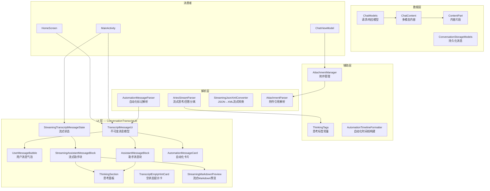
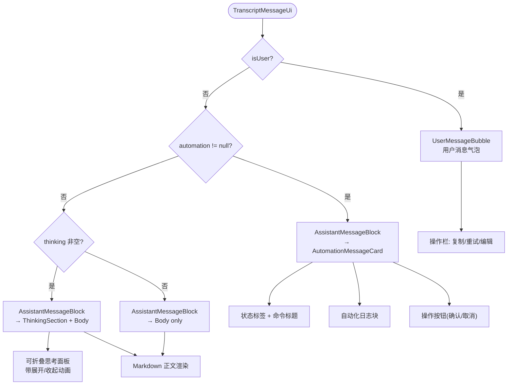
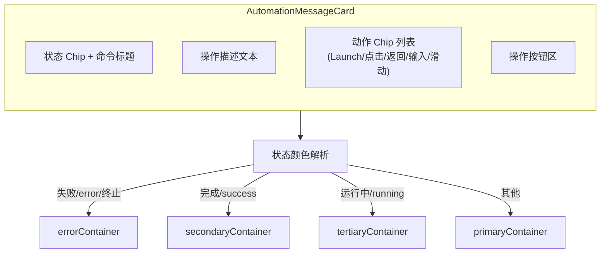
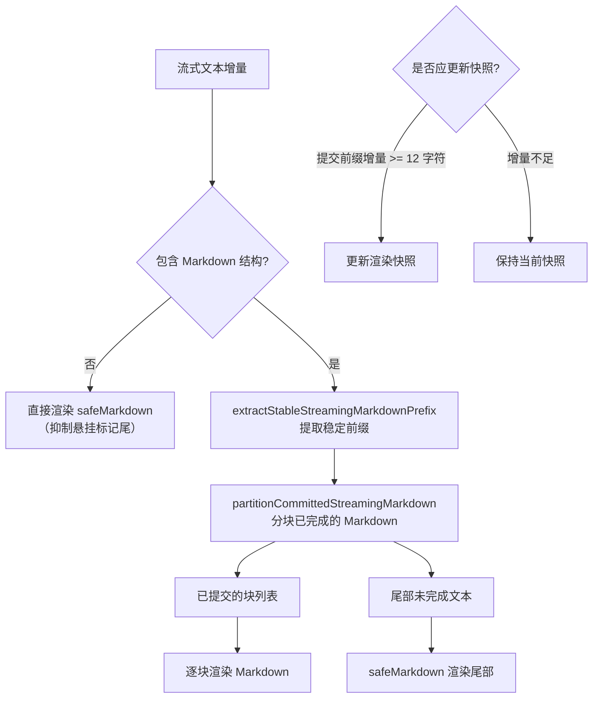
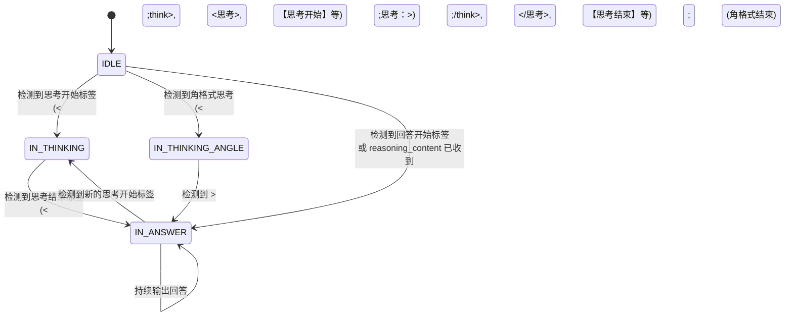

# 消息转录与卡片系统

消息转录与卡片系统是 Aries AI 聊天界面的核心 UI 子系统，负责将对话历史渲染为可视化消息卡片，包括用户消息气泡、AI 助手回答、思考过程折叠面板、自动化操作卡片以及流式输出的实时预览。

## 概述

消息转录与卡片系统位于 `com.ai.phoneagent.ui.messages` 包中，是整个聊天体验的视觉呈现层。系统处理三种主要消息类型，每种都有独特的 UI 呈现方式：

1. **用户消息** — 以 Material Design 气泡形式展示，支持复制、重试、编辑等操作
2. **AI 助手消息** — 包含 Markdown 渲染的回答正文，可附带思考过程面板
3. **自动化消息** — 以专用卡片展示自动化操作的执行状态、日志和操作按钮

### 设计意图

该系统的核心设计理念是：

- **不可变 UI 模型与可变流式状态分离**：`TranscriptMessageUi` 是不可变数据类，用于已完成的消息；`StreamingTranscriptMessageState` 是可变的，用于正在接收的流式消息。这种分离避免了已完成消息的不必要重组（recomposition），同时允许流式消息高效更新。
- **流式 Markdown 智能渲染**：不是每收到一个字符就重渲染整个 Markdown，而是通过分析 Markdown 结构边界（代码块、表格、列表等）来分块提交，减少布局抖动。
- **渐进式复杂度**：空状态展示简洁的品牌卡片和提示建议，有消息后展示完整的转录列表。

## 架构



架构分为五层：**数据层**提供 OpenAI 兼容的消息模型和持久化结构；**解析层**负责流式输出解析、自动化标记提取和格式转换；**辅助层**提供标签常量、时间线构建和附件管理；**UI 层**是核心渲染组件集合；**消费者层**是 `MainActivity` 和 `HomeScreen` 等入口点。

## 核心数据模型

### TranscriptMessageUi — 不可变消息 UI 模型

已完成的每条消息都映射为一个不可变的 `TranscriptMessageUi` 实例：

```kotlin
@Immutable
data class TranscriptMessageUi(
    val conversationId: Long,
    val messageIndex: Int,
    val id: String,
    val author: String,
    val body: String,
    val thinking: String?,
    val isUser: Boolean,
    val attachments: ImmutableList<String>,
    val isAutomation: Boolean,
    val automation: TranscriptAutomationUi? = null,
    val copyText: String,
    val retryText: String?,
    val isStreaming: Boolean = false,
    val thinkingDurationMs: Long? = null,
)
```

> Source: [ConversationTranscript.kt](https://github.com/ZG0704666/Aries-AI/blob/main/app/src/main/java/com/ai/phoneagent/ui/messages/ConversationTranscript.kt#L138-L154)

**设计要点**：使用 `@Immutable` 注解告知 Compose 编译器此类型是稳定的，避免不必要的重组。`thinking` 字段存储 AI 的思考过程（可为 null），`automation` 字段仅在自动化消息时有值。

### StreamingTranscriptMessageState — 流式消息可变状态

正在接收的流式消息使用可变状态类：

```kotlin
@Stable
class StreamingTranscriptMessageState(
    val conversationId: Long,
    val messageIndex: Int,
    val id: String,
    val author: String,
    val retryText: String?,
    initialBody: String,
    initialThinking: String?,
    initialCopyText: String,
    initialBodyPreview: StreamingTranscriptBodyPreview = buildStreamingTranscriptBodyPreview(initialBody),
) {
    var bodyPreview by mutableStateOf(initialBodyPreview)
        private set
    var thinking by mutableStateOf(initialThinking)
        private set
    var copyText by mutableStateOf(initialCopyText)
        private set
    // ...
}
```

> Source: [ConversationTranscript.kt](https://github.com/ZG0704666/Aries-AI/blob/main/app/src/main/java/com/ai/phoneagent/ui/messages/ConversationTranscript.kt#L175-L237)

使用 `@Stable` 注解和 `mutableStateOf`，Compose 可以精确跟踪哪些字段发生了变化，只在必要时重组相关 UI 子树。

### TranscriptAutomationUi — 自动化卡片模型

```kotlin
@Immutable
data class TranscriptAutomationUi(
    val command: String,
    val status: String,
    val logs: ImmutableList<String>,
    val actionLabel: String?,
    val actionEnabled: Boolean,
    val isDestructive: Boolean,
    val confirmInstruction: String?,
    val autoCollapseLogs: Boolean = false,
    val retryInstruction: String? = null,
    val secondaryActionLabel: String? = null,
    val secondaryActionEnabled: Boolean = false,
    val openSetupAction: Boolean = false,
)
```

> Source: [ConversationTranscript.kt](https://github.com/ZG0704666/Aries-AI/blob/main/app/src/main/java/com/ai/phoneagent/ui/messages/ConversationTranscript.kt#L239-L254)

## 消息类型与卡片渲染

### 消息分发逻辑

消息内容类型通过 `transcriptItemContentType` 函数分发，基于消息特征返回不同的 key，确保 Compose LazyList 正确复用视图：

```kotlin
private fun transcriptItemContentType(item: TranscriptMessageUi): String =
    when {
        item.isUser -> "user_message"
        item.automation != null -> "automation_message"
        !item.thinking.isNullOrBlank() -> "thinking_section"
        else -> "assistant_message"
    }
```

> Source: [ConversationTranscript.kt](https://github.com/ZG0704666/Aries-AI/blob/main/app/src/main/java/com/ai/phoneagent/ui/messages/ConversationTranscript.kt#L332-L338)



### 用户消息气泡

用户消息以 Material Design 的 `primaryContainer` 颜色气泡展示，右对齐。点击气泡可显示操作栏：

- **复制（Copy）**：复制消息文本到剪贴板
- **重试（Retry）**：使用相同文本重新发送请求
- **编辑（Edit）**：进入内联编辑模式，修改文本后重新发送
- 如果有附件，以 `FlowRow` 布局展示附件标签

编辑模式下，气泡替换为 `TextField`，显示确认/取消按钮。

```kotlin
if (isEditing) {
    TextField(
        value = editText,
        onValueChange = { editText = it },
        // ... 样式配置
        minLines = 2,
        maxLines = 8,
    )
} else {
    Text(
        text = item.body,
        // ... 样式配置
    )
}
```

> Source: [ConversationTranscript.kt](https://github.com/ZG0704666/Aries-AI/blob/main/app/src/main/java/com/ai/phoneagent/ui/messages/ConversationTranscript.kt#L615-L646)

### 思考面板（ThinkingSection）

思考面板是 AI 助手消息的可选部分，展示模型的内部推理过程：

- **折叠状态**：显示思考图标、标签（如 "思考中…" / "深度思考 2.3s"）和展开箭头
- **展开状态**：展示思考内容（流式输出时为纯文本，完成后为 Markdown 渲染）
- **动画**：宽度变化使用 `animateDpAsState`（tween 320ms），箭头旋转使用 `animateFloatAsState`（tween 220ms），内容展开使用 `AnimatedVisibility`
- **持久化状态**：折叠/展开状态通过 `rememberSaveable(messageId)` 在配置变更后保持

思考时长的格式化标签：

```kotlin
val thinkingLabel =
    thinkingDurationMs?.let { durationMs ->
        stringResource(
            R.string.message_thinking_duration_format,
            durationMs / 1000f,
        )
    } ?: if (isStreaming) {
        stringResource(R.string.message_thinking_in_progress)
    } else {
        stringResource(R.string.message_thinking_label)
    }
```

> Source: [ConversationTranscript.kt](https://github.com/ZG0704666/Aries-AI/blob/main/app/src/main/java/com/ai/phoneagent/ui/messages/ConversationTranscript.kt#L1792-L1802)

### 自动化消息卡片（AutomationMessageCard）

自动化消息是系统的独特设计，用于展示 AI 发起的手机自动化操作：



自动化日志经过 `buildAutomationLogBlocks` 处理，识别 "思考："、"输出："、"当前动作：" 等前缀，构建结构化的日志块用于 UI 渲染：

```kotlin
private fun buildAutomationLogBlocks(logs: List<String>): List<AutomationLogBlockUi> {
    val blocks = mutableListOf<MutableAutomationLogBlock>()
    // ...
    logs.forEach { line ->
        val text = AutomationMessageParser.normalizeAutomationLogLine(line)
        when {
            text.startsWith("思考：") -> { /* 创建思考块 */ }
            text.startsWith("输出：") || text.startsWith("修复输出：") -> { /* 提取描述 */ }
            text.startsWith("当前动作：") -> { /* 解析动作 Chip */ }
        }
    }
    // ...
}
```

> Source: [ConversationTranscript.kt](https://github.com/ZG0704666/Aries-AI/blob/main/app/src/main/java/com/ai/phoneagent/ui/messages/ConversationTranscript.kt#L2267-L2326)

## 流式 Markdown 渲染系统

流式渲染是系统中最复杂的部分，其核心挑战是在 AI 逐字输出时实时渲染 Markdown，同时避免布局抖动。

### 渲染策略



**设计意图**：流式 Markdown 渲染使用"快照推进"策略。系统不是每收到一个字符就重渲染，而是通过分析 Markdown 结构边界（代码围栏是否闭合、块数学公式是否完整等），只在"安全"的边界处更新渲染。这避免了以下问题：
- 代码块围栏不完整导致的渲染错误
- 表格单元格未闭合导致的结构破坏
- 内联格式标记（`**`、`*`、`` ` ``）悬挂导致的样式泄漏

### 稳定前缀提取

`findStableStreamingMarkdownEnd` 函数跟踪代码围栏、内联代码、块数学公式和内联数学公式的状态，只在安全边界（不在任何嵌套结构内的换行符处）返回：

```kotlin
private fun findStableStreamingMarkdownEnd(text: String): Int {
    var safeEnd = 0
    var inFence = false
    var inInlineCode = false
    var inBlockMath = false
    var inInlineMath = false
    // ... 逐字符扫描，跟踪状态
    if (!inFence && !inInlineCode && !inBlockMath && !inInlineMath) {
        safeEnd = text.length
    }
    return safeEnd
}
```

> Source: [ConversationTranscript.kt](https://github.com/ZG0704666/Aries-AI/blob/main/app/src/main/java/com/ai/phoneagent/ui/messages/ConversationTranscript.kt#L1510-L1551)

### 渲染节流

通过 `snapshotFlow` + `sample` 实现约 80ms 的渲染间隔：

```kotlin
LaunchedEffect(Unit) {
    snapshotFlow { latestTextState.value }
        .sample(STREAMING_MARKDOWN_RENDER_INTERVAL_MS)  // 80ms
        .collect { candidate ->
            val nextSnapshot = buildStreamingMarkdownSnapshot(candidate)
            if (shouldAdvanceStreamingMarkdownSnapshot(renderedSnapshot, nextSnapshot)) {
                renderedSnapshot = nextSnapshot
            }
        }
}
```

> Source: [ConversationTranscript.kt](https://github.com/ZG0704666/Aries-AI/blob/main/app/src/main/java/com/ai/phoneagent/ui/messages/ConversationTranscript.kt#L1150-L1158)

### 关键常量

| 常量 | 值 | 说明 |
|------|-----|------|
| `STREAMING_MARKDOWN_RENDER_INTERVAL_MS` | 80ms | 流式 Markdown 渲染采样间隔 |
| `STREAMING_MARKDOWN_MIN_CHUNK_DELTA` | 12 | 推动快照推进的最小字符增量 |
| `STREAMING_PENDING_INLINE_TAIL_LIMIT` | 32 | 悬挂内联标记尾部的最大容忍长度 |
| `CODE_BLOCK_COLLAPSE_LINE_THRESHOLD` | 10 | 代码块自动折叠的行数阈值 |

## 空状态提示卡

当对话为空时，系统展示品牌化的空状态卡片 `TranscriptEmptyHintCard`：

- 展示应用图标和名称
- 展示品牌标语
- 提供最多 3 个建议提示（如"搜索…"），来自 `R.array.transcript_suggestion_examples` 资源
- 点击建议提示会触发 `onSuggestionClick` 回调

```kotlin
val suggestions = remember(context) {
    val suggestionIcons = listOf(
        Lucide.Search,
        Lucide.Sparkles,
        Lucide.MessageCircle,
    )
    context.resources
        .getStringArray(R.array.transcript_suggestion_examples)
        .toList()
        .take(suggestionIcons.size)
        .mapIndexed { index, prompt ->
            TranscriptEmptySuggestionItem(
                label = prompt,
                prompt = prompt,
                icon = suggestionIcons.getOrElse(index) { Lucide.Sparkles },
            )
        }
}
```

> Source: [ConversationTranscript.kt](https://github.com/ZG0704666/Aries-AI/blob/main/app/src/main/java/com/ai/phoneagent/ui/messages/ConversationTranscript.kt#L440-L457)

## 流式解析器

`AriesStreamParser` 是一个状态机，负责实时分离 AI 输出流中的思考内容和回答内容：



支持的思考标记格式：
- `<think>...</think>` — XML 标签格式
- `<思考>...</思考>` — 中文 XML 格式
- `<思考：...>` — 角格式（以 `>` 结束）
- `【思考开始】...【思考结束】` — 中文方括号格式
- `reasoning_content` 字段（OpenAI o1 风格）

```kotlin
enum class ParseState {
    IDLE,                // 初始状态
    IN_THINKING,         // 思考中（通用）
    IN_THINKING_ANGLE,   // <思考：...> 格式的思考
    IN_ANSWER            // 回答中
}
```

> Source: [AriesStreamParser.kt](https://github.com/ZG0704666/Aries-AI/blob/main/app/src/main/java/com/ai/phoneagent/helper/AriesStreamParser.kt#L51-L56)

解析器还实现了 `flush()` 方法，在流结束时将缓冲区内容刷出：

```kotlin
fun flush(): List<ParsedChunk> {
    val results = mutableListOf<ParsedChunk>()
    val remaining = buffer.toString()
    if (remaining.isNotBlank()) {
        when (currentState) {
            ParseState.IN_THINKING, ParseState.IN_THINKING_ANGLE -> {
                results.add(ParsedChunk(ChunkType.THINKING, remaining))
            }
            else -> {
                results.add(ParsedChunk(ChunkType.ANSWER, remaining))
            }
        }
    }
    buffer.clear()
    return results
}
```

> Source: [AriesStreamParser.kt](https://github.com/ZG0704666/Aries-AI/blob/main/app/src/main/java/com/ai/phoneagent/helper/AriesStreamParser.kt#L349-L364)

## 自动化消息解析器

`AutomationMessageParser` 处理自动化消息中的特殊标记，支持以下标记类型：

| 标记格式 | 用途 |
|---------|------|
| `[[AUTO_LOG_B64:base64]]` | 编码的自动化日志行 |
| `[[AUTO_EXECUTE:指令]]` | 自动化执行指令 |
| `[[AUTO_CONFIRM:指令]]` | 确认操作指令 |
| `[[AUTO_CONFIRMED]]` | 用户已确认标记 |
| `[[AUTO_REJECTED]]` | 用户已拒绝标记 |

解析器的 `parseStoredAiContent` 方法支持多种思考/回答分隔格式，优先级从高到低：
1. `<think>...</think>` XML 标签
2. `杲...杲` 自定义标记
3. `leshoot...leshoot` 自定义标记
4. `【思考开始】...【思考结束】` + `【回答开始】...【回答结束】`

```kotlin
fun parseStoredAiContent(raw: String): Pair<String?, String> {
    // 依次尝试各种格式...
    // 返回 Pair<thinking?, answer>
}
```

> Source: [AutomationMessageParser.kt](https://github.com/ZG0704666/Aries-AI/blob/main/app/src/main/java/com/ai/phoneagent/helper/AutomationMessageParser.kt#L126-L186)

## 消息构建流程

从存储数据到 UI 模型的完整构建流程：

```mermaid
sequenceDiagram
    participant Storage as ConversationStorage<br/>持久化消息
    participant MA as MainActivity
    participant AMP as AutomationMessageParser
    participant TUI as TranscriptMessageUi
    participant CT as ConversationTranscript<br/>UI 组件

    Storage->>MA: loadConversations() → List&lt;ConversationRecord&gt;
    MA->>MA: map → buildTranscriptMessageUi()
    
    rect rgb(230, 240, 255)
        Note over MA,AMP: 对每条 AI 消息的处理
        MA->>AMP: extractAutomationLogMarkers(content)
        AMP-->>MA: (cleanContent, logs)
        MA->>AMP: parseStoredAiContent(content)
        AMP-->>MA: (thinking, answer)
        MA->>AMP: extractAutomationCommand(answer)
        AMP-->>MA: command?
        MA->>MA: buildTranscriptAutomationUi()
    end
    
    MA->>TUI: TranscriptMessageUi 实例
    TUI->>TUI: transcriptItemContentType()
    TUI->>TUI: 渲染对应卡片
```

## 代码块渲染

系统为消息中的代码块提供了专门的渲染支持：

- **自动换行**：`autoWrap` 控制代码是否自动换行
- **行号显示**：`lineNumbers` 控制是否显示行号
- **自动折叠**：`autoCollapse` + 超过 10 行的代码块自动折叠
- **语言标签**：显示代码块的语言标识

```kotlin
@Immutable
data class CodeBlockPrefs(
    val autoWrap: Boolean = true,
    val lineNumbers: Boolean = false,
    val autoCollapse: Boolean = false,
)
```

> Source: [ConversationTranscript.kt](https://github.com/ZG0704666/Aries-AI/blob/main/app/src/main/java/com/ai/phoneagent/ui/messages/ConversationTranscript.kt#L118-L123)

这些偏好通过 `CompositionLocalProvider` 注入到组件树中：

```kotlin
CompositionLocalProvider(
    LocalCodeBlockPrefs provides codeBlockPrefs,
    LocalMarkdownSettings provides MarkdownSettings(
        autoWrap = codeBlockPrefs.autoWrap,
        lineNumbers = codeBlockPrefs.lineNumbers,
        autoCollapse = codeBlockPrefs.autoCollapse,
    ),
) {
    AssistantMessageBlock(...)
}
```

> Source: [ConversationTranscript.kt](https://github.com/ZG0704666/Aries-AI/blob/main/app/src/main/java/com/ai/phoneagent/ui/messages/ConversationTranscript.kt#L371-L377)

## 配置选项

### CodeBlockPrefs

| 选项 | 类型 | 默认值 | 描述 |
|------|------|--------|------|
| `autoWrap` | Boolean | `true` | 代码块是否自动换行 |
| `lineNumbers` | Boolean | `false` | 是否显示行号 |
| `autoCollapse` | Boolean | `false` | 长代码块是否自动折叠（>10行） |

### 流式渲染常量

| 常量 | 类型 | 值 | 描述 |
|------|------|-----|------|
| `STREAMING_MARKDOWN_RENDER_INTERVAL_MS` | Long | 80 | 流式 Markdown 刷新间隔 |
| `STREAMING_MARKDOWN_MIN_CHUNK_DELTA` | Int | 12 | 推进快照的最小字符增量 |
| `CODE_BLOCK_COLLAPSE_LINE_THRESHOLD` | Int | 10 | 代码块自动折叠行数阈值 |
| `TRANSCRIPT_EMPTY_SUGGESTION_PAGE_SIZE` | Int | 3 | 空状态建议提示数量 |

## API 参考

### LazyListScope 扩展函数

#### `conversationTranscriptItems`

```kotlin
fun LazyListScope.conversationTranscriptItems(
    items: ImmutableList<TranscriptMessageUi>,
    onCopyMessage: (TranscriptMessageUi) -> Unit,
    onRetryMessage: (TranscriptMessageUi) -> Unit,
    onAutomationAction: (TranscriptMessageUi) -> Unit,
    thinkingExpandedByDefault: Boolean,
    onEditMessage: (TranscriptMessageUi) -> Unit = {},
    codeBlockPrefs: CodeBlockPrefs = CodeBlockPrefs(),
)
```

将消息列表渲染为 LazyList 条目。每条消息使用其 `id` 作为 key。

#### `conversationTranscriptItem`（流式重载）

```kotlin
fun LazyListScope.conversationTranscriptItem(
    item: StreamingTranscriptMessageState,
    onCopyMessage: (TranscriptMessageUi) -> Unit,
    onRetryMessage: (TranscriptMessageUi) -> Unit,
    onAutomationAction: (TranscriptMessageUi) -> Unit,
    thinkingExpandedByDefault: Boolean,
    onEditMessage: (TranscriptMessageUi) -> Unit = {},
    codeBlockPrefs: CodeBlockPrefs = CodeBlockPrefs(),
)
```

渲染单条流式消息。使用 `StreamingTranscriptMessageState` 而非 `TranscriptMessageUi`，因为流式消息需要可变状态。

### Composable 组件

#### `TranscriptEmptyHintCard`

```kotlin
@Composable
fun TranscriptEmptyHintCard(
    modifier: Modifier = Modifier,
    onSuggestionClick: (String) -> Unit = {},
)
```

当对话为空时显示的欢迎卡片，包含品牌标识和建议提示。

### 流式预览构建

#### `buildStreamingTranscriptBodyPreview`

```kotlin
fun buildStreamingTranscriptBodyPreview(text: String): StreamingTranscriptBodyPreview
```

将流式文本转换为 `StreamingTranscriptBodyPreview`，用于流式 Markdown 渲染。

## 附件系统集成

消息转录系统与附件管理器紧密集成。用户消息的附件以标签形式显示在气泡下方，AI 可以接收多模态内容（文本 + 图片）。

### 多模态内容模型

```kotlin
@Serializable(with = ChatContentSerializer::class)
sealed class ChatContent {
    data class Text(val text: String) : ChatContent()
    data class Multimodal(val parts: List<ContentPart>) : ChatContent()
}

@Serializable(with = ContentPartSerializer::class)
sealed class ContentPart {
    data class TextPart(val text: String) : ContentPart()
    data class ImageUrlPart(val imageUrl: ImageUrl) : ContentPart()
}
```

> Sources:
> - [ChatContent.kt](https://github.com/ZG0704666/Aries-AI/blob/main/app/src/main/java/com/ai/phoneagent/data/model/ChatContent.kt#L24-L34)
> - [ContentPart.kt](https://github.com/ZG0704666/Aries-AI/blob/main/app/src/main/java/com/ai/phoneagent/data/model/ContentPart.kt#L25-L37)

### 附件引用标签

附件通过 XML 风格的引用标签嵌入消息文本：

```
<attachment id="path" filename="name" type="mime" size="123" content="text"/>
```

`AttachmentParser` 负责解析和创建这些引用：

```kotlin
object AttachmentParser {
    fun hasAttachmentRefs(text: String): Boolean
    fun extractAttachmentRefs(text: String): List<AttachmentRef>
    fun removeAttachmentRefs(text: String): String
    fun createAttachmentRef(id, filename, type, size, content): String
}
```

> Source: [AttachmentParser.kt](https://github.com/ZG0704666/Aries-AI/blob/main/app/src/main/java/com/ai/phoneagent/helper/AttachmentParser.kt#L11-L101)

## 相关链接

- [ConversationTranscript.kt（核心 UI 组件）](https://github.com/ZG0704666/Aries-AI/blob/main/app/src/main/java/com/ai/phoneagent/ui/messages/ConversationTranscript.kt)
- [AriesStreamParser.kt（流式解析器）](https://github.com/ZG0704666/Aries-AI/blob/main/app/src/main/java/com/ai/phoneagent/helper/AriesStreamParser.kt)
- [AutomationMessageParser.kt（自动化消息解析器）](https://github.com/ZG0704666/Aries-AI/blob/main/app/src/main/java/com/ai/phoneagent/helper/AutomationMessageParser.kt)
- [ChatContent.kt（多模态内容模型）](https://github.com/ZG0704666/Aries-AI/blob/main/app/src/main/java/com/ai/phoneagent/data/model/ChatContent.kt)
- [ContentPart.kt（内容片段模型）](https://github.com/ZG0704666/Aries-AI/blob/main/app/src/main/java/com/ai/phoneagent/data/model/ContentPart.kt)
- [ThinkingTags.kt（思考标签常量）](https://github.com/ZG0704666/Aries-AI/blob/main/app/src/main/java/com/ai/phoneagent/core/utils/ThinkingTags.kt)
- [AttachmentManager.kt（附件管理器）](https://github.com/ZG0704666/Aries-AI/blob/main/app/src/main/java/com/ai/phoneagent/helper/AttachmentManager.kt)
- [ChatViewModel.kt（聊天视图模型）](https://github.com/ZG0704666/Aries-AI/blob/main/app/src/main/java/com/ai/phoneagent/viewmodel/ChatViewModel.kt)
- [ConversationStorageModels.kt（持久化模型）](https://github.com/ZG0704666/Aries-AI/blob/main/app/src/main/java/com/ai/phoneagent/data/local/ConversationStorageModels.kt)
- [AutomationTimelineFormatter.kt（自动化时间线构建）](https://github.com/ZG0704666/Aries-AI/blob/main/app/src/main/java/com/ai/phoneagent/helper/AutomationTimelineFormatter.kt)
- [StreamingJsonXmlConverter.kt（流式JSON→XML转换）](https://github.com/ZG0704666/Aries-AI/blob/main/app/src/main/java/com/ai/phoneagent/helper/StreamingJsonXmlConverter.kt)
- [HomeScreen.kt（主屏幕集成）](https://github.com/ZG0704666/Aries-AI/blob/main/app/src/main/java/com/ai/phoneagent/ui/home/HomeScreen.kt)
- [MainActivity.kt（Activity 入口集成）](https://github.com/ZG0704666/Aries-AI/blob/main/app/src/main/java/com/ai/phoneagent/MainActivity.kt)
