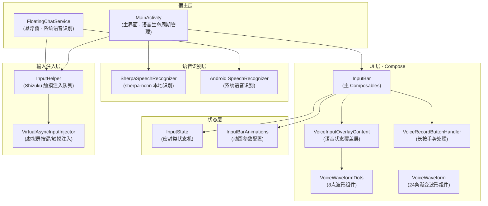
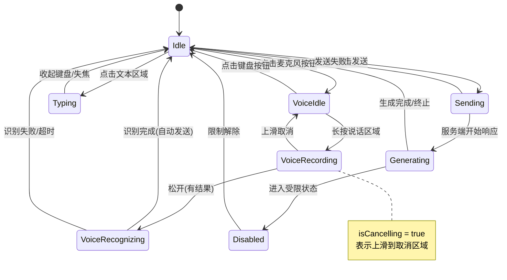
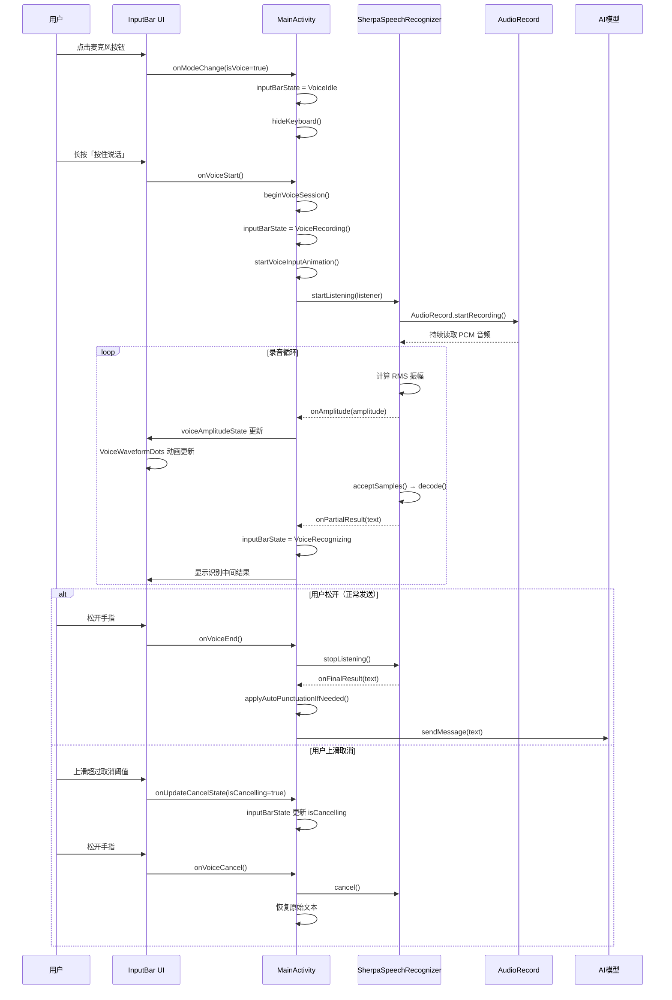
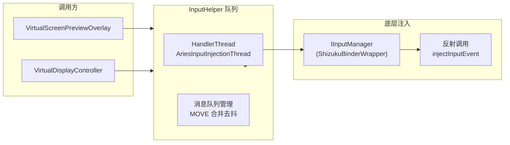

# 输入栏与语音波形

Aries AI 的核心交互入口，集成了文本输入、语音输入、模式切换与实时语音波形反馈。基于 Jetpack Compose 构建，通过状态机管理复杂的 UI 模式切换，使用 sherpa-ncnn 引擎实现离线语音识别。

## 概述

输入栏（InputBar）是 Aries AI 中用户与 AI 交互的主要界面组件。它不仅仅是一个文本输入框，而是一个集成了以下多模态能力的综合入口：

- **文本输入**：支持展开/收起两种模式，展开后可输入多行文本
- **语音输入**：采用「按住说话」的 Push-to-talk 交互模式，基于 sherpa-ncnn 实现离线语音识别
- **模式切换**：支持文本模式与语音模式之间的一键切换
- **语音波形反馈**：在录音过程中实时显示振幅波形动画，提供直观的视觉反馈
- **附件支持**：支持在输入栏中附加文件、图片等附件
- **Agent 模式**：一键切换到自动化 Agent 模式，将任务转交给后台自动化执行

### 设计意图

输入栏采用「紧凑展开式」设计，默认以单行收缩态呈现（类似聊天应用的气泡输入条），点击后展开为完整的多行编辑器。语音模式使用长按触发而非点击触发，是为了避免误操作——这是一种在移动端广泛采用的防误触设计。语音波形的振幅反馈让用户知道麦克风正在工作，降低「说话无人听」的焦虑感。

## 架构



**架构说明：**

- **UI 层**：`InputBar` 是核心可组合函数，根据 `InputState` 状态切换显示文本模式或语音模式。`VoiceInputOverlayContent` 在录音时显示在输入栏上方，包含状态标签、波形动画和操作提示。
- **状态层**：`InputState` 是一个密封类，定义了输入栏的所有可能状态，通过 Kotlin 的 `when` 表达式实现完整的状态匹配和编译期安全检查。
- **宿主层**：`MainActivity` 持有语音识别器实例和所有状态变量，管理完整的语音输入生命周期；`FloatingChatService` 在悬浮窗中使用简化的 `FloatingInputBar`。
- **语音识别层**：主界面使用 sherpa-ncnn 实现完全离线识别，悬浮窗降级使用 Android 系统 SpeechRecognizer。
- **输入注入层**：通过 Shizuku 获取系统级 `IInputManager` 权限，支持向指定 displayId 注入触摸和按键事件。

## 输入栏状态机

### InputState 状态定义

`InputState` 是一个密封类（sealed class），定义了输入栏的所有可能状态。这种设计确保了状态转换的编译期安全检查。

```kotlin
sealed class InputState {
    object Idle : InputState()                    // 默认状态（文本输入模式）
    object VoiceIdle : InputState()               // 语音模式等待触发（显示"按住说话"）
    object Typing : InputState()                  // 输入中
    data class VoiceRecording(val isCancelling: Boolean = false) : InputState() // 语音录制中，带取消状态
    object VoiceRecognizing : InputState()        // 语音识别中
    object Sending : InputState()                 // 发送中
    object Generating : InputState()              // AI生成中（显示停止按钮）
    object Disabled : InputState()                // 禁用状态（AI回复中）
}
```
> Source: [InputState.kt](https://github.com/ZG0704666/Aries-AI/blob/main/app/src/main/java/com/ai/phoneagent/ui/inputbar/InputState.kt#L6-L14)

### 状态转换图



## 核心实现

### InputBar 主组件

`InputBar` 是整个输入系统的核心可组合函数，它接收状态、文本、振幅等参数，并根据当前状态渲染不同的 UI 布局：

```kotlin
@Composable
fun InputBar(
    state: InputState,
    text: String,
    onTextChange: (String) -> Unit,
    onSend: () -> Unit,
    onVoiceStart: () -> Unit,
    onVoiceEnd: () -> Unit,
    onVoiceCancel: () -> Unit,
    onAttachmentClick: () -> Unit,
    hasAttachments: Boolean = false,
    agentModeEnabled: Boolean,
    onAgentToggle: (Boolean) -> Unit,
    onModelSelect: () -> Unit,
    onModeChange: (Boolean) -> Unit,
    voiceAmplitude: Float = 0f,
    modifier: Modifier = Modifier,
    onUpdateCancelState: (Boolean) -> Unit = {}
)
```
> Source: [InputBar.kt](https://github.com/ZG0704666/Aries-AI/blob/main/app/src/main/java/com/ai/phoneagent/ui/inputbar/InputBar.kt#L44-L62)

**关键设计决策：**

1. **容器高度动画切换**：语音模式和文本模式使用不同的容器高度（`inputBarVoiceHeight` vs `inputBarHeight`），通过 `animateDpAsState` 实现平滑过渡（220ms）。

2. **主要操作按钮动态变化**：当输入框为空且无附件时，主按钮显示麦克风图标（渐变背景），点击切换到语音模式；有内容时显示发送/停止图标。此判断由 `showAssistantEntry` 控制：

```kotlin
val canSubmit = isGenerating || hasText || hasAttachments
val showAssistantEntry = !canSubmit
```
> Source: [InputBar.kt](https://github.com/ZG0704666/Aries-AI/blob/main/app/src/main/java/com/ai/phoneagent/ui/inputbar/InputBar.kt#L88-L89)

3. **键盘与语音模式互斥**：`LaunchedEffect` 确保进入语音模式时自动隐藏键盘和收起输入区域。

4. **发送按钮的颜色动画**：生成中显示红色（error 色），可发送时显示主色：

```kotlin
val sendContainerColor by animateColorAsState(
    targetValue = when {
        isGenerating -> colorScheme.error
        canSubmit -> colorScheme.primary
        else -> colorScheme.primary
    },
    animationSpec = tween(durationMillis = 180, easing = FastOutSlowInEasing),
)
```
> Source: [InputBar.kt](https://github.com/ZG0704666/Aries-AI/blob/main/app/src/main/java/com/ai/phoneagent/ui/inputbar/InputBar.kt#L104-L113)

### 语音覆盖层

当正在进行语音录制或识别时，`VoiceInputOverlayContent` 以动画方式出现在输入栏上方：

```kotlin
@Composable
fun VoiceInputOverlayContent(
    amplitude: Float,
    inputState: InputState,
) {
    // 根据状态显示不同的状态文案
    val statusText = when {
        inputState is InputState.VoiceRecognizing -> "正在识别"
        else -> "正在聆听"
    }
    // 被取消时使用 error 色；正常时使用 primary 色
    val waveColor = if (isCancelled) colorScheme.error else colorScheme.primary
    // 显示 VoiceWaveformDots 组件
    VoiceWaveformDots(amplitude = if (isRecording) amplitude else 0f, color = waveColor)
}
```
> Source: [InputBar.kt](https://github.com/ZG0704666/Aries-AI/blob/main/app/src/main/java/com/ai/phoneagent/ui/inputbar/InputBar.kt#L550-L611)

覆盖层包含三个信息区：
- **状态标签**：「正在聆听」或「正在识别」，取消状态时变为 error 色
- **波形动画**：8 点振幅波形，实时响应音量变化
- **操作提示**：正常状态显示「松开输入，上滑取消」，取消状态显示「松开取消」

### 长按手势处理器

语音录制使用 `detectDragGesturesAfterLongPress` 手势检测器，实现了防误触的「长按说话 + 上滑取消」交互：

```kotlin
@Composable
fun VoiceRecordButtonHandler(
    onPressStart: () -> Unit,
    onPressEnd: () -> Unit,
    onCancel: () -> Unit,
    onOffsetChange: (Float, Boolean) -> Unit,
) {
    // 取消阈值为向上滑动 150dp
    val cancelEnterThreshold = -dimensionResource(R.dimen.m3t_input_bar_voice_cancel_enter_offset).toPx()
    // 退回阈值为 110dp（滞后效果，防止抖动）
    val cancelExitThreshold = -dimensionResource(R.dimen.m3t_input_bar_voice_cancel_exit_offset).toPx()
    // ...
}
```
> Source: [InputBar.kt](https://github.com/ZG0704666/Aries-AI/blob/main/app/src/main/java/com/ai/phoneagent/ui/inputbar/InputBar.kt#L614-L694)

**取消判定的滞后逻辑**：进入取消状态需要上滑超过 150dp（`cancelEnterThreshold`），退出取消状态需要下滑回到 110dp 以内（`cancelExitThreshold`）。这种不对称阈值设计（滞后回差）防止了手指在边界附近抖动时状态频繁切换。

## 语音波形

### 双波形设计

Aries AI 提供了两种语音波形视觉组件，分别用于不同的场景：

| 组件 | 条数 | 形状 | 颜色 | 使用场景 |
|------|------|------|------|----------|
| `VoiceWaveformDots` | 8 个圆点 | 圆形（CircleShape） | 单色（primary/error） | 覆盖层内联波形 |
| `VoiceWaveform` | 24 个条形 | 圆角矩形（RoundedCornerShape 1.5dp） | 蓝→紫→粉渐变 | 独立的波形展示 |

### VoiceWaveform — 渐变条形波形

完整的 24 条渐变波形组件，中间高两边低，颜色从蓝色渐变到紫色再到粉色：

```kotlin
@Composable
fun VoiceWaveform(
    amplitude: Float, // 0.0 ~ 1.0 - 音量振幅
    modifier: Modifier = Modifier
) {
    val barCount = 24
    val barWidth = 3.dp
    val barSpacing = 3.dp
    val maxHeight = 48.dp
    val minHeight = 6.dp
    val waveStart = colorResource(id = R.color.m3t_voice_wave_start) // #007AFF 蓝
    val waveMid = colorResource(id = R.color.m3t_voice_wave_mid)     // #5856D6 紫
    val waveEnd = colorResource(id = R.color.m3t_voice_wave_end)     // #FF2D55 粉

    Row(horizontalArrangement = Arrangement.spacedBy(barSpacing)) {
        repeat(barCount) { index ->
            // 中间高两边低的分布
            val centerWeight = 1f - abs(index - barCount / 2f) / (barCount / 2f)
            val randomFactor = Random.nextFloat() * 0.4f + 0.6f
            val targetHeight = minHeight + (maxHeight - minHeight) * amplitude * centerWeight * randomFactor

            val animatedHeight by animateDpAsState(
                targetValue = targetHeight,
                animationSpec = spring(dampingRatio = 0.5f, stiffness = 400f),
            )

            // 渐变颜色 - 蓝→紫→粉
            val barColor = lerp(
                lerp(waveStart, waveMid, (colorPosition * 2f).coerceAtMost(1f)),
                waveEnd,
                (colorPosition - 0.5f).coerceAtLeast(0f) * 2f
            )

            Box(Modifier.width(barWidth).height(animatedHeight)
                .clip(RoundedCornerShape(1.5.dp)).background(barColor))
        }
    }
}
```
> Source: [VoiceWaveform.kt](https://github.com/ZG0704666/Aries-AI/blob/main/app/src/main/java/com/ai/phoneagent/ui/inputbar/VoiceWaveform.kt#L30-L81)

**设计意图**：
- 使用 `spring` 而非 `tween` 动画，营造「弹性」的视觉效果，更接近真实声波的物理感
- `randomFactor`（随机因子）使同一次录音中同一振幅也略有不同，模拟真实声波的不规则性
- 颜色使用 `lerp` 双线性插值实现平滑渐变，而非预定义色阶

### VoiceWaveformDots — 圆点内联波形

用于 InputBar 覆盖层的紧凑波形，8 个圆点，随振幅缩放：

```kotlin
@Composable
fun VoiceWaveformDots(amplitude: Float, color: Color) {
    val dotCount = 8
    val targetScale = if (amplitude > 0.05f) {
        val centerFactor = 1f - abs(index - dotCount / 2f) / (dotCount / 2f)
        startScale + (amplitude * 2f * centerFactor) + (Random.nextFloat() * 0.3f)
    } else {
        startScale
    }
    // 使用 spring 动画缩放每个圆点
    val animatedScale by animateFloatAsState(
        targetValue = targetScale.coerceIn(0.6f, 2.5f),
        animationSpec = spring(stiffness = Spring.StiffnessLow),
    )
}
```
> Source: [InputBar.kt](https://github.com/ZG0704666/Aries-AI/blob/main/app/src/main/java/com/ai/phoneagent/ui/inputbar/InputBar.kt#L697-L731)

### 颜色配置

日间模式和夜间模式使用不同的波形配色：

| 颜色键 | 日间模式 | 夜间模式 |
|--------|---------|---------|
| `m3t_voice_wave_start` | `#007AFF`（iOS Blue） | `#7FB4FF` |
| `m3t_voice_wave_mid` | `#5856D6`（紫色） | `#A892FF` |
| `m3t_voice_wave_end` | `#FF2D55`（粉红） | `#FF7AA2` |

> Sources: [m3t.xml（日间）](https://github.com/ZG0704666/Aries-AI/blob/main/app/src/main/res/values/m3t.xml#L106-L108) | [m3t.xml（夜间）](https://github.com/ZG0704666/Aries-AI/blob/main/app/src/main/res/values-night/m3t.xml#L102-L104)

## 语音识别流程

### 完整的语音输入交互流



### MainActivity 中的语音状态管理

MainActivity 持有语音相关的所有状态变量：

```kotlin
private var sherpaSpeechRecognizer: SherpaSpeechRecognizer? = null
private var isListening = false
private var voicePrefix: String = ""
private var voiceInputAnimJob: Job? = null
private var savedInputText: String = ""
private var pendingSendAfterVoice: Boolean = false
private var voiceSessionSeed: Long = 0L
@Volatile private var activeVoiceSessionId: Long = 0L

private val inputBarState = mutableStateOf<InputState>(InputState.Idle)
private val voiceAmplitudeState = mutableStateOf(0f)
```
> Source: [MainActivity.kt](https://github.com/ZG0704666/Aries-AI/blob/main/app/src/main/java/com/ai/phoneagent/MainActivity.kt#L444-L549)

**语音会话机制**：通过 `beginVoiceSession()` / `clearVoiceSession()` 和 `isVoiceSessionActive()` 实现语音会话的隔离，防止快速重复触发或并发问题。每次长按都会分配一个新的 sessionId。

### 「正在语音输入...」点动画

在语音识别返回第一个结果之前，输入栏会显示一个循环的点动画：

```kotlin
private fun startVoiceInputAnimation() {
    voiceInputAnimJob?.cancel()
    savedInputText = inputTextState.value
    voiceInputAnimJob = lifecycleScope.launch {
        var dotCount = 1
        while (true) {
            val dots = ".".repeat(dotCount)
            inputTextState.value = "正在语音输入$dots"
            dotCount = if (dotCount >= 3) 1 else dotCount + 1
            delay(400)
        }
    }
}
```
> Source: [MainActivity.kt](https://github.com/ZG0704666/Aries-AI/blob/main/app/src/main/java/com/ai/phoneagent/MainActivity.kt#L4029-L4041)

当 `onPartialResult` 首次返回时，动画停止，替换为实际识别的文字。

### 自动标点

语音识别完成后，如果识别文本长度超过 10 个字符且不含任何标点符号，系统会自动调用 AI 模型添加标点：

```kotlin
private fun applyAutoPunctuationIfNeeded(text: String, onDone: (String) -> Unit) {
    val raw = text.trim()
    val hasPunctuation = Regex("[，。！？；：,.!?;:]").containsMatchIn(raw)
    if (hasPunctuation || raw.length < 10) {
        onDone(text)
        return
    }
    // 调用 AI 模型添加标点...
    val punctuationMessages = listOf(
        ChatRequestMessage(role = "system", content = "你是标点助手..."),
        ChatRequestMessage(role = "user", content = "为以下文本添加标点：\n$raw")
    )
    // ...
}
```
> Source: [MainActivity.kt](https://github.com/ZG0704666/Aries-AI/blob/main/app/src/main/java/com/ai/phoneagent/MainActivity.kt#L4049-L4134)

## SherpaSpeechRecognizer — 离线语音识别引擎

Aries AI 使用 sherpa-ncnn（而非此前使用的 Vosk）作为本地语音识别引擎。这是一个专为移动端优化的轻量级识别方案。

### 引擎初始化

```kotlin
class SherpaSpeechRecognizer(private val context: Context) {
    companion object {
        private const val SAMPLE_RATE = 16000  // 16kHz 采样率
    }

    suspend fun initialize(): Boolean {
        withContext(Dispatchers.IO) {
            if (!SherpaNcnn.isNativeLibraryReady()) {
                // 本地库不可用
                return@withContext false
            }
            val created = createRecognizer()
            // ...
        }
    }
}
```
> Source: [SherpaSpeechRecognizer.kt](https://github.com/ZG0704666/Aries-AI/blob/main/app/src/main/java/com/ai/phoneagent/speech/SherpaSpeechRecognizer.kt#L49-L131)

### 模型配置

使用中英双语流式模型（`sherpa-ncnn-streaming-zipformer-bilingual-zh-en-2023-02-13`），关键配置包括：

```kotlin
val recognizerConfig = RecognizerConfig(
    featConfig = featConfig,
    modelConfig = modelConfig,
    decoderConfig = decoderConfig,
    enableEndpoint = false,      // Push-to-talk，不自动断句
    rule1MinTrailingSilence = 2.4f,
    rule2MinTrailingSilence = 1.2f,
    rule3MinUtteranceLength = 20.0f,
    numThreads = 4,              // 4线程推理
    useGPU = false               // 纯 CPU 推理
)
```
> Source: [SherpaSpeechRecognizer.kt](https://github.com/ZG0704666/Aries-AI/blob/main/app/src/main/java/com/ai/phoneagent/speech/SherpaSpeechRecognizer.kt#L241-L254)

模型文件从 APK 的 `assets/sherpa-models/` 目录首次启动时拷贝到应用内部存储。需要的模型文件包括：
- `encoder_jit_trace-pnnx.ncnn.param` / `.bin`（编码器）
- `decoder_jit_trace-pnnx.ncnn.param` / `.bin`（解码器）
- `joiner_jit_trace-pnnx.ncnn.param` / `.bin`（连接器）
- `tokens.txt`（词表）

### 识别回调接口

```kotlin
interface RecognitionListener {
    fun onPartialResult(text: String)      // 实时中间结果
    fun onResult(text: String)             // 最终识别结果（endpoint触发）
    fun onFinalResult(text: String)        // 最终结果（手动停止）
    fun onAmplitude(amplitude: Float)      // 音量振幅 (0.0 ~ 1.0)
    fun onError(exception: Exception)      // 识别出错
    fun onTimeout()                        // 识别超时
}
```
> Source: [SherpaSpeechRecognizer.kt](https://github.com/ZG0704666/Aries-AI/blob/main/app/src/main/java/com/ai/phoneagent/speech/SherpaSpeechRecognizer.kt#L57-L75)

### 振幅计算

振幅通过 RMS（均方根）算法计算，经过归一化后映射到 0.0~1.0 的范围内：

```kotlin
// 计算振幅 (RMS)
var sum = 0.0
for (i in 0 until ret) {
    sum += audioBuffer[i] * audioBuffer[i]
}
val rms = Math.sqrt(sum / ret)
// 归一化处理（经验值 3000 作为参考最大值）
val amplitude = (rms / 3000.0).toFloat().coerceIn(0f, 1f)
```
> Source: [SherpaSpeechRecognizer.kt](https://github.com/ZG0704666/Aries-AI/blob/main/app/src/main/java/com/ai/phoneagent/speech/SherpaSpeechRecognizer.kt#L392-L398)

### 录音生命周期方法

| 方法 | 说明 |
|------|------|
| `initialize()` | 异步初始化引擎，拷贝模型文件，创建 SherpaNcnn 实例 |
| `startListening(listener)` | 创建 AudioRecord，启动录音线程 |
| `stopListening()` | 停止录音，调用 `inputFinished()` 获取最终结果 |
| `cancel()` | 取消识别，不返回结果，释放资源 |
| `shutdown()` | 完全释放，取消所有协程和识别器 |
| `isReady()` | 检查引擎是否已初始化完成 |
| `isListening()` | 检查是否正在录音 |

## InputHelper — 输入注入辅助层

输入注入系统支持将触摸和按键事件通过 Shizuku 权限注入到指定 display：



### 核心设计

**串行化 + 队列化**：所有触摸事件通过 `HandlerThread` 串行处理，避免并发注入。使用消息队列管理 DOWN/UP/MOVE 事件：

```kotlin
object InputHelper {
    private val MSG_MOVE = 2
    private val MSG_OTHER = 1

    fun enqueueTouch(displayId: Int, downTime: Long, action: Int, x: Int, y: Int, ensureFocus: Boolean) {
        val what = if (action == MotionEvent.ACTION_MOVE) MSG_MOVE else MSG_OTHER
        if (what == MSG_MOVE) {
            // MOVE 事件合并去抖：丢弃过期 MOVE，只保留最新
            h.removeMessages(MSG_MOVE)
            h.sendMessage(msg)
        } else {
            // DOWN/UP 事件优先处理
            h.sendMessageAtFrontOfQueue(msg)
        }
    }
}
```
> Source: [InputHelper.kt](https://github.com/ZG0704666/Aries-AI/blob/main/app/src/main/java/com/ai/phoneagent/input/InputHelper.kt#L95-L131)

**MOVE 事件去抖**：通过 `removeMessages(MSG_MOVE)` 丢弃队列中尚未处理的旧移动事件，仅保留最新的坐标。这确保了在高频滑动场景下不会积压事件。

### BEST-EFFORT 设计原则

所有注入操作均采用 best-effort 策略：失败不抛异常，不阻塞主流程。`injectInputEventAsync` 使用 MODE_ASYNC（值 0），不等待系统回调结果。

### ThreadLocal 对象复用

为避免频繁创建对象，使用 `ThreadLocal` 缓存 `PointerProperties` 和 `PointerCoords` 数组：

```kotlin
private val touchPointerPropertiesTL = ThreadLocal<Array<PointerProperties>>()
private val touchPointerCoordsTL = ThreadLocal<Array<PointerCoords>>()
```
> Source: [InputHelper.kt](https://github.com/ZG0704666/Aries-AI/blob/main/app/src/main/java/com/ai/phoneagent/input/InputHelper.kt#L77-L78)

## 使用示例

### 在 MainActivity 中集成 InputBar

```kotlin
@Composable
private fun HomeInputBarControls() {
    val text by remember { inputTextState }
    val state by remember { inputBarState }
    val amplitude by remember { voiceAmplitudeState }

    InputBar(
        state = state,
        text = text,
        onTextChange = { inputTextState.value = it },
        onSend = {
            val t = inputTextState.value.trim()
            if (t.isNotBlank()) {
                hideKeyboard()
                sendMessage(t)
                inputTextState.value = ""
            }
        },
        onVoiceStart = {
            val sessionId = beginVoiceSession()
            ensureAudioPermission {
                inputBarState.value = InputState.VoiceRecording()
                startLocalVoiceInput(sessionId)
            }
        },
        onVoiceEnd = {
            inputBarState.value = InputState.Idle
            stopLocalVoiceInput(expectedSessionId = sessionId, clearSession = true)
        },
        onVoiceCancel = {
            inputBarState.value = InputState.Idle
            stopLocalVoiceInput(expectedSessionId = sessionId, clearSession = true)
        },
        onModeChange = { isVoice ->
            inputBarState.value = if (isVoice) InputState.VoiceIdle else InputState.Idle
        },
        voiceAmplitude = amplitude,
    )
}
```
> Source: [MainActivity.kt](https://github.com/ZG0704666/Aries-AI/blob/main/app/src/main/java/com/ai/phoneagent/MainActivity.kt#L3059-L3177)

### 独立使用 VoiceWaveform 组件

```kotlin
// 在任何需要显示语音波形的地方
VoiceWaveform(
    amplitude = 0.7f,  // 0.0 ~ 1.0
    modifier = Modifier.padding(16.dp)
)
```
> Source: [VoiceWaveform.kt](https://github.com/ZG0704666/Aries-AI/blob/main/app/src/main/java/com/ai/phoneagent/ui/inputbar/VoiceWaveform.kt#L30-L34)

### 初始化语音识别

```kotlin
private fun initSherpaModel() {
    sherpaSpeechRecognizer = SherpaSpeechRecognizer(this)
    lifecycleScope.launch {
        val success = sherpaSpeechRecognizer?.initialize() == true
        if (success) {
            offlineModelReady = true
        } else {
            Toast.makeText(this@MainActivity, "语音模型初始化失败", Toast.LENGTH_LONG).show()
        }
    }
}
```
> Source: [MainActivity.kt](https://github.com/ZG0704666/Aries-AI/blob/main/app/src/main/java/com/ai/phoneagent/MainActivity.kt#L4015-L4026)

## 配置选项

### 维度配置

| 维度键 | 默认值 | 说明 |
|--------|--------|------|
| `m3t_input_bar_max_width` | 560dp | 输入栏最大宽度 |
| `m3t_input_bar_height` | 52dp | 文本模式输入栏高度 |
| `m3t_input_bar_voice_height` | 52dp | 语音模式输入栏高度 |
| `m3t_input_bar_icon_button_size` | 36dp | 图标按钮尺寸 |
| `m3t_input_bar_icon_size` | 20dp | 图标尺寸 |
| `m3t_input_bar_send_icon_size` | 18dp | 发送图标尺寸 |
| `m3t_input_bar_text_min_height` | 32dp | 文本最小高度 |
| `m3t_input_bar_overlay_bottom_offset` | 72dp | 覆盖层底部偏移 |
| `m3t_input_bar_voice_status_padding_h` | 12dp | 语音状态水平内边距 |
| `m3t_input_bar_voice_status_padding_v` | 6dp | 语音状态垂直内边距 |
| `m3t_input_bar_voice_cancel_enter_offset` | 150dp | 进入取消状态的上滑距离 |
| `m3t_input_bar_voice_cancel_exit_offset` | 110dp | 退出取消状态的下滑距离 |
| `m3t_voice_wave_height` | 60dp | 波形区域高度 |
| `m3t_voice_wave_dot_size` | 10dp | 波形圆点尺寸 |
| `m3t_voice_wave_dot_gap` | 8dp | 波形圆点间距 |

> Source: [m3t.xml](https://github.com/ZG0704666/Aries-AI/blob/main/app/src/main/res/values/m3t.xml#L175-L202)

### 语音识别参数

| 参数 | 默认值 | 说明 |
|------|--------|------|
| `SAMPLE_RATE` | 16000 | 音频采样率（16kHz） |
| `featureDim` | 80 | 特征维度 |
| `numThreads` | 4 | 推理线程数 |
| `useGPU` | false | 是否使用 GPU（移动端关闭） |
| `enableEndpoint` | false | 是否启用自动断句（Push-to-talk 模式关闭） |
| `decoderMethod` | greedy_search | 解码方法 |
| `numActivePaths` | 4 | 活跃解码路径数 |
| `hotwordsScore` | 1.5f | 热词权重 |

> Source: [SherpaSpeechRecognizer.kt](https://github.com/ZG0704666/Aries-AI/blob/main/app/src/main/java/com/ai/phoneagent/speech/SherpaSpeechRecognizer.kt#L51-L254)

### 动画参数

| 动画参数 | 值 | 说明 |
|----------|-----|------|
| 容器高度过渡 | 220ms, FastOutSlowInEasing | 文本/语音模式切换 |
| 发送按钮颜色 | 180ms, FastOutSlowInEasing | 发送/停止颜色切换 |
| 发送按钮缩放 | spring(MediumBouncy, MediumLow) | 麦克风/发送按钮切换 |
| 波形圆点缩放 | spring(StiffnessLow) | 振幅响应动画 |
| 波形条形高度 | spring(dampingRatio=0.5f, stiffness=400f) | 条形波形弹性动画 |

> Sources: [InputBar.kt](https://github.com/ZG0704666/Aries-AI/blob/main/app/src/main/java/com/ai/phoneagent/ui/inputbar/InputBar.kt) | [InputBarAnimations.kt](https://github.com/ZG0704666/Aries-AI/blob/main/app/src/main/java/com/ai/phoneagent/ui/inputbar/InputBarAnimations.kt)

## 相关链接

- [InputBar 主组件](https://github.com/ZG0704666/Aries-AI/blob/main/app/src/main/java/com/ai/phoneagent/ui/inputbar/InputBar.kt)
- [InputState 状态定义](https://github.com/ZG0704666/Aries-AI/blob/main/app/src/main/java/com/ai/phoneagent/ui/inputbar/InputState.kt)
- [VoiceWaveform 波形组件](https://github.com/ZG0704666/Aries-AI/blob/main/app/src/main/java/com/ai/phoneagent/ui/inputbar/VoiceWaveform.kt)
- [InputBarAnimations 动画配置](https://github.com/ZG0704666/Aries-AI/blob/main/app/src/main/java/com/ai/phoneagent/ui/inputbar/InputBarAnimations.kt)
- [SherpaSpeechRecognizer 语音识别](https://github.com/ZG0704666/Aries-AI/blob/main/app/src/main/java/com/ai/phoneagent/speech/SherpaSpeechRecognizer.kt)
- [InputHelper 输入注入](https://github.com/ZG0704666/Aries-AI/blob/main/app/src/main/java/com/ai/phoneagent/input/InputHelper.kt)
- [VirtualAsyncInputInjector 虚拟屏注入](https://github.com/ZG0704666/Aries-AI/blob/main/app/src/main/java/com/ai/phoneagent/input/VirtualAsyncInputInjector.kt)
- [MainActivity 语音生命周期管理](https://github.com/ZG0704666/Aries-AI/blob/main/app/src/main/java/com/ai/phoneagent/MainActivity.kt)
- [FloatingChatService 悬浮窗输入](https://github.com/ZG0704666/Aries-AI/blob/main/app/src/main/java/com/ai/phoneagent/FloatingChatService.kt)
- [维度与颜色配置（日间）](https://github.com/ZG0704666/Aries-AI/blob/main/app/src/main/res/values/m3t.xml)
- [维度与颜色配置（夜间）](https://github.com/ZG0704666/Aries-AI/blob/main/app/src/main/res/values-night/m3t.xml)
- [字符串资源](https://github.com/ZG0704666/Aries-AI/blob/main/app/src/main/res/values/strings.xml)
- [Sherpa 模型说明](https://github.com/ZG0704666/Aries-AI/blob/main/app/src/main/assets/sherpa-models/README.md)
