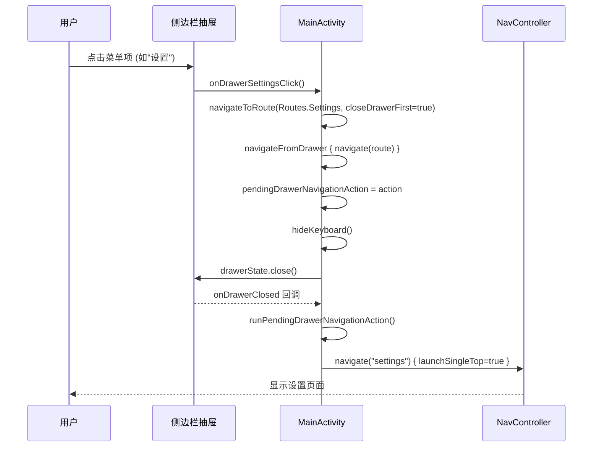
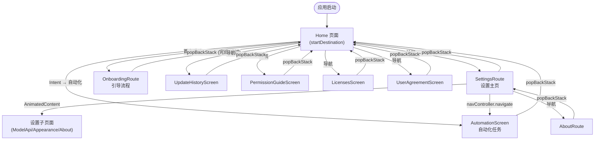

# 导航与路由系统

Aries-AI 的导航与路由系统基于 **Jetpack Compose Navigation** 构建，为多页面移动应用提供了清晰、类型安全的路由管理方案。该系统涵盖了从顶层页面跳转、抽屉式侧边栏导航、设置页内部子页面路由，到带参数的引导流程路由等完整的导航需求。

## 概述

Aries-AI 采用 **单 Activity + Compose Navigation** 架构，所有界面通过 `NavHost` 进行管理。导航系统的核心设计理念是：

- **类型安全**：使用 Kotlin `sealed class` 定义路由，避免字符串硬编码错误
- **声明式路由**：基于 Compose `NavHost` + `composable` 的声明式路由注册
- **分层导航**：顶层页面导航（NavHost）与页面内部子导航（AnimatedContent/状态驱动）分离
- **抽屉集成**：侧边栏抽屉导航与路由系统深度集成，支持「先关抽屉再跳转」的串联操作

### 核心组件关系

```mermaid
flowchart TD
    subgraph Definition["路由定义层"]
        Routes["Routes (sealed class)<br/>所有路由常量定义"]
    end

    subgraph Graph["导航图层"]
        NavGraph["AriesNavGraph<br/>NavHost + composable 映射"]
    end

    subgraph Orchestration["编排层"]
        MainActivity["MainActivity<br/>NavController 创建与生命周期管理"]
        NavState["navControllerState<br/>routeNavigationActionState"]
    end

    subgraph Drawer["抽屉导航"]
        Drawer["ConversationDrawer<br/>侧边栏"]
        DrawerNav["navigateFromDrawer<br/>pendingDrawerNavigationAction"]
    end

    subgraph Screens["屏幕层"]
        Home["HomeScreen"]
        Settings["SettingsRoute"]
        Automation["AutomationScreen"]
        Onboarding["OnboardingRoute"]
        About["AboutRoute"]
        Others["Licenses / UserAgreement<br/>PermissionGuide / UpdateHistory"]
    end

    MainActivity --> NavState
    MainActivity --> NavGraph
    NavState --> DrawerNav
    DrawerNav --> Drawer
    Routes --> NavGraph
    NavGraph --> Home
    NavGraph --> Settings
    NavGraph --> Automation
    NavGraph --> Onboarding
    NavGraph --> About
    NavGraph --> Others
    Settings -->|"内部子页面路由<br/>SettingsPage + AnimatedContent"| SettingsSub["ModelApi / Appearance<br/>Membership / About"]
```

> 上图展示了导航系统的四层架构：路由定义层提供类型安全的路由常量；导航图层将路由映射为 Composable 屏幕；编排层负责 NavController 的生命周期和全局导航状态；抽屉导航则处理从侧边栏发起的导航请求。

## 路由定义

所有路由通过 `Routes` sealed class 统一定义，每个页面路由都是一个 `data object`，继承自 `Routes` 基类。

> Source: [Routes.kt](https://github.com/ZG0704666/Aries-AI/blob/main/app/src/main/java/com/ai/phoneagent/navigation/Routes.kt)

```kotlin
sealed class Routes(val route: String) {
    data object Home : Routes("home")
    data object Settings : Routes("settings")
    data object About : Routes("about")
    data object UserAgreement : Routes("userAgreement")
    data object Licenses : Routes("licenses")
    data object Automation : Routes("automation")
    data object UpdateHistory : Routes("updateHistory")
    data object PermissionGuide : Routes("permissionGuide")
    data object Onboarding : Routes("onboarding") {
        const val FLOW_ARG = "flow"
        const val FLOW_ONBOARDING = "onboarding"
        const val FLOW_VIEW_ONLY = "view_only"
        const val FLOW_PERMISSION_ONLY = "permission_only"

        val routeWithOptionalFlow: String = "$route?$FLOW_ARG={$FLOW_ARG}"

        fun withFlow(flow: String): String = "$route?$FLOW_ARG=$flow"
    }
}
```

> Source: [Routes.kt](https://github.com/ZG0704666/Aries-AI/blob/main/app/src/main/java/com/ai/phoneagent/navigation/Routes.kt#L3-L21)

### 设计意图

使用 `sealed class` + `data object` 模式而非传统字符串常量有以下优势：

1. **编译期安全**：在 `when` 表达式和路由比较中，编译器可以检查是否覆盖了所有路由分支
2. **单一路由来源**：所有路由字符串仅定义在一处，避免多处散落导致的不一致
3. **参数化路由支持**：`Onboarding` 路由通过 `routeWithOptionalFlow` 支持可选导航参数，且参数名通过 `FLOW_ARG` 常量统一引用，避免魔术字符串

### 路由表

| 路由 | 路由字符串 | 屏幕组件 | 说明 |
|------|-----------|---------|------|
| `Routes.Home` | `"home"` | `HomeScreen` | 主页面，启动目的地 |
| `Routes.Settings` | `"settings"` | `SettingsRoute` | 设置页面（含内部子页面） |
| `Routes.About` | `"about"` | `AboutRoute` | 关于页面 |
| `Routes.Automation` | `"automation"` | `AutomationScreen` | 自动化任务页面 |
| `Routes.UpdateHistory` | `"updateHistory"` | `UpdateHistoryScreen` | 更新历史 |
| `Routes.PermissionGuide` | `"permissionGuide"` | `PermissionGuideScreen` | 权限引导 |
| `Routes.UserAgreement` | `"userAgreement"` | `UserAgreementScreen` | 用户协议 |
| `Routes.Licenses` | `"licenses"` | `LicensesScreen` | 开源许可 |
| `Routes.Onboarding` | `"onboarding"` / `"onboarding?flow={flow}"` | `OnboardingRoute` | 引导流程（支持参数） |

## 导航图（NavGraph）

`AriesNavGraph` 是整个应用导航的核心枢纽，它将所有路由注册到 `NavHost` 中，并处理系统返回键逻辑。

> Source: [AriesNavGraph.kt](https://github.com/ZG0704666/Aries-AI/blob/main/app/src/main/java/com/ai/phoneagent/navigation/AriesNavGraph.kt)

### 核心实现

```kotlin
@Composable
fun AriesNavGraph(
    navController: NavHostController,
    homeContent: @Composable () -> Unit,
) {
    val backStackEntry by navController.currentBackStackEntryAsState()
    val currentRoute = backStackEntry?.destination?.route
    var isRoutePopInFlight by remember(currentRoute) { mutableStateOf(false) }

    BackHandler(enabled = currentRoute != null && currentRoute != Routes.Home.route && !isRoutePopInFlight) {
        isRoutePopInFlight = true
        if (!navController.popBackStack()) {
            isRoutePopInFlight = false
        }
    }

    NavHost(
        navController = navController,
        startDestination = Routes.Home.route,
    ) {
        composable(Routes.Home.route) { homeContent() }
        composable(Routes.Settings.route) { SettingsRoute(navController = navController) }
        composable(Routes.About.route) { AboutRoute(navController = navController) }
        composable(Routes.Automation.route) { AutomationScreen(navController = navController) }
        composable(Routes.UpdateHistory.route) { UpdateHistoryScreen(navController = navController) }
        composable(Routes.PermissionGuide.route) { PermissionGuideScreen(navController = navController) }
        composable(Routes.UserAgreement.route) { UserAgreementScreen(navController = navController) }
        composable(Routes.Licenses.route) { LicensesScreen(navController = navController) }
        composable(Routes.Onboarding.route) {
            OnboardingRoute(navController = navController, flow = null)
        }
        composable(
            route = Routes.Onboarding.routeWithOptionalFlow,
            arguments = listOf(
                navArgument(Routes.Onboarding.FLOW_ARG) {
                    type = NavType.StringType
                    nullable = true
                    defaultValue = Routes.Onboarding.FLOW_ONBOARDING
                },
            ),
        ) { entry ->
            OnboardingRoute(
                navController = navController,
                flow = entry.arguments?.getString(Routes.Onboarding.FLOW_ARG),
            )
        }
    }
}
```

> Source: [AriesNavGraph.kt](https://github.com/ZG0704666/Aries-AI/blob/main/app/src/main/java/com/ai/phoneagent/navigation/AriesNavGraph.kt#L29-L79)

### 设计要点

**1. 启动目的地**
`startDestination = Routes.Home.route` — 应用默认以 Home 页面作为入口点。

**2. BackHandler 防抖保护**
`isRoutePopInFlight` 状态变量防止在 `popBackStack()` 异步执行期间重复触发返回操作。当当前路由已经是 Home 页面（栈底）时禁用 BackHandler，此时由系统处理返回键（退出应用）。

**3. 双重 Onboarding 路由注册**
引导页同时注册了无参数版本（`Routes.Onboarding.route`）和带可选参数版本（`Routes.Onboarding.routeWithOptionalFlow`），这是因为 Compose Navigation 的路由匹配是精确匹配。`flow` 参数支持三种模式：
- `onboarding`：完整引导流程
- `view_only`：仅查看模式
- `permission_only`：仅权限引导

## 导航编排层

`MainActivity` 是导航系统的编排中心。它负责创建 `NavController`、注册目的地变化监听、以及协调抽屉导航和直接路由导航。

> Source: [MainActivity.kt](https://github.com/ZG0704666/Aries-AI/blob/main/app/src/main/java/com/ai/phoneagent/MainActivity.kt)

### NavController 创建与生命周期

```kotlin
val navControllerState = mutableStateOf<NavHostController?>(null)
val routeNavigationActionState = mutableStateOf<((String) -> Unit)?>(null)

// 在 Composable 中：
val navController = rememberNavController()
DisposableEffect(navController) {
    val destinationListener =
        NavController.OnDestinationChangedListener { _, destination, _ ->
            if (destination.route == Routes.Home.route) {
                refreshAutomationCardsForCurrentConversation()
            } else {
                clearAutomationAutoConfirm()
            }
        }
    navController.addOnDestinationChangedListener(destinationListener)
    navControllerState.value = navController
    routeNavigationActionState.value = { route ->
        if (navController.currentDestination?.route != route) {
            navController.navigate(route) {
                launchSingleTop = true
            }
        }
    }
    onDispose {
        navController.removeOnDestinationChangedListener(destinationListener)
        if (navControllerState.value === navController) {
            navControllerState.value = null
        }
        routeNavigationActionState.value = null
    }
}
```

> Source: [MainActivity.kt](https://github.com/ZG0704666/Aries-AI/blob/main/app/src/main/java/com/ai/phoneagent/MainActivity.kt#L754-L779)

### 设计意图详解

**DestinationChangedListener**
当目的地切换到 Home 页面时，自动刷新自动化卡片；切换到其他页面时清除自动化自动确认状态。这种设计确保用户回到主页时看到的始终是最新的自动化任务状态。

**launchSingleTop**
所有导航均使用 `launchSingleTop = true`，防止在回退栈顶部创建同一目的地的多个实例，避免用户反复点击后需要多次返回。

**状态提升**
`navControllerState` 和 `routeNavigationActionState` 被提升为 Activity 级别的 mutableState，使得非 Composable 函数（如 `navigateToRoute`）也能发起导航操作。

### 路由导航方法

```kotlin
private fun navigateToRoute(route: String, closeDrawerFirst: Boolean = false) {
    val navigate = routeNavigationActionState.value ?: return
    if (closeDrawerFirst) {
        navigateFromDrawer {
            navigate(route)
        }
    } else {
        navigate(route)
    }
}
```

> Source: [MainActivity.kt](https://github.com/ZG0704666/Aries-AI/blob/main/app/src/main/java/com/ai/phoneagent/MainActivity.kt#L2546-L2555)

### 抽屉导航串联机制

当从抽屉菜单发起导航时，需要先关闭抽屉再执行路由跳转，以确保动画流畅。系统通过 `pendingDrawerNavigationAction` 实现这个串联流程：



> Source: [MainActivity.kt](https://github.com/ZG0704666/Aries-AI/blob/main/app/src/main/java/com/ai/phoneagent/MainActivity.kt#L2526-L2561)

**关键设计点**：
- `pendingDrawerNavigationAction` 作为待执行导航动作的暂存器，确保导航只在抽屉关闭后执行
- 如果抽屉已经关闭（`drawerState?.isOpen != true`），直接执行导航，无需等待
- 如果 `composeScopeHolder` 为空（异常情况），回退到无动画直接执行
- 如果引导覆盖层正在显示（`onboardingOverlay.isShowing()`），抽屉导航请求被忽略

## 设置页内部子页面路由

设置页面内部包含多个子页面（模型API配置、会员、外观、关于），这些子页面的切换不使用 NavHost，而是通过 `SettingsViewModel` 中的 `SettingsPage` 枚举状态驱动，配合 `AnimatedContent` 实现过渡动画。

### SettingsPage 枚举

```kotlin
enum class SettingsPage {
    Home,
    ModelApi,
    Membership,
    Appearance,
    About,
}
```

> Source: [SettingsViewModel.kt](https://github.com/ZG0704666/Aries-AI/blob/main/app/src/main/java/com/ai/phoneagent/viewmodel/SettingsViewModel.kt#L31-L37)

### 内部页面导航方法

```kotlin
var currentPage by mutableStateOf(SettingsPage.Home)
    private set

var pageTransitionForward by mutableStateOf(true)
    private set

fun openModelApiPage() {
    pageTransitionForward = true
    currentPage = SettingsPage.ModelApi
}

fun openHomePage() {
    pageTransitionForward = false
    currentPage = SettingsPage.Home
}

fun navigateTo(page: SettingsPage) {
    pageTransitionForward = page != SettingsPage.Home
    currentPage = page
}
```

> Source: [SettingsViewModel.kt](https://github.com/ZG0704666/Aries-AI/blob/main/app/src/main/java/com/ai/phoneagent/viewmodel/SettingsViewModel.kt#L223-L241)

### AnimatedContent 过渡

```kotlin
val isSubPage = viewModel.currentPage != SettingsViewModel.SettingsPage.Home
if (isSubPage) {
    BackHandler {
        viewModel.openHomePage()
    }
}

AnimatedContent(
    targetState = viewModel.currentPage,
    transitionSpec = {
        if (viewModel.pageTransitionForward) {
            slideInHorizontally(animationSpec = tween(260), initialOffsetX = { it })
                + fadeIn(animationSpec = tween(220)) togetherWith
            slideOutHorizontally(animationSpec = tween(260), targetOffsetX = { -it })
                + fadeOut(animationSpec = tween(220))
        } else {
            slideInHorizontally(animationSpec = tween(260), initialOffsetX = { -it })
                + fadeIn(animationSpec = tween(220)) togetherWith
            slideOutHorizontally(animationSpec = tween(260), targetOffsetX = { it })
                + fadeOut(animationSpec = tween(220))
        }
    },
    label = "settingsPageTransition",
) { page ->
    when (page) {
        SettingsViewModel.SettingsPage.Home -> { /* DrawerSettingsScreen */ }
        SettingsViewModel.SettingsPage.ModelApi -> { /* DrawerModelApiConfigScreen */ }
        SettingsViewModel.SettingsPage.Membership -> { /* MembershipScreen */ }
        SettingsViewModel.SettingsPage.Appearance -> { /* AppearanceScreen */ }
        SettingsViewModel.SettingsPage.About -> { /* SettingsAboutContent */ }
    }
}
```

> Source: [SettingsRoute.kt](https://github.com/ZG0704666/Aries-AI/blob/main/app/src/main/java/com/ai/phoneagent/ui/settings/SettingsRoute.kt#L100-L131)

### 设计意图

设置页内部不使用 Compose Navigation 的子图（nested navigation graph）而是采用状态驱动的方式，原因如下：

1. **更细粒度的动画控制**：`pageTransitionForward` 标志根据导航方向切换滑入/滑出方向（前进向右滑、后退向左滑），这在标准 NavHost 中需要额外配置
2. **避免回退栈膨胀**：设置页的子页面切换不会增加导航回退栈，按系统返回键直接从设置页回到主页
3. **简化跨层导航**：从设置子页面可以直接调用 `navController.navigate(Routes.Automation.route)` 跳转到自动化页面，无需处理嵌套图的回退栈问题

## 引导流程参数化路由

引导流程（Onboarding）支持通过导航参数控制不同的展示模式，这是通过 Compose Navigation 的可选参数机制实现的。

### 参数解析

```kotlin
private fun parseOnboardingFlowMode(flow: String?): OnboardingFlowMode = when (flow) {
    FLOW_VIEW_ONLY -> OnboardingFlowMode.VIEW_ONLY
    FLOW_PERMISSION_ONLY -> OnboardingFlowMode.PERMISSION_ONLY
    else -> OnboardingFlowMode.ONBOARDING
}

@Composable
fun OnboardingRoute(
    navController: NavController,
    flow: String?,
    appPreferencesRepository: AppPreferencesRepository = koinInject(),
) {
    OnboardingScreen(
        flowMode = parseOnboardingFlowMode(flow),
        appPreferencesRepository = appPreferencesRepository,
        onBack = { navController.popBackStack() },
        onDone = { navController.popBackStack() },
    )
}
```

> Source: [OnboardingScreen.kt](https://github.com/ZG0704666/Aries-AI/blob/main/app/src/main/java/com/ai/phoneagent/ui/onboarding/OnboardingScreen.kt#L111-L134)

### 路由注册

在 `AriesNavGraph` 中，Onboarding 注册了两个 composable 目标：
- **无参数版本**：`Routes.Onboarding.route`（即 `"onboarding"`），`flow` 为 `null`，默认走完整引导
- **带参数版本**：`Routes.Onboarding.routeWithOptionalFlow`（即 `"onboarding?flow={flow}"`），参数 `nullable = true`，默认值为 `FLOW_ONBOARDING`

这种双重注册确保了无论调用方使用哪种方式导航，都能正确匹配到对应的 composable。

## 核心导航流程



该流程展示了应用中所有可能的页面导航路径。实线箭头表示正向导航，虚线箭头表示返回操作。Home 页面是整个导航图的核心枢纽和栈底。

## 使用示例

### 基本导航

从代码中发起导航到指定路由：

```kotlin
// 直接导航
navigateToRoute(Routes.Settings.route)

// 先关闭抽屉再导航（从侧边栏菜单发起）
navigateToRoute(Routes.Settings.route, closeDrawerFirst = true)

// 导航到自动化页面（从设置页）
navController.navigate(Routes.Automation.route)
```

> Sources:
> - [MainActivity.kt](https://github.com/ZG0704666/Aries-AI/blob/main/app/src/main/java/com/ai/phoneagent/MainActivity.kt#L2546-L2555)
> - [SettingsRoute.kt](https://github.com/ZG0704666/Aries-AI/blob/main/app/src/main/java/com/ai/phoneagent/ui/settings/SettingsRoute.kt#L138)

### 带参数的引导流程导航

```kotlin
// 仅权限引导模式
navController.navigate(Routes.Onboarding.withFlow(Routes.Onboarding.FLOW_PERMISSION_ONLY))

// 仅查看模式
navController.navigate(Routes.Onboarding.withFlow(Routes.Onboarding.FLOW_VIEW_ONLY))
```

> Source: [Routes.kt](https://github.com/ZG0704666/Aries-AI/blob/main/app/src/main/java/com/ai/phoneagent/navigation/Routes.kt#L12-L20)

### 目的地变化监听

```kotlin
// 注册目的地变化监听（在 MainActivity 中自动完成）
navController.addOnDestinationChangedListener { _, destination, _ ->
    if (destination.route == Routes.Home.route) {
        refreshAutomationCardsForCurrentConversation()
    } else {
        clearAutomationAutoConfirm()
    }
}
```

> Source: [MainActivity.kt](https://github.com/ZG0704666/Aries-AI/blob/main/app/src/main/java/com/ai/phoneagent/MainActivity.kt#L756-L762)

### 设置页内部子页面导航

```kotlin
// 在 SettingsViewModel 中：
fun openModelApiPage() {
    pageTransitionForward = true
    currentPage = SettingsPage.ModelApi
}

fun openHomePage() {
    pageTransitionForward = false
    currentPage = SettingsPage.Home
}

// 从设置主页跳转到自动化页面（跨层导航）
onOpenAutomation = { navController.navigate(Routes.Automation.route) }
```

> Sources:
> - [SettingsViewModel.kt](https://github.com/ZG0704666/Aries-AI/blob/main/app/src/main/java/com/ai/phoneagent/viewmodel/SettingsViewModel.kt#L223-L241)
> - [SettingsRoute.kt](https://github.com/ZG0704666/Aries-AI/blob/main/app/src/main/java/com/ai/phoneagent/ui/settings/SettingsRoute.kt#L138)

## 配置选项

| 选项 | 类型 | 默认值 | 说明 |
|------|------|--------|------|
| `startDestination` | `String` | `Routes.Home.route` ("home") | NavHost 的启动目的地 |
| `FLOW_ONBOARDING` | `const String` | `"onboarding"` | 引导流程默认模式（完整引导） |
| `FLOW_VIEW_ONLY` | `const String` | `"view_only"` | 引导流程仅查看模式 |
| `FLOW_PERMISSION_ONLY` | `const String` | `"permission_only"` | 引导流程仅权限模式 |
| `launchSingleTop` | `Boolean` | `true` | 导航时是否复用栈顶已有实例 |

## API 参考

### `Routes` 路由定义

```kotlin
sealed class Routes(val route: String)
```

**子类：**
- `Routes.Home` — 路由字符串 `"home"`
- `Routes.Settings` — 路由字符串 `"settings"`
- `Routes.About` — 路由字符串 `"about"`
- `Routes.UserAgreement` — 路由字符串 `"userAgreement"`
- `Routes.Licenses` — 路由字符串 `"licenses"`
- `Routes.Automation` — 路由字符串 `"automation"`
- `Routes.UpdateHistory` — 路由字符串 `"updateHistory"`
- `Routes.PermissionGuide` — 路由字符串 `"permissionGuide"`
- `Routes.Onboarding` — 路由字符串 `"onboarding"`，支持可选参数 `flow`

### `Routes.Onboarding`

```kotlin
data object Onboarding : Routes("onboarding")
```

**常量：**
- `FLOW_ARG: String` — 参数名，值为 `"flow"`
- `FLOW_ONBOARDING: String` — 完整引导模式，值为 `"onboarding"`
- `FLOW_VIEW_ONLY: String` — 仅查看模式，值为 `"view_only"`
- `FLOW_PERMISSION_ONLY: String` — 仅权限模式，值为 `"permission_only"`

**属性：**
- `routeWithOptionalFlow: String` — 带可选参数的路由模板：`"onboarding?flow={flow}"`

**方法：**
- `fun withFlow(flow: String): String` — 构建带指定 flow 值的路由字符串

### `AriesNavGraph`

```kotlin
@Composable
fun AriesNavGraph(
    navController: NavHostController,
    homeContent: @Composable () -> Unit,
)
```

**参数：**
- `navController` (NavHostController)：导航控制器
- `homeContent` (@Composable () -> Unit)：Home 页面的 Composable 内容（由外部传入以共享状态）

**行为：**
- 设置启动目的地为 `Routes.Home.route`
- 为所有路由注册 composable 目标
- 在非 Home 页面处理系统返回键

### `navigateToRoute`

```kotlin
private fun navigateToRoute(route: String, closeDrawerFirst: Boolean = false)
```

> Source: [MainActivity.kt](https://github.com/ZG0704666/Aries-AI/blob/main/app/src/main/java/com/ai/phoneagent/MainActivity.kt#L2546-L2555)

**参数：**
- `route` (String)：目标路由字符串
- `closeDrawerFirst` (Boolean)：是否先关闭抽屉再导航，默认 `false`

**行为：**
- 若 `closeDrawerFirst = true`，将导航动作挂起到 `pendingDrawerNavigationAction`，待抽屉关闭后执行
- 否则直接执行导航，使用 `launchSingleTop = true`

### `navigateFromDrawer`

```kotlin
private fun navigateFromDrawer(action: () -> Unit)
```

> Source: [MainActivity.kt](https://github.com/ZG0704666/Aries-AI/blob/main/app/src/main/java/com/ai/phoneagent/MainActivity.kt#L2526-L2543)

**参数：**
- `action` (() -> Unit)：待执行的导航动作

**行为：**
- 如果引导覆盖层显示中，忽略导航
- 存储待执行动作到 `pendingDrawerNavigationAction`
- 隐藏键盘
- 如果抽屉已打开，关闭抽屉；否则直接执行动作

### `SettingsPage` 枚举

```kotlin
enum class SettingsPage {
    Home, ModelApi, Membership, Appearance, About
}
```

> Source: [SettingsViewModel.kt](https://github.com/ZG0704666/Aries-AI/blob/main/app/src/main/java/com/ai/phoneagent/viewmodel/SettingsViewModel.kt#L31-L37)

**值：**
- `Home` — 设置主页
- `ModelApi` — 模型API配置页
- `Membership` — 会员页面
- `Appearance` — 外观设置页
- `About` — 关于页面

### `SettingsViewModel` 导航方法

| 方法 | 说明 |
|------|------|
| `openModelApiPage()` | 前进到模型API页面 |
| `openMembershipPage()` | 前进到会员页面 |
| `openHomePage()` | 返回到设置主页 |
| `navigateTo(page: SettingsPage)` | 导航到指定设置子页面 |

> Source: [SettingsViewModel.kt](https://github.com/ZG0704666/Aries-AI/blob/main/app/src/main/java/com/ai/phoneagent/viewmodel/SettingsViewModel.kt#L223-L241)

## 相关链接

- [Routes.kt — 路由定义](https://github.com/ZG0704666/Aries-AI/blob/main/app/src/main/java/com/ai/phoneagent/navigation/Routes.kt)
- [AriesNavGraph.kt — 导航图](https://github.com/ZG0704666/Aries-AI/blob/main/app/src/main/java/com/ai/phoneagent/navigation/AriesNavGraph.kt)
- [MainActivity.kt — 导航编排层](https://github.com/ZG0704666/Aries-AI/blob/main/app/src/main/java/com/ai/phoneagent/MainActivity.kt)
- [SettingsRoute.kt — 设置页路由](https://github.com/ZG0704666/Aries-AI/blob/main/app/src/main/java/com/ai/phoneagent/ui/settings/SettingsRoute.kt)
- [SettingsViewModel.kt — 设置页 ViewModel](https://github.com/ZG0704666/Aries-AI/blob/main/app/src/main/java/com/ai/phoneagent/viewmodel/SettingsViewModel.kt)
- [OnboardingScreen.kt — 引导流程](https://github.com/ZG0704666/Aries-AI/blob/main/app/src/main/java/com/ai/phoneagent/ui/onboarding/OnboardingScreen.kt)
- [AutomationScreen.kt — 自动化页面](https://github.com/ZG0704666/Aries-AI/blob/main/app/src/main/java/com/ai/phoneagent/ui/automation/AutomationScreen.kt)
- [AboutRoute.kt — 关于页面](https://github.com/ZG0704666/Aries-AI/blob/main/app/src/main/java/com/ai/phoneagent/ui/settings/AboutRoute.kt)
