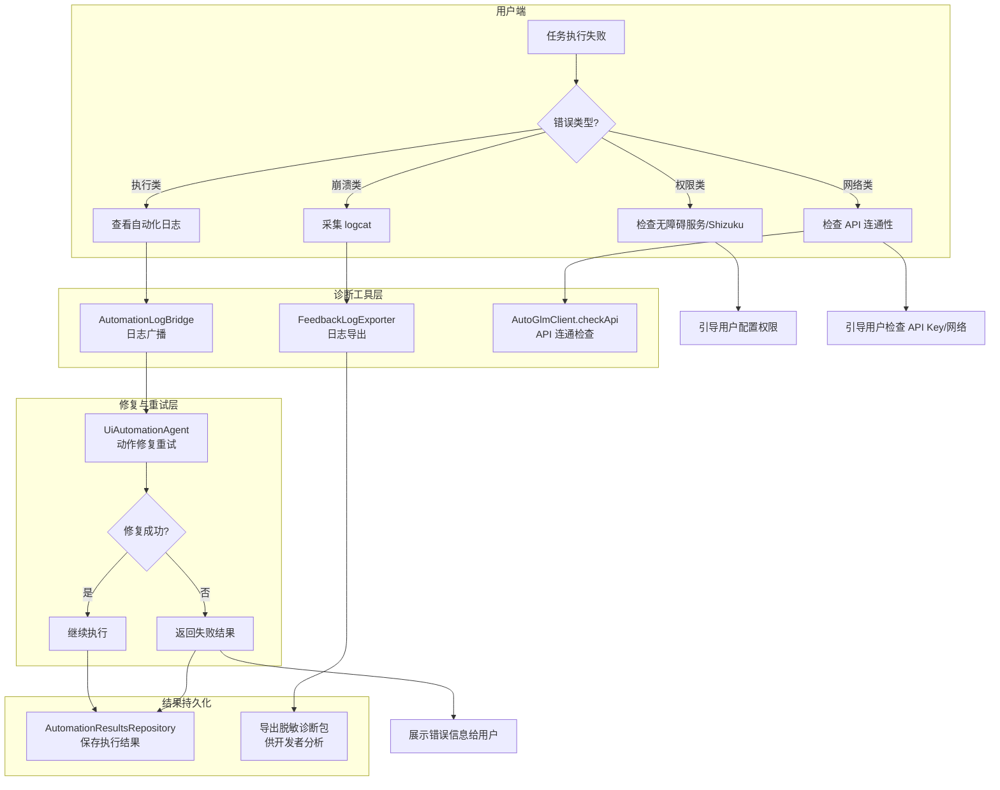
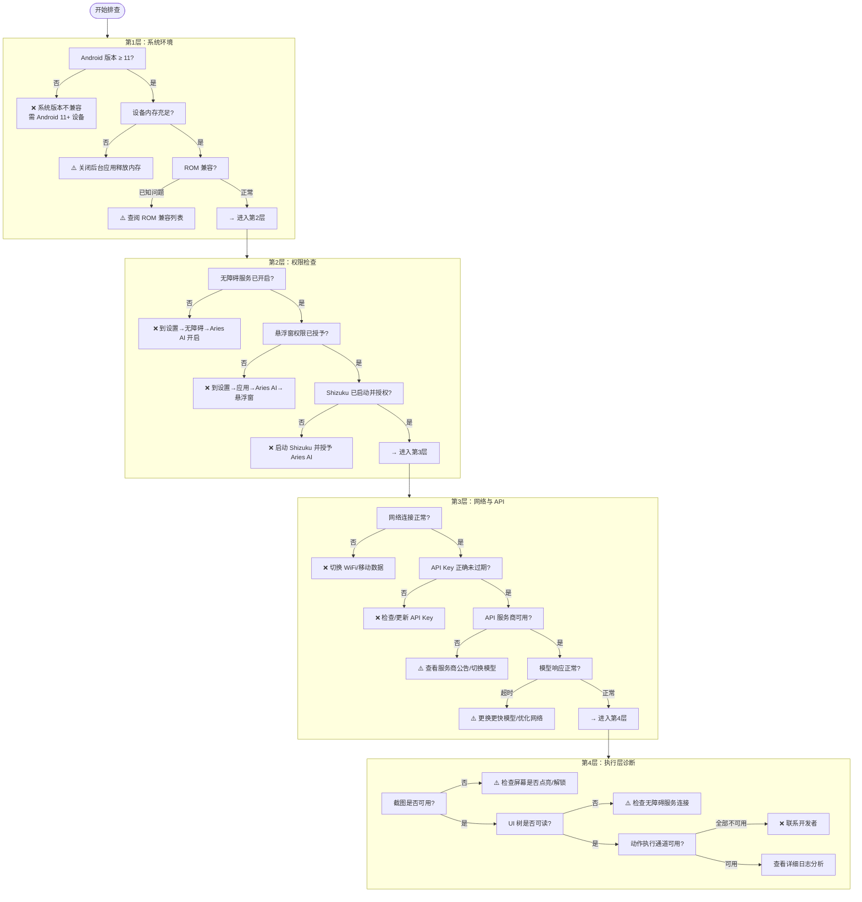
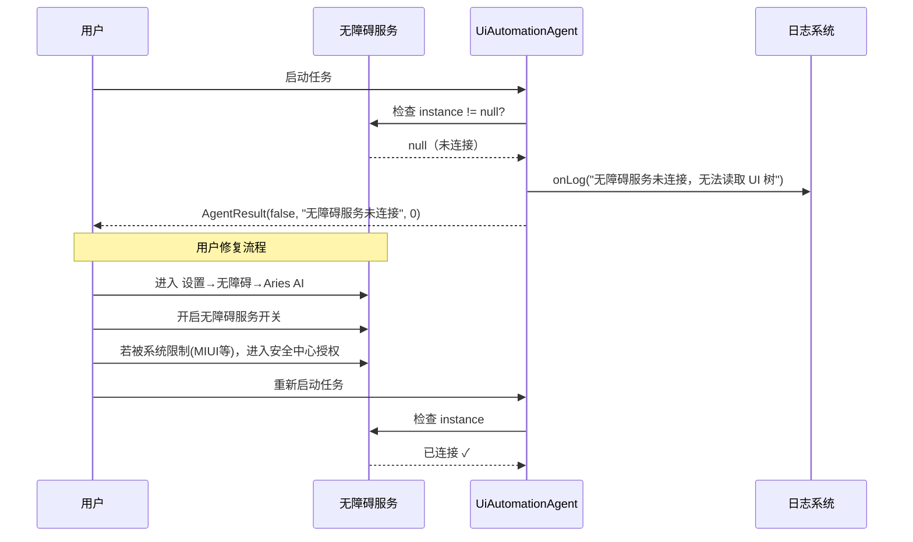
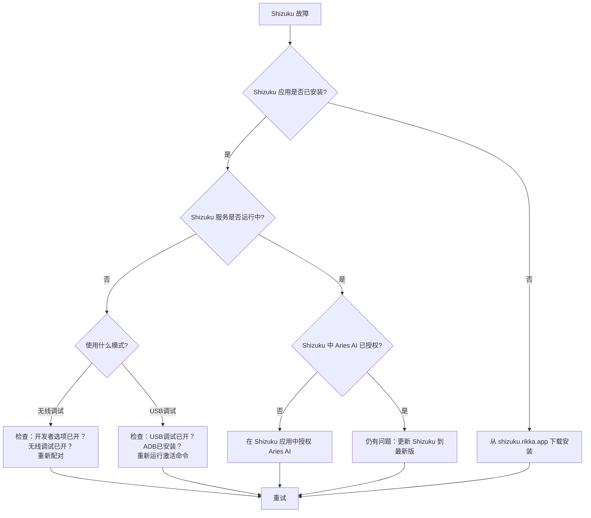
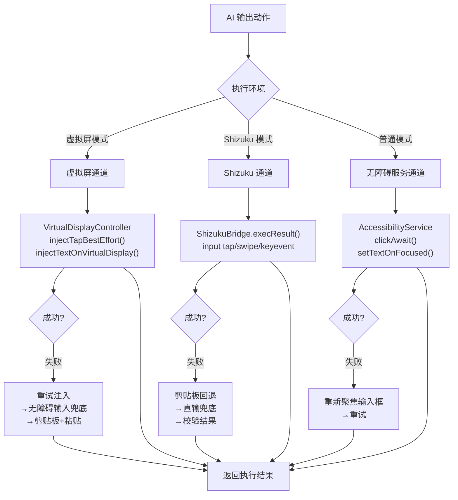

# 故障排查指南

> 本文档为 Aries AI 用户和开发者提供系统化的故障排查流程、诊断工具使用说明，以及常见问题的深度解决方案。当你遇到任务执行失败、应用闪退、虚拟屏黑屏等问题时，请参考本指南。

---

## 概述

Aries AI 是一个多层架构的 Android AI 自动化引擎，其正常运转依赖于多个组件协同工作：**无障碍服务**（UI 树读取与截图）、**Shizuku**（系统级权限与虚拟屏）、**大模型 API**（决策推理）、**ActionExecutor**（动作执行）。当任一环节出现异常时，会导致任务失败。

本指南从以下维度组织故障排查内容：

- **诊断工具**：日志导出、API 健康检查、执行结果回溯
- **分层排查**：按系统层 → 权限层 → 网络层 → 执行层的顺序逐级排查
- **核心组件故障**：针对无障碍服务、Shizuku、虚拟屏、API、动作执行等组件的专项排查
- **常见问题速查**：快速定位典型症状的解决方案

---

## 故障排查架构

Aries AI 在架构上提供了多层诊断能力。下图展示了故障发生后，从日志采集到用户反馈的完整排查链路：



### 诊断工具说明

| 工具/组件 | 用途 | 关键文件 |
|-----------|------|----------|
| **AutomationLogBridge** | 将自动化执行日志通过广播发送到主界面，实时展示每步操作 | [AutomationLogBridge.kt](https://github.com/ZG0704666/Aries-AI/blob/main/app/src/main/java/com/ai/phoneagent/core/automation/AutomationLogBridge.kt) |
| **FeedbackLogExporter** | 导出脱敏后的诊断包（含 metadata、最近执行结果、进程 logcat），自动脱敏邮箱/手机号/Token | [FeedbackLogExporter.kt](https://github.com/ZG0704666/Aries-AI/blob/main/app/src/main/java/com/ai/phoneagent/helper/FeedbackLogExporter.kt) |
| **AutomationResultsRepository** | 持久化最近一次任务的结果（成功/失败、步数、日志），供诊断和导出使用 | [AutomationResultsRepository.kt](https://github.com/ZG0704666/Aries-AI/blob/main/app/src/main/java/com/ai/phoneagent/data/preferences/AutomationResultsRepository.kt) |
| **AutoGlmClient.checkApi** | API 连通性快速检查，返回详细错误信息 | [AutoGlmClient.kt](https://github.com/ZG0704666/Aries-AI/blob/main/app/src/main/java/com/ai/phoneagent/net/AutoGlmClient.kt) |

---

## 分层排查流程

当任务执行出现问题时，请按照以下顺序逐层排查。每一层都可能包含多个检查点。这个流程的设计意图是：**从底层系统能力向上逐级验证，确保排查的高效性和准确性**。



---

## 核心组件故障排查

### 1. 无障碍服务故障

无障碍服务是 Aries AI 的核心依赖，负责屏幕截图和 UI 树读取。

**常见症状：**
- 任务无法启动，提示"无障碍服务未连接"
- 截图获取失败
- UI 树返回为空

**排查步骤：**



**关键代码——Agent 中的无障碍服务检查：**

```kotlin
// 无障碍服务断开时，Agent 会立即抛出异常终止任务
val rawUiDump = if (config.useBackgroundVirtualDisplay && ...) {
    "[虚拟屏模式-纯视觉驱动]"
} else if (config.useShizukuInteraction) {
    // Shizuku 模式走不同通道
} else {
    service?.dumpUiTreeWithRetry(maxNodes = config.uiTreeMaxNodes)
        ?: throw IllegalStateException("无障碍服务未连接，无法读取 UI 树")
}
```

> Source: [UiAutomationAgent.kt](https://github.com/ZG0704666/Aries-AI/blob/main/app/src/main/java/com/ai/phoneagent/UiAutomationAgent.kt#L260-L274)

**解决方案：**

1. **检查系统权限**：进入 `设置 → 无障碍 → 已下载的应用 → Aries AI`，确保开关已打开
2. **ROM 特殊处理**：MIUI 用户需进入 `安全中心 → 权限管理 → 允许 Aries AI 自启动和后台运行`；ColorOS/OneUI 用户类似
3. **强制重启**：在 `设置 → 应用管理 → Aries AI` 中先强制停止，再重新打开授权
4. **重启设备**：如果以上均无效，重启设备后重试

---

### 2. Shizuku 故障

Shizuku 为虚拟屏功能提供系统级权限，是后台自动化的基础。

**常见症状：**
- 虚拟屏无法创建（`displayId = null`）
- 日志提示 "Shizuku binder not ready"
- 日志提示 "Shizuku permission not granted"

**核心代码——Shizuku 状态检查与错误处理：**

```kotlin
// VirtualDisplayController 中的 Shizuku 可用性检查
if (!ShizukuBridge.pingBinder()) {
    Log.e(TAG, "Shizuku binder not ready - please start Shizuku app first")
    activeDisplayId = null
    return null
}
if (!ShizukuBridge.hasPermission()) {
    Log.e(TAG, "Shizuku permission not granted - please grant permission in Shizuku app")
    activeDisplayId = null
    return null
}
```

> Source: [VirtualDisplayController.kt](https://github.com/ZG0704666/Aries-AI/blob/main/app/src/main/java/com/ai/phoneagent/VirtualDisplayController.kt#L106-L114)

**Shizuku 故障排查流程：**



---

### 3. 虚拟屏故障

虚拟屏技术是 Aries AI 的核心差异化能力。虚拟屏黑屏或创建失败是最常见的深度故障。

**故障分类与诊断：**

| 故障类型 | 日志关键词 | 根因 | 解决方案 |
|----------|-----------|------|----------|
| Shizuku 未就绪 | `Shizuku binder not ready` | Shizuku 未启动 | 启动 Shizuku 应用 |
| 权限未授予 | `Shizuku permission not granted` | 未在 Shizuku 中授权 | 在 Shizuku 中授权 Aries AI |
| 虚拟屏创建失败 | `ensureStarted failed` | 系统/ROM 兼容性 | 尝试主屏模式 |
| 截图不可用 | `虚拟屏截图不可用` | 目标应用未正确启动 | 重启任务 |
| 虚拟屏黑屏 | 无明确错误日志 | 应用启动慢或焦点丢失 | 等待3-5秒或重启任务 |

**虚拟屏创建失败的完整处理链路：**

```kotlin
// UiAutomationAgent.run() 中的虚拟屏处理逻辑
if (config.useBackgroundVirtualDisplay) {
    onLog("【虚拟屏模式】正在准备后台虚拟屏...")
    val displayId = VirtualDisplayController.prepareForTask(context, "")
    if (displayId != null && displayId > 0) {
        onLog("【虚拟屏模式】虚拟屏已准备就绪，displayId=$displayId")
        // 成功：更新屏幕尺寸
    } else {
        // 虚拟屏创建失败，直接报错退出，不降级到主屏幕
        onLog("【虚拟屏模式】虚拟屏准备失败：Shizuku 未授权或创建失败")
        return AgentResult(false, "虚拟屏模式启动失败：请确保已安装 Shizuku 并授予权限", 0)
    }
}
```

> Source: [UiAutomationAgent.kt](https://github.com/ZG0704666/Aries-AI/blob/main/app/src/main/java/com/ai/phoneagent/UiAutomationAgent.kt#L131-L148)

**设计意图**：虚拟屏创建失败时，Agent 选择**直接报错退出**而非降级到主屏模式。这是有意为之——如果用户明确选择了后台虚拟屏模式但虚拟屏不可用，在主屏继续执行会占用用户前台屏幕，造成意外干扰。

---

### 4. API 调用故障

API 调用是连接大模型的关键环节。Aries AI 内置了完善的错误分类和重试机制。

**错误分类与重试策略：**

```kotlin
// ActionUtils 中的错误可重试性判断
fun isRetryableModelError(t: Throwable?): Boolean {
    if (t == null) return false
    if (t is CancellationException) return false           // 用户取消，不重试
    if (t is AutoGlmClient.ApiException) {
        if (t.code == 429) return true                     // 限流，可重试
        if (t.code in 500..599) return true                // 服务端错误，可重试
        return false                                        // 4xx 客户端错误，不重试
    }
    return t is IOException                                 // 网络 IO 错误，可重试
}
```

> Source: [ActionUtils.kt](https://github.com/ZG0704666/Aries-AI/blob/main/app/src/main/java/com/ai/phoneagent/core/utils/ActionUtils.kt#L115-L124)

**模型请求重试机制：**

```kotlin
// UiAutomationAgent 中的带重试模型请求
private suspend fun requestModelWithRetry(...): Result<String> {
    val maxAttempts = (config.maxModelRetries + 1).coerceAtLeast(1)
    var lastErr: Throwable? = null

    for (attempt in 0 until maxAttempts) {
        val result = withContext(Dispatchers.IO) {
            AutoGlmClient.sendChatResult(apiKey, baseUrl, messages, model, ...)
        }
        if (result.isSuccess) return result

        val err = result.exceptionOrNull()
        if (err is CancellationException) throw err
        lastErr = err

        val retryable = ActionUtils.isRetryableModelError(err)
        if (!retryable || attempt >= maxAttempts - 1) break

        val waitMs = ActionUtils.computeModelRetryDelayMs(attempt, config.modelRetryBaseDelayMs)
        onLog("[Step $step] $purpose 失败：${err?.message}（${attempt+1}/$maxAttempts），${waitMs}ms 后重试…")
        delay(waitMs)
    }
    return Result.failure(lastErr ?: IOException("Unknown model error"))
}
```

> Source: [UiAutomationAgent.kt](https://github.com/ZG0704666/Aries-AI/blob/main/app/src/main/java/com/ai/phoneagent/UiAutomationAgent.kt#L1136-L1196)

**API 故障排查速查表：**

| HTTP 状态码 | 含义 | 是否重试 | 用户操作 |
|-------------|------|----------|----------|
| 401 | API Key 无效 | 否 | 检查/更新 API Key |
| 403 | 无权访问模型 | 否 | 检查 API Key 权限范围 |
| 429 | 速率限制 | 是（指数退避） | 稍等后重试，或降低任务频率 |
| 5xx | 服务端错误 | 是（指数退避） | 等待服务恢复，或切换服务商 |
| 超时 | 网络/服务端慢 | 是 | 切换更快模型或优化网络 |

**重试延迟计算——指数退避策略：**

```kotlin
fun computeModelRetryDelayMs(attempt: Int, baseDelayMs: Long): Long {
    val base = baseDelayMs.coerceAtLeast(0L)
    val mult = 1L shl attempt.coerceIn(0, 6)  // 指数增长：1, 2, 4, 8...
    return (base * mult).coerceAtMost(6000L)    // 上限 6s
}
```

> Source: [ActionUtils.kt](https://github.com/ZG0704666/Aries-AI/blob/main/app/src/main/java/com/ai/phoneagent/core/utils/ActionUtils.kt#L38-L42)

---

### 5. 动作执行故障

动作执行器（ActionExecutor）采用多通道策略，确保在各类环境下都能最大可能完成操作。

**三通道执行策略：**



**设计意图**：ActionExecutor 的"通道 + 兜底"策略保证了在虚拟屏、Shizuku、无障碍服务三种差异化环境中都能尽力完成操作。例如，虚拟屏下文本输入失败的兜底链路为：`injectTextOnVirtualDisplay → 重试注入 → 无障碍输入兜底 → 提示模型改用 Tap 键盘逐字输入`。

**执行失败时的动作修复机制：**

Agent 在动作执行失败后，不会立即终止任务，而是会触发模型修复流程。修复流程会构造专门的修复提示（repair prompt），让模型基于失败上下文重新规划动作：

```kotlin
// 动作执行失败 → 修复流程
if (execOk) break  // 成功则跳出

if (repairAttempt >= config.maxActionRepairs) {
    return AgentResult(false, "动作执行失败：${currentAction.raw}", step)
}

repairAttempt++
onLog("[Step $step] 动作执行失败，尝试让模型修复（$repairAttempt/${config.maxActionRepairs})…")

// 构建修复消息并重新请求模型
val failMsg = PromptTemplates.buildActionRepairPrompt(currentAction.raw, enforceDesc)
history += ChatRequestMessage(role = "user", content = failMsg)
val fixResult = requestModelWithRetry(apiKey, baseUrl, model, messages = history, ...)
```

> Source: [UiAutomationAgent.kt](https://github.com/ZG0704666/Aries-AI/blob/main/app/src/main/java/com/ai/phoneagent/UiAutomationAgent.kt#L543-L627)

---

## 诊断工具使用指南

### 日志导出（FeedbackLogExporter）

当需要向开发者反馈问题时，使用内置的日志导出功能可以生成包含关键诊断信息的脱敏压缩包。

**导出内容：**
| 文件 | 内容 |
|------|------|
| `metadata.txt` | 设备型号、Android 版本、应用版本、配置项（虚拟屏/Shizuku/自动审批开关状态） |
| `automation_last_result.txt` | 最近一次任务的成功/失败状态、步数、完整日志 |
| `logcat_current_process.txt` | 当前进程的 logcat 输出（自动过滤敏感信息） |

**敏感信息自动脱敏：**
导出功能会自动识别并脱敏以下内容，确保安全分享：
- 邮箱地址 → `j***e@example.com`
- 手机号码 → `138****1234`
- API Token/Bearer → `abc***xy`
- Authorization/Cookie 等 Header 密钥 → `***`

```kotlin
// FeedbackLogExporter 的敏感信息脱敏正则
private val bearerRegex = Regex("""(?i)(bearer\s+)([A-Za-z0-9._\-+/=]+)""")
private val headerSecretRegex = Regex(
    """(?im)\b(authorization|cookie|set-cookie|x-api-key|api-key|token|
        access-token|refresh-token|password|secret)\b\s*[:=]\s*([^\r\n]+)""",
)
private val querySecretRegex = Regex(
    """(?i)([?&](?:token|access_token|refresh_token|api_key|apikey|
        secret|password)=)([^&\s]+)""",
)
```

> Source: [FeedbackLogExporter.kt](https://github.com/ZG0704666/Aries-AI/blob/main/app/src/main/java/com/ai/phoneagent/helper/FeedbackLogExporter.kt#L23-L34)

### 实时日志监控

Agent 执行过程中，每一步都会产生详细的日志输出，通过 `AutomationLogBridge` 广播到主界面：

```kotlin
object AutomationLogBridge {
    const val ACTION_AUTOMATION_LOG = "com.ai.phoneagent.action.AUTOMATION_LOG"

    fun publish(context: Context, line: String) {
        val normalized = line.trim()
        if (normalized.isBlank()) return
        val intent = Intent(ACTION_AUTOMATION_LOG).apply {
            setPackage(context.packageName)
            putExtra("automation_log_line", normalized)
        }
        context.sendBroadcast(intent)
    }
}
```

> Source: [AutomationLogBridge.kt](https://github.com/ZG0704666/Aries-AI/blob/main/app/src/main/java/com/ai/phoneagent/core/automation/AutomationLogBridge.kt#L6-L24)

**关键日志模式对照：**

| 日志模式 | 含义 | 处理建议 |
|----------|------|----------|
| `【虚拟屏模式】正在准备后台虚拟屏...` | 虚拟屏创建流程开始 | 正常 |
| `Shizuku binder not ready` | Shizuku 未启动 | 启动 Shizuku 应用 |
| `Shizuku permission not granted` | 权限未授予 | 在 Shizuku 中授权 |
| `[Step N] 请求模型…` | 向大模型发起 API 请求 | 正常 |
| `[Step N] 执行操作: 点击(N,M)` | 执行点击动作 | 正常 |
| `Shizuku 点击失败: exitCode=X` | Shizuku 点击命令失败 | 检查 Shizuku 状态 |
| `虚拟屏输入失败` | 虚拟屏文本注入未成功 | 会自动触发重试/兜底 |
| `动作执行失败，尝试让模型修复` | 触发动作修复流程 | 自动处理 |
| `达到最大步数限制` | 任务步数超出上限 | 简化任务或增大 maxSteps |

---

## 常见问题速查

### 问题一：应用闪退

**症状**：Aries AI 在使用过程中突然崩溃退出。

**排查步骤**：

1. **获取崩溃日志**：
   ```bash
   adb logcat -d | grep -E "AndroidRuntime|FATAL|AriesAgentApp|FloatingChatService"
   ```
2. **清除缓存**：进入 `设置 → 应用管理 → Aries AI` → 清除缓存和数据
3. **重新安装**：卸载后从 [GitHub Releases](https://github.com/ZG0704666/Aries-AI/releases) 下载最新版本
4. **检查兼容性**：确保 Android ≥ 11，建议 Android 12+；确保设备 RAM ≥ 4GB

### 问题二：虚拟屏黑屏

**症状**：虚拟屏预览窗口一直显示黑屏，没有应用画面。

**排查要点**（按优先级排序）：

1. 等待 3-5 秒——应用启动需要时间
2. 检查 Shizuku 状态是否正常
3. 如果是特定应用黑屏，可能是该应用不支持虚拟屏（某些银行/支付类应用有反虚拟屏检测）
4. 尝试切换到主屏模式执行

### 问题三：API 调用持续失败

**症状**：每次模型请求都返回错误。

**排查步骤**：

1. 验证 API Key 是否正确且未过期
2. 使用 `adb logcat -s AriesAgentApp` 查看具体错误码
   - `HTTP 401`：API Key 无效
   - `HTTP 429`：请求过于频繁，稍后重试
   - `HTTP 5xx`：服务商故障，等待恢复或切换
3. 检查 API 配额是否已用完
4. 尝试切换网络（WiFi ↔ 移动数据）

### 问题四：键盘输入失败

**症状**：AI 尝试在应用中输入文字但失败，或输入框中没有出现文字。

**设计背景**：虚拟屏下文本输入采用"剪贴板 + 粘贴"策略，而非直接键盘模拟。这是因为虚拟屏禁用了 IME 渲染以防止键盘焦点死锁。

**排查点**：
- 日志中 `[Type][Shizuku]` 相关行会详细展示输入策略的每一步（`clipboard_first → paste → direct_input → fallback`）
- 如果日志出现 `Type中文失败：下一步不要再输出Type，请直接Tap软键盘上的目标字键`，说明当前模型应改为逐键点击方式输入

---

## 配置选项参考

以下是与故障排查相关的关键配置参数，适当调整这些参数可以提升稳定性或改变重试行为：

| 参数 | 类型 | 默认值 | 说明 | 故障排查用途 |
|------|------|--------|------|-------------|
| `maxSteps` | Int | 100 | 最大执行步数 | 如果任务总是超步数失败，检查是否陷入循环 |
| `maxModelRetries` | Int | 3 | 模型请求最大重试次数 | 网络不稳定时可增大 |
| `modelRetryBaseDelayMs` | Long | 700 | 重试基础延迟(ms)，支持指数退避 | 配合 maxModelRetries 使用 |
| `maxParseRepairs` | Int | 2 | 输出解析修复最大次数 | 模型输出格式不稳定时可增大 |
| `maxActionRepairs` | Int | 1 | 动作执行修复最大次数 | 可增大来提升执行成功率，但会增加耗时 |
| `stepDelayMs` | Long | 160 | 每步之间基础延迟(ms) | 增加可减少因 UI 未刷新导致的误判 |
| `screenshotCompressionQuality` | Int | 85 | 截图压缩质量(0-100) | 降低可减少 API 数据传输量 |
| `enableScreenshotCache` | Boolean | true | 是否启用截图缓存 | 开启可减少重复截图 |
| `useStreamingWithEarlyStop` | Boolean | true | 流式输出+早停 | 开启可降低延迟 |

> Source: [AgentConfiguration.kt](https://github.com/ZG0704666/Aries-AI/blob/main/app/src/main/java/com/ai/phoneagent/core/config/AgentConfiguration.kt)

---

## API 连通性检查

Aries AI 提供了 API 连通性检查接口，可以在设置界面或通过代码快速验证 API 是否可用：

```kotlin
// AutoGlmClient 的 API 检查方法
suspend fun checkApiDetailed(
    apiKey: String,
    baseUrl: String = DEFAULT_BASE_URL,
    model: String = DEFAULT_MODEL,
): ApiCheckResult

data class ApiCheckResult(
    val ok: Boolean,
    val statusCode: Int? = null,
    val message: String? = null,
)
```

> Source: [AutoGlmClient.kt](https://github.com/ZG0704666/Aries-AI/blob/main/app/src/main/java/com/ai/phoneagent/net/AutoGlmClient.kt#L361-L451)

当 `ok = false` 时，`message` 会包含具体的错误原因，如：
- `HTTP 401`：API Key 无效
- `"Insufficient quota"`：配额不足
- `"Invalid model"`：模型名称错误
- `"Network request failed"`：网络不通

---

## 反馈问题模板

向开发者反馈问题时，请通过 **FeedbackLogExporter** 导出诊断包，并附上以下信息：

```markdown
### 设备信息
- 设备型号：例如 Xiaomi 14
- Android 版本：例如 Android 14 (SDK 34)
- ROM 版本：例如 HyperOS 1.0.5.0

### 应用信息
- Aries AI 版本：例如 v1.4.3-beta
- Shizuku 版本：例如 13.5.4

### 问题描述
- 详细描述问题现象
- 复现步骤
- 预期行为 vs 实际行为

### 附加信息
- 使用的模型：例如 glm-4.6v-flash
- 任务描述：例如"在美团搜索附近的火锅店"
- 已尝试的解决方案
```

---

## 相关链接

- [FAQ 常见问题解答](https://github.com/ZG0704666/Aries-AI/blob/main/docs/FAQ.md) — 用户常见问题汇总
- [技术概述文档](https://github.com/ZG0704666/Aries-AI/blob/main/docs/TECHNICAL_OVERVIEW.md) — 核心技术实现详解
- [构建指南](https://github.com/ZG0704666/Aries-AI/blob/main/docs/BUILDING.md) — 开发者环境配置
- [Git 工作流](https://github.com/ZG0704666/Aries-AI/blob/main/docs/GIT_WORKFLOW.md) — 贡献代码流程
- [GitHub Issues](https://github.com/ZG0704666/Aries-AI/issues) — 提交 Bug 报告
- [GitHub Discussions](https://github.com/ZG0704666/Aries-AI/discussions) — 社区讨论
- [Shizuku 官方文档](https://shizuku.rikka.app/zh-hans/) — Shizuku 安装与配置
- [智谱开放平台](https://open.bigmodel.cn/) — 获取 GLM API Key
- [QQ 群：746439473](http://qm.qq.com/cgi-bin/qm/qr?_wv=1027&k=&authKey=&noverify=0&group_code=746439473) — 社区交流

---

**文档版本**：v1.0  
**最后更新**：2026-04-09  
**维护人**：ZG0704666

---

<div align="center">

**遇到本文档未覆盖的问题？欢迎加入 QQ 群 746439473 或通过 GitHub Issues 反馈！**

</div>
