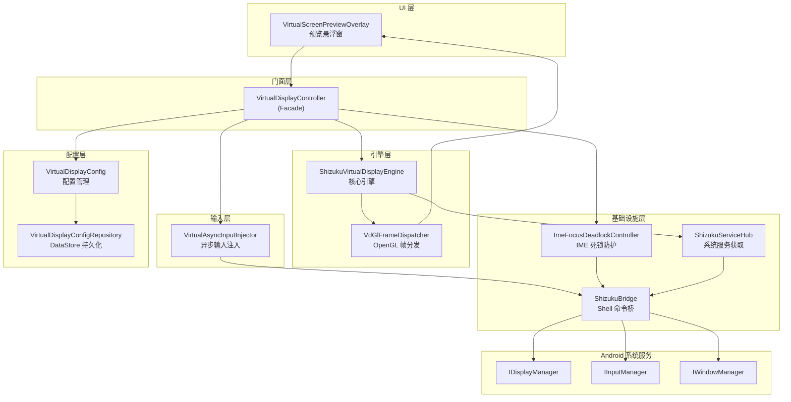
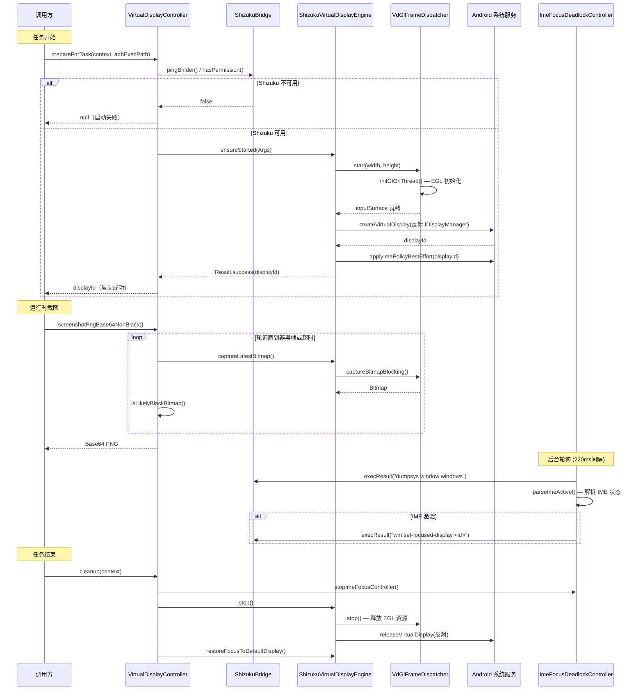

# 虚拟屏调试提示

虚拟屏（VirtualDisplay）是 Aries AI 的核心隔离技术。本文档汇总了虚拟屏模块的调试方法、日志体系、常见故障排查步骤及诊断技巧，帮助开发者和用户在遇到虚拟屏相关问题时快速定位根因。

---

## 概述

Aries AI 的虚拟屏系统通过 Shizuku 获取系统级权限，利用 Android 隐藏 API 创建独立的 `VirtualDisplay`，实现主屏与自动化操作的完全隔离。虚拟屏的调试涉及以下层面：

| 层级 | 组件 | 职责 |
|------|------|------|
| 统一入口 | `VirtualDisplayController` | 虚拟屏生命周期管理、模式切换 |
| 核心引擎 | `ShizukuVirtualDisplayEngine` | 反射调用 IDisplayManager 创建/销毁 VirtualDisplay |
| OpenGL 分发 | `VdGlFrameDispatcher` | GL 线程接收帧并同时分发到截图与预览通道 |
| 输入注入 | `VirtualAsyncInputInjector` | 通过 IInputManager 向指定 display 注入触摸和按键事件 |
| 焦点防护 | `ImeFocusDeadlockController` | 轮询检测 IME 死锁并自动恢复 |
| 预览浮窗 | `VirtualScreenPreviewOverlay` | TextureView 直出预览 + 触摸注入 |
| 系统服务 | `ShizukuServiceHub` | 通过 Shizuku 代理获取 DisplayManager/InputManager/WindowManager |
| 配置持久化 | `VirtualDisplayConfig` / `VirtualDisplayConfigRepository` | 分辨率预设、DPI 等持久化存储 |

---

## 架构图

以下 Mermaid 图展示了虚拟屏系统的整体架构与组件依赖关系：



**架构说明**：

- `VirtualDisplayController` 作为统一门面（Facade），所有外部调用（UI、Python 侧）均通过它进行，避免直接操作底层引擎。
- `ShizukuVirtualDisplayEngine` 通过 `ShizukuServiceHub` 获取经过 Shizuku 提权的系统服务代理，进而反射调用 Android 隐藏 API。
- `VdGlFrameDispatcher` 在独立 GL 线程中运行，将 VirtualDisplay 输出到 `SurfaceTexture`（中转），然后同时渲染到离屏 `ImageReader`（截图）和可选预览 `Surface`（悬浮窗）。
- `VirtualAsyncInputInjector` 通过 `ShizukuBinderWrapper` 包装 input service binder，以系统权限向指定 display 注入事件。
- `ImeFocusDeadlockController` 独立轮询 `dumpsys window windows`，检测 IME 是否激活并触发强制锁焦。

---

## 日志调试

### 日志 TAG 速查表

虚拟屏系统使用以下 TAG 输出日志，可通过 `adb logcat` 按 TAG 过滤：

| TAG | 源文件 | 用途 |
|-----|--------|------|
| `AriesVirtualDisplay` | `VirtualDisplayController.kt` | 虚拟屏生命周期、截图、输入注入入口 |
| `AriesVdIsoEngine` | `ShizukuVirtualDisplayEngine.kt` | 引擎启停、VirtualDisplay 创建/销毁、Surface 切换 |
| `AriesVdIsoServices` | `ShizukuServiceHub.kt` | 系统服务获取 |
| `AriesImeFocusLock` | `ImeFocusDeadlockController.kt` | IME 死锁检测、强制锁焦 |
| `AriesInputInject` | `VirtualAsyncInputInjector.kt` | 输入注入方法签名匹配 |
| `AriesVdGl` | `VdGlFrameDispatcher.kt` | OpenGL 初始化、帧渲染 |
| `AriesShizuku` | `ShizukuBridge.kt`（core 模块） | Shizuku shell 命令执行 |
| `VdPreview` | `VirtualScreenPreviewOverlay.kt` | 预览浮窗绑定/解绑 |

### 基础 logcat 命令

```bash
# 过滤所有虚拟屏相关日志
adb logcat -s AriesVirtualDisplay AriesVdIsoEngine AriesVdIsoServices AriesImeFocusLock AriesInputInject AriesVdGl AriesShizuku VdPreview

# 仅查看错误和警告
adb logcat -s AriesVirtualDisplay:* AriesVdIsoEngine:* AriesVdGl:* AriesShizuku:*

# 实时过滤并保存到文件
adb logcat -s AriesVirtualDisplay AriesVdIsoEngine AriesVdIsoServices AriesImeFocusLock AriesInputInject AriesVdGl AriesShizuku VdPreview > vd_debug.log
```

### 关键日志示例与解读

**1. Shizuku 权限检查（`prepareForTask` 入口）**

当虚拟屏启动失败时，首先关注以下日志：

```
AriesVirtualDisplay: prepareForTask: start, pingBinder=true, hasPermission=true
AriesVirtualDisplay: Shizuku permission OK, checking existing display...
```

> Source: [VirtualDisplayController.kt](https://github.com/ZG0704666/Aries-AI/blob/main/app/src/main/java/com/ai/phoneagent/VirtualDisplayController.kt#L100-L118)

如果看到：
```
AriesVirtualDisplay: Shizuku binder not ready - please start Shizuku app first
```
说明 Shizuku 服务未启动，需要打开 Shizuku App 启动服务。

如果看到：
```
AriesVirtualDisplay: Shizuku permission not granted - please grant permission in Shizuku app
```
说明 Aries AI 未获得 Shizuku 授权，需要在 Shizuku App 中授予权限。

**2. 虚拟屏创建过程**

```
AriesVdIsoEngine: Starting VdGlFrameDispatcher...
AriesVdGl: initGlOnThread: starting EGL init...
AriesVdGl: EGL display obtained: <addr>
AriesVdIsoEngine: GL input surface ready: <Surface>
AriesVdIsoEngine: Found N createVirtualDisplay methods:
AriesVdIsoEngine: Using createVirtualDisplay: <signature>
AriesVdIsoEngine: createVirtualDisplay ok: displayId=<id> flags=<flags>
AriesVirtualDisplay: VirtualDisplay created successfully: displayId=<id>
```

> Source: [ShizukuVirtualDisplayEngine.kt](https://github.com/ZG0704666/Aries-AI/blob/main/app/src/main/java/com/ai/phoneagent/vdiso/ShizukuVirtualDisplayEngine.kt#L146-L198) 和 [VirtualDisplayController.kt](https://github.com/ZG0704666/Aries-AI/blob/main/app/src/main/java/com/ai/phoneagent/VirtualDisplayController.kt#L130-L155)

**3. GL 初始化失败**

如果看到以下日志，表示 OpenGL 初始化失败，通常与设备 GPU 驱动或 EGL 实现有关：
```
AriesVdGl: EGL_NO_DISPLAY
AriesVdGl: initGlOnThread failed
AriesVdGl: GL init error: <exception>
```

> Source: [VdGlFrameDispatcher.kt](https://github.com/ZG0704666/Aries-AI/blob/main/app/src/main/java/com/ai/phoneagent/vdiso/VdGlFrameDispatcher.kt#L179-L186)

**4. IME 死锁检测**

```
AriesImeFocusLock: IME detected → FORCE_LOCK did=<id> cost=<ms> detail=...
AriesImeFocusLock: forceLock: did=<id> n=<count> exit=0
AriesImeFocusLock: IME gone → exit FORCE_LOCK did=<id> cost=<ms>
```

> Source: [ImeFocusDeadlockController.kt](https://github.com/ZG0704666/Aries-AI/blob/main/app/src/main/java/com/ai/phoneagent/vdiso/ImeFocusDeadlockController.kt#L97-L107)

**5. 输入注入方法签名**

系统启动时会打印可用的 `injectInputEvent` 方法签名：
```
AriesInputInject: injectInputEvent candidates: <method signatures>
AriesInputInject: Using <chosen method>
```

> Source: [VirtualAsyncInputInjector.kt](https://github.com/ZG0704666/Aries-AI/blob/main/app/src/main/java/com/ai/phoneagent/input/VirtualAsyncInputInjector.kt#L93-L112)

---

## 核心执行流程

以下时序图展示了虚拟屏从准备到截图再到清理的完整生命周期：



---

## 常见问题排查

### 问题 1：虚拟屏无法启动（displayId 为 null）

**诊断步骤**：

1. **检查 Shizuku 状态**（最常见原因）：
   ```bash
   adb logcat -s AriesVirtualDisplay | grep -E "pingBinder|hasPermission|binder not ready|permission not granted"
   ```
   正常日志应显示 `pingBinder=true, hasPermission=true`。
   - 若 `pingBinder=false`：打开 Shizuku App → 点击"启动"
   - 若 `hasPermission=false`：在 Shizuku App → 已授权应用 → 开启 Aries AI

2. **检查 GL 初始化是否成功**：
   ```bash
   adb logcat -s AriesVdGl | grep -E "initGlOnThread|EGL_NO_DISPLAY|GL init error"
   ```
   若出现 `EGL_NO_DISPLAY` 或 `GL init error`，说明设备 GPU/EGL 驱动不支持。尝试：
   - 重启设备
   - 检查是否在模拟器上运行（部分模拟器 EGL 实现不完整）

3. **检查 VirtualDisplay 创建是否成功**：
   ```bash
   adb logcat -s AriesVdIsoEngine | grep "createVirtualDisplay"
   ```
   引擎会自动打印所有可用的 `createVirtualDisplay` 方法签名，并尝试匹配 → 这是多 ROM 兼容的核心。

4. **验证 Shizuku 版本**：确保 Shizuku ≥ 13.1.5（`app/build.gradle.kts` 中定义的版本）。

### 问题 2：虚拟屏持续黑屏

**诊断步骤**：

1. **检查截图是否返回空字符串**：
   ```bash
   adb logcat -s AriesVirtualDisplay | grep "screenshot"
   ```
   若日志中无异常但截图始终返回空，可能是 `ImageReader` 未获取到帧。

2. **检查黑帧检测逻辑**：
   `VirtualDisplayController.screenshotPngBase64NonBlack()` 采用轮询策略，最长等待 1.5s、间隔 80ms，直到获取到非黑帧。

   关键源码：
   > Source: [VirtualDisplayController.kt](https://github.com/ZG0704666/Aries-AI/blob/main/app/src/main/java/com/ai/phoneagent/VirtualDisplayController.kt#L197-L233)

   黑帧判定通过 32×32 采样网格进行，阈值 ≥ 20 个非黑像素即认为非黑帧：
   > Source: [VirtualDisplayController.kt](https://github.com/ZG0704666/Aries-AI/blob/main/app/src/main/java/com/ai/phoneagent/VirtualDisplayController.kt#L494-L529)

3. **检查是否使用了 `OWN_CONTENT_ONLY` flag**：
   引擎在 `buildFlags()` 中刻意不使用 `VIRTUAL_DISPLAY_FLAG_OWN_CONTENT_ONLY`，因为该 flag 会导致只显示本应用自己的窗口，第三方 App（如 Chrome）的内容将无法渲染从而出现黑帧。详见注释：
   > Source: [ShizukuVirtualDisplayEngine.kt](https://github.com/ZG0704666/Aries-AI/blob/main/app/src/main/java/com/ai/phoneagent/vdiso/ShizukuVirtualDisplayEngine.kt#L557-L558)

### 问题 3：IME 焦点死锁（键盘弹出后虚拟屏卡死）

**现象**：虚拟屏上某应用调起输入法后，画面卡死、触摸无响应。

**机制**：`ImeFocusDeadlockController` 在后台以 220ms 间隔轮询 `dumpsys window windows`，解析目标 display 上 IME 是否激活。一旦检测到 IME 激活，立即进入 FORCE_LOCK 状态，以 90ms 间隔执行 `wm set-focused-display <displayId>` 强制锁定焦点。

**诊断命令**：
```bash
# 查看 IME 死锁检测状态
adb logcat -s AriesImeFocusLock

# 手动检查 IME 状态
adb shell dumpsys window windows | grep -A5 -i "inputmethod"
```

**策略说明**：完全隔离模式下，虚拟屏通过 `setShouldShowIme(displayId, false)` 和 `setDisplayImePolicy(displayId, HIDE)` 彻底禁用 IME 渲染。文本输入走 clipboard + Ctrl+V 粘贴路径（参见 `injectPasteBestEffort`）。

> Source: [ShizukuVirtualDisplayEngine.kt](https://github.com/ZG0704666/Aries-AI/blob/main/app/src/main/java/com/ai/phoneagent/vdiso/ShizukuVirtualDisplayEngine.kt#L469-L540) 和 [ImeFocusDeadlockController.kt](https://github.com/ZG0704666/Aries-AI/blob/main/app/src/main/java/com/ai/phoneagent/vdiso/ImeFocusDeadlockController.kt#L78-L117)

### 问题 4：输入注入无效（点击无反应）

**诊断步骤**：

1. **检查 displayId 是否有效**：所有 `inject*` 方法在 `displayId <= 0` 时直接 return：
   > Source: [VirtualDisplayController.kt](https://github.com/ZG0704666/Aries-AI/blob/main/app/src/main/java/com/ai/phoneagent/VirtualDisplayController.kt#L256-L258)

2. **检查 Shizuku 是否在线**：注入前会检查 `pingBinder()` 和 `hasPermission()`。

3. **检查注入方法签名匹配**：
   ```bash
   adb logcat -s AriesInputInject
   ```
   确认引擎找到了正确的 `injectInputEvent` 方法。不同 Android 版本/ROM 的方法签名不同（2 参数 vs 3 参数），引擎自动适配。

4. **注意 best-effort 设计**：所有注入方法均为 best-effort，失败时静默吞掉异常。这是设计意图——避免注入失败导致整个自动化流程中断。

### 问题 5：预览窗口不显示或画面撕裂

**诊断步骤**：

1. **检查预览绑定状态**：
   ```bash
   adb logcat -s VdPreview | grep -E "bound|bind|surface"
   ```

2. **预览帧率控制**：`VdGlFrameDispatcher` 限制预览渲染频率为 120ms 间隔（约 8fps），避免过度消耗 GPU。如需调整，修改 `PREVIEW_FRAME_INTERVAL_MS`：
   > Source: [VdGlFrameDispatcher.kt](https://github.com/ZG0704666/Aries-AI/blob/main/app/src/main/java/com/ai/phoneagent/vdiso/VdGlFrameDispatcher.kt#L592)

3. **OpenGL 分发架构**：VirtualDisplay 输出固定到中转 `SurfaceTexture`，GL 线程同时渲染到 `previewSurface`（悬浮窗）和 `captureSurface`（ImageReader），两者互不干扰。预览 Surface 可能随 UI 生命周期变化（悬浮窗收起/展开）。

---

## 代码级别的诊断 API

以下代码片段展示了如何在代码中诊断虚拟屏状态。

### 检查虚拟屏状态

```kotlin
// 检查虚拟屏是否已启动
val isStarted = VirtualDisplayController.isVirtualDisplayStarted()
val displayId = VirtualDisplayController.getDisplayId()
Log.d("Debug", "VD started=$isStarted, displayId=$displayId")

// 获取当前内容尺寸
val (width, height) = VirtualDisplayController.getContentSizeBestEffort(context)
Log.d("Debug", "VD content size: ${width}x${height}")

// 检查 Shizuku 可用性
val shizukuReady = ShizukuBridge.pingBinder() && ShizukuBridge.hasPermission()
Log.d("Debug", "Shizuku ready=$shizukuReady")
```

> Source: [VirtualDisplayController.kt](https://github.com/ZG0704666/Aries-AI/blob/main/app/src/main/java/com/ai/phoneagent/VirtualDisplayController.kt#L71-L86)

### 获取配置摘要

```kotlin
// 打印当前虚拟屏配置
val summary = VirtualDisplayConfig.summary(context)
Log.d("Debug", "VirtualDisplay config: $summary")
// 输出示例: "1080P (1088×1920) DPI=480"
```

> Source: [VirtualDisplayConfig.kt](https://github.com/ZG0704666/Aries-AI/blob/main/app/src/main/java/com/ai/phoneagent/VirtualDisplayConfig.kt#L156-L161)

### 手动截图诊断

```kotlin
// 尝试截图并检查是否黑帧
val base64 = VirtualDisplayController.screenshotPngBase64NonBlack(
    maxWaitMs = 3000L,  // 延长等待时间用于调试
    pollIntervalMs = 100L
)
if (base64.isEmpty()) {
    Log.e("Debug", "Screenshot failed or still black after timeout")
} else {
    Log.d("Debug", "Screenshot captured: ${base64.length} chars")
}
```

> Source: [VirtualDisplayController.kt](https://github.com/ZG0704666/Aries-AI/blob/main/app/src/main/java/com/ai/phoneagent/VirtualDisplayController.kt#L197-L233)

---

## 配置验证

虚拟屏配置持久化在 Jetpack DataStore 中（文件名为 `virtual_display_config`）。可通过以下方式验证：

| 配置项 | 键名 | 默认值 | 有效范围 |
|--------|------|--------|----------|
| 分辨率预设 | `resolution_preset` | `1080P` | `480P` / `720P` / `1080P` |
| DPI | `virtual_display_dpi` | `480` | 72–640 |
| 宽度（缓存） | `virtual_display_width` | 由预设计算 | 16 对齐 |
| 高度（缓存） | `virtual_display_height` | 由预设计算 | 16 对齐 |
| 启用虚拟屏 | `use_virtual_display` | `false` | true/false |
| Shizuku 交互 | `use_shizuku_interaction` | `false` | true/false |
| 自动批准 | `auto_approve_automation` | `true` | true/false |

> Source: [VirtualDisplayConfigRepository.kt](https://github.com/ZG0704666/Aries-AI/blob/main/app/src/main/java/com/ai/phoneagent/data/preferences/VirtualDisplayConfigRepository.kt#L19-L27)

**分辨率与 16 像素对齐**：GPU/MediaCodec 编码器要求 16 对齐，否则可能出现黑边或崩溃。1080P 预设经 `align16` 后实际为 1088×1920。

> Source: [VirtualDisplayConfig.kt](https://github.com/ZG0704666/Aries-AI/blob/main/app/src/main/java/com/ai/phoneagent/VirtualDisplayConfig.kt#L51-L75)

---

## 系统要求与前置条件

在调试虚拟屏问题前，请确认以下前置条件全部满足：

| 条件 | 验证方法 |
|------|----------|
| Android ≥ 11 (API 30) | 设置 → 关于手机 → Android 版本 |
| Shizuku 已安装并运行 | Shizuku App 首页显示"Shizuku 正在运行" |
| Shizuku 权限已授予 | Shizuku App → 已授权应用 → Aries AI 已勾选 |
| 无障碍服务已开启 | 设置 → 无障碍 → Aries AI 已开启 |
| HiddenApiBypass 依赖正常 | 应用可正常启动（依赖 `org.lsposed.hiddenapibypass:hiddenapibypass:4.3`） |

相关依赖配置：
> Source: [app/build.gradle.kts](https://github.com/ZG0704666/Aries-AI/blob/main/app/build.gradle.kts#L147-L152)

---

## 相关链接

- [技术概览文档](https://github.com/ZG0704666/Aries-AI/blob/main/docs/TECHNICAL_OVERVIEW.md) — 虚拟屏完全隔离技术详解
- [FAQ](https://github.com/ZG0704666/Aries-AI/blob/main/docs/FAQ.md) — 常见问题与故障排查
- [开发文档](https://github.com/ZG0704666/Aries-AI/blob/main/Aries%20AI%20开发文档.md) — 项目架构与开发指南
- [VirtualDisplayController.kt](https://github.com/ZG0704666/Aries-AI/blob/main/app/src/main/java/com/ai/phoneagent/VirtualDisplayController.kt) — 虚拟屏统一入口
- [ShizukuVirtualDisplayEngine.kt](https://github.com/ZG0704666/Aries-AI/blob/main/app/src/main/java/com/ai/phoneagent/vdiso/ShizukuVirtualDisplayEngine.kt) — 核心引擎实现
- [VdGlFrameDispatcher.kt](https://github.com/ZG0704666/Aries-AI/blob/main/app/src/main/java/com/ai/phoneagent/vdiso/VdGlFrameDispatcher.kt) — OpenGL 帧分发器
- [ImeFocusDeadlockController.kt](https://github.com/ZG0704666/Aries-AI/blob/main/app/src/main/java/com/ai/phoneagent/vdiso/ImeFocusDeadlockController.kt) — IME 死锁防护
- [VirtualAsyncInputInjector.kt](https://github.com/ZG0704666/Aries-AI/blob/main/app/src/main/java/com/ai/phoneagent/input/VirtualAsyncInputInjector.kt) — 输入注入器
- [VirtualDisplayConfig.kt](https://github.com/ZG0704666/Aries-AI/blob/main/app/src/main/java/com/ai/phoneagent/VirtualDisplayConfig.kt) — 配置管理
- [ShizukuBridge.kt](https://github.com/ZG0704666/Aries-AI/blob/main/core/shizuku/src/main/java/com/ai/phoneagent/ShizukuBridge.kt) — Shizuku 桥接
- [Shizuku 官方文档](https://shizuku.rikka.app/zh-hans/) — Shizuku 安装与配置指南
