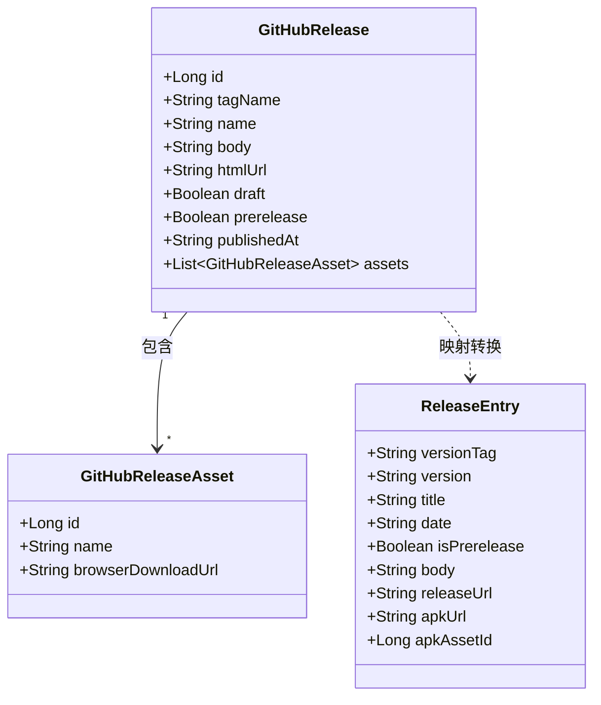
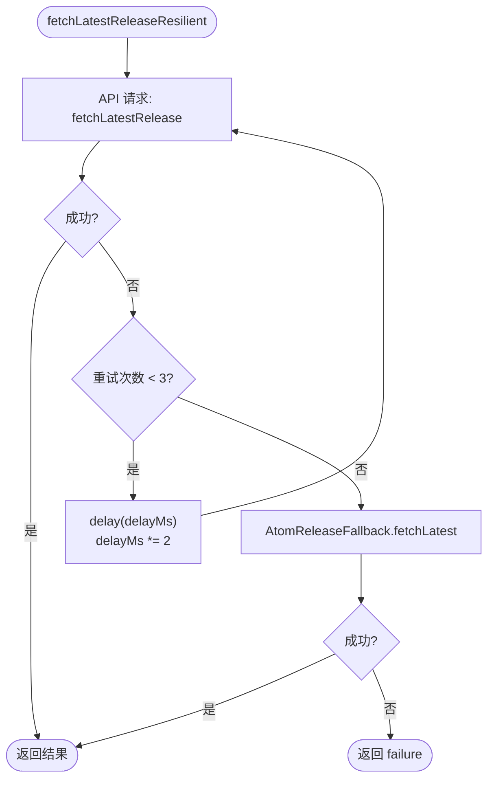
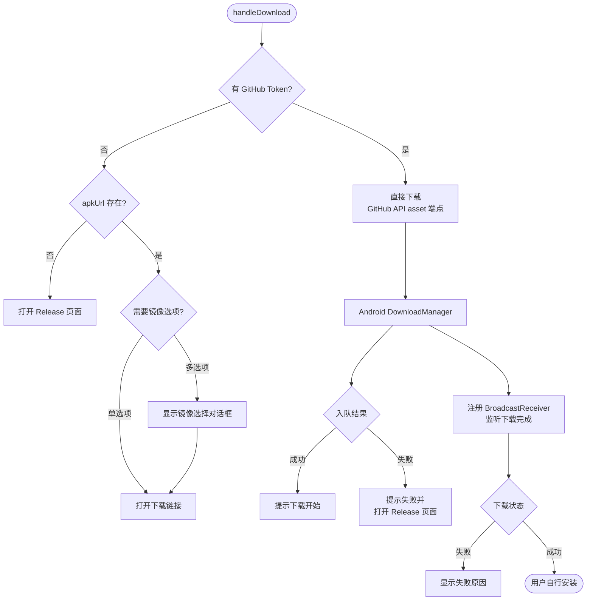
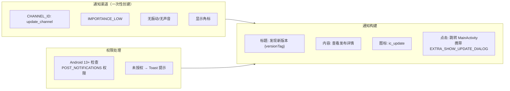

# 应用内更新系统

Aries-AI 的应用内更新系统负责检测 GitHub Release 上的新版本，通过通知和对话框提示用户升级，并支持 APK 下载管理。系统采用静默后台检查与手动检查相结合的策略，兼顾用户体验和网络资源。

## 概述

应用内更新系统是 Aries-AI 保持用户端及时更新的核心组件。它围绕以下核心能力设计：

- **静默启动检查**：应用启动时以 6 小时为间隔自动检测新版本，通过系统通知提醒用户，避免频繁 API 调用触发 GitHub 限流。
- **手动更新检查**：用户在"关于"页面可主动触发版本检查，获得即时反馈（发现新版本 / 已是最新 / 网络错误）。
- **版本发布历史**：浏览 GitHub Release 历史列表，支持分页加载和 Pre-release 过滤。
- **APK 下载**：集成 Android DownloadManager，支持 GitHub Token 鉴权和镜像站点加速下载。
- **弹性取用策略**：API 调用失败时自动重试（指数退避），并降级到 Atom Feed 解析获取发布信息。

## 架构

```mermaid
flowchart TD
    subgraph AppLayer["App 层（入口）"]
        MainActivity[MainActivity]
        AboutScreen[关于页面]
        UpdateHistoryScreen[UpdateHistoryScreen<br/>更新历史页面]
    end

    subgraph ViewModel["ViewModel 层"]
        AboutVM[AboutViewModel]
        HistoryVM[UpdateHistoryViewModel]
    end

    subgraph Coordinator["协调器"]
        Coordinator["UpdateStartupCoordinator<br/>启动静默检查"]
    end

    subgraph Repository["数据层"]
        Repo["ReleaseRepository<br/>发布仓库"]
        ApiClient["GitHubApiClient<br/>GitHub REST API"]
        AtomFallback["AtomReleaseFallback<br/>Atom Feed 降级"]
    end

    subgraph Storage["本地存储"]
        Store["UpdateStore<br/>SharedPreferences 缓存"]
    end

    subgraph Util["工具层"]
        Notif["UpdateNotificationUtil<br/>通知管理"]
        Download["ApkDownloadUtil<br/>APK 下载"]
        UiUtil["ReleaseUiUtil<br/>链接/镜像工具"]
        VersionComp["VersionComparator<br/>版本比较"]
    end

    MainActivity --> Coordinator
    AboutScreen --> AboutVM
    UpdateHistoryScreen --> HistoryVM

    AboutVM --> Repo
    HistoryVM --> Repo
    Coordinator --> Repo

    Repo --> ApiClient
    Repo --> AtomFallback

    AboutVM --> Store
    Coordinator --> Store

    AboutVM --> VersionComp
    Coordinator --> VersionComp

    Coordinator --> Notif
    AboutVM --> Download
    HistoryVM --> Download

    AboutVM --> UiUtil
    HistoryVM --> UiUtil
    Download --> UiUtil
```

**架构说明：**

- **协调器层** (`UpdateStartupCoordinator`) 是静默检查的唯一入口，由 `MainActivity` 在启动时调用，与用户 UI 层面解耦。
- **ViewModel 层** 的 `AboutViewModel` 和 `UpdateHistoryViewModel` 分别服务于"关于页面"的手动检查和"更新历史页面"的列表浏览，通过 Koin DI 注入 `ReleaseRepository`。
- **`ReleaseRepository`** 是核心数据聚合器：优先使用 GitHub REST API，失败后通过指数退避重试 3 次，仍失败则降级到 Atom Feed 解析。
- **工具层** 各司其职：`VersionComparator` 负责语义化版本比较，`UpdateNotificationUtil` 管理 Android 通知渠道，`ApkDownloadUtil` 封装 DownloadManager，`ReleaseUiUtil` 提供链接打开和镜像加速探测。

## 数据模型



`GitHubRelease` 和 `GitHubReleaseAsset` 是 GitHub REST API 返回的原始数据结构，使用 Kotlin Serialization 反序列化。`ReleaseEntry` 是应用内部使用的领域模型，由 `ReleaseRepository` 在 `fetchReleasePage` 方法中从 `GitHubRelease` 转换而来——转换时自动提取版本号（去掉 `v` 前缀）、匹配 APK 资源、生成友好标题等。

> Source: [GitHubModels.kt](https://github.com/ZG0704666/Aries-AI/blob/main/feature/updates/src/main/java/com/ai/phoneagent/updates/GitHubModels.kt)

## 核心流程

### 静默启动检查流程

```mermaid
sequenceDiagram
    participant Main as MainActivity
    participant Coord as UpdateStartupCoordinator
    participant Store as UpdateStore
    participant Repo as ReleaseRepository
    participant Api as GitHubApiClient
    participant Atom as AtomReleaseFallback
    participant Comp as VersionComparator
    participant Notif as UpdateNotificationUtil

    Main->>Coord: silentCheckOnLaunch(activity)
    Coord->>Coord: 获取当前版本 (PackageManager)
    Coord->>Store: loadLatest(context)
    Store-->>Coord: 缓存的 ReleaseEntry?

    alt 有缓存且版本更新
        Coord->>Comp: compare(cached.version, currentVersion)
        Comp-->>Coord: > 0
        Coord->>Notif: notifyNewVersion(context, cached)
    end

    Coord->>Store: shouldSilentCheck(context, now, interval)
    alt 未到检查间隔
        Store-->>Coord: false → 直接返回
    end

    Coord->>Store: markSilentChecked(context, now)

    Coord->>Repo: fetchLatestReleaseResilient(includePrerelease=false)

    rect rgb(40, 50, 60)
        Note over Repo,Atom: 弹性取用：API 重试(3次) → Atom 降级
        Repo->>Api: fetchLatestRelease()
        alt API 成功
            Api-->>Repo: ReleaseEntry
        else API 失败
            loop 最多 3 次（指数退避）
                Repo->>Api: 重试 fetchLatestRelease()
            end
            Repo->>Atom: fetchLatest(owner, repo)
            Atom-->>Repo: ReleaseEntry (from Atom XML)
        end
    end

    Repo-->>Coord: Result<ReleaseEntry?>

    alt 获取到新版本
        Coord->>Comp: compare(latest.version, currentVersion)
        Comp-->>Coord: > 0 (有新版本)
        Coord->>Store: saveLatest(context, latest)
        Coord->>Notif: notifyNewVersion(context, latest)
        Notif-->>Coord: 通知已发送
        Coord->>Store: markNotified(context, versionTag)
    else 已是最新或失败
        Note over Coord: 静默失败，不打扰用户
    end
```



**设计要点：**

1. **缓存优先**：通知检查间隔前先从本地缓存加载最近一次获取的发布信息，确保用户即使在无网络时也能看到上一次检测到的新版本提醒。
2. **6 小时间隔**：`SILENT_CHECK_INTERVAL_MS = 6 * 60 * 60 * 1000`（6 小时），平衡及时性和 API 限流风险。
3. **静默失败**：静默检查中的网络错误不会以任何形式打扰用户，确保启动体验流畅。
4. **通知去重**：同一版本只通知一次（通过 `KEY_LAST_NOTIFIED_VERSION` 去重）。

> Source: [UpdateStartupCoordinator.kt](https://github.com/ZG0704666/Aries-AI/blob/main/feature/updates/src/main/java/com/ai/phoneagent/updates/UpdateStartupCoordinator.kt)

### 弹性取用策略



`ReleaseRepository.fetchLatestReleaseResilient` 实现了三层弹性策略：

1. **主路径**：通过 GitHub REST API（`/repos/{owner}/{repo}/releases`）获取，支持 GitHub Token 认证以提高限流阈值。
2. **指数退避重试**：失败后以 500ms、1000ms、2000ms 的间隔重试最多 3 次。
3. **Atom Feed 降级**：API 彻底不可用时，通过 GitHub 公开的 Atom Feed（`/releases.atom`）解析发布信息。此方式无需认证但信息粒度较粗（无 asset ID、无 pre-release 标记）。

> Source: [ReleaseRepository.kt](https://github.com/ZG0704666/Aries-AI/blob/main/feature/updates/src/main/java/com/ai/phoneagent/updates/ReleaseRepository.kt)

### 手动检查流程

手动检查（在关于页面触发）与静默检查共享同一个 `ReleaseRepository.fetchLatestReleaseResilient` 方法，但处理逻辑不同：

- 使用 `VersionComparator.compare` 比较远程版本与当前版本
- 发现新版本：弹出 `UpdateDialogState` 对话框，同时缓存到 `UpdateStore`
- 已是最新：弹出 `UpToDateDialogState` 提示
- 网络错误：弹出 `ErrorDialogState`（使用 `ReleaseUiUtil.formatError` 格式化错误消息）

> Source: [AboutViewModel.kt](https://github.com/ZG0704666/Aries-AI/blob/main/app/src/main/java/com/ai/phoneagent/viewmodel/AboutViewModel.kt#L147-L196)

### APK 下载流程



**下载策略说明：**

- **GitHub Token 认证**：当配置了 `GITHUB_TOKEN` 时，直接通过 GitHub API asset 端点下载（需 `Accept: application/octet-stream` 头），享受更高的速率限制。
- **镜像加速**：对于国内网络环境，`ReleaseUiUtil.mirroredDownloadOptions` 提供官方直连和镜像加速（`ghfast.top`）两种选项。
- **下载监控**：通过 `BroadcastReceiver` 监听 `DownloadManager.ACTION_DOWNLOAD_COMPLETE`，在下载失败时显示具体错误原因码。

> Source: [ApkDownloadUtil.kt](https://github.com/ZG0704666/Aries-AI/blob/main/feature/updates/src/main/java/com/ai/phoneagent/updates/ApkDownloadUtil.kt)

## 版本比较算法

`VersionComparator` 采用语义化版本解析策略，支持多种版本格式：

```
输入格式示例：
  "v2.1.0"        → major=2, minor=1, patch=0, build=0
  "1.0.0-beta.2"  → major=1, minor=0, patch=0, build=0（beta 标记被忽略）
  "3.2.1+45"      → major=3, minor=2, patch=1, build=45
```

比较顺序为 **major → minor → patch → build**，按数值逐级比较。

> Source: [VersionComparator.kt](https://github.com/ZG0704666/Aries-AI/blob/main/core/common/src/main/java/com/ai/phoneagent/core/common/VersionComparator.kt)

## 通知机制



通知渠道在应用更新场景中使用 `IMPORTANCE_LOW` 级别——不发出声音、不振动，但显示角标，确保用户不会被频繁打扰。

> Source: [UpdateNotificationUtil.kt](https://github.com/ZG0704666/Aries-AI/blob/main/feature/updates/src/main/java/com/ai/phoneagent/updates/UpdateNotificationUtil.kt)

## 使用示例

### 基本用法：启动时静默检查

在 `MainActivity` 中调用静默检查：

```kotlin
// MainActivity.kt
private fun silentCheckUpdatesOnLaunch() {
    UpdateStartupCoordinator.silentCheckOnLaunch(this)
}
```

> Source: [MainActivity.kt](https://github.com/ZG0704666/Aries-AI/blob/main/app/src/main/java/com/ai/phoneagent/MainActivity.kt#L1110-L1112)

### 手动检查更新（在 ViewModel 中）

```kotlin
// AboutViewModel.kt — checkForUpdates()
fun checkForUpdates() {
    if (_uiState.value.isCheckingUpdates) return
    val context = getApplication<Application>()
    val currentVersion = currentVersionName(context)

    _uiState.update {
        it.copy(
            isCheckingUpdates = true,
            checkUpdateButtonText = context.getString(R.string.about_checking_updates)
        )
    }

    viewModelScope.launch {
        val result = withContext(Dispatchers.IO) {
            releaseRepo.fetchLatestReleaseResilient(includePrerelease = false)
        }

        val latest = result.getOrNull()
        // ... 根据结果展示不同对话框
    }
}
```

> Source: [AboutViewModel.kt](https://github.com/ZG0704666/Aries-AI/blob/main/app/src/main/java/com/ai/phoneagent/viewmodel/AboutViewModel.kt#L147-L196)

### 分页加载发布历史

```kotlin
// UpdateHistoryViewModel.kt — loadPage()
private fun loadPage(resetError: Boolean) {
    // ... 加载状态管理 ...

    viewModelScope.launch {
        val currentPage = _uiState.value.page
        val includePrerelease = _uiState.value.includePrerelease

        val result = withContext(Dispatchers.IO) {
            repo.fetchReleasePage(page = currentPage, perPage = 20)
        }

        result.onSuccess { list ->
            val filtered = if (includePrerelease) list else list.filter { !it.isPrerelease }
            _uiState.update { state ->
                val newReleases = if (currentPage == 1) filtered else state.releases + filtered
                state.copy(
                    loading = false,
                    releases = newReleases,
                    hasMore = filtered.isNotEmpty(),
                    error = null
                )
            }
        }.onFailure { e ->
            _uiState.update { state ->
                state.copy(loading = false, error = ReleaseUiUtil.formatError(e))
            }
        }
    }
}
```

> Source: [UpdateHistoryViewModel.kt](https://github.com/ZG0704666/Aries-AI/blob/main/app/src/main/java/com/ai/phoneagent/viewmodel/UpdateHistoryViewModel.kt#L59-L97)

### APK 下载

```kotlin
// ApkDownloadUtil.kt — enqueueApkDownload
fun enqueueApkDownload(context: Context, entry: ReleaseEntry): Boolean {
    val resolvedUrl =
        if (BuildConfig.GITHUB_TOKEN.isNotBlank() && entry.apkAssetId != null) {
            "https://api.github.com/repos/${UpdateConfig.REPO_OWNER}/${UpdateConfig.REPO_NAME}/releases/assets/${entry.apkAssetId}"
        } else {
            entry.apkUrl
        }

    if (resolvedUrl.isNullOrBlank()) {
        val opened = ReleaseUiUtil.openUrl(context, entry.releaseUrl)
        // ...
        return opened
    }

    val fileName = "${UpdateConfig.REPO_NAME}-${entry.versionTag}.apk".replace("/", "_")
    val req = DownloadManager.Request(Uri.parse(resolvedUrl))
    req.setTitle(context.getString(R.string.update_download_title_format, entry.versionTag))
    req.setDescription(entry.title)
    req.setMimeType("application/vnd.android.package-archive")
    // ...

    return enqueueRequest(context, req, fileName)
}
```

> Source: [ApkDownloadUtil.kt](https://github.com/ZG0704666/Aries-AI/blob/main/feature/updates/src/main/java/com/ai/phoneagent/updates/ApkDownloadUtil.kt#L55-L85)

## 配置选项

| 选项 | 类型 | 默认值 | 说明 |
|------|------|--------|------|
| `REPO_OWNER` | `String` | `"ZG0704666"` | GitHub 仓库所有者 |
| `REPO_NAME` | `String` | `"Aries-AI"` | GitHub 仓库名称 |
| `APK_ASSET_NAME` | `String` | `"app-release.apk"` | Release 中 APK 资源的文件名 |
| `SILENT_CHECK_INTERVAL_MS` | `Long` | `21600000`（6小时） | 静默检查的时间间隔 |
| `GITHUB_TOKEN` | `String` | `""`（BuildConfig） | GitHub 个人访问令牌，提升 API 限流阈值 |

> Source: [UpdateConfig.kt](https://github.com/ZG0704666/Aries-AI/blob/main/feature/updates/src/main/java/com/ai/phoneagent/updates/UpdateConfig.kt) / [UpdateStartupCoordinator.kt](https://github.com/ZG0704666/Aries-AI/blob/main/feature/updates/src/main/java/com/ai/phoneagent/updates/UpdateStartupCoordinator.kt#L15)

## API 参考

### `ReleaseRepository`

#### `fetchLatestReleaseResilient(includePrerelease: Boolean): Result<ReleaseEntry?>`

弹性获取最新发布版本。内部重试 3 次（指数退避），失败后降级到 Atom Feed。

**参数：**
- `includePrerelease` (`Boolean`)：是否包含预发布版本

**返回：** 成功的 `Result<ReleaseEntry?>`，无发布时返回 null

#### `fetchLatestRelease(includePrerelease: Boolean): Result<ReleaseEntry?>`

直接从 GitHub API 获取最新发布（最多翻 3 页）。

#### `fetchReleasePage(page: Int, perPage: Int): Result<List<ReleaseEntry>>`

获取指定页的发布列表，自动从 `GitHubRelease` 映射到 `ReleaseEntry`。

**参数：**
- `page` (`Int`)：页码（从 1 开始）
- `perPage` (`Int`)：每页数量

> Source: [ReleaseRepository.kt](https://github.com/ZG0704666/Aries-AI/blob/main/feature/updates/src/main/java/com/ai/phoneagent/updates/ReleaseRepository.kt)

### `UpdateStore`

#### `shouldSilentCheck(context: Context, nowMs: Long, intervalMs: Long): Boolean`

判断是否应执行静默检查（距离上次检查超过 intervalMs）。

#### `saveLatest(context: Context, entry: ReleaseEntry)` / `loadLatest(context: Context): ReleaseEntry?`

持久化/读取最新的 Release 信息到 SharedPreferences。

#### `shouldNotify(context: Context, versionTag: String): Boolean` / `markNotified(context: Context, versionTag: String)`

通知去重：同一版本只通知一次。

> Source: [UpdateStore.kt](https://github.com/ZG0704666/Aries-AI/blob/main/feature/updates/src/main/java/com/ai/phoneagent/updates/UpdateStore.kt)

### `VersionComparator`

#### `compare(v1: String, v2: String): Int`

比较两个版本字符串。返回 `> 0` 表示 v1 更新，`< 0` 表示 v2 更新，`0` 表示相同。

> Source: [VersionComparator.kt](https://github.com/ZG0704666/Aries-AI/blob/main/core/common/src/main/java/com/ai/phoneagent/core/common/VersionComparator.kt)

### `ApkDownloadUtil`

#### `enqueueApkDownload(context: Context, entry: ReleaseEntry): Boolean`

将 APK 加入 DownloadManager 下载队列。支持 GitHub Token 认证。

**返回：** `true` 表示下载已入队，`false` 表示失败。

#### `enqueueDownloadUrl(context, url, fileName, title, description, mimeType?): Boolean`

通用 URL 下载入队方法。

> Source: [ApkDownloadUtil.kt](https://github.com/ZG0704666/Aries-AI/blob/main/feature/updates/src/main/java/com/ai/phoneagent/updates/ApkDownloadUtil.kt)

### `ReleaseUiUtil`

#### `mirroredDownloadOptions(originalUrl: String?): List<Pair<String, String>>`

为 GitHub Release 下载链接生成镜像选项列表（官方直连 + ghfast.top 镜像）。

#### `mirroredDownloadOptionsChecked(originalUrl: String?, timeoutMs: Int): List<Pair<String, String>>`

对镜像选项进行可达性探测，按延迟排序返回可用选项。

#### `formatError(t: Throwable): String`

将网络异常格式化为用户友好的中文错误消息。

> Source: [ReleaseUiUtil.kt](https://github.com/ZG0704666/Aries-AI/blob/main/feature/updates/src/main/java/com/ai/phoneagent/updates/ReleaseUiUtil.kt)

## 相关链接

- [源码：feature/updates 模块](https://github.com/ZG0704666/Aries-AI/blob/main/feature/updates/src/main/java/com/ai/phoneagent/updates/)
- [ReleaseRepository.kt](https://github.com/ZG0704666/Aries-AI/blob/main/feature/updates/src/main/java/com/ai/phoneagent/updates/ReleaseRepository.kt)
- [GitHubApiClient.kt](https://github.com/ZG0704666/Aries-AI/blob/main/feature/updates/src/main/java/com/ai/phoneagent/updates/GitHubApiClient.kt)
- [AtomReleaseFallback.kt](https://github.com/ZG0704666/Aries-AI/blob/main/feature/updates/src/main/java/com/ai/phoneagent/updates/AtomReleaseFallback.kt)
- [UpdateStartupCoordinator.kt](https://github.com/ZG0704666/Aries-AI/blob/main/feature/updates/src/main/java/com/ai/phoneagent/updates/UpdateStartupCoordinator.kt)
- [UpdateStore.kt](https://github.com/ZG0704666/Aries-AI/blob/main/feature/updates/src/main/java/com/ai/phoneagent/updates/UpdateStore.kt)
- [UpdateNotificationUtil.kt](https://github.com/ZG0704666/Aries-AI/blob/main/feature/updates/src/main/java/com/ai/phoneagent/updates/UpdateNotificationUtil.kt)
- [ApkDownloadUtil.kt](https://github.com/ZG0704666/Aries-AI/blob/main/feature/updates/src/main/java/com/ai/phoneagent/updates/ApkDownloadUtil.kt)
- [ReleaseUiUtil.kt](https://github.com/ZG0704666/Aries-AI/blob/main/feature/updates/src/main/java/com/ai/phoneagent/updates/ReleaseUiUtil.kt)
- [VersionComparator.kt](https://github.com/ZG0704666/Aries-AI/blob/main/core/common/src/main/java/com/ai/phoneagent/core/common/VersionComparator.kt)
- [GitHubModels.kt](https://github.com/ZG0704666/Aries-AI/blob/main/feature/updates/src/main/java/com/ai/phoneagent/updates/GitHubModels.kt)
- [AboutViewModel.kt](https://github.com/ZG0704666/Aries-AI/blob/main/app/src/main/java/com/ai/phoneagent/viewmodel/AboutViewModel.kt)
- [UpdateHistoryViewModel.kt](https://github.com/ZG0704666/Aries-AI/blob/main/app/src/main/java/com/ai/phoneagent/viewmodel/UpdateHistoryViewModel.kt)
- [UpdateHistoryScreen.kt](https://github.com/ZG0704666/Aries-AI/blob/main/app/src/main/java/com/ai/phoneagent/ui/updates/UpdateHistoryScreen.kt)
- [DI 注册：UiModule.kt](https://github.com/ZG0704666/Aries-AI/blob/main/app/src/main/java/com/ai/phoneagent/di/UiModule.kt)
