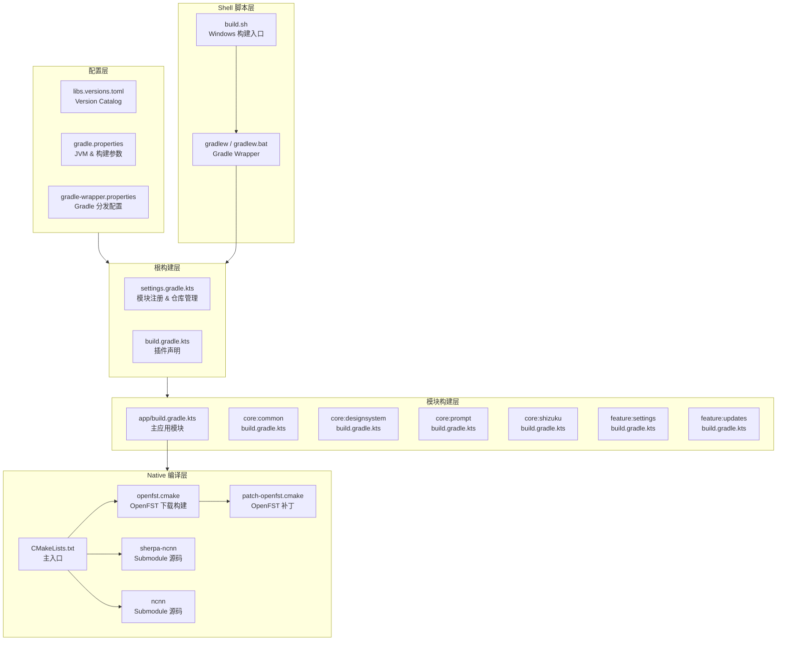
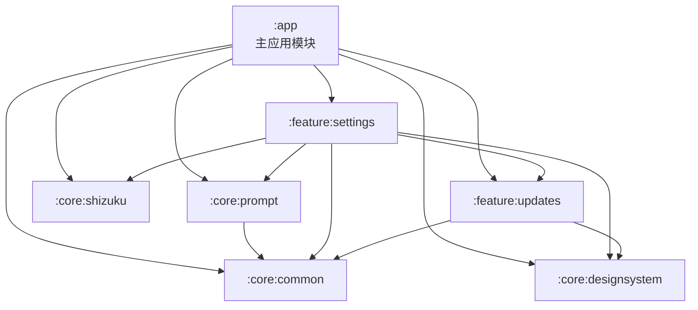
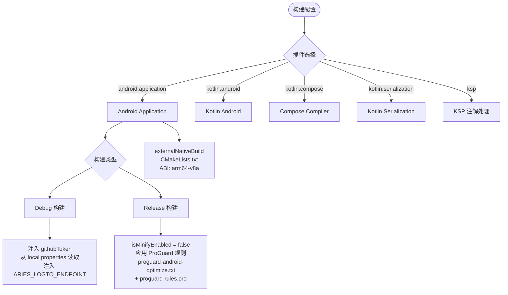
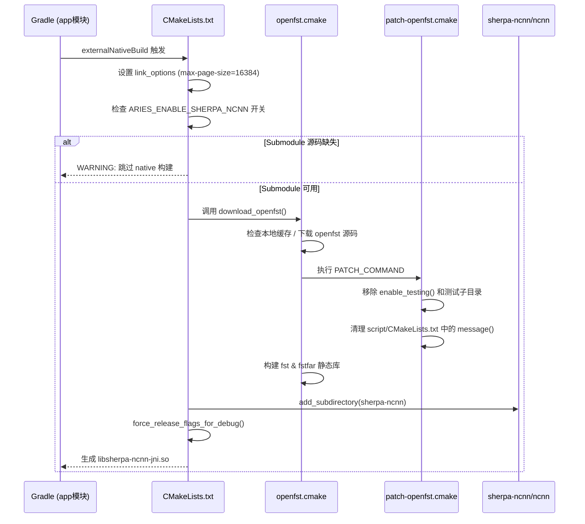

# 构建脚本与工具链

本文档详述 Phone Agent (Aries-AI) 项目的构建系统架构、构建脚本配置、编译工具链及自动化流程。

---

## 概述

Phone Agent 是一个基于 Kotlin 的 Android 应用项目，采用 **Gradle 8.13 + AGP 8.13.2 + Kotlin 2.2.21** 的现代化构建工具链。项目构建系统支持多模块分层架构、Native C++ 代码编译（通过 CMake + NDK）、版本目录（Version Catalog）依赖管理，并提供跨平台的命令行构建脚本与环境配置。

构建工具链的核心设计目标是：
- **依赖版本集中管理**：通过 `gradle/libs.versions.toml` 统一管控所有核心依赖版本，减少版本冲突风险
- **多模块并行构建**：项目拆分为 `:app`、`:core:*`、`:feature:*` 六个模块，各自独立编译，支持增量构建
- **Native 编译集成**：通过 CMake 和 NDK 将 sherpa-ncnn（语音识别）和 OpenFST 等 C++ 库静态链接进 APK
- **构建类型差异化**：Debug 与 Release 使用不同的签名、混淆策略和 BuildConfig 字段注入
- **仓库策略严格管控**：启用 `FAIL_ON_PROJECT_REPOS` 模式，所有仓库只能在 `settings.gradle.kts` 中声明

---

## 架构总览

### 构建系统层次结构



**架构说明：**

| 层次 | 职责 | 核心文件 |
|------|------|----------|
| 配置层 | 统一管理所有依赖版本、JVM 参数、Gradle 分发版本 | `libs.versions.toml`, `gradle.properties`, `gradle-wrapper.properties` |
| 根构建层 | 注册所有子模块、声明顶层插件、管控仓库策略 | `settings.gradle.kts`, `build.gradle.kts` |
| 模块构建层 | 各模块独立配置编译选项、依赖声明 | 各模块的 `build.gradle.kts` |
| Native 编译层 | 通过 CMake + NDK 编译 C++ 代码为 `.so` 库 | `CMakeLists.txt`, `openfst.cmake` |
| Shell 脚本层 | 提供一键构建入口，预置环境变量 | `build.sh`, `gradlew` |

---

## 模块依赖关系



> 依赖关系来源：各模块 `build.gradle.kts` 中的 `implementation(project(...))` 声明。

---

## 核心构建文件详解

### 1. Gradle Wrapper 配置

Gradle Wrapper 是项目的构建入口，确保所有开发者使用**完全一致的 Gradle 版本**，无需手动安装 Gradle。

> Source: [gradle/wrapper/gradle-wrapper.properties](https://github.com/ZG0704666/Aries-AI/blob/main/gradle/wrapper/gradle-wrapper.properties)

```properties
distributionBase=GRADLE_USER_HOME
distributionPath=wrapper/dists
distributionUrl=https\://services.gradle.org/distributions/gradle-8.13-bin.zip
networkTimeout=10000
validateDistributionUrl=true
zipStoreBase=GRADLE_USER_HOME
zipStorePath=wrapper/dists
```

关键配置说明：
- **`distributionUrl`**：锁定 Gradle 版本为 **8.13**，所有开发者自动使用该版本
- **`networkTimeout`**：下载超时设置为 10 秒，避免网络不畅时无限等待
- **`validateDistributionUrl`**：启用 URL 校验，防止分发包被篡改

### 2. 版本目录（Version Catalog）

项目使用 Gradle 原生 Version Catalog 集中管理核心依赖版本，定义在 `gradle/libs.versions.toml` 中。

> Source: [gradle/libs.versions.toml](https://github.com/ZG0704666/Aries-AI/blob/main/gradle/libs.versions.toml)

```toml
[versions]
agp = "8.13.2"
kotlin = "2.2.21"
coreKtx = "1.17.0"
composeBom = "2024.12.01"
room = "2.7.2"
koin = "3.5.6"
coil = "2.6.0"
coil3 = "3.1.0"

[plugins]
android-application = { id = "com.android.application", version.ref = "agp" }
android-library = { id = "com.android.library", version.ref = "agp" }
kotlin-android = { id = "org.jetbrains.kotlin.android", version.ref = "kotlin" }
kotlin-compose = { id = "org.jetbrains.kotlin.plugin.compose", version.ref = "kotlin" }
ksp = { id = "com.google.devtools.ksp", version = "2.2.21-2.0.5" }
```

**设计意图**：将分散在各模块 `build.gradle.kts` 中的版本号提升到单一文件管理。当需要升级某个依赖时，只需修改 `libs.versions.toml` 中的版本号即可全局生效，极大地降低了版本管理的心智负担和冲突风险。

**核心依赖版本一览**：

| 组件 | 版本 | 用途 |
|------|------|------|
| AGP (Android Gradle Plugin) | 8.13.2 | Android 构建核心 |
| Kotlin | 2.2.21 | 项目编程语言 |
| Compose BOM | 2024.12.01 | Jetpack Compose UI 框架 |
| Koin | 3.5.6 | 依赖注入框架 |
| Room | 2.7.2 | 本地数据库 |
| DataStore | 1.1.7 | 键值存储 |
| Coil 3 | 3.1.0 | 新一代图片加载 |

### 3. Gradle 属性配置

> Source: [gradle.properties](https://github.com/ZG0704666/Aries-AI/blob/main/gradle.properties)

```properties
# JVM 内存配置（处理 iText PDF 等大型依赖）
org.gradle.jvmargs=-Xmx2048m -Xms512m -Dfile.encoding=UTF-8

# AndroidX 迁移
android.useAndroidX=true

# Kotlin 代码风格
kotlin.code.style=official

# 非传递 R 类（减小库的 R 类体积）
android.nonTransitiveRClass=true

# 启用 Gradle Daemon 加速
org.gradle.daemon=true

# 资源优化
android.enableResourceOptimizations=true

# 允许中文路径
android.overridePathCheck=true
```

**设计意图**：
- `Xmx2048m`：为 JVM 分配 2GB 堆内存，确保处理 iText PDF、Apache POI 等大型依赖时有足够内存
- `android.nonTransitiveRClass=true`：启用非传递 R 类，每个库模块的 R 类只包含自身资源，减小 APK 体积并提升编译速度
- `android.overridePathCheck=true`：因为项目路径可能包含中文字符，此选项跳过路径 ASCII 检查

### 4. 根构建文件

> Source: [build.gradle.kts](https://github.com/ZG0704666/Aries-AI/blob/main/build.gradle.kts)

```kotlin
plugins {
    alias(libs.plugins.android.application) apply false
    alias(libs.plugins.android.library) apply false
    alias(libs.plugins.kotlin.android) apply false
}
```

根构建文件的职责非常精简：仅声明顶层插件（使用 `apply false` 表示不下发到子模块，各子模块按需引用）。所有子模块和仓库配置交由 `settings.gradle.kts` 管理。

### 5. 项目模块注册

> Source: [settings.gradle.kts](https://github.com/ZG0704666/Aries-AI/blob/main/settings.gradle.kts)

```kotlin
pluginManagement {
    repositories {
        google {
            content {
                includeGroupByRegex("com\\.android.*")
                includeGroupByRegex("com\\.google.*")
                includeGroupByRegex("androidx.*")
            }
        }
        mavenCentral()
        gradlePluginPortal()
    }
}
dependencyResolutionManagement {
    repositoriesMode.set(RepositoriesMode.FAIL_ON_PROJECT_REPOS)
    repositories {
        google()
        mavenCentral()
    }
}

rootProject.name = "Phone Agent"
include(":app")
include(":core:common")
include(":core:designsystem")
include(":core:prompt")
include(":core:shizuku")
include(":feature:settings")
include(":feature:updates")
```

**关键设计决策**：

1. **`repositoriesMode.FAIL_ON_PROJECT_REPOS`**：这是一个重要的仓库策略约束。启用后，如果在任何子模块的 `build.gradle.kts` 中声明 `repositories {}`，构建将**直接失败**。这强制所有仓库声明集中在 `settings.gradle.kts`，防止子模块引入不可控的外部仓库，确保依赖来源的可审计性。

2. **`google()` 仓库的 `content` 过滤**：仅在 `google()` 仓库中查找 `com.android.*`、`com.google.*`、`androidx.*` 组的依赖，其他依赖走 `mavenCentral()`。这种"仓库分工"策略避免了跨仓库的版本混淆问题。

3. **模块命名约定**：`core:*` 为核心基础库，`feature:*` 为功能模块，`app` 为主应用入口。分层清晰，职责明确。

---

## 主应用模块构建配置

> Source: [app/build.gradle.kts](https://github.com/ZG0704666/Aries-AI/blob/main/app/build.gradle.kts)

### 构建类型差异化



### 关键配置区段

#### 版本与 SDK 配置

```kotlin
android {
    namespace = "com.ai.phoneagent"
    compileSdk = 36

    defaultConfig {
        applicationId = "com.ai.phoneagent"
        minSdk = 30          // Android 11
        targetSdk = 36       // Android 16
        versionCode = 17
        versionName = "v1.4.2-xyla.alpha"
    }
}
```

> Source: [app/build.gradle.kts](https://github.com/ZG0704666/Aries-AI/blob/main/app/build.gradle.kts#L47-L62)

**设计意图**：`minSdk = 30` 意味着应用仅支持 Android 11 及以上设备，这是为了利用现代 Android API（如虚拟显示屏、Shizuku 系统级权限等），避免在旧版本上维护兼容性代码。

#### 动态属性读取

项目通过 `local.properties` 文件读取敏感配置（如 GitHub Token、Logto OIDC 参数），避免将密钥硬编码在版本控制中：

```kotlin
fun localProperty(name: String): String {
    val f = rootProject.file("local.properties")
    if (!f.exists()) return ""
    val line = f.readLines()
        .asSequence()
        .map { it.trim() }
        .firstOrNull { it.isNotBlank() && !it.startsWith("#") && it.startsWith(name) }
        ?: return ""
    val eqIdx = line.indexOf('=')
    if (eqIdx < 0) return ""
    return line.substring(eqIdx + 1).trim()
}
```

> Source: [app/build.gradle.kts](https://github.com/ZG0704666/Aries-AI/blob/main/app/build.gradle.kts#L25-L39)

此函数读取 `local.properties` 中以指定属性名开头的非注释行，提取 `=` 后的值。用于注入 `aries.logto.appId`、`aries.logto.apiResource` 等配置到 BuildConfig。

#### 依赖冲突排除

```kotlin
configurations.all {
    exclude(group = "org.intellij", module = "annotations")
    exclude(group = "org.jetbrains", module = "annotations-java5")
}
```

> Source: [app/build.gradle.kts](https://github.com/ZG0704666/Aries-AI/blob/main/app/build.gradle.kts#L132-L137)

排除 `org.intellij:annotations` 和 `org.jetbrains:annotations-java5`，避免与项目使用的 `org.jetbrains:annotations`（最新版）产生重复类冲突。

#### 打包资源排除

```kotlin
packaging {
    jniLibs { useLegacyPackaging = true }
    resources {
        excludes += "/META-INF/{AL2.0,LGPL2.1}"
        excludes += "META-INF/versions/9/OSGI-INF/MANIFEST.MF"
        pickFirsts += "META-INF/INDEX.LIST"
        pickFirsts += "META-INF/io.netty.versions.properties"
    }
}
```

> Source: [app/build.gradle.kts](https://github.com/ZG0704666/Aries-AI/blob/main/app/build.gradle.kts#L119-L129)

处理多个依赖库引入相同 META-INF 文件时的冲突：排除重复的许可证文件，对 `INDEX.LIST` 和 Netty 版本属性使用 `pickFirsts`（取第一个遇到的）。

#### ProGuard 混淆配置

> Source: [app/proguard-rules.pro](https://github.com/ZG0704666/Aries-AI/blob/main/app/proguard-rules.pro)

当前 Release 构建中 `isMinifyEnabled = false`，ProGuard 规则文件保留为模板状态。这意味着 Release 版本当前不进行代码混淆和压缩。

```kotlin
release {
    isMinifyEnabled = false
    proguardFiles(
        getDefaultProguardFile("proguard-android-optimize.txt"),
        "proguard-rules.pro"
    )
}
```

---

## Native 编译（CMake + NDK）

项目通过 CMake 集成 C++ 原生代码编译，主要用于语音识别引擎 sherpa-ncnn。

### 编译流程



### CMakeLists.txt 详解

> Source: [app/src/main/cpp/CMakeLists.txt](https://github.com/ZG0704666/Aries-AI/blob/main/app/src/main/cpp/CMakeLists.txt)

```cmake
cmake_minimum_required(VERSION 3.22.1)
project(aries_sherpa_native)

function(force_release_flags_for_debug target_name)
    if(TARGET ${target_name})
        target_compile_definitions(${target_name} PRIVATE $<$<CONFIG:Debug>:NDEBUG>)
        target_compile_options(${target_name} PRIVATE $<$<CONFIG:Debug>:-O3 -g0>)
    endif()
endfunction()
```

**设计意图**：`force_release_flags_for_debug` 函数是一个关键的优化策略。即使 App 以 Debug 模式构建，Native 库（ncnn、sherpa-ncnn-core、sherpa-ncnn-jni）仍使用 `-O3 -g0`（最高优化、无调试符号）编译。这是因为语音识别推理计算量大，Debug 模式下的无优化编译会导致严重性能问题。同时定义 `NDEBUG` 禁用断言检查。

```cmake
set(SHERPA_NCNN_ENABLE_PORTAUDIO OFF CACHE BOOL "" FORCE)
set(SHERPA_NCNN_ENABLE_BINARY OFF CACHE BOOL "" FORCE)
set(SHERPA_NCNN_ENABLE_TEST OFF CACHE BOOL "" FORCE)
set(SHERPA_NCNN_ENABLE_C_API OFF CACHE BOOL "" FORCE)
set(SHERPA_NCNN_ENABLE_JNI ON CACHE BOOL "" FORCE)
set(BUILD_SHARED_LIBS OFF CACHE BOOL "" FORCE)
set(NCNN_OPENMP OFF CACHE BOOL "" FORCE)
```

通过强制设置 CMake 缓存变量，精确控制 sherpa-ncnn 的构建配置：
- 仅启用 JNI 接口（Android 集成所需）
- 禁用 PortAudio、Python、测试、二进制文件等无关功能
- 使用静态链接（`BUILD_SHARED_LIBS OFF`），避免 OpenMP 异常中止问题
- 禁用 ncnn 的 OpenMP 支持（移动端用单线程推理更稳定）

### OpenFST 下载与补丁

> Source: [app/src/main/cpp/cmake/openfst.cmake](https://github.com/ZG0704666/Aries-AI/blob/main/app/src/main/cpp/cmake/openfst.cmake)

OpenFST（Open Finite-State Transducer）是语音识别中 WFST（加权有限状态转换器）解码的核心依赖。CMake 脚本通过 `FetchContent` 自动下载并构建：

```cmake
set(openfst_URL  "https://github.com/csukuangfj/openfst/archive/refs/tags/sherpa-onnx-2024-06-19.tar.gz")
set(openfst_URL2 "https://hf-mirror.com/csukuangfj/sherpa-onnx-cmake-deps/resolve/main/openfst-sherpa-onnx-2024-06-19.tar.gz")
```

提供了两个下载源：GitHub 主源和 HuggingFace 镜像，提高下载成功率。

补丁脚本 `patch-openfst.cmake` 在下载后自动执行，移除测试相关代码：

> Source: [app/src/main/cpp/cmake/patch-openfst.cmake](https://github.com/ZG0704666/Aries-AI/blob/main/app/src/main/cpp/cmake/patch-openfst.cmake)

```cmake
if(EXISTS "${_src_cmake}")
  file(READ "${_src_cmake}" _src_content)
  string(REPLACE "enable_testing()" "" _src_content "${_src_content}")
  string(REPLACE "add_subdirectory(test)" "" _src_content "${_src_content}")
  file(WRITE "${_src_cmake}" "${_src_content}")
endif()
```

### NDK 配置

> Source: [app/build.gradle.kts](https://github.com/ZG0704666/Aries-AI/blob/main/app/build.gradle.kts#L72-L81)

```kotlin
ndk {
    abiFilters += listOf("arm64-v8a")
}
externalNativeBuild {
    cmake {
        arguments += listOf("-DANDROID_SUPPORT_FLEXIBLE_PAGE_SIZES=ON")
        cppFlags += listOf("-std=c++17")
    }
}
```

仅构建 `arm64-v8a` ABI，这是现代 Android 设备的主流架构，减少 APK 体积和编译时间。使用 C++17 标准和灵活页面大小支持（兼容 16KB 页面大小设备）。

---

## 子模块构建配置

### 模块配置对比

| 模块 | 类型 | compileSdk | Compose | BuildConfig | 关键依赖 |
|------|------|------------|---------|-------------|----------|
| `:app` | application | 36 | ✅ | ✅ | 全部模块 + Shizuku + HiddenApiBypass |
| `:core:common` | library | 36 | ❌ | ❌ | kotlinx.serialization |
| `:core:designsystem` | library | 36 | ✅ | ❌ | Compose BOM + Koin |
| `:core:prompt` | library | 36 | ❌ | ❌ | core:common + Coroutines |
| `:core:shizuku` | library | 36 | ❌ | ❌ | Shizuku API 13.1.5 |
| `:feature:settings` | library | 36 | ✅ | ❌ | 全部 core + feature:updates |
| `:feature:updates` | library | 36 | ❌ | ✅ | core:common + core:designsystem |

所有模块统一使用 `JavaVersion.VERSION_11` 和 `jvmTarget = "11"`，确保字节码兼容性一致。

---

## 构建命令与脚本

### gradlew（Gradle Wrapper 脚本）

项目提供标准的 Gradle Wrapper 脚本：

- **Windows**：`gradlew.bat`
- **Linux/macOS**：`gradlew`（POSIX shell 脚本）

Gradle Wrapper 自动下载并缓存指定版本的 Gradle（8.13），开发者无需手动安装。

### build.sh — 一键构建脚本

> Source: [build.sh](https://github.com/ZG0704666/Aries-AI/blob/main/build.sh)

```bash
#!/bin/bash
set -e

export JAVA_HOME='C:\Program Files\Android\Android Studio\jbr'
export GRADLE_USER_HOME='D:\hub\Aries-AI\.gradle'
export ANDROID_USER_HOME='D:\hub\Aries-AI\.android'
export ANDROID_SDK_ROOT='C:\Users\xuany\AppData\Local\Android\Sdk'

cd 'D:\hub\Aries-AI'
./gradlew assembleDebug --dry-run
```

此脚本是开发者在 Windows 环境下的快速构建入口，预置了以下环境变量：

| 环境变量 | 值 | 用途 |
|----------|-----|------|
| `JAVA_HOME` | Android Studio JBR | 使用 Android Studio 自带的 JetBrains Runtime（Java 21） |
| `GRADLE_USER_HOME` | 项目 `.gradle` 目录 | 将 Gradle 缓存隔离在项目内，避免与系统其他 Gradle 项目冲突 |
| `ANDROID_USER_HOME` | 项目 `.android` 目录 | 隔离 Android 工具配置 |
| `ANDROID_SDK_ROOT` | Android SDK 路径 | 指定 SDK 位置 |

`set -e` 确保任何命令失败时脚本立即退出，避免错误被忽略。当前使用 `--dry-run` 标志（不实际编译，仅验证配置）。

### 常用构建命令

```bash
# Debug 版本编译
./gradlew assembleDebug

# Release 版本编译
./gradlew assembleRelease

# 清理构建产物
./gradlew clean

# 运行单元测试
./gradlew testDebugUnitTest

# 查看完整依赖树
./gradlew :app:dependencies

# 安装到已连接设备
./gradlew installDebug
```

---

## 环境要求

| 软件 | 版本要求 | 说明 |
|------|----------|------|
| JDK | 17+（推荐 21） | Android Studio 自带 JBR 21 即可 |
| Android SDK | API 36 | compileSdk 36 需要对应 Platform |
| Gradle | 8.13 | 由 Wrapper 自动管理 |
| Kotlin | 2.2.21 | 由项目配置 |
| AGP | 8.13.2 | 由项目配置 |
| CMake | 3.22.1+ | Native 代码编译需要 |
| NDK | 最新稳定版 | arm64-v8a 交叉编译需要 |
| Git | 2.30+ | 需支持 submodule（`git submodule update --init --recursive`） |

---

## Native Submodule 初始化

Native 编译依赖 sherpa-ncnn 和 ncnn 的 Git Submodule。首次克隆项目后，必须执行：

```bash
git submodule update --init --recursive
```

如果 submodule 未初始化，CMake 会输出警告并跳过 native 构建：

```
缺少 native submodule 源码，已跳过 sherpa-ncnn native 构建。
期望存在: .../thirdparty/sherpa-ncnn/CMakeLists.txt
期望存在: .../thirdparty/ncnn/CMakeLists.txt
请执行: git submodule update --init --recursive
```

> Source: [app/src/main/cpp/CMakeLists.txt](https://github.com/ZG0704666/Aries-AI/blob/main/app/src/main/cpp/CMakeLists.txt#L27-L31)

可通过 `ARIES_ENABLE_SHERPA_NCNN=OFF` CMake 选项完全禁用 native 构建（例如纯 UI 开发时）。

---

## 相关链接

- [BUILDING.md — 完整编译指南](https://github.com/ZG0704666/Aries-AI/blob/main/docs/BUILDING.md)
- [build.gradle.kts — 根构建文件](https://github.com/ZG0704666/Aries-AI/blob/main/build.gradle.kts)
- [app/build.gradle.kts — 主应用模块构建配置](https://github.com/ZG0704666/Aries-AI/blob/main/app/build.gradle.kts)
- [settings.gradle.kts — 项目设置与模块注册](https://github.com/ZG0704666/Aries-AI/blob/main/settings.gradle.kts)
- [gradle/libs.versions.toml — 版本目录](https://github.com/ZG0704666/Aries-AI/blob/main/gradle/libs.versions.toml)
- [gradle.properties — Gradle 属性](https://github.com/ZG0704666/Aries-AI/blob/main/gradle.properties)
- [gradle/wrapper/gradle-wrapper.properties — Wrapper 配置](https://github.com/ZG0704666/Aries-AI/blob/main/gradle/wrapper/gradle-wrapper.properties)
- [app/src/main/cpp/CMakeLists.txt — Native 编译入口](https://github.com/ZG0704666/Aries-AI/blob/main/app/src/main/cpp/CMakeLists.txt)
- [app/src/main/cpp/cmake/openfst.cmake — OpenFST 构建脚本](https://github.com/ZG0704666/Aries-AI/blob/main/app/src/main/cpp/cmake/openfst.cmake)
- [app/src/main/cpp/cmake/patch-openfst.cmake — OpenFST 补丁脚本](https://github.com/ZG0704666/Aries-AI/blob/main/app/src/main/cpp/cmake/patch-openfst.cmake)
- [build.sh — 一键构建脚本](https://github.com/ZG0704666/Aries-AI/blob/main/build.sh)
- [app/proguard-rules.pro — ProGuard 规则](https://github.com/ZG0704666/Aries-AI/blob/main/app/proguard-rules.pro)
- [TECHNICAL_OVERVIEW.md — 技术架构概览](https://github.com/ZG0704666/Aries-AI/blob/main/docs/TECHNICAL_OVERVIEW.md)
