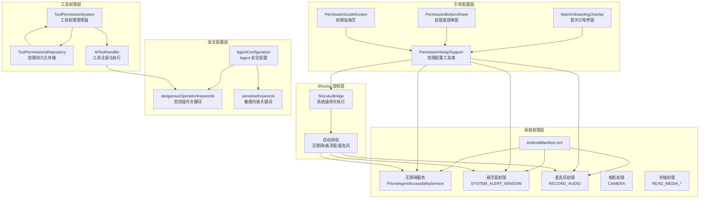
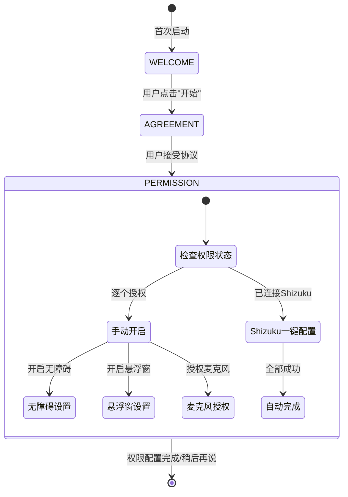
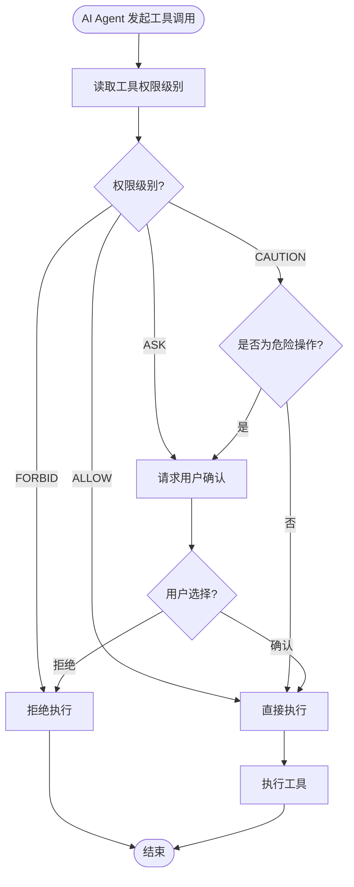

# 环境与权限配置

Aries AI 是一个 Android UI 自动化框架，依赖多种系统级权限和安全配置来实现无障碍操作、悬浮窗交互、语音输入和 AI 工具调用。本文档全面介绍应用的权限体系、首次引导流程、Shizuku 一键配置、工具权限系统以及 Agent 安全配置。

## 概述

Aries AI 的正常运行依赖于三类关键配置：

1. **Android 系统权限** — 在 `AndroidManifest.xml` 中声明，部分需要用户运行时授权
2. **工具执行权限** — 控制 AI Agent 调用各类系统工具时的安全策略，防止危险操作被自动执行
3. **Agent 安全配置** — 通过 `AgentConfiguration` 中的敏感词和危险操作关键词列表，对模型输出进行风险分级和拦截

设计上，Aries AI 采用 **分层权限控制** 的思想：系统权限保障基础能力可用，工具权限在运行时对每一次 AI 操作进行安全检查，而 Agent 配置则在语义层面识别潜在风险。

## 架构总览



架构图展示了 Aries AI 环境与权限配置的五个层次：

- **系统权限层**：Android 原生权限声明，是无障碍自动化和 UI 交互的能力基础
- **引导配置层**：面向用户的权限设置入口，提供三步引导流程和手动/自动配置能力
- **Shizuku 提权层**：利用 Shizuku 框架获得系统级权限，实现一键自动授权
- **工具权限层**：运行时对每个 AI 工具调用进行安全检查和用户确认
- **安全配置层**：通过关键词列表在语义层面识别和拦截风险操作

---

## Android 系统权限配置

### Manifest 权限声明

Aries AI 在 `AndroidManifest.xml` 中声明了以下关键权限：

> Source: [AndroidManifest.xml](https://github.com/ZG0704666/Aries-AI/blob/main/app/src/main/AndroidManifest.xml#L1-L123)

```xml
<!-- 网络通信 -->
<uses-permission android:name="android.permission.INTERNET" />

<!-- 语音输入 -->
<uses-permission android:name="android.permission.RECORD_AUDIO" />

<!-- 悬浮窗 -->
<uses-permission android:name="android.permission.SYSTEM_ALERT_WINDOW" />

<!-- 通知 -->
<uses-permission android:name="android.permission.POST_NOTIFICATIONS" />

<!-- 前台服务（Android 14+） -->
<uses-permission android:name="android.permission.FOREGROUND_SERVICE" />
<uses-permission android:name="android.permission.FOREGROUND_SERVICE_SPECIAL_USE" />

<!-- 相机 -->
<uses-permission android:name="android.permission.CAMERA" />

<!-- 存储（按版本分层） -->
<uses-permission android:name="android.permission.READ_EXTERNAL_STORAGE" 
    android:maxSdkVersion="32" />
<uses-permission android:name="android.permission.READ_MEDIA_IMAGES" />
<uses-permission android:name="android.permission.READ_MEDIA_VIDEO" />
<uses-permission android:name="android.permission.READ_MEDIA_AUDIO" />
```

### 权限分类与用途

| 权限 | 类型 | 用途 | 授权方式 |
|------|------|------|----------|
| `INTERNET` | 安装时授予 | AI 模型 API 通信 | 自动 |
| `RECORD_AUDIO` | 运行时权限 | 语音输入与语音识别 | 用户弹窗或 Shizuku |
| `SYSTEM_ALERT_WINDOW` | 特殊权限 | 悬浮入口和后台助手界面 | 系统设置或 Shizuku |
| `POST_NOTIFICATIONS` | 运行时权限 | 自动化进度通知 | 用户弹窗 |
| `CAMERA` | 运行时权限 | 拍照附件上传 | 用户弹窗 |
| `FOREGROUND_SERVICE` | 安装时授予 | 悬浮窗服务和自动化前台运行 | 自动 |
| `VIBRATE` | 安装时授予 | 操作触感反馈 | 自动 |
| `READ_MEDIA_*` | 运行时权限 | 附件上传（图片/视频/音频） | 用户弹窗 |

### 无障碍服务配置

Aries AI 的核心自动化能力依赖无障碍服务。服务通过 XML 配置文件声明能力：

> Source: [phone_agent_accessibility_service.xml](https://github.com/ZG0704666/Aries-AI/blob/main/app/src/main/res/xml/phone_agent_accessibility_service.xml#L1-L9)

```xml
<accessibility-service xmlns:android="http://schemas.android.com/apk/res/android"
    android:accessibilityEventTypes="typeAllMask"
    android:accessibilityFeedbackType="feedbackGeneric"
    android:notificationTimeout="50"
    android:canRetrieveWindowContent="true"
    android:canPerformGestures="true"
    android:canTakeScreenshot="true"
    android:accessibilityFlags="flagDefault|flagReportViewIds|flagRetrieveInteractiveWindows|flagRequestFilterKeyEvents" />
```

关键能力声明：
- `canRetrieveWindowContent="true"` — 读取 UI 树获取界面元素信息
- `canPerformGestures="true"` — 执行点击、滑动、返回等手势操作
- `canTakeScreenshot="true"` — 截取屏幕用于 AI 视觉分析
- `flagRequestFilterKeyEvents` — 拦截按键事件（如返回键）
- `flagRetrieveInteractiveWindows` — 获取可交互窗口信息

### Shizuku Provider 配置

Shizuku 是实现一键权限配置和虚拟屏的核心依赖，通过 ContentProvider 方式集成：

> Source: [AndroidManifest.xml](https://github.com/ZG0704666/Aries-AI/blob/main/app/src/main/AndroidManifest.xml#L112-L119)

```xml
<provider
    android:name="rikka.shizuku.ShizukuProvider"
    android:authorities="${applicationId}.shizuku"
    android:enabled="true"
    android:exported="true"
    android:multiprocess="false"
    android:permission="android.permission.INTERACT_ACROSS_USERS_FULL" />
```

---

## 首次引导与权限设置流程

### 引导流程架构

首次启动时，用户会经历 **欢迎 → 用户协议 → 权限设置** 三步引导流程，由 `MainOnboardingOverlay` 统一管理：



### 核心引导组件

引导流程的核心组件是 `MainOnboardingOverlay`：

> Source: [MainOnboardingOverlay.kt](https://github.com/ZG0704666/Aries-AI/blob/main/app/src/main/java/com/ai/phoneagent/MainOnboardingOverlay.kt#L68-L95)

```kotlin
class MainOnboardingOverlay(
    private val activity: AppCompatActivity,
    private val appPrefs: AppPreferencesRepository,
) {
    enum class FlowMode {
        ONBOARDING,       // 完整引导流程
        PERMISSION_ONLY,  // 仅权限设置（已接受协议）
    }

    enum class Step {
        WELCOME,      // 欢迎页
        AGREEMENT,    // 用户协议
        PERMISSION,   // 权限设置
    }

    data class PermissionUiState(
        val accessibilityReady: Boolean,  // 无障碍服务是否已开启
        val overlayReady: Boolean,        // 悬浮窗权限是否已授予
        val microphoneReady: Boolean,     // 麦克风权限是否已授予
    ) {
        val allReady: Boolean
            get() = accessibilityReady && overlayReady && microphoneReady
    }
}
```

### 权限状态检查

`PermissionSetupSupport` 提供了统一的权限状态检查方法：

> Source: [PermissionSetupSupport.kt](https://github.com/ZG0704666/Aries-AI/blob/main/feature/settings/src/main/java/com/ai/phoneagent/PermissionSetupSupport.kt#L20-L90)

```kotlin
object PermissionSetupSupport {
    // 检查悬浮窗权限
    fun hasOverlayPermission(context: Context): Boolean =
        Build.VERSION.SDK_INT < Build.VERSION_CODES.M || Settings.canDrawOverlays(context)

    // 检查无障碍服务是否启用
    fun isAccessibilityEnabled(context: Context): Boolean {
        val enabled = Settings.Secure.getInt(
            context.contentResolver,
            Settings.Secure.ACCESSIBILITY_ENABLED, 0
        )
        if (enabled != 1) return false

        val setting = Settings.Secure.getString(
            context.contentResolver,
            Settings.Secure.ENABLED_ACCESSIBILITY_SERVICES
        ) ?: return false

        val serviceId = "${context.packageName}/$ACCESSIBILITY_SERVICE_CLASS"
        return setting.split(':').any { it.equals(serviceId, ignoreCase = true) }
    }

    // 一键检查所有权限
    fun allPermissionsReady(context: Context): Boolean {
        val micOk = ContextCompat.checkSelfPermission(
            context, Manifest.permission.RECORD_AUDIO
        ) == PackageManager.PERMISSION_GRANTED
        return isAccessibilityEnabled(context) && hasOverlayPermission(context) && micOk
    }
}
```

**设计意图**：`isAccessibilityEnabled` 不仅检查全局无障碍开关，还精确匹配本应用的 `PhoneAgentAccessibilityService`，避免因其他无障碍服务开启而产生误判。`hasOverlayPermission` 则对 Android M 之前的版本直接返回 `true`（无需单独授权）。

### 权限开启引导方法

> Source: [PermissionSetupSupport.kt](https://github.com/ZG0704666/Aries-AI/blob/main/feature/settings/src/main/java/com/ai/phoneagent/PermissionSetupSupport.kt#L92-L148)

```kotlin
// 打开无障碍服务设置页（支持多版本兼容）
fun openAccessibilitySettings(activity: AppCompatActivity) {
    val componentName = ComponentName(activity.packageName, ACCESSIBILITY_SERVICE_CLASS)

    fun tryStart(intent: Intent): Boolean = runCatching { activity.startActivity(intent) }.isSuccess

    // Android Q+ 优先使用精确跳转
    if (Build.VERSION.SDK_INT >= Build.VERSION_CODES.Q) {
        val intentWithComponent = Intent(ACTION_ACCESSIBILITY_DETAILS_SETTINGS).apply {
            putExtra(Intent.EXTRA_COMPONENT_NAME, componentName)
            putExtra(EXTRA_ACCESSIBILITY_SERVICE_COMPONENT_NAME, componentName)
        }
        if (tryStart(intentWithComponent)) return
        // ... fallback 尝试
    }
    // 最终 fallback：通用无障碍设置页
    tryStart(Intent(Settings.ACTION_ACCESSIBILITY_SETTINGS))
}

// 打开悬浮窗权限设置
fun openOverlaySettings(activity: AppCompatActivity) {
    activity.startActivity(Intent(
        Settings.ACTION_MANAGE_OVERLAY_PERMISSION,
        Uri.parse("package:${activity.packageName}")
    ))
}

// 请求麦克风权限
fun requestMicPermission(activity: AppCompatActivity, requestCode: Int, onAlreadyGranted: (() -> Unit)? = null) {
    val granted = ContextCompat.checkSelfPermission(
        activity, Manifest.permission.RECORD_AUDIO
    ) == PackageManager.PERMISSION_GRANTED
    if (granted) { onAlreadyGranted?.invoke(); return }
    activity.requestPermissions(arrayOf(Manifest.permission.RECORD_AUDIO), requestCode)
}
```

**设计意图**：`openAccessibilitySettings` 采用 "尝试最优方案，逐级 fallback" 策略：先尝试携带组件名的精确跳转（Android Q+），再尝试扁平化名称格式，最后回退到通用无障碍设置列表。这是为了兼容不同厂商 ROM 对 Intent 参数的处理差异。

---

## Shizuku 一键权限配置

Aries AI 集成了 Shizuku 框架，可以在用户已授权 Shizuku 的情况下，通过系统级 shell 命令自动完成三项核心权限的配置。

### ShizukuBridge 架构

> Source: [ShizukuBridge.kt](https://github.com/ZG0704666/Aries-AI/blob/main/core/shizuku/src/main/java/com/ai/phoneagent/ShizukuBridge.kt#L20-L260)

```kotlin
object ShizukuBridge {
    // 检查 Shizuku 服务是否在运行
    fun pingBinder(): Boolean
    // 检查本应用是否已获得 Shizuku 授权
    fun hasPermission(): Boolean
    // 请求 Shizuku 授权
    fun requestPermission(requestCode: Int): Boolean
    // 通过 Shizuku 执行 shell 命令
    fun execResultArgs(args: List<String>): ExecResult
    // 综合检查 Shizuku 是否可用
    fun isShizukuAvailable(): Boolean = pingBinder() && hasPermission()
}
```

### 一键配置流程

`PermissionSetupSupport.guideAll()` 实现了一键配置的完整逻辑：

> Source: [PermissionSetupSupport.kt](https://github.com/ZG0704666/Aries-AI/blob/main/feature/settings/src/main/java/com/ai/phoneagent/PermissionSetupSupport.kt#L168-L221)

```kotlin
fun guideAll(activity: AppCompatActivity, requestShizukuPermissionCode: Int,
             requestMicPermission: () -> Unit, onReady: () -> Unit, onUiRefresh: () -> Unit) {
    // 1. 如果所有权限已就绪，直接完成
    if (allPermissionsReady(activity)) { onReady(); return }

    // 2. Shizuku 已连接但未授权 → 请求授权
    if (ShizukuBridge.pingBinder() && !ShizukuBridge.hasPermission()) {
        ShizukuBridge.requestPermission(requestShizukuPermissionCode)
        return
    }

    // 3. Shizuku 可用 → 尝试自动化授权
    if (ShizukuBridge.isShizukuAvailable()) {
        val autoGranted = grantPermissionsViaShizuku(activity)
        if (autoGranted) {
            Toast.makeText(activity, "已通过 Shizuku 完成权限配置", Toast.LENGTH_SHORT).show()
            onReady(); return
        }
    }

    // 4. Shizuku 不可用或自动授权失败 → 逐个引导手动开启
    if (!isAccessibilityEnabled(activity)) { openAccessibilitySettings(activity); return }
    if (!hasOverlayPermission(activity)) { openOverlaySettings(activity); return }
    if (mic not granted) { requestMicPermission(); return }
    onReady()
}
```

### Shizuku 自动授权实现

三个核心权限的 Shizuku 自动授权方法：

> Source: [PermissionSetupSupport.kt](https://github.com/ZG0704666/Aries-AI/blob/main/feature/settings/src/main/java/com/ai/phoneagent/PermissionSetupSupport.kt#L231-L328)

```kotlin
// 通过 Shizuku 授权无障碍服务
private fun grantAccessibilityServiceViaShizuku(context: Context): Boolean {
    if (isAccessibilityEnabled(context)) return true

    val serviceId = "${context.packageName}/$ACCESSIBILITY_SERVICE_CLASS"
    // 读取现有已启用的无障碍服务列表
    val existing = Settings.Secure.getString(
        context.contentResolver, Settings.Secure.ENABLED_ACCESSIBILITY_SERVICES
    ) ?: ""
    val serviceSet = existing.split(':').map { it.trim() }
        .filter { it.isNotEmpty() }.toMutableSet()

    // 添加本应用服务 ID
    if (!serviceSet.any { it.equals(serviceId, ignoreCase = true) }) {
        serviceSet.add(serviceId)
    }

    // 通过 Shizuku 写入系统设置
    ShizukuBridge.execResultArgs(
        listOf("settings", "put", "secure", "enabled_accessibility_services", serviceSet.joinToString(":"))
    )
    ShizukuBridge.execResultArgs(
        listOf("settings", "put", "secure", "accessibility_enabled", "1")
    )

    return isAccessibilityEnabled(context)
}

// 通过 Shizuku 授权悬浮窗
private fun grantOverlayPermissionViaShizuku(context: Context): Boolean {
    ShizukuBridge.execResultArgs(
        listOf("appops", "set", context.packageName, "SYSTEM_ALERT_WINDOW", "allow")
    )
    ShizukuBridge.execResultArgs(
        listOf("appops", "set", context.packageName, "android:system_alert_window", "allow")
    )
    return hasOverlayPermission(context)
}

// 通过 Shizuku 授权麦克风
private fun grantMicrophonePermissionViaShizuku(context: Context): Boolean {
    ShizukuBridge.execResultArgs(
        listOf("pm", "grant", context.packageName, Manifest.permission.RECORD_AUDIO)
    )
    // fallback: 通过 appops 设置
    ShizukuBridge.execResultArgs(
        listOf("appops", "set", context.packageName, "RECORD_AUDIO", "allow")
    )
    return ContextCompat.checkSelfPermission(
        context, Manifest.permission.RECORD_AUDIO
    ) == PackageManager.PERMISSION_GRANTED
}
```

**设计意图**：Shizuku 自动授权采用多重策略确保成功率——无障碍服务同时写入 `enabled_accessibility_services` 和 `accessibility_enabled` 两个安全设置键；悬浮窗权限同时尝试 `SYSTEM_ALERT_WINDOW` 和 `android:system_alert_window` 两种 appops 键名（兼容不同 Android 版本）；麦克风权限先用 `pm grant`，失败后 fallback 到 `appops`。

---

## 工具权限系统

Aries AI 的 AI Agent 可以调用多种系统工具（点击、输入、启动应用、网络请求等）。`ToolPermissionSystem` 在运行时对这些工具调用进行权限控制，防止危险操作被自动执行。

### 权限级别定义

> Source: [ToolPermissionSystem.kt](https://github.com/ZG0704666/Aries-AI/blob/main/app/src/main/java/com/ai/phoneagent/permissions/ToolPermissionSystem.kt#L40-L46)

```kotlin
enum class PermissionLevel {
    ALLOW,      // 自动允许所有操作
    CAUTION,    // 危险操作需确认，普通操作自动允许（默认）
    ASK,        // 所有操作都需确认
    FORBID      // 禁止所有操作
}
```

### 权限检查流程



### 核心实现

> Source: [ToolPermissionSystem.kt](https://github.com/ZG0704666/Aries-AI/blob/main/app/src/main/java/com/ai/phoneagent/permissions/ToolPermissionSystem.kt#L93-L122)

```kotlin
suspend fun checkPermission(tool: AITool, onNeedConfirm: suspend (String) -> Boolean): Boolean {
    val toolLevel = getToolPermissionLevel(tool.name)

    // 如果禁止，直接拒绝
    if (toolLevel == PermissionLevel.FORBID) {
        Log.d(TAG, "Tool ${tool.name} is forbidden")
        return false
    }

    // 如果允许，直接通过
    if (toolLevel == PermissionLevel.ALLOW) {
        Log.d(TAG, "Tool ${tool.name} is allowed")
        return true
    }

    // 如果是谨慎模式，检查是否危险
    if (toolLevel == PermissionLevel.CAUTION) {
        val isDangerous = toolHandler.isDangerousOperation(tool)
        if (!isDangerous) {
            Log.d(TAG, "Tool ${tool.name} is not dangerous, auto allow")
            return true
        }
    }

    // 需要用户确认
    val description = toolHandler.getOperationDescription(tool)
    Log.d(TAG, "Tool ${tool.name} needs confirmation: $description")
    return onNeedConfirm(description)
}
```

**设计意图**：`CAUTION` 级别（默认）体现了 "最小打扰" 的设计哲学——只有被标记为危险的操作才打断用户，普通操作如滚动、等待等直接放行。这平衡了安全性和自动化效率。

### 权限持久化存储

工具权限设置通过 Jetpack DataStore 持久化存储：

> Source: [ToolPermissionsRepository.kt](https://github.com/ZG0704666/Aries-AI/blob/main/app/src/main/java/com/ai/phoneagent/data/preferences/ToolPermissionsRepository.kt#L14-L75)

```kotlin
class ToolPermissionsRepository(private val context: Context) {
    private object Keys {
        val masterSwitch = stringPreferencesKey("master_switch")
        fun toolKey(toolName: String) = stringPreferencesKey("tool_$toolName")
    }

    // 主开关：控制全局权限级别，默认 CAUTION
    val masterSwitchFlow: Flow<String> = context.toolPermissionsDataStore.data.map { prefs ->
        prefs[Keys.masterSwitch] ?: "CAUTION"
    }

    // 单个工具权限级别（可选覆盖全局设置）
    suspend fun getToolPermission(toolName: String): String? {
        val prefs = context.toolPermissionsDataStore.data.first()
        return prefs[Keys.toolKey(toolName)]
    }

    suspend fun setToolPermission(toolName: String, value: String) {
        context.toolPermissionsDataStore.edit { prefs ->
            prefs[Keys.toolKey(toolName)] = value
        }
    }
}
```

**设计意图**：权限存储采用 "主开关 + 工具级覆盖" 的两级模型。主开关（`master_switch`）设置全局策略，每个工具可通过 `tool_<name>` 键单独覆盖。当工具级未设置时，回退到主开关的级别——这使默认行为统一可控，同时允许对特定工具精细化调整。

### 危险操作检测

`AIToolHandler` 在工具注册时为每个工具绑定危险操作检测函数：

> Source: [AIToolHandler.kt](https://github.com/ZG0704666/Aries-AI/blob/main/app/src/main/java/com/ai/phoneagent/core/tools/AIToolHandler.kt#L29-L64)

```kotlin
class AIToolHandler private constructor(private val context: Context) {
    // 危险操作检查注册表
    private val dangerousOperationsRegistry = ConcurrentHashMap<String, (AITool) -> Boolean>()

    fun registerTool(
        name: String,
        dangerCheck: ((AITool) -> Boolean)? = null,  // 危险操作检测函数
        descriptionGenerator: ((AITool) -> String)? = null,
        executor: ToolExecutor
    ) {
        availableTools[name] = executor
        if (dangerCheck != null) { dangerousOperationsRegistry[name] = dangerCheck }
        if (descriptionGenerator != null) { operationDescriptionRegistry[name] = descriptionGenerator }
    }

    fun isDangerousOperation(tool: AITool): Boolean {
        val check = dangerousOperationsRegistry[tool.name] ?: return false
        return check(tool)
    }
}
```

**设计意图**：危险操作判断逻辑与工具注册解耦——每个工具在注册时通过 lambda 声明自己的危险判断规则。这使得新增工具时无需修改权限系统代码，只需在注册时提供 `dangerCheck` 即可。

---

## Agent 安全配置

`AgentConfiguration` 包含了影响安全行为的关键配置参数，特别是敏感内容检测和危险操作关键词列表。

### 危险操作关键词

> Source: [AgentConfiguration.kt](https://github.com/ZG0704666/Aries-AI/blob/main/app/src/main/java/com/ai/phoneagent/core/config/AgentConfiguration.kt#L348-L356)

```kotlin
val dangerousOperationKeywords: List<String> = listOf(
    "支付", "密码", "银行卡", "信用卡", "cvv", "安全码",
    "验证码", "确认支付", "确认付款"
)
```

这些关键词用于判断模型输出的动作是否可能触发资金/账号风险。当模型准备执行包含这些关键词的动作时，`ToolPermissionSystem` 会要求用户二次确认。

> Source: [AgentConfiguration.kt](https://github.com/ZG0704666/Aries-AI/blob/main/app/src/main/java/com/ai/phoneagent/core/config/AgentConfiguration.kt#L418-L420)

```kotlin
fun isDangerousKeyword(text: String): Boolean {
    return dangerousOperationKeywords.any { text.contains(it, ignoreCase = true) }
}
```

### 敏感内容关键词

> Source: [AgentConfiguration.kt](https://github.com/ZG0704666/Aries-AI/blob/main/app/src/main/java/com/ai/phoneagent/core/config/AgentConfiguration.kt#L260-L271)

```kotlin
val sensitiveKeywords: List<String> = listOf(
    "支付密码", "银行卡", "信用卡", "卡号", "cvv", "安全码",
    "验证码", "短信验证码", "otp", "一次性密码", "动态口令",
    "输入密码", "请输入密码", "确认支付", "确认付款"
)
```

`sensitiveKeywords` 与 `dangerousOperationKeywords` 的分工：

| 关键词列表 | 关注领域 | 典型用途 |
|-----------|---------|---------|
| `sensitiveKeywords` | 账户/隐私/验证码 | UI 文本、模型输出、用户输入的风险提示/拦截 |
| `dangerousOperationKeywords` | 资金风险动作意图 | 模型执行动作前的二次确认判断 |

---

## 配置选项

### 工具权限系统配置

| 选项 | 存储键 | 类型 | 默认值 | 说明 |
|------|--------|------|--------|------|
| 主开关级别 | `master_switch` | String (PermissionLevel) | `CAUTION` | 全局工具权限策略 |
| 单工具权限 | `tool_<名称>` | String (PermissionLevel) | 无（继承主开关） | 单个工具的权限覆盖 |

### Agent 安全配置

| 选项 | 类型 | 默认值 | 说明 |
|------|------|--------|------|
| `dangerousOperationKeywords` | `List<String>` | 见上文 | 危险操作关键词，用于触发用户确认 |
| `sensitiveKeywords` | `List<String>` | 见上文 | 敏感内容关键词，用于风险提示和拦截 |

### Shizuku 配置

| 选项 | 类型 | 默认值 | 说明 |
|------|------|--------|------|
| `useShizukuInteraction` | Boolean | `false` | 是否启用 Shizuku 交互模式 |
| `useBackgroundVirtualDisplay` | Boolean | `false` | 是否使用后台虚拟屏 |

---

## 相关链接

- [AndroidManifest.xml](https://github.com/ZG0704666/Aries-AI/blob/main/app/src/main/AndroidManifest.xml) — 系统权限声明
- [PermissionSetupSupport.kt](https://github.com/ZG0704666/Aries-AI/blob/main/feature/settings/src/main/java/com/ai/phoneagent/PermissionSetupSupport.kt) — 权限配置工具类
- [MainOnboardingOverlay.kt](https://github.com/ZG0704666/Aries-AI/blob/main/app/src/main/java/com/ai/phoneagent/MainOnboardingOverlay.kt) — 首次引导界面
- [PermissionBottomSheet.kt](https://github.com/ZG0704666/Aries-AI/blob/main/app/src/main/java/com/ai/phoneagent/PermissionBottomSheet.kt) — 权限底部弹窗
- [PermissionGuideScreen.kt](https://github.com/ZG0704666/Aries-AI/blob/main/app/src/main/java/com/ai/phoneagent/ui/settings/PermissionGuideScreen.kt) — 权限指南页面
- [ToolPermissionSystem.kt](https://github.com/ZG0704666/Aries-AI/blob/main/app/src/main/java/com/ai/phoneagent/permissions/ToolPermissionSystem.kt) — 工具权限系统
- [ToolPermissionsRepository.kt](https://github.com/ZG0704666/Aries-AI/blob/main/app/src/main/java/com/ai/phoneagent/data/preferences/ToolPermissionsRepository.kt) — 权限持久化存储
- [AIToolHandler.kt](https://github.com/ZG0704666/Aries-AI/blob/main/app/src/main/java/com/ai/phoneagent/core/tools/AIToolHandler.kt) — 工具注册与危险检测
- [AgentConfiguration.kt](https://github.com/ZG0704666/Aries-AI/blob/main/app/src/main/java/com/ai/phoneagent/core/config/AgentConfiguration.kt) — Agent 安全配置
- [ShizukuBridge.kt](https://github.com/ZG0704666/Aries-AI/blob/main/core/shizuku/src/main/java/com/ai/phoneagent/ShizukuBridge.kt) — Shizuku 桥接层
- [phone_agent_accessibility_service.xml](https://github.com/ZG0704666/Aries-AI/blob/main/app/src/main/res/xml/phone_agent_accessibility_service.xml) — 无障碍服务配置
- [DataModule.kt](https://github.com/ZG0704666/Aries-AI/blob/main/app/src/main/java/com/ai/phoneagent/di/DataModule.kt) — 依赖注入（含 ToolPermissionsRepository 绑定）
