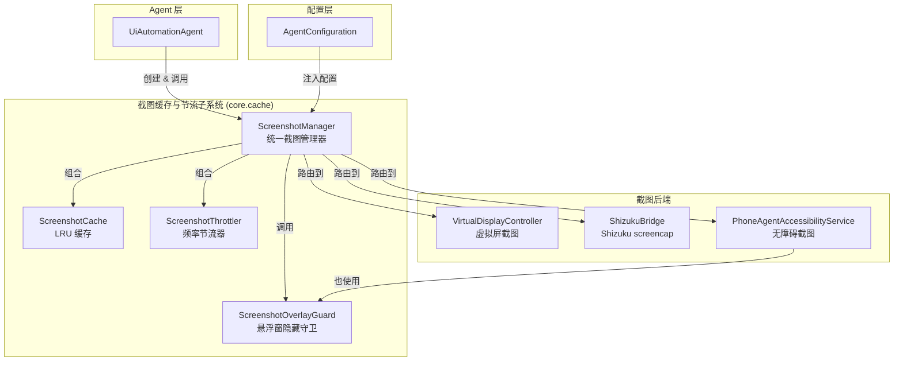
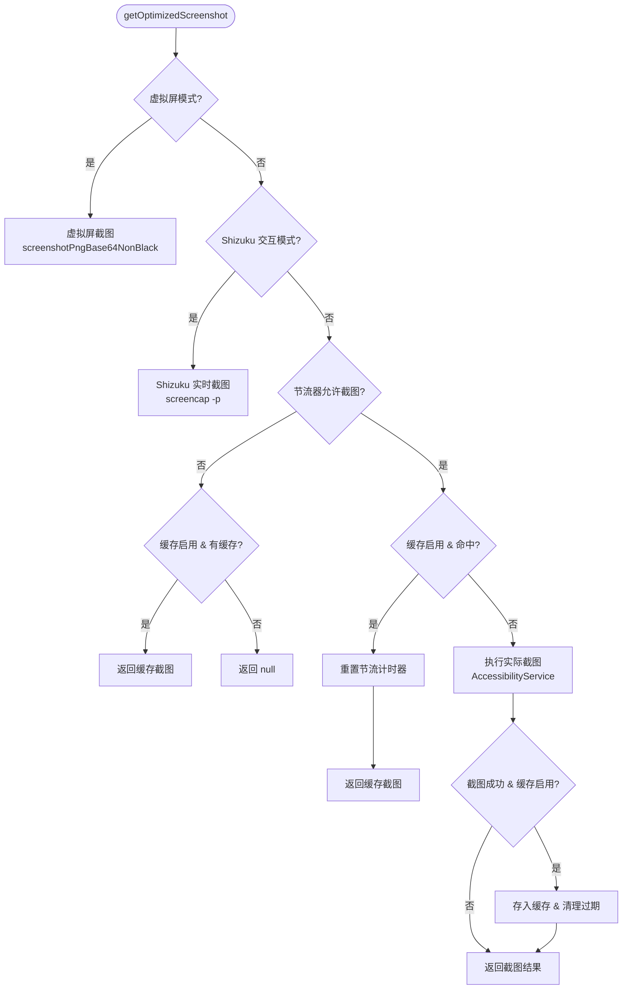
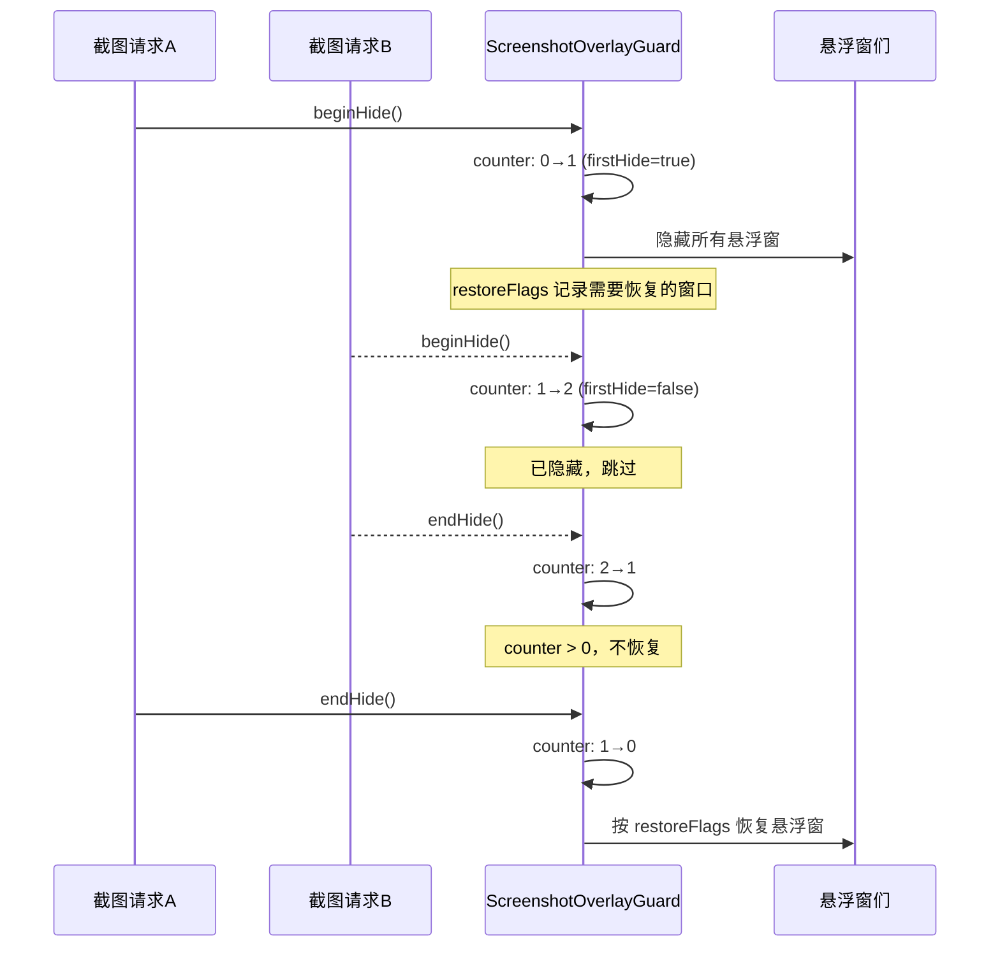

# 截图缓存与节流

Aries AI 截图缓存与节流子系统，通过 LRU 缓存、频率节流、悬浮窗隐藏和多种截图后端协同工作，在保障截图时效性的同时，大幅降低截图对系统性能的影响。

## 概述

在 UI 自动化流程中，每次 Agent 决策周期都需要采集当前屏幕截图作为模型推理的输入。如果每步都执行完整的截图→压缩→Base64 编码流程，会对 CPU、内存和 IO 产生显著压力，同时频繁截图也可能导致设备发热和卡顿。

截图缓存与节流子系统通过以下四个核心组件协同解决上述问题：

| 组件 | 职责 | 设计意图 |
|------|------|----------|
| `ScreenshotCache` | LRU 缓存管理器 | 同一页面短时间内的重复截图直接复用，避免不必要的截取开销 |
| `ScreenshotThrottler` | 截图频率节流器 | 强制最小截图间隔，防止高频截屏拖慢系统 |
| `ScreenshotManager` | 统一截图入口 | 整合缓存、节流、压缩和多后端（虚拟屏/Shizuku/无障碍服务）路由 |
| `ScreenshotOverlayGuard` | 悬浮窗隐藏守卫 | 截图前自动隐藏所有悬浮窗，确保截取的画面纯净无干扰 |

这些组件位于 `com.ai.phoneagent.core.cache` 包下，由 `UiAutomationAgent` 在每次任务开始时创建并管理生命周期。

## 架构



**架构说明：**

- `ScreenshotManager` 是整个子系统的门面（Facade），对外暴露 `getOptimizedScreenshot()` 统一入口
- 它内部组合了 `ScreenshotCache` 和 `ScreenshotThrottler`，按"节流→缓存→截图"的策略链处理每次请求
- 截图后端有三种：虚拟屏（后台隔离执行）、Shizuku（`screencap -p` 命令）和无障碍服务（`takeScreenshot` API）
- `ScreenshotOverlayGuard` 被 `ScreenshotManager` 和 `PhoneAgentAccessibilityService` 共同使用，采用引用计数保证并发安全
- 所有配置参数由 `AgentConfiguration` 统一管理，实现"默认可用、按需调优"的设计原则

## ScreenshotManager — 统一截图管理器

`ScreenshotManager` 是截图缓存与节流子系统的核心协调者，负责整合所有截图相关优化策略，对外提供统一的截图获取接口。

> Source: [ScreenshotManager.kt](https://github.com/ZG0704666/Aries-AI/blob/main/app/src/main/java/com/ai/phoneagent/core/cache/ScreenshotManager.kt)

### 截图获取流程

每次调用 `getOptimizedScreenshot()` 时，按以下优先级链式处理：



**关键设计决策：**

1. **虚拟屏模式优先**：如果启用了后台虚拟屏，直接走虚拟屏截图路径，使用 `ScreenshotOverlayGuard.withOverlaysHidden(hideDelayMs = 0L)` 确保截图纯净

2. **Shizuku 路径不使用缓存和节流**：因为 Shizuku 截图每次都是实时 `screencap -p`，且窗口事件可能缺失或不更新，使用缓存反而可能返回陈旧截图

3. **节流挡不住时尝试缓存**：当节流器拦截但缓存有有效数据时，仍然返回缓存结果——这是一种优雅降级策略

4. **缓存命中时重置节流器**：如果返回了缓存数据，重置节流计时器，避免因节流拒绝导致的`null`返回影响后续步骤

### 缓存键生成策略

```kotlin
fun generateKey(packageName: String, windowEventTime: Long): String {
    // 将时间戳按500ms分组，减少缓存键的变化频率
    val timeSlot = (windowEventTime / 500) * 500
    return "${packageName}_${timeSlot}"
}
```

> Source: [ScreenshotCache.kt](https://github.com/ZG0704666/Aries-AI/blob/main/app/src/main/java/com/ai/phoneagent/core/cache/ScreenshotCache.kt#L105-L109)

缓存键由**应用包名** + **窗口事件时间槽（500ms 粒度）**组成。500ms 时间槽的设计巧妙地在"缓存命中率"和"画面变化感知"之间取得平衡——同一应用在 500ms 内的窗口变化视为同一页面状态，可安全复用截图。

## ScreenshotCache — LRU 缓存管理器

`ScreenshotCache` 实现了一个带 TTL（生存时间）的 LRU 缓存，避免短时间内对同一页面重复截图。

> Source: [ScreenshotCache.kt](https://github.com/ZG0704666/Aries-AI/blob/main/app/src/main/java/com/ai/phoneagent/core/cache/ScreenshotCache.kt)

### 核心实现

缓存底层使用 `LinkedHashMap` 的 access-order 模式实现 LRU 淘汰策略：

```kotlin
class ScreenshotCache(
    private val maxSize: Int = 3,           // 最大缓存条目数
    private val ttlMs: Long = 2000L         // 缓存过期时间（2秒）
) {
    private data class CacheEntry(
        val screenshot: Any,
        val timestamp: Long
    )

    // LRU缓存实现 — access-order LinkedHashMap
    private val cache = object : LinkedHashMap<String, CacheEntry>(16, 0.75f, true) {
        override fun removeEldestEntry(eldest: MutableMap.MutableEntry<String, CacheEntry>?): Boolean {
            return size > maxSize
        }
    }
}
```

> Source: [ScreenshotCache.kt](https://github.com/ZG0704666/Aries-AI/blob/main/app/src/main/java/com/ai/phoneagent/core/cache/ScreenshotCache.kt#L9-L24)

**设计要点：**

- `LinkedHashMap` 构造参数 `accessOrder = true` 确保每次访问都会将条目移到链表尾部，实现真正的 LRU
- `removeEldestEntry` 重写使得缓存大小超过 `maxSize` 时自动移除最久未使用的条目
- `CacheEntry` 携带时间戳，用于 TTL 过期检查
- 所有公共方法使用 `@Synchronized` 注解保证线程安全

### 缓存生命周期

```kotlin
// 获取：检查过期 → 命中返回/过期移除返回null
@Synchronized
fun get(key: String): Any? {
    val entry = cache[key] ?: return null
    val currentTime = System.currentTimeMillis()
    if (currentTime - entry.timestamp > ttlMs) {
        cache.remove(key)
        return null
    }
    return entry.screenshot
}

// 存储：记录当前时间戳
@Synchronized
fun put(key: String, screenshot: Any) {
    cache[key] = CacheEntry(screenshot, System.currentTimeMillis())
}

// 批量清理过期条目
@Synchronized
fun evictExpired() {
    val currentTime = System.currentTimeMillis()
    val iterator = cache.iterator()
    while (iterator.hasNext()) {
        val entry = iterator.next()
        if (currentTime - entry.value.timestamp > ttlMs) {
            iterator.remove()
        }
    }
}
```

> Source: [ScreenshotCache.kt](https://github.com/ZG0704666/Aries-AI/blob/main/app/src/main/java/com/ai/phoneagent/core/cache/ScreenshotCache.kt#L31-L88)

**TTL 设计考量：** 默认 2000ms 的 TTL 是经验值——太短则缓存命中率低，太长则可能在 UI 已变化时仍返回旧截图，导致模型做出错误判断。测试模式下 TTL 缩减为 1000ms。

## ScreenshotThrottler — 截图频率节流器

`ScreenshotThrottler` 强制最小截图间隔，防止短时间内频繁截图导致系统性能下降。

> Source: [ScreenshotThrottler.kt](https://github.com/ZG0704666/Aries-AI/blob/main/app/src/main/java/com/ai/phoneagent/core/cache/ScreenshotThrottler.kt)

```kotlin
class ScreenshotThrottler(
    private val minIntervalMs: Long = 1100L    // 最小间隔时间（1.1秒）
) {
    @Volatile
    private var lastScreenshotTime: Long = 0L

    @Synchronized
    fun canTakeScreenshot(): Boolean {
        val currentTime = System.currentTimeMillis()
        val timeSinceLastScreenshot = currentTime - lastScreenshotTime
        if (timeSinceLastScreenshot >= minIntervalMs) {
            lastScreenshotTime = currentTime
            return true
        }
        return false
    }

    @Synchronized
    fun getRemainingWaitTime(): Long {
        val currentTime = System.currentTimeMillis()
        return (minIntervalMs - (currentTime - lastScreenshotTime)).coerceAtLeast(0L)
    }
}
```

> Source: [ScreenshotThrottler.kt](https://github.com/ZG0704666/Aries-AI/blob/main/app/src/main/java/com/ai/phoneagent/core/cache/ScreenshotThrottler.kt#L9-L45)

**设计要点：**

- 默认间隔 1.1 秒，结合 Agent 每步约 1.8 秒的平均响应时间，确保不会在同一 UI 状态上浪费截图
- `canTakeScreenshot()` 在检查通过的同时更新 `lastScreenshotTime`，避免竞态条件
- `getRemainingWaitTime()` 允许调用方在不消耗节流配额的情况下查询剩余等待时间
- `reset()` 方法用于特殊场景（如任务开始/结束、修复流程）强制重置

## ScreenshotOverlayGuard — 悬浮窗隐藏守卫

`ScreenshotOverlayGuard` 确保在截图期间所有悬浮窗（自动化覆盖层、进度指示器、悬浮聊天等）都被临时隐藏。

> Source: [ScreenshotOverlayGuard.kt](https://github.com/ZG0704666/Aries-AI/blob/main/app/src/main/java/com/ai/phoneagent/core/cache/ScreenshotOverlayGuard.kt)

### 并发安全保障

采用**原子引用计数**机制支持嵌套调用：



**关键实现细节：**

```kotlin
object ScreenshotOverlayGuard {
    private val hideCounter = AtomicInteger(0)
    private const val STUCK_HIDE_TIMEOUT_MS = 10_000L

    suspend fun <T> withOverlaysHidden(
        hideDelayMs: Long = 80L,
        block: suspend () -> T
    ): T {
        var hideStarted = false
        val firstHide = runCatching {
            hideStarted = true
            beginHide()
        }.getOrElse { false }

        return try {
            if (firstHide && hideDelayMs > 0L) {
                delay(hideDelayMs)  // 等待悬浮窗完全隐藏
            }
            block()
        } finally {
            if (hideStarted) {
                runCatching { endHide() }
            }
        }
    }
}
```

> Source: [ScreenshotOverlayGuard.kt](https://github.com/ZG0704666/Aries-AI/blob/main/app/src/main/java/com/ai/phoneagent/core/cache/ScreenshotOverlayGuard.kt#L26-L51)

**设计考量：**

- `delay(hideDelayMs)` 默认 80ms，等待悬浮窗动画完成后再截图，避免截到半透明的残影
- `recoverIfStuck()` 机制：如果 `beginHide` 后超过 10 秒未调用 `endHide`（异常场景），强制恢复所有悬浮窗，防止 UI 永久不可见
- 三种悬浮窗分别追踪恢复标志：`AutomationOverlay`、`UIAutomationProgressOverlay`、`FloatingChatService`
- 每个恢复操作都有独立的 `runCatching` 保护，一个窗口恢复失败不影响其他窗口

## 截图压缩

截图在实际执行时经过多层压缩，确保发送给模型的数据量可控：

| 压缩环节 | 参数 | 默认值 | 说明 |
|----------|------|--------|------|
| 分辨率缩放 | `SCREENSHOT_SCALE_PERCENT` | 75% | 将原始分辨率缩放到 75%，减少像素数量 |
| JPEG 压缩 | `SCREENSHOT_QUALITY` | 85 | JPEG 质量参数（0-100），85 在质量和体积间取得平衡 |
| 格式选择 | `USE_JPEG_COMPRESSION` | true | 使用 JPEG 而非 PNG，体积大幅减小 |
| 配置缩放 | `screenshotScalePercent` | 80 | AgentConfiguration 中的可配置缩放比例 |

> Source: [PhoneAgentAccessibilityService.kt](https://github.com/ZG0704666/Aries-AI/blob/main/app/src/main/java/com/ai/phoneagent/PhoneAgentAccessibilityService.kt#L51-L54) — 截图压缩常量

通过 75% 缩放 + JPEG 85% 质量，平均截图大小从原始约 250KB 压缩到约 85KB（降幅 66%），在保证模型可识别的前提下大幅减少了 API 调用中的图片数据传输量。

## 与 Agent 主循环的集成

`ScreenshotManager` 由 `UiAutomationAgent` 在任务初始化时创建，并在每一步循环中调用：

```kotlin
// 初始化截图管理器
screenshotManager = ScreenshotManager(config)

// 每步循环中获取优化后的截图
val screenshot = screenshotManager?.getOptimizedScreenshot(service)
```

> Source: [UiAutomationAgent.kt](https://github.com/ZG0704666/Aries-AI/blob/main/app/src/main/java/com/ai/phoneagent/UiAutomationAgent.kt#L125-L275)

任务结束时清理所有缓存和节流状态：

```kotlin
screenshotManager?.clear()  // 内部同时清理缓存和重置节流器
```

> Source: [UiAutomationAgent.kt](https://github.com/ZG0704666/Aries-AI/blob/main/app/src/main/java/com/ai/phoneagent/UiAutomationAgent.kt#L213)

`clear()` 方法在 `Mutex` 保护下同时清空缓存和重置节流器，确保下一次任务从干净状态开始。

## 配置选项

所有截图缓存与节流相关的配置均通过 `AgentConfiguration` 管理：

| 配置项 | 类型 | 默认值 | 说明 |
|--------|------|--------|------|
| `enableScreenshotCache` | Boolean | `true` | 是否启用截图缓存。关闭后每次都会执行实际截图 |
| `enableScreenshotThrottle` | Boolean | `true` | 是否启用截图节流。关闭后不限制截图频率 |
| `screenshotCacheMaxSize` | Int | `3` | 缓存最大条目数。通常 2-4 可覆盖"当前页/上一步页" |
| `screenshotCacheTtlMs` | Long | `2000` | 缓存过期时间（毫秒）。短 TTL 避免 UI 变化时复用旧截图 |
| `screenshotThrottleMinIntervalMs` | Long | `1100` | 截图最小间隔（毫秒）。过小可能造成卡顿/发热 |
| `screenshotCompressionQuality` | Int | `85` | 截图压缩质量（0-100）。值越大越清晰但体积更大 |
| `screenshotMaxSizeKB` | Int | `150` | 截图目标最大体积（KB）。超过时会降低质量或缩放 |
| `screenshotScalePercent` | Int | `80` | 截图缩放比例（百分比）。缩小可降低体积与 token 消耗 |
| `screenshotOverlayHideDelayMs` | Long | `80` | 截图前隐藏悬浮窗的延迟（毫秒），防止悬浮窗被截入画面 |
| `screenshotQuality` | Int | `85` | 截图编码质量（与 `screenshotCompressionQuality` 类似，保留兼容） |

> Source: [AgentConfiguration.kt](https://github.com/ZG0704666/Aries-AI/blob/main/app/src/main/java/com/ai/phoneagent/core/config/AgentConfiguration.kt#L182-L345)

### 测试配置

测试模式下使用更激进的参数以加快测试速度：

```kotlin
val TEST = AgentConfiguration(
    maxSteps = 10,
    stepDelayMs = 50L,
    maxModelRetries = 1,
    screenshotThrottleMinIntervalMs = 500L,   // 更短的节流间隔
    screenshotCacheTtlMs = 1000L,              // 更短的缓存 TTL
)
```

> Source: [AgentConfiguration.kt](https://github.com/ZG0704666/Aries-AI/blob/main/app/src/main/java/com/ai/phoneagent/core/config/AgentConfiguration.kt#L366-L372)

## 使用示例

### 基本使用 — 默认配置

```kotlin
// 使用默认配置，缓存和节流均启用
val config = AgentConfiguration(
    maxSteps = 100,
    screenshotCompressionQuality = 85,
    enableScreenshotCache = true,
    useStreamingWithEarlyStop = true
)
val screenshotManager = ScreenshotManager(config)
val screenshot = screenshotManager.getOptimizedScreenshot(service)
```

> Source: [README.md](https://github.com/ZG0704666/Aries-AI/blob/main/README.md#L143-L148)

### 获取缓存与节流状态

```kotlin
// 获取缓存与节流的运行时状态
val status = screenshotManager.getCacheStatus()
// 返回示例：
// {
//   "cacheStats": {"size": 2, "maxSize": 3},
//   "throttleStatus": {
//     "lastScreenshotTime": 1700000000000,
//     "timeSinceLastScreenshot": 500,
//     "remainingWaitTime": 600,
//     "minIntervalMs": 1100
//   },
//   "config": {"cacheEnabled": true, "throttleEnabled": true}
// }
```

> Source: [ScreenshotManager.kt](https://github.com/ZG0704666/Aries-AI/blob/main/app/src/main/java/com/ai/phoneagent/core/cache/ScreenshotManager.kt#L195-L205)

### 禁用缓存和节流（调试场景）

```kotlin
val debugConfig = AgentConfiguration(
    enableScreenshotCache = false,
    enableScreenshotThrottle = false
)
// 每次调用都会执行实际截图，不做任何缓存或节流
val manager = ScreenshotManager(debugConfig)
```

### 直接使用 ScreenshotCache

```kotlin
val cache = ScreenshotCache(maxSize = 3, ttlMs = 2000L)

// 生成缓存键
val key = cache.generateKey("com.example.app", System.currentTimeMillis())

// 存储截图
cache.put(key, screenshotData)

// 获取截图（自动检查过期）
val cached = cache.get(key)

// 手动清理过期条目
cache.evictExpired()

// 查看缓存统计
val stats = cache.getStats()  // {"size": 1, "maxSize": 3}
```

> Source: [ScreenshotCache.kt](https://github.com/ZG0704666/Aries-AI/blob/main/app/src/main/java/com/ai/phoneagent/core/cache/ScreenshotCache.kt)

## API 参考

### `ScreenshotManager`

| 方法 | 签名 | 说明 |
|------|------|------|
| `getOptimizedScreenshot` | `suspend fun getOptimizedScreenshot(service: PhoneAgentAccessibilityService?): ScreenshotData?` | 获取优化后的截图，依次经过虚拟屏检测→节流→缓存→实际截图流程 |
| `clear` | `suspend fun clear()` | 清理截图缓存并重置节流器 |
| `getCacheStatus` | `fun getCacheStatus(): Map<String, Any>` | 获取缓存统计、节流状态和配置信息 |

### `ScreenshotCache`

| 方法 | 签名 | 说明 |
|------|------|------|
| `get` | `@Synchronized fun get(key: String): Any?` | 获取缓存截图，过期返回 null |
| `put` | `@Synchronized fun put(key: String, screenshot: Any)` | 存储截图到缓存 |
| `clear` | `@Synchronized fun clear()` | 清空所有缓存 |
| `evictExpired` | `@Synchronized fun evictExpired()` | 移除所有过期条目 |
| `generateKey` | `fun generateKey(packageName: String, windowEventTime: Long): String` | 基于包名和时间槽生成缓存键 |
| `getStats` | `@Synchronized fun getStats(): Map<String, Int>` | 获取缓存统计（条目数/最大容量） |

### `ScreenshotThrottler`

| 方法 | 签名 | 说明 |
|------|------|------|
| `canTakeScreenshot` | `@Synchronized fun canTakeScreenshot(): Boolean` | 检查是否可截图（同时更新时间戳） |
| `getRemainingWaitTime` | `@Synchronized fun getRemainingWaitTime(): Long` | 获取还需等待的毫秒数 |
| `reset` | `@Synchronized fun reset()` | 强制重置节流计时器 |
| `getStatus` | `@Synchronized fun getStatus(): Map<String, Any>` | 获取节流器状态信息 |

### `ScreenshotOverlayGuard`

| 方法 | 签名 | 说明 |
|------|------|------|
| `withOverlaysHidden` | `suspend fun <T> withOverlaysHidden(hideDelayMs: Long = 80L, block: suspend () -> T): T` | 在悬浮窗隐藏期间执行 block，执行完毕后自动恢复 |

## 相关链接

- [ScreenshotCache 源码](https://github.com/ZG0704666/Aries-AI/blob/main/app/src/main/java/com/ai/phoneagent/core/cache/ScreenshotCache.kt)
- [ScreenshotManager 源码](https://github.com/ZG0704666/Aries-AI/blob/main/app/src/main/java/com/ai/phoneagent/core/cache/ScreenshotManager.kt)
- [ScreenshotThrottler 源码](https://github.com/ZG0704666/Aries-AI/blob/main/app/src/main/java/com/ai/phoneagent/core/cache/ScreenshotThrottler.kt)
- [ScreenshotOverlayGuard 源码](https://github.com/ZG0704666/Aries-AI/blob/main/app/src/main/java/com/ai/phoneagent/core/cache/ScreenshotOverlayGuard.kt)
- [AgentConfiguration 配置定义](https://github.com/ZG0704666/Aries-AI/blob/main/app/src/main/java/com/ai/phoneagent/core/config/AgentConfiguration.kt)
- [UiAutomationAgent — 主 Agent 循环](https://github.com/ZG0704666/Aries-AI/blob/main/app/src/main/java/com/ai/phoneagent/UiAutomationAgent.kt)
- [PhoneAgentAccessibilityService — 无障碍截图实现](https://github.com/ZG0704666/Aries-AI/blob/main/app/src/main/java/com/ai/phoneagent/PhoneAgentAccessibilityService.kt)
- [VirtualDisplayController — 虚拟屏非黑帧截图](https://github.com/ZG0704666/Aries-AI/blob/main/app/src/main/java/com/ai/phoneagent/VirtualDisplayController.kt)
- [单元测试 — CoreModuleTest](https://github.com/ZG0704666/Aries-AI/blob/main/app/src/test/java/com/ai/phoneagent/core/CoreModuleTest.kt)
