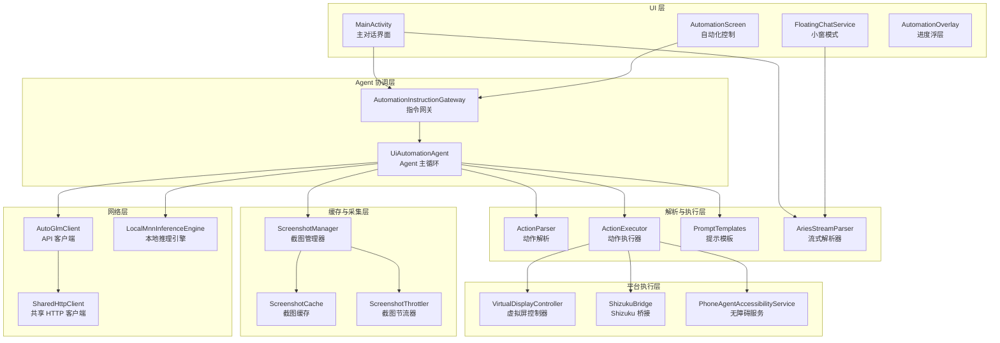
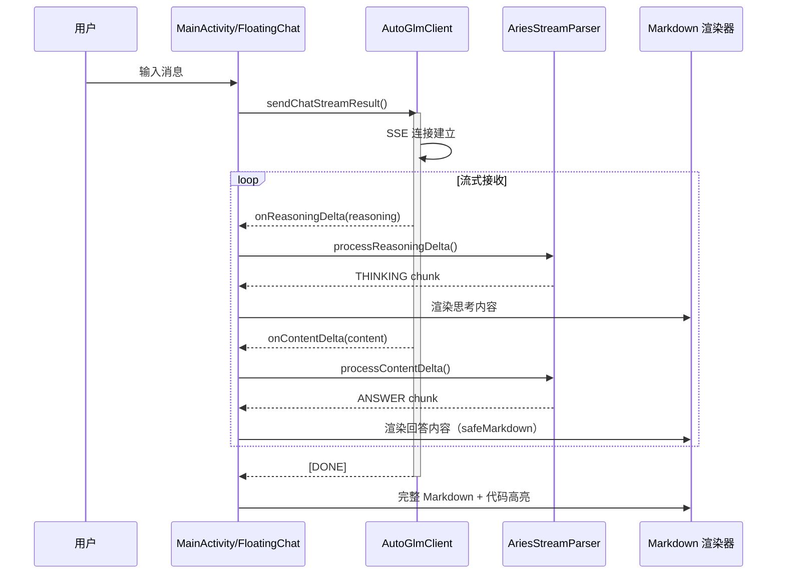
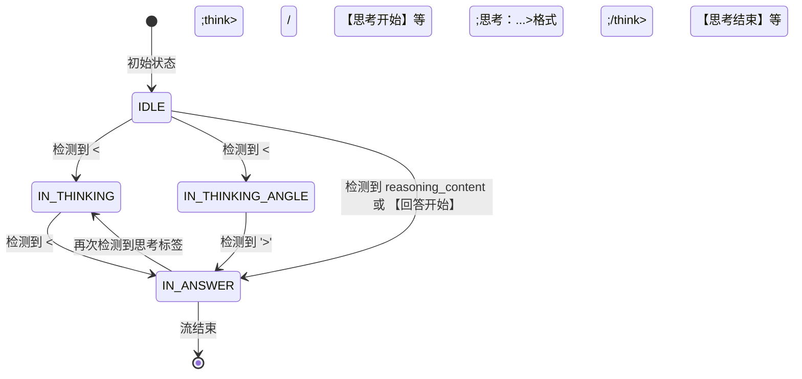
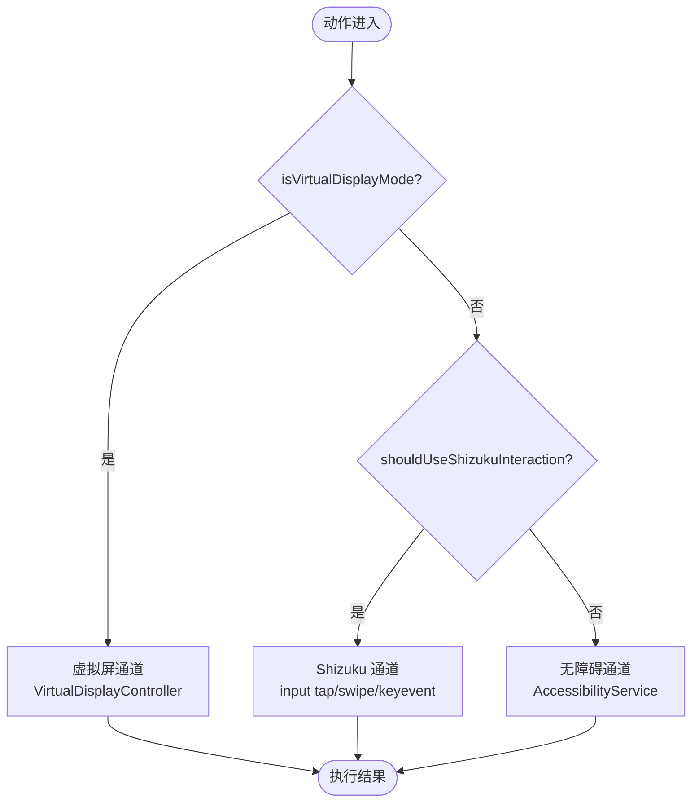
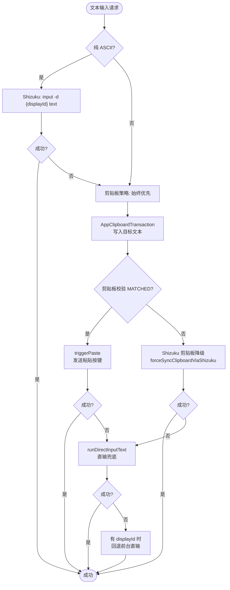
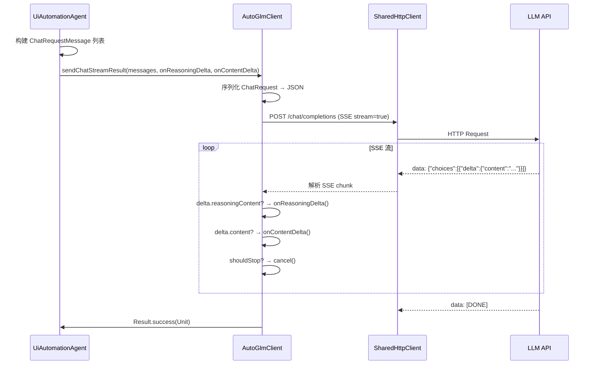
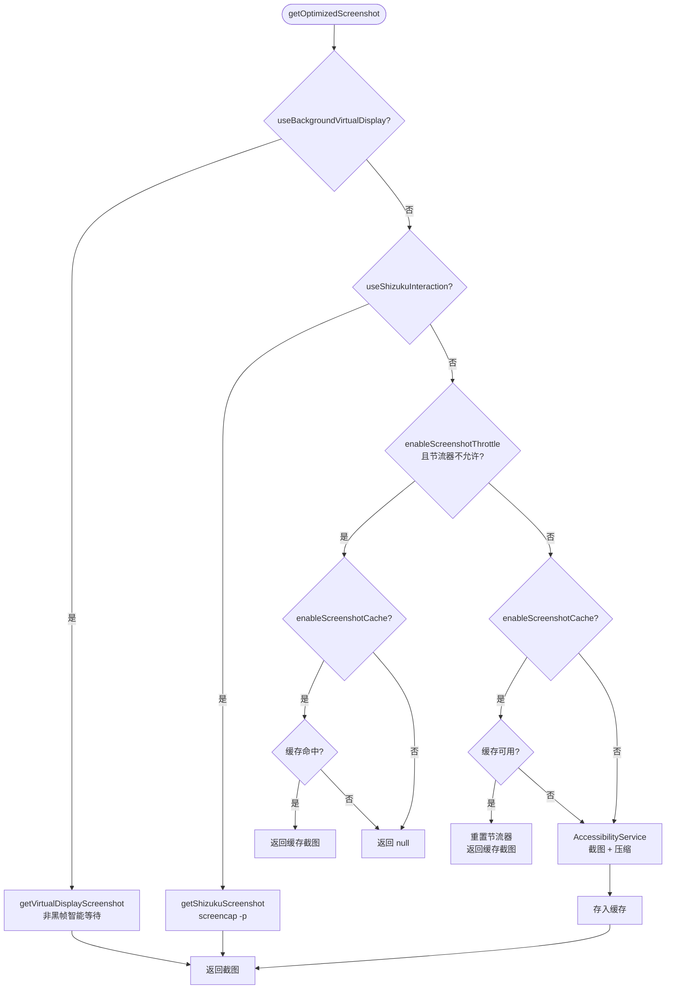
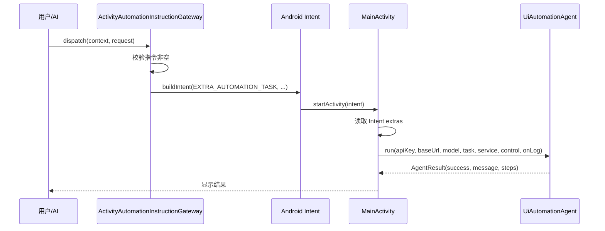
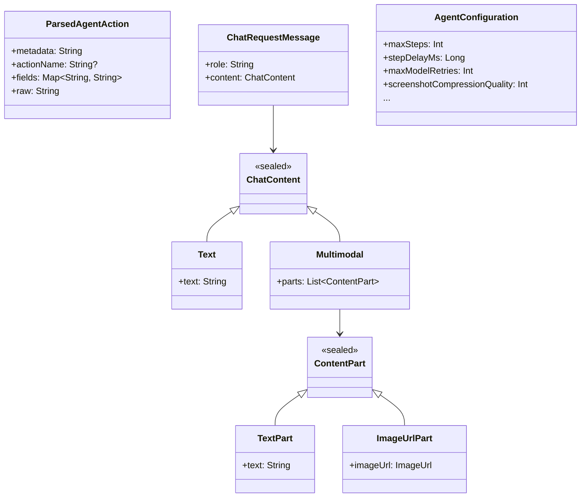

# 数据流与核心链路

本文档详细介绍 Aries AI 的核心数据流架构，涵盖对话处理、自动化 Agent 主循环、动作执行三级通道、模型网络交互、截图采集链路和流式 Markdown 渲染六大核心链路。

## 概述

Aries AI 的数据流设计遵循 **"分层解耦、通道隔离、流式驱动"** 三大原则：

- **分层解耦**：配置层 → 解析层 → 执行层 → 缓存层，各层职责单一，互不侵入
- **通道隔离**：动作执行划分为虚拟屏、Shizuku、无障碍服务三级通道，按环境自动选择
- **流式驱动**：模型输出采用 SSE 流式接收 + 边接收边解析（早停机制），UI 渲染采用三层缓冲模型

> Source: [UiAutomationAgent.kt](https://github.com/ZG0704666/Aries-AI/blob/main/app/src/main/java/com/ai/phoneagent/UiAutomationAgent.kt#L45-L60)

---

## 架构总览



> 架构图展示了 Aries AI 从 UI 层到平台执行层的完整分层结构。数据从 `MainActivity` / `FloatingChatService` 进入，经 `UiAutomationAgent` 协调各组件完成自动化流程，最终通过三级执行通道（虚拟屏 → Shizuku → 无障碍服务）落地到平台操作。

---

## 核心链路一：对话处理数据流

### 1.1 流式对话链路

对话系统采用 **SSE 流式接收 → 分层缓冲 → Markdown 安全渲染** 的链路设计。



> Source: [AutoGlmClient.kt](https://github.com/ZG0704666/Aries-AI/blob/main/app/src/main/java/com/ai/phoneagent/net/AutoGlmClient.kt#L207-L345)

### 1.2 流式解析器状态机

`AriesStreamParser` 通过有限状态机管理思考内容与回答内容的分离，支持多种标签格式：



> Source: [AriesStreamParser.kt](https://github.com/ZG0704666/Aries-AI/blob/main/app/src/main/java/com/ai/phoneagent/helper/AriesStreamParser.kt#L51-L56)

### 1.3 流式 Markdown 三层缓冲模型

流式阶段的 Markdown 渲染采用三层文本模型，避免"裸 Markdown→最终 Markdown"的两阶段视觉跳动：

| 层级 | 作用 | 是否持久化 |
|------|------|------------|
| **raw buffer** | 保存模型原始增量输出 | 是 |
| **render preview** | 按节流节拍推进 UI 可见内容 | 否 |
| **safe Markdown** | 对未闭合 Markdown 做临时补全后交给 Compose 渲染 | 否 |

关键策略：
- 首包前只显示简洁省略号
- 普通文本按字符阈值、换行、标点或 Markdown 结构边界推进，避免逐 token 重组
- 未闭合代码块临时补全 fence，使流式阶段也保持代码块形态
- 流式阶段**禁用代码高亮异步重算**，最终消息再启用完整 `CodeBlock` 高亮和工具栏

> 来源: [Aries AI 开发文档.md](https://github.com/ZG0704666/Aries-AI/blob/main/Aries%20AI%20%E5%BC%80%E5%8F%91%E6%96%87%E6%A1%A3.md#L659-L676)

---

## 核心链路二：自动化 Agent 主循环

### 2.1 Agent 主循环流程

`UiAutomationAgent.run()` 是整个自动化系统的核心协调器，管理从任务接收到完成的完整数据流。

```mermaid
flowchart TD
    Start([任务输入]) --> Init[初始化配置与组件]
    Init --> VdCheck{虚拟屏模式?}
    VdCheck -->|是| PrepareVD[准备虚拟屏\nprepareForTask]
    VdCheck -->|否| SmartLaunch[智能应用预启动\ntrySmartAppLaunch]
    PrepareVD --> SmartLaunch

    SmartLaunch --> StepLoop{step <= maxSteps?}
    
    StepLoop -->|是| Collect[ScreenshotManager.getOptimizedScreenshot\n+ UI 树采集]
    Collect --> BuildMsg[构建 User 消息\n截图(base64) + UI树 + screenInfo]
    BuildMsg --> TrimHistory[trimHistory\n上下文裁剪]
    TrimHistory --> CallModel[requestModelWithRetry\n调用模型 API]
    CallModel --> Parse{模型成功返回?}

    Parse -->|失败| StepFail([返回失败])
    Parse -->|成功| ParseAction[ActionParser.parseWithThinking\n分离思考与回答]
    ParseAction --> ActionCheck{action.metadata?}

    ActionCheck -->|finish| Success([返回成功 + message])
    ActionCheck -->|do| Execute[ActionExecutor.execute\n执行动作]
    ActionCheck -->|unknown| Repair{修复次数 < maxParseRepairs?}
    Repair -->|是| FixModel[调用模型修正输出格式]
    Repair -->|否| ParseFail([解析失败])
    FixModel --> ParseAction

    Execute --> ExecOk{执行成功?}
    ExecOk -->|是| Wait[getActionDelayMs + stepDelayMs]
    ExecOk -->|否| ActionRepair{修复次数 < maxActionRepairs?}
    ActionRepair -->|是| FixAction[buildActionRepairPrompt\n让模型重新规划]
    ActionRepair -->|否| ExecFail([执行失败])
    FixAction --> CallModel

    Wait --> StepLoop

    StepLoop -->|否 (达到上限)| MaxSteps([达到最大步数限制])
```

> Source: [UiAutomationAgent.kt](https://github.com/ZG0704666/Aries-AI/blob/main/app/src/main/java/com/ai/phoneagent/UiAutomationAgent.kt#L110-L654)

### 2.2 每步核心操作详解

```kotlin
// Agent 主循环中每步的关键操作序列（简化自源码）：

// 1. 并行/串行采集截图和 UI 树
val screenshot = screenshotManager?.getOptimizedScreenshot(service)
val rawUiDump = /* 三选一: 虚拟屏视觉模式 / Shizuku UI树 / 无障碍UI树 */

// 2. 构建多模态消息（截图 + 文本）
val userContent: ChatContent = if (screenshot != null) {
    ChatContent.Multimodal(listOf(
        ContentPart.ImageUrlPart(ImageUrl("data:image/png;base64,...")),
        ContentPart.TextPart("${screenInfo}\n\nUI树：\n${uiDump}")
    ))
} else {
    ChatContent.Text(userMsg)
}

// 3. 上下文裁剪
trimHistory(history) // 按 token 数 + 轮数双重裁剪

// 4. 模型调用（支持重试 + 本地模型降级）
val replyResult = requestModelWithRetry(apiKey, baseUrl, model, messages, step, ...)

// 5. 解析动作
val (thinking, answer) = actionParser.parseWithThinking(finalReply)
val action = parseActionWithRepair(...)

// 6. 执行动作 + 动作级修复
execOk = actionExecutor.execute(action, service, uiDump, screenW, screenH, onLog)

// 7. 延迟等待
delay(config.stepDelayMs + config.getActionDelayMs(actionName))
```

> Source: [UiAutomationAgent.kt](https://github.com/ZG0704666/Aries-AI/blob/main/app/src/main/java/com/ai/phoneagent/UiAutomationAgent.kt#L223-L651)

### 2.3 上下文裁剪策略

`trimHistory()` 实现三级裁剪策略，确保上下文不超出模型限制：

1. **图片剥离**：将历史消息中的 `ChatContent.Multimodal` 转换为纯 `ChatContent.Text`，释放大量 token
2. **Token 裁剪**：当估算 token 数超过 `maxContextTokens`（默认 20000），从最早的非 system 消息开始成对移除
3. **轮数裁剪**：按 `maxHistoryTurns`（默认 6）保留最近 N 轮对话

```kotlin
// Token 裁剪逻辑
while (history.size > 2 &&
    ActionUtils.estimateHistoryTokens(history) > config.maxContextTokens) {
    val removeIndex = history.indexOfFirst { it.role != "system" }
    if (removeIndex >= 0) {
        history.removeAt(removeIndex)
        if (removeIndex < history.size && history[removeIndex].role == "assistant") {
            history.removeAt(removeIndex)
        }
    } else break
}
```

> Source: [UiAutomationAgent.kt](https://github.com/ZG0704666/Aries-AI/blob/main/app/src/main/java/com/ai/phoneagent/UiAutomationAgent.kt#L1206-L1251)

---

## 核心链路三：动作执行三级通道

### 3.1 通道选择策略

`ActionExecutor` 按优先级选择执行通道，每个动作类型（tap/swipe/type/launch/back/home）都遵循统一的路由逻辑：



> Source: [ActionExecutor.kt](https://github.com/ZG0704666/Aries-AI/blob/main/app/src/main/java/com/ai/phoneagent/core/executor/ActionExecutor.kt#L62-L78)

### 3.2 动作类型分发

```kotlin
// 动作分发核心路由表
return when (nameKey) {
    "launch", "open_app", "start_app" -> executeLaunch(action, service, onLog)
    "back"                             -> executeBack(service, onLog)
    "home"                             -> executeHome(service, onLog)
    "wait", "sleep"                    -> executeWait(action, onLog)
    "type", "input", "text", "type_name" -> executeType(action, service, uiDump, screenW, screenH, onLog)
    "tap", "click", "press"            -> executeTap(action, service, uiDump, screenW, screenH, onLog)
    "longpress", "long_press"          -> executeLongPress(action, service, screenW, screenH, onLog)
    "doubletap", "double_tap"          -> executeDoubleTap(action, service, screenW, screenH, onLog)
    "swipe", "scroll"                  -> executeSwipe(action, service, screenW, screenH, onLog)
    "take_over", "takeover"            -> executeTakeOver(action, onLog)
    "finish"                           -> true
    else                               -> false
}
```

> Source: [ActionExecutor.kt](https://github.com/ZG0704666/Aries-AI/blob/main/app/src/main/java/com/ai/phoneagent/core/executor/ActionExecutor.kt#L171-L211)

### 3.3 文本输入策略（虚拟屏场景）

虚拟屏模式下的文本输入采用**三级降级策略**：



> Source: [ActionExecutor.kt](https://github.com/ZG0704666/Aries-AI/blob/main/app/src/main/java/com/ai/phoneagent/core/executor/ActionExecutor.kt#L1014-L1052)

### 3.4 Tap+Type 合并执行优化

当检测到连续 tap → type 操作时，`UiAutomationAgent` 会合并执行以减少操作步数和延迟：

```kotlin
// 合并执行检测逻辑
val isTypeAction = actionName == "type" || actionName == "input" || actionName == "text"
val wasPreviousTap = lastActionWasTap
val shouldCombineTapAndType = isTypeAction && wasPreviousTap &&
    (config.useShizukuInteraction || config.useBackgroundVirtualDisplay)

if (shouldCombineTapAndType) {
    // 合并执行: 先注入点击聚焦输入框，再注入文本
    executeTapAndTypeCombined(service, tapAction, typeAction, uiDump, screenW, screenH, onLog)
}
```

> Source: [UiAutomationAgent.kt](https://github.com/ZG0704666/Aries-AI/blob/main/app/src/main/java/com/ai/phoneagent/UiAutomationAgent.kt#L469-L528)

合并执行可实现约 20% 的操作步数减少和 15% 的执行时间节省。

---

## 核心链路四：模型网络交互

### 4.1 API 请求链路



> Source: [AutoGlmClient.kt](https://github.com/ZG0704666/Aries-AI/blob/main/app/src/main/java/com/ai/phoneagent/net/AutoGlmClient.kt#L207-L345)

### 4.2 共享 HTTP 客户端

`SharedHttpClient` 提供两种 HTTP 客户端实例：

| 实例 | 连接超时 | 读取超时 | 写入超时 | 总超时 | 用途 |
|------|---------|---------|---------|--------|------|
| `instance` | 60s | 300s | 120s | 360s | 流式对话、长模型响应 |
| `fastInstance` | 10s | 25s | 25s | 30s | 自动化场景、API 健康检查 |

两者共享连接池（10 连接，5 分钟 keep-alive），支持 HTTP/2 协议。

> Source: [AutoGlmClient.kt](https://github.com/ZG0704666/Aries-AI/blob/main/app/src/main/java/com/ai/phoneagent/net/AutoGlmClient.kt#L53-L103)

### 4.3 模型重试策略

`requestModelWithRetry` 实现带指数退避的模型调用重试：

```kotlin
// 重试核心逻辑
val maxAttempts = (config.maxModelRetries + 1).coerceAtLeast(1)  // 默认 4 次
for (attempt in 0 until maxAttempts) {
    val result = withContext(Dispatchers.IO) {
        if (useLocalModel) {
            LocalMnnInferenceEngine.sendChatResult(context, messages)
        } else {
            AutoGlmClient.sendChatResult(apiKey, baseUrl, messages, model, ...)
        }
    }
    if (result.isSuccess) return result

    val retryable = ActionUtils.isRetryableModelError(err)
    if (!retryable || attempt >= maxAttempts - 1) break

    val waitMs = ActionUtils.computeModelRetryDelayMs(attempt, config.modelRetryBaseDelayMs)
    delay(waitMs)
}
```

> Source: [UiAutomationAgent.kt](https://github.com/ZG0704666/Aries-AI/blob/main/app/src/main/java/com/ai/phoneagent/UiAutomationAgent.kt#L1136-L1196)

---

## 核心链路五：截图采集三级来源

### 5.1 ScreenshotManager 路由策略

`ScreenshotManager` 是截图采集的统一入口，按模式选择截图来源：



> Source: [ScreenshotManager.kt](https://github.com/ZG0704666/Aries-AI/blob/main/app/src/main/java/com/ai/phoneagent/core/cache/ScreenshotManager.kt#L51-L99)

### 5.2 三种截图来源对比

| 来源 | 方法 | 缓存 | 节流 | 适用场景 |
|------|------|------|------|---------|
| **虚拟屏** | `VirtualDisplayController.screenshotPngBase64NonBlack()` | 否 | 否 | 后台隔离执行（智能非黑帧检测） |
| **Shizuku** | `ShizukuBridge.execBytes("screencap -p")` | 否 | 否 | Shizuku 交互模式（实时截图） |
| **无障碍服务** | `AccessibilityService.tryCaptureScreenshotBase64()` | 是 | 是 | 前台无障碍模式（压缩优化） |

> Source: [ScreenshotManager.kt](https://github.com/ZG0704666/Aries-AI/blob/main/app/src/main/java/com/ai/phoneagent/core/cache/ScreenshotManager.kt#L101-L148)

---

## 核心链路六：自动化指令调度

### 6.1 指令网关

`AutomationInstructionGateway` 统一管理自动化任务的调度入口，支持手动触发和高级 AI 触发两种来源：



> Source: [AutomationInstructionGateway.kt](https://github.com/ZG0704666/Aries-AI/blob/main/app/src/main/java/com/ai/phoneagent/core/automation/AutomationInstructionGateway.kt#L29-L107)

### 6.2 AutomationMessageParser 标记系统

自动化执行日志和确认指令通过特殊标记（Marker）系统在对话中编码传输：

| 标记 | 格式 | 用途 |
|------|------|------|
| `AUTO_LOG_B64` | `[[AUTO_LOG_B64:base64]]` | 编码传输自动化执行日志行 |
| `AUTO_EXECUTE` | `[[AUTO_EXECUTE:指令]]` | 嵌入自动化执行指令 |
| `AUTO_CONFIRM` | `[[AUTO_CONFIRM:指令]]` | 需要用户确认的自动化操作 |
| `AUTO_CONFIRMED` | `[[AUTO_CONFIRMED]]` | 用户已确认 |
| `AUTO_REJECTED` | `[[AUTO_REJECTED]]` | 用户已拒绝 |

> Source: [AutomationMessageParser.kt](https://github.com/ZG0704666/Aries-AI/blob/main/app/src/main/java/com/ai/phoneagent/helper/AutomationMessageParser.kt#L39-L99)

---

## 数据模型与类型流转

### 7.1 核心类型系统



> Sources:
> - [AgentModels.kt](https://github.com/ZG0704666/Aries-AI/blob/main/app/src/main/java/com/ai/phoneagent/core/agent/AgentModels.kt#L7-L12)
> - [ChatModels.kt](https://github.com/ZG0704666/Aries-AI/blob/main/app/src/main/java/com/ai/phoneagent/net/ChatModels.kt#L20-L83)
> - [AgentConfiguration.kt](https://github.com/ZG0704666/Aries-AI/blob/main/app/src/main/java/com/ai/phoneagent/core/config/AgentConfiguration.kt#L38-L357)

### 7.2 动作解析流程

`ActionParser` 支持多种输出格式的解析：

1. **标准 `do(action=...)` 格式**：解析动作名和参数键值对
2. **`<answer>` XML 标签**：从 `<answer>...</answer>` 中提取
3. **`【回答开始】...【回答结束】` 中文标签**：兼容旧格式
4. **`<think>` 思考标签**：从 `<think>...</think>` / `【思考开始】...【思考结束】` 中分离

```kotlin
// ActionParser 核心解析逻辑
fun parse(raw: String): ParsedAgentAction {
    // 1. 检测截断迹象 (U+FFFD, "...", 长文本无动作)
    // 2. 尝试从 <answer> 标签提取
    // 3. 尝试从 【回答开始】【回答结束】 提取
    // 4. 兜底: 从最后一次 do( 或 finish( 位置开始解析
    return parseActionFromString(trimmed)
}
```

> Source: [ActionParser.kt](https://github.com/ZG0704666/Aries-AI/blob/main/app/src/main/java/com/ai/phoneagent/core/parser/ActionParser.kt#L33-L77)

---

## 配置参数说明

核心配置集中在 `AgentConfiguration`，以下为影响数据流的关键参数：

| 参数 | 类型 | 默认值 | 说明 |
|------|------|--------|------|
| `useBackgroundVirtualDisplay` | Boolean | false | 是否使用后台虚拟屏模式 |
| `useShizukuInteraction` | Boolean | false | 是否启用 Shizuku 交互（禁用无障碍回退） |
| `maxSteps` | Int | 100 | 单次任务最大执行步数 |
| `stepDelayMs` | Long | 160 | 每步间基础延迟 (ms) |
| `maxModelRetries` | Int | 3 | 模型调用最大重试次数 |
| `maxParseRepairs` | Int | 2 | 输出格式修复最大次数 |
| `maxActionRepairs` | Int | 1 | 动作执行修复最大次数 |
| `maxTokens` | Int? | 4096 | 模型单次回复上限 |
| `maxContextTokens` | Int | 20000 | 上下文 token 裁剪阈值 |
| `maxHistoryTurns` | Int | 6 | 最多保留对话轮数 |
| `useStreamingWithEarlyStop` | Boolean | true | 流式早停（识别到动作立即执行） |
| `parallelScreenshotAndUi` | Boolean | true | 并行采集截图与 UI 树 |
| `screenshotCompressionQuality` | Int | 85 | 截图 JPEG 压缩质量 (0-100) |
| `screenshotMaxSizeKB` | Int | 150 | 截图最大体积 (KB) |
| `enableScreenshotCache` | Boolean | true | 启用截图缓存 |
| `enableScreenshotThrottle` | Boolean | true | 启用截图节流 |

> Source: [AgentConfiguration.kt](https://github.com/ZG0704666/Aries-AI/blob/main/app/src/main/java/com/ai/phoneagent/core/config/AgentConfiguration.kt#L38-L357)

---

## 关键 API 参考

### `UiAutomationAgent.run()`

Agent 主入口，执行完整的自动化任务。

```kotlin
suspend fun run(
    apiKey: String,
    baseUrl: String,
    model: String,
    useThirdPartyApi: Boolean = false,
    task: String,
    service: PhoneAgentAccessibilityService?,
    control: Control = NoopControl,
    onLog: (String) -> Unit,
): AgentResult
```

> Source: [UiAutomationAgent.kt](https://github.com/ZG0704666/Aries-AI/blob/main/app/src/main/java/com/ai/phoneagent/UiAutomationAgent.kt#L110-L119)

**返回：** `AgentResult(success: Boolean, message: String, steps: Int)`

### `AutoGlmClient.sendChatStreamResult()`

流式对话 API，支持 SSE 增量回调。

```kotlin
suspend fun sendChatStreamResult(
    apiKey: String,
    messages: List<ChatRequestMessage>,
    baseUrl: String = DEFAULT_BASE_URL,
    model: String = DEFAULT_MODEL,
    temperature: Float? = DEFAULT_TEMPERATURE,
    maxTokens: Int? = DEFAULT_MAX_TOKENS,
    topP: Float? = DEFAULT_TOP_P,
    frequencyPenalty: Float? = DEFAULT_FREQUENCY_PENALTY,
    onReasoningDelta: (String) -> Unit,
    onContentDelta: (String) -> Unit,
    shouldStop: (() -> Boolean)? = null,
    useFastTimeouts: Boolean = false,
): Result<Unit>
```

> Source: [AutoGlmClient.kt](https://github.com/ZG0704666/Aries-AI/blob/main/app/src/main/java/com/ai/phoneagent/net/AutoGlmClient.kt#L207-L220)

### `ActionExecutor.execute()`

执行单条解析后的自动化动作。

```kotlin
suspend fun execute(
    action: ParsedAgentAction,
    service: PhoneAgentAccessibilityService?,
    uiDump: String,
    screenW: Int,
    screenH: Int,
    onLog: (String) -> Unit
): Boolean
```

> Source: [ActionExecutor.kt](https://github.com/ZG0704666/Aries-AI/blob/main/app/src/main/java/com/ai/phoneagent/core/executor/ActionExecutor.kt#L171-L178)

### `ScreenshotManager.getOptimizedScreenshot()`

统一的截图获取入口，集成缓存和节流。

```kotlin
suspend fun getOptimizedScreenshot(
    service: PhoneAgentAccessibilityService?
): PhoneAgentAccessibilityService.ScreenshotData?
```

> Source: [ScreenshotManager.kt](https://github.com/ZG0704666/Aries-AI/blob/main/app/src/main/java/com/ai/phoneagent/core/cache/ScreenshotManager.kt#L51-L54)

---

## 相关链接

- [技术架构总览](https://github.com/ZG0704666/Aries-AI/blob/main/docs/TECHNICAL_OVERVIEW.md) - 核心技术概要
- [开发文档](https://github.com/ZG0704666/Aries-AI/blob/main/Aries%20AI%20%E5%BC%80%E5%8F%91%E6%96%87%E6%A1%A3.md) - 完整开发文档
- [AgentConfiguration.kt](https://github.com/ZG0704666/Aries-AI/blob/main/app/src/main/java/com/ai/phoneagent/core/config/AgentConfiguration.kt) - 配置参数详参
- [UiAutomationAgent.kt](https://github.com/ZG0704666/Aries-AI/blob/main/app/src/main/java/com/ai/phoneagent/UiAutomationAgent.kt) - Agent 主循环源码
- [ActionExecutor.kt](https://github.com/ZG0704666/Aries-AI/blob/main/app/src/main/java/com/ai/phoneagent/core/executor/ActionExecutor.kt) - 动作执行器源码
- [AutoGlmClient.kt](https://github.com/ZG0704666/Aries-AI/blob/main/app/src/main/java/com/ai/phoneagent/net/AutoGlmClient.kt) - API 客户端源码
- [ScreenshotManager.kt](https://github.com/ZG0704666/Aries-AI/blob/main/app/src/main/java/com/ai/phoneagent/core/cache/ScreenshotManager.kt) - 截图管理器源码
- [AriesStreamParser.kt](https://github.com/ZG0704666/Aries-AI/blob/main/app/src/main/java/com/ai/phoneagent/helper/AriesStreamParser.kt) - 流式解析器源码
