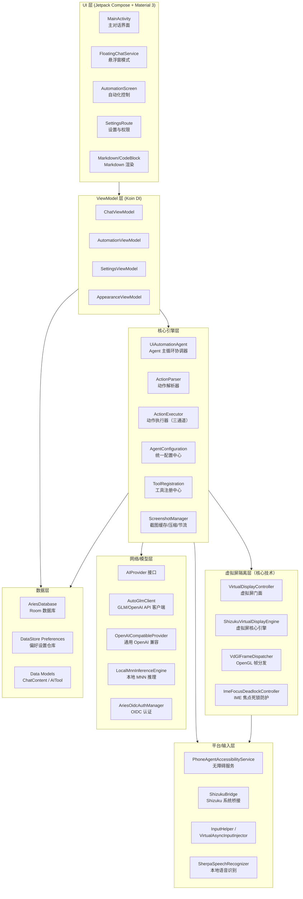
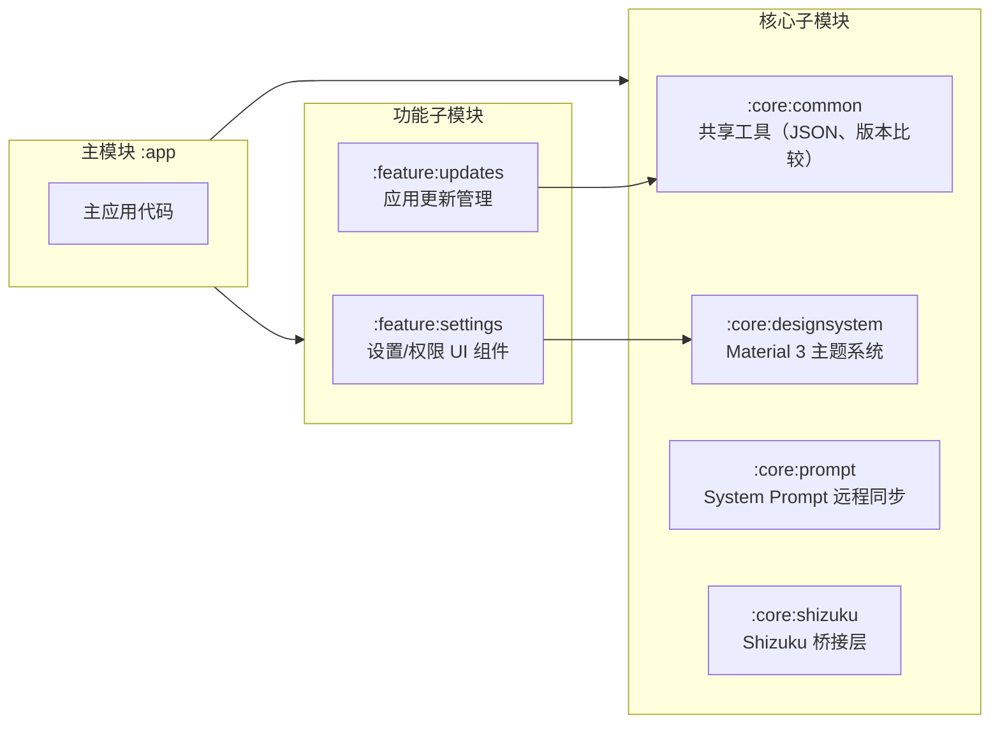
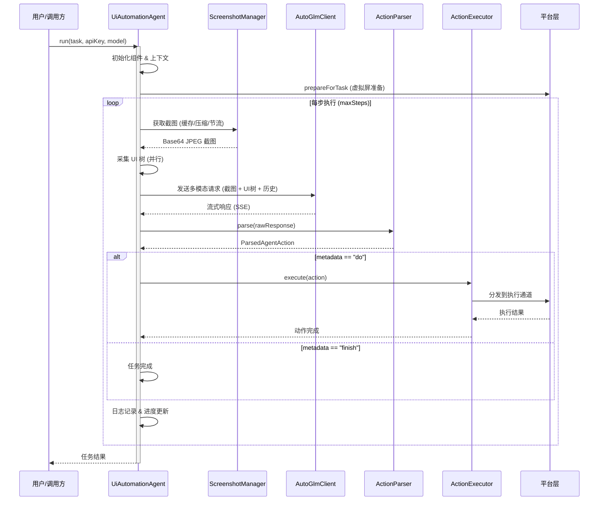
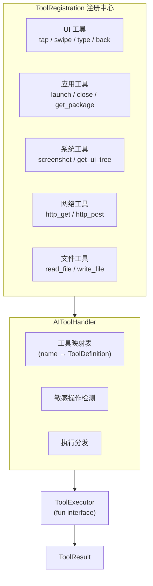
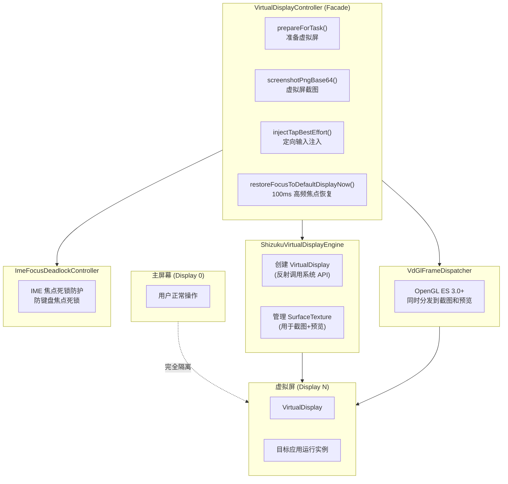
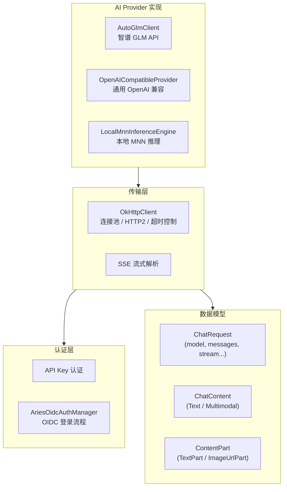
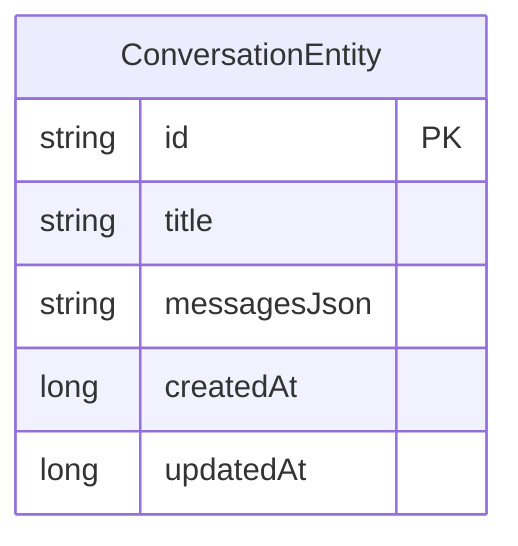
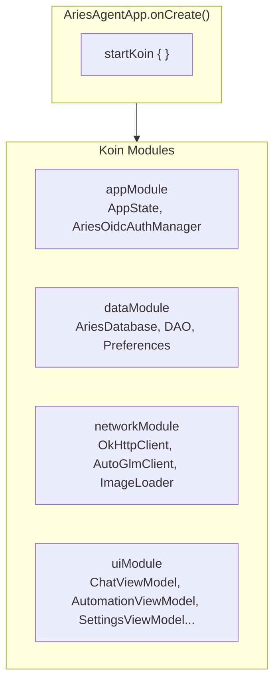
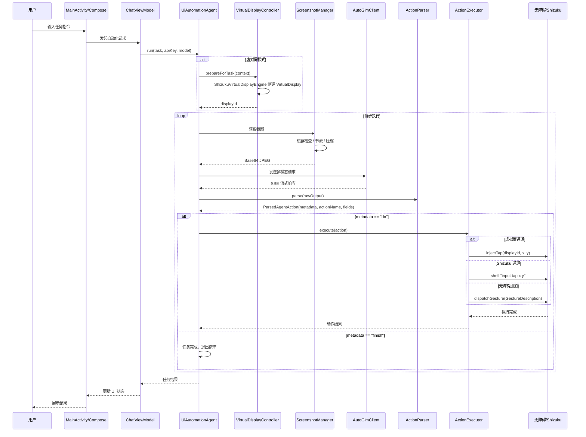

# 整体架构设计

Aries AI 是一个开源的 Android UI 自动化引擎，通过接入大语言模型实现屏幕理解与自动化任务执行。项目采用 Kotlin Multi-Module 分层架构，以 **虚拟屏完全隔离技术** 为核心差异化优势，支持多种大模型接入。

## 概述

Aries AI 的整体架构遵循 **分层解耦、模块化组合** 的设计原则。系统自下而上分为：**平台输入层**、**数据持久层**、**网络/模型层**、**核心引擎层**、**虚拟屏隔离层**、**ViewModel 调度层** 和 **Compose UI 层**，通过 Koin 依赖注入框架统一管理各层组件的生命周期和依赖关系。

### 设计目标

- **隔离性**：虚拟屏 100% 焦点隔离，后台自动化与前台操作互不干扰
- **可扩展性**：通过 `AIProvider` 接口和 OpenAI 兼容规范，支持 20+ 种大模型
- **可配置性**：`AgentConfiguration` 集中管理所有执行参数，提供合理的默认值
- **可观测性**：完整的日志桥接、时间线格式化和反馈日志导出体系
- **性能优先**：截图缓存、流式早停、并行状态采集等优化手段

## 架构总览



### 架构分层说明

| 层级 | 职责 | 关键技术 |
|------|------|----------|
| **UI 层** | 用户交互、消息展示、Markdown 渲染 | Jetpack Compose、Material 3、Navigation Compose |
| **ViewModel 层** | 状态管理、业务逻辑调度、UI 状态持有 | Koin `viewModel{}`、Kotlin Coroutines |
| **核心引擎层** | Agent 主循环、动作解析与执行、工具调度 | ActionParser、ActionExecutor、ScreenshotManager |
| **虚拟屏隔离层** | 后台虚拟屏创建/管理、OpenGL 帧分发、焦点隔离 | VirtualDisplay、SurfaceTexture、Shizuku |
| **网络/模型层** | AI 模型调用、流式响应、OIDC 认证 | OkHttp、kotlinx.serialization、SSE 流式 |
| **数据层** | 对话持久化、偏好存储、数据模型 | Room、DataStore、kotlinx.serialization |
| **平台/输入层** | 无障碍服务、Shizuku 权限、输入注入、语音识别 | AccessibilityService、Shizuku API、sherpa-ncnn |

## 多模块项目结构

项目采用 Gradle Multi-Module 架构，将通用能力抽离为独立模块：



> Source: [settings.gradle.kts](https://github.com/ZG0704666/Aries-AI/blob/main/settings.gradle.kts#L22-L29)

模块依赖在 `app/build.gradle.kts` 中声明：

```kotlin
implementation(project(":core:common"))
implementation(project(":core:designsystem"))
implementation(project(":core:prompt"))
implementation(project(":core:shizuku"))
implementation(project(":feature:settings"))
implementation(project(":feature:updates"))
```

> Source: [app/build.gradle.kts](https://github.com/ZG0704666/Aries-AI/blob/main/app/build.gradle.kts#L140-L145)

### 子模块职责

| 模块 | 路径 | 职责 |
|------|------|------|
| `:core:common` | `core/common/` | 共享 JSON 配置（`AppJson`）、版本号比较（`VersionComparator`） |
| `:core:designsystem` | `core/designsystem/` | Material 3 主题系统，支持 AMOLED 暗色模式、色彩风格切换、字体缩放 |
| `:core:prompt` | `core/prompt/` | 主对话 System Prompt 管理，支持本地回退与远程同步 |
| `:core:shizuku` | `core/shizuku/` | Shizuku Binder 桥接，Shell 命令执行、UI 树 dump |
| `:feature:settings` | `feature/settings/` | 设置界面组件、权限引导（`PermissionSetupSupport`） |
| `:feature:updates` | `feature/updates/` | GitHub Release 检查、APK 下载、更新通知 |

## 核心引擎层详解

核心引擎层是自动化执行的大脑，由 `UiAutomationAgent` 作为主协调器，调度解析、执行、截图、工具等子模块完成 **感知-决策-执行** 循环。

### Agent 主循环流程



### 关键组件

#### UiAutomationAgent — 主协调器

`UiAutomationAgent` 是自动化执行的核心入口，负责：

1. **组件装配**：实例化 `ActionParser`、`ActionExecutor`、`ScreenshotManager`
2. **上下文字段管理**：维护对话历史、UI 树上下文、Token 预算
3. **模型调用与重试**：支持流式+早停、解析修复、动作修复
4. **任务控制**：暂停/恢复、用户确认（敏感操作）、进度回调

```kotlin
class UiAutomationAgent(
    private val appContext: Context,
    private val config: AgentConfiguration = AgentConfiguration.DEFAULT,
) {
    private val actionParser = ActionParser()
    private val actionExecutor = ActionExecutor(appContext, config)
    private var screenshotManager: ScreenshotManager? = null
    // ...
}
```

> Source: [UiAutomationAgent.kt](https://github.com/ZG0704666/Aries-AI/blob/main/app/src/main/java/com/ai/phoneagent/UiAutomationAgent.kt#L61-L68)

#### ActionExecutor — 三通道执行策略

`ActionExecutor` 支持三种执行通道，按优先级自动选择：

1. **虚拟屏通道**（最高优先级）：通过 `displayId` 定向注入输入事件，完全不干扰主屏幕
2. **Shizuku 通道**（中等优先级）：使用 Shizuku 系统权限执行 `input tap/swipe/keyevent` 等 Shell 命令
3. **无障碍服务通道**（默认回退）：通过 `AccessibilityService` 的 `GestureDescription` 和 `ACTION_SET_TEXT` 执行

```kotlin
class ActionExecutor(
    private val context: Context,
    private val config: AgentConfiguration = AgentConfiguration.DEFAULT,
) {
    // 当前是否处于虚拟屏执行模式
    private fun isVirtualDisplayMode(): Boolean {
        return config.useBackgroundVirtualDisplay &&
                VirtualDisplayController.shouldUseVirtualDisplay &&
                VirtualDisplayController.isVirtualDisplayStarted()
    }

    private fun shouldUseShizukuInteraction(): Boolean {
        return config.useShizukuInteraction && !isVirtualDisplayMode()
    }
}
```

> Source: [ActionExecutor.kt](https://github.com/ZG0704666/Aries-AI/blob/main/app/src/main/java/com/ai/phoneagent/core/executor/ActionExecutor.kt#L43-L77)

#### AgentConfiguration — 统一配置中心

`AgentConfiguration` 是一个包含 80+ 参数的 data class，覆盖执行、模型、截图、延迟、安全性等所有可调维度。设计原则是 **默认可用、可解释、可分层调参**。

```kotlin
data class AgentConfiguration(
    // 执行参数
    val useBackgroundVirtualDisplay: Boolean = false,
    val useShizukuInteraction: Boolean = false,
    val maxSteps: Int = 100,
    val stepDelayMs: Long = 160L,

    // 模型调用参数
    val maxModelRetries: Int = 3,
    val maxParseRepairs: Int = 2,
    val maxActionRepairs: Int = 1,

    // 模型参数
    val temperature: Float? = 0.0f,
    val topP: Float? = 0.85f,
    val maxTokens: Int? = 4096,

    // 截图优化
    val screenshotCompressionQuality: Int = 85,
    val screenshotMaxSizeKB: Int = 150,
    val enableScreenshotCache: Boolean = true,

    // 敏感内容检测
    val sensitiveKeywords: List<String> = listOf(
        "支付密码", "银行卡", "验证码", "确认支付", "确认付款"
    ),
    // ...
)
```

> Source: [AgentConfiguration.kt](https://github.com/ZG0704666/Aries-AI/blob/main/app/src/main/java/com/ai/phoneagent/core/config/AgentConfiguration.kt#L38-L57)

### 工具系统 (AI Tool Framework)

工具系统允许 AI 在对话中调用结构化工具（Function Calling），涵盖 UI 交互、应用管理、系统操作、网络请求和文件处理五大类。



> Source: [ToolRegistration.kt](https://github.com/ZG0704666/Aries-AI/blob/main/app/src/main/java/com/ai/phoneagent/core/tools/ToolRegistration.kt#L39-L65)

工具执行器采用 `fun interface` 设计，保持简洁：

```kotlin
fun interface ToolExecutor {
    suspend fun invoke(tool: AITool): ToolResult
}
```

> Source: [ToolExecutor.kt](https://github.com/ZG0704666/Aries-AI/blob/main/app/src/main/java/com/ai/phoneagent/core/tools/ToolExecutor.kt#L10-L17)

## 虚拟屏隔离层详解

虚拟屏隔离技术是 Aries AI 的核心差异化能力，通过在后台创建独立的 VirtualDisplay 实现真正的后台自动化。

### 虚拟屏架构



### 核心组件

**VirtualDisplayController** 作为门面（Facade），对外屏蔽底层复杂性：

```kotlin
object VirtualDisplayController {
    @Volatile private var activeDisplayId: Int? = null
    @Volatile var shouldUseVirtualDisplay: Boolean = false

    fun isVirtualDisplayStarted(): Boolean = activeDisplayId != null && activeDisplayId!! > 0
    fun getDisplayId(): Int? = activeDisplayId
    fun getContentSizeBestEffort(context: Context? = null): Pair<Int, Int> { /* ... */ }

    @Synchronized
    fun prepareForTask(context: Context, adbExecPath: String): Int? { /* ... */ }
}
```

> Source: [VirtualDisplayController.kt](https://github.com/ZG0704666/Aries-AI/blob/main/app/src/main/java/com/ai/phoneagent/VirtualDisplayController.kt#L47-L96)

**虚拟屏子系统文件**：

| 文件 | 职责 |
|------|------|
| `vdiso/ShizukuVirtualDisplayEngine.kt` | 核心引擎：通过 Shizuku 反射创建 VirtualDisplay，管理 SurfaceTexture |
| `vdiso/VdGlFrameDispatcher.kt` | OpenGL ES 3.0+ 帧分发：一套渲染同时输出截图和预览 |
| `vdiso/ImeFocusDeadlockController.kt` | IME 焦点死锁防护：防止键盘焦点在虚拟屏和主屏之间死锁 |
| `vdiso/ShizukuServiceHub.kt` | Shizuku 服务管理中心 |

### 焦点隔离机制

虚拟屏的核心技术难点是 **焦点管理**。Aries AI 采用 100ms 高频强制执行策略：

1. **物理按键拦截**：`PhoneAgentAccessibilityService.onKeyEvent()` 捕获所有物理按键事件，阻止其传递到虚拟屏
2. **即时焦点恢复**：检测到焦点切换到虚拟屏时，立即调用 `restoreFocusToDefaultDisplayNow()` 恢复到主屏
3. **IME 完全隔离**：`ImeFocusDeadlockController` 防止输入法焦点死锁

```kotlin
// PhoneAgentAccessibilityService.kt — 物理按键拦截
override fun onKeyEvent(event: android.view.KeyEvent?): Boolean {
    if (event == null) return false
    if (!VirtualDisplayController.isVirtualDisplayStarted()) return false
    // 立即恢复焦点到主屏
    if (event.action == android.view.KeyEvent.ACTION_DOWN) {
        runCatching { VirtualDisplayController.restoreFocusToDefaultDisplayNow() }
    }
    // ...
}
```

> Source: [PhoneAgentAccessibilityService.kt](https://github.com/ZG0704666/Aries-AI/blob/main/app/src/main/java/com/ai/phoneagent/PhoneAgentAccessibilityService.kt#L177-L193)

## 网络/模型层详解

网络层通过 `AIProvider` 接口实现多模型接入的统一抽象：

```kotlin
interface AIProvider {
    val providerName: String
    val modelName: String
    val supportsVision: Boolean
    val supportsAudio: Boolean
    val supportsVideo: Boolean
    val enableToolCall: Boolean

    suspend fun sendMessageStream(
        messages: List<ChatMessage>,
        onChunk: (String) -> Unit,
        onComplete: () -> Unit,
        onError: (Throwable) -> Unit
    )
}
```

> Source: [AIProvider.kt](https://github.com/ZG0704666/Aries-AI/blob/main/app/src/main/java/com/ai/phoneagent/net/AIProvider.kt#L9-L54)

### 模型接入架构



`OkHttpClient` 通过 Koin 进行全局管理，配置了连接池、HTTP/2 和适配长时模型响应的超时参数：

```kotlin
// NetworkModule.kt
single<OkHttpClient> {
    OkHttpClient.Builder()
        .retryOnConnectionFailure(true)
        .connectTimeout(60, TimeUnit.SECONDS)
        .readTimeout(300, TimeUnit.SECONDS)
        .writeTimeout(120, TimeUnit.SECONDS)
        .callTimeout(360, TimeUnit.SECONDS)
        .connectionPool(ConnectionPool(10, 5, TimeUnit.MINUTES))
        .protocols(listOf(Protocol.HTTP_2, Protocol.HTTP_1_1))
        .build()
}
```

> Source: [NetworkModule.kt](https://github.com/ZG0704666/Aries-AI/blob/main/app/src/main/java/com/ai/phoneagent/di/NetworkModule.kt#L53-L71)

## 数据层详解

数据层使用 **Room** 进行对话持久化，使用 **DataStore** 管理偏好设置：



```kotlin
@Database(entities = [ConversationEntity::class], version = 1, exportSchema = false)
abstract class AriesDatabase : RoomDatabase() {
    abstract fun conversationDao(): ConversationDao
}
```

> Source: [AriesDatabase.kt](https://github.com/ZG0704666/Aries-AI/blob/main/app/src/main/java/com/ai/phoneagent/data/local/AriesDatabase.kt#L8-L30)

偏好设置仓库通过 Koin 统一注入，各仓库职责清晰：

| 仓库 | 存储内容 | 后端 |
|------|---------|------|
| `MainUiPreferencesRepository` | 主页 UI 状态（主题模式、色彩风格等） | DataStore |
| `AppPreferencesRepository` | 应用级偏好（API Key、模型选择等） | DataStore |
| `FloatingChatPreferencesRepository` | 悬浮窗位置、大小偏好 | DataStore |
| `VirtualDisplayConfigRepository` | 虚拟屏分辨率、缩放配置 | DataStore |
| `ToolPermissionsRepository` | 工具权限授权状态 | DataStore |
| `AutomationResultsRepository` | 自动化执行结果记录 | DataStore |

> Source: [DataModule.kt](https://github.com/ZG0704666/Aries-AI/blob/main/app/src/main/java/com/ai/phoneagent/di/DataModule.kt#L41-L57)

## 依赖注入架构

项目使用 **Koin** 作为 DI 框架，按层级拆分为四个 module：



> Sources:
> - [AppModule.kt](https://github.com/ZG0704666/Aries-AI/blob/main/app/src/main/java/com/ai/phoneagent/di/AppModule.kt#L36-L47)
> - [DataModule.kt](https://github.com/ZG0704666/Aries-AI/blob/main/app/src/main/java/com/ai/phoneagent/di/DataModule.kt#L41-L57)
> - [NetworkModule.kt](https://github.com/ZG0704666/Aries-AI/blob/main/app/src/main/java/com/ai/phoneagent/di/NetworkModule.kt#L47-L101)
> - [UiModule.kt](https://github.com/ZG0704666/Aries-AI/blob/main/app/src/main/java/com/ai/phoneagent/di/UiModule.kt#L35-L45)

Application 启动时统一初始化：

```kotlin
class AriesAgentApp : Application() {
    override fun onCreate() {
        super.onCreate()
        AppState.init(this)
        AutomationLiveNotification.initialize(this)

        startKoin {
            androidLogger(/* ... */)
            androidContext(this@AriesAgentApp)
            modules(appModule, dataModule, networkModule, uiModule)
        }
        // Coil ImageLoader、HiddenApiBypass 初始化
    }
}
```

> Source: [AriesAgentApp.kt](https://github.com/ZG0704666/Aries-AI/blob/main/app/src/main/java/com/ai/phoneagent/AriesAgentApp.kt#L48-L100)

## 导航架构

导航采用 Jetpack Navigation Compose，路由定义为 sealed class：

```kotlin
sealed class Routes(val route: String) {
    data object Home : Routes("home")
    data object Settings : Routes("settings")
    data object About : Routes("about")
    data object Automation : Routes("automation")
    data object UpdateHistory : Routes("updateHistory")
    data object PermissionGuide : Routes("permissionGuide")
    data object UserAgreement : Routes("userAgreement")
    data object Licenses : Routes("licenses")
    data object Onboarding : Routes("onboarding") { /* with flow param */ }
}
```

> Source: [Routes.kt](https://github.com/ZG0704666/Aries-AI/blob/main/app/src/main/java/com/ai/phoneagent/navigation/Routes.kt#L3-L22)

NavHost 组装所有页面路由：

```kotlin
@Composable
fun AriesNavGraph(navController: NavHostController, homeContent: @Composable () -> Unit) {
    NavHost(navController = navController, startDestination = Routes.Home.route) {
        composable(Routes.Home.route) { homeContent() }
        composable(Routes.Settings.route) { SettingsRoute(navController = navController) }
        composable(Routes.Automation.route) { AutomationScreen(navController = navController) }
        composable(Routes.About.route) { AboutRoute(navController = navController) }
        // ...更多路由
    }
}
```

> Source: [AriesNavGraph.kt](https://github.com/ZG0704666/Aries-AI/blob/main/app/src/main/java/com/ai/phoneagent/navigation/AriesNavGraph.kt#L30-L80)

## 完整数据流

以下时序图展示了一个完整的自动化任务从发起到结束的全链路数据流：



## 应用入口与组件注册

AndroidManifest 注册了以下关键组件：

| 组件 | 类型 | 职责 |
|------|------|------|
| `AriesAgentApp` | Application | 进程启动初始化（Koin、HiddenApiBypass、Coil） |
| `MainActivity` | Activity (LAUNCHER) | 主入口 Activity，承载 Compose NavHost |
| `WelcomeActivity` | Activity | 虚拟屏兜底 Activity，独立 taskAffinity |
| `LaunchProxyActivity` | Activity | 透明代理 Activity（应用启动中间层） |
| `PhoneAgentAccessibilityService` | Service | 无障碍服务（UI 操作、按键拦截、截图） |
| `FloatingChatService` | Service | 悬浮窗对话服务 |
| `ShizukuProvider` | ContentProvider | Shizuku Binder 服务提供者 |

> Source: [AndroidManifest.xml](https://github.com/ZG0704666/Aries-AI/blob/main/app/src/main/AndroidManifest.xml#L36-L121)

## 技术栈总览

| 维度 | 技术选择 | 版本 |
|------|---------|------|
| **语言** | Kotlin | 2.2.21 |
| **构建** | Gradle + AGP | 8.13 / 8.13.2 |
| **UI 框架** | Jetpack Compose + Material 3 | BOM 2024.12.01 |
| **导航** | Navigation Compose | 2.8.5 |
| **依赖注入** | Koin | (via libs.versions.toml) |
| **网络** | OkHttp | 4.12.0 |
| **序列化** | kotlinx.serialization | 1.7.3 |
| **数据库** | Room | (via libs.versions.toml) |
| **偏好存储** | DataStore Preferences | (via libs.versions.toml) |
| **图片加载** | Coil 2 + Coil 3 | (via libs.versions.toml) |
| **Markdown 解析** | JetBrains Markdown | 0.7.3 |
| **代码高亮** | QuickJS + Prism.js | (via libs.versions.toml) |
| **数学公式** | JLatexMath | (via libs.versions.toml) |
| **语音识别** | sherpa-ncnn | (本地引擎) |
| **虚拟屏** | Shizuku + VirtualDisplay | Shizuku 13.1.5 |
| **隐藏 API** | HiddenApiBypass | 4.3 |
| **PDF 处理** | iText 7 | 7.2.5 |
| **Office 解析** | Apache POI | 5.2.5 |
| **协程** | Kotlin Coroutines | 1.8.1 |
| **图标** | Lucide Icons | (via libs.versions.toml) |

> Source: [app/build.gradle.kts](https://github.com/ZG0704666/Aries-AI/blob/main/app/build.gradle.kts#L139-L236)

## 配置选项

### AgentConfiguration 核心参数

| 参数 | 类型 | 默认值 | 说明 |
|------|------|--------|------|
| `useBackgroundVirtualDisplay` | Boolean | `false` | 是否启用后台虚拟屏模式 |
| `useShizukuInteraction` | Boolean | `false` | 是否优先使用 Shizuku 交互通道 |
| `maxSteps` | Int | `100` | 单次任务最大执行步数 |
| `stepDelayMs` | Long | `160` | 步骤间基础延迟（ms） |
| `postActionDelayMs` | Long | `120` | 动作执行后额外等待（ms） |
| `maxModelRetries` | Int | `3` | 模型调用最大重试次数 |
| `maxParseRepairs` | Int | `2` | 解析修复最大次数 |
| `maxActionRepairs` | Int | `1` | 动作执行修复最大次数 |
| `temperature` | Float? | `0.0` | 模型温度参数 |
| `topP` | Float? | `0.85` | nucleus sampling 参数 |
| `maxTokens` | Int? | `4096` | 单次回复最大 token 数 |
| `maxContextTokens` | Int | `20000` | 最大上下文 token 数（本地裁剪） |
| `maxUiTreeChars` | Int | `3000` | UI 树最大字符数 |
| `maxHistoryTurns` | Int | `6` | 最多保留对话轮数 |
| `useStreamingWithEarlyStop` | Boolean | `true` | 启用流式输出+早停 |
| `parallelScreenshotAndUi` | Boolean | `true` | 并行获取截图与 UI 树 |
| `enableScreenshotCache` | Boolean | `true` | 启用截图缓存 |
| `screenshotCompressionQuality` | Int | `85` | 截图压缩质量（0-100） |
| `screenshotMaxSizeKB` | Int | `150` | 截图目标最大体积（KB） |
| `screenshotThrottleMinIntervalMs` | Long | `1100` | 截图最小间隔（ms） |

> Source: [AgentConfiguration.kt](https://github.com/ZG0704666/Aries-AI/blob/main/app/src/main/java/com/ai/phoneagent/core/config/AgentConfiguration.kt#L38-L357)

## 使用示例

### 基本用法 — 创建 Agent 并执行任务

```kotlin
// 使用默认配置创建 Agent
val agent = UiAutomationAgent(
    appContext = context,
    config = AgentConfiguration.DEFAULT
)

// 执行任务
agent.run(
    apiKey = "your-api-key",
    model = "glm-4v-plus",
    task = "在携程订一张明天北京到上海的机票",
    service = accessibilityService,
    onLog = { message -> Log.d("Agent", message) },
    onProgress = { step, total -> /* 更新进度 */ },
    control = object : UiAutomationAgent.Control {
        override fun isPaused(): Boolean = false
        override suspend fun confirm(message: String): Boolean = true
    }
)
```

### 使用虚拟屏后台执行

```kotlin
val agent = UiAutomationAgent(
    appContext = context,
    config = AgentConfiguration.DEFAULT.copy(
        useBackgroundVirtualDisplay = true,
        screenshotCompressionQuality = 85,
        enableScreenshotCache = true,
        useStreamingWithEarlyStop = true,
    )
)

agent.run(
    apiKey = "your-api-key",
    model = "autoglm-phone",
    task = "打开美团搜索附近的川菜馆",
    service = accessibilityService,
)
```

### 自定义配置优化性能

```kotlin
val customConfig = AgentConfiguration.DEFAULT.copy(
    maxSteps = 50,                       // 限制步数
    stepDelayMs = 100L,                  // 减少延迟
    screenshotCompressionQuality = 70,   // 更高压缩
    screenshotMaxSizeKB = 100,           // 更小体积
    maxModelRetries = 2,                 // 减少重试
    useStreamingWithEarlyStop = true,    // 启用早停
    parallelScreenshotAndUi = true,      // 并行采集
)
```

## 相关链接

- [项目 README](https://github.com/ZG0704666/Aries-AI/blob/main/README.md)
- [开发文档](https://github.com/ZG0704666/Aries-AI/blob/main/Aries%20AI%20开发文档.md)
- [UiAutomationAgent 源码](https://github.com/ZG0704666/Aries-AI/blob/main/app/src/main/java/com/ai/phoneagent/UiAutomationAgent.kt)
- [AgentConfiguration 源码](https://github.com/ZG0704666/Aries-AI/blob/main/app/src/main/java/com/ai/phoneagent/core/config/AgentConfiguration.kt)
- [ActionExecutor 源码](https://github.com/ZG0704666/Aries-AI/blob/main/app/src/main/java/com/ai/phoneagent/core/executor/ActionExecutor.kt)
- [ActionParser 源码](https://github.com/ZG0704666/Aries-AI/blob/main/app/src/main/java/com/ai/phoneagent/core/parser/ActionParser.kt)
- [VirtualDisplayController 源码](https://github.com/ZG0704666/Aries-AI/blob/main/app/src/main/java/com/ai/phoneagent/VirtualDisplayController.kt)
- [ShizukuBridge 源码](https://github.com/ZG0704666/Aries-AI/blob/main/core/shizuku/src/main/java/com/ai/phoneagent/ShizukuBridge.kt)
- [DI 模块 (AppModule)](https://github.com/ZG0704666/Aries-AI/blob/main/app/src/main/java/com/ai/phoneagent/di/AppModule.kt)
- [DI 模块 (DataModule)](https://github.com/ZG0704666/Aries-AI/blob/main/app/src/main/java/com/ai/phoneagent/di/DataModule.kt)
- [DI 模块 (NetworkModule)](https://github.com/ZG0704666/Aries-AI/blob/main/app/src/main/java/com/ai/phoneagent/di/NetworkModule.kt)
- [DI 模块 (UiModule)](https://github.com/ZG0704666/Aries-AI/blob/main/app/src/main/java/com/ai/phoneagent/di/UiModule.kt)
- [导航定义 (Routes)](https://github.com/ZG0704666/Aries-AI/blob/main/app/src/main/java/com/ai/phoneagent/navigation/Routes.kt)
- [导航图 (AriesNavGraph)](https://github.com/ZG0704666/Aries-AI/blob/main/app/src/main/java/com/ai/phoneagent/navigation/AriesNavGraph.kt)
- [AIProvider 接口](https://github.com/ZG0704666/Aries-AI/blob/main/app/src/main/java/com/ai/phoneagent/net/AIProvider.kt)
- [AutoGlmClient 源码](https://github.com/ZG0704666/Aries-AI/blob/main/app/src/main/java/com/ai/phoneagent/net/AutoGlmClient.kt)
- [ToolRegistration 源码](https://github.com/ZG0704666/Aries-AI/blob/main/app/src/main/java/com/ai/phoneagent/core/tools/ToolRegistration.kt)
- [ScreenshotManager 源码](https://github.com/ZG0704666/Aries-AI/blob/main/app/src/main/java/com/ai/phoneagent/core/cache/ScreenshotManager.kt)
- [AriesDatabase 源码](https://github.com/ZG0704666/Aries-AI/blob/main/app/src/main/java/com/ai/phoneagent/data/local/AriesDatabase.kt)
- [build.gradle.kts (app)](https://github.com/ZG0704666/Aries-AI/blob/main/app/build.gradle.kts)
- [AndroidManifest.xml](https://github.com/ZG0704666/Aries-AI/blob/main/app/src/main/AndroidManifest.xml)
- [SherpaSpeechRecognizer 源码](https://github.com/ZG0704666/Aries-AI/blob/main/app/src/main/java/com/ai/phoneagent/speech/SherpaSpeechRecognizer.kt)
- [虚拟屏引擎 (vdiso/)](https://github.com/ZG0704666/Aries-AI/tree/main/app/src/main/java/com/ai/phoneagent/vdiso)
