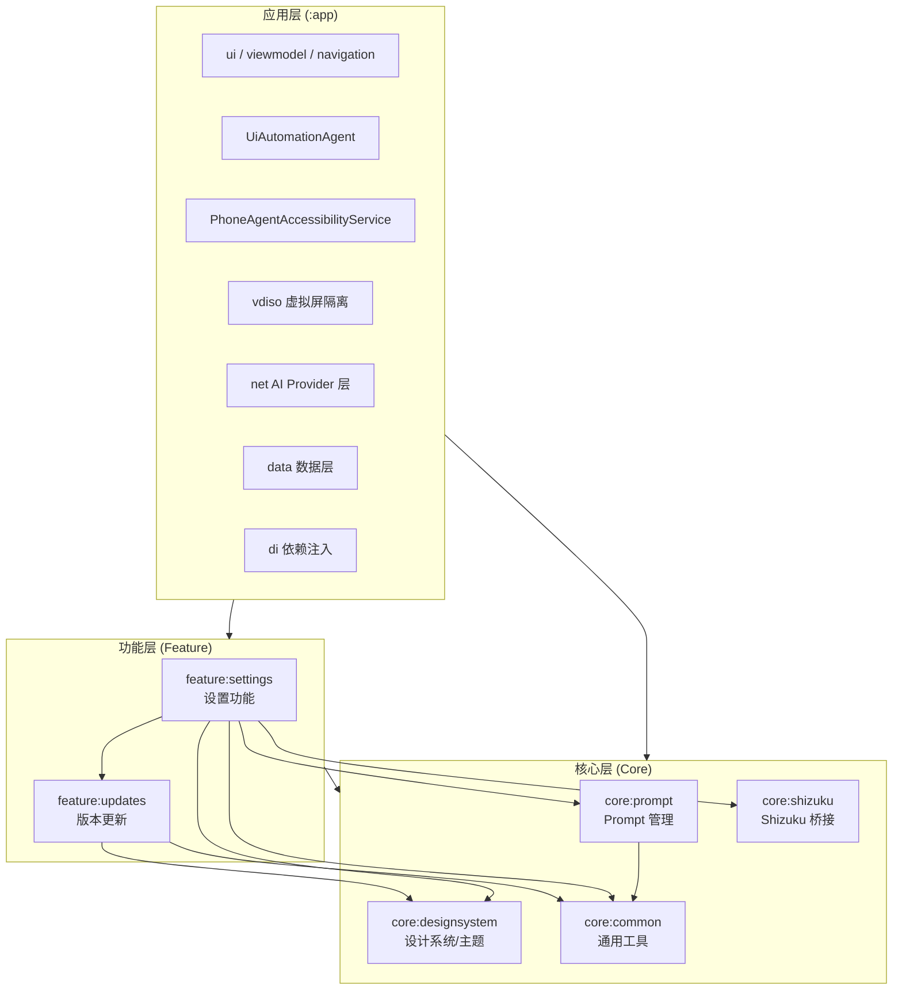
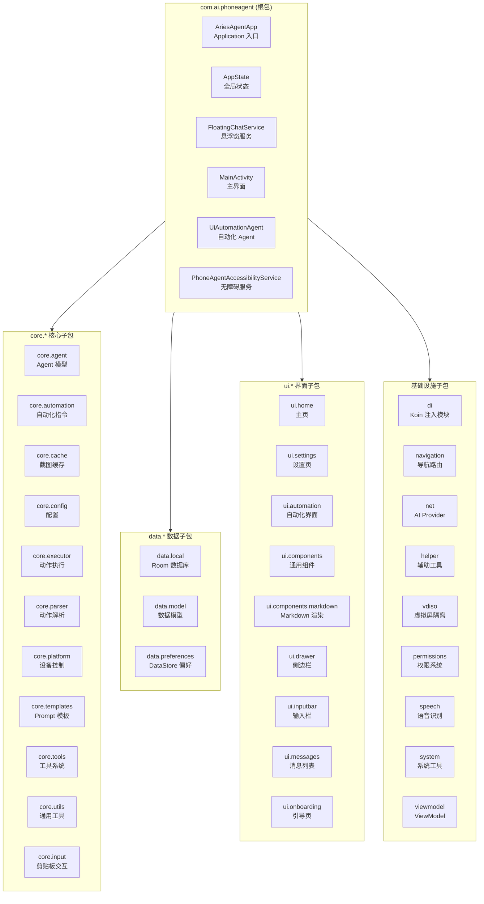
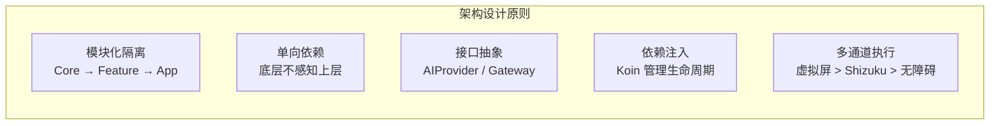

# 模块组织结构

Aries-AI 是一个基于 Kotlin 的 Android 智能 UI 自动化框架，采用分层模块化架构设计，将核心能力、功能模块和 UI 层清晰分离，通过 Gradle 多模块和内部包结构实现高度解耦。

## 概述

Aries-AI 项目的模块组织遵循 **"核心层（Core）→ 功能层（Feature）→ 应用层（App）"** 三层架构。Gradle 子模块负责编译时隔离和依赖管理，而 `app` 模块内部的包结构则进一步按职责划分，形成清晰的分层体系。这种设计的核心意图是：

- **编译时隔离**：核心库和功能模块可以独立编译，加速构建
- **职责明确**：每个模块/包有单一的职责边界，便于维护和测试
- **依赖单向流动**：上层可依赖下层，下层不感知上层，避免循环依赖
- **灵活替换**：通过 Koin 依赖注入框架，可以在各层之间灵活替换实现

## 架构总览



> 图中箭头表示模块间的编译时依赖关系。依赖方向自上而下：App → Feature → Core，底层模块完全独立于上层。

## Gradle 模块组织

项目通过 `settings.gradle.kts` 定义了 7 个子模块：

> Source: [settings.gradle.kts](https://github.com/ZG0704666/Aries-AI/blob/main/settings.gradle.kts#L22-L29)

```kotlin
rootProject.name = "Phone Agent"
include(":app")
include(":core:common")
include(":core:designsystem")
include(":core:prompt")
include(":core:shizuku")
include(":feature:settings")
include(":feature:updates")
```

### 模块依赖关系详解

| 模块 | 命名空间 | 类型 | 依赖的模块 | 职责 |
|------|----------|------|------------|------|
| `:app` | `com.ai.phoneagent` | Application | 所有 Core + Feature 模块 | 主应用入口，集成所有模块 |
| `:core:common` | `com.ai.phoneagent.core.common` | Library | 无 | JSON 工具、版本比较等通用能力 |
| `:core:designsystem` | `com.ai.phoneagent.core.designsystem` | Library | 无 | Material 3 主题系统、Compose 主题组件 |
| `:core:prompt` | `com.ai.phoneagent.core.prompt` | Library | `:core:common` | 主聊天 Prompt 管理与远程更新 |
| `:core:shizuku` | `com.ai.phoneagent` | Library | Shizuku API | Shizuku 权限操作用户态桥接层 |
| `:feature:settings` | `com.ai.phoneagent.feature.settings` | Library | 所有 Core + `:feature:updates` | 设置页面与权限引导 |
| `:feature:updates` | `com.ai.phoneagent.feature.updates` | Library | `:core:common`, `:core:designsystem` | 版本更新检测与下载 |

### 核心层模块 (Core)

#### `:core:common` —— 通用工具库

提供项目中最基础、无外部依赖的工具类，是整个模块依赖树的**根节点**。

> Source: [AppJson.kt](https://github.com/ZG0704666/Aries-AI/blob/main/core/common/src/main/java/com/ai/phoneagent/core/common/AppJson.kt#L1-L9)

```kotlin
package com.ai.phoneagent.core.common

import kotlinx.serialization.json.Json

val AppJson = Json {
    ignoreUnknownKeys = true
    encodeDefaults = false
    isLenient = true
}
```

包含两个核心组件：

| 组件 | 文件 | 说明 |
|------|------|------|
| `AppJson` | `AppJson.kt` | 全局共享的 `kotlinx.serialization` JSON 配置实例 |
| `VersionComparator` | `VersionComparator.kt` | 语义化版本号比较器，支持 `major.minor.patch+build` 格式 |

#### `:core:designsystem` —— 设计系统

提供基于 Material 3 的统一主题系统，是 UI 层的**视觉基础设施**。

> Source: [AriesMaterialTheme.kt](https://github.com/ZG0704666/Aries-AI/blob/main/core/designsystem/src/main/java/com/ai/phoneagent/core/designsystem/theme/AriesMaterialTheme.kt#L54-L62)

```kotlin
@Composable
fun AriesMaterialTheme(
    themeMode: ThemeMode = ThemeMode.SYSTEM,
    themeColorStyle: ThemeColorStyle = ThemeColorStyle.DEFAULT,
    amoledDark: Boolean = false,
    fontScale: Float = 1.0f,
    fontFamily: FontFamily = FontFamily.Default,
    content: @Composable () -> Unit,
)
```

主题系统支持：
- **三种模式**：跟随系统 / 浅色 / 深色（`ThemeMode`）
- **AMOLED 纯黑模式**：深色模式下使用纯黑背景以省电
- **Dynamic Color**：Android 12+ 支持 Material You 动态取色
- **Token 颜色体系**：基于资源文件的完整 Material 3 Token 配色
- **字号与字体自定义**：支持全局 `fontScale` 和自定义 `FontFamily`

#### `:core:prompt` —— Prompt 管理

负责系统 Prompt 的本地存储与远程更新。

> Source: [MainChatPromptRepository.kt](https://github.com/ZG0704666/Aries-AI/blob/main/core/prompt/src/main/java/com/ai/phoneagent/core/prompt/MainChatPromptRepository.kt#L17-L43)

```kotlin
object MainChatPromptRepository {
    private const val LOCAL_DIR_NAME = "xyla"
    private const val LOCAL_FILE_NAME = "prompt.json"
    private const val REMOTE_PROMPT_URL = "https://ariesapi.xuanyu.online/prompt.json"
    private const val DEFAULT_PROMPT_VERSION = "1.0.0"
    // ...
}
```

设计要点：
- **本地优先**：优先使用本地缓存的 Prompt，确保离线可用
- **版本比较**：通过 `VersionComparator` 判断远程 Prompt 是否需要更新
- **线程安全**：使用 `@Volatile` + `synchronized` 双重检查锁定模式
- **内置兜底**：当本地文件损坏或不存在时，自动回退到硬编码的默认 Prompt

#### `:core:shizuku` —— Shizuku 桥接层

封装 Shizuku 的权限检查和 Shell 命令执行能力，为上层提供统一的系统级操作入口。

> Source: [ShizukuBridge.kt](https://github.com/ZG0704666/Aries-AI/blob/main/core/shizuku/src/main/java/com/ai/phoneagent/ShizukuBridge.kt#L20-L45)

```kotlin
object ShizukuBridge {
    data class ExecResult(
        val exitCode: Int,
        val stdout: ByteArray,
        val stderr: ByteArray,
    )
    // ...
}
```

核心能力：
- **Shell 命令执行**：通过 Shizuku binder 执行特权 Shell 命令
- **UI 层级转储**：调用 `uiautomator dump` 获取当前窗口的 XML 层级结构
- **状态检测**：`pingBinder()` / `hasPermission()` / `isShizukuAvailable()`

### 功能层模块 (Feature)

#### `:feature:updates` —— 版本更新

通过 GitHub API 检测新版本，支持 APK 下载和通知提醒。

> Source: [ReleaseRepository.kt](https://github.com/ZG0704666/Aries-AI/blob/main/feature/updates/src/main/java/com/ai/phoneagent/updates/ReleaseRepository.kt#L3-L6)

```kotlin
class ReleaseRepository(
    private val owner: String = UpdateConfig.REPO_OWNER,
    private val repo: String = UpdateConfig.REPO_NAME,
)
```

包含组件：

| 组件 | 说明 |
|------|------|
| `ReleaseRepository` | GitHub Release 数据获取与分页 |
| `GitHubApiClient` | GitHub REST API 客户端 |
| `ReleaseHistoryAdapter` | 版本历史列表适配器 |
| `UpdateStore` | 更新状态管理 |
| `UpdateStartupCoordinator` | 应用启动时的更新检查协调器 |
| `ApkDownloadUtil` | APK 文件下载工具 |
| `AtomReleaseFallback` | GitHub Atom Feed 兜底方案 |

#### `:feature:settings` —— 设置功能

集成了权限引导、外观设置、关于页面等设置相关 UI。

> Source: [feature/settings/build.gradle.kts](https://github.com/ZG0704666/Aries-AI/blob/main/feature/settings/build.gradle.kts#L30-L35)

```kotlin
dependencies {
    implementation(project(":core:common"))
    implementation(project(":core:designsystem"))
    implementation(project(":core:prompt"))
    implementation(project(":core:shizuku"))
    implementation(project(":feature:updates"))
    // ...
}
```

设置模块聚合了所有 Core 模块和 Updates 模块，主要提供：
- `PermissionSetupSupport` —— 权限引导辅助
- `AboutScreen` / `LicensesScreen` / `UserAgreementScreen` 等设置页面

## App 模块内部包结构

`:app` 模块是应用的集成层，其内部通过包结构进一步划分职责：



### 根包（`com.ai.phoneagent`）核心组件

| 组件 | 文件 | 职责 |
|------|------|------|
| `AriesAgentApp` | `AriesAgentApp.kt` | Application 入口，初始化 Koin、HiddenApiBypass、Coil 等 |
| `AppState` | `AriesAgentApp.kt` | 全局 `applicationContext` 持有者 |
| `UiAutomationAgent` | `UiAutomationAgent.kt` | 自动化流程协调器，整合解析→执行→截图循环 |
| `PhoneAgentAccessibilityService` | `PhoneAgentAccessibilityService.kt` | 无障碍服务，提供 UI 树获取、手势注入、元素查找 |
| `FloatingChatService` | `FloatingChatService.kt` | 悬浮聊天窗口前台服务 |
| `VirtualDisplayController` | `VirtualDisplayController.kt` | 虚拟屏生命周期管理 |

### 核心子包详细说明

#### `core.agent` —— Agent 模型

定义 Agent 动作的解析后数据结构和内容过滤逻辑：

> Source: [AutomationInstructionGateway.kt](https://github.com/ZG0704666/Aries-AI/blob/main/app/src/main/java/com/ai/phoneagent/core/automation/AutomationInstructionGateway.kt#L11-L31)

```kotlin
data class AutomationInstructionRequest(
    val instruction: String,
    val source: Source = Source.MANUAL_AGENT_MODE,
    val autoStart: Boolean = true,
    val forceTopOnEntry: Boolean = false,
    val keepMainOnTop: Boolean = false,
)

interface AutomationInstructionGateway {
    fun dispatch(context: Context, request: AutomationInstructionRequest): AutomationDispatchResult
}
```

#### `core.executor` —— 动作执行器

`ActionExecutor` 是多通道动作执行的核心，按优先级选择执行通道：

> Source: [ActionExecutor.kt](https://github.com/ZG0704666/Aries-AI/blob/main/app/src/main/java/com/ai/phoneagent/core/executor/ActionExecutor.kt#L35-L46)

```kotlin
/**
 * 自动化动作执行器。
 * 负责将解析后的 Agent 动作分发到具体执行通道，并按环境选择：
 * 1. 虚拟屏通道
 * 2. Shizuku 通道
 * 3. 无障碍服务通道
 */
class ActionExecutor(
    private val context: Context,
    private val config: AgentConfiguration = AgentConfiguration.DEFAULT,
)
```

#### `core.cache` —— 截图缓存

负责截图的高效缓存和限流：

| 组件 | 职责 |
|------|------|
| `ScreenshotManager` | 截图管理的核心协调器 |
| `ScreenshotCache` | 截图的内存缓存 |
| `ScreenshotThrottler` | 截图频率限流 |
| `ScreenshotOverlayGuard` | 截图前隐藏悬浮窗，确保截图干净 |

#### `core.tools` —— 工具系统

提供可扩展的 AI Tool Call 工具注册和执行框架：

| 组件 | 职责 |
|------|------|
| `ToolRegistration` | 工具注册表 |
| `ToolExecutor` | 工具执行协调器 |
| `AIToolHandler` | AI 工具的通用处理器 |
| `AppPackageManager` | 应用包名管理与映射 |
| `FileToolExecutor` | 文件操作工具执行器 |
| `NetworkToolExecutor` | 网络操作工具执行器 |

### 数据层（`data.*`）

数据层基于 **Room**（结构化存储）和 **DataStore**（键值偏好）双引擎：

> Source: [AriesDatabase.kt](https://github.com/ZG0704666/Aries-AI/blob/main/app/src/main/java/com/ai/phoneagent/data/local/AriesDatabase.kt#L8-L14)

```kotlin
@Database(
    entities = [ConversationEntity::class],
    version = 1,
    exportSchema = false,
)
abstract class AriesDatabase : RoomDatabase() {
    abstract fun conversationDao(): ConversationDao
}
```

| 子包 | 职责 |
|------|------|
| `data.local` | Room 数据库、DAO、实体（`ConversationEntity`、`ConversationStorageRepository`） |
| `data.model` | 跨层共享的数据模型（`ChatContent`、`ContentPart`、`AITool`、`ToolResult`） |
| `data.preferences` | 6 个 DataStore Repository（UI 偏好、自动化结果、权限、虚拟屏配置等） |

### 网络层（`net.*`）

> Source: [AIProvider.kt](https://github.com/ZG0704666/Aries-AI/blob/main/app/src/main/java/com/ai/phoneagent/net/AIProvider.kt#L9-L57)

```kotlin
interface AIProvider {
    val providerName: String
    val modelName: String
    val supportsVision: Boolean
    val supportsAudio: Boolean
    val supportsVideo: Boolean
    val enableToolCall: Boolean

    suspend fun sendMessageStream(
        messages: List<ChatMessage>,
        onChunk: (String) -> Unit,
        onComplete: () -> Unit,
        onError: (Throwable) -> Unit
    )
    // ...
}
```

网络层通过 `AIProvider` 接口抽象了多模型接入：

| 组件 | 说明 |
|------|------|
| `AIProvider` (接口) | AI 供应商统一抽象 |
| `AutoGlmClient` | AutoGLM 模型客户端 |
| `OpenAICompatibleProvider` | OpenAI 兼容 API 提供商 |
| `LocalMnnInferenceEngine` | MNN 本地推理引擎 |
| `AriesApiClient` | Aries 自有 API 客户端 |
| `AriesOidcAuthManager` | OIDC 认证管理 |
| `ModelScopeModelDownloader` | ModelScope 模型下载器 |

### 虚拟屏隔离层（`vdiso.*`）

通过 Shizuku 代理系统服务实现虚拟显示屏，用于自动化执行的沙箱环境：

> Source: [ShizukuServiceHub.kt](https://github.com/ZG0704666/Aries-AI/blob/main/app/src/main/java/com/ai/phoneagent/vdiso/ShizukuServiceHub.kt#L22-L68)

```kotlin
object ShizukuServiceHub {
    fun getDisplayManager(): Any { /* ... */ }
    fun getInputManager(): Any { /* ... */ }
    fun getActivityTaskManager(): Any { /* ... */ }
    fun getWindowManager(): Any { /* ... */ }
}
```

| 组件 | 职责 |
|------|------|
| `ShizukuServiceHub` | 通过 Shizuku 代理获取系统服务（Display、Input、Window 等） |
| `ShizukuVirtualDisplayEngine` | 虚拟屏的创建、Surface 切换、IME 策略管理 |
| `VdGlFrameDispatcher` | 虚拟屏 GL 帧分发 |
| `ImeFocusDeadlockController` | IME 焦点死锁预防 |

### UI 层（`ui.*`）

基于 Jetpack Compose 构建，按页面/组件维度组织：

| 子包 | 职责 |
|------|------|
| `ui.home` | 主页面（HomeScreen） |
| `ui.automation` | 自动化执行界面（AutomationScreen、AutomationControlScreen） |
| `ui.settings` | 设置相关页面（About、Appearance、Membership、Licenses 等） |
| `ui.components` | 可复用 UI 组件和 Markdown 渲染引擎 |
| `ui.drawer` | 侧边栏抽屉（ConversationDrawer） |
| `ui.inputbar` | 输入栏（InputBar、语音波形动画） |
| `ui.messages` | 对话消息列表（ConversationTranscript） |
| `ui.onboarding` | 引导页（OnboardingScreen） |
| `ui.updates` | 更新历史页面 |
| `ui.history` | 对话历史弹窗 |
| `ui.icons` | 图标映射 |
| `ui.debug` | Compose 性能调试面板 |
| `ui.topbar` | 顶部导航栏 |

## 依赖注入层

项目使用 **Koin** 作为依赖注入框架，通过 4 个 DI 模块将各层解耦：

> Source: [AriesAgentApp.kt](https://github.com/ZG0704666/Aries-AI/blob/main/app/src/main/java/com/ai/phoneagent/AriesAgentApp.kt#L76-L79)

```kotlin
startKoin {
    androidLogger(/* ... */)
    androidContext(this@AriesAgentApp)
    modules(appModule, dataModule, networkModule, uiModule)
}
```

| DI 模块 | 文件 | 绑定内容 |
|---------|------|----------|
| `appModule` | `di/AppModule.kt` | `AppState`、`AriesOidcAuthManager` |
| `dataModule` | `di/DataModule.kt` | `AriesDatabase`、`ConversationDao`、6 个 Preferences Repository |
| `networkModule` | `di/NetworkModule.kt` | `OkHttpClient`、`AutoGlmClient`、Coil `ImageLoader` |
| `uiModule` | `di/UiModule.kt` | `ChatViewModel`、`AutomationViewModel`、`SettingsViewModel`、`AppearanceViewModel`、`AboutViewModel`、`UpdateHistoryViewModel` |

## 导航路由

所有页面路由通过 `Routes` sealed class 统一定义：

> Source: [Routes.kt](https://github.com/ZG0704666/Aries-AI/blob/main/app/src/main/java/com/ai/phoneagent/navigation/Routes.kt#L3-L22)

```kotlin
sealed class Routes(val route: String) {
    data object Home : Routes("home")
    data object Settings : Routes("settings")
    data object About : Routes("about")
    data object UserAgreement : Routes("userAgreement")
    data object Licenses : Routes("licenses")
    data object Automation : Routes("automation")
    data object UpdateHistory : Routes("updateHistory")
    data object PermissionGuide : Routes("permissionGuide")
    data object Onboarding : Routes("onboarding")
}
```

## 设计原则总结



1. **模块化隔离**：Core 模块零业务依赖，Feature 模块组合 Core 能力，App 模块集成所有
2. **单向依赖**：严格遵循 `App → Feature → Core` 方向，避免循环引用
3. **接口抽象**：核心能力（如 AI Provider、自动化指令）通过接口定义，便于扩展和测试
4. **依赖注入**：通过 Koin 管理对象生命周期，DI 模块映射到架构层
5. **多通道执行**：自动化执行按优先级降级：虚拟屏 → Shizuku → 无障碍服务

## 相关链接

- [项目根构建配置](https://github.com/ZG0704666/Aries-AI/blob/main/build.gradle.kts)
- [模块声明](https://github.com/ZG0704666/Aries-AI/blob/main/settings.gradle.kts)
- [主应用模块构建配置](https://github.com/ZG0704666/Aries-AI/blob/main/app/build.gradle.kts)
- [Application 入口](https://github.com/ZG0704666/Aries-AI/blob/main/app/src/main/java/com/ai/phoneagent/AriesAgentApp.kt)
- [依赖注入模块](https://github.com/ZG0704666/Aries-AI/blob/main/app/src/main/java/com/ai/phoneagent/di/AppModule.kt)
- [导航路由定义](https://github.com/ZG0704666/Aries-AI/blob/main/app/src/main/java/com/ai/phoneagent/navigation/Routes.kt)
- [AI Provider 接口](https://github.com/ZG0704666/Aries-AI/blob/main/app/src/main/java/com/ai/phoneagent/net/AIProvider.kt)
- [Shizuku 桥接层](https://github.com/ZG0704666/Aries-AI/blob/main/core/shizuku/src/main/java/com/ai/phoneagent/ShizukuBridge.kt)
- [设计系统主题](https://github.com/ZG0704666/Aries-AI/blob/main/core/designsystem/src/main/java/com/ai/phoneagent/core/designsystem/theme/AriesMaterialTheme.kt)
- [AndroidManifest.xml](https://github.com/ZG0704666/Aries-AI/blob/main/app/src/main/AndroidManifest.xml)
