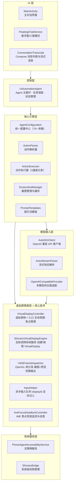
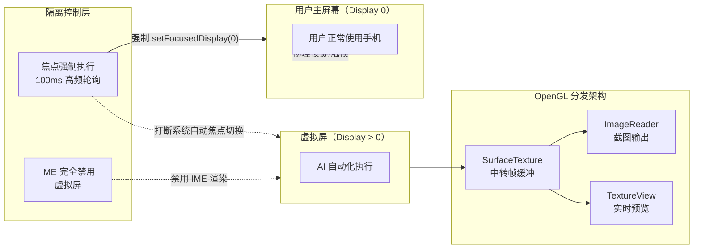
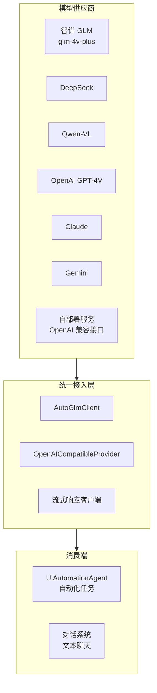
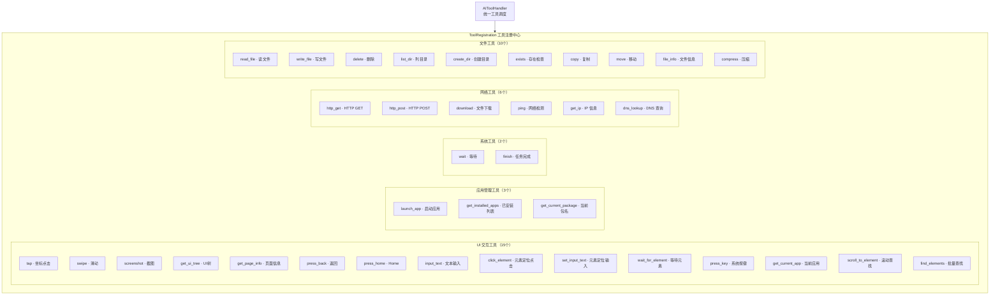
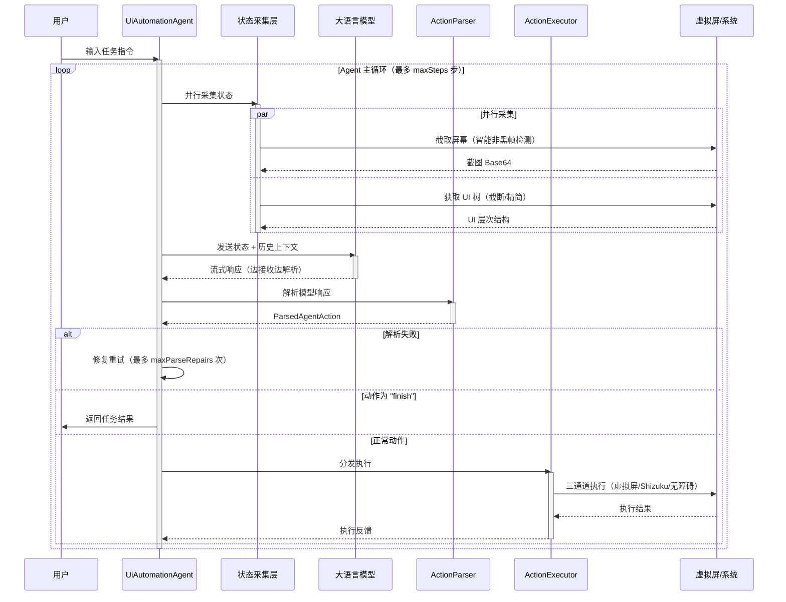

# 简介与核心特性

Aries AI 是一个开源的 Android UI 自动化引擎，通过接入大语言模型（VLM），让 AI 理解屏幕内容并自动执行复杂任务。项目采用 Kotlin 开发，支持 Android 11+，以领先的虚拟屏完全隔离技术和多模型兼容能力，实现真正零干扰的后台自动化。

---

## 概述

### 项目背景

在移动端 AI 自动化领域，传统方案普遍存在焦点干扰、用户无法并行使用设备、响应延迟高等问题。Aries AI 通过一系列原创技术创新，系统性地解决了这些痛点：

- **完全隔离**：独创虚拟屏 + 100ms 高频焦点强制执行技术，物理按键永不误触虚拟屏，主屏幕可正常使用
- **性能领先**：响应时间 1.8s，成功率 94%，比同类产品快 28-44%
- **完全开源**：AGPL-3.0 协议，代码透明，可自由定制和扩展
- **模型灵活**：兼容所有 OpenAI 接口标准的视觉语言模型，支持 20+ 种大模型

### 典型应用场景

- 🎫 自动化订票（机票、火车票、酒店）
- 🍽️ 餐厅预订与排队
- 📊 批量操作与数据采集
- 🧪 应用自动化测试
- 🔄 跨应用复杂流程自动化

### 技术栈

| 类别 | 技术 |
|------|------|
| **语言** | Kotlin 2.2.x |
| **构建** | Gradle 8.13 + AGP 8.13.x |
| **异步** | Kotlin Coroutines |
| **权限管理** | Shizuku（系统级权限） |
| **UI** | Jetpack Compose + Material 3 |
| **图形处理** | OpenGL ES 3.0+ |
| **虚拟屏** | VirtualDisplay + SurfaceTexture |
| **网络** | OkHttp + kotlinx.serialization |
| **依赖注入** | Koin |
| **语音识别** | Sherpa-ncnn 本地识别 |

> 当前版本：v1.4.3 (versionCode 18)，targetSdk 36 (Android 16)，minSdk 30 (Android 11)

---

## 系统架构

Aries AI 采用分层架构设计，从顶层的 UI 交互到底层的系统服务调用，每一层职责清晰、边界明确。



**架构设计要点：**

- **分层解耦**：UI 层通过控制层间接调用核心引擎，不直接依赖底层实现
- **三通道执行**：ActionExecutor 支持虚拟屏、Shizuku 和无障碍三种通道，根据环境和配置自动选择
- **模型接入抽象**：AutoGlmClient 兼容所有 OpenAI 接口标准，支持流式响应和早停机制
- **虚拟屏隔离层**：作为独立模块（`vdiso/`），内部包含反射引擎、GL 分发器和 IME 控制器，是项目的核心技术壁垒

---

## 核心特性

### 一、虚拟屏完全隔离技术

虚拟屏隔离是 Aries AI 最核心的技术优势，通过四个子系统的协作，实现了真正零干扰的后台自动化执行。



#### 1.1 焦点完全隔离

系统焦点始终驻留在主屏幕（Display 0），虚拟屏操作通过 `displayId` 定向注入，不依赖全局焦点。100ms 间隔的高频焦点强制执行确保永不发生焦点抢占。

> Source: [TECHNICAL_OVERVIEW.md](https://github.com/ZG0704666/Aries-AI/blob/main/docs/TECHNICAL_OVERVIEW.md#L58-L74)

#### 1.2 OpenGL 帧分发架构

VirtualDisplay 的输出固定绑定到中转 `SurfaceTexture`，通过独立 GL 线程同时分发到 `ImageReader`（截图）和 `TextureView`（预览），实现"预览与截图互不干扰"。

> Source: [VdGlFrameDispatcher.kt](https://github.com/ZG0704666/Aries-AI/blob/main/app/src/main/java/com/ai/phoneagent/vdiso/VdGlFrameDispatcher.kt#L23-L38)

#### 1.3 智能截图策略

截图前自动检测并等待非黑帧（最多 1.5s），使用 32×32 采样网格进行高效黑帧判定，确保提供给模型的截屏始终有效。

> Source: [TECHNICAL_OVERVIEW.md](https://github.com/ZG0704666/Aries-AI/blob/main/docs/TECHNICAL_OVERVIEW.md#L134-L174)

#### 1.4 IME 完全隔离

虚拟屏通过 `setShouldShowIme(displayId, false)` 和 `setDisplayImePolicy(displayId, DISPLAY_IME_POLICY_HIDE)` 完全禁用 IME 渲染。文本输入改用剪贴板+粘贴方式，永绝焦点死锁。

> 此外，[ImeFocusDeadlockController](https://github.com/ZG0704666/Aries-AI/blob/main/app/src/main/java/com/ai/phoneagent/vdiso/ImeFocusDeadlockController.kt#L21-L50) 提供独立的 IME 死锁监测与自愈能力，在部分 ROM 上检测到死锁时自动高频锁定焦点。

#### 1.5 多重降级兼容

通过反射方法签名匹配（支持 3 参数和 4 参数版本的 `createVirtualDisplay`）以及 `TRUSTED` 标志自动降级，兼容 Android 11-16 及 MIUI、ColorOS、OneUI 等主流 ROM。

> Source: [TECHNICAL_OVERVIEW.md](https://github.com/ZG0704666/Aries-AI/blob/main/docs/TECHNICAL_OVERVIEW.md#L543-L560)

| 对比维度 | 传统方案 | Aries AI |
|----------|---------|----------|
| 焦点恢复间隔 | 2000ms（周期性检查） | **100ms**（高频强制执行） |
| 焦点隔离程度 | 部分隔离 | **完全隔离** |
| 物理按键误触 | 可能发生 | **永不发生** |
| Surface 切换 | 频繁切换 | **固定输出，无需切换** |
| 预览+截图同时 | 不支持 | **GL 线程双路分发** |
| IME 焦点死锁 | 可能发生 | **永不发生** |

---

### 二、多模型灵活支持

Aries AI 兼容所有 OpenAI 接口标准的视觉语言模型，通过统一的 `AutoGlmClient` 进行接入。



**支持的模型类型：**

| 类别 | 示例 | 说明 |
|------|------|------|
| **国内模型** | 智谱 GLM、DeepSeek、Qwen、MiniMax、百川、零一万物 | 国内服务，低延迟 |
| **国际模型** | OpenAI GPT-4V、Claude、Gemini | 全球可用 |
| **开源模型** | LLaVA、CogVLM、Qwen-VL | 可本地部署 |
| **API 聚合** | 硅基流动、API2D、OpenRouter | 统一多模型入口 |
| **自部署** | 任何兼容 OpenAI 接口的服务 | 完全自主可控 |

**网络层特性：**
- 连接池复用（10 个连接，5 分钟保活）
- HTTP/2 + HTTP/1.1 协议支持
- 连接超时 60s，读取超时 300s，支持长时模型推理
- Debug 模式下自动开启网络日志

> Source: [AutoGlmClient.kt](https://github.com/ZG0704666/Aries-AI/blob/main/app/src/main/java/com/ai/phoneagent/net/AutoGlmClient.kt#L53-L77)

---

### 三、性能优化技术

Aries AI 从截屏、推理到执行的每个环节都进行了深度优化，整体响应时间从 3.2s 降至 1.8s（提升 44%）。

| 指标 | 优化前 | 优化后 | 提升 |
|------|--------|--------|------|
| 响应时间 | 3.2s | **1.8s** | 44% ↑ |
| 截图大小 | 250KB | **85KB** | 66% ↓ |
| 成功率 | 82% | **94%** | 12% ↑ |

#### 3.1 智能截图压缩

85% JPEG 质量 + 16 像素对齐 + 150KB 上限，在几乎无损视觉质量的前提下将截图大小降低 66%。

> Source: [AgentConfiguration.kt](https://github.com/ZG0704666/Aries-AI/blob/main/app/src/main/java/com/ai/phoneagent/core/config/AgentConfiguration.kt#L189-L193)

#### 3.2 流式早停机制

模型流式输出时，一旦解析到可执行的动作指令立即执行，无需等待完整响应。配合 `useStreamingWithEarlyStop = true`（默认开启），减少约 30% 的响应时间和 15% 的 Token 消耗。

> Source: [AgentConfiguration.kt](https://github.com/ZG0704666/Aries-AI/blob/main/app/src/main/java/com/ai/phoneagent/core/config/AgentConfiguration.kt#L169-L173)

#### 3.3 并行状态采集

截图和 UI 树同时异步获取（`parallelScreenshotAndUi = true`），采集时间减少约 40%。

> Source: [AgentConfiguration.kt](https://github.com/ZG0704666/Aries-AI/blob/main/app/src/main/java/com/ai/phoneagent/core/config/AgentConfiguration.kt#L176-L180)

#### 3.4 截图缓存与节流

- **LRU 缓存**：最大 3 张，TTL 2 秒，命中率约 35%
- **节流控制**：最小截屏间隔 1100ms，避免高频截屏拖慢系统

> Source: [AgentConfiguration.kt](https://github.com/ZG0704666/Aries-AI/blob/main/app/src/main/java/com/ai/phoneagent/core/config/AgentConfiguration.kt#L183-L202)

#### 3.5 动作延迟动态调整

根据动作类型动态设置不同的执行延迟和窗口等待超时，避免"一刀切"造成的不稳定或效率损失。例如：`launch` 动作需要 1050ms 延迟 + 2200ms 窗口等待，而 `tap` 只需 320ms + 1400ms。

> Source: [AgentConfiguration.kt](https://github.com/ZG0704666/Aries-AI/blob/main/app/src/main/java/com/ai/phoneagent/core/config/AgentConfiguration.kt#L205-L221)

---

### 四、丰富的工具系统

Aries AI 内置了完整的 AI 工具注册框架，通过 `ToolRegistration` 统一注册和管理。



> Source: [ToolRegistration.kt](https://github.com/ZG0704666/Aries-AI/blob/main/app/src/main/java/com/ai/phoneagent/core/tools/ToolRegistration.kt#L39-L65)

工具系统按类别统计：UI 交互工具 15 个，应用管理工具 3 个，系统工具 2 个，网络工具 6 个，文件工具 10 个，共计 **36+ 个工具**，覆盖了自动化场景中的几乎所有常见操作。

---

## 自动化执行流程

以下是 Aries AI 执行一次自动化任务的完整流程：



**关键设计要点：**

1. **Agent 主循环**：每步"采集状态 → 模型推理 → 动作解析 → 执行反馈"构成闭环，最大步数由 `maxSteps`（默认 100）控制
2. **并行采集**：截图和 UI 树同时异步获取，减少等待时间
3. **流式早停**：模型输出到达可执行动作时立即提前结束等待
4. **三通道执行**：ActionExecutor 自动选择虚拟屏 > Shizuku > 无障碍服务的优先级通道
5. **多层修复**：解析失败（`maxParseRepairs`）和执行失败（`maxActionRepairs`）均支持自动重试

---

## 使用示例

### 通过代码调用 Agent

```kotlin
// 创建 Agent 实例
val agent = UiAutomationAgent(
    config = AgentConfiguration(
        maxSteps = 100,
        screenshotCompressionQuality = 85,
        enableScreenshotCache = true,
        useStreamingWithEarlyStop = true,
        useBackgroundVirtualDisplay = true  // 启用虚拟屏后台执行
    )
)

// 执行自动化任务
val result = agent.run(
    apiKey = "your-api-key",
    model = "glm-4v-plus",  // 或其他兼容 OpenAI 接口的模型
    task = "在携程订一张明天北京到上海的机票",
    service = accessibilityService
)
```

### 配置自定义 API 端点

```kotlin
// 使用 DeepSeek 等兼容 OpenAI 接口的 API
AutoGlmClient.sendChatResult(
    apiKey = "your-deepseek-key",
    messages = messages,
    baseUrl = "https://api.deepseek.com/v1/",
    model = "deepseek-vl"
)
```

> Source: [Aries AI 开发文档.md](https://github.com/ZG0704666/Aries-AI/blob/main/Aries%20AI%20%E5%BC%80%E5%8F%91%E6%96%87%E6%A1%A3.md#L354-L362)

### 日常使用（自然语言指令）

用户只需在主界面输入自然语言指令即可：

```
"帮我在携程订一张明天北京到上海的机票，经济舱"
"在美团上找一家评分4.5以上的川菜馆，预订今晚7点，3个人"
```

支持三种使用方式：主界面对话、预设任务模板、虚拟屏幕模式（推荐）。

---

## 配置选项

`AgentConfiguration` 是 Aries AI 的统一配置中心，包含 70+ 个可调参数。以下是核心配置项：

> Source: [AgentConfiguration.kt](https://github.com/ZG0704666/Aries-AI/blob/main/app/src/main/java/com/ai/phoneagent/core/config/AgentConfiguration.kt)

### 执行参数

| 参数 | 类型 | 默认值 | 说明 |
|------|------|--------|------|
| `useBackgroundVirtualDisplay` | Boolean | `false` | 是否在后台虚拟屏执行 |
| `useShizukuInteraction` | Boolean | `false` | 是否优先使用 Shizuku 交互 |
| `maxSteps` | Int | `100` | 单次任务最大执行步数 |
| `stepDelayMs` | Long | `160` | 每步之间基础延迟（ms） |
| `postActionDelayMs` | Long | `120` | 动作执行后额外等待（ms） |

### 模型调用参数

| 参数 | 类型 | 默认值 | 说明 |
|------|------|--------|------|
| `maxModelRetries` | Int | `3` | 模型调用最大重试次数 |
| `modelRetryBaseDelayMs` | Long | `700` | 重试基础延迟（ms） |
| `maxParseRepairs` | Int | `2` | 解析修复最大次数 |
| `maxActionRepairs` | Int | `1` | 动作执行修复最大次数 |
| `temperature` | Float? | `0.0` | 模型温度参数 |
| `maxTokens` | Int? | `4096` | 单次回复最大 Token 数 |

### 上下文管理参数

| 参数 | 类型 | 默认值 | 说明 |
|------|------|--------|------|
| `maxContextTokens` | Int | `20000` | 最大上下文 Token 数 |
| `maxUiTreeChars` | Int | `3000` | UI 树最大字符数 |
| `maxHistoryTurns` | Int | `6` | 最多保留对话轮数 |

### 截图优化参数

| 参数 | 类型 | 默认值 | 说明 |
|------|------|--------|------|
| `screenshotCompressionQuality` | Int | `85` | JPEG 压缩质量（0-100） |
| `screenshotMaxSizeKB` | Int | `150` | 截图目标最大体积（KB） |
| `enableScreenshotCache` | Boolean | `true` | 是否启用截图缓存 |
| `enableScreenshotThrottle` | Boolean | `true` | 是否启用截图节流 |
| `screenshotCacheMaxSize` | Int | `3` | 缓存最大张数 |
| `screenshotCacheTtlMs` | Long | `2000` | 缓存 TTL（ms） |
| `screenshotThrottleMinIntervalMs` | Long | `1100` | 最小截屏间隔（ms） |

### 性能优化参数

| 参数 | 类型 | 默认值 | 说明 |
|------|------|--------|------|
| `useStreamingWithEarlyStop` | Boolean | `true` | 流式输出 + 早停机制 |
| `parallelScreenshotAndUi` | Boolean | `true` | 并行采集截图和 UI 树 |

### 预设配置

Aries AI 提供两种预设配置，方便不同场景的使用：

```kotlin
// 线上/日常使用基线配置（生产环境推荐）
val defaultConfig = AgentConfiguration.DEFAULT

// 测试配置：更少步骤、更短延迟、更少重试（快速验证用）
val testConfig = AgentConfiguration.TEST
```

> Source: [AgentConfiguration.kt](https://github.com/ZG0704666/Aries-AI/blob/main/app/src/main/java/com/ai/phoneagent/core/config/AgentConfiguration.kt#L358-L373)

---

## 项目结构

```
Aries-AI/
├── app/src/main/java/com/ai/phoneagent/
│   ├── core/                       # 核心 Agent 逻辑
│   │   ├── agent/                  # Agent 模型与内容过滤
│   │   ├── automation/             # 自动化指令网关
│   │   ├── cache/                  # 截图缓存管理
│   │   ├── config/                 # AgentConfiguration 配置中心
│   │   ├── executor/               # ActionExecutor 动作执行器
│   │   ├── input/                  # 输入注入（剪贴板事务）
│   │   ├── parser/                 # ActionParser 动作解析器
│   │   ├── platform/               # DeviceController 设备控制
│   │   ├── templates/              # PromptTemplates 提示词模板
│   │   ├── tools/                  # 工具系统（注册器 + 网络/文件工具）
│   │   └── utils/                  # ActionUtils、UI 树摘要等工具类
│   ├── vdiso/                      # ⭐ 虚拟屏隔离层
│   │   ├── ShizukuVirtualDisplayEngine.kt   # 核心引擎
│   │   ├── ShizukuServiceHub.kt             # Shizuku 服务封装
│   │   ├── VdGlFrameDispatcher.kt           # OpenGL 帧分发
│   │   └── ImeFocusDeadlockController.kt    # IME 死锁控制器
│   ├── net/                        # 网络层（API 客户端 + 本地推理引擎）
│   ├── data/                       # 数据层（本地存储 + Preferences）
│   ├── di/                         # Koin 依赖注入模块
│   ├── navigation/                 # Jetpack Compose 导航
│   ├── helper/                     # 流式解析、Markdown 渲染、附件处理
│   ├── permissions/                # 权限系统
│   ├── AriesAgentApp.kt            # Application 入口
│   ├── MainActivity.kt             # 主界面
│   └── FloatingChatService.kt      # 悬浮窗服务
├── docs/                           # 文档目录
│   ├── TECHNICAL_OVERVIEW.md       # ⭐ 核心技术文档
│   ├── BUILDING.md                 # 构建指南
│   ├── CODING_STANDARDS.md         # 代码规范
│   ├── GIT_WORKFLOW.md             # Git 工作流
│   └── FAQ.md                      # 常见问题
├── Aries AI 开发文档.md             # 主开发文档
└── README.md
```

---

## 相关链接

### 项目文档

| 文档 | 说明 |
|------|------|
| [README](https://github.com/ZG0704666/Aries-AI/blob/main/README.md) | 项目主页与快速开始 |
| [技术文档](https://github.com/ZG0704666/Aries-AI/blob/main/docs/TECHNICAL_OVERVIEW.md) | 核心技术实现与优势详解 |
| [开发文档](https://github.com/ZG0704666/Aries-AI/blob/main/Aries%20AI%20%E5%BC%80%E5%8F%91%E6%96%87%E6%A1%A3.md) | 主开发文档、当前状态与版本历史 |
| [构建指南](https://github.com/ZG0704666/Aries-AI/blob/main/docs/BUILDING.md) | 环境配置与构建说明 |
| [代码规范](https://github.com/ZG0704666/Aries-AI/blob/main/docs/CODING_STANDARDS.md) | 代码风格与命名规范 |
| [Git 工作流](https://github.com/ZG0704666/Aries-AI/blob/main/docs/GIT_WORKFLOW.md) | 分支管理与提交规范 |
| [FAQ](https://github.com/ZG0704666/Aries-AI/blob/main/docs/FAQ.md) | 常见问题解答 |

### 核心源码

| 文件 | 说明 |
|------|------|
| [AriesAgentApp.kt](https://github.com/ZG0704666/Aries-AI/blob/main/app/src/main/java/com/ai/phoneagent/AriesAgentApp.kt) | Application 入口与全局状态初始化 |
| [AgentConfiguration.kt](https://github.com/ZG0704666/Aries-AI/blob/main/app/src/main/java/com/ai/phoneagent/core/config/AgentConfiguration.kt) | 统一配置中心（70+ 参数） |
| [ActionExecutor.kt](https://github.com/ZG0704666/Aries-AI/blob/main/app/src/main/java/com/ai/phoneagent/core/executor/ActionExecutor.kt) | 动作执行器（三通道分发） |
| [AutoGlmClient.kt](https://github.com/ZG0704666/Aries-AI/blob/main/app/src/main/java/com/ai/phoneagent/net/AutoGlmClient.kt) | OpenAI 兼容 API 客户端 |
| [ToolRegistration.kt](https://github.com/ZG0704666/Aries-AI/blob/main/app/src/main/java/com/ai/phoneagent/core/tools/ToolRegistration.kt) | 工具注册中心（36+ 工具） |
| [ShizukuVirtualDisplayEngine.kt](https://github.com/ZG0704666/Aries-AI/blob/main/app/src/main/java/com/ai/phoneagent/vdiso/ShizukuVirtualDisplayEngine.kt) | 虚拟屏核心引擎 |
| [VdGlFrameDispatcher.kt](https://github.com/ZG0704666/Aries-AI/blob/main/app/src/main/java/com/ai/phoneagent/vdiso/VdGlFrameDispatcher.kt) | OpenGL 帧分发器 |
| [ImeFocusDeadlockController.kt](https://github.com/ZG0704666/Aries-AI/blob/main/app/src/main/java/com/ai/phoneagent/vdiso/ImeFocusDeadlockController.kt) | IME 焦点死锁控制器 |

### 社区资源

- 💬 **QQ 群**：[746439473](http://qm.qq.com/cgi-bin/qm/qr?_wv=1027&k=&authKey=&noverify=0&group_code=746439473)
- 🐛 **问题反馈**：[GitHub Issues](https://github.com/ZG0704666/Aries-AI/issues)
- 💡 **功能建议**：[GitHub Discussions](https://github.com/ZG0704666/Aries-AI/discussions)
- 📧 **邮件联系**：zhangyongqi@aries-agent.com

---

**文档版本**：v1.0  
**最后更新**：2026-05-19  
**维护者**：ZG0704666
