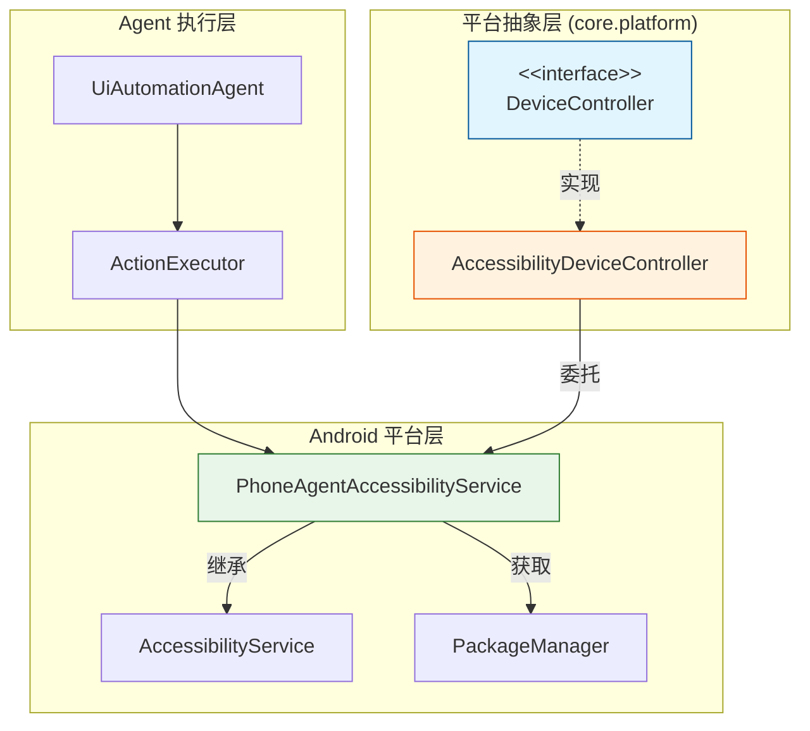
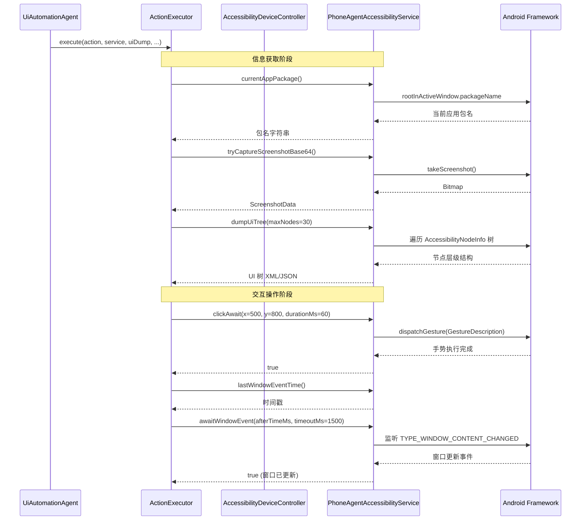

# 设备控制器 (DeviceController)

设备控制器的平台抽象层 —— 解耦 Android AccessibilityService 依赖，为 UI 自动化提供统一的设备交互接口，提高代码的可测试性和可替换性。

## 概述

`DeviceController` 是 Aries-AI 框架中 `core.platform` 包的核心接口，定义了 AI 代理与 Android 设备之间交互的所有基础操作。它的设计目标是**将自动化逻辑与具体的 Android 平台实现解耦**，使上层业务代码不直接依赖 `AccessibilityService`，从而：

- **提高可测试性**：在单元测试中可以使用 Mock 实现替代真实的 AccessibilityService
- **提高可替换性**：未来可扩展其他实现（如通过 ADB、Shizuku 等通道），无需修改上层代码
- **统一接口规范**：明确定义设备操作的能力边界，便于理解和维护

当前唯一的实现是 `AccessibilityDeviceController`，它是一个轻量级适配器，将所有调用委托给 `PhoneAgentAccessibilityService`（Android 无障碍服务）。

## 架构



架构说明：

| 层级 | 组件 | 职责 |
|------|------|------|
| Agent 执行层 | `UiAutomationAgent` / `ActionExecutor` | 协调 AI 模型输出并执行自动化动作 |
| 平台抽象层 | `DeviceController` 接口 | 定义设备交互的标准契约 |
| 平台抽象层 | `AccessibilityDeviceController` | 适配器实现，桥接接口与 Android 服务 |
| Android 平台层 | `PhoneAgentAccessibilityService` | 实际的 Android 无障碍服务，执行真实的设备操作 |

> **设计说明**：当前 `ActionExecutor` 直接引用 `PhoneAgentAccessibilityService?` 而非通过 `DeviceController` 接口，表明该抽象层目前处于**基础设施准备阶段**。接口已定义完毕，后续重构可将 `ActionExecutor` 的依赖切换为 `DeviceController`，届时即可在不修改执行器的情况下切换设备控制实现。

## 接口定义

### DeviceController 接口

`DeviceController` 定义了 14 个方法，覆盖了 UI 自动化的全部基础操作。源码位于 `core.platform` 包中：

> Source: [DeviceController.kt](https://github.com/ZG0704666/Aries-AI/blob/main/app/src/main/java/com/ai/phoneagent/core/platform/DeviceController.kt#L27-L115)

```kotlin
interface DeviceController {
    
    /** 获取当前应用包名 */
    fun getCurrentAppPackage(): String
    
    /** 尝试截取截图 */
    suspend fun tryCaptureScreenshot(): PhoneAgentAccessibilityService.ScreenshotData?
    
    /** 获取UI树 */
    fun dumpUiTree(maxNodes: Int = 30, detail: String = "summary"): String
    
    /** 点击坐标 */
    suspend fun click(x: Float, y: Float, durationMs: Long = 60L): Boolean
    
    /** 滑动 */
    suspend fun swipe(
        startX: Float, startY: Float,
        endX: Float, endY: Float,
        durationMs: Long = 300L
    ): Boolean
    
    /** 设置输入框文本 */
    fun setTextOnFocused(text: String): Boolean
    
    /** 在指定元素上设置文本 */
    suspend fun setTextOnElement(
        text: String,
        resourceId: String? = null,
        elementText: String? = null,
        contentDesc: String? = null,
        className: String? = null,
        index: Int = 0
    ): Boolean
    
    /** 点击元素 */
    suspend fun clickElement(
        resourceId: String? = null,
        text: String? = null,
        contentDesc: String? = null,
        className: String? = null,
        index: Int = 0
    ): Boolean
    
    /** 查找并点击第一个可编辑元素 */
    suspend fun clickFirstEditableElement(): Boolean
    
    /** 执行全局返回 */
    fun performGlobalBack(): Boolean
    
    /** 执行全局Home */
    fun performGlobalHome(): Boolean
    
    /** 获取包管理器 */
    fun getPackageManager(): android.content.pm.PackageManager
    
    /** 获取最后一次窗口事件时间 */
    fun getLastWindowEventTime(): Long
    
    /** 等待窗口事件 */
    suspend fun awaitWindowEvent(afterTimeMs: Long, timeoutMs: Long = 1500L): Boolean
}
```

### 方法分类

接口方法按照功能可分为以下几类：

```mermaid
flowchart LR
    subgraph Info["信息获取"]
        A[getCurrentAppPackage]
        B[dumpUiTree]
        C[tryCaptureScreenshot]
        D[getPackageManager]
        E[getLastWindowEventTime]
    end

    subgraph Action["交互操作"]
        F[click]
        G[swipe]
        H[setTextOnFocused]
        I[setTextOnElement]
        J[clickElement]
        K[clickFirstEditableElement]
    end

    subgraph Nav["导航操作"]
        L[performGlobalBack]
        M[performGlobalHome]
    end

    subgraph Sync["同步等待"]
        N[awaitWindowEvent]
    end

    Info --> Action
    Action --> Nav
    Nav --> Sync
```



| 分类 | 方法 | 说明 |
|------|------|------|
| 信息获取 | `getCurrentAppPackage`, `dumpUiTree`, `tryCaptureScreenshot`, `getPackageManager`, `getLastWindowEventTime` | 感知当前设备状态、获取 UI 结构和截图 |
| 交互操作 | `click`, `swipe`, `setTextOnFocused`, `setTextOnElement`, `clickElement`, `clickFirstEditableElement` | 模拟用户在屏幕上的操作 |
| 导航操作 | `performGlobalBack`, `performGlobalHome` | 系统级导航，不依赖具体 UI 元素 |
| 同步等待 | `awaitWindowEvent` | 等待窗口状态变化，确保操作生效后再进行下一步 |

## 实现：AccessibilityDeviceController

`AccessibilityDeviceController` 是 `DeviceController` 接口的唯一实现，采用**适配器模式**，将所有操作委托给 `PhoneAgentAccessibilityService`。

> Source: [DeviceController.kt](https://github.com/ZG0704666/Aries-AI/blob/main/app/src/main/java/com/ai/phoneagent/core/platform/DeviceController.kt#L120-L188)

```kotlin
class AccessibilityDeviceController(
    private val service: PhoneAgentAccessibilityService
) : DeviceController {
    
    override fun getCurrentAppPackage(): String = service.currentAppPackage()
    
    override suspend fun tryCaptureScreenshot(): PhoneAgentAccessibilityService.ScreenshotData? = 
        service.tryCaptureScreenshotBase64()
    
    override fun dumpUiTree(maxNodes: Int, detail: String): String =
        service.dumpUiTree(maxNodes)
    
    override suspend fun click(x: Float, y: Float, durationMs: Long): Boolean = 
        service.clickAwait(x, y, durationMs)
    
    override suspend fun swipe(
        startX: Float, startY: Float,
        endX: Float, endY: Float,
        durationMs: Long
    ): Boolean = service.swipeAwait(startX, startY, endX, endY, durationMs)
    
    override fun setTextOnFocused(text: String): Boolean = 
        service.setTextOnFocused(text)
    
    override suspend fun setTextOnElement(
        text: String, resourceId: String?, elementText: String?,
        contentDesc: String?, className: String?, index: Int
    ): Boolean = service.setTextOnElement(
        text = text, resourceId = resourceId, elementText = elementText,
        contentDesc = contentDesc, className = className, index = index
    )
    
    override suspend fun clickElement(
        resourceId: String?, text: String?, contentDesc: String?,
        className: String?, index: Int
    ): Boolean = service.clickElement(
        resourceId = resourceId, text = text, contentDesc = contentDesc,
        className = className, index = index
    )
    
    override suspend fun clickFirstEditableElement(): Boolean = 
        service.clickFirstEditableElement()
    
    override fun performGlobalBack(): Boolean = service.performGlobalBack()
    
    override fun performGlobalHome(): Boolean = service.performGlobalHome()
    
    override fun getPackageManager(): android.content.pm.PackageManager = 
        service.packageManager
    
    override fun getLastWindowEventTime(): Long = service.lastWindowEventTime()
    
    override suspend fun awaitWindowEvent(afterTimeMs: Long, timeoutMs: Long): Boolean = 
        service.awaitWindowEvent(afterTimeMs, timeoutMs)
}
```

### 设计决策分析

AccessibilityDeviceController 的实现极其简洁，采用了**纯委托模式**：

1. **一对一映射**：每个接口方法都直接对应 `PhoneAgentAccessibilityService` 的一个方法，不做额外逻辑处理
2. **零状态**：控制器本身不维护任何状态，所有状态由底层的 `AccessibilityService` 管理
3. **懒验证**：参数不做预校验，由底层服务在执行时自行处理错误情况

这种设计确保适配器层的**透明性**和**零开销**——它在接口和实现之间不引入任何额外行为，仅充当类型安全的桥梁。

## 核心交互流程

以下序列图展示了一个典型的 AI Agent 任务中，通过 DeviceController 执行设备操作的完整流程：



### 流程说明

1. **信息获取阶段**：Agent 首先通过 `ActionExecutor` 获取当前应用包名、截图和 UI 树，构建上下文信息发送给 AI 模型
2. **动作决策阶段**（图中省略）：AI 模型根据上下文返回需要执行的动作指令
3. **交互操作阶段**：`ActionExecutor` 解析动作后直接调用 `PhoneAgentAccessibilityService` 的方法执行操作（注意：当前 `ActionExecutor` 不通过 `DeviceController` 接口，而是直接使用 service 引用）
4. **同步等待阶段**：每次操作后通过 `lastWindowEventTime` 和 `awaitWindowEvent` 等待 UI 稳定，确保后续操作的可靠性

## 使用示例

### 基本用法：创建并使用控制器

```kotlin
// 获取 AccessibilityService 实例（由 Android 系统管理生命周期）
val service = PhoneAgentAccessibilityService.instance ?: return

// 创建设备控制器
val deviceController: DeviceController = AccessibilityDeviceController(service)

// 获取当前应用包名
val currentApp = deviceController.getCurrentAppPackage()
println("当前应用: $currentApp")

// 获取 UI 树（最多 30 个节点，摘要模式）
val uiTree = deviceController.dumpUiTree(maxNodes = 30, detail = "summary")
println("UI 树: $uiTree")

// 点击屏幕坐标 (500, 800)
val clicked = deviceController.click(x = 500f, y = 800f)
if (clicked) {
    // 等待窗口更新
    val eventTime = deviceController.getLastWindowEventTime()
    deviceController.awaitWindowEvent(afterTimeMs = eventTime)
}

// 执行返回操作
deviceController.performGlobalBack()
```

> Source: [DeviceController.kt](https://github.com/ZG0704666/Aries-AI/blob/main/app/src/main/java/com/ai/phoneagent/core/platform/DeviceController.kt#L27-L188) — 示例代码基于接口方法签名构造

### 通过选择器点击元素

```kotlin
val deviceController: DeviceController = AccessibilityDeviceController(service)

// 通过 resourceId 点击特定元素
deviceController.clickElement(resourceId = "com.example:id/confirm_button")

// 通过文本内容点击
deviceController.clickElement(text = "确认")

// 通过 contentDescription 点击
deviceController.clickElement(contentDesc = "搜索按钮")

// 组合条件点击（取第一个匹配的元素）
deviceController.clickElement(
    className = "android.widget.Button",
    text = "提交",
    index = 0
)
```

> Source: [DeviceController.kt](https://github.com/ZG0704666/Aries-AI/blob/main/app/src/main/java/com/ai/phoneagent/core/platform/DeviceController.kt#L78-L84)

### 文本输入操作

```kotlin
val deviceController: DeviceController = AccessibilityDeviceController(service)

// 方式1：在当前聚焦的输入框设置文本
deviceController.setTextOnFocused("Hello World")

// 方式2：在指定元素上设置文本
deviceController.setTextOnElement(
    text = "搜索关键词",
    resourceId = "com.example:id/search_input",
    className = "android.widget.EditText"
)

// 方式3：先点击第一个可编辑元素，再设置文本
val clicked = deviceController.clickFirstEditableElement()
if (clicked) {
    deviceController.setTextOnFocused("自动填充的文本")
}
```

> Source: [DeviceController.kt](https://github.com/ZG0704666/Aries-AI/blob/main/app/src/main/java/com/ai/phoneagent/core/platform/DeviceController.kt#L60-L90)

### 截图与滑动操作

```kotlin
val deviceController: DeviceController = AccessibilityDeviceController(service)

// 截取屏幕截图
val screenshot = deviceController.tryCaptureScreenshot()
screenshot?.let { data ->
    println("截图尺寸: ${data.width}x${data.height}")
    println("Base64 数据长度: ${data.base64Png.length}")
}

// 向上滑动（从下往上）
deviceController.swipe(
    startX = 540f, startY = 1500f,
    endX = 540f, endY = 500f,
    durationMs = 300L
)

// 等待界面稳定
val time = deviceController.getLastWindowEventTime()
deviceController.awaitWindowEvent(afterTimeMs = time, timeoutMs = 1500L)
```

> Source: [DeviceController.kt](https://github.com/ZG0704666/Aries-AI/blob/main/app/src/main/java/com/ai/phoneagent/core/platform/DeviceController.kt#L37-L56)

## 配置选项

`DeviceController` 接口本身不包含配置参数，但底层 `PhoneAgentAccessibilityService` 的行为受 `AgentConfiguration` 控制。以下是与设备操作相关的关键配置：

> Source: [AgentConfiguration.kt](https://github.com/ZG0704666/Aries-AI/blob/main/app/src/main/java/com/ai/phoneagent/core/config/AgentConfiguration.kt)

| 配置项 | 类型 | 默认值 | 说明 |
|--------|------|--------|------|
| `useBackgroundVirtualDisplay` | `Boolean` | `false` | 是否在后台虚拟屏执行操作（不影响前台用户） |
| `useShizukuInteraction` | `Boolean` | `false` | 是否启用 Shizuku 交互通道（绕过无障碍服务限制） |
| `clickDurationMs` | `Long` | `60L` | 单击持续时间（毫秒） |
| `longPressDurationMs` | `Long` | `800L` | 长按持续时间（毫秒） |
| `doubleTapIntervalMs` | `Long` | `120L` | 双击间隔（毫秒） |
| `scrollDurationMs` | `Long` | `300L` | 滑动动画持续时间（毫秒） |
| `tapAwaitWindowTimeoutMs` | `Long` | `1200L` | 点击后等待窗口更新的超时时间 |
| `typeAwaitWindowTimeoutMs` | `Long` | `1000L` | 输入后等待窗口更新的超时时间 |
| `backAwaitWindowTimeoutMs` | `Long` | `800L` | 返回后等待窗口更新的超时时间 |
| `swipeAwaitWindowTimeoutMs` | `Long` | `1200L` | 滑动后等待窗口更新的超时时间 |
| `appLaunchWaitTimeoutMs` | `Long` | `3000L` | 应用启动等待超时时间 |

## API 参考

### 信息获取方法

#### `getCurrentAppPackage(): String`

获取当前前台应用的包名。

- **返回**：当前前台应用的 Android 包名字符串（如 `"com.android.settings"`）。若无活动窗口返回空字符串。
- **底层实现**：通过 `rootInActiveWindow?.packageName` 获取

> Source: [PhoneAgentAccessibilityService.kt](https://github.com/ZG0704666/Aries-AI/blob/main/app/src/main/java/com/ai/phoneagent/PhoneAgentAccessibilityService.kt#L206-L208)

#### `tryCaptureScreenshot(): PhoneAgentAccessibilityService.ScreenshotData?`

异步截取当前屏幕截图，返回 Base64 编码的图像数据。

- **返回**：`ScreenshotData?` — 包含宽度、高度、Base64 PNG/JPEG 数据及 MIME 类型。Android 版本 < 30 时返回 `null`。

> Source: [PhoneAgentAccessibilityService.kt](https://github.com/ZG0704666/Aries-AI/blob/main/app/src/main/java/com/ai/phoneagent/PhoneAgentAccessibilityService.kt#L236-L238) | [ScreenshotData](https://github.com/ZG0704666/Aries-AI/blob/main/app/src/main/java/com/ai/phoneagent/PhoneAgentAccessibilityService.kt#L199-L204)

#### `dumpUiTree(maxNodes: Int = 30, detail: String = "summary"): String`

导出当前窗口的无障碍 UI 树结构。

- **参数**：
  - `maxNodes` — 最大节点数限制（默认 30），防止大数据量
  - `detail` — 详细程度：`"summary"`（摘要，含坐标和关键属性）、`"minimal"`（最小信息）
- **返回**：UI 树的 XML 或 JSON 字符串表示

> Source: [PhoneAgentAccessibilityService.kt](https://github.com/ZG0704666/Aries-AI/blob/main/app/src/main/java/com/ai/phoneagent/PhoneAgentAccessibilityService.kt#L654-L656)

### 交互操作方法

#### `click(x: Float, y: Float, durationMs: Long = 60L): Boolean`

在指定屏幕坐标执行点击操作。

- **参数**：
  - `x`, `y` — 屏幕坐标（像素）
  - `durationMs` — 点击持续时间（默认 60ms，用于区分单击和长按）
- **返回**：操作是否成功
- **底层实现**：通过 `GestureDescription` 构建点击手势并派发

> Source: [PhoneAgentAccessibilityService.kt](https://github.com/ZG0704666/Aries-AI/blob/main/app/src/main/java/com/ai/phoneagent/PhoneAgentAccessibilityService.kt#L890)

#### `swipe(startX, startY, endX, endY, durationMs = 300L): Boolean`

在屏幕上执行滑动手势。

- **参数**：
  - `startX`, `startY` — 起始坐标
  - `endX`, `endY` — 结束坐标
  - `durationMs` — 滑动动画持续时间
- **返回**：操作是否成功

> Source: [DeviceController.kt](https://github.com/ZG0704666/Aries-AI/blob/main/app/src/main/java/com/ai/phoneagent/core/platform/DeviceController.kt#L52-L56)

#### `setTextOnFocused(text: String): Boolean`

在当前获得焦点的输入框中设置文本。

- **参数**：`text` — 要设置的文本内容
- **返回**：操作是否成功（无焦点输入框时返回 `false`）

> Source: [PhoneAgentAccessibilityService.kt](https://github.com/ZG0704666/Aries-AI/blob/main/app/src/main/java/com/ai/phoneagent/PhoneAgentAccessibilityService.kt#L658-L660)

#### `clickElement(resourceId?, text?, contentDesc?, className?, index): Boolean`

通过元素属性定位并点击 UI 元素。

- **参数**：
  - `resourceId` — Android 资源 ID（如 `"com.example:id/button"`）
  - `text` — 元素显示的文本
  - `contentDesc` — 无障碍内容描述
  - `className` — Android 控件类名（如 `"android.widget.Button"`）
  - `index` — 多个匹配时的索引（默认 0 取第一个）
- **返回**：是否找到并成功点击目标元素

> Source: [DeviceController.kt](https://github.com/ZG0704666/Aries-AI/blob/main/app/src/main/java/com/ai/phoneagent/core/platform/DeviceController.kt#L78-L84)

### 导航操作方法

#### `performGlobalBack(): Boolean`

执行全局返回操作（相当于按下系统返回键）。

- **返回**：操作是否成功
- **底层实现**：`performGlobalAction(GLOBAL_ACTION_BACK)`

> Source: [PhoneAgentAccessibilityService.kt](https://github.com/ZG0704666/Aries-AI/blob/main/app/src/main/java/com/ai/phoneagent/PhoneAgentAccessibilityService.kt#L210-L212)

#### `performGlobalHome(): Boolean`

执行全局回到主页操作（相当于按下系统 Home 键）。

- **返回**：操作是否成功
- **底层实现**：`performGlobalAction(GLOBAL_ACTION_HOME)`

> Source: [PhoneAgentAccessibilityService.kt](https://github.com/ZG0704666/Aries-AI/blob/main/app/src/main/java/com/ai/phoneagent/PhoneAgentAccessibilityService.kt#L214-L216)

### 同步等待方法

#### `getLastWindowEventTime(): Long`

获取最后一次窗口事件的时间戳。

- **返回**：时间戳（毫秒），基于 `AccessibilityEvent.eventTime`

> Source: [PhoneAgentAccessibilityService.kt](https://github.com/ZG0704666/Aries-AI/blob/main/app/src/main/java/com/ai/phoneagent/PhoneAgentAccessibilityService.kt#L935)

#### `awaitWindowEvent(afterTimeMs: Long, timeoutMs: Long = 1500L): Boolean`

等待在指定时间之后发生的窗口内容变化事件。

- **参数**：
  - `afterTimeMs` — 基准时间戳，等待此时间之后的事件
  - `timeoutMs` — 超时时间（默认 1500ms）
- **返回**：是否在超时前收到了新的窗口事件
- **典型用法**：操作后等待 UI 稳定：先获取 `getLastWindowEventTime()`，操作，再调用此方法等待新事件

> Source: [PhoneAgentAccessibilityService.kt](https://github.com/ZG0704666/Aries-AI/blob/main/app/src/main/java/com/ai/phoneagent/PhoneAgentAccessibilityService.kt#L937)

## 文件结构

```
app/src/main/java/com/ai/phoneagent/
├── core/
│   └── platform/
│       └── DeviceController.kt          ← 接口 + AccessibilityDeviceController 实现
├── PhoneAgentAccessibilityService.kt    ← Android 无障碍服务（底层实现）
└── UiAutomationAgent.kt                  ← 主 Agent 协调器
```

## 相关链接

- [DeviceController.kt 源文件](https://github.com/ZG0704666/Aries-AI/blob/main/app/src/main/java/com/ai/phoneagent/core/platform/DeviceController.kt) — 接口定义与实现
- [PhoneAgentAccessibilityService.kt 源文件](https://github.com/ZG0704666/Aries-AI/blob/main/app/src/main/java/com/ai/phoneagent/PhoneAgentAccessibilityService.kt) — 底层无障碍服务
- [ActionExecutor.kt 源文件](https://github.com/ZG0704666/Aries-AI/blob/main/app/src/main/java/com/ai/phoneagent/core/executor/ActionExecutor.kt) — 动作执行器（设备操作的消费者）
- [AgentConfiguration.kt 源文件](https://github.com/ZG0704666/Aries-AI/blob/main/app/src/main/java/com/ai/phoneagent/core/config/AgentConfiguration.kt) — 与设备操作相关的超时和延迟配置
- [UiAutomationAgent.kt 源文件](https://github.com/ZG0704666/Aries-AI/blob/main/app/src/main/java/com/ai/phoneagent/UiAutomationAgent.kt) — 主 Agent 协调器

---

*本文档基于 [ZG0704666/Aries-AI](https://github.com/ZG0704666/Aries-AI) 仓库 `main` 分支的实际源代码生成。*
