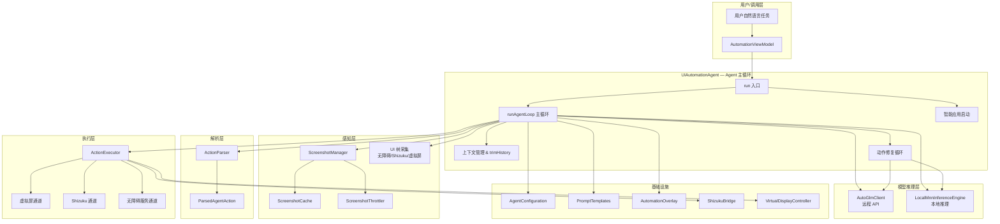
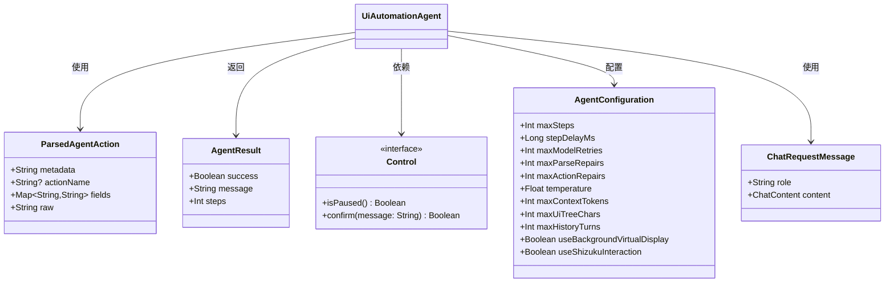
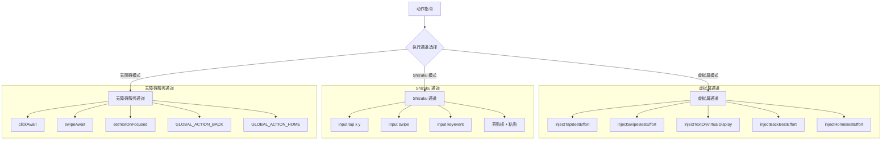
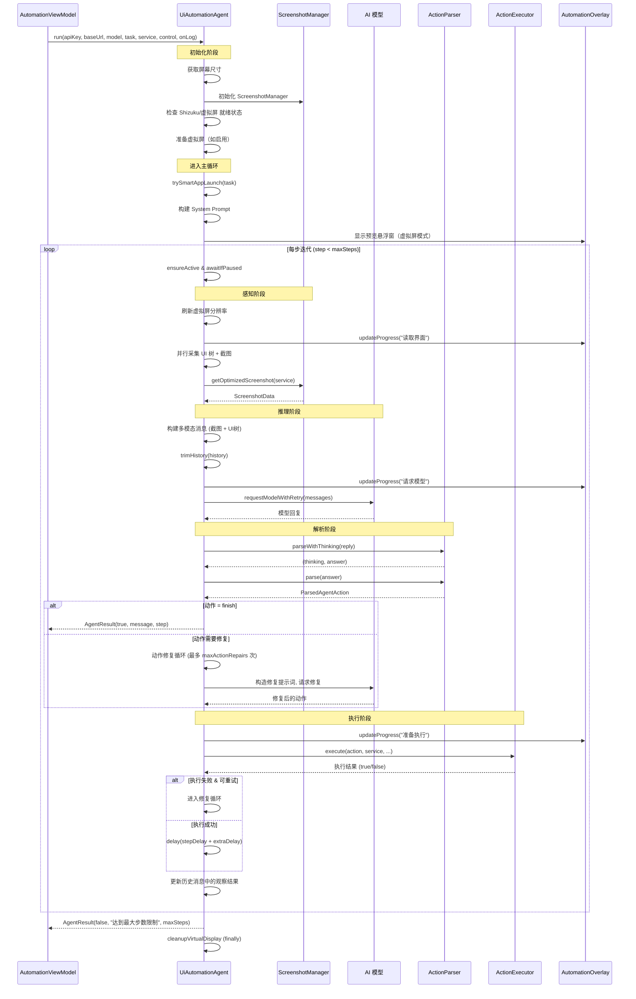
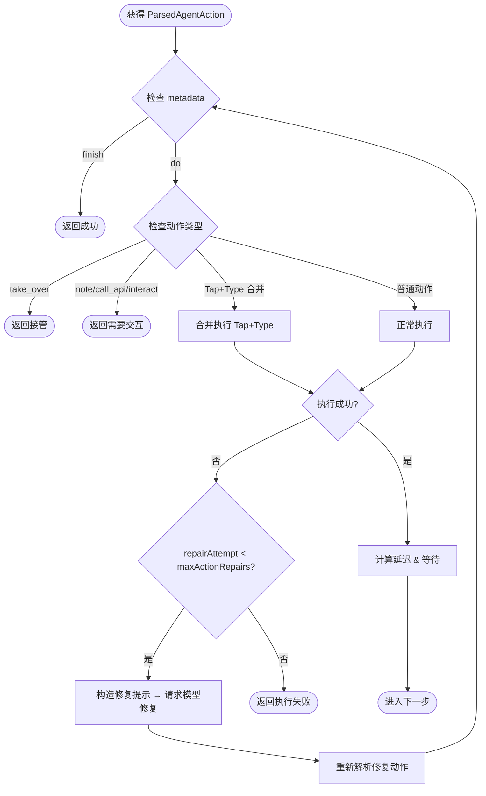
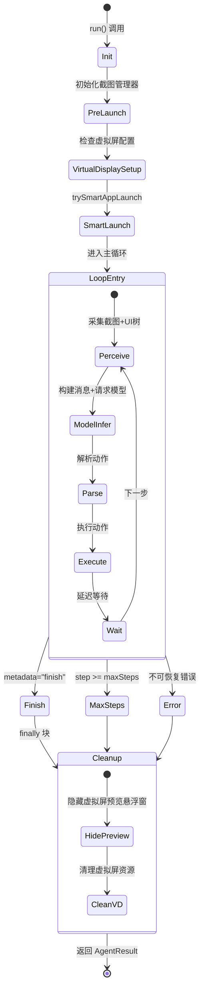

# 自动化 Agent 主循环

Aries AI 自动化系统的核心调度引擎，负责驱动「截图采集 → 模型推理 → 动作解析 → 动作执行 → 反馈修复」的闭环自动化流程。

## 概述

`UiAutomationAgent` 是整个 Aries AI 自动化系统的中枢控制器。它实现了一个基于 **观察-推理-执行循环（Observation-Reasoning-Action Loop）** 的智能 Agent，能够接收用户的自然语言任务描述，自动完成 Android 设备上的 UI 操作。

### 核心能力

- **多模态感知**：并行采集设备截图和 UI 树（无障碍层级结构），构建完整的界面状态描述
- **AI 模型决策**：将界面状态发送给 AI 模型（支持 AutoGLM 远程 API 和本地 MNN 推理），由模型输出下一步应执行的动作
- **动作解析与执行**：解析模型输出的结构化动作指令，分发到虚拟屏、Shizuku 或无障碍服务通道执行
- **失败自修复**：当动作执行失败或输出格式异常时，自动构造修复提示请求模型重新生成
- **上下文管理**：维护对话历史，通过三种策略（移除图片、Token 估算裁剪、对话轮数裁剪）防止上下文溢出
- **进度可视化**：通过悬浮窗（AutomationOverlay）实时展示步骤进度、思考过程和执行状态

### 使用场景

- 通过自然语言指令操作手机应用（如「帮我在微信中给张三发一条消息」）
- 跨应用自动化工作流（如「打开淘宝搜索某商品并截图」）
- 需要后台静默执行的自动化任务（虚拟屏模式）

### 设计原则

`UiAutomationAgent` 采用了清晰的分层架构，将不同职责拆分到独立组件中：

- **配置层**：`AgentConfiguration` — 统一管理所有可调参数
- **解析层**：`ActionParser` — 解析模型输出的结构化动作
- **执行层**：`ActionExecutor` — 按通道优先级执行具体动作
- **缓存层**：`ScreenshotManager` — 截图缓存、节流与压缩优化
- **模板层**：`PromptTemplates` — 构造系统提示词与修复提示词

这种分层设计确保了各组件的单一职责和可测试性，Agent 本身仅负责协调流程。

## 架构

### 整体架构图



- **UiAutomationAgent** 是整个架构的中心调度器，负责连接感知、推理、解析与执行各层
- **感知层** 通过 `ScreenshotManager` 获取截图（支持缓存和节流），同时通过无障碍服务或 Shizuku 采集 UI 树
- **模型推理层** 支持两种后端：远程 AutoGLM API (`AutoGlmClient`) 和本地 MNN 推理引擎 (`LocalMnnInferenceEngine`)
- **解析层** 的 `ActionParser` 支持多种输出格式（`<think>/<answer>` XML 标签、中文标签、纯文本）
- **执行层** 按优先级选择通道：虚拟屏 > Shizuku > 无障碍服务

### 核心数据模型



> Source: [AgentModels.kt](https://github.com/ZG0704666/Aries-AI/blob/main/app/src/main/java/com/ai/phoneagent/core/agent/AgentModels.kt#L7-L12)

### 执行通道架构



执行通道的优先级选择逻辑：
1. **虚拟屏模式**（`useBackgroundVirtualDisplay=true`）：所有操作在后台虚拟屏执行，不干扰前台用户操作
2. **Shizuku 模式**（`useShizukuInteraction=true` 且非虚拟屏）：利用 Shizuku 的 ADB 级权限直接注入事件，绕过无障碍的局限性
3. **无障碍模式**（默认）：通过 Android AccessibilityService 执行操作，兼容性最广但受系统限制

## Agent 主循环详解

### 主循环执行流程



### 详细步骤分解

主循环的每一次迭代（Step）包含以下核心阶段：

#### 1. 感知阶段 —— 界面状态采集

> Source: [UiAutomationAgent.kt](https://github.com/ZG0704666/Aries-AI/blob/main/app/src/main/java/com/ai/phoneagent/UiAutomationAgent.kt#L249-L287)

Agent 根据当前配置选择数据采集方式：

- **虚拟屏模式**：使用纯视觉驱动（`[虚拟屏模式-纯视觉驱动]`），UI 树信息由截图替代
- **Shizuku 模式**：通过 `ShizukuBridge.dumpUiHierarchyXml()` 采集 UI 层级（可禁用仅用截图）
- **无障碍模式**：通过 `service.dumpUiTreeWithRetry()` 采集 UI 树

截图通过 `ScreenshotManager.getOptimizedScreenshot()` 获取，内部集成了缓存、节流和压缩优化。

#### 2. 推理阶段 —— 构建请求并调用模型

```kotlin
// 构建多模态消息
val userContent: ChatContent =
    if (screenshot != null) {
        ChatContent.Multimodal(
            listOf(
                ContentPart.ImageUrlPart(
                    ImageUrl("data:${screenshot.mimeType};base64,${screenshot.base64Png}")
                ),
                ContentPart.TextPart(userMsg)
            )
        )
    } else {
        ChatContent.Text(userMsg)
    }
```

> Source: [UiAutomationAgent.kt](https://github.com/ZG0704666/Aries-AI/blob/main/app/src/main/java/com/ai/phoneagent/UiAutomationAgent.kt#L319-L333)

首步（step=1）消息中包含用户任务描述 + 屏幕信息 + UI 树；后续步骤仅含屏幕信息 + UI 树。截图以 base64 编码的 Data URL 形式附加。

模型调用通过 `requestModelWithRetry` 方法，支持：
- **远程 API**：`AutoGlmClient.sendChatResult()` 
- **本地推理**：`LocalMnnInferenceEngine.sendChatResult()`
- **指数退避重试**：失败时使用 `computeModelRetryDelayMs` 计算等待时间

#### 3. 解析阶段 —— 提取思考与动作

> Source: [ActionParser.kt](https://github.com/ZG0704666/Aries-AI/blob/main/app/src/main/java/com/ai/phoneagent/core/parser/ActionParser.kt#L184-L224)

`ActionParser.parseWithThinking()` 支持多种输出格式：

| 格式 | 示例 |
|------|------|
| Open-AutoGLM 格式 | `<think>思考内容</think><answer>do(action="Tap", ...)</answer>` |
| Aries 中文格式 | `【思考开始】思考内容【思考结束】【回答开始】do(...)` |
| 纯文本格式 | 直接查找 `finish(message=` 或 `do(action=` |

第一步时还会从思考文本中解析预估步骤数（`parseEstimatedSteps`），用于进度显示。

如果动作解析失败（metadata 不是 "do" 也不是 "finish"），会触发 **解析修复循环**（`parseActionWithRepair`），最多重试 `maxParseRepairs` 次。

#### 4. 执行阶段 —— 动作分发与修复

动作执行是一个内层循环，支持失败修复：



关键设计决策：
- **Tap+Type 合并执行**（`executeTapAndTypeCombined`）：当检测到连续 Tap 后紧跟 Type 动作时，将它们合并为一次操作，减少延迟和不稳定性。仅在 Shizuku 或虚拟屏模式下启用。
- **动作修复**：执行失败后不直接终止，而是将失败动作发送给模型请求修复，由模型生成新的替代动作。
- **敏感内容检测**：在执行 Tap/Type 前通过 `ActionUtils.looksSensitive()` 检测 UI 树中是否包含敏感关键词（如支付密码、银行卡号等），如检测到则跳过操作。

#### 5. 上下文管理 —— trimHistory

> Source: [UiAutomationAgent.kt](https://github.com/ZG0704666/Aries-AI/blob/main/app/src/main/java/com/ai/phoneagent/UiAutomationAgent.kt#L1206-L1251)

Agent 使用三种策略防止上下文超出模型限制：

1. **移除图片保留文本**：将历史中的多模态消息转换为纯文本，仅保留文本部分
2. **Token 估算裁剪**：当 `estimateHistoryTokens(history) > maxContextTokens` 时，从最早的非系统消息开始逐条移除
3. **对话轮数裁剪**：仅保留最近 `maxHistoryTurns` 轮对话（每轮包含一对 user + assistant 消息）

三种策略按顺序执行，确保上下文始终在可控范围内。

### 生命周期管理



`run()` 方法使用 **try-finally** 模式确保虚拟屏资源在任何退出路径下都被正确清理。`runAgentLoop` 被设计为私有挂起函数，从 `run` 中取出以支持此清理模式。

## 使用示例

### 基本用法

```kotlin
// 创建 Agent 配置
val config = AgentConfiguration(
    maxSteps = 50,
    stepDelayMs = 200L,
    maxModelRetries = 2
)

// 创建 Agent 实例
val agent = UiAutomationAgent(appContext, config)

// 执行自动化任务
val result = agent.run(
    apiKey = "your-api-key",
    baseUrl = "https://api.example.com",
    model = "autoglm-phone",
    useThirdPartyApi = false,
    task = "打开微信，搜索'张三'，发送消息'你好'",
    service = accessibilityService,
    control = object : UiAutomationAgent.Control {
        override fun isPaused(): Boolean = false
        override suspend fun confirm(message: String): Boolean = true
    },
    onLog = { msg -> Log.d("Agent", msg) }
)

if (result.success) {
    Log.i("Agent", "任务完成：${result.message}，共 ${result.steps} 步")
} else {
    Log.e("Agent", "任务失败：${result.message}")
}
```

> Sources:
> - [UiAutomationAgent.kt](https://github.com/ZG0704666/Aries-AI/blob/main/app/src/main/java/com/ai/phoneagent/UiAutomationAgent.kt#L109-L168)
> - [AgentConfiguration.kt](https://github.com/ZG0704666/Aries-AI/blob/main/app/src/main/java/com/ai/phoneagent/core/config/AgentConfiguration.kt#L38-L63)

### 虚拟屏模式（后台静默执行）

```kotlin
// 启用虚拟屏模式，在后台执行不干扰前台用户
val bgConfig = AgentConfiguration(
    useBackgroundVirtualDisplay = true,
    maxSteps = 100
)

val agent = UiAutomationAgent(appContext, bgConfig)
val result = agent.run(
    apiKey = apiKey,
    baseUrl = baseUrl,
    model = model,
    task = "在淘宝中搜索'机械键盘'并按销量排序",
    service = null, // 虚拟屏模式不需要无障碍服务连接
    control = NoopControl,
    onLog = { appendLog(it) }
)
```

> Sources:
> - [UiAutomationAgent.kt](https://github.com/ZG0704666/Aries-AI/blob/main/app/src/main/java/com/ai/phoneagent/UiAutomationAgent.kt#L132-L148)
> - [AgentConfiguration.kt](https://github.com/ZG0704666/Aries-AI/blob/main/app/src/main/java/com/ai/phoneagent/core/config/AgentConfiguration.kt#L46)

### 从 ViewModel 中的实际调用

```kotlin
// AutomationViewModel 中的实际调用代码
val agent = UiAutomationAgent(appContext, config)
val result =
    agent.run(
        apiKey = apiKey,
        baseUrl = baseUrl,
        model = model,
        useThirdPartyApi = useThirdPartyApi,
        task = task,
        service = svc,
        control =
            object : UiAutomationAgent.Control {
                override fun isPaused(): Boolean = paused
                override suspend fun confirm(message: String): Boolean {
                    if (autoApprove) return true
                    // 弹出确认对话框...
                    return suspendCancellableCoroutine { cont -> /* ... */ }
                }
            },
        onLog = { msg ->
            appendLog(msg)
            // 虚拟屏状态更新...
        },
    )
```

> Source: [AutomationViewModel.kt](https://github.com/ZG0704666/Aries-AI/blob/main/app/src/main/java/com/ai/phoneagent/viewmodel/AutomationViewModel.kt#L903-L959)

## 配置选项

以下是 `AgentConfiguration` 中的核心配置参数。所有参数都有合理的默认值，可直接使用默认配置完成任务。

### 执行参数

| 参数 | 类型 | 默认值 | 描述 |
|------|------|--------|------|
| `useBackgroundVirtualDisplay` | Boolean | `false` | 是否使用后台虚拟屏模式。true 时自动化在虚拟屏执行，不影响前台 |
| `useShizukuInteraction` | Boolean | `false` | 是否启用 Shizuku 交互能力，失败不回退到无障碍 |
| `maxSteps` | Int | `100` | 最大执行步数，防止模型在错误 UI 上无限循环 |
| `stepDelayMs` | Long | `160` | 每步之间的基础延迟（毫秒），给系统与无障碍事件队列喘息时间 |
| `postActionDelayMs` | Long | `120` | 动作执行后的统一 settle delay |

### 模型调用参数

| 参数 | 类型 | 默认值 | 描述 |
|------|------|--------|------|
| `maxModelRetries` | Int | `3` | 模型调用最大重试次数（处理网络波动/服务端错误） |
| `modelRetryBaseDelayMs` | Long | `700` | 重试基础延迟（毫秒），采用指数退避策略 |
| `maxParseRepairs` | Int | `2` | 解析修复最大次数（输出格式不符合预期时） |
| `maxActionRepairs` | Int | `1` | 动作执行修复最大次数（元素找不到/点击无效时） |
| `temperature` | Float? | `0.0` | 温度参数，自动化任务通常希望更确定性 |
| `topP` | Float? | `0.85` | nucleus sampling 参数 |
| `frequencyPenalty` | Float? | `0.2` | 频率惩罚，减少重复 token |
| `maxTokens` | Int? | `4096` | 单次回复的最大 token 数 |

### 上下文管理参数

| 参数 | 类型 | 默认值 | 描述 |
|------|------|--------|------|
| `maxContextTokens` | Int | `20000` | 最大上下文 token 数，触发裁剪策略 |
| `maxUiTreeChars` | Int | `3000` | UI 树最大字符数，超过时截断 |
| `maxHistoryTurns` | Int | `6` | 最多保留对话轮数 |

### 截图优化参数

| 参数 | 类型 | 默认值 | 描述 |
|------|------|--------|------|
| `enableScreenshotCache` | Boolean | `true` | 是否启用截图缓存 |
| `enableScreenshotThrottle` | Boolean | `true` | 是否启用截图节流 |
| `screenshotCompressionQuality` | Int | `85` | 截图压缩质量 (0-100) |
| `screenshotMaxSizeKB` | Int | `150` | 截图目标最大体积 (KB) |
| `screenshotCacheMaxSize` | Int | `3` | 截图缓存最大张数 |
| `screenshotCacheTtlMs` | Long | `2000` | 截图缓存 TTL (毫秒) |
| `screenshotThrottleMinIntervalMs` | Long | `1100` | 截图最小间隔 (毫秒) |
| `screenshotScalePercent` | Int | `80` | 截图缩放比例 (百分比) |

### 动作延迟参数

| 参数 | 类型 | 默认值 | 描述 |
|------|------|--------|------|
| `launchActionDelayMs` | Long | `1050` | 启动应用后延迟 |
| `tapActionDelayMs` | Long | `320` | 点击后延迟 |
| `typeActionDelayMs` | Long | `260` | 输入后延迟 |
| `swipeActionDelayMs` | Long | `420` | 滑动后延迟 |
| `backActionDelayMs` | Long | `220` | 返回后延迟 |
| `homeActionDelayMs` | Long | `420` | 回到桌面后延迟 |
| `waitActionDelayMs` | Long | `650` | 等待后延迟 |
| `defaultActionDelayMs` | Long | `240` | 默认延迟 |

> Source: [AgentConfiguration.kt](https://github.com/ZG0704666/Aries-AI/blob/main/app/src/main/java/com/ai/phoneagent/core/config/AgentConfiguration.kt#L38-L421)

## API 参考

### `UiAutomationAgent`

#### 构造函数

```kotlin
class UiAutomationAgent(
    private val appContext: Context,
    private val config: AgentConfiguration = AgentConfiguration.DEFAULT,
)
```

**参数：**
- `appContext` (Context): 应用上下文，用于创建组件和访问系统服务
- `config` (AgentConfiguration): Agent 配置，默认使用 `AgentConfiguration.DEFAULT`

> Source: [UiAutomationAgent.kt](https://github.com/ZG0704666/Aries-AI/blob/main/app/src/main/java/com/ai/phoneagent/UiAutomationAgent.kt#L61-L64)

#### `run()`

```kotlin
suspend fun run(
    apiKey: String,
    baseUrl: String,
    model: String,
    useThirdPartyApi: Boolean = false,
    task: String,
    service: PhoneAgentAccessibilityService?,
    control: Control = NoopControl,
    onLog: (String) -> Unit,
): AgentResult
```

启动自动化 Agent 执行任务。

**参数：**
- `apiKey` (String): AI 模型 API 密钥
- `baseUrl` (String): AI 模型 API 基础 URL
- `model` (String): 模型名称
- `useThirdPartyApi` (Boolean): 是否使用第三方 API（影响提示词中的 desc 规则）
- `task` (String): 用户任务描述（自然语言）
- `service` (PhoneAgentAccessibilityService?): 无障碍服务实例，为 null 时仅支持 Shizuku/虚拟屏模式
- `control` (Control): 任务控制接口，用于暂停和确认
- `onLog` ((String) -> Unit): 日志回调

**返回值：** `AgentResult` 包含：
- `success` (Boolean): 任务是否成功完成
- `message` (String): 结果消息（成功时为完成消息，失败时为错误描述）
- `steps` (Int): 已执行的步数

**内部流程：**
1. 获取屏幕尺寸
2. 初始化 `ScreenshotManager`
3. 检查 Shizuku 可用性（如需要）
4. 准备虚拟屏（如启用）
5. 进入 `runAgentLoop` 主循环
6. finally 块中清理虚拟屏资源

> Source: [UiAutomationAgent.kt](https://github.com/ZG0704666/Aries-AI/blob/main/app/src/main/java/com/ai/phoneagent/UiAutomationAgent.kt#L109-L168)

#### `Control` 接口

```kotlin
interface Control {
    fun isPaused(): Boolean
    suspend fun confirm(message: String): Boolean
}
```

**方法：**
- `isPaused()`: 检查任务是否处于暂停状态。返回 true 时主循环会等待直到恢复
- `confirm(message)`: 请求用户确认操作。返回 true 表示用户同意

**默认实现：** `NoopControl` 始终返回 `isPaused=false`，`confirm=false`

> Source: [UiAutomationAgent.kt](https://github.com/ZG0704666/Aries-AI/blob/main/app/src/main/java/com/ai/phoneagent/UiAutomationAgent.kt#L91-L99)

#### `AgentResult`

```kotlin
data class AgentResult(
    val success: Boolean,
    val message: String,
    val steps: Int,
)
```

> Source: [UiAutomationAgent.kt](https://github.com/ZG0704666/Aries-AI/blob/main/app/src/main/java/com/ai/phoneagent/UiAutomationAgent.kt#L103-L107)

### `ParsedAgentAction`

```kotlin
data class ParsedAgentAction(
    val metadata: String,           // "do" 或 "finish" 或 "unknown"
    val actionName: String?,        // 动作名称（如 tap, swipe, type）
    val fields: Map<String, String>, // 动作参数字典
    val raw: String = ""            // 原始响应文本
)
```

`metadata` 的可能值：
- `"do"` — 可执行的动作指令
- `"finish"` — 任务完成
- `"unknown"` — 无法解析的动作

> Source: [AgentModels.kt](https://github.com/ZG0704666/Aries-AI/blob/main/app/src/main/java/com/ai/phoneagent/core/agent/AgentModels.kt#L7-L12)

### 支持的动作类型

| 动作名称 | 别名 | 参数 | 描述 |
|----------|------|------|------|
| `Launch` | `open_app`, `start_app` | `app`/`package` | 启动应用 |
| `Tap` | `click`, `press` | `element`/`point`, `x`, `y` | 点击指定坐标 |
| `Type` | `input`, `text`, `type_name` | `text` | 输入文本 |
| `Swipe` | `scroll` | `start`, `end`, `start_x/y`, `end_x/y`, `duration` | 滑动操作 |
| `LongPress` | `long_press` | `element` | 长按 |
| `DoubleTap` | `double_tap` | `element` | 双击 |
| `Back` | — | — | 返回上一页 |
| `Home` | — | — | 回到桌面 |
| `Wait` | `sleep` | `duration` | 等待指定时长 |
| `Take_over` | `takeover` | `message` | 请求用户接管 |
| `Note` | `call_api`, `interact` | — | 需要交互/扩展能力 |
| `finish` | — | `message` | 完成任务 |

> Source: [ActionExecutor.kt](https://github.com/ZG0704666/Aries-AI/blob/main/app/src/main/java/com/ai/phoneagent/core/executor/ActionExecutor.kt#L183-L211)

## 错误处理与容错机制

Agent 主循环具备多层容错能力：

| 层级 | 机制 | 配置参数 | 描述 |
|------|------|----------|------|
| 模型调用 | 指数退避重试 | `maxModelRetries`, `modelRetryBaseDelayMs` | 网络波动、服务端错误时自动重试 |
| 输出解析 | 格式化修复 | `maxParseRepairs` | 输出不符合 `do()/finish()` 格式时请求模型修正 |
| 动作执行 | 动作替换修复 | `maxActionRepairs` | 执行失败时让模型重新规划替代动作 |
| 上下文 | 多层裁剪 | `maxContextTokens`, `maxHistoryTurns` | 防止上下文溢出导致模型输出质量下降 |
| 生命周期 | try-finally | — | 确保虚拟屏等资源在任何退出路径下都被清理 |
| 协程取消 | `ensureActive()` | — | 每步迭代开始检查协程是否被取消，支持优雅中止 |

## 相关链接

- [UiAutomationAgent.kt — 源代码](https://github.com/ZG0704666/Aries-AI/blob/main/app/src/main/java/com/ai/phoneagent/UiAutomationAgent.kt)
- [AgentModels.kt — 数据模型](https://github.com/ZG0704666/Aries-AI/blob/main/app/src/main/java/com/ai/phoneagent/core/agent/AgentModels.kt)
- [ActionExecutor.kt — 动作执行器](https://github.com/ZG0704666/Aries-AI/blob/main/app/src/main/java/com/ai/phoneagent/core/executor/ActionExecutor.kt)
- [ActionParser.kt — 动作解析器](https://github.com/ZG0704666/Aries-AI/blob/main/app/src/main/java/com/ai/phoneagent/core/parser/ActionParser.kt)
- [AgentConfiguration.kt — 配置管理](https://github.com/ZG0704666/Aries-AI/blob/main/app/src/main/java/com/ai/phoneagent/core/config/AgentConfiguration.kt)
- [ScreenshotManager.kt — 截图管理](https://github.com/ZG0704666/Aries-AI/blob/main/app/src/main/java/com/ai/phoneagent/core/cache/ScreenshotManager.kt)
- [PromptTemplates.kt — 提示词模板](https://github.com/ZG0704666/Aries-AI/blob/main/app/src/main/java/com/ai/phoneagent/core/templates/PromptTemplates.kt)
- [AutoGlmClient.kt — API 客户端](https://github.com/ZG0704666/Aries-AI/blob/main/app/src/main/java/com/ai/phoneagent/net/AutoGlmClient.kt)
- [AutomationViewModel.kt — 调用入口](https://github.com/ZG0704666/Aries-AI/blob/main/app/src/main/java/com/ai/phoneagent/viewmodel/AutomationViewModel.kt)
- [Aries AI 开发文档](https://github.com/ZG0704666/Aries-AI/blob/main/Aries%20AI%20%E5%BC%80%E5%8F%91%E6%96%87%E6%A1%A3.md)
