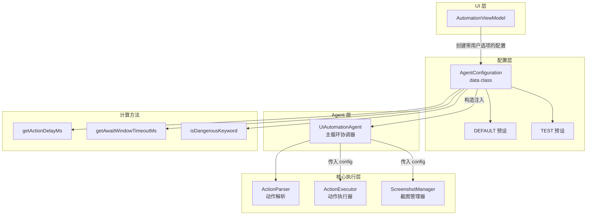
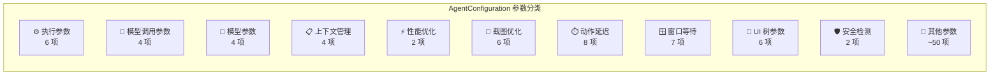
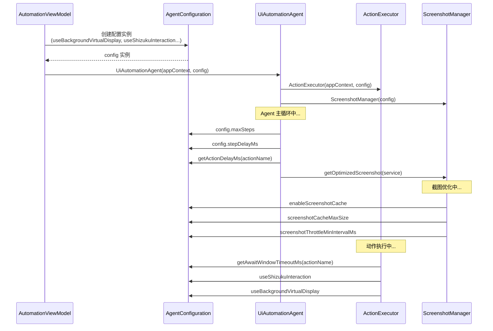
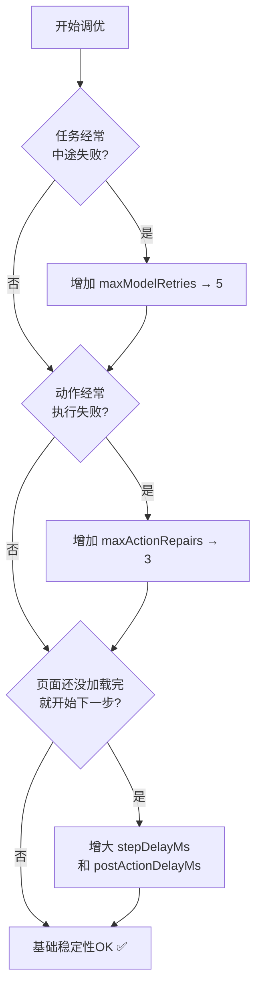
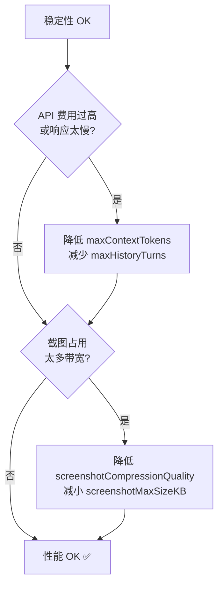
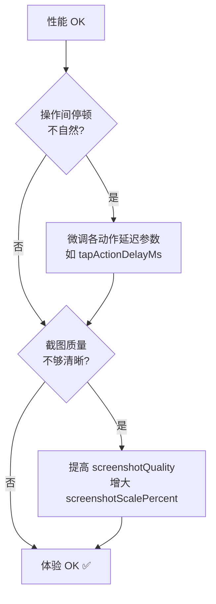

# 配置管理 (AgentConfiguration)

Aries AI 框架的统一配置管理中心，将原本分散的配置参数整合为一个 Kotlin `data class`，提供完整、可解释、分层可调的自动化行为控制。

## 概述

`AgentConfiguration` 是 Aries AI Android UI 自动化框架的核心配置类。它整合了原先分散在多个类中的配置项，所有参数均设有合理默认值，开发者可以在不传入任何参数的情况下完成一次完整的端到端自动化任务。

### 设计原则

1. **默认可用**：不传入任何参数即可完成端到端自动化任务，开箱即用
2. **可解释**：每个参数都映射到明确的「稳定性/性能/体验」目标，避免魔法数字
3. **可分层调参**：按优先级分层调整参数：
   - **第一层**：调整重试/修复/等待参数 → 提升稳定性
   - **第二层**：调整截图/上下文截断参数 → 控制 Token 与延迟
   - **第三层**：调整动作延迟参数 → 优化动画与观感

### 核心用途

- 控制 Agent 执行循环的最大步数、步间延迟和动作后等待
- 配置模型调用重试、解析修复和动作修复策略
- 管理上下文窗口大小、对话历史轮数和 UI 树截断
- 优化截图缓存、节流与压缩，平衡性能与清晰度
- 定义各类动作 (Tap、Type、Swipe 等) 的精确延迟和窗口等待超时
- 检测危险操作关键词，防止资金/账户风险
- 控制 Shizuku 交互、后台虚拟屏等高级执行模式

## 架构

`AgentConfiguration` 在 Aries AI 分层架构中位于**配置层**，是贯穿整个自动化流水线的控制中枢：



**架构说明：**

| 组件 | 角色 | 与 AgentConfiguration 的关系 |
|------|------|---------------------------|
| `AutomationViewModel` | 配置生产者 | 根据用户设置（后台模式、Shizuku 开关）创建定制化的 `AgentConfiguration` 实例 |
| `UiAutomationAgent` | 主循环协调器 | 接收配置，在 Agent 循环中引用各参数控制步数、延迟、重试等行为 |
| `ActionExecutor` | 动作执行器 | 使用配置中的延迟、超时、虚拟屏/Shizuku 模式参数 |
| `ScreenshotManager` | 截图管理器 | 使用配置中的缓存、节流、压缩等截图优化参数 |
| `getActionDelayMs()` | 动作延迟映射 | 根据动作名称返回对应延迟，供 Agent 主循环计算步间等待 |
| `getAwaitWindowTimeoutMs()` | 窗口等待超时映射 | 根据动作名称返回窗口变化等待超时，供执行层判断操作结果 |
| `isDangerousKeyword()` | 危险操作检测 | 判断文本是否包含危险关键词，用于触发用户二次确认 |

## 配置参数分类

`AgentConfiguration` 包含 **100+** 个配置参数，按功能划分为以下类别：



### 执行参数

控制 Agent 主循环的执行模式与步数限制。

| 参数 | 类型 | 默认值 | 说明 |
|------|------|--------|------|
| `useBackgroundVirtualDisplay` | `Boolean` | `false` | 是否启用后台虚拟屏模式（任务在后台隔离执行，不影响前台操作） |
| `useShizukuInteraction` | `Boolean` | `false` | 是否启用 Shizuku 交互能力（视图树读取、坐标点击与输入更高效） |
| `maxSteps` | `Int` | `100` | 单次任务最大执行步数，防止模型在错误 UI 上无限循环 |
| `stepDelayMs` | `Long` | `160` | 每步之间的基础延迟（毫秒），给系统和无障碍事件队列「喘息时间」 |
| `postActionDelayMs` | `Long` | `120` | 动作执行后的统一 settle delay，吸收动画/网络加载的尾巴 |

### 模型调用参数

控制 API 调用的容错与修复策略。

| 参数 | 类型 | 默认值 | 说明 |
|------|------|--------|------|
| `maxModelRetries` | `Int` | `3` | 模型调用最大重试次数（覆盖网络波动、5xx、超时等场景） |
| `modelRetryBaseDelayMs` | `Long` | `700` | 重试基础延迟（毫秒），配合指数退避算法使用 |
| `maxParseRepairs` | `Int` | `2` | 解析修复最大次数（模型输出格式不符合预期时的修复重试） |
| `maxActionRepairs` | `Int` | `1` | 动作执行修复最大次数（元素找不到、点击无效等执行层失败） |

### 模型参数

控制模型生成行为的超参数。

| 参数 | 类型 | 默认值 | 说明 |
|------|------|--------|------|
| `temperature` | `Float?` | `0.0` | 温度参数，自动化任务追求确定性，因此默认接近 0 |
| `topP` | `Float?` | `0.85` | nucleus sampling 参数，控制输出多样性 |
| `frequencyPenalty` | `Float?` | `0.2` | 频率惩罚，减少重复 token 输出 |
| `maxTokens` | `Int?` | `4096` | 单次回复最大 token 数（不等价于上下文窗口） |

### 上下文管理参数

控制对话上下文窗口，防止上下文爆炸。

| 参数 | 类型 | 默认值 | 说明 |
|------|------|--------|------|
| `maxContextTokens` | `Int` | `20000` | 最大上下文 token 数，用于本地「上下文裁剪/摘要」策略 |
| `maxUiTreeChars` | `Int` | `3000` | UI 树最大字符数，超过阈值时截断以控制 token 消耗 |
| `maxHistoryTurns` | `Int` | `6` | 最多保留对话轮数（自动化更关注最近几轮状态） |

### 动作延迟参数

每种动作类型有独立的执行后延迟，精细控制不同操作的等待时间。

| 参数 | 类型 | 默认值 | 适用动作 |
|------|------|--------|----------|
| `launchActionDelayMs` | `Long` | `1050` | `launch`、`open_app`、`start_app` |
| `typeActionDelayMs` | `Long` | `260` | `type`、`input`、`text`、`type_name` |
| `tapActionDelayMs` | `Long` | `320` | `tap`、`click`、`press`、`longpress`、`doubletap` |
| `swipeActionDelayMs` | `Long` | `420` | `swipe`、`scroll` |
| `backActionDelayMs` | `Long` | `220` | `back` |
| `homeActionDelayMs` | `Long` | `420` | `home` |
| `waitActionDelayMs` | `Long` | `650` | `wait` |
| `defaultActionDelayMs` | `Long` | `240` | 其他未匹配动作 |

### 窗口事件等待参数

动作发出后等待 Accessibility 窗口事件/UI 变化的超时时间。

| 参数 | 类型 | 默认值 | 适用动作 |
|------|------|--------|----------|
| `launchAwaitWindowTimeoutMs` | `Long` | `2200` | 应用启动 |
| `backAwaitWindowTimeoutMs` | `Long` | `1400` | 返回操作 |
| `homeAwaitWindowTimeoutMs` | `Long` | `1800` | Home 键 |
| `tapAwaitWindowTimeoutMs` | `Long` | `1400` | 点击操作 |
| `swipeAwaitWindowTimeoutMs` | `Long` | `1600` | 滑动操作 |
| `typeAwaitWindowTimeoutMs` | `Long` | `1200` | 输入操作 |
| `defaultAwaitWindowTimeoutMs` | `Long` | `1500` | 其他动作 |

## 核心方法

`AgentConfiguration` 不仅存储配置数据，还提供三个关键计算方法：

### `getActionDelayMs(actionName: String): Long`

根据动作名称映射对应的动作延迟。内部对动作名称做归一化处理（去空格、转小写），确保对于模型的多样化输出格式具有鲁棒性。

```kotlin
fun getActionDelayMs(actionName: String): Long {
    val normalized = actionName.replace(" ", "").lowercase()
    return when (normalized) {
        "launch", "open_app", "start_app" -> launchActionDelayMs
        "type", "input", "text", "type_name" -> typeActionDelayMs
        "tap", "click", "press", "doubletap", "double_tap", "longpress", "long_press" -> tapActionDelayMs
        "swipe", "scroll" -> swipeActionDelayMs
        "back" -> backActionDelayMs
        "home" -> homeActionDelayMs
        "wait" -> waitActionDelayMs
        else -> defaultActionDelayMs
    }
}
```
> Source: [AgentConfiguration.kt](https://github.com/ZG0704666/Aries-AI/blob/main/app/src/main/java/com/ai/phoneagent/core/config/AgentConfiguration.kt#L380-L392)

**设计意图**：模型输出的动作名称可能因模型而异（例如 `tap` vs `click` vs `press`），通过归一化映射确保无论模型输出哪种命名变体，都能匹配到正确的延迟配置。

### `getAwaitWindowTimeoutMs(actionName: String): Long`

根据动作名称映射窗口事件等待超时。用于动作执行后等待 UI 变化的判定窗口。

```kotlin
fun getAwaitWindowTimeoutMs(actionName: String): Long {
    val normalized = actionName.replace(" ", "").lowercase()
    return when (normalized) {
        "launch", "open_app", "start_app" -> launchAwaitWindowTimeoutMs
        "back" -> backAwaitWindowTimeoutMs
        "home" -> homeAwaitWindowTimeoutMs
        "tap", "click", "press", "longpress", "long_press", "doubletap", "double_tap" -> tapAwaitWindowTimeoutMs
        "swipe", "scroll" -> swipeAwaitWindowTimeoutMs
        "type", "input", "text" -> typeAwaitWindowTimeoutMs
        else -> defaultAwaitWindowTimeoutMs
    }
}
```
> Source: [AgentConfiguration.kt](https://github.com/ZG0704666/Aries-AI/blob/main/app/src/main/java/com/ai/phoneagent/core/config/AgentConfiguration.kt#L400-L411)

### `isDangerousKeyword(text: String): Boolean`

判断文本是否包含危险操作关键词，用于 UI 文本/用户输入/模型输出的风险分级。

```kotlin
fun isDangerousKeyword(text: String): Boolean {
    return dangerousOperationKeywords.any { text.contains(it, ignoreCase = true) }
}
```
> Source: [AgentConfiguration.kt](https://github.com/ZG0704666/Aries-AI/blob/main/app/src/main/java/com/ai/phoneagent/core/config/AgentConfiguration.kt#L418-L420)

**危险操作关键词**（默认值）：

```kotlin
val dangerousOperationKeywords: List<String> = listOf(
    "支付", "密码", "银行卡", "信用卡", "cvv", "安全码",
    "验证码", "确认支付", "确认付款"
)
```
> Source: [AgentConfiguration.kt](https://github.com/ZG0704666/Aries-AI/blob/main/app/src/main/java/com/ai/phoneagent/core/config/AgentConfiguration.kt#L353-L356)

## 预设配置

`AgentConfiguration` 在 `companion object` 中提供了两种开箱即用的预设：

### DEFAULT — 生产环境基线

```kotlin
val DEFAULT = AgentConfiguration()
```
> Source: [AgentConfiguration.kt](https://github.com/ZG0704666/Aries-AI/blob/main/app/src/main/java/com/ai/phoneagent/core/config/AgentConfiguration.kt#L360)

所有参数使用默认值。适用于日常线上自动化任务，在稳定性、性能和观感之间取得平衡。

### TEST — 快速测试模式

```kotlin
val TEST = AgentConfiguration(
    maxSteps = 10,
    stepDelayMs = 50L,
    maxModelRetries = 1,
    screenshotThrottleMinIntervalMs = 500L,
    screenshotCacheTtlMs = 1000L,
)
```
> Source: [AgentConfiguration.kt](https://github.com/ZG0704666/Aries-AI/blob/main/app/src/main/java/com/ai/phoneagent/core/config/AgentConfiguration.kt#L366-L372)

特点：更少步骤、更短延迟、更少重试，便于快速失败并定位问题。适用于单元测试和快速回归。

## 配置流转

下图展示了一个自动化任务中 `AgentConfiguration` 如何被创建并流转到各个组件：



## 使用示例

### 基础用法 — 使用默认配置

最简单的使用方式，直接使用 `DEFAULT` 预设：

```kotlin
val agent = UiAutomationAgent(appContext, AgentConfiguration.DEFAULT)

val result = agent.run(
    apiKey = "your-api-key",
    baseUrl = "https://api.example.com",
    model = "autoglm-phone",
    task = "打开微信，给张三发一条消息",
    service = accessibilityService,
    onLog = { log -> println(log) }
)
```
> Source: [UiAutomationAgent.kt](https://github.com/ZG0704666/Aries-AI/blob/main/app/src/main/java/com/ai/phoneagent/UiAutomationAgent.kt#L61-L64)

### 自定义配置

根据具体场景覆盖默认参数：

```kotlin
val customConfig = AgentConfiguration(
    maxSteps = 50,
    stepDelayMs = 200L,
    screenshotCompressionQuality = 90,
    enableScreenshotCache = true,
    enableScreenshotThrottle = true,
    useStreamingWithEarlyStop = true,
    temperature = 0.1f,
    maxTokens = 8192,
    maxContextTokens = 15000,
)

val agent = UiAutomationAgent(appContext, customConfig)
```
> Source: [README.md](https://github.com/ZG0704666/Aries-AI/blob/main/README.md#L141-L148)

### ViewModel 中的动态配置

实际项目中，配置通常由 `AutomationViewModel` 根据用户界面选项动态创建：

```kotlin
val config = AgentConfiguration(
    useBackgroundVirtualDisplay = isBackgroundMode,
    useShizukuInteraction = effectiveUseShizuku,
)

val agent = UiAutomationAgent(appContext, config)
val result = agent.run(
    apiKey = apiKey,
    baseUrl = baseUrl,
    model = model,
    useThirdPartyApi = useThirdPartyApi,
    task = task,
    service = svc,
    control = object : UiAutomationAgent.Control {
        override fun isPaused(): Boolean = paused
        override suspend fun confirm(message: String): Boolean { /* ... */ }
    },
    onLog = { msg -> appendLog(msg) },
)
```
> Source: [AutomationViewModel.kt](https://github.com/ZG0704666/Aries-AI/blob/main/app/src/main/java/com/ai/phoneagent/viewmodel/AutomationViewModel.kt#L891-L903)

### 测试场景 — 使用 TEST 预设

```kotlin
@Test
fun `AgentConfiguration TEST 配置适用于测试`() {
    val testConfig = AgentConfiguration.TEST

    assertEquals(10, testConfig.maxSteps)
    assertEquals(50L, testConfig.stepDelayMs)
    assertEquals(1, testConfig.maxModelRetries)
}
```
> Source: [CoreModuleTest.kt](https://github.com/ZG0704666/Aries-AI/blob/main/app/src/test/java/com/ai/phoneagent/core/CoreModuleTest.kt#L201-L207)

## 配置调优指南

### 稳定性优先（推荐入门顺序）



### 性能优化（Token 与延迟控制）



### 体验优化（动画与观感）



## 安全检测机制

`AgentConfiguration` 内置两类关键词列表用于风险检测：

| 关键词列表 | 用途 | 默认条目示例 |
|-----------|------|-------------|
| `sensitiveKeywords` | UI 文本/模型输出/用户输入的风险提示/拦截（偏账户/隐私/验证码） | 支付密码、银行卡、验证码、CVV、OTP |
| `dangerousOperationKeywords` | 判断动作意图是否可能触发资金/账号风险 | 支付、密码、银行卡、确认支付 |

```kotlin
val sensitiveKeywords: List<String> = listOf(
    "支付密码", "银行卡", "信用卡", "卡号", "cvv", "安全码",
    "验证码", "短信验证码", "otp", "一次性密码", "动态口令",
    "输入密码", "请输入密码", "确认支付", "确认付款"
)
```
> Source: [AgentConfiguration.kt](https://github.com/ZG0704666/Aries-AI/blob/main/app/src/main/java/com/ai/phoneagent/core/config/AgentConfiguration.kt#L267-L271)

## API 参考

### `data class AgentConfiguration`

统一的 Agent 配置数据类，所有参数均为 `val`（不可变），确保线程安全。

**构造函数参数：** 约 100+ 个参数，详见上方「配置参数分类」各表格。

**预定义实例：**

| 实例 | 说明 |
|------|------|
| `AgentConfiguration.DEFAULT` | 生产环境基线配置 |
| `AgentConfiguration.TEST` | 快速测试配置（maxSteps=10, stepDelayMs=50ms, maxModelRetries=1） |

**实例方法：**

| 方法 | 返回值 | 说明 |
|------|--------|------|
| `getActionDelayMs(actionName: String)` | `Long` | 根据归一化后的动作名返回对应延迟（ms） |
| `getAwaitWindowTimeoutMs(actionName: String)` | `Long` | 根据归一化后的动作名返回窗口等待超时（ms） |
| `isDangerousKeyword(text: String)` | `Boolean` | 判断文本是否包含危险操作关键词 |

## 相关链接

- [AgentConfiguration.kt 源码](https://github.com/ZG0704666/Aries-AI/blob/main/app/src/main/java/com/ai/phoneagent/core/config/AgentConfiguration.kt) — 完整的配置定义（~420 行）
- [UiAutomationAgent.kt 源码](https://github.com/ZG0704666/Aries-AI/blob/main/app/src/main/java/com/ai/phoneagent/UiAutomationAgent.kt) — 配置的主要消费者，Agent 主循环
- [ActionExecutor.kt 源码](https://github.com/ZG0704666/Aries-AI/blob/main/app/src/main/java/com/ai/phoneagent/core/executor/ActionExecutor.kt) — 动作执行器，使用延迟和超时配置
- [ScreenshotManager.kt 源码](https://github.com/ZG0704666/Aries-AI/blob/main/app/src/main/java/com/ai/phoneagent/core/cache/ScreenshotManager.kt) — 截图管理器，使用截图优化配置
- [AutomationViewModel.kt 源码](https://github.com/ZG0704666/Aries-AI/blob/main/app/src/main/java/com/ai/phoneagent/viewmodel/AutomationViewModel.kt) — 配置的生产者，根据 UI 状态创建配置
- [CoreModuleTest.kt 测试](https://github.com/ZG0704666/Aries-AI/blob/main/app/src/test/java/com/ai/phoneagent/core/CoreModuleTest.kt) — AgentConfiguration 单元测试
- [Aries AI 开发文档](https://github.com/ZG0704666/Aries-AI/blob/main/Aries%20AI%20开发文档.md) — 项目整体开发文档
- [README.md](https://github.com/ZG0704666/Aries-AI/blob/main/README.md) — 项目 README 中的 API 使用示例
