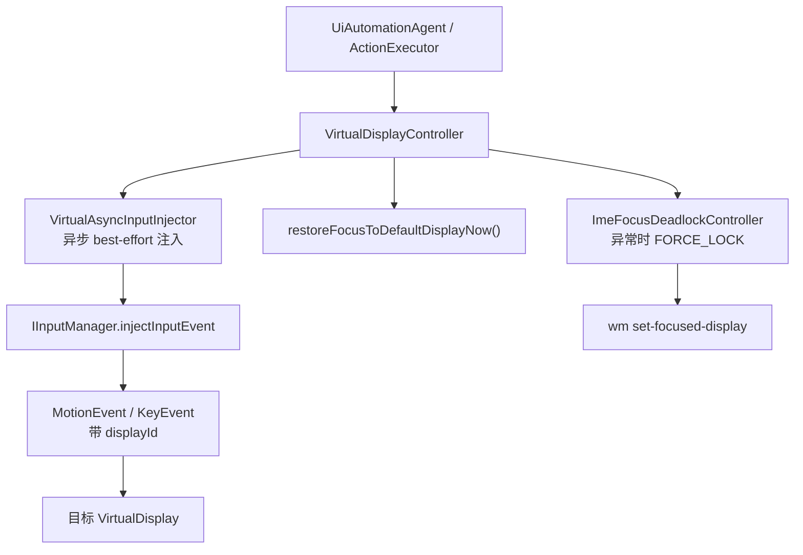

# 焦点管理与输入注入链路

本文档聚焦 Aries AI 当前虚拟屏实现里最容易被误解的一段链路：系统焦点并不长期停留在虚拟屏，但触摸、按键和输入仍然能够稳定命中目标显示。这背后的关键，是 display 维度的输入注入和一条独立的焦点自愈兜底链路。

---

## 概述

在很多虚拟屏方案里，开发者会通过不断切换系统焦点来“让输入生效”。Aries AI 当前实现选择了另一条路线：

- **常态路径**：主屏保持默认焦点，虚拟屏通过 `displayId` 接收输入事件。
- **异常路径**：当 IME 等特殊情况造成焦点死锁时，再启用强制锁焦逻辑做短时自愈。

这意味着“焦点管理”与“输入注入”在代码中是解耦的，而不是绑成一个动作。

## 交互链路总览

## 常态策略：不主动把系统焦点切到虚拟屏

`VirtualDisplayController.ensureFocusedDisplayBestEffort()` 在当前实现中是一个显式的 NO-OP。注释写得很清楚：

- 完全隔离模式下，焦点始终驻留在主屏（display 0）。
- 虚拟屏上的操作全部通过 `displayId` 定向注入完成。
- 截图阶段也不抢焦点，避免主屏物理返回键、Home 键误作用到虚拟屏。

这是一种非常明确的架构选择：

- 焦点切换会影响系统级输入路由。
- 用户真实操作仍然发生在主屏。
- 自动化执行只需要把事件送到正确的 `displayId`，不需要修改整个系统的当前焦点归属。

## 触摸与按键：`VirtualDisplayController` 到 `VirtualAsyncInputInjector`

控制器层对上暴露的是一组 best-effort 方法，例如：

- `injectTapBestEffort()`
- `injectSwipeBestEffort()`
- `injectLongPressBestEffort()`
- `injectBackBestEffort()`
- `injectHomeBestEffort()`
- `injectPasteBestEffort()`

这些方法的共同点是：

1. 先检查 `displayId > 0`
2. 再检查 `ShizukuBridge` 是否可用且已授权
3. 最后把实际注入委托给 `VirtualAsyncInputInjector`

也就是说，`VirtualDisplayController` 负责暴露“领域语义”，真正的输入事件构造与系统服务调用则交给注入器完成。

## `VirtualAsyncInputInjector` 的核心机制

`VirtualAsyncInputInjector` 负责解决两个问题：

### 1. 适配不同 Android / ROM 的注入签名

当前实现会反射寻找 `IInputManager.injectInputEvent` 的候选签名，并优先使用：

- `injectInputEvent(InputEvent, int mode)`
- 或兼容 `injectInputEvent(InputEvent, int displayId, int mode)`

这让它能够在不同 ROM 的隐藏 API 差异下继续工作，而不是假定所有系统都暴露完全一致的方法。

### 2. 把 `displayId` 写到事件对象里

在构造 `MotionEvent` / `KeyEvent` 后，注入器会通过 `InputEvent.setDisplayId()`（若系统提供）把目标 display 写进事件对象。

这一步是整个“完全隔离输入”成立的关键：

- 事件本身携带目标显示信息。
- 即使系统默认焦点还在主屏，事件仍可以被投递到虚拟屏。
- 因此不必在每次点击前后反复切换焦点。

## 异步与 best-effort

`VirtualAsyncInputInjector` 的另一个特征，是它不等待每一次事件返回成功结果，而是采用异步 best-effort 策略：

- 触摸事件按 down / move / up 分段提交
- 组合键（如 Ctrl+V）也只负责发送，不阻塞主流程
- 方法内部用 `runCatching` 吞掉失败，避免因为某次注入异常拖垮整个任务

这并不是“对失败不敏感”，而是因为自动化主循环更关心整体任务能否继续推进，而不是每个单独输入调用的同步返回值。

## 滑动与长按为何在控制器层展开

`injectSwipeBestEffort()` 与 `injectLongPressBestEffort()` 在控制器层做了一部分时序控制：

- 滑动会基于时长持续生成中间 move 点
- 长按会明确维护 down 与 up 之间的停留时间

这样做的好处是：

- 上层执行器只描述“做一个滑动/长按”
- 控制器统一决定事件节奏
- 注入器专注于“把单个事件打出去”

两层职责清晰，调试起来也更容易。

## 另一条注入链：`InputHelper`

仓库中还保留了一个 `InputHelper`，同样基于 `IInputManager` 反射做 display 维度触摸注入，并通过 `HandlerThread` 串行处理事件、合并高频 move。

从职责上看：

- `VirtualAsyncInputInjector` 更偏向控制器直接调用的轻量异步注入器
- `InputHelper` 更偏向需要队列化、去抖和统一线程处理的触摸辅助工具

它们共同说明了一点：当前虚拟屏体系的重点并不是“焦点怎么抢”，而是“如何稳定向指定 display 发事件”。

## 焦点自愈兜底：`ImeFocusDeadlockController`

虽然常态路径不抢焦点，但代码中仍保留了 `ImeFocusDeadlockController` 作为异常自愈机制，专门处理 IME 导致的焦点死锁：

- 周期性执行 `dumpsys window windows`
- 解析指定 `displayId` 上的输入法窗口状态
- 一旦发现 IME 活跃且可能导致路由异常，进入 `FORCE_LOCK`
- 高频执行 `wm set-focused-display <displayId>`，直到 IME 消失

这是一条很典型的“异常路径专用控制器”：

- 不参与日常普通输入
- 只在 IME 干扰严重时短时接管
- 退出条件清晰，IMЕ 消失后立即停止

## 一个值得注意的实现细节

`VirtualDisplayController.prepareForTask()` 在当前严格隔离路径下会主动停止 IME 焦点控制器，而不是默认启动它。原因是：

- 严格隔离模式的主策略是“不让虚拟屏持续抢焦点”
- 若默认一直运行锁焦控制器，反而会把焦点重新拉回虚拟屏
- IME 控制器因此更适合作为“必要时启用的自愈能力”，而不是常驻机制

这体现了当前实现对“隔离性优先级”的明确取舍。

## 退出与主屏恢复

任务结束时，`VirtualDisplayController.cleanup()` 会执行：

- 停止 IME 焦点控制器
- 停止 `ShizukuVirtualDisplayEngine`
- 调用 `restoreFocusToDefaultDisplay()` 把系统状态拉回主屏
- 清空 `activeDisplayId` 与 `shouldUseVirtualDisplay`

这一步是为了保证虚拟屏任务不会在退出后留下悬挂焦点或无效 display 状态。

## 结论

当前 Aries AI 的虚拟屏输入链路可以概括为一句话：

**常态不抢焦点，事件靠 displayId 定向注入；异常再用 IME 锁焦兜底。**

这让系统既能维持后台自动化的隔离性，又不会在普通场景下持续污染主屏交互。

## 相关文档

- [虚拟屏完全隔离总览](./虚拟屏完全隔离总览.md)
- [自动化引擎 / 动作执行器 (ActionExecutor)](../自动化引擎/动作执行器%20(ActionExecutor).md)
- [技术架构 / 数据流与核心链路](../技术架构/数据流与核心链路.md)
- [常见问题与支持 / 虚拟屏调试提示](../常见问题与支持/虚拟屏调试提示.md)
