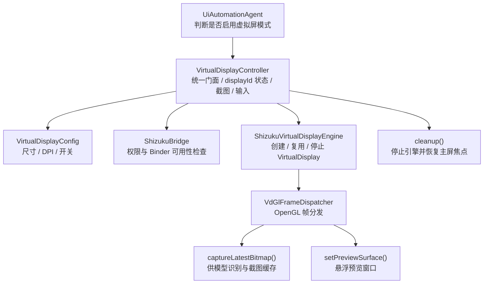

# 虚拟屏完全隔离总览

本文档说明 Aries AI 当前代码中的虚拟屏完全隔离实现，重点关注 VirtualDisplay 的创建、帧链路、截图策略、预览切换与资源清理，而不是停留在概念描述层。

---

## 概述

Aries AI 的虚拟屏方案并不是“把 App 投到第二块屏幕”这么简单，而是围绕下面几个目标展开：

- **完全隔离**：自动化操作尽量不干扰主屏的真实使用。
- **截图稳定**：模型看到的是持续产出的虚拟屏画面，而不是瞬时黑帧。
- **输入定向**：点击、滑动、按键通过 `displayId` 定向注入到目标虚拟屏。
- **生命周期可控**：任务开始时创建，任务结束后强制清理并恢复主屏焦点。

当前 Kotlin 侧的统一入口是 `VirtualDisplayController`，底层引擎是 `ShizukuVirtualDisplayEngine`。

## 架构总览

## 启动链路

当 `UiAutomationAgent` 检测到 `config.useBackgroundVirtualDisplay` 为真时，会先走一段显式的准备流程：

1. 记录日志，提示开始准备后台虚拟屏。
2. 调用 `VirtualDisplayController.prepareForTask(context, "")`。
3. 在控制器中检查 `ShizukuBridge.pingBinder()` 与 `hasPermission()`。
4. 读取 `VirtualDisplayConfig` 中缓存的宽、高、DPI。
5. 调用 `ShizukuVirtualDisplayEngine.ensureStarted(Args(...))` 创建或复用 VirtualDisplay。
6. 成功后保存 `activeDisplayId`，并把内容尺寸回传给 Agent。

一旦该步骤失败，当前实现会直接终止任务，而不是降级回主屏幕。原因很明确：

- 任务已经声明要在隔离模式下执行。
- 若静默降级到主屏，用户可能在不知情的情况下被前台操作打断。

## `VirtualDisplayController` 的职责边界

`VirtualDisplayController` 不是底层引擎本体，而是一个面向上层的 Facade，负责：

- 持有当前 `activeDisplayId`
- 暴露 `prepareForTask()`、`cleanup()`、`getContentSizeBestEffort()`
- 对外提供截图、点击、滑动、按键、粘贴等 best-effort 接口
- 在必要时把焦点恢复到默认主屏

从上层看，自动化执行层不需要知道 VirtualDisplay 是如何通过反射创建的，只需要通过控制器拿到可用的 `displayId` 即可。

## `ShizukuVirtualDisplayEngine` 的职责

底层引擎主要处理三件事：

1. **调用系统隐藏服务创建 VirtualDisplay**
   - 通过 Shizuku 拿到系统级 binder 权限
   - 反射调用显示管理相关接口
2. **管理输出 Surface**
   - 启动时默认把输出接到内部离屏链路
   - 需要预览时再切到 UI 提供的预览 Surface
3. **提供最新帧读取能力**
   - 通过 `captureLatestBitmap()` 把最新一帧交给上层截图逻辑

这里的核心思想是：VirtualDisplay 本身只负责“把目标应用画出来”，而截图缓存、预览切换和内容尺寸管理则由引擎周边链路完成。

## OpenGL 帧分发链路

当前实现不是直接从一个 Surface 做一次性截图，而是通过 `VdGlFrameDispatcher` 做中转：

- VirtualDisplay 输出到内部的输入 Surface
- OpenGL 线程持续消费帧
- 同一条链路同时支持：
  - 模型识别所需的截图
  - 悬浮窗预览所需的实时画面

这样做的好处是：

- 不需要在“截图”和“预览”之间频繁切换 VirtualDisplay 输出目标
- 可以复用同一份最新内容尺寸信息
- 更容易在出现黑帧时做轮询等待与判空处理

## 截图策略：为什么要等待非黑帧

`VirtualDisplayController.screenshotPngBase64NonBlack()` 会在一个短时间窗口里轮询最新帧，直到满足“不是黑屏”的条件才返回。

它做了两层保护：

- 在超时前反复读取 `captureLatestBitmap()` 的结果
- 通过采样像素判断是否仍然是大面积黑帧

这对自动化链路很关键，因为模型一旦收到黑屏截图，后续动作规划基本都会失真。

## 内容尺寸与坐标系

Agent 执行并不直接假定屏幕始终是固定分辨率。虚拟屏准备完成后，会调用 `getContentSizeBestEffort()` 获取当前真实内容尺寸：

- 优先使用 `ShizukuVirtualDisplayEngine.getLatestContentSize()`
- 如果离屏链路还没拿到有效尺寸，再回退到 `VirtualDisplayConfig`

这样坐标规划就能与当前虚拟屏真实内容保持一致，而不是被历史缓存的分辨率误导。

## 预览窗口与任务生命周期

当虚拟屏创建成功且任务正式进入循环后，`UiAutomationAgent` 会调用 `VirtualScreenPreviewOverlay.show()` 启动预览悬浮窗。

这意味着当前模式并不是“只在后台默默运行”，而是给用户一条可观察但不强制切回前台的预览通路。

与此相对，任务结束或异常退出时会统一进入 `cleanupVirtualDisplay()` / `VirtualDisplayController.cleanup()`，执行：

- 停止虚拟屏引擎
- 恢复主屏焦点
- 清空 `activeDisplayId`
- 把 `shouldUseVirtualDisplay` 复位为 `false`

## 为什么说它是“完全隔离”

当前代码最关键的设计选择，是**不依赖系统焦点持续停留在虚拟屏**。相反，它采用的是：

- 主屏保持默认焦点
- 所有虚拟屏操作通过 `displayId` 注入到目标显示
- 截图过程不抢焦点
- 退出时明确恢复默认主屏状态

因此“完全隔离”的含义不是让虚拟屏永远抢占系统焦点，而是让虚拟屏在后台拥有独立的画面与输入通道，同时尽量不污染主屏交互。

## 失败路径与清理策略

当前实现对失败场景采用的是“快速失败 + 强清理”策略：

- Shizuku 未就绪：直接返回 `null`
- VirtualDisplay 创建失败：停止任务，不降级到主屏
- 截图不可用：在虚拟屏模式下直接报错结束
- 任务 finally：无论正常结束还是异常退出，都执行清理

对自动化系统来说，这比静默降级更可控，因为失败语义清晰，且不会把用户带到一个与预期不一致的执行环境。

## 相关文档

- [焦点管理与输入注入链路](./焦点管理与输入注入链路.md)
- [技术架构 / 整体架构设计](../技术架构/整体架构设计.md)
- [自动化引擎 / 自动化 Agent 主循环](../自动化引擎/自动化%20Agent%20主循环.md)
- [系统服务与权限 / 设备控制器 (DeviceController)](../系统服务与权限/设备控制器%20(DeviceController).md)
